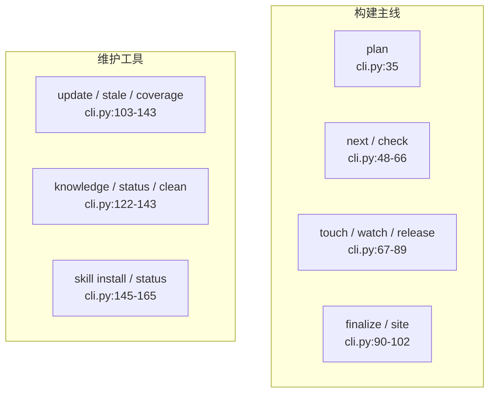
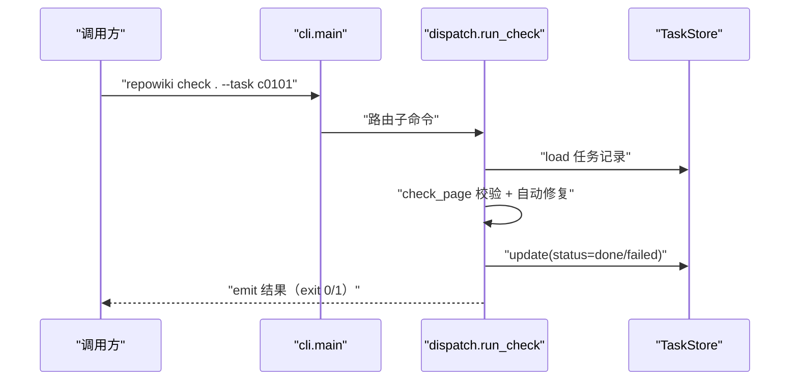

# CLI 命令参考

<cite>
**本文引用的文件**
- [src/repowiki/cli.py](file://src/repowiki/cli.py)
- [src/repowiki/output.py](file://src/repowiki/output.py)
- [src/repowiki/errors.py](file://src/repowiki/errors.py)
</cite>

## 目录
1. [简介](#简介)
2. [接口清单与分组](#接口清单与分组)
3. [请求处理时序](#请求处理时序)
4. [接口契约与错误码](#接口契约与错误码)
5. [鉴权与访问控制](#鉴权与访问控制)
6. [配额、幂等与限流](#配额幂等与限流)
7. [故障排查指南](#故障排查指南)
8. [结论](#结论)

## 简介
repowiki 的对外接口面即 `repowiki` 命令行：15 个子命令覆盖 wiki 的构建主线与日常维护。接口面向两类调用者——人类用户（人类可读输出）与驱动 agent（固定加 `--json` 消费结构化输出），两者的输出内容一致、渲染不同。全部命令定义集中在 `cli.py` 的 build_parser 一个函数里，主入口 main 只做路由与异常翻译，这个单点定义就是稳定性契约。

章节来源
- [src/repowiki/cli.py:27-35](file://src/repowiki/cli.py#L27-L35)

## 接口清单与分组
15 个命令按「构建主线 / 维护工具」分为两组，每个接口都可追溯到 cli.py 中的注册行。逐命令清单如下（接口名附定义位置引用）：

- 构建主线：
  - plan：扫描 + 生成任务清单，[cli.py:35](file://src/repowiki/cli.py#L35)
  - next：领取就绪任务，[cli.py:48](file://src/repowiki/cli.py#L48)
  - check：校验产出并翻转状态，[cli.py:55](file://src/repowiki/cli.py#L55)
  - touch / watch / release：心跳、等待、重置，[cli.py:67-89](file://src/repowiki/cli.py#L67-L89)
  - finalize / site：元数据汇总与站点打包，[cli.py:90-101](file://src/repowiki/cli.py#L90-L101)
- 维护工具：
  - update / stale / coverage：增量更新、过期门禁、覆盖率，[cli.py:103-139](file://src/repowiki/cli.py#L103-L139)
  - knowledge / status / clean：知识卡片、统计、清状态，[cli.py:122-143](file://src/repowiki/cli.py#L122-L143)
  - skill install / status：agent skill 分发管理，[cli.py:145-165](file://src/repowiki/cli.py#L145-L165)

分组的价值在于心智负担的分配：初次使用只需要主线八个命令；维护工具只在代码演进后（update/stale）、质量盘点时（coverage）、能力扩展时（knowledge/skill）才需要。两组命令共享同一套 `--json` 与退出码契约。

图表来源
- [src/repowiki/cli.py:35-165](file://src/repowiki/cli.py#L35-L165)

章节来源
- [src/repowiki/cli.py:35-165](file://src/repowiki/cli.py#L35-L165)

## 请求处理时序
以一次 check 调用为例说明命令的通用处理路径：main() 解析参数并路由到 run_check，run_check 读取任务记录、按任务类型分派校验函数、把可修复缺陷回写产物、翻转任务状态，最后由 emit 统一按人类或 JSON 模式输出。所有命令都走这条「路由 → 读状态 → 执行 → 写状态 → emit」的管道，差异只在中间的执行函数。

从图中可以看出两个对所有命令成立的约定：TaskStore 是唯一的状态读写点（命令自身不直接改 index.json）；emit 是唯一的输出口（命令内部不自行 print），这保证了 --json 输出永远是单一可解析的 JSON 对象。

图表来源
- [src/repowiki/cli.py:170-187](file://src/repowiki/cli.py#L170-L187)

章节来源
- [src/repowiki/dispatch.py:205-262](file://src/repowiki/dispatch.py#L205-L262)

## 接口契约与错误码
契约的第一部分是逐命令的关键参数约定；第二部分是全命令共用的错误码语义。错误码用表格给出，便于按码速查：

| 退出码 | 含义 | 典型触发条件 |
|---|---|---|
| 0 | 成功 | 校验通过；watch 全部完成；finalize 第二步 |
| 1 | 校验失败或用法错误 | UsageError；check 的 errors 非空；stale --fail-if-stale 命中过期 |
| 2 | 状态冲突 | 任务被其他 worker 认领；touch/release 的 worker 身份不符；release 未加 --force |
| 3 | 进展性等待 | finalize 第一次返回（已创建 overview 任务，完成后重跑） |

逐命令关键参数：

- plan \<repo\>：--locale auto|zh|en、--max-pages N、--replan、--force
- next \<repo\>：--claim（原子认领并返回完整 instructions）、--worker、--json
- check \<repo\>：--task ID、--all（仅 in_progress/failed，崩溃恢复）、--worker、--force（代校验他人任务）
- touch \<repo\>：--task ID + --worker（须与认领者一致，否则 exit 2）
- watch \<repo\>：--interval、--timeout；退出码 0=完成、1=停滞或超时
- release \<repo\>：--task ID、--force（重置已耗尽任务必需）
- finalize \<repo\>：两步制，无额外参数
- site \<repo\>：--open 直接打开浏览器
- update \<repo\>：--since 基线、--dirty（纳入未提交/未跟踪变更）
- stale \<repo\>：--since、--fail-if-stale（CI 门禁）
- coverage \<repo\>：无必选参数
- knowledge \<repo\>：--categories FILE（整表替换内置六类）
- status / clean \<repo\>：无必选参数（clean 不可逆，删整个 state/）
- skill install：--agent claude|codex|zcode|cursor|opencode；skill status：查看已装版本

契约的另一约定是输出模式：emit 是唯一输出口（[output.py:18-33](file://src/repowiki/output.py#L18-L33)），--json 与人类模式互斥，JSON 输出永远是单一对象。

章节来源
- [src/repowiki/cli.py:2-25](file://src/repowiki/cli.py#L2-L25)

章节来源
- [src/repowiki/output.py:18-33](file://src/repowiki/output.py#L18-L33)

## 鉴权与访问控制
repowiki 是纯本地工具：无认证、无网络、无远程资源，访问控制等价于文件系统权限——能写 `.repowiki/` 就能操作一切。唯一的"互斥控制"在任务认领层：check/release 等写操作会比对 claims 目录中的 worker 身份（主机名:进程号），非持有者调用返回 exit 2。这个机制的目的不是安全（本地场景无攻击面）而是并发正确性：防止两个 agent 同时校验同一任务导致状态错乱；`--force` 是人工仲裁的逃生门，明确把决定权交给调用者。

章节来源
- [src/repowiki/state.py:247-280](file://src/repowiki/state.py#L247-L280)

## 配额、幂等与限流
本地单机工具没有配额与限流概念——没有共享资源需要保护。幂等性则是刻意的接口约定，每个写命令的重入语义如下：

- plan：幂等，重复执行基于现有 catalog 重生成规格；--replan --force 才推倒重来
- next --claim：天然互斥（mkdir 原子性），并发调用各得不同任务或空
- check：pending/failed 任务可反复重查翻转状态；done 为终态只读复核，永不翻转
- finalize：两步制各自可安全重入；缺页时拒绝且不留半成品
- site：幂等，随时重打包；update：基于变更集重新武装任务，done 任务也能接到新变更

无重试语义是刻意的：所有失败都落盘为 failed 状态由调用方决定重试，CLI 不做隐藏重试——这让"重试几次了"始终是显式状态（attempts 字段）而非黑盒。

章节来源
- [src/repowiki/plan.py:116-126](file://src/repowiki/plan.py#L116-L126)

## 故障排查指南
接口面的排错思路：先读退出码（上表），再按命令查对应环节的明细输出。高频场景如下：

- --json 输出解析失败：确认 stdout 未被人类可读输出污染——两种模式互斥，混用管道时只保留一种
- exit 2 且提示任务被认领：status 查看 worker 字段确认持有者是谁；是自己的任务用 touch 续期，是他人的用 release --force 抢占（先确认对方确实已停止）
- exit 1 但看不出哪个任务失败：--json 输出的 results 数组逐项看 errors，或改用 --task 单查
- 命令行为与本文档不符：确认 `repowiki --version` 与文档版本一致，旧版 CLI 的行为差异以 CHANGELOG 为准
- 子命令记不住：repowiki --help 列出全部命令；构建主线八个命令覆盖 90% 场景，维护工具按需查阅上方「接口清单与分组」

章节来源
- [src/repowiki/errors.py:12-21](file://src/repowiki/errors.py#L12-L21)

## 结论
CLI 接口面的设计要点是"稳定契约 + 双输出模式 + 语义化退出码"：15 个子命令按构建/维护分组让学习曲线平缓，--json 与退出码让 agent 和 CI 无需解析文本即可编排。扩展新能力时按「构建主线/维护工具」归组、在 build_parser 单点注册，接口面就能持续保持可查、可猜、可自动化。

章节来源
- [src/repowiki/cli.py:27-35](file://src/repowiki/cli.py#L27-L35)
