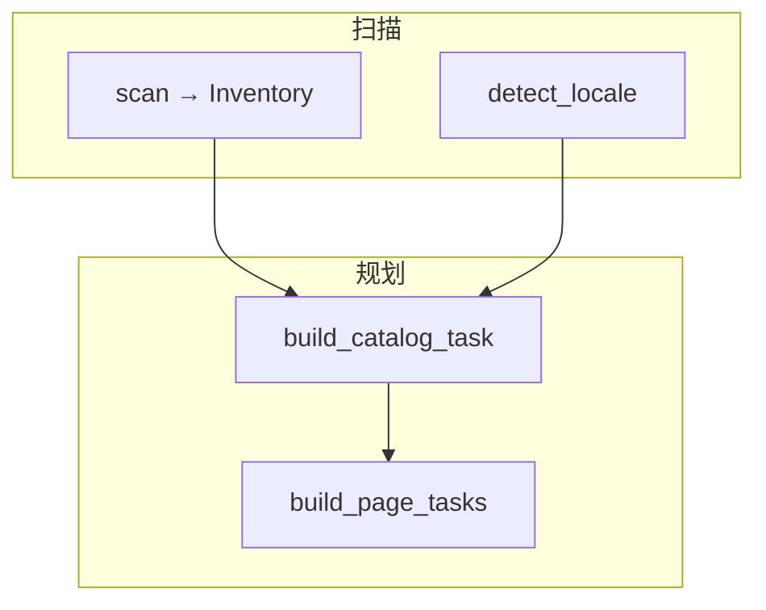
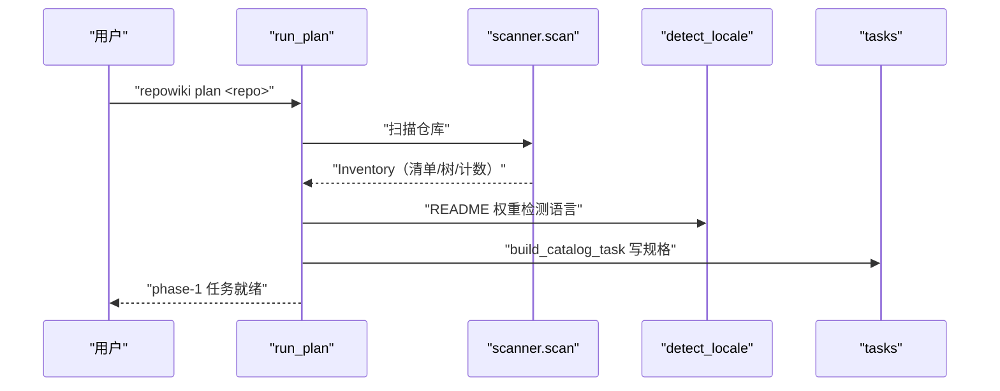
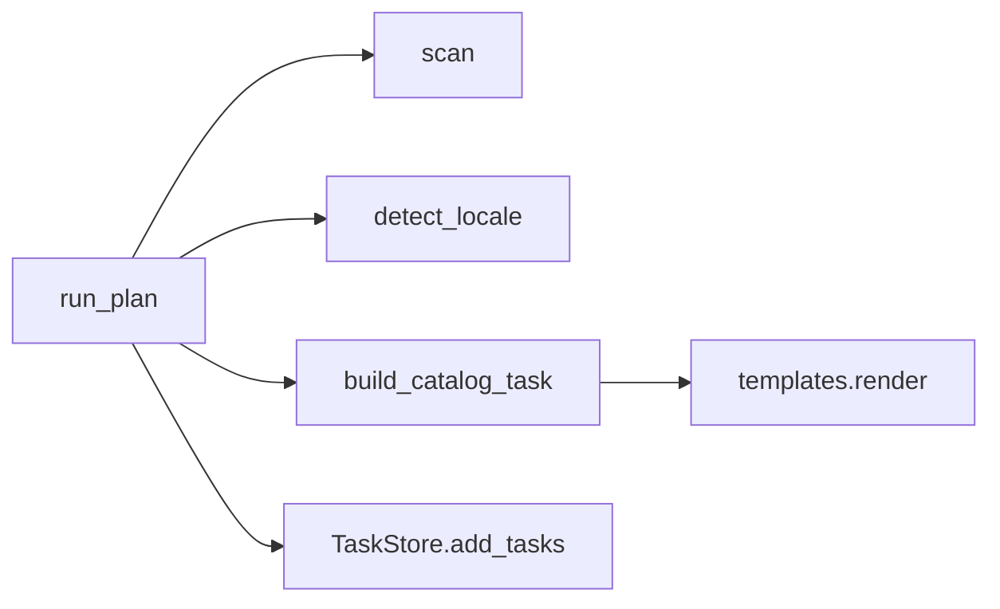

# 仓库扫描与任务规划

<cite>
**本文引用的文件**
- [src/repowiki/scanner.py](file://src/repowiki/scanner.py)
- [src/repowiki/plan.py](file://src/repowiki/plan.py)
- [src/repowiki/tasks.py](file://src/repowiki/tasks.py)
- [src/repowiki/i18n.py](file://src/repowiki/i18n.py)
</cite>

## 目录
1. [简介](#简介)
2. [项目结构](#项目结构)
3. [核心组件](#核心组件)
4. [架构总览](#架构总览)
5. [详细组件分析](#详细组件分析)
6. [依赖关系分析](#依赖关系分析)
7. [性能与一致性考量](#性能与一致性考量)
8. [故障排查指南](#故障排查指南)
9. [结论](#结论)

## 简介
plan 命令是 wiki 生成的起点：扫描目标仓库得到文件清单与摘要、检测产出语言，然后生成 phase-1 的 catalog 规划任务。它的设计刻意保持"轻"——全部输出只有一份任务规格与一条任务记录，不做任何 AST 解析、依赖分析或调用图构建；仓库的语义理解（章节怎么分、每页写什么、用什么原型）全部发生在 agent 消费规格之后。这种"确定性信息由 CLI 产、语义判断由 agent 做"的分工是 repowiki 与其他 wiki 生成器最根本的差异。

章节来源
- [src/repowiki/plan.py:38-60](file://src/repowiki/plan.py#L38-L60)

## 项目结构
plan 阶段横跨四个模块，各自的职责边界清晰：scanner 产出清单、i18n 定语言、tasks 渲染规格、plan 串联全局。下图是它们的数据流，箭头上的标注即传递的核心数据：

注意 build_page_tasks 并不在 plan 当次执行——它由 catalog check 触发展开；画在图里是为了呈现完整的规划链路：同一份 Inventory 先后喂给两个规格构建器。

图表来源
- [src/repowiki/scanner.py:116-148](file://src/repowiki/scanner.py#L116-L148)

章节来源
- [src/repowiki/tasks.py:61-91](file://src/repowiki/tasks.py#L61-L91)

## 核心组件
规划阶段的核心抽象只有三个，都是纯数据结构或纯函数：

- FileEntry / Inventory：每个文件的 path、行数、语言、是否代码四元组，汇总成含 key_files 与 tree_summary 的清单对象——这是 agent 看到的"仓库名片"
- tree_summary：紧凑文件树，每目录最多 20 个文件、总计 400 行，防止超大仓库撑爆规划上下文
- build_catalog_task：把仓库名、文件树、代码清单（截断至 FILE_LIST_CAP=800 条）与 JSON Schema、8 条规划规则渲染成一份自包含规格
- 扩展点：规格占位符体系（`{{TREE_SUMMARY}}` 等）由 templates.render 统一替换，未提供的占位符故意保留原样让校验器能发现遗漏

章节来源
- [src/repowiki/scanner.py:55-73](file://src/repowiki/scanner.py#L55-L73)

## 架构总览
plan 的执行时序如下：run_plan 先扫仓库、再定语言、然后写规格、最后登记任务。全程只有读仓库与写 state 两种 I/O，没有网络与子进程调用。

图中的顺序保证了一个细节：语言检测发生在规格生成之前，因此规格里的规则文本（中文或英文）与最终产出语言一致——agent 拿到的规格就是它该写的语言。

图表来源
- [src/repowiki/plan.py:38-75](file://src/repowiki/plan.py#L38-L75)

章节来源
- [src/repowiki/i18n.py:217-242](file://src/repowiki/i18n.py#L217-L242)

## 详细组件分析
### 扫描器（scanner.py）
- 职责：生成仓库文件清单，是 Inventory 的唯一来源；只读文件名与头部字节、不解析内容，数千文件的仓库扫描在百毫秒级完成
- 关键行为：git 仓库优先 `git ls-files`（.gitignore 感知且包含子模块跟踪文件），非 git 仓库退化 os.walk + 目录剪枝（node_modules、.git 等忽略）；二进制探测读头部 8KB 找 `\0`；按扩展名映射语言并统计行数

章节来源
- [src/repowiki/scanner.py:74-115](file://src/repowiki/scanner.py#L74-L115)

### 语言检测（i18n.py）
- 职责：决定 wiki 的产出语言（zh/en 二选一，语言集已冻结）
- 关键行为：README 的 CJK/Latin 字符比 ≥15% 判 zh；README 文本太少不足定夺时，抽样 24 个源码文件找大量 CJK 注释；README.en.md 等翻译兄弟文件不会盖过主 README（避免排序意外翻盘）
- 实现要点：代码里的标识符永远拉丁字母，因此不稀释 README 的信号——这个细节让检测只看"自然语言文本"

章节来源
- [src/repowiki/i18n.py:217-242](file://src/repowiki/i18n.py#L217-L242)

### 任务规划（plan.py + tasks.py）
- 职责：登记 catalog 任务；已有合法 catalog 时跳过规划直接 flatten 展开页面任务
- 配置面：--locale 覆盖检测并持久化到 state/locale；--max-pages N 限制首批页面；--replan 遇在途任务拒绝、加 --force 重置；MIN_CODE_FILES=10 是硬门槛
- 实现要点：plan 幂等——同 catalog 同输出，重复执行不产生重复任务

章节来源
- [src/repowiki/plan.py:77-104](file://src/repowiki/plan.py#L77-L104)

## 依赖关系分析
plan 阶段的依赖分为两档，全部指向下层模块，自身不依赖任何编排同伴（dispatch 由 check 阶段接力）：

- 必选：scan（清单）、detect_locale（语言）、build_catalog_task（规格）、TaskStore.add_tasks（登记）——plan 主链路缺一不可
- 复用：tasks → templates 的占位符渲染（规格构建只是把模板文件里的占位符填上真实值，没有任何业务逻辑在渲染层）

图中没有 plan → dispatch 的边：阶段之间只靠 state 里的任务记录衔接，这也是断点续跑在架构上成立的原因。

图表来源
- [src/repowiki/tasks.py:61-91](file://src/repowiki/tasks.py#L61-L91)

章节来源
- [src/repowiki/tasks.py:19-51](file://src/repowiki/tasks.py#L19-L51)

## 性能与一致性考量
- 扫描只读文件名与头部字节，不解析内容，几千文件的仓库秒级完成
- 文件清单截断至 800 条（FILE_LIST_CAP），超大 monorepo 的规划上下文有确定性上界
- 同一仓库重复 plan 的任务清单完全确定（同 catalog 同输出），这让 plan 可以安全地放 CI 里反复执行
- 目录评审回路：plan 之后人工修改 state/catalog.json 再重新 plan，是调整章节结构与深度的事实配置面——这是有意设计的「人工在环」入口

章节来源
- [src/repowiki/tasks.py:19-19](file://src/repowiki/tasks.py#L19-L19)

## 故障排查指南
本阶段的故障几乎都能从 plan 的报错类别直接定位，思路是先分清"拒绝生成"还是"生成错误"：

- plan 报「代码文件太少」：MIN_CODE_FILES=10 的有意拒绝；确认仓库确实是代码仓库而非文档仓
- 语言检测错误：--locale 显式指定；若 README 是英文但代码注释是中文且 README 太短，抽样逻辑可能判 zh——加长 README 或显式指定
- 展开的页面缺 dependent_files：catalog 引用了清单外路径，validate_catalog 已剔除并告警，修正 catalog 后重跑 plan
- --replan 拒绝：存在 in_progress/failed 任务，先收尾或 --force；注意 --force 会丢弃在途任务的规格

章节来源
- [src/repowiki/plan.py:17-27](file://src/repowiki/plan.py#L17-L27)

## 结论
扫描与规划把"轻"做到了极致：确定性信息（文件、行数、语言）由 CLI 产，结构判断（章节、原型、要点）由 agent 做，两者交接面只有一份规格。对想仿制这套规划机制的项目，值得抄的不是扫描器本身而是分工原则：确定性信息采集到「语义判断刚好能开始」为止，多一分都是浪费，少一分则 agent 会开始瞎猜。

章节来源
- [src/repowiki/plan.py:38-60](file://src/repowiki/plan.py#L38-L60)
