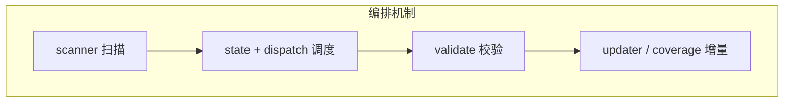
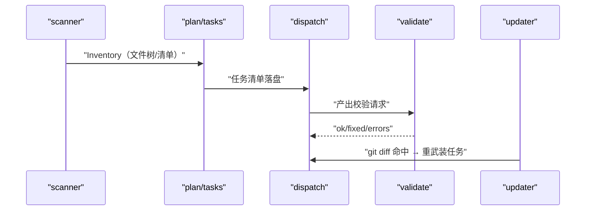
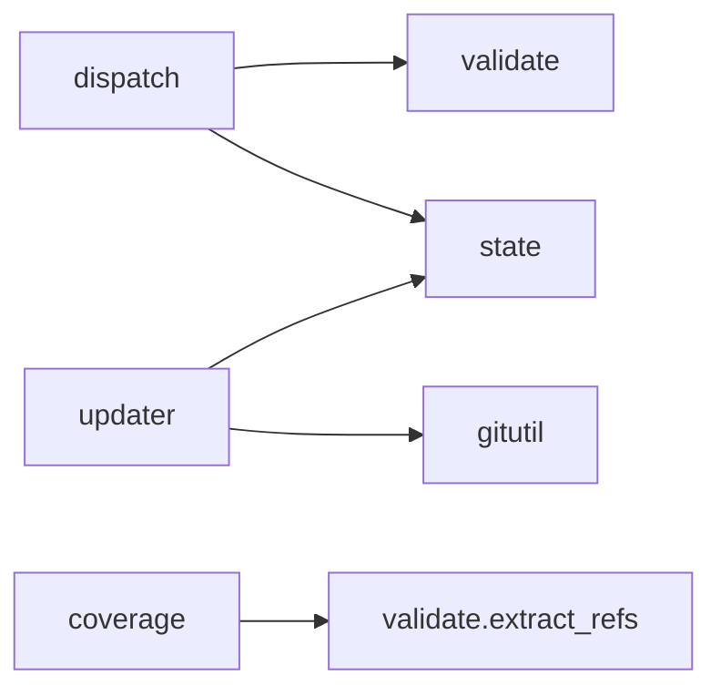

# 任务编排与校验

<cite>
**本文引用的文件**
- [src/repowiki/scanner.py](file://src/repowiki/scanner.py)
- [src/repowiki/dispatch.py](file://src/repowiki/dispatch.py)
- [src/repowiki/validate.py](file://src/repowiki/validate.py)
- [src/repowiki/updater.py](file://src/repowiki/updater.py)
</cite>

## 目录
1. [简介](#简介)
2. [项目结构](#项目结构)
3. [核心组件](#核心组件)
4. [架构总览](#架构总览)
5. [详细组件分析](#详细组件分析)
6. [依赖关系分析](#依赖关系分析)
7. [性能与一致性考量](#性能与一致性考量)
8. [故障排查指南](#故障排查指南)
9. [结论](#结论)

## 简介
本章覆盖 repowiki 编排侧的四个机制：仓库扫描与任务规划、任务领取与并发调度、校验器与自动修复、增量更新与过期门禁。它们共同回答一个问题——"多个 agent 并行写 wiki，怎么保证安全、可续跑、可门禁"。四个机制的共同气质是确定性：扫描不做语义分析、调度不做智能分配、校验只抓可计算缺陷、增量只认文件交集，语义判断全部留给 agent。

章节来源
- [src/repowiki/dispatch.py:50-77](file://src/repowiki/dispatch.py#L50-L77)

## 项目结构
四个机制各自落在明确的模块边界内，彼此只通过任务状态与文件系统衔接。下图是它们的协作流水线，也是本章四篇子页的阅读地图：

顺着箭头读本章即可：扫描产出清单喂给规划，规划出的任务进入调度循环，调度送出的产出被校验放行，放行的内容在代码演进后由增量机制接手。

章节来源
- [src/repowiki/updater.py:99-140](file://src/repowiki/updater.py#L99-L140)

## 核心组件
四个机制各有一个核心抽象，记住它们就记住了本章：

| 核心抽象 | 所在文件 | 一句话职责 |
|---|---|---|
| Inventory | src/repowiki/scanner.py | 文件清单 + 关键文件 + 截断树，规划任务能看到的全部仓库信息 |
| TaskStore | src/repowiki/state.py | 原子认领、心跳续期、过期回收的唯一实现点（约 437 行） |
| check_page | src/repowiki/validate.py | 分层校验引擎，自动修复与 error 打回的分界线画在"可计算"上 |
| map_affected | src/repowiki/updater.py | 把变更文件映射为受影响页面 + 祖先链，增量更新的核心算法 |

章节来源
- [src/repowiki/scanner.py:55-73](file://src/repowiki/scanner.py#L55-L73)

## 架构总览
四个机制串联成一条覆盖 wiki 全生命周期的流水线：扫描产出清单 → 清单喂给规划任务 → 任务被并发领取 → 产出被校验放行 → 代码变更后被增量机制重新武装。下图强调"重新武装"这条回边——它让流水线成为闭环而非单向道：

图中 updater 的回边不经过 plan：增量复用既有 catalog 与任务记录，只重置命中的任务——这是"最小重写"原则的结构保证。

图表来源
- [src/repowiki/updater.py:43-54](file://src/repowiki/updater.py#L43-L54)

章节来源
- [src/repowiki/dispatch.py:205-262](file://src/repowiki/dispatch.py#L205-L262)

## 详细组件分析
本章四篇子页的导航如下，先看表再按需阅读：

| 子页 | 核心机制 | 一句话职责 |
|---|---|---|
| 仓库扫描与任务规划 | Inventory / detect_locale / 规格渲染 | plan 阶段的确定性信息采集与任务登记 |
| 任务领取与并发调度 | 原子认领 / 心跳 / 过期回收 / watch | 多 agent 并发的全部并发语义 |
| 校验器与自动修复 | check_page / 自动修复 / 小节来源强制 | 产出质量的确定性闸门 |
| 增量更新与过期门禁 | map_affected / stale / coverage | wiki 的持续保鲜与覆盖盲区统计 |

### 扫描与规划（子页：仓库扫描与任务规划）
- 职责：git ls-files 优先的文件清单、README 权重的语言检测、catalog/页面规格渲染
- 配置面：MIN_CODE_FILES=10 门槛、FILE_LIST_CAP=800 清单截断

章节来源
- [src/repowiki/plan.py:38-75](file://src/repowiki/plan.py#L38-L75)

### 调度与并发（子页：任务领取与并发调度）
- 职责：FIFO 发放当前阶段就绪任务、认领互斥、心跳与过期自愈、停滞报告
- 配置面：REPOWIKI_STALE_SECONDS 过期窗口、REPOWIKI_MAX_ATTEMPTS 毒任务上限

章节来源
- [src/repowiki/state.py:219-245](file://src/repowiki/state.py#L219-L245)

### 校验与增量（子页：校验器与自动修复 / 增量更新与过期门禁）
- 职责：按 archetype 查必备小节表校验产出、自动修复确定性缺陷；按变更文件映射需要重写的页面
- 阈值语义：MIN_SECTIONS=6 与 MIN_MERMAID=2 是页面完整性底线，校验宁可宽松不可误杀——误杀的成本是信任

章节来源
- [src/repowiki/updater.py:43-54](file://src/repowiki/updater.py#L43-L54)

## 依赖关系分析
四个机制全部构建于基础设施层（state/paths/i18n/gitutil）之上，彼此之间的依赖也很克制——图中是真实存在的依赖边：

图中 coverage → extract_refs 这条边值得注意：覆盖率统计复用校验器的引用解析而非重新实现——同一份 file:// 引用只有一种解析口径，coverage 的数字才与页面的实际引用一致。

图表来源
- [src/repowiki/updater.py:10-17](file://src/repowiki/updater.py#L10-L17)

章节来源
- [src/repowiki/coverage.py:24-40](file://src/repowiki/coverage.py#L24-L40)

## 性能与一致性考量
- 认领用原子 mkdir，无锁竞争；index.json 全程文件锁 + 原子替换写，多进程状态翻转零丢失
- 页面任务互相独立，N 个 agent 并行不产生写冲突；并行度只受 agent 数量限制
- 过期窗口 REPOWIKI_STALE_SECONDS 是"误抢活任务"与"死等死进程"之间的权衡，默认 15 分钟对长任务偏紧时可调大
- 故障隔离：任何一环失败都落盘为 failed 状态而非中断流水线，其余任务照常推进；「哪一环坏了」由状态字段直接回答

章节来源
- [src/repowiki/state.py:21-33](file://src/repowiki/state.py#L21-L33)

## 故障排查指南
编排侧的故障定位思路：先确定卡在流水线哪一环（扫描→规划→调度→校验→增量），再看那一环的状态载体（catalog.json / index.json / claims/ / errors 列表）。常见场景如下：

- 任务卡在 in_progress：持有者崩溃则等过期窗口后由 next 自动回收，急用 release --force；先 status 确认 worker 是否还活着
- check 报「缺少必备小节」：按页面 archetype 对照对应小节表补齐，注意六原型各有专属表
- update 没命中任何页：变更文件不在任何页面的 dependent_files 里，属正常现象而非 bug；确认基线 --since 取值是否正确
- 校验结果不可复现：check 是纯函数式的，若同产出不同结论，优先怀疑两次校验之间仓库文件被修改

章节来源
- [src/repowiki/dispatch.py:91-98](file://src/repowiki/dispatch.py#L91-L98)

## 结论
编排侧的设计哲学是"机制确定、语义外包"：扫描、调度、校验、增量全部是可单测的确定性代码，agent 只负责规格内的语义工作。这个分工的直接收益是本章所有机制都有秒级回归测试，而 agent 的产出质量由校验器给出客观边界。四个子页可按流水线顺序阅读，也可按需直查。

章节来源
- [src/repowiki/dispatch.py:50-77](file://src/repowiki/dispatch.py#L50-L77)
