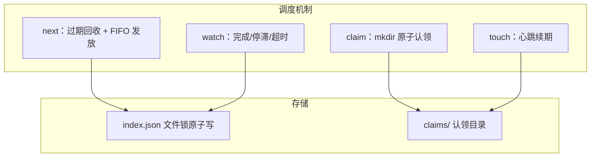
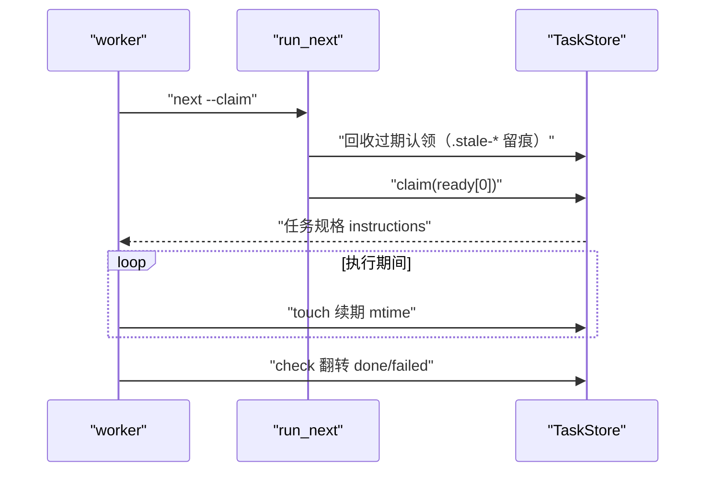
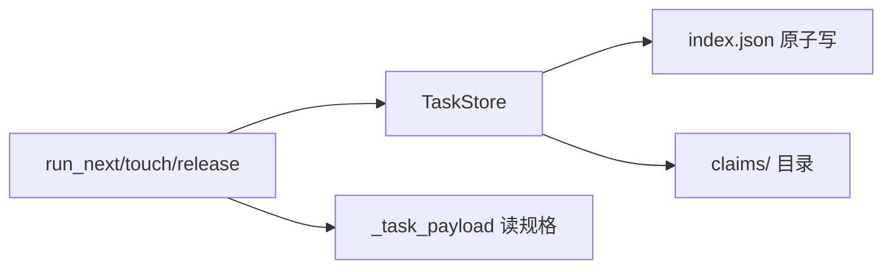

# 任务领取与并发调度

<cite>
**本文引用的文件**
- [src/repowiki/state.py](file://src/repowiki/state.py)
- [src/repowiki/dispatch.py](file://src/repowiki/dispatch.py)
- [src/repowiki/cli.py](file://src/repowiki/cli.py)
</cite>

## 目录
1. [简介](#简介)
2. [项目结构](#项目结构)
3. [核心组件](#核心组件)
4. [架构总览](#架构总览)
5. [详细组件分析](#详细组件分析)
6. [依赖关系分析](#依赖关系分析)
7. [性能与一致性考量](#性能与一致性考量)
8. [故障排查指南](#故障排查指南)
9. [结论](#结论)

## 简介
并发调度解决"多个 agent / 进程 / 人同时推进同一仓库"的问题：任务用原子 mkdir 认领互斥，用心跳续期表明存活，过期认领被自动回收重新入队，毒任务有 attempts 上限，watch 命令把"全部完成"与"停滞卡死"区分成不同退出码。全部机制集中在 state.py 一个文件（约 437 行），没有守护进程、没有消息队列、没有分布式锁——文件系统就是协调器。理解本页的关键是接受一个前提：repowiki 是短命 CLI 进程，记录在任务里的 pid 没有存活意义，心跳是唯一的存活信号。

章节来源
- [src/repowiki/state.py:10-33](file://src/repowiki/state.py#L10-L33)

## 项目结构
调度机制由两个文件承载：state.py 实现机制本体（TaskStore + 认领目录），dispatch.py 实现面向用户的命令语义。下图是机制与存储的对应关系，每个调度动作都能追溯到一种存储变化：

从图中可以看出存储的分工：claims/ 记录"瞬时占用"（随认领生灭），index.json 记录"持久状态"（跨中断存续）——前者是互斥的手段，后者是续跑的依据。

图表来源
- [src/repowiki/state.py:247-280](file://src/repowiki/state.py#L247-L280)

章节来源
- [src/repowiki/dispatch.py:127-203](file://src/repowiki/dispatch.py#L127-L203)

## 核心组件
四个核心机制对应四个方法/函数，它们共同实现了一套"无协调者"的并发协议：

- TaskStore.claim：mkdir EEXIST 即互斥——目录存在就是被占，无需检查再创建的双步竞态
- ready_tasks：只发放当前最浅未完成 phase 的就绪任务，FIFO 每次一个——阶段门控与单任务发放都发生在这里
- _claim_stale：认领目录 mtime 超过 REPOWIKI_STALE_SECONDS（默认 900 秒）即判定过期，是死进程的唯一回收延迟
- run_watch：把「全部完成」与「停滞/超时」分别映射为 exit 0/1——CI 等待生成完成的唯一正确姿势，不需要轮询脚本
- 扩展点：过期窗口与 attempts 上限（REPOWIKI_MAX_ATTEMPTS，默认 3）都可用环境变量调整，无需改代码

章节来源
- [src/repowiki/state.py:219-245](file://src/repowiki/state.py#L219-L245)

## 架构总览
调度循环的主体是 worker 侧的三个动作与系统侧的一个自愈动作。下图是标准生命周期，注意"回收"发生在下一个 worker 的 next 里而非后台线程——repowiki 没有任何常驻进程，自愈由队列的后来者顺手完成：

从图中可以看出协议的全部成本：worker 只需记得周期性 touch 一次。忘记 touch 的代价是任务在过期窗口后被别人抢走重做（attempts+1），而不是死锁——这也是为什么 skill 文档把 touch 列为执行期的强制动作。

图表来源
- [src/repowiki/dispatch.py:50-77](file://src/repowiki/dispatch.py#L50-L77)

章节来源
- [src/repowiki/state.py:281-340](file://src/repowiki/state.py#L281-L340)

## 详细组件分析
### 认领与过期回收
- 职责：互斥发放与死进程自愈
- 关键行为：过期认领改名 `.stale-*` 留审计痕（可事后追查哪个 worker 死了），attempts+1 后任务重新入队，毒任务上限照常生效——回收不豁免上限，坏任务不会无限重生

章节来源
- [src/repowiki/state.py:247-280](file://src/repowiki/state.py#L247-L280)

### watch 停滞报告
- 职责：阻塞至全部完成（exit 0）或停滞/超时（exit 1），是 CI 等待生成完成的标准姿势
- 关键行为：过期认领不计入「执行中」——worker 全灭时队列立即呈现 stalled 而非假装还有人在干活干等到超时
- 配置面：--interval 轮询间隔、--timeout 总时限，两者共同决定 CI 侧的等待预算

章节来源
- [src/repowiki/dispatch.py:127-203](file://src/repowiki/dispatch.py#L127-L203)

### release 与 status
- 职责：人工重置 in_progress/failed 任务；统计进度、失败明细与过期认领
- 关键行为：release 无 --force 时拒绝重置已耗尽任务（exit 2）——重置毒任务是显式的人工决定；status 是排障的第一站，worker/heartbeat 字段直接回答"谁在做、还活着吗"

章节来源
- [src/repowiki/dispatch.py:91-118](file://src/repowiki/dispatch.py#L91-L118)

## 依赖关系分析
调度机制的依赖面极窄，且全部是必选主链：dispatch 的调度命令依赖 state 的 TaskStore 与 paths 的目录布局；规格内容通过 _task_payload 从磁盘读取，与状态存储解耦。

图中 E 这条边值得单独说明：任务内容（规格）与任务状态（index 记录）分文件存放，next 返回时才把两者拼成 payload——状态高频变、规格只写一次，分开存让两者的生命周期互不干扰。

图表来源
- [src/repowiki/dispatch.py:35-48](file://src/repowiki/dispatch.py#L35-L48)

章节来源
- [src/repowiki/state.py:35-74](file://src/repowiki/state.py#L35-L74)

## 性能与一致性考量
- 一致性：index.json 每次变更多进程加锁合并，并发状态翻转零丢失（multiprocessing 池有专门回归测试）；认领的互斥由 mkdir 原子性保证，无检查-创建竞态
- 并行度：阶段门控内所有就绪任务都可被不同 worker 同时领取；页面任务互相独立，并行度线性于 worker 数量
- 心跳频率：touch 只改目录 mtime，代价可忽略；推荐执行期间每分钟一次，远低于过期窗口即可
- 自愈不靠后台：没有守护进程做回收，过期认领由下一个 next 的调用者顺手清理——系统的健康由参与者的公共行为维持

章节来源
- [src/repowiki/state.py:213-245](file://src/repowiki/state.py#L213-L245)

## 故障排查指南
调度问题的排查入口是 status：它同时展示进度、失败与过期认领三类信息。定位思路是先确认任务卡在哪个状态，再对照状态机找对应命令：

- exit 2（状态冲突）：任务被他人认领——看 status 的 worker 字段确认持有者；是自己的任务用 touch 续期，确认对方已死再 release --force
- 任务反复 attempts+1：执行时间超过过期窗口，worker 忘了 touch 或真的太慢；调大 REPOWIKI_STALE_SECONDS（如 3600）适配长任务
- exhausted 任务卡队列：attempts 用尽不再发放；确认产出可人工修复后 release --task <id> --force 重置
- watch 报 stalled 但 status 显示有 in_progress：那是过期认领——它不被计入"执行中"，正是设计意图；处理掉对应任务即可归零

章节来源
- [src/repowiki/state.py:24-33](file://src/repowiki/state.py#L24-L33)

## 结论
调度机制的关键取舍是「文件系统即协调器」：用 mkdir 原子性换互斥、mtime 换存活检测、原子文件替换换一致性，全程零外部依赖。代价是过期窗口是启发式的——心跳因此成为必须遵守的协议。对使用者而言，记住三句话就够了：领取靠 next、存活靠 touch、死了会被自动捡走。

章节来源
- [src/repowiki/state.py:10-19](file://src/repowiki/state.py#L10-L19)
