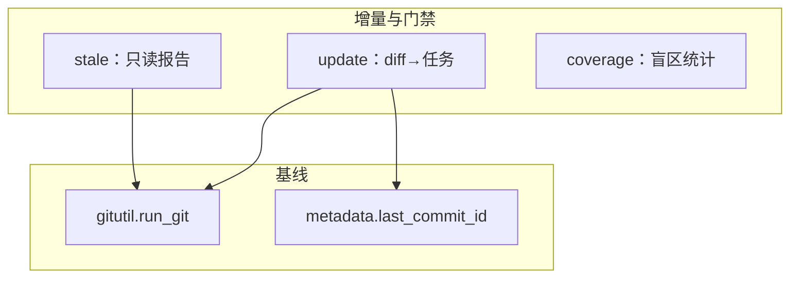
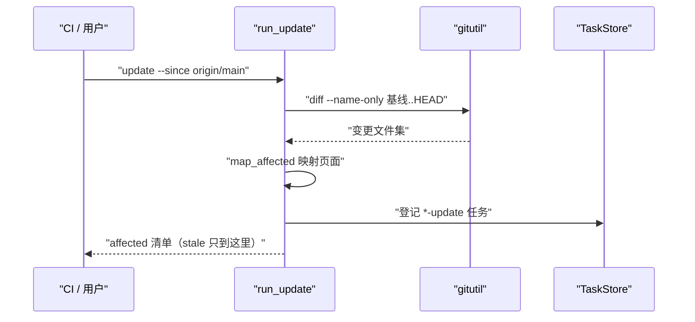
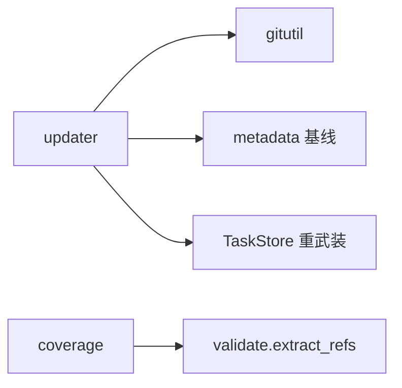

# 增量更新与过期门禁

<cite>
**本文引用的文件**
- [src/repowiki/updater.py](file://src/repowiki/updater.py)
- [src/repowiki/coverage.py](file://src/repowiki/coverage.py)
- [src/repowiki/gitutil.py](file://src/repowiki/gitutil.py)
- [src/repowiki/metadata.py](file://src/repowiki/metadata.py)
</cite>

## 目录
1. [简介](#简介)
2. [项目结构](#项目结构)
3. [核心组件](#核心组件)
4. [架构总览](#架构总览)
5. [详细组件分析](#详细组件分析)
6. [依赖关系分析](#依赖关系分析)
7. [性能与一致性考量](#性能与一致性考量)
8. [故障排查指南](#故障排查指南)
9. [结论](#结论)

## 简介
wiki 生成之后代码还会继续演进，本页的三个机制负责让 wiki 跟上演进：update 命令基于 git diff 把变更映射为受影响的页面并只重写这些页面（最小重写原则）；stale 是它的只读版本，不改任何状态，专供 CI 做"代码改了、wiki 没跟"的过期门禁；coverage 则反向统计 wiki 从未引用的仓库文件，暴露覆盖盲区。三者都是确定性命令、无 agent 参与，这正是它们能放进 CI 的原因。

章节来源
- [src/repowiki/updater.py:99-140](file://src/repowiki/updater.py#L99-L140)

## 项目结构
三个机制分属三个模块，通过 git 与元数据基线衔接。下图是它们的输入输出关系：

图中的两条基线各有含义：git 基线（--since 或 last_commit_id）定义"从哪个提交算变更"，它决定了 update 与 stale 看到的变更集完全一致——门禁拦下的正是 update 将要修的。

图表来源
- [src/repowiki/updater.py:19-33](file://src/repowiki/updater.py#L19-L33)

章节来源
- [src/repowiki/coverage.py:24-40](file://src/repowiki/coverage.py#L24-L40)

## 核心组件
三个机制各有一个值得记住的核心函数：

- map_affected：增量映射的核心算法——变更文件 ∩ 页面的 dependent_files 命中该页，再沿章节树把命中的页面祖先（章节索引页）一并算入，因为索引页描述整章内容
- run_stale --fail-if-stale：把"存在受影响页面"翻译成退出码 1，PR 门禁因此不需要解析任何输出文本
- _classify_uncited：未引用文件的降噪分组——vendor 目录、其他语言镜像（如 README.zh.md 对 README.md）不该被引用，分母里剔除后 effective_coverage 才是真实口径
- committed-only 与 --dirty 的分野：CI 门禁用前者保证可复现，本地迭代用后者图方便——同一映射算法的两种视图，切换的只是变更集来源而非算法

章节来源
- [src/repowiki/updater.py:43-54](file://src/repowiki/updater.py#L43-L54)

## 架构总览
增量流程的完整时序如下：读取 metadata 里的基线 commit → git diff --name-only 得变更集（--dirty 额外纳入工作区改动与未跟踪文件）→ map_affected 映射受影响页面/卡片/模块 → 生成 *-update 任务。stale 走完全相同的前三步但在"生成任务"处分叉为只读报告。

图中最后一步的分叉体现了职责分离：前四步是纯计算（可反复执行无副作用），只有 update 在第五步写状态——stale 复用前四步获得与 update 完全一致的判断，却不承担任何写入风险。

图表来源
- [src/repowiki/updater.py:251-306](file://src/repowiki/updater.py#L251-L306)

章节来源
- [src/repowiki/updater.py:99-140](file://src/repowiki/updater.py#L99-L140)

## 详细组件分析
### 增量映射（updater.py）
- 职责：把文件级变更翻译为页面级重写任务，是"最小重写"原则的实现
- 关键行为：知识卡片按 source_files 命中、知识模块按 scope 覆盖判定；总览页只要任一页面被命中就一并刷新（总览描述仓库整体）；已 done 的任务也会被重新武装（重置 attempts、重生成规格），不漏接新变更

章节来源
- [src/repowiki/updater.py:56-98](file://src/repowiki/updater.py#L56-L98)

### 过期门禁（stale）
- 职责：在 PR 里拦截 wiki 落后于代码的合并
- 实现要点：committed-only 视图保证可复现（两个评审者看到的变更集一致）；--dirty 只在本地迭代时用；输出会列出受影响页面清单，评审者据此判断"该让谁去更新 wiki"

章节来源
- [src/repowiki/updater.py:308-321](file://src/repowiki/updater.py#L308-L321)

### 覆盖率（coverage.py）
- 职责：回答"仓库里哪些文件 wiki 从未提及"，量化覆盖盲区
- 实现要点：从全部完成页面抽取 file:// 引用集，与仓库清单求差；raw 与 effective 双口径输出，后者剔除 vendor 与镜像后才是公平分数

章节来源
- [src/repowiki/coverage.py:95-110](file://src/repowiki/coverage.py#L95-L110)

## 依赖关系分析
三个机制的依赖全部向下且狭窄，按"必选/复用"分两档：

- 必选：gitutil（diff 来源）、metadata 基线（last_commit_id，update 的可用性开关）、TaskStore（update 重武装任务）
- 复用：coverage 复用 validate.extract_refs——同一份引用只有一种解析口径

图中 C（metadata 基线）是增量可用性的前提：从未 finalize 过的仓库没有 last_commit_id，update 因此不可用——这是"先完整生成、再增量维护"生命周期顺序的代码体现。

图表来源
- [src/repowiki/coverage.py:24-60](file://src/repowiki/coverage.py#L24-L60)

章节来源
- [src/repowiki/metadata.py:28-60](file://src/repowiki/metadata.py#L28-L60)

## 性能与一致性考量
- 可复现性：CI 门禁用 committed-only 视图，两个不同时间的检查对同一提交得到同一结论；--dirty 的结果依赖工作区即时状态，仅限本地
- 最小重写：未命中任何页面的变更静默跳过，不产生噪音任务；重武装的任务重置 attempts 并按最新代码重生成规格
- 成本：映射是清单交集运算，万级文件也毫秒级完成；真正贵的是重写页面本身，而那正是被最小化的部分
- 门禁哲学：stale 只报告不修复——修复是 agent 的工作，门禁只负责让问题在合并前可见；把「发现」与「修复」分离让两者都能保持简单

章节来源
- [src/repowiki/updater.py:99-140](file://src/repowiki/updater.py#L99-L140)

## 故障排查指南
增量三件套的故障通常与"基线"有关，排查思路是先问三个问题：基线对吗、变更集对吗、映射命中了吗。常见场景如下：

- update 报需要 git 或基线缺失：仓库无 git，或从未 finalize（metadata 里没有 last_commit_id）；先完整生成一次
- stale 误报过期：确认 --since 的取值——本地开发对比 origin/main、CI 里对比合并基点，基线不同结论自然不同
- 改了代码但 update 没命中页面：该文件不在任何页面的 dependent_files 里；先跑 coverage 看它是否本来就没被引用
- coverage 分数偏低：先看分组明细——vendor 与镜像文件本就不该被引用，effective_coverage 才是公平口径；剩余未引用文件里挑"值得补引用"的组补页面

章节来源
- [src/repowiki/updater.py:34-42](file://src/repowiki/updater.py#L34-L42)

## 结论
增量三件套让 wiki 从"一次性产物"变成"持续维护的资产"：update 负责最小重写、stale 负责拦截过期、coverage 负责暴露盲区。三者全部确定性、无 agent 参与、以退出码为契约，天然适合放进 CI——本仓库自用的 wiki.yml 门禁就是它们的日常实践。

章节来源
- [src/repowiki/updater.py:99-140](file://src/repowiki/updater.py#L99-L140)
