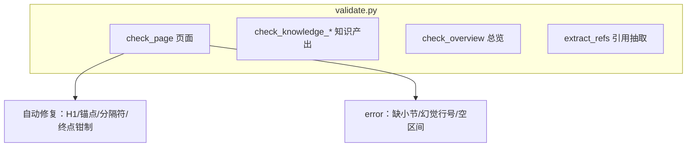
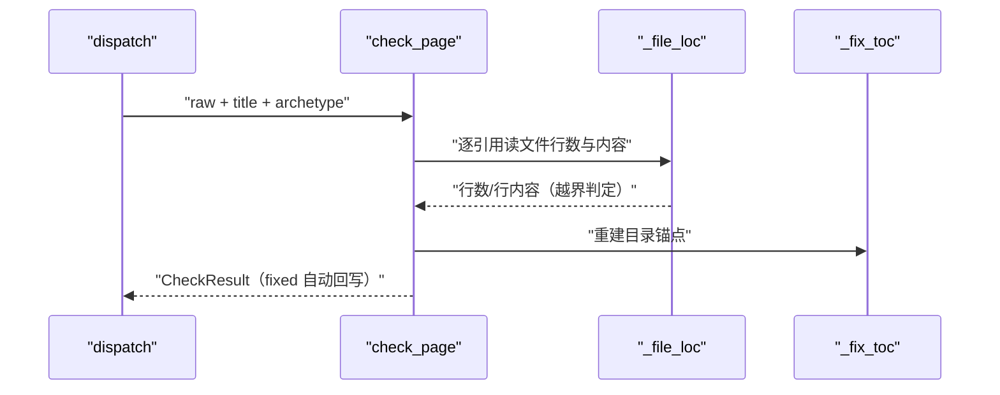
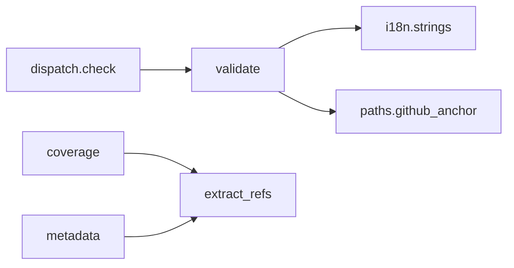

# 校验器与自动修复

<cite>
**本文引用的文件**
- [src/repowiki/validate.py](file://src/repowiki/validate.py)
- [src/repowiki/paths.py](file://src/repowiki/paths.py)
- [src/repowiki/i18n.py](file://src/repowiki/i18n.py)
</cite>

## 目录
1. [简介](#简介)
2. [项目结构](#项目结构)
3. [核心组件](#核心组件)
4. [架构总览](#架构总览)
5. [详细组件分析](#详细组件分析)
6. [依赖关系分析](#依赖关系分析)
7. [性能与一致性考量](#性能与一致性考量)
8. [故障排查指南](#故障排查指南)
9. [结论](#结论)

## 简介
validate.py 是 repowiki 的质量闸门：check 命令把 agent 产出交给它校验，处理原则写在其模块 docstring 里——可计算的确定性缺陷（锚点、H1、路径分隔符、行区间终点越界）就地自动修复并报告在 fixed 列表；结构性缺陷（缺小节、幻觉行号、空引用区间）判失败打回。它只抓可计算的部分，引用内容是否真的支撑论断仍是撰写者的责任——这条边界让校验器既严格又不越权，也解释了为什么"内容好不好"最终要靠人复核而非机器盖章。

章节来源
- [src/repowiki/validate.py:1-20](file://src/repowiki/validate.py#L1-L20)

## 项目结构
validate.py 是单文件规则引擎，按产出类型分为五个入口函数，页面校验（check_page）是其中最复杂的。下图展示入口与处理结果的分流：

extract_refs 值得单独一提：它被 finalize（元数据聚合）、coverage（覆盖率统计）、site（源码弹层）三方复用，同一份 file:// 引用在全系统只有一种解析口径。

图表来源
- [src/repowiki/validate.py:22-47](file://src/repowiki/validate.py#L22-L47)

章节来源
- [src/repowiki/validate.py:350-428](file://src/repowiki/validate.py#L350-L428)

## 核心组件
校验器的四个核心构件决定了它的行为方式：

- CheckResult：ok/errors/warnings/fixed/text 的统一结果容器——error 打回、warning 提示、fixed 已自动修复，三类严重度泾渭分明
- _SECTION_TABLE_BY_ARCHETYPE：archetype → i18n 必备小节表的键映射，未知原型回落 module 表——六原型的校验差异全部收敛在这一个映射上
- _fix_toc：按实际 ## 标题确定性重建目录锚点（GitHub 中文锚点规则），agent 写错锚点无需人工修
- github_anchor（paths.py 提供）：小写、去标点、空格转连字符的锚点算法，中文标题同样适用
- 占位符检查的豁免：占位符扫描只针对散文（剔除 fenced 代码块与行内代码），页面因此可以合法展示占位符语法本身——规则与文档化能力不冲突

章节来源
- [src/repowiki/validate.py:28-47](file://src/repowiki/validate.py#L28-L47)

## 架构总览
check_page 的校验流程是一条十步左右的流水线，顺序经过占位符、标题、小节表、引用块、mermaid、行号、来源标记，最后做锚点重建。下图突出其中的自动修复点与校验点：

流水线的顺序有讲究：占位符检查最先（残留占位符说明模板没替换，后续检查无意义），锚点重建最后（前面可能改过标题，锚点必须基于最终文本）。图中的 F 步骤是唯一涉及磁盘读取的环节，其余全是内存文本处理。

图表来源
- [src/repowiki/validate.py:114-160](file://src/repowiki/validate.py#L114-L160)

章节来源
- [src/repowiki/validate.py:268-292](file://src/repowiki/validate.py#L268-L292)

## 详细组件分析
### 行号校验分层
- 职责：区分"幻觉行号"（必须打回）与"良性截断"（可以自动修复）
- 关键行为：起点越界（start > 文件实际行数）报 error——行号几乎必然是编造的；区间倒置（start > end）报 error；仅终点越界（end 超出文件）自动钳制到文件末尾，因为"多引了尾部"通常只是行数记忆偏差

章节来源
- [src/repowiki/validate.py:160-215](file://src/repowiki/validate.py#L160-L215)

### 引用内容 sanity check
- 职责：拦截"格式合法但无法支撑论断"的引用
- 关键行为：引用行区间解码后若全为空白行报 error——引用空行等于什么都没引用；mermaid 节点标签中形如文件路径的 token 与仓库清单（known_paths）核对，未命中报 warning（概念命名可忽略，不阻断）

章节来源
- [src/repowiki/validate.py:215-237](file://src/repowiki/validate.py#L215-L237)

### 小节来源强制
- 职责：保证每个小节可溯源，这是页面可信度的底线
- 关键行为：按 `##` 切分全文，除目录与增量更新的「更新摘要」外，每个小节必须非空且含「章节来源/Section sources」标记；两项违规是独立的 error（空小节与缺来源分开报）

章节来源
- [src/repowiki/validate.py:238-252](file://src/repowiki/validate.py#L238-L252)

## 依赖关系分析
校验器自身只依赖两个基础模块，同时被三个上层消费——它的位置决定了规则口径的全局一致性。依赖按"必选/复用"分两档：

- 必选：i18n.strings（双语小节表与来源标记）、paths.github_anchor/nfc（锚点与规范化）
- 被复用：dispatch.check（check 命令）、coverage 与 metadata（extract_refs 引用抽取）

图中的双语依赖（i18n）让同一套规则服务 zh/en 两种产出：小节表、来源标记字符串都从 STRINGS 取，校验器逻辑完全语言无关——加语言时校验器零改动。

图表来源
- [src/repowiki/validate.py:11-20](file://src/repowiki/validate.py#L11-L20)

章节来源
- [src/repowiki/validate.py:61-70](file://src/repowiki/validate.py#L61-L70)

## 性能与一致性考量
- 校验是纯函数式的：同一产出 + 同一仓库状态必得同一结果，可安全重放，这也是崩溃恢复（check --all）可行的前提
- 自动修复直接回写产物文件，但 done 状态的任务只读重校验、永不翻转状态——终态保护优先于修正
- 阈值集中且少：MIN_SECTIONS=6、MIN_MERMAID=2、cite ≤15 文件，全部定义在文件头部，调整语义一目了然
- 修复的边界：自动修复只碰确定性缺陷（锚点/H1/分隔符/终点钳制），任何涉及语义选择的修正宁可打回——自动修复永不做语义决定

章节来源
- [src/repowiki/validate.py:22-27](file://src/repowiki/validate.py#L22-L27)

## 故障排查指南
check 失败的排查思路：先读 errors 列表的错误类别（每类对应不同修法），fixed 列表的项无需处理。常见场景如下：

- 「缺少必备小节」：对照当前 archetype 的小节表补齐——六原型各有专属表，用 flow 表写 layer 页必然失败
- 「行号起点越界」：引用行号是幻觉，打开被引文件核对真实行号后重写该引用；区间倒置同理
- 「小节缺少章节来源 / 内容为空」：小节末尾补来源列表；确无对应代码的概念性小节用规定的声明句替代
- 「页面仍含未替换的模板占位符」：散文里出现了 `{{...}}` 字面量——正文论述需用行内代码或改写规避，代码块内展示则不受影响
- 「引用区间全为空行」：行号虽真实但指向空白区域，调整区间覆盖有效内容

章节来源
- [src/repowiki/validate.py:114-140](file://src/repowiki/validate.py#L114-L140)

## 结论
校验器的设计哲学是"规则只抓可计算的"：自动修复处理格式缺陷让 agent 免于机械返工，error 拦截结构性谎言（幻觉行号、空引用、缺来源）守住可信度底线，语义正确性交给 STYLE 规范与人工复核。这个三层防线让 check 既严格又不越权。

章节来源
- [src/repowiki/validate.py:1-20](file://src/repowiki/validate.py#L1-L20)
