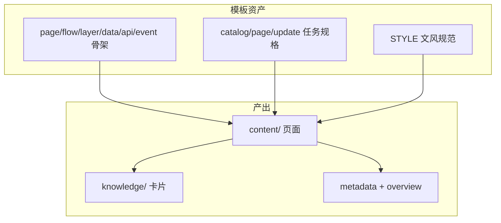
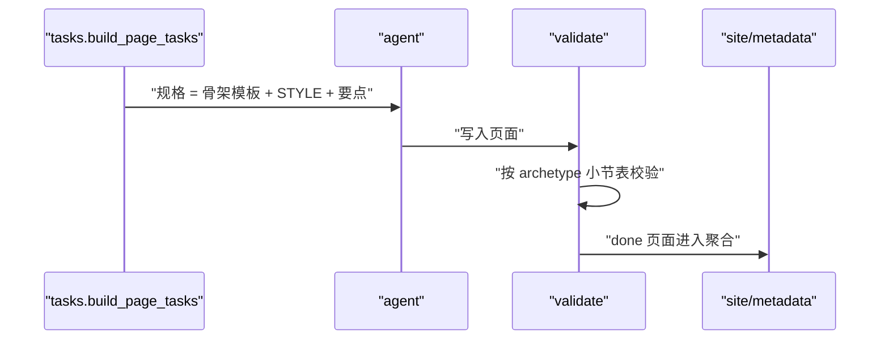
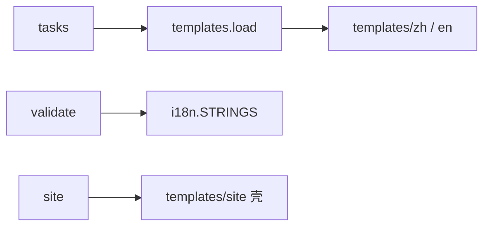

# 内容产出与模板

<cite>
**本文引用的文件**
- [src/repowiki/templates.py](file://src/repowiki/templates.py)
- [src/repowiki/i18n.py](file://src/repowiki/i18n.py)
- [src/repowiki/tasks.py](file://src/repowiki/tasks.py)
- [src/repowiki/site.py](file://src/repowiki/site.py)
</cite>

## 目录
1. [简介](#简介)
2. [项目结构](#项目结构)
3. [核心组件](#核心组件)
4. [架构总览](#架构总览)
5. [详细组件分析](#详细组件分析)
6. [依赖关系分析](#依赖关系分析)
7. [性能与一致性考量](#性能与一致性考量)
8. [故障排查指南](#故障排查指南)
9. [结论](#结论)

## 简介
本章覆盖内容产出侧的三块：页面原型与模板体系、知识卡片与总览元数据、单文件离线站点与 llms 索引。核心设计是把模板当作 prompt 资产——模板不是渲染代码的数据，而是任务规格的一部分：agent 按骨架撰写，校验器按同一套骨架强制，模板与校验器共享同一份小节表（i18n.STRINGS）。这个"单一事实来源"是模板体系只有 38 行加载器代码却能强制六种页面形态的原因。产出侧回答三个问题：页面长什么样（原型与模板）、页面之外还产出什么（知识卡片与元数据）、产出如何被消费（站点与索引）——三者共用同一套基础设施，理解一个机制的方式可以原样套用到另外两个。

章节来源
- [src/repowiki/templates.py:22-37](file://src/repowiki/templates.py#L22-L37)

## 项目结构
产出侧的资产与代码分界明确：templates/ 下是纯数据（骨架、规格、文风规范），三个 Python 模块负责加载、校验与聚合。先看资产目录的全貌：

```text
src/repowiki/templates/
├── zh/ / en/               # 双语资产（两套内容完全对称）
│   ├── page_template.md    # module 骨架（默认原型）
│   ├── flow/layer/data/api/event_template.md   # 其余五种原型骨架
│   ├── catalog_task.md     # 规划任务规格（含六原型选型规则 8）
│   ├── page_task.md / update_task.md / overview_task.md
│   └── STYLE.md            # 文风与图表规范（内嵌进每个规格）
└── site/                   # wiki.html 壳 + app.js
```

- 模板是数据不是代码：修改模板永远不影响已生成页面的正确性，只影响之后的生成
- 下图是资产如何流动成最终产出：



图中所有箭头都是"资产喂给 agent"或"产出被聚合"，没有一条是"资产被代码执行"。

图表来源
- [src/repowiki/tasks.py:97-128](file://src/repowiki/tasks.py#L97-L128)

章节来源
- [src/repowiki/tasks.py:97-128](file://src/repowiki/tasks.py#L97-L128)

## 核心组件
本章的组件记忆点是"一份规范、两种语言、三种产出"：

- templates.render：`{{PLACEHOLDER}}` 替换器，未提供的占位符故意保留原样，让校验器的占位符检查能发现渲染遗漏——一个 38 行模块里的防御性设计
- 六种 archetype 骨架：module/flow/layer/data/api/event 各自的必备小节、mermaid 图型与撰写引导
- STYLE.md：来源标注、引用格式、图表语法、正文密度等跨原型共享的文风契约，内嵌进每个页面规格
- 双语资产：zh/en 各一套模板与 STRINGS 字符串表，产出语言跟随目标仓库，plan --locale 可指定
- 扩展点：新增原型 = 骨架模板（zh/en）+ i18n 小节表（zh/en）+ 选型规则条目三处同步，管线代码零改动

章节来源
- [src/repowiki/i18n.py:19-110](file://src/repowiki/i18n.py#L19-L110)

## 架构总览
产出管线从规格到站点共四站：页面任务规格内嵌对应原型骨架与 STYLE → agent 按骨架撰写 → 校验器按 i18n 小节表强制 → 完成后聚合为站点与元数据。下图强调校验与模板消费同一份小节表：



图中 T 与 V 都指向同一张小节表的这个细节是体系的关键：agent 被要求写的结构与校验器检查的结构来自同一份定义，"按模板写却不过检"这类错位在机制上不可能发生。

图表来源
- [src/repowiki/tasks.py:97-128](file://src/repowiki/tasks.py#L97-L128)

章节来源
- [src/repowiki/validate.py:28-47](file://src/repowiki/validate.py#L28-L47)

## 详细组件分析
本章三篇子页的导航如下，先看表再按需阅读：

| 子页 | 核心实体/机制 | 一句话职责 |
|---|---|---|
| 页面原型与模板体系 | ARCHETYPES / 骨架模板 / 小节表 | 六种页面骨架的定义、选型与校验 |
| 知识卡片与总览元数据 | knowledge 模块/卡片 / finalize | 第二套产出（机制知识）与机器可读汇总 |
| 单文件离线站点与 llms 索引 | site payload / llms.txt | 人类（HTML）与 agent（纯文本）两种消费形态 |

### 模板双层结构
- 职责：骨架模板定小节顺序与图表类型，任务规格模板定上下文（页面要点/参考文件/硬性检查项）
- 实现要点：规格自包含——整份骨架与 STYLE 内嵌进每个页面任务的规格文件，agent 拿到一个任务即可工作，页面任务间因此零依赖、完全并行

章节来源
- [src/repowiki/tasks.py:97-128](file://src/repowiki/tasks.py#L97-L128)

### 双语资产
- 职责：zh/en 各一套完整资产，产出语言跟随目标仓库
- 配置面：plan --locale 覆盖自动检测；语言持久化于 state/locale，之后的 check/site 全部遵从，不会中途换语言

章节来源
- [src/repowiki/i18n.py:14-17](file://src/repowiki/i18n.py#L14-L17)

## 依赖关系分析
内容产出侧的依赖图比编排侧更平——模板资产是数据不是代码，三个模块的相互依赖近乎于无，按"资产/校验/呈现"三条独立链路分组：



三条横向独立的链路（tasks→模板、validate→小节表、site→站点壳）意味着三处可以独立演进：改文风不动校验，加原型不动站点，换站点壳不动内容。

图表来源
- [src/repowiki/templates.py:22-37](file://src/repowiki/templates.py#L22-L37)

章节来源
- [src/repowiki/site.py:363-383](file://src/repowiki/site.py#L363-L383)

## 性能与一致性考量
- 模板改动即时生效于下次 plan，无需迁移；存量页面靠 update 流程跟进——资产版本与产出版本的错位是内容级问题而非结构问题
- 必备小节表支持 exact/prefix 两种匹配模式：标题核心词一致即可（如「性能」前缀匹配「性能与一致性考量」），兼顾强制性与措辞弹性
- 校验器的占位符检查刻意剔除代码块——页面可以合法地展示占位符语法本身
- 产出侧的一致性威胁主要来自「资产与校验错位」：骨架模板改了、i18n 小节表没跟着改，就会出现按模板写却不过检的页面——测试守卫把这种错位挡在 CI

章节来源
- [src/repowiki/i18n.py:16-18](file://src/repowiki/i18n.py#L16-L18)

## 故障排查指南
产出侧的故障多与"资产错配"有关，排查时先定位资产的坐标：语言（zh/en）与原型（六选一）两个维度唯一确定一份骨架，多数「找不到/不对劲」都是这两个坐标搞错：

- 规格里出现未替换占位符：templates.render 的 kwargs 缺项，属 CLI 缺陷而非 agent 问题，回报 issue
- 页面被判定缺小节：确认页面 archetype 与规格内嵌骨架一致；agent 换骨架写是最高频错误
- 双语内容混用：state/locale 决定一切，勿混用两个 locale 的模板；换语言需 --force 重规划
- 站点里图表不渲染：站点内嵌 mermaid 11.17.2，检查图表语法是否用了已废弃写法

章节来源
- [src/repowiki/templates.py:29-37](file://src/repowiki/templates.py#L29-L37)

## 结论
内容产出侧的扩展成本被刻意压到最低：加一种原型只动资产与映射表，管线零改动。本章三个子页分别展开原型体系（六原型的骨架与选型）、知识/元数据（第二套产出）、站点与索引（分发形态），可按需直查。

章节来源
- [src/repowiki/templates.py:1-20](file://src/repowiki/templates.py#L1-L20)
