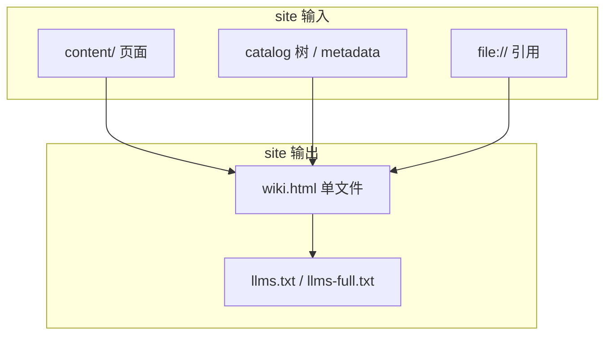
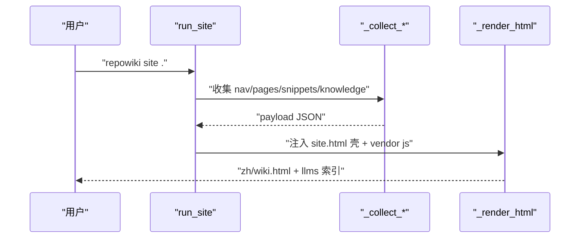
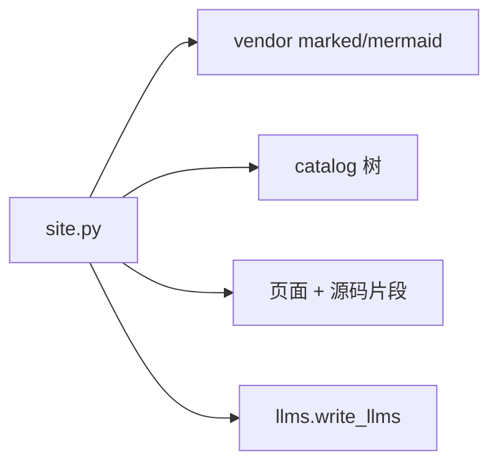

# 单文件离线站点与 llms 索引

<cite>
**本文引用的文件**
- [src/repowiki/site.py](file://src/repowiki/site.py)
- [src/repowiki/llms.py](file://src/repowiki/llms.py)
- [src/repowiki/templates/site/app.js](file://src/repowiki/templates/site/app.js)
</cite>

## 目录
1. [简介](#简介)
2. [项目结构](#项目结构)
3. [核心组件](#核心组件)
4. [架构总览](#架构总览)
5. [详细组件分析](#详细组件分析)
6. [依赖关系分析](#依赖关系分析)
7. [性能与一致性考量](#性能与一致性考量)
8. [故障排查指南](#故障排查指南)
9. [结论](#结论)

## 简介
site 命令把整个 wiki 打包成一个自包含 HTML 文件（约 5 MB）：markdown/mermaid 渲染库内嵌、引用的源码片段内嵌、导航与搜索内嵌，双击即看、无需网络、发给同事一个文件即可。同时导出 llms.txt / llms-full.txt 两个纯文本索引，让 agent 与 IDE 按 llmstxt.org 约定直接消费 wiki 全文，不需要 MCP 或任何服务。一份数据、两种分发形态（人类看 HTML、agent 读文本），是 repowiki 分发策略的全部——这也回答了"生成之后谁来读"的问题：同一个 wiki，人用浏览器、agent 用索引，互不迁就。

章节来源
- [src/repowiki/site.py:36-89](file://src/repowiki/site.py#L36-L89)

## 项目结构
站点由一个渲染器、一个壳、一个前端脚本与一个索引导出器组成。约 5 MB 的体量构成大致是：vendor 渲染库占一半，其余是页面正文与内嵌源码片段——片段按引用行区间精确切割，不内嵌整个文件，这是体积可控的关键。下图是输入到输出的完整数据流：

图中 O1 → O2 的箭头说明 llms 索引由站点收集的同一份页面清单派生——两种形态的内容永远一致，不存在"HTML 有而 llms 没有"的页面；这也让 site 的幂等性自动延伸到 llms 产物。

图表来源
- [src/repowiki/site.py:106-133](file://src/repowiki/site.py#L106-L133)

章节来源
- [src/repowiki/llms.py:19-48](file://src/repowiki/llms.py#L19-L48)

## 核心组件
站点打包的四个核心函数各有明确分工，合起来不到 200 行——重活都交给了数据与前端的 vendor 库：

- _collect_pages：按 FlatNode 收集页面内容与路径，catalog 顺序即站点章节序
- _collect_snippets：抽取页面全部 file:// 引用，读出对应行区间内嵌进 payload——源码弹层"点开即看带行号高亮的源码"的数据来源
- _ordered_nodes：优先从 catalog.json 还原章节树；执行过 clean 的仓库退化按磁盘目录序重建（_nodes_from_disk），站点依然可用只是章节序可能变化
- 扩展点：站点 UI 文案来自 i18n 的 site 字符串表，与页面产出共用同一套本地化机制——zh 仓库的站点连界面都是中文

章节来源
- [src/repowiki/site.py:106-176](file://src/repowiki/site.py#L106-L176)

## 架构总览
站点是纯数据驱动的：site.py 把导航、页面、源码片段、知识库组成一个 JSON payload 注入 HTML 壳，浏览器端 app.js 负责全部渲染与交互。服务端（如果有）只剩静态文件托管——GitHub Pages 与本地双击是等价的。下图是打包与浏览的两段时序：

渲染与页面模板、archetype 完全解耦是图中隐含的重点：site.py 从不解析页面的小节结构，它只搬运整篇 markdown——所以新增原型、修改骨架对站点零影响，这也解释了为什么 site.py 在六原型扩展中一行未改。

图表来源
- [src/repowiki/site.py:363-383](file://src/repowiki/site.py#L363-L383)

章节来源
- [src/repowiki/site.py:326-361](file://src/repowiki/site.py#L326-L361)

## 详细组件分析
### 站点交互（app.js）
- 职责：运行时的全部用户交互——可折叠侧边栏目录树、scroll-spy 跟随高亮、全文搜索（命中词高亮）、源码弹层（带行号高亮与复制）、prev/next 翻页、阅读进度条、暗色主题（跟随系统 + 手动切换）
- 实现要点：约 380 行原生 JS 无框架依赖，所有数据来自注入的 payload，运行时零网络请求——"完全离线"由这一点兑现，而非口号
- 取舍：搜索是内存全文匹配而非倒排索引，5 MB 级 payload 完全够快，不值得为此引入索引库

章节来源
- [src/repowiki/templates/site/app.js:1-60](file://src/repowiki/templates/site/app.js#L1-L60)

### llms 索引（llms.py）
- 职责：llms.txt 按章节列出页面链接与一句描述（约 50 行实现）；llms-full.txt 把全部页面合并为单一全文文件——两种粒度服务两种消费模式（先索引后选读、或一次全读）
- 关键行为：链接按 catalog 章节序组织，文件头带一行仓库描述；实现仅 52 行，因为它复用 site 收集的页面清单
- 边界：纯文本、无 markdown 渲染假设——agent 的阅读体验优先于排版

章节来源
- [src/repowiki/llms.py:19-48](file://src/repowiki/llms.py#L19-L48)

## 依赖关系分析
站点的依赖全部以 vendor 方式内嵌：marked（markdown 渲染）与 mermaid（图表渲染）均为 MIT 协议，打包时并入 HTML 本体。用户浏览器不访问任何 CDN，产出文件在断网环境完整可用——这一点对内网仓库尤其重要。

图中 site.py → catalog 树这条边是唯一的"结构来源"：clean 之后 catalog 丢失时退化按目录序（_nodes_from_disk），站点的章节序可能变化但内容不丢——幂等重建在两种输入下都成立。

图表来源
- [src/repowiki/site.py:376-383](file://src/repowiki/site.py#L376-L383)

章节来源
- [src/repowiki/llms.py:49-52](file://src/repowiki/llms.py#L49-L52)

## 性能与一致性考量
- 单文件约 5 MB：渲染库 + 全部源码片段内嵌换来"零依赖分发"，对文档体量而言是划算的交换；万页级仓库才会需要重新权衡
- 幂等可重跑：finalize、update 或手动修改页面后随时重建；clean 后也能重建，幂等性让 site 可以挂进 CI 每次 push 自动刷新（本仓库的 Pages 即由此产出）
- 一致性：页面内容、源码片段、llms 索引来自同一次收集，三种形态永不失同步——不存在"改了页面忘了刷索引"这类漂移

章节来源
- [src/repowiki/site.py:134-175](file://src/repowiki/site.py#L134-L175)

## 故障排查指南
站点问题的排查思路：先确认输入（页面文件与 metadata 是否在位），再确认渲染（语法是否受支持）。还有一种情况值得区分：页面内容旧但站点能打开——站点忠实反映磁盘上的 content/ 文件，旧内容说明页面本身没被 update 刷新，责任在增量环节而非站点环节：

- 站点缺页面：site 只收集磁盘上真实存在的页面；先确认 finalize 完成（metadata 存在）且页面文件在 content/ 对应路径下，再重跑 site
- 源码弹层提示"源文件不存在"：引用的文件在生成后被删除/移动——内容过期而非站点故障，走 update 流程刷新页面引用
- mermaid 图不渲染：站点内嵌 11.17.2，检查图表语法（如 erDiagram 实体名用了非法字符、stateDiagram 未用别名写法直接写中文状态名）
- 章节顺序错乱：catalog.json 缺失（执行过 clean）导致退化目录序；恢复方式是重新 plan 或重跑 site 前找回 catalog
- llms.txt 为空：与 HTML 同源收集，HTML 正常则 llms 正常；两者都空说明页面收集阶段就没拿到文件

章节来源
- [src/repowiki/site.py:349-361](file://src/repowiki/site.py#L349-L361)

## 结论
单文件站点与 llms 索引是 repowiki 分发策略的两翼：人类得到双击即看的 HTML（内嵌渲染库与源码片段），agent 得到按索引导航的纯文本。两者同为确定性产物、同源于一次收集、可无限次重建而不漂移——文档分发的"最后一公里"因此不需要任何服务端参与，这也是"零网络"承诺的最后一环。两种产物、一个命令：对个人项目，wiki.html 发到聊天群即完成分享；对团队，Pages + llms 让人与 agent 在同一份知识上工作——分发的全部复杂度被 site 的一个 payload 收编。

章节来源
- [src/repowiki/llms.py:19-48](file://src/repowiki/llms.py#L19-L48)
