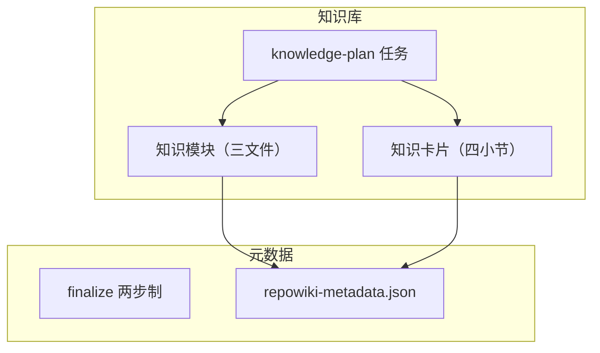
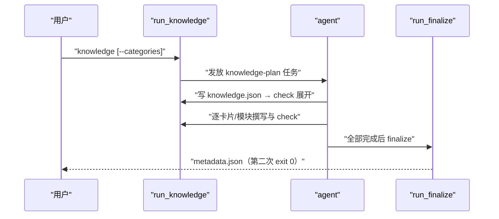
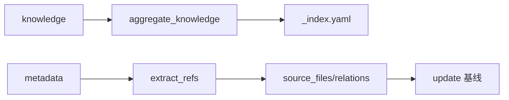

# 知识卡片与总览元数据

<cite>
**本文引用的文件**
- [src/repowiki/knowledge.py](file://src/repowiki/knowledge.py)
- [src/repowiki/metadata.py](file://src/repowiki/metadata.py)
- [src/repowiki/tasks.py](file://src/repowiki/tasks.py)
</cite>

## 目录
1. [简介](#简介)
2. [项目结构](#项目结构)
3. [核心组件](#核心组件)
4. [架构总览](#架构总览)
5. [详细组件分析](#详细组件分析)
6. [依赖关系分析](#依赖关系分析)
7. [性能与一致性考量](#性能与一致性考量)
8. [故障排查指南](#故障排查指南)
9. [结论](#结论)

## 简介
除页面体系外，repowiki 还有第二套产出：知识库（knowledge）与元数据（metadata）。知识库按"模块 + 卡片"组织跨页面的机制知识——模块回答"这个子系统整体是什么"（固定写概述/技术栈/架构设计三文件），卡片回答"这个横切机制怎么用"（配置、日志、错误处理等固定四小节）；元数据则是 finalize 把全部产出聚合成的机器可读 JSON，既作为增量更新的基线（last_commit_id），也是站点渲染的数据源。两者都是可选能力：不跑 knowledge 命令就没有知识库，不影响最小构建路径——但用了之后，wiki 就从"页面集合"升级为"带横切知识索引与机器可读摘要的知识资产"。知识库的可选性是设计出来的而非事后削减：knowledge 命令只追加任务、不改动既有阶段，finalize 对知识产出是"有则聚合、无则跳过"——主链路完全不知道知识库存在。

章节来源
- [src/repowiki/knowledge.py:29-53](file://src/repowiki/knowledge.py#L29-L53)

## 项目结构
知识库与元数据分属两个模块、三个阶段：knowledge 命令在 phase-2 追加任务集，finalize 在收尾阶段聚合。下图是两者的产出关系：

图中知识产出流向 metadata 是单向的：finalize 只消费 done 的知识任务，聚合进 metadata 的 knowledge 字段；反过来 metadata 不影响知识内容——聚合是纯读取，可随时重跑。

图表来源
- [src/repowiki/knowledge.py:147-180](file://src/repowiki/knowledge.py#L147-L180)

章节来源
- [src/repowiki/metadata.py:28-60](file://src/repowiki/metadata.py#L28-L60)

## 核心组件
三个核心构件覆盖了知识库的扩展点与元数据的契约：

- DEFAULT_KNOWLEDGE_CATEGORIES：内置六类机制卡片——configuration_system、logging_system、error_handling、build_system、dependency_management、frontend_style，每类带一行撰写引导（如配置类："loading, validation, layering"）
- knowledge --categories FILE：类别清单整表替换（非追加——追加会让"每类 0~2 张"的宁缺毋滥约束失去基准），持久化于 state/knowledge_categories.json，check 按同一清单校验卡片
- run_finalize：两步制——第一步校验完整性并创建 overview 任务（exit 3），第二步聚合元数据（exit 0）；缺页时拒绝以保护 --max-pages 试跑
- 扩展点：类别 id 限 `^[a-z][a-z0-9_]{1,39}$`，可安全进入 YAML front matter；新增类别只需一张清单文件，无需改代码

章节来源
- [src/repowiki/tasks.py:222-240](file://src/repowiki/tasks.py#L222-L240)

## 架构总览
知识库是可选阶段，流程是"追加计划 → 展开任务 → 逐个撰写"三步；finalize 则站在所有任务的终点做总装。下图把两条线画在一张时序里：

图中知识任务与页面任务同处 phase 2：它们可以完全并行——卡片规格同样自包含（scope + source_files + 类别引导），与页面任务零依赖。这正是 repowiki"任务自包含则天然并行"设计哲学的第二次应用。

图表来源
- [src/repowiki/metadata.py:28-136](file://src/repowiki/metadata.py#L28-L136)

章节来源
- [src/repowiki/knowledge.py:102-146](file://src/repowiki/knowledge.py#L102-L146)

## 详细组件分析
### 知识模块与卡片
- 职责：模块固定写概述/技术栈/架构设计三个文件（可选编码规范），回答子系统的整体问题；卡片固定四段编号小节（体系概览/关键文件与包/架构与设计约定/开发者应遵循的规则）+ YAML front matter，回答单个机制的实操问题
- 实现要点：scope（模块）与 source_files（卡片）决定覆盖范围，同时是增量更新的触发条件——改了配置代码，配置卡片就会在下一轮 update 中重写
- 关系建模：模块间的 depends_on/related_to 边在知识规划时声明，聚合进 _module.yaml——这是全系统唯一的显式依赖建模，是 agent 主观规划而非代码提取

章节来源
- [src/repowiki/tasks.py:259-304](file://src/repowiki/tasks.py#L259-L304)

### 元数据聚合
- 职责：从完成页面抽取引用（extract_refs），组装 wiki_catalogs/source_files/code_snippets/knowledge_relations 四大块，写入 zh/meta/repowiki-metadata.json
- 关键行为：记录 last_commit_id 供 update 做基线——这行记录是增量更新可用性的开关；knowledge_relations 里的 CONTAINS/REFERENCED_BY 边全部来自真实引用解析，无一凭空生成
- 站点关联：site 渲染时读取知识库聚合产物（_index.yaml/_module.yaml）与 metadata，知识库因此天然出现在离线站点里

章节来源
- [src/repowiki/metadata.py:62-136](file://src/repowiki/metadata.py#L62-L136)

## 依赖关系分析
知识库与元数据的依赖都指向既有组件而非新建机制：增量命中复用 updater 的映射逻辑，引用聚合复用校验器的解析函数——同一套机制被第二套产出复用，是表驱动设计的又一例证。

图中 F→G 这条边是元数据存在感最强的时刻：source_files 不仅是对外报告，更是下一轮 update 的 diff 起点——元数据同时是"说明书"和"存档点"。

图表来源
- [src/repowiki/knowledge.py:133-146](file://src/repowiki/knowledge.py#L133-L146)

章节来源
- [src/repowiki/metadata.py:156-175](file://src/repowiki/metadata.py#L156-L175)

## 性能与一致性考量
- finalize 两步制保证总览页也被校验后才算完成——总览是用户入口，它的质量与正文同等重要，所以被纳入同一个校验循环
- 类别清单持久化后，check 按同一清单校验卡片 front matter——规划与校验共享一份类别定义，与原型机制的"单一事实来源"同构
- 知识页排序用 module_required_files 固定顺序（概述/技术栈/架构设计），站点展示稳定可预期，不随生成顺序波动
- 卡片与页面的分工避免了两类浪费：页面不重复写横切机制（指向卡片），卡片不重复展开子系统结构（指向页面）——规划 agent 在 page_brief 与卡片 scope 里的克制，是这套分工落地的关键

章节来源
- [src/repowiki/knowledge.py:102-146](file://src/repowiki/knowledge.py#L102-L146)

## 故障排查指南
本页范围的故障集中在类别文件与 finalize 两处，排查思路是先看退出码再看 JSON/YAML 解析；先分清产物层级——knowledge.json 是规划（schema 校验）、卡片/模块文件是产出（内容校验）、_index.yaml/_module.yaml 是聚合（只读汇总），三层各有各的失败方式：

- knowledge 命令报类别文件非法：id 需匹配小写下划线规则、YAML 顶层为数组；`- Bad-Id` 这类大写连字符 id 会被拒绝——id 要进 front matter，字符集必须保守
- finalize 卡在 exit 3：overview 任务未完成或未 check——status 查看 overview 记录，写完产出必须再跑 check；exit 3 本身不是错误
- 卡片 check 失败：核对 front matter 的 kind/category 与持久化类别清单一致；四段编号小节缺一即打回；自定义类别换清单后旧卡片类别不在新清单也会失败
- metadata 里缺 source_files：确认页面确实含 file:// 引用（extract_refs 只统计真实引用），以及全部页面任务为 done

章节来源
- [src/repowiki/knowledge.py:60-99](file://src/repowiki/knowledge.py#L60-L99)

## 结论
知识库与元数据把 wiki 从页面集合升级为可机器消费的知识资产：模块/卡片沉淀横切机制知识，metadata 记录引用关系与增量基线。两者都延续了同一套设计语言——可选启用、规格自包含、校验器兜底、类别可整表自定义——因此学习成本几乎为零：会看页面的机制就懂卡片的机制，懂原型的选型就懂类别的自定义。

章节来源
- [src/repowiki/knowledge.py:29-53](file://src/repowiki/knowledge.py#L29-L53)
