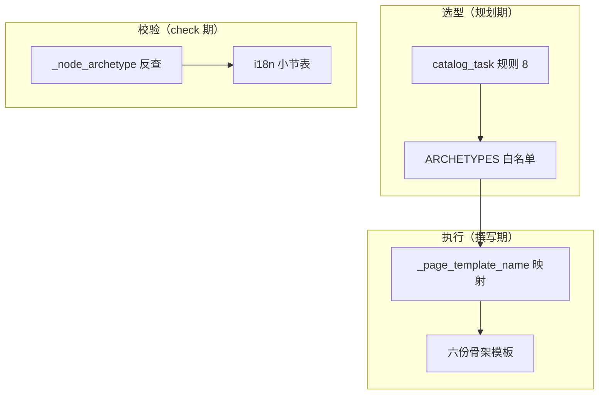
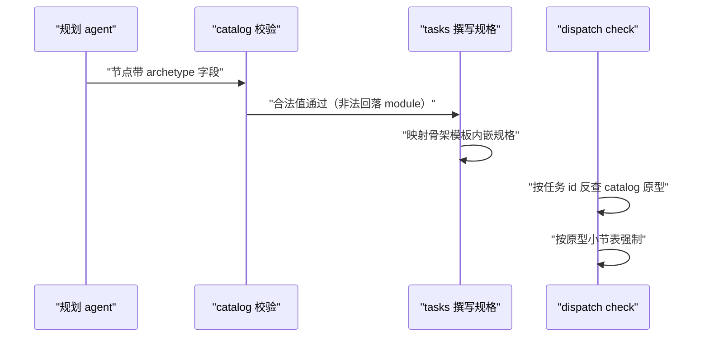
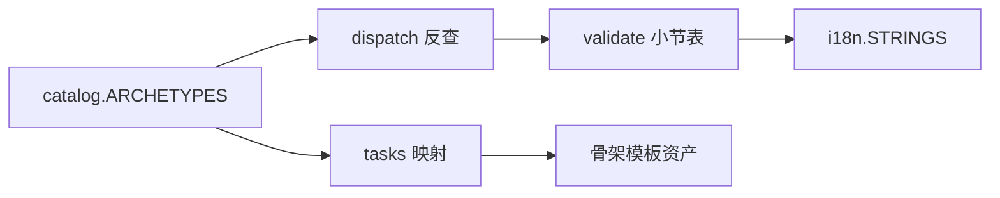

# 页面原型与模板体系

<cite>
**本文引用的文件**
- [src/repowiki/templates.py](file://src/repowiki/templates.py)
- [src/repowiki/i18n.py](file://src/repowiki/i18n.py)
- [src/repowiki/catalog.py](file://src/repowiki/catalog.py)
- [src/repowiki/tasks.py](file://src/repowiki/tasks.py)
</cite>

## 目录
1. [简介](#简介)
2. [项目结构](#项目结构)
3. [核心组件](#核心组件)
4. [架构总览](#架构总览)
5. [详细组件分析](#详细组件分析)
6. [依赖关系分析](#依赖关系分析)
7. [性能与一致性考量](#性能与一致性考量)
8. [故障排查指南](#故障排查指南)
9. [结论](#结论)

## 简介
页面原型（archetype）决定一个 wiki 页面的骨架：必备小节、mermaid 图型与撰写引导。repowiki 内置六种——module 结构型（默认）、flow 流程型、layer 分层型、data 数据模型型、api 接口型、event 事件型——对应软件架构文档的六类经典视图（模块视图、过程视图、分层视图、数据视图、接口视图、事件视图）。原型由规划阶段的 catalog 节点按页面主题选型，校验阶段按同一原型强制；它同时是本仓库自己的 wiki 正在使用的机制——你正在读的这页就是 module 原型，本 wiki 中另有 flow/api/layer/data 原型的实例。

章节来源
- [src/repowiki/catalog.py:19-19](file://src/repowiki/catalog.py#L19-L19)

## 项目结构
原型机制横跨三个阶段、五处代码/资产，先看资产文件的全貌：

```text
src/repowiki/templates/{zh,en}/
├── page_template.md     # module 骨架（默认）
├── flow_template.md     # 流程型骨架
├── layer_template.md    # 分层型骨架
├── data_template.md     # 数据模型型骨架
├── api_template.md      # 接口型骨架
└── event_template.md    # 事件型骨架
```

每个骨架配套一份 i18n 必备小节表（i18n.py 的 `*_sections`）与一条选型规则（catalog_task 规则 8）。下图是三阶段全景：



图中最容易忽视的是「反查」环节：任务记录里不存原型，check 时按任务 id 回 catalog 现查——单一事实来源让重规划后旧任务也不会校验错模板。

图表来源
- [src/repowiki/tasks.py:93-95](file://src/repowiki/tasks.py#L93-L95)

章节来源
- [src/repowiki/catalog.py:19-43](file://src/repowiki/catalog.py#L19-L43)

## 核心组件
原型体系的四个核心构件，每个都是"常量 + 映射表"的形态：

- ARCHETYPES：六原型的唯一常量来源（catalog.py），catalog 校验与 dispatch 反查都复用它，不允许出现第二份硬编码清单
- _SECTION_TABLE_BY_ARCHETYPE：校验器侧 archetype → 小节表键的映射，未知值回落 module 表——向后兼容旧 catalog
- 规划规则 8：catalog_task 规格里的选型指南——主题特征映射 + 准入条件 + page_brief 证据要求 + 不确定回退 module
- 扩展点：每种原型 = 骨架模板（zh/en）+ i18n 小节表（zh/en）+ 选型规则条目；测试套件有 wiring 守卫防三处漏配

章节来源
- [src/repowiki/validate.py:28-36](file://src/repowiki/validate.py#L28-L36)

## 架构总览
原型机制贯穿三个阶段：规划期 agent 依规则 8 写入 archetype 字段（可选，省略等价 module）；撰写期 tasks 按映射把骨架模板内嵌进页面规格；校验期 dispatch 按任务 id 反查 catalog 还原原型、validate 按原型查小节表强制。下图把三个阶段串成时序：



从图中可以看出防错链条有两层：选错值在第一站就被白名单拦下回落 module；选对值但写错骨架在最后一站被小节表打回。两层的判据都是 catalog 里的同一份声明。

图表来源
- [src/repowiki/dispatch.py:265-279](file://src/repowiki/dispatch.py#L265-L279)

章节来源
- [src/repowiki/catalog.py:107-112](file://src/repowiki/catalog.py#L107-L112)

## 详细组件分析
### 六原型的骨架差异
- 职责：不同架构视图各有专属小节与图型，各自 8 个必备小节、≥3 mermaid，共享来源标注与 cite 约定

| 原型 | 视图 | 关键小节（必备小节表节选） | 主图型 |
|---|---|---|---|
| module | 静态结构（默认） | 项目结构/核心组件/架构总览/依赖分析 | graph TB + sequenceDiagram |
| flow | 端到端过程 | 流程总览/关键步骤/数据与状态变化 | sequenceDiagram |
| layer | 分层架构 | 分层总览/层间调用规则/纵向切片 | 层叠 graph TB + 调用方向 LR |
| data | 数据与状态 | 数据模型总览/状态机/数据生命周期 | erDiagram + stateDiagram-v2 |
| api | 对外接口 | 接口清单与分组/契约与错误码/鉴权 | graph TB 分组 + sequenceDiagram |
| event | 事件驱动 | 事件清单/事件流拓扑/可靠性保障 | graph LR 拓扑 + sequenceDiagram |

### 选型准入与证据
- 职责：防止原型被滥用导致页面骨架与内容错配
- 关键行为：非默认原型有准入条件（仓库确有对应机制才允许选——event 要求确有事件/消息机制、api 要求确有对外接口面）；选定后必须在 page_brief 给出对应证据，否则校验打回；无法确认时一律 module
- 设计意图：原型是每页可选骨架而非每仓必配产物——纯工具库可以全程只出 module 页，本 wiki 就是实例（event 因仓库无事件机制而未被使用）

章节来源
- [src/repowiki/catalog.py:107-112](file://src/repowiki/catalog.py#L107-L112)

## 依赖关系分析
原型机制对管线的侵入被压到三处代码（catalog 白名单、tasks 模板映射、validate 查表分支），其余全部原型无关。下图标注了哪些组件"知道"原型、哪些不知道：



不在图中的组件（site/metadata/update/coverage）对原型一无所知——站点按 catalog 树渲染、增量按 dependent_files 映射、元数据按引用聚合，全都与页面骨架无关。新增原型因此是纯增量改动。

图表来源
- [src/repowiki/tasks.py:83-95](file://src/repowiki/tasks.py#L83-L95)

章节来源
- [src/repowiki/i18n.py:19-110](file://src/repowiki/i18n.py#L19-L110)

## 性能与一致性考量
- 一致性守卫：测试套件验证「模板文件的标题 ↔ i18n 小节表 ↔ 模板名映射」三方对齐，新增原型漏配任何一份资产都会在 CI 被拦下
- 向后兼容：archetype 字段省略等价 module；旧 catalog（无此字段或含已废弃值）回落 module，无需迁移
- 图型前提：内置 mermaid 11.17.2 支持全部新图型（erDiagram/stateDiagram-v2），站点渲染零改动
- 本 wiki 即实例：15 个主题页中 flow/api/layer/data 各用一页，event 因仓库无事件机制被准入条件排除——原型是按需选用的骨架，不是每仓必配的义务

章节来源
- [src/repowiki/catalog.py:138-180](file://src/repowiki/catalog.py#L138-L180)

## 故障排查指南
原型相关的故障分为"选错"与"漏配"两类，排查思路是先定位哪个阶段出错：

- 页面被判「缺少必备小节」：页面 archetype 与实际内容不符——agent 用了别家骨架；改内容对齐原型，或改 catalog 的 archetype 后重 plan
- 原型选错想换：编辑 state/catalog.json 的 archetype 字段后重新 plan（目录评审回路）；已生成页面需重写
- 新增原型时 CI 报 wiring 失败：按守卫提示补齐缺失的模板文件/小节表/映射项，三方必须同步
- 规划时不选新原型：检查 catalog_task 规则 8 的准入描述是否更新——规则 8 是规划者唯一的选型依据

章节来源
- [src/repowiki/dispatch.py:265-279](file://src/repowiki/dispatch.py#L265-L279)

## 结论
原型体系是 repowiki 表驱动设计的样板：常量 + 资产 + 映射表三件套，让"多一种页面骨架"成为纯增量改动；准入条件与证据要求让灵活性不演变成混乱。它也是理解本 wiki 的钥匙——你读到的每一页的形状，都是某个 archetype 的一次实例化。

章节来源
- [src/repowiki/catalog.py:19-43](file://src/repowiki/catalog.py#L19-L43)
