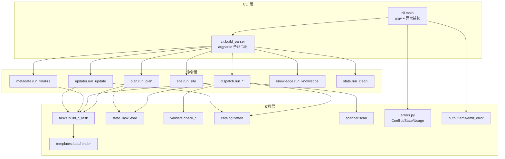
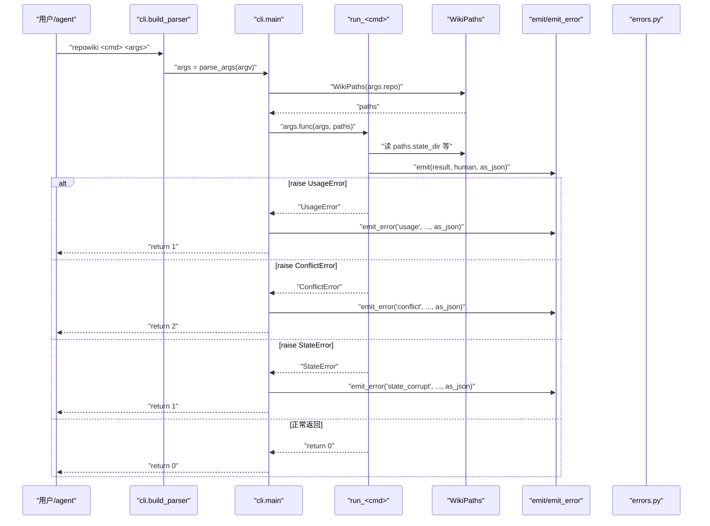
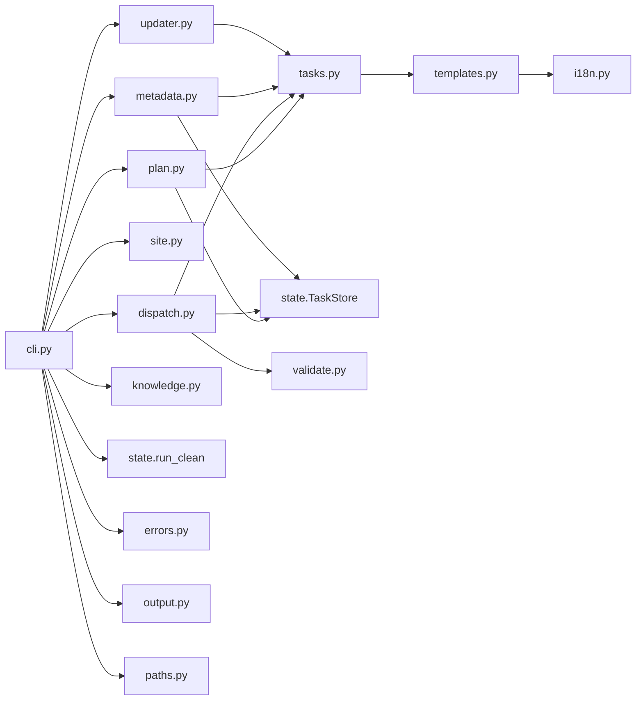

# 如何新增一个命令

<cite>
**本文引用的文件**
- [src/repowiki/cli.py](file://src/repowiki/cli.py)
- [src/repowiki/dispatch.py](file://src/repowiki/dispatch.py)
- [src/repowiki/plan.py](file://src/repowiki/plan.py)
- [src/repowiki/tasks.py](file://src/repowiki/tasks.py)
- [src/repowiki/templates.py](file://src/repowiki/templates.py)
- [src/repowiki/errors.py](file://src/repowiki/errors.py)
- [src/repowiki/output.py](file://src/repowiki/output.py)
</cite>

## 更新摘要

**变更内容**
- `src/repowiki/cli.py` 顶层 `--help` 描述精简为 "Deterministic repo-wiki build system driven by coding agents."（[src/repowiki/cli.py:26-29](file://src/repowiki/cli.py#L26-L29)），属 v0.3.3 自我描述调整：`build_parser()` 的行号区间与子命令注册模式不变，本页「新增命令五步法」流程保持原结论。
- `dispatch.py` 本轮未变更，上一轮关于 `run_watch` 停滞复核的说明不再适用于本轮，已从摘要中移除。

## 目录
1. [更新摘要](#更新摘要)
2. [简介](#简介)
3. [项目结构](#项目结构)
4. [核心组件](#核心组件)
5. [架构总览](#架构总览)
6. [详细组件分析](#详细组件分析)
7. [依赖关系分析](#依赖关系分析)
8. [性能与一致性考量](#性能与一致性考量)
9. [故障排查指南](#故障排查指南)
10. [结论](#结论)

## 简介
本页聚焦如何在 repowiki 中新增一个子命令。整套约定由 `cli.py` 的 argparse 子命令树定下：每个子命令绑定一个 `run_*(paths, ...)` 顶层函数；命名风格统一用「动名词或动词」（`plan`/`next`/`check`/`touch`/`watch`/`release`/`finalize`/`site`/`update`/`knowledge`/`status`/`clean`）；错误码语义固定四个数字（0=成功、1=校验失败/损坏/用法错误、2=状态冲突、3=进展性等待）；`output.py` 的 `emit` 是 stdout 双格式输出的唯一缝隙，`emit_error` 是 stderr 错误输出的唯一缝隙；新增任务类型时还要同步更新 `tasks.py` 的 `build_*_task` 与 `templates.py` 的模板集。

## 项目结构
与本页主题相关的目录与文件：

- `src/repowiki/cli.py`：`build_parser` 构造 argparse 子命令树；`main(argv)` 统一异常捕获 → 退出码。
- `src/repowiki/dispatch.py`：`run_next`/`run_check`/`run_release`/`run_touch`/`run_watch`/`run_status` 等命令层编排；路由到 `TaskStore`/`validate`/`catalog`/`scanner`/`tasks` 等支撑模块。
- `src/repowiki/plan.py`：`run_plan` —— 命令层编排；同时承担「扫描 → 展开任务」的核心逻辑。
- `src/repowiki/metadata.py`：`run_finalize` —— 元数据组装 + overview 两步 finalize。
- `src/repowiki/site.py`：`run_site` —— 单文件离线 HTML 渲染。
- `src/repowiki/updater.py`：`run_update` —— git diff → 增量任务。
- `src/repowiki/knowledge.py`：`run_knowledge` —— 知识卡片任务集。
- `src/repowiki/state.py`：`run_clean`（在文件末尾）—— 删 state/。
- `src/repowiki/tasks.py`：每个任务类型对应一个 `build_*_task(paths, ...) → dict` 函数；spec 写入 `state/tasks/<id>.md`。
- `src/repowiki/templates.py`：`load`/`render`/`render_file` —— 模板渲染；未知占位符留作原样让校验器判失败。
- `src/repowiki/errors.py`：`ConflictError`/`StateError`/`UsageError` 三个异常类，被 `cli.main` 捕获映射退出码。
- `src/repowiki/output.py`：`emit` 与 `emit_error` 双格式输出。
- `src/repowiki/templates/<locale>/`：每语言一整套模板（`STYLE.md`/`page_task.md`/`page_template.md`/`catalog_task.md`/`overview_task.md`/`update_task.md`/`knowledge_task.md`/`knowledge_card_task.md`/`knowledge_module_task.md`）。

图表来源
- [src/repowiki/cli.py:25-142](file://src/repowiki/cli.py#L25-L142)
- [src/repowiki/dispatch.py:49-263](file://src/repowiki/dispatch.py#L49-L263)
- [src/repowiki/tasks.py:61-238](file://src/repowiki/tasks.py#L61-L238)

章节来源
- [src/repowiki/cli.py:1-142](file://src/repowiki/cli.py#L1-L142)
- [src/repowiki/dispatch.py:1-392](file://src/repowiki/dispatch.py#L1-L392)
- [src/repowiki/plan.py:1-140](file://src/repowiki/plan.py#L1-L140)
- [src/repowiki/tasks.py:1-238](file://src/repowiki/tasks.py#L1-L238)
- [src/repowiki/templates.py:1-38](file://src/repowiki/templates.py#L1-L38)
- [src/repowiki/errors.py](file://src/repowiki/errors.py)
- [src/repowiki/output.py:1-34](file://src/repowiki/output.py#L1-L34)

## 核心组件
- `build_parser()`（`cli.py:25-122`）：构造顶层 `argparse.ArgumentParser(prog="repowiki", ...)`，加 `sub.add_subparsers(dest="command", required=True)`；每个子命令 `p = sub.add_parser(...)`，注册参数后 `p.set_defaults(func=lambda a, paths: run_xxx(paths, ...))`。
- `main(argv)`（`cli.py:125-142`）：`args = build_parser().parse_args(argv)`；`paths = WikiPaths(args.repo)`；`try: return args.func(args, paths) except (ConflictError, StateError, UsageError) as e: emit_error(...)`。
- 命名风格（既有命令）：`plan`（扫描）/ `next`/`check`/`release`/`touch`/`watch`/`status`（队列与状态）/ `finalize`（收尾）/ `site`（渲染）/ `update`（增量）/ `knowledge`（知识库）/ `clean`（清理）；都是单词动词或动名词，无连字符。
- 错误码（`cli.py:130-138`）：`ConflictError` → `emit_error("conflict", str(e), args.json); return 2`；`StateError` → `emit_error("state_corrupt", str(e), args.json); return 1`；`UsageError` → `emit_error("usage", str(e), args.json); return 1`；`return 0` 成功。
- `run_*(paths, ...)` 约定：每个子命令对应一个以 `run_` 开头的顶层函数；签名约定形如 `run_x(paths: WikiPaths, ..., as_json: bool = False) -> int`；返回 int 退出码；通过 `paths.xxx` 取路径、通过 `emit/emit_error` 输出、通过 `errors.py` 抛异常。
- `tasks.build_*_task(paths, ...)` 约定：每个任务类型对应一个 `build_*_task` 工厂；返回 `dict`（含 `id`/`kind`/`phase`/`title`/`output`）；spec 文本通过 `templates.render_file(..., locale=paths.locale, **kwargs)` 拼装；最后 `write_spec(paths, task_id, spec)` 写入 `state/tasks/<id>.md`。
- `templates.load/render/render_file`（`templates.py:22-38`）：`load(name, locale=DEFAULT_LOCALE)` 优先读 `templates/<locale>/<name>`，缺失回退 `templates/zh/<name>`；`render(text, **kwargs)` 用 `_PLACEHOLDER_RE` 做替换，未知 KEY 留作原样让校验器判失败；`render_file` 是 `load + render` 的便捷组合。
- `emit(result, human, as_json, file=None)` 与 `emit_error(kind, detail, as_json)`（`output.py:18-34`）：stdout 双格式输出 + stderr 错误输出。
- `errors.py`：`ConflictError`/`StateError`/`UsageError` —— 三个异常类，`cli.main` 集中捕获。
- `WikiPaths(args.repo)`：所有 `run_*` 函数接收 `paths: WikiPaths` 作为第一个参数；统一从 `paths.locale`/`paths.state_dir`/`paths.tasks_dir`/`paths.content_dir`/`paths.meta_dir` 等取路径。

章节来源
- [src/repowiki/cli.py:25-142](file://src/repowiki/cli.py#L25-L142)
- [src/repowiki/dispatch.py:1-392](file://src/repowiki/dispatch.py#L1-L392)
- [src/repowiki/plan.py:38-103](file://src/repowiki/plan.py#L38-L103)
- [src/repowiki/tasks.py:1-238](file://src/repowiki/tasks.py#L1-L238)
- [src/repowiki/templates.py:1-38](file://src/repowiki/templates.py#L1-L38)
- [src/repowiki/errors.py](file://src/repowiki/errors.py)
- [src/repowiki/output.py:1-34](file://src/repowiki/output.py#L1-L34)

## 架构总览
新增子命令的标准流程是：(1) 在 `cli.py` 的 `build_parser` 里 `p = sub.add_parser("<cmd>", help="...")` 注册子命令与参数，把 `p.set_defaults(func=...)` 指向 `run_<cmd>`；(2) 在 `dispatch.py`/`plan.py`/`metadata.py`/`site.py`/`updater.py`/`knowledge.py`/`state.py` 中加 `run_<cmd>(paths: WikiPaths, ..., as_json: bool = False) -> int` 顶层函数；(3) 在 `cli.py` 顶部 `from .xxx import run_<cmd>` 增加导入；(4) 通过 `paths.xxx` 取路径、通过 `emit(result, human, as_json)` 与 `emit_error(kind, detail, as_json)` 输出、需要时通过 `raise ConflictError/StateError/UsageError` 让 `cli.main` 转退出码 2/1/1；(5) 若新增任务类型，在 `tasks.py` 加 `build_<kind>_task(paths, ...)` 工厂并在 `templates/<locale>/` 加对应模板（页面类任务还需同步 `dispatch._check_one` 的 kind 路由与 `validate.check_<kind>`）。

图表来源
- [src/repowiki/cli.py:125-142](file://src/repowiki/cli.py#L125-L142)
- [src/repowiki/cli.py:25-122](file://src/repowiki/cli.py#L25-L122)
- [src/repowiki/output.py:18-34](file://src/repowiki/output.py#L18-L34)

章节来源
- [src/repowiki/cli.py:1-142](file://src/repowiki/cli.py#L1-L142)
- [src/repowiki/dispatch.py:1-392](file://src/repowiki/dispatch.py#L1-L392)
- [src/repowiki/plan.py:1-140](file://src/repowiki/plan.py#L1-L140)
- [src/repowiki/tasks.py:1-238](file://src/repowiki/tasks.py#L1-L238)
- [src/repowiki/templates.py:1-38](file://src/repowiki/templates.py#L1-L38)

## 详细组件分析
### argparse 子解析器与命令注册
- 职责：让新命令在 CLI 上可用并能绑定参数。
- 关键行为：`build_parser` 中 `sub = parser.add_subparsers(dest="command", required=True)`；新命令 `p = sub.add_parser("<cmd>", help="...")`，`p.add_argument(...)` 注册参数（仓库路径、选项、布尔开关），最后 `p.set_defaults(func=lambda a, paths: run_<cmd>(paths, ...))`。子命令的「必填 positional」是 `repo`（与所有现有命令一致），「布尔开关」如 `--replan`/`--claim`/`--force`/`--json`/`--open`/`--since`/`--knowledge`/`--locale` 等。
- 实现要点：`func` 接收 `args` 与 `paths`；`paths = WikiPaths(args.repo)` 由 `cli.main` 构造并传入；命令函数不应自己构造 `WikiPaths`（保持 `cli.main` 的统一职责）；命令的 help 文本用英文小写短语（如 `help="validate task output, auto-fix deterministic defects, update status"`）。

章节来源
- [src/repowiki/cli.py:25-122](file://src/repowiki/cli.py#L25-L122)

### 命名风格：单词动词或动名词
- 职责：让命令名短小、自解释、与 Unix 工具一致。
- 关键行为：现有命令全部是单词动词或动名词——`plan`（动词）/ `next`（介词兼名）/ `check`/`touch`/`watch`/`release`（动词）/ `status`（名）/ `finalize`（动词）/ `site`（名）/ `update`（动词）/ `knowledge`（名）/ `clean`（动词/形容词）；不使用连字符、不使用下划线、不使用复数（即便可能涉及多对象）。
- 实现要点：新增命令时优先考虑单词动词；若实在要表达「某资源的列表」用单数名（如 `status`）；避免 `list-tasks`/`run-check` 这类连字符；保持与 `git`/`npm`/`cargo` 等主流工具的命名直觉一致。

章节来源
- [src/repowiki/cli.py:25-122](file://src/repowiki/cli.py#L25-L122)
- [README.md:163-180](file://README.md#L163-L180)

### 错误码语义
- 职责：用四个退出码表达「成功/失败/冲突/等待」，让 agent 与脚本能精确分支。
- 关键行为：`ConflictError` → 退出码 2（状态冲突，如任务已被他人认领且未过期）；`StateError` → 退出码 1（状态损坏，如 index.json 解析失败、锁长期占用）；`UsageError` → 退出码 1（用法错误，如未 plan 就 next、仓库代码文件不足）；`return 3` 用于进展性等待（如 finalize 首次创建 overview 任务）；`return 0` 成功。
- 实现要点：`cli.main` 的三个 except 分别 `emit_error("conflict"/"state_corrupt"/"usage", str(e), args.json)` 并 return 对应退出码；3 是命令内显式 `return 3`（不是异常）；agent 看到 3 应继续执行而非中断（参见 `metadata.run_finalize` 首次调用）。

章节来源
- [src/repowiki/cli.py:125-142](file://src/repowiki/cli.py#L125-L142)
- [src/repowiki/metadata.py:34-40](file://src/repowiki/metadata.py#L34-L40)
- [README.md:178-180](file://README.md#L178-L180)

### 输出缝隙：emit 与 emit_error
- 职责：让所有命令的 stdout/stderr 走统一路径，`--json` 与 human 双格式同步。
- 关键行为：`emit(result, human, as_json, file=None)`：`as_json=True` 时 `print(json.dumps(result, ensure_ascii=False, indent=2), file=file)`；否则调 `human(result)` 生成文本，`if text` 才 `print(text, file=file)`。`emit_error(kind, detail, as_json)`：`as_json` 走 stdout（`file=None`），human 走 stderr（`file=sys.stderr`）；前缀字典 `{"conflict": "conflict: ", "state_corrupt": "state error: "}`，默认 `error: `。
- 实现要点：`Human = Callable[[dict], str]`；`emit` 支持 `file` 参数便于测试时注入 `io.StringIO`；新增命令只需把 `result` dict 构造好 + 写一个 `human(result) → str` 渲染函数，调用 `emit(...)`。

章节来源
- [src/repowiki/output.py:18-34](file://src/repowiki/output.py#L18-L34)

### 任务类型扩展：tasks.py + templates.py 同步
- 职责：新增任务类型（如某种特殊产物）时同步更新规格生成与模板。
- 关键行为：`tasks.py` 加 `build_<kind>_task(paths, ...) → dict`：用 `templates.render_file("template.md", locale=paths.locale, **kwargs)` 拼 spec（标题、TASK_ID、OUTPUT、HINT_FILES 等），`write_spec(paths, task_id, spec)` 写盘；返回 `new_task(task_id, kind, phase, title, output)`。`templates/<locale>/template.md` 是新增模板（每 locale 都要有；en 缺失时 `templates.load` 自动回退到 zh，但仍应提供英文版以保持一致性）。若任务类型是页面/卡片/模块类，还需在 `dispatch._check_one` 的 kind 路由里加分支（如 `if kind == "<kind>": ...`），并在 `validate.py` 加 `check_<kind>(raw, ...) → CheckResult`。
- 实现要点：`FILE_LIST_CAP=800`（`tasks.py:19`）防止极大仓库爆规格；`_yaml_list` 与 `_hint_list` 是构造 hint_files 列表的两个辅助；`new_task` 在 `state.py` 统一构造任务 dict（status="pending"/attempts=0 等）。

章节来源
- [src/repowiki/tasks.py:1-238](file://src/repowiki/tasks.py#L1-L238)
- [src/repowiki/templates.py:1-38](file://src/repowiki/templates.py#L1-L38)
- [src/repowiki/state.py:59-73](file://src/repowiki/state.py#L59-L73)

### 现有命令的清单
- 职责：理解 repowiki 已有哪些命令，每个命令做什么。
- 关键行为（README 命令一览）：
  - `plan <repo> [--replan [--force]] [--max-pages N] [--knowledge] [--locale auto|zh|en]`：扫描 + 生成任务清单；目录评审回路入口。
  - `next [--claim] [--json]`：领取就绪任务；每次只发放一个。
  - `touch --task ID`：执行期心跳。
  - `watch [--interval S] [--timeout S]`：阻塞监控。
  - `check --task ID | --all`：校验+自动修复+状态流转。
  - `release --task ID [--force]`：释放认领。
  - `finalize`：组装 metadata.json；首次退出码 3。
  - `site [--open]`：把 wiki 渲染成单文件离线 HTML。
  - `update [--since <sha>]`：git diff → 增量重写任务。
  - `knowledge`：追加知识卡片任务集。
  - `status`：进度 / 失败列表 / 过期认领。
  - `clean`：删除整个 state/。
- 实现要点：每个命令都有 `--json` 开关（除了 `touch`/`release` 这种动作类）；`--json` 输出供 agent 与脚本解析，human 供终端用户阅读。

章节来源
- [README.md:163-180](file://README.md#L163-L180)
- [src/repowiki/cli.py:25-122](file://src/repowiki/cli.py#L25-L122)

## 依赖关系分析
- `cli.py` → 命令模块：`from .plan import run_plan`/`from .dispatch import run_check, run_next, run_release, run_status, run_touch, run_watch`/`from .metadata import run_finalize`/`from .site import run_site`/`from .state import run_clean`/`from .updater import run_update`/`from .knowledge import run_knowledge`；新增命令需在 `cli.py` 顶部加对应导入。
- `cli.py` → 路径/错误/输出：`from .paths import WikiPaths`/`from .errors import ConflictError, StateError, UsageError`（noqa 注释表明这三个异常在 cli.py 重新导出，用于类型标注）/ `from .output import emit_error`。
- 命令模块 → 路径/输出/状态机：每个 `run_*` 函数接受 `paths: WikiPaths`；通过 `emit(...)` 输出；通过 `TaskStore(paths)` 操作 `state/index.json`；通过 `validate.check_*` 校验。
- `tasks.py` → 模板：`tasks.build_*` 全部用 `templates.render_file(..., locale=paths.locale, ...)`；新增模板只需放在 `templates/<locale>/` 下，`load` 会自动处理回退。
- `templates.py` → i18n：用 `DEFAULT_LOCALE`（zh）作为缺失 locale 的回退目标。
- 单向依赖链：`errors.py`/`output.py`/`paths.py`/`templates.py`/`i18n.py` ← 命令模块（plan/dispatch/metadata/site/updater/knowledge/state）← `cli.py`；`validate.py` ← `dispatch.py`/`metadata.py`；无循环依赖。

图表来源
- [src/repowiki/cli.py:12-22](file://src/repowiki/cli.py#L12-L22)
- [src/repowiki/cli.py:25-122](file://src/repowiki/cli.py#L25-L122)
- [src/repowiki/tasks.py:1-17](file://src/repowiki/tasks.py#L1-L17)

章节来源
- [src/repowiki/cli.py:1-142](file://src/repowiki/cli.py#L1-L142)
- [src/repowiki/dispatch.py:1-392](file://src/repowiki/dispatch.py#L1-L392)
- [src/repowiki/plan.py:1-140](file://src/repowiki/plan.py#L1-L140)
- [src/repowiki/tasks.py:1-238](file://src/repowiki/tasks.py#L1-L238)
- [src/repowiki/templates.py:1-38](file://src/repowiki/templates.py#L1-L38)
- [src/repowiki/errors.py](file://src/repowiki/errors.py)
- [src/repowiki/output.py:1-34](file://src/repowiki/output.py#L1-L34)

## 性能与一致性考量
- 退出码严格四值：0/1/2/3 —— agent 与脚本可精确分支（README 命令一览末尾明文约束）；不要新增 4/5 等其他码。
- emit 缝隙统一：所有命令 stdout 走 `emit`；错误 stderr 走 `emit_error`；不直接 `print` —— 让 `file` 参数可注入便于测试。
- `WikiPaths` 单一来源：所有路径常量集中在 `paths.py`；命令函数不直接 `Path(...)` 拼路径（即便看起来是临时路径）—— 避免散落字符串拼接。
- locale 跟随：命令不应自己处理 locale —— 一律从 `paths.locale` 读，由 `plan` 阶段决定并持久化到 `state/locale`。
- 模板占位符：`_PLACEHOLDER_RE` 只匹配大写字母开头、且符合「双花括号 + 大写标识符」形式的占位符；spec 渲染时未知 KEY 留作原样让校验器判失败（页面模板遗留占位符是错误）。
- 任务类型扩展检查清单（同步更新）：`tasks.build_<kind>_task` + `templates/<locale>/<kind>_task.md` + `templates/<locale>/STYLE.md`（新增必备小节说明）+ `dispatch._check_one` 的 kind 路由 + `validate.check_<kind>` + `state.new_task` 的字段约定 + `metadata.run_finalize`（若新类型进 wiki_catalogs）+ `site.run_site`（若新类型进站点渲染）+ `README.md` 命令一览。
- 测试覆盖：每个新命令都要在 `tests/` 加回归测试；CI 矩阵覆盖 ubuntu/macos/windows × Python 3.10-3.13。
- 文档同步：`README.md` 的命令一览、`CONTEXT.md` 的术语表、`skills/repowiki/SKILL.md` 的 agent 调用流程——三处都要同步更新。

章节来源
- [src/repowiki/cli.py:125-142](file://src/repowiki/cli.py#L125-L142)
- [src/repowiki/output.py:1-34](file://src/repowiki/output.py#L1-L34)
- [src/repowiki/templates.py:1-38](file://src/repowiki/templates.py#L1-L38)
- [README.md:163-180](file://README.md#L163-L180)

## 故障排查指南
- 现象：新命令 `repowiki <cmd> --help` 不显示或报错 `argument : invalid choice`。成因：未在 `build_parser` 注册或拼写错误。解决：在 `cli.py:build_parser` 中 `sub.add_parser` 注册；检查 `sub` 的 `required=True` 是否仍生效。
- 现象：命令返回退出码 2 但 stderr 没内容。成因：可能没走 `emit_error`（直接抛 ConflictError 但被某处吞掉）。解决：在 `cli.main` 的 except 块加日志或检查 `args.func` 是否被正确调用。
- 现象：`--json` 输出字段与 human 文本不一致。成因：`emit` 的 `result` dict 与 `human` 渲染器独立维护，新增字段忘了同步。解决：新增字段时同时在 `result` dict 与 `human(result) → str` 里补全；用单元测试覆盖两条路径。
- 现象：模板里大写占位符没替换且校验器判失败。成因：`templates.render` 对未知 KEY 故意留原样（让校验器能发现漏替换）；spec 渲染时遗漏了 `KEY=...` kwarg。解决：在 `tasks.build_*_task` 中补 `KEY=...` kwarg，或在模板里改用小写占位符（`_PLACEHOLDER_RE` 只匹配大写）。
- 现象：新增命令在 Windows 上锁失败但其他命令正常。成因：锁不是问题，`StateError` 来自 `_exclusive_lock`；可能是新命令的 `_transaction` 调用路径与既有不同。解决：检查 `TaskStore._lock` 调用栈；Windows 锁 10 秒超时映射为 `StateError` 是预期。
- 现象：新任务类型在 `next --claim` 领不到。成因：`TaskStore.ready_tasks` 按 kind/phase 过滤；新任务 phase 不对或 attempts 超 cap。解决：检查 `tasks.build_*_task` 返回的 `new_task(...)` 字段（phase/attempts=0）；检查 `current_phase` 是否包含新 phase。
- 现象：新任务 check 时抛「未知任务类型 X」。成因：`dispatch._check_one` 的 kind 路由没有该 kind。解决：在 `_check_one` 的 if 链里加分支；页面类走 `check_page`，卡片类走 `check_knowledge_card`，模块类走 `check_knowledge_module`，catalog 类走 `_check_plan_task`。
- 现象：新命令在 `--json` 下输出 `null` 字段。成因：`result` dict 缺字段；agent 解析时找不到。解决：所有 `_check_human` 等 human 渲染函数都用同一份 `result` dict；新增字段必须同步。
- 现象：`plan --replan` 报「检测到 in_progress 任务」。成因：保护正在被写入的产物。解决：确认放弃恢复请加 `--force`；或等任务 done/释放后再 replan。
- 现象：新命令 import 路径写错。成因：`src/repowiki/xxx.py` 不存在。解决：检查 `from .xxx import run_xxx` 的模块名与文件名一致；包初始化不需要显式导入（`pyproject.toml` 的 `[tool.setuptools.packages.find]` 自动发现 `src/repowiki/` 下的所有 `.py`）。

章节来源
- [src/repowiki/cli.py:25-142](file://src/repowiki/cli.py#L25-L142)
- [src/repowiki/dispatch.py:298-346](file://src/repowiki/dispatch.py#L298-L346)
- [src/repowiki/templates.py:1-38](file://src/repowiki/templates.py#L1-L38)
- [src/repowiki/tasks.py:1-238](file://src/repowiki/tasks.py#L1-L238)
- [src/repowiki/metadata.py:28-135](file://src/repowiki/metadata.py#L28-L135)

## 结论
新增 repowiki 子命令的标准流程是：(1) 在 `cli.py:build_parser` 注册 `sub.add_parser` + 参数 + `set_defaults(func=...)`；(2) 在对应模块加 `run_<cmd>(paths, ..., as_json) → int`；(3) `cli.py` 顶部加 `from .xxx import run_<cmd>`；(4) 通过 `paths.xxx` 取路径、`emit/emit_error` 输出、`raise ConflictError/StateError/UsageError` 转退出码；(5) 命名用单词动词/动名词（无连字符）、退出码严格四值（0/1/2/3）、locale 从 `paths.locale` 读、模板占位符统一用大写。新增任务类型还需同步 `tasks.build_<kind>_task` + `templates/<locale>/<kind>_task.md` + `dispatch._check_one` 路由 + `validate.check_<kind>`，并在 README/CONTEXT/SKILL.md 三处文档同步。正确做法是把命令的最小可工作版本先跑通（exit code 路径、`--json` 路径、human 路径），再加扩展（参数校验、错误码映射、模板）。

章节来源
- [src/repowiki/cli.py:1-142](file://src/repowiki/cli.py#L1-L142)
- [src/repowiki/dispatch.py:1-392](file://src/repowiki/dispatch.py#L1-L392)
- [src/repowiki/plan.py:1-140](file://src/repowiki/plan.py#L1-L140)
- [src/repowiki/tasks.py:1-238](file://src/repowiki/tasks.py#L1-L238)
- [src/repowiki/templates.py:1-38](file://src/repowiki/templates.py#L1-L38)
- [src/repowiki/errors.py](file://src/repowiki/errors.py)
- [src/repowiki/output.py:1-34](file://src/repowiki/output.py#L1-L34)
