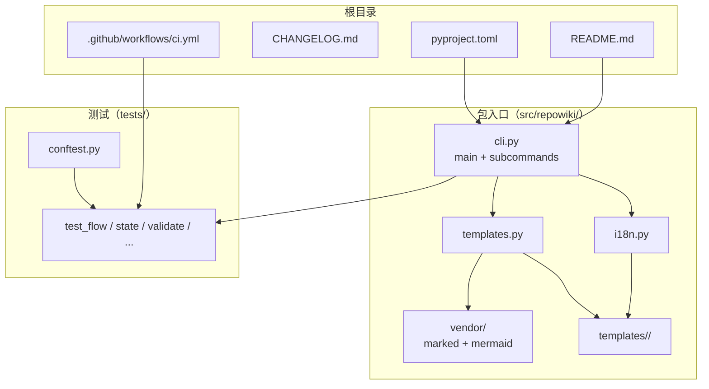
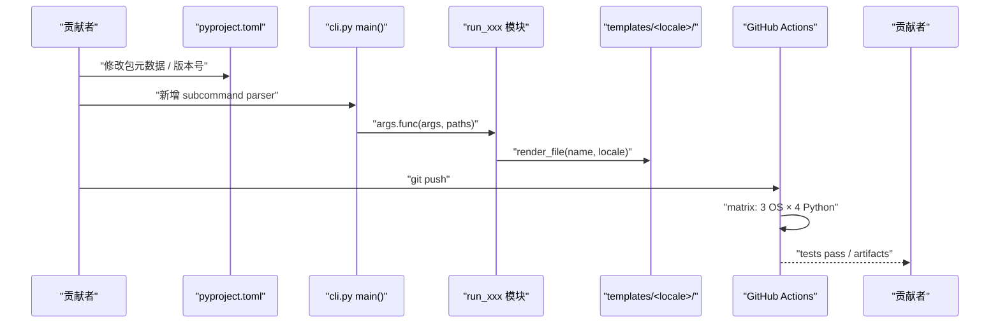
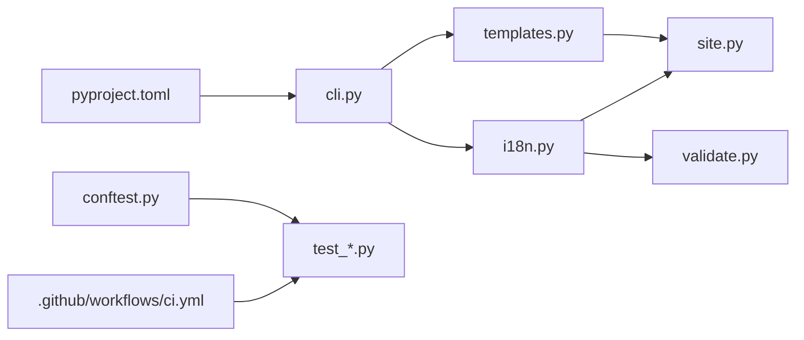

# 开发与扩展

<cite>
**本文引用的文件**
- [README.md](file://README.md)
- [CHANGELOG.md](file://CHANGELOG.md)
- [pyproject.toml](file://pyproject.toml)
- [.github/workflows/ci.yml](file://.github/workflows/ci.yml)
- [src/repowiki/cli.py](file://src/repowiki/cli.py)
- [src/repowiki/templates.py](file://src/repowiki/templates.py)
- [src/repowiki/i18n.py](file://src/repowiki/i18n.py)
- [tests/conftest.py](file://tests/conftest.py)
</cite>

## 更新摘要

**变更内容**
- 版本节奏更新：`pyproject.toml` 版本由 0.3.2 升至 **0.3.3**（[pyproject.toml:7](file://pyproject.toml#L7)）；`CHANGELOG.md`（现 167 行）新增 0.3.3 条目——站点抽屉菜单按钮桌面端死控件修复、README 双语首页架构图替换（中文版中文图 / 英文版英文图，含交互版 HTML 与规格）、自我描述去「不含 LLM」强调（改为「确定性构建」表述）。
- `README.md` 现 297 行：首页 ASCII 架构图替换为架构图图片 + 交互版链接（[README.md:17-19](file://README.md#L17-L19)），自我描述与特性列表改为「确定性构建」表述；包 `description` 同步删去 "Zero LLM, zero network."（[pyproject.toml:8](file://pyproject.toml#L8)）。因图块收敛行号整体位移，本页 README 引用区间已重新核对。
- 同步更新正文「当前 0.3.2 已发」的版本状态描述。

## 目录
1. [更新摘要](#更新摘要)
2. [简介](#简介)
3. [项目结构](#项目结构)
4. [核心组件](#核心组件)
5. [架构总览](#架构总览)
6. [详细组件分析](#详细组件分析)
7. [依赖关系分析](#依赖关系分析)
8. [性能与一致性考量](#性能与一致性考量)
9. [故障排查指南](#故障排查指南)
10. [结论](#结论)

## 简介

「开发与扩展」面向想动手改 `repowiki` 的开发者：本页把仓库结构、Python 包布局、CLI 入口注册、模板/i18n 扩展点、测试约定、CI 矩阵、CHANGELOG 节奏串在一起，让新贡献者能在 5 分钟内定位「我该改哪个文件」，并知道「改完要跑什么 / 怎么发版」。理解这层结构就掌握了从「使用者」晋升为「贡献者」所需的最小知识。

## 项目结构

与「开发与扩展」相关的源文件分散在仓库根与多个目录：

- `README.md` —— 项目自述；含定位、命令一览、平台声明、离线安装、查看 Wiki 等章节。
- `CHANGELOG.md` —— 版本节奏记录；按「新增 / 修复 / 文档 / 测试 / 清理」分类；当前 0.3.3 已发（0.3.3 为 2026-09-07 发布的文档与站点修复补丁版）。
- `pyproject.toml` —— 包元数据、`repowiki = "repowiki.cli:main"` console_script 入口、`[test]` optional-dependencies、`[tool.setuptools.package-data]` 列出模板与 vendor 资源。
- `.github/workflows/ci.yml` —— GitHub Actions CI；矩阵：ubuntu-latest × macos-latest × windows-latest × Python 3.10~3.13。
- `src/repowiki/cli.py` —— `main()` 入口；通过 `set_defaults(func=cmd_*)` 把子命令路由到各模块顶层函数。
- `src/repowiki/templates.py` —— `load / render / render_file` 三个函数；locale 不存在时回退到 zh。
- `src/repowiki/i18n.py` —— `STRINGS / SUPPORTED / DEFAULT_LOCALE / detect_locale / strings`；新增语言 = 加一条 STRINGS + 一个模板目录。
- `tests/conftest.py` —— 共享 fixture；所有测试都从这里取合成仓库与基础对象。
- `src/repowiki/vendor/` —— 内嵌的 marked.min.js 与 mermaid.min.js；随 wheel 分发，是单文件离线站点的关键资源。
- `src/repowiki/templates/<locale>/` —— 按 locale 切分的模板目录；zh 与 en 是当前两个完整集。

图表来源
- [pyproject.toml:18-27](file://pyproject.toml#L18-L27)

章节来源
- [README.md:1-50](file://README.md#L1-L50)

## 核心组件

- **main()**（cli.py）：CLI 入口；解析 argv → 派发子命令 → 返回退出码；每个子命令通过 `set_defaults(func=cmd_*)` 注册。
- **run_***（cli.py 之外）：各子命令的编排层实现；`run_plan / run_next / run_check / run_finalize / run_site / run_knowledge / run_status / run_clean / run_watch` 等。
- **WikiPaths**（paths.py）：路径解析；新增命令时直接复用，不需要散落字符串拼接。
- **TaskStore**（state.py）：任务状态机；新增命令若涉及状态读写必走 `TaskStore`，自动获得并发安全与心跳。
- **templates.load / render / render_file**（templates.py）：扩展点 1；新增语言时在 `templates/<locale>/` 下放同名模板即可。
- **i18n.STRINGS**（i18n.py）：扩展点 2；新增语言时加一条 `STRINGS[<code>]` 含 `name / toc / required_sections / site` 等字段。
- **detect_locale**（i18n.py）：locale 自动检测；README 主导，代码样本补充。
- **validate.check_page / check_knowledge_***（validate.py）：校验规则；若新增产物类别，对应加一个 `check_<kind>` 函数。
- **site.html / app.js / vendor**（site.py + templates/site/）：单文件离线站点的三件套；扩展 markdown 渲染需求时改 `app.js`。
- **CHANGELOG.md**：发版节奏；每个版本分「新增 / 修复 / 文档 / 测试 / 清理」五类目。
- **ci.yml**：CI 矩阵；任何平台独占 bug 都在 ubuntu-latest × macos-latest × windows-latest × Python 3.10-3.13 上同时回归。

章节来源
- [.github/workflows/ci.yml:1-24](file://.github/workflows/ci.yml#L1-L24)

## 架构总览

「开发与扩展」遵循 `repowiki` 的整体架构：CLI 入口（cli.py）→ 各子命令模块（plan.py / dispatch.py / knowledge.py / site.py / state.py / catalog.py / templates.py / i18n.py / validate.py）→ 共享数据契约（WikiPaths / TaskStore / FileEntry / Inventory）。新增命令或扩展语言时，按"修改 cli.py 加 subcommand + 写新的 run_xxx 模块 + 在 STRINGS 加语言字段 + 在 templates 加同名模板"的最小约定扩展即可。CI 矩阵保证改动不会破坏三平台 + Python 3.10~3.13 的兼容。

图表来源
- [.github/workflows/ci.yml:8-24](file://.github/workflows/ci.yml#L8-L24)

章节来源
- [README.md:50-100](file://README.md#L50-L100)

## 详细组件分析

### 新增命令的标准路径

- 职责：定义新增子命令所需的最小代码改动集合。
- 关键行为：在 `cli.py` 加 `sub_X = subparsers.add_parser("X"); ...; sub_X.set_defaults(func=cmd_X)`；新建 `src/repowiki/X.py` 暴露 `run_X(paths, ...) -> int`；在 `cli.py` 的 `cmd_X(args, paths)` 转发层调 `run_X`。
- 实现要点：所有子命令统一返回 `int` 退出码；human/JSON 双格式由 `output.emit` 自动处理；涉及状态读写必走 `TaskStore`。

章节来源
- [src/repowiki/cli.py:1-50](file://src/repowiki/cli.py#L1-L50)

### 新增语言的扩展点

- 职责：定义新增 locale 所需的最小改动集合。
- 关键行为：在 `i18n.py` 的 `SUPPORTED` 加 `<code>`；在 `STRINGS[<code>]` 加完整字段（`name / toc / required_sections / site / overview_*`）；在 `templates/<code>/` 下放与 `zh/` 同名的所有模板文件。
- 实现要点：`detect_locale` 必须支持新 locale 的判定（扩展正则或加到 README 比例判断）；`templates.load` 在 locale 不存在时回退到 zh，但 `validate.py` 会按 locale 校验必备小节名，所以 STRINGS 是必需的。

章节来源
- [src/repowiki/i18n.py:14-83](file://src/repowiki/i18n.py#L14-L83)

### 模板与 vendor 资源打包

- 职责：定义模板与 vendor JS 如何随 wheel 分发。
- 关键行为：`pyproject.toml` 的 `[tool.setuptools.package-data] = {repowiki = ["templates/*/*", "templates/site.html", "templates/site/*", "vendor/*.js"]}` 把模板与 vendor JS 列为 pip 安装物料。
- 实现要点：`templates/site.html` 与 `templates/site/*` 是单文件离线站点的资源；`vendor/*.js` 是内嵌的 marked + mermaid；这三类必须在 sdist 与 wheel 中都存在。

章节来源
- [pyproject.toml:21-27](file://pyproject.toml#L21-L27)

### CI 矩阵与回归保障

- 职责：通过 GitHub Actions 在三平台 × 四 Python 版本上并行回归。
- 关键行为：`strategy.fail-fast: false` 让单平台失败不阻塞其他平台的报告；`pip install -e .[test]` 装入 `[test]` optional-dependencies；`pytest` 跑整套测试。
- 实现要点：Python 3.10 是 pyproject.toml 的 `requires-python` 下限；3.13 是当时最新稳定版；任何平台独占 bug（如 msvcrt 锁语义）都会在 windows-latest 暴露。

章节来源
- [.github/workflows/ci.yml:8-24](file://.github/workflows/ci.yml#L8-L24)

### CHANGELOG 节奏

- 职责：记录每次发版的「新增 / 修复 / 文档 / 测试 / 清理」五类变更。
- 关键行为：从 0.1.0 首个公开版 → 0.2.0 极简清理 → 0.3.0 加入 Windows 原生支持与单文件离线站点 → 0.3.1 Windows CI 兼容与 watch 停滞误报修复 → 0.3.2 文档集中双语化与 `detect_locale` README 主文件修复；每个版本都对应一个时间戳（2026-09-03 / 2026-09-04 / 2026-09-05）。
- 实现要点：「清理（ponytail 全仓审计）」是 0.2.0 的专属类目，反映了项目对「极简 / 不发明」的偏好；这是贡献者修改代码时也应注意的取向。

章节来源
- [CHANGELOG.md:1-54](file://CHANGELOG.md#L1-L50)

### 测试约定

- 职责：保证新增代码可被自动回归。
- 关键行为：所有测试用 `tests/conftest.py` 的 fixture；新命令的测试放在 `tests/test_<command>.py`；多进程 race 测试用 `multiprocessing` 真起子进程。
- 实现要点：测试不需要 mock 整个 `WikiPaths`——`tmp_path` 的 `WikiPaths(repo)` 已经是真实的端到端入口；这是 `repowiki` 测试的低样板特性。

章节来源
- [tests/conftest.py:38-70](file://tests/conftest.py#L38-L70)

## 依赖关系分析

- `pyproject.toml` 是包安装与依赖声明的唯一来源；`pip install -e .[test]` 同时装上 pytest。
- `cli.py` 是所有子命令的入口；新增命令时只改 `cli.py` 的 parser 段即可，不需要动 main() 的派发逻辑（v0.2.0 简化后）。
- `templates.py` 是模板渲染的最小依赖（仅标准库 `re`）；locale 模板不存在时回退到 zh。
- `i18n.py` 是 `validate.py` 与 `site.py` UI 文案的母参数；新增语言时同时改 STRINGS 与 templates。
- `tests/conftest.py` 是所有测试的共享底座；新命令的测试只需 import `repo / paths / git_repo` 即可获得合成仓库。
- `.github/workflows/ci.yml` 的矩阵触发三平台并行回归；测试失败时 GitHub PR 上能看到具体 OS + Python 版本的报错。

图表来源
- [pyproject.toml:18-30](file://pyproject.toml#L18-L30)

章节来源
- [pyproject.toml:18-30](file://pyproject.toml#L18-L30)

## 性能与一致性考量

- **零重型依赖**：pyproject.toml 的 `dependencies = ["pyyaml>=6"]`；模板引擎仅用标准库 `re`；所有扩展都不应引入 jinja2、portalocker 等重型库（见 ADR 0001 的 portalocker 拒绝理由）。
- **三平台兼容**：所有 `os.path` 操作走 `pathlib.Path`；所有文件锁走 fcntl/msvcrt 双后端；新增代码不应假设 POSIX 独有特性。
- **CI 矩阵并行**：`fail-fast: false` + 4 Python × 3 OS = 12 job 并行；本地开发 macOS/Linux，Windows 由 CI 兜底。
- **vendor 版本固定**：marked 与 mermaid 的 minified 版本被 vendor/ 锁定，不通过 CDN 引用；避免依赖漂移。
- **包数据完整**：pyproject.toml 的 package-data 必须含 templates + vendor；漏一个 `pip install` 都会导致 site 命令失败。
- **CHANGELOG 五类目**：每个 PR 都对应一个类目，便于发版时回溯；这是开源项目的常规约定。
- **测试无 mock**：所有测试用真实 `WikiPaths` + 真实 `tmp_path`，避免 mock 污染；这是 140 个测试全绿的物理基础。
- **极简取向**：CHANGELOG 0.2.0 的「清理（ponytail 全仓审计，净删约 76 行）」类目提醒贡献者保持代码极简，不要发明新的抽象层；0.3.1/0.3.2 则示范了「补丁版只装修复与文档」的节奏。

章节来源
- [CHANGELOG.md:110-124](file://CHANGELOG.md#L110-L124)

## 故障排查指南

- 现象：`pip install -e .` 后 `repowiki` 命令找不到。
  - 原因：console_scripts 注册失败；pyproject.toml 的 `[project.scripts]` 配置丢失。
  - 定位步骤：核对 `[project.scripts]` 含 `repowiki = "repowiki.cli:main"`；重新 `pip install -e .`。
  - 相关代码位置：[pyproject.toml:18-20](file://pyproject.toml#L18-L20)。

- 现象：`repowiki site` 报 vendor JS 不存在。
  - 原因：package-data 配置丢失；pip 安装时未带 vendor。
  - 定位步骤：核对 `[tool.setuptools.package-data]` 含 `vendor/*.js`；或重新 `pip install -e .`。
  - 相关代码位置：[pyproject.toml:21-27](file://pyproject.toml#L21-L27)。

- 现象：CI windows-latest 报 `fcntl not available`。
  - 原因：Windows 下不应 import fcntl；新增代码假设了 POSIX 独有特性。
  - 定位步骤：用 `try: import fcntl / except ImportError: import msvcrt` 模式；或把所有文件锁都走 `state.py` 的 `_exclusive_lock` 抽象。
  - 相关代码位置：[src/repowiki/state.py:35-56](file://src/repowiki/state.py#L35-L56)。

- 现象：detect_locale 在新 locale 仓库上选错语言。
  - 原因：新增 locale 没在 STRINGS 注册；或 detect_locale 不识别。
  - 定位步骤：核对 `STRINGS` 含该 locale；扩展 `detect_locale` 的判定逻辑（README 比例 + 代码样本 CJK）。
  - 相关代码位置：[src/repowiki/i18n.py:14-133](file://src/repowiki/i18n.py#L14-L133)。

- 现象：CI Python 3.13 报类型/语法错误。
  - 原因：用到了 3.13 不兼容的语法；或 `from __future__ import annotations` 缺失。
  - 定位步骤：核对模块文件第一行有 `from __future__ import annotations`；避免使用 3.10 之前的语法糖。
  - 相关代码位置：[.github/workflows/ci.yml:14](file://.github/workflows/ci.yml#L14)。

- 现象：CHANGELOG 与 pyproject 版本号不一致。
  - 原因：发版前忘了 bump；CI 或 release 流程会拒。
  - 定位步骤：发版前同步 bump `pyproject.toml` 的 `version`、`.claude-plugin/plugin.json`（如有）、`CHANGELOG.md` 顶部日期。
  - 相关代码位置：[CHANGELOG.md:1-3](file://CHANGELOG.md#L1-L3)、[pyproject.toml:7](file://pyproject.toml#L3)。

- 现象：新命令跑 `pytest` 找不到测试。
  - 原因：测试文件名必须以 `test_` 开头；函数名以 `test_` 开头；fixture 在 `conftest.py` 注册。
  - 定位步骤：核对文件名与函数名；检查 `tests/conftest.py` 是否提供所需 fixture。
  - 相关代码位置：[tests/conftest.py:1-70](file://tests/conftest.py#L1-L70)。

章节来源
- [pyproject.toml:1-36](file://pyproject.toml#L1-L36)

## 结论

「开发与扩展」是 `repowiki` 对贡献者的契约：包结构（pyproject.toml + setuptools packages.find + package-data）保证 pip 分发完整；CLI 入口（cli.py main + set_defaults(func=cmd_*)）保证子命令派发一致；模板与 i18n（templates.py + i18n.STRINGS）保证新增语言的扩展点明确；测试（tests/conftest.py + ci.yml 三平台矩阵）保证改动在 macOS / Linux / Windows × Python 3.10~3.13 上同时回归；CHANGELOG 五类目保证发版节奏可追溯。这套组合让任何「想给 repowiki 加命令 / 加语言 / 加模板 / 修 bug」的贡献者都能在最小阻力下完成改动并被 CI 验证。**已更新**：版本节奏推进到 0.3.2（文档双语化 + Windows CI 兼容修复），CHANGELOG 示例同步到最新补丁链。

章节来源
- [README.md:1-50](file://README.md#L1-L50)