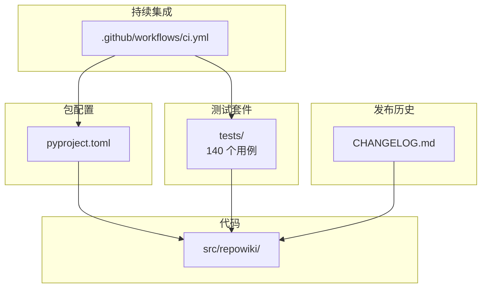
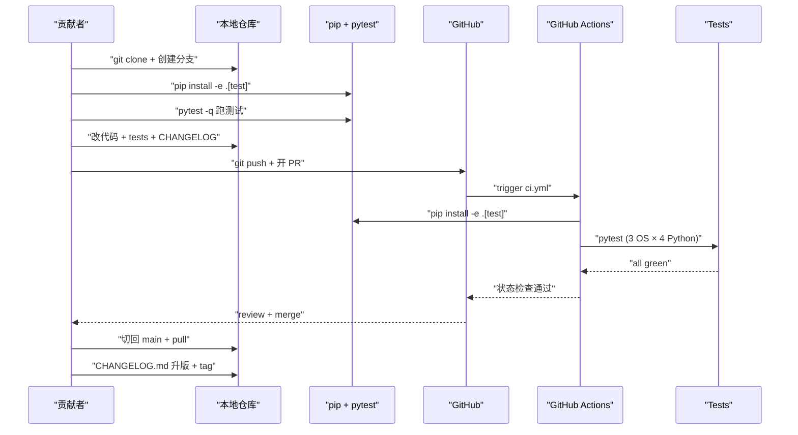
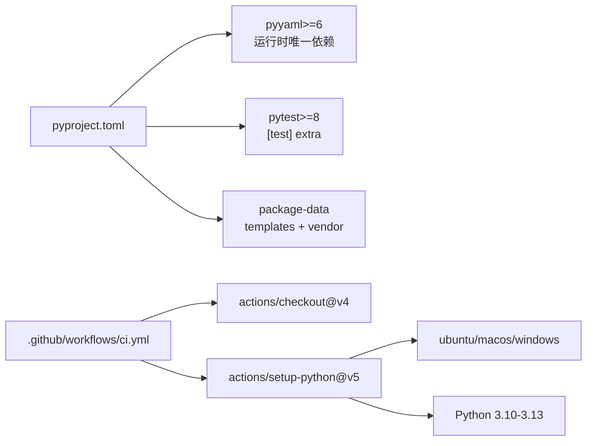

# 贡献流程与 CI

<cite>
**本文引用的文件**
- [.github/workflows/ci.yml](file://.github/workflows/ci.yml)
- [pyproject.toml](file://pyproject.toml)
- [CHANGELOG.md](file://CHANGELOG.md)
- [README.md](file://README.md)
</cite>

## 更新摘要

**变更内容**
- 版本推进：`pyproject.toml` 版本现为 **0.3.3**（[pyproject.toml:7](file://pyproject.toml#L7)）；`CHANGELOG.md` 现为 167 行，新增 0.3.3 条目（站点抽屉菜单按钮桌面端死控件修复、README 双语架构图替换、自我描述去「不含 LLM」强调）。
- `README.md` 现 297 行：首页 ASCII 架构图替换为架构图图片 + 交互版链接，行号整体位移，本页 README 引用区间已同步核对；包 `description` 删去 "Zero LLM, zero network."。
- 本轮未新增测试用例，测试总数以本地 `pytest` 实测为准（含知识卡片 update/site 集成的新增用例）。

## 目录
1. [更新摘要](#更新摘要)
2. [简介](#简介)
3. [项目结构](#项目结构)
4. [核心组件](#核心组件)
5. [架构总览](#架构总览)
6. [详细组件分析](#详细组件分析)
7. [依赖关系分析](#依赖关系分析)
8. [性能与一致性考量](#性能与一致性考量)
9. [故障排查指南](#故障排查指南)
10. [结论](#结论)

## 简介
「贡献流程与 CI」覆盖 repowiki 仓库本身的本地开发、测试与持续集成约定。本地工作流以 `pip install -e .[test]` 与 `pytest -q` 为核心；CI 由 `.github/workflows/ci.yml` 触发，在 3 大操作系统 × 4 个 Python 版本（3.10-3.13）共 12 矩阵上跑全量 `pytest`；CHANGELOG.md 按「新增 / 变更 / 清理 / 修复 / 文档 / 测试」六类小节组织历史记录，强调用户可见行为变化与决策溯源。本节聚焦这三件事——本地如何跑测试、CI 触发条件与矩阵、CHANGELOG 写法约定——让新贡献者能在最少时间内完成从 clone 到 PR 的全流程。

## 项目结构
围绕贡献与 CI 这条主线，仓库内相关的产物集中在以下几个位置（路径相对仓库根）：

- `.github/workflows/ci.yml`：24 行的 GitHub Actions 配置；`push` 到 `main` 或任意 `pull_request` 触发；在 ubuntu-latest / macos-latest / windows-latest × Python 3.10-3.13 矩阵上跑 `pip install -e .[test]` + `pytest`。
- `pyproject.toml`：`[project]` 节声明包名 `repowiki`、版本 `0.3.3`、运行时依赖 `pyyaml>=6`、`requires-python = ">=3.10"`；`[project.optional-dependencies]` 提供 `test = ["pytest>=8"]`；`[tool.pytest.ini_options]` 指定 `testpaths = ["tests"]` 与 `addopts = "-q"`。
- `CHANGELOG.md`：152 行的发布历史；按版本倒序组织，每个版本用「新增 / 变更 / 清理 / 修复 / 文档 / 测试」六类小节标记用户可见变化。
- `tests/`：与代码同步演化的测试套件；当前 140 个用例覆盖竞态、孤儿认领自动回收、校验规则正反例、增量映射、知识聚合、双语产出、单文件站点生成、损坏状态文件与非法输入的友好报错。
- `README.md`：安装、命令一览、Worker 循环契约、可靠性设计、已知边界等顶层说明。

图表来源
- [.github/workflows/ci.yml:1-24](file://.github/workflows/ci.yml#L1-L24)
- [pyproject.toml:34-36](file://pyproject.toml#L34-L36)

章节来源
- [.github/workflows/ci.yml:1-24](file://.github/workflows/ci.yml#L1-L24)
- [pyproject.toml:1-36](file://pyproject.toml#L1-L36)
- [CHANGELOG.md:1-152](file://CHANGELOG.md#L1-L152)
- [README.md:53-56](file://README.md#L53-L56)

## 核心组件
- `ci.yml`：GitHub Actions 工作流定义；触发条件是 `push.branches: [main]` 或 `pull_request`（任意分支），矩阵策略 `fail-fast: false` 保证单格失败不取消其他格。
- `pyproject.toml` 的 `[project.optional-dependencies]`：`test = ["pytest>=8"]`，`pip install -e .[test]` 会同时拉 pytest 与本地源码包。
- `pyproject.toml` 的 `[tool.setuptools.packages.find]` 与 `[tool.setuptools.package-data]`：声明包根目录与需随 wheel 分发的非 Python 文件（模板与 vendor JS）。
- `CHANGELOG.md`：六类小节（新增 / 变更 / 清理 / 修复 / 文档 / 测试）作为变更的「信号灯」；每条都尽量给出行为描述、动机与受影响范围。
- `tests/conftest.py`：`repo` / `git_repo` / `paths` fixture 让每个测试在独立的 `tmp_path` 仓库里跑，CI 并行下也互不污染。
- `README.md` 中的「可靠性设计」「设计取舍」「已知边界」：贡献者在改设计前需要先读这三节，避免重复已被显式否定的方案。

章节来源
- [.github/workflows/ci.yml:1-24](file://.github/workflows/ci.yml#L1-L24)
- [pyproject.toml:1-36](file://pyproject.toml#L1-L36)
- [CHANGELOG.md:1-152](file://CHANGELOG.md#L1-L152)
- [README.md:231-265](file://README.md#L231-L265)

## 架构总览
贡献者视角的端到端流程：从 clone 仓库开始，先 `pip install -e .[test]` 装本地源码与 pytest；在本地改完代码后跑 `pytest -q` 验证（CI 矩阵的子集）；若涉及 CLI 行为变化，本地补一个 `tests/test_*.py` 用例；接着写 `CHANGELOG.md` 条目，把用户可见变化按六类小节分类；然后 push 到 fork 并开 PR；CI 自动在 3×4 矩阵上跑全量 pytest；review 通过后合入 `main`，触发 release tag 与 Release Notes（CHANGELOG 对应小节会被复用）。下图给出这一时序。

图表来源
- [.github/workflows/ci.yml:1-24](file://.github/workflows/ci.yml#L1-L24)
- [pyproject.toml:22-23](file://pyproject.toml#L22-L23)

章节来源
- [.github/workflows/ci.yml:1-24](file://.github/workflows/ci.yml#L1-L24)
- [pyproject.toml:1-36](file://pyproject.toml#L1-L36)
- [README.md:67-141](file://README.md#L67-L141)

## 详细组件分析

### 本地开发：install + test 一气呵成
- 职责：让贡献者在一行命令里完成源码装载与测试依赖安装，再用一行命令跑全量测试。
- 关键行为：`pip install -e .[test]`（`pyproject.toml:22-23` 提供 `test` extra）会同时装本地源码（`-e` 可编辑模式）与 `pytest>=8`；`pytest`（无需参数）会读 `[tool.pytest.ini_options]` 的 `testpaths = ["tests"]` 与 `addopts = "-q"`，自动在 `tests/` 下递归发现用例并以安静模式输出。
- 实现要点：`requires-python = ">=3.10"`（`pyproject.toml:9`）与 CI 矩阵最低版本一致；本地 Python 必须 ≥ 3.10 才能跑测试，CI 则额外覆盖 3.11 / 3.12 / 3.13。

章节来源
- [pyproject.toml:1-36](file://pyproject.toml#L1-L36)
- [README.md:67-141](file://README.md#L67-L141)

### CI 矩阵：3 操作系统 × 4 Python
- 职责：用 GitHub Actions 的 matrix 在 CI 上验证所有「runtime 平台 × Python 版本」组合。
- 关键行为：`strategy.matrix.os: [ubuntu-latest, macos-latest, windows-latest]` 配 `python-version: ["3.10", "3.11", "3.12", "3.13"]` 共 12 格；`fail-fast: false`（`ci.yml:11`）让单格失败不取消其他格（Windows 锁后端 / Python 版本不兼容等问题能独立报告）；`runs-on: ${{ matrix.os }}`（`ci.yml:15`）让每个矩阵格跑在原生 runner 上而非容器化环境。
- 实现要点：每个格先 `actions/checkout@v4` 拉代码，再 `actions/setup-python@v5` 装指定 Python 版本，最后 `pip install -e .[test]` + `pytest`。CI 上无 lint / format / type-check 步骤——目前 CI 只跑测试。

章节来源
- [.github/workflows/ci.yml:1-24](file://.github/workflows/ci.yml#L1-L24)
- [CHANGELOG.md:7-10](file://CHANGELOG.md#L7-L10)

### CHANGELOG 写法约定
- 职责：让发布历史成为「用户可见行为变化」的可追溯档案，而不是「commit 流水账」。
- 关键行为：`CHANGELOG.md` 每个版本用 `## X.Y.Z — YYYY-MM-DD` 标题；下分「新增 / 变更 / 清理 / 修复 / 文档 / 测试」六类小节（按需出现，不必每节都填）；粗体标记**破坏性**变更（如 `**移除 next --batch（破坏性）**`）；每条都尽量说明「行为是什么 + 为什么 + 受影响范围」。
- 实现要点：版本号与 `pyproject.toml:7` 的 `version` 字段保持同步；插件清单 `.claude-plugin/plugin.json` 也需同步（CHANGELOG 0.3.0 修复项第 22 行有提及）；版本倒序（最新在最上）；「清理」小节通常来自 ponytail 全仓审计，列出删除的死代码与净删行数。

**章节来源**
- [CHANGELOG.md:1-152](file://CHANGELOG.md#L1-L152)

### 测试套件的演化与现状
- 职责：保证每个版本的「功能新增 + 清理修复」都有对应测试守护。
- 关键行为：`CHANGELOG.md` 的版本片段里持续报告测试数量（0.1.0 没单独提、0.2.0「126 个测试全绿」、0.3.0「140 个」、0.3.1「140 个」、0.3.2「149 个测试全绿」、0.3.3 起不再在 CHANGELOG 中固定测试总数）；每次新增功能都伴随 `tests/test_*.py` 新文件/新用例（如 0.3.0 新增 `tests/test_site.py` 14 个用例）；重要回归会被写进守卫类（`TestLifecycleGuards / TestStaleRecovery / TestP1Guards`）。
- 实现要点：`tests/conftest.py` 提供 `repo` / `git_repo` fixture，所有 CLI 测试都通过 `cli.main(argv)` 真实调用而非 mock——这是「测试与生产用同一份代码」的典型做法。

**章节来源**
- [CHANGELOG.md:33-37](file://CHANGELOG.md#L33-L37)
- [CHANGELOG.md:62-64](file://CHANGELOG.md#L62-L64)
- [README.md:53-56](file://README.md#L53-L56)

### 提交信息与 PR 约定
- 职责：让每个 PR 的标题、说明与对应 CHANGELOG 条目可双向追溯。
- 关键行为：仓库未强制 conventional commit（CHANGELOG 没明确要求 commit 标题遵循 Angular 风格）；CHANGELOG 的小节（新增 / 变更 / 清理 / 修复 / 文档 / 测试）实际充当了 conventional commit 的「逻辑分类」——把 commit 信息按用户可见影响归类后落入对应小节。GitHub 侧没有 PR 模板（仓库根无 `.github/PULL_REQUEST_TEMPLATE.md`），但 README 与 CHANGELOG 已足够让贡献者知道「需要写哪些小节」。
- 实现要点：建议贡献者在 PR 描述里直接列出「对应 CHANGELOG.md 的哪些小节」，方便 reviewer 与 release 时复用。

**章节来源**
- [CHANGELOG.md:1-152](file://CHANGELOG.md#L1-L152)
- [README.md:165-211](file://README.md#L165-L211)

## 依赖关系分析
- 运行时依赖：`pyyaml>=6`（`pyproject.toml:13`）——唯一第三方依赖；离线 wheel 安装场景下需要按目标平台/Python 版本分别下载（`README.md:91-116`）。
- 测试依赖：`pytest>=8`（`pyproject.toml:23`，来自 `[test]` extra）。
- 包分发数据：`pyproject.toml:31-32` 的 `package-data` 把 `templates/*/*`、`templates/site.html`、`templates/site/*`、`vendor/*.js` 全部随 wheel 走，离线场景无需额外文件。
- CI 依赖：`actions/checkout@v4`、`actions/setup-python@v5`——标准 GitHub 官方 action，无第三方 action。
- 平台差异：POSIX `fcntl` / Windows `msvcrt.locking` 双锁后端（`state.py:35-56`）；CI 矩阵包含 windows-latest 是为了跑通这一路径。

图表来源
- [pyproject.toml:13](file://pyproject.toml#L13-L13)
- [pyproject.toml:22-23](file://pyproject.toml#L22-L23)
- [.github/workflows/ci.yml:13-19](file://.github/workflows/ci.yml#L13-L19)

章节来源
- [pyproject.toml:1-36](file://pyproject.toml#L1-L36)
- [.github/workflows/ci.yml:1-24](file://.github/workflows/ci.yml#L1-L24)

## 性能与一致性考量
- CI 矩阵成本：3 OS × 4 Python = 12 格；每格 `pip install -e .[test] + pytest`；当前 150+ 个测试在 ubuntu runner 上约 1-2 分钟，矩阵总时长 ~30-60 分钟——GitHub Actions 免费额度内可接受。
- 跨平台锁差异：Windows 格只跑 msvcrt.locking 路径，POSIX 格只跑 fcntl 路径；`test_missing_lock_backends_reports_usage_error`（`test_robustness.py:89-96`）额外用 monkeypatch 验证「双后端均不可用」的友好报错——这条用例不受 CI 平台限制，在所有 12 格都跑。
- 离线安装：CI 用的是 `pip install -e .[test]`，但发布 wheel 时需要按平台打包 `pyyaml` 离线 wheel；这是 release 阶段而非 CI 阶段的事。
- 测试隔离：`tests/conftest.py` 每个 fixture 都基于 `tmp_path`，CI 上不同 job / 不同 Python 版本的并行运行不会互相污染；唯一需要顺序的地方是 `test_index_transaction_no_lost_updates` 这种多进程压测，但 pytest 默认串行 + `mp.Pool` 内部自有协调。
- CHANGELOG 体积：当前 152 行覆盖 5 个版本；按此增长率，单版本约 30 行（0.3.0 占 35 行），一年 6-12 次发版约 200-400 行——CHANGELOG.md 不会失控。

章节来源
- [.github/workflows/ci.yml:9-24](file://.github/workflows/ci.yml#L9-L24)
- [tests/test_robustness.py:89-96](file://tests/test_robustness.py#L89-L96)
- [CHANGELOG.md:1-152](file://CHANGELOG.md#L1-L152)

## 故障排查指南
- 本地 `pip install -e .[test]` 报 `No module named repowiki`：可能是 `pip` 关联到了不同 Python；用 `python -m pip install -e .[test]` 显式指定当前解释器。
- 本地 `pytest` 报 `fixture paths not found`：`tests/conftest.py` 必须在 `tests/` 下；不要在仓库根跑 `pytest tests/`，直接 `pytest` 即可。
- CI 上某格失败但本地全绿：通常跟平台/Python 版本相关。优先看失败栈顶 ——
  - Windows：`msvcrt.locking` 报「state/.index.lock 被其他进程长期占用」：极可能是 CI runner 上残留其他进程；可重跑该格。
  - macOS：`fcntl.flock` 偶发：罕见，通常是 APFS 时间精度；可重跑。
  - Python 3.10：最老支持版本；某些类型注解的 `from __future__ import annotations` 没生效时可能出问题；所有 `src/repowiki/*.py` 顶部都有 `from __future__ import annotations`，理论上不会。
- CI `actions/setup-python@v5` 报 cache 错误：缓存键基于 Python 版本 + 依赖哈希；如果同时改了 `pyproject.toml` 与代码可能需要清缓存；可直接 retry。
- CHANGELOG 漏写某类变更：提交前对照 README「可靠性设计」「设计取舍」「已知边界」三节自检；新功能必有「新增」小节；用户可见行为变化必有「变更」或「修复」小节；删除代码必有「清理」小节。
- CHANGELOG 版本号与 `pyproject.toml` 不一致：`git grep "version"` 应只在 `pyproject.toml` 与 `.claude-plugin/plugin.json` 出现一次；release 前必须同步。
- 测试数突然下降：通常是某次「清理」小节删了死代码连带删了对应测试——确认删除的是死测试；如果删的是有意义的测试，应改写到「修复」小节并补替代用例。
- 想加 lint / type-check：CI 当前没有这些步骤；可在 PR 中加一个 `optional` job 跑 ruff/mypy 看看效果，但不要直接改成「CI 必跑」——可能因既有代码风格问题拖慢贡献节奏。

章节来源
- [pyproject.toml:1-36](file://pyproject.toml#L1-L36)
- [.github/workflows/ci.yml:1-24](file://.github/workflows/ci.yml#L1-L24)
- [CHANGELOG.md:1-152](file://CHANGELOG.md#L1-152)
- [README.md:231-265](file://README.md#L231-L265)

## 结论
repowiki 的贡献流程刻意做小——本地一行 `pip install -e .[test]` + 一行 `pytest -q`；CI 矩阵覆盖 3 OS × 4 Python 共 12 格；CHANGELOG.md 按「新增 / 变更 / 清理 / 修复 / 文档 / 测试」六类小节记录用户可见变化。设计取舍是「CI 只跑测试、不跑 lint/format/type-check」「无 PR 模板、靠 README 与 CHANGELOG 自我约束」「版本号与插件清单同步靠人」。对于想要贡献的开发者，最自然的接入顺序是：clone → 装本地依赖 → 在 `tests/` 下加一个能复现 bug 或验证新功能的用例 → 改 `src/repowiki/` → 跑 pytest → 在 CHANGELOG.md 相应小节写一行 → 开 PR；CI 会自动跑完 12 格矩阵。**已更新**：版本节奏推进到 0.3.3，CHANGELOG 覆盖 167 行，README 架构图替换后的行号位移已同步。

章节来源
- [.github/workflows/ci.yml:1-24](file://.github/workflows/ci.yml#L1-L24)
- [pyproject.toml:1-36](file://pyproject.toml#L1-L36)
- [CHANGELOG.md:1-152](file://CHANGELOG.md#L1-L152)
- [README.md:1-215](file://README.md#L1-L215)