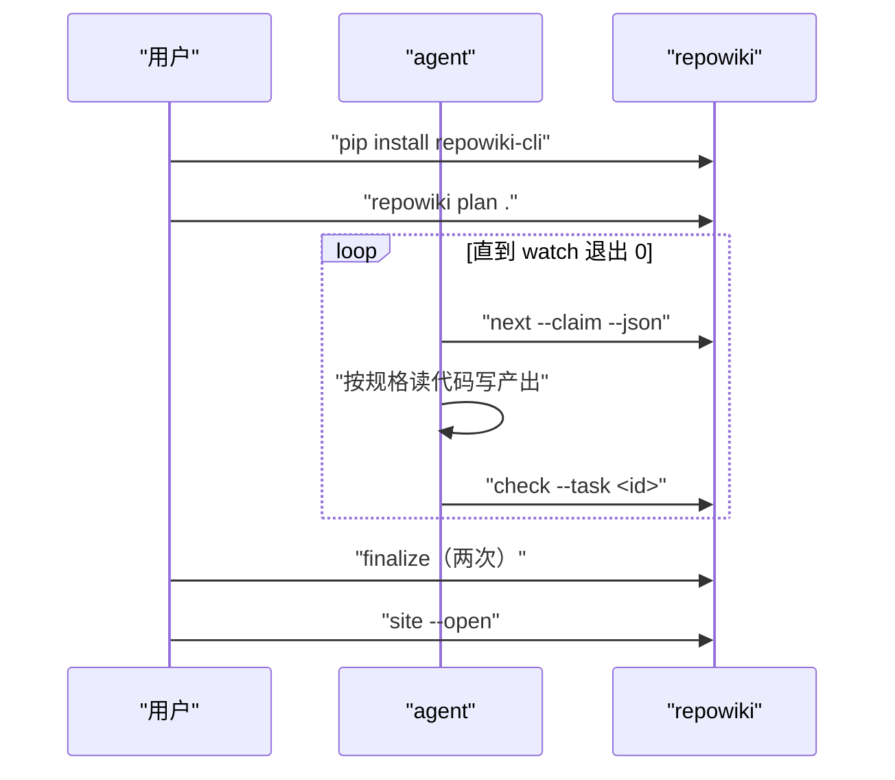
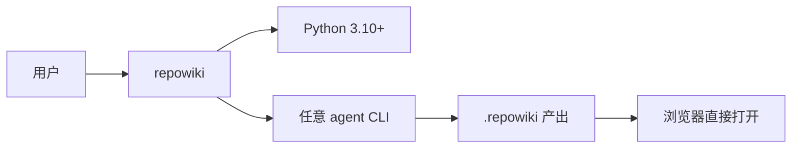

# 快速开始

<cite>
**本文引用的文件**
- [README.md](file://README.md)
- [docs/zh/USAGE.md](file://docs/zh/USAGE.md)
- [src/repowiki/cli.py](file://src/repowiki/cli.py)
</cite>

## 目录
1. [简介](#简介)
2. [项目结构](#项目结构)
3. [核心组件](#核心组件)
4. [架构总览](#架构总览)
5. [详细组件分析](#详细组件分析)
6. [依赖关系分析](#依赖关系分析)
7. [性能与一致性考量](#性能与一致性考量)
8. [故障排查指南](#故障排查指南)
9. [结论](#结论)

## 简介
本页给出从安装到看到 wiki 的最短路径：装 CLI（可选装 agent skill）、在目标仓库跑 plan、让 agent 循环领取任务、finalize 后 site 打包。全程零 API Key、零网络调用——安装时下载一次包，之后所有步骤都是本地的，wiki 内容不会离开你的机器。如果只想快速体验，一个十几分钟的会话就能在小仓库上跑完全部命令；如果要在团队长期使用，把文末的故障排查与 CI 集成（详见「CI 与发布流水线」页）一并配好。

章节来源
- [README.md:68-97](file://README.md#L68-L97)

## 项目结构
安装完成后你会得到一个 `repowiki` 命令（PyPI 包名 repowiki-cli，命令名与包名不同是历史原因）；生成发生在目标仓库内，产出集中在 `.repowiki/` 一个目录里：

```text
<目标仓库>/
└── .repowiki/
    ├── zh/
    │   ├── content/        # wiki 页面（长期维护，随仓库提交）
    │   ├── meta/           # 总览页 + repowiki-metadata.json
    │   └── wiki.html       # 单文件离线站点（约 5 MB）
    ├── llms.txt / llms-full.txt   # agent 索引
    └── state/              # 任务状态（可随时删除重建，可 gitignore）
```

- content/ 与 state/ 的隔离是刻意的：clean 命令只删 state，wiki 产物毫发无损
- 站点与 llms 索引由 site 命令从 content/ 确定性重建，幂等无副作用

章节来源
- [README.md:99-121](file://README.md#L99-L121)

## 核心组件
快速开始只用到五个命令，它们构成最小闭环；其余十个命令属于维护工具，用到时再查「CLI 命令参考」：

- repowiki plan \<repo\>：扫描仓库并生成任务清单（phase 1），产出语言自动检测（README 中英字符比），--locale 可指定
- repowiki next --claim --json：领取一个就绪任务，instructions 字段即完整撰写规格（内嵌页面骨架与文风规范），交给 agent 执行
- repowiki check --task \<id\>：校验产出并自动修复锚点/行号终点等确定性缺陷，通过则任务 done；失败会给出逐条 errors
- repowiki finalize：两步制收尾，第一次返回 exit 3 并创建总览任务，第二次汇总元数据返回 exit 0
- repowiki site [--open]：打包单文件离线站点并导出 llms.txt，幂等可重跑
- 扩展点：repowiki skill install 把随 wheel 分发的 agent skill 装入 ~/.agents/skills/repowiki/（或 --agent 指定 claude/codex/zcode/cursor/opencode 目录），让 agent 自动识别本工作流

章节来源
- [src/repowiki/cli.py:35-101](file://src/repowiki/cli.py#L35-L101)

## 架构总览
典型会话是「一条 plan + 一串 next/check 循环 + 两次 finalize + 一次 site」。agent 通过 --json 拿到结构化结果与完整 instructions，人只在目录评审与最终浏览时介入。下图是完整会话的时序，loop 块就是可并行、可中断续跑的部分：



实践中这个 loop 通常由 agent 的 skill 自动驱动（安装 skill 后 agent 会自己 next/check 到跑完）；多 agent 场景下各领各的任务互不冲突，人只需要在结束时看一眼 wiki.html。等待全部完成可用 repowiki watch 替代人工轮询。

图表来源
- [src/repowiki/cli.py:170-187](file://src/repowiki/cli.py#L170-L187)

章节来源
- [docs/zh/USAGE.md:1-40](file://docs/zh/USAGE.md#L1-L40)

## 详细组件分析
### 安装方式
- 职责：三种安装路径覆盖在线、开发、离线三种环境
- 关键行为：PyPI 安装 `pip install repowiki-cli` 或 `pipx install repowiki-cli`；开发安装克隆仓库后 `pip install -e .`；离线机器在有网环境下载 PyYAML wheel 与 Release 页的 repowiki_cli-*.whl，拷到目标机后 `pip install --no-index` 两个文件即可，装好后同样执行 repowiki skill install（纯本地拷贝）
- 实现要点：运行时依赖只有 pyyaml 是离线路径成立的前提

章节来源
- [README.md:70-97](file://README.md#L70-L97)

### 最小命令序列
- 职责：plan → （agent: next/check 循环）→ finalize ×2 → site，共五类命令
- 配置面：--locale zh|en 指定产出语言；--max-pages N 限制首批页面数量用于试跑（注意 finalize 有缺页门禁，试跑不 finalize）；--replan --force 推倒重规划；plan 之后人工修改 state/catalog.json 再重新 plan 是调整章节结构的事实方式（目录评审回路）

章节来源
- [src/repowiki/cli.py:35-46](file://src/repowiki/cli.py#L35-L46)

## 依赖关系分析
三方的依赖都很薄，且全部是必选路径上的一环：

- 必选：Python ≥ 3.10 与 pyyaml（CLI 运行）；一个能读写文件、执行命令的 coding agent（生成内容）；现代浏览器（看站点，站点自包含）
- 可选：agent skill（自动驱动工作流）、GitHub Actions（CI 门禁与自动刷新）



这张图里没有云端节点——「零网络」不是营销话术而是架构事实：内容不出本机，这也是它区别于 DeepWiki 类托管服务的关键，对有保密要求的仓库尤其重要。

图表来源
- [pyproject.toml:8-20](file://pyproject.toml#L8-L20)

章节来源
- [README.md:92-97](file://README.md#L92-L97)

## 性能与一致性考量
- 中断随时可续：任务状态落盘，重跑 next 自动接续；worker 崩溃由过期回收自愈，小仓库全程无需人工值守
- 生成后可反复 repowiki site 重建站点，幂等无副作用——适合挂在 CI 里每次 push 自动刷新
- 多 agent 并行：页面任务互相独立，加一个 agent 就近似加一倍速度，无需任何额外配置
- 首次生成的时间构成大致是：plan 秒级、每页撰写数分钟（取决于 agent 与页面复杂度）、finalize 与 site 各数秒——瓶颈永远在撰写而非编排

章节来源
- [README.md:54-54](file://README.md#L54-L54)

## 故障排查指南
首次使用的高频问题集中在环境与门槛两处，定位思路是先确认命令本身能跑（repowiki --version），再看 plan 的报错类别。重跑一遍永远是安全的排查动作——所有命令都是确定性函数，同输入必同输出，不存在越跑越坏的风险：

- plan 报「代码文件太少」：目标仓库代码文件不足 10 个（MIN_CODE_FILES 门槛），文档仓/合成仓不适用本工具
- next 显示无可领任务：用 status 看是否有 exhausted 任务需 release --force，或全部任务已完成该进 finalize
- 打开 wiki.html 空白或页面缺失：确认 finalize 已完成（zh/meta/repowiki-metadata.json 存在）且页面文件在 content/ 下，再重跑 site
- agent 领到的任务语言不对：语言在 plan 时确定并持久化（state/locale），需要换语言时 --force 重规划
- skill 装了但 agent 不识别：skill status 查看已装版本与位置；旧版 skill 与新版 CLI 语义不一致时重装刷新

章节来源
- [docs/zh/USAGE.md:40-80](file://docs/zh/USAGE.md#L40-L80)

## 结论
五条命令、一个 agent、一个浏览器，就是使用 repowiki 的全部外部依赖：plan、next/check 循环、finalize、site。小仓库十分钟内可跑完，大仓库交给多 agent 并行——把这套序列固化进 CI（参考仓库自带的 wiki.yml），就能得到一个随代码持续更新、内容不出内网的项目知识库。

章节来源
- [README.md:123-145](file://README.md#L123-L145)
