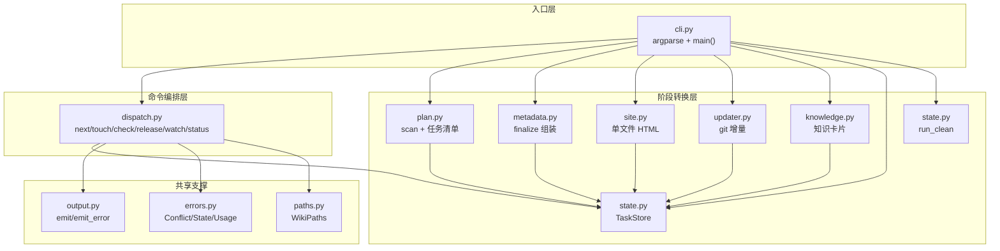
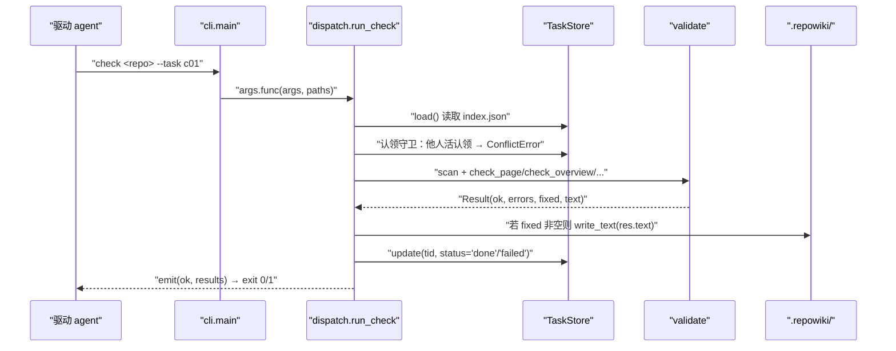
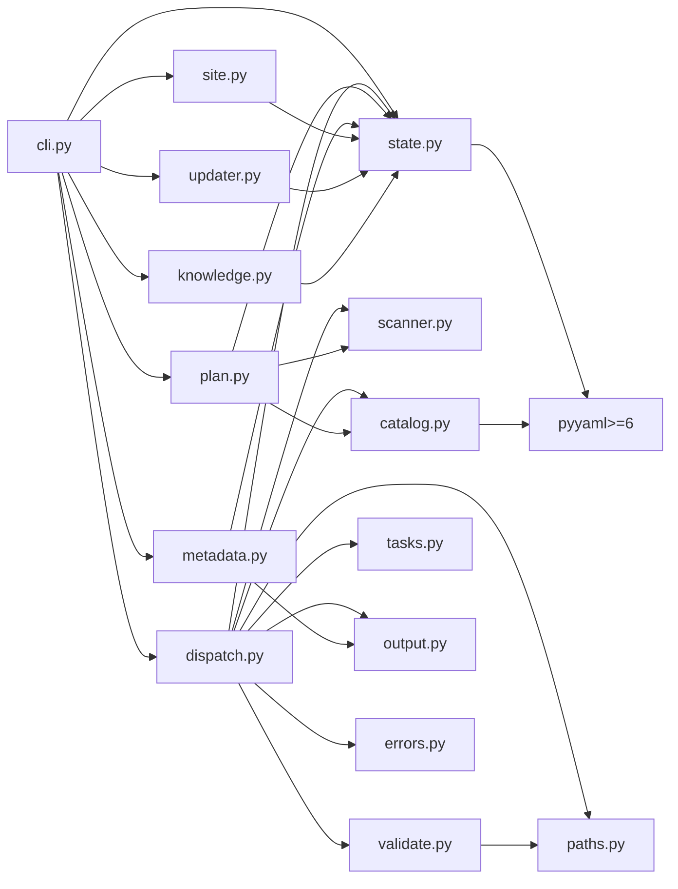

# CLI 入口与命令分发

<cite>
**本文引用的文件**
- [src/repowiki/cli.py](file://src/repowiki/cli.py)
- [src/repowiki/dispatch.py](file://src/repowiki/dispatch.py)
</cite>

## 目录
1. [更新摘要](#更新摘要)
2. [简介](#简介)
3. [项目结构](#项目结构)
4. [核心组件](#核心组件)
5. [架构总览](#架构总览)
6. [详细组件分析](#详细组件分析)
7. [依赖关系分析](#依赖关系分析)
8. [性能与一致性考量](#性能与一致性考量)
9. [故障排查指南](#故障排查指南)
10. [结论](#结论)

## 更新摘要

**变更内容**
- `src/repowiki/cli.py` 的顶层 `--help` 描述精简为 "Deterministic repo-wiki build system driven by coding agents."，与 v0.3.3「不再刻意强调不含 LLM」的自我描述调整保持一致（见 [src/repowiki/cli.py:26-29](file://src/repowiki/cli.py#L26-L29)）。
- 本次变更仅一行描述字符串：`cli.py` 行数（142 行）、子命令注册结构与本页全部行号引用保持不变；`dispatch.py` 本轮未变更，分发层相关小节维持原结论。

章节来源
- [src/repowiki/dispatch.py:126-199](file://src/repowiki/dispatch.py#L126-L199)

## 简介
「CLI 入口与命令分发」聚焦 `repowiki` 命令的两段式路由：第一段在 `cli.py` 内通过 argparse 把 argv 解析为子命令对象，并把每个子命令绑定到一个模块顶层函数；第二段在 `dispatch.py` 内把「运行时交互命令」（`next / touch / check / release / watch / status`）与「阶段转换命令」（`plan / finalize / site / update / knowledge / clean`）分层对待——前者读写 `TaskStore` 状态，后者各自走自己的模块。本节描述这一分发结构如何保证「一次只发放一个任务」「拒绝跨 worker 校验」「check 同时是规划阶段的扩张点」等关键不变量。

章节来源
- [src/repowiki/cli.py:1-22](file://src/repowiki/cli.py#L1-L22)

## 项目结构
围绕命令行分发这条主线，仓库内相关的产物集中在以下几个位置（路径相对仓库根）：

- `src/repowiki/cli.py`：argparse 入口文件；`build_parser()` 声明十二个 subparser，`main()` 负责把 `args.func` 派发到具体实现并把 `ConflictError / StateError / UsageError` 映射为退出码 2/1/1。
- `src/repowiki/dispatch.py`：命令编排核心；集中承载 `run_next / run_touch / run_check / run_release / run_watch / run_status` 这六个运行时交互命令，以及 `check` 这一规划阶段扩张点。
- `src/repowiki/plan.py` / `src/repowiki/metadata.py` / `src/repowiki/site.py` / `src/repowiki/updater.py` / `src/repowiki/knowledge.py` / `src/repowiki/state.py` / `src/repowiki/output.py` / `src/repowiki/paths.py` / `src/repowiki/errors.py`：阶段转换命令各自对应的模块，被 `cli.py` 直接 import 并通过 `p.set_defaults(func=...)` 绑定。
- `pyproject.toml:25-26`：把 `repowiki` 注册为指向 `repowiki.cli:main` 的脚本入口。
- `tests/`：跨平台回归测试，覆盖竞态、孤儿认领自动回收与校验规则正反例。

图表来源
- [src/repowiki/cli.py:13-22](file://src/repowiki/cli.py#L13-L22)
- [src/repowiki/dispatch.py:14-27](file://src/repowiki/dispatch.py#L14-L27)

章节来源
- [src/repowiki/cli.py:1-142](file://src/repowiki/cli.py#L1-L142)
- [src/repowiki/dispatch.py:1-50](file://src/repowiki/dispatch.py#L1-L50)

## 核心组件
- `build_parser()`：在 `cli.py:25-122` 用 `add_subparsers(dest="command", required=True)` 一次性声明十二个子命令，并把每个子命令的 argparse `Namespace` 通过 `p.set_defaults(func=...)` 绑定到一个 `run_*` 函数。
- `main(argv)`：位于 `cli.py:125-138`，调用 `build_parser().parse_args(argv)`，再用 `WikiPaths(args.repo)` 解析路径，最后把 `args.func(args, paths)` 的返回值当作退出码；异常被分三类并映射到 exit code。
- `_worker_id()`：在 `dispatch.py:30-31` 用 `socket.gethostname()` 加 `os.getpid()` 拼出 worker 标识，作为未显式传 `--worker` 时的兜底值。
- `run_next / run_touch / run_release / run_watch / run_status`：纯运行时命令，全部位于 `dispatch.py`，共同对外暴露「查询或认领队列、释放、续期、阻塞监控、统计」五个能力。
- `run_check`：位于 `dispatch.py:204-261`，同时承担「运行时校验」与「规划阶段扩张」两个角色，是 dispatch 层的「心脏」。

章节来源
- [src/repowiki/cli.py:25-122](file://src/repowiki/cli.py#L25-L122)
- [src/repowiki/cli.py:125-138](file://src/repowiki/cli.py#L125-L138)
- [src/repowiki/dispatch.py:30-31](file://src/repowiki/dispatch.py#L30-L31)
- [src/repowiki/dispatch.py:49-199](file://src/repowiki/dispatch.py#L49-L199)

## 架构总览
从一次 `repowiki next <repo> --claim --json` 的视角看，分发链是「argparse 解析 → 进入 `dispatch.run_next` → 构造 `TaskStore` → 调用 `ready_tasks(limit=1)` → `claim()` 原子认领 → 用 `_task_payload` 把规格文本读进 `instructions` → `emit()` 输出 JSON」。`check` 的链路更长：在 `run_check` 中先用 `_emit_check` 收集结果，再根据任务 `kind` 路由到 `_check_plan_task`（catalog / knowledge-plan 阶段任务）或 `_check_one`（页面 / 概览 / 知识卡片 / 知识模块）；校验失败时把状态置为 `failed`，校验成功时若 `res.fixed` 非空则用修复后的 `res.text` 写回 `out_file` 并把状态置为 `done`，对 `catalog` 类还会调用 `_expand_pages` 触发下一阶段任务的展开。下图给出 `check` 在混合任务集上的典型时序。

图表来源
- [src/repowiki/dispatch.py:204-261](file://src/repowiki/dispatch.py#L204-L261)
- [src/repowiki/dispatch.py:298-344](file://src/repowiki/dispatch.py#L298-L344)

章节来源
- [src/repowiki/cli.py:125-138](file://src/repowiki/cli.py#L125-L138)
- [src/repowiki/dispatch.py:1-50](file://src/repowiki/dispatch.py#L1-L50)

## 详细组件分析

### 入口层：`cli.py` 的 subparsers 与 `func` 绑定
- 职责：把 `argv` 解析为子命令对象，并把 `args.func` 当作「分发表」执行。
- 关键行为：`build_parser()` 在 `cli.py:25-122` 集中声明十二个子命令（`plan / next / touch / watch / check / release / finalize / site / update / knowledge / status / clean`），每个子命令的 argparse 参数集独立声明（如 `plan` 的 `--replan --force --max-pages --knowledge --locale`，`site` 的 `--open`）。`p.set_defaults(func=lambda a, paths: run_*(paths, ...))` 把闭包直接作为分发键——`main()` 不需要写大 `if/elif`，仅靠 `return args.func(args, paths)` 完成派发。
- 实现要点：`main()` 把三类异常映射到退出码（`ConflictError → 2`、`StateError / UsageError → 1`），错误信息通过 `output.emit_error` 同时支持人类可读与 JSON 两种形态（`--json` 时返回 `{"ok": false, "kind": "...", "message": "..."}`）。

章节来源
- [src/repowiki/cli.py:25-122](file://src/repowiki/cli.py#L25-L122)
- [src/repowiki/cli.py:125-138](file://src/repowiki/cli.py#L125-L138)

### 运行时交互命令：`dispatch.py` 的六个 `run_*`
- 职责：处理「队列状态读写 + 运行时校验 + 阻塞监控」这一组高频操作。
- 关键行为：
  - `run_next`（`dispatch.py:49-75`）按 FIFO 拉取 `limit=1` 个就绪任务；`--claim` 时逐项调用 `store.claim`（`ConflictError` 被静默吞掉，输掉竞争的那一方由下一轮 `next` 重新领任务）；用 `_task_payload` 把规格内联进 JSON 让 agent 程序化消费。
  - `run_touch`（`dispatch.py:118-123`）执行期心跳，刷新认领的 mtime 防过期回收。
  - `run_release`（`dispatch.py:90-95`）把 `in_progress` 任务强制回 `pending`，崩溃恢复用。
  - `run_status`（`dispatch.py:98-102`）输出统计 + failed/exhausted/stale 三类异常任务清单。
  - `run_watch`（`dispatch.py:126-199`）阻塞监控：每 `interval` 拉一次统计，把过期认领从 `in_flight` 中剔除（避免把已死任务误算成「执行中」），所有任务 done → exit 0，无 in_flight 且无可领取 → 先用新鲜 stats 复查一遍、确非快照滞后才 exit 1 并标注 `stalled`，达到 `--timeout` → exit 1 并标注 `timeout`。
- 实现要点：所有 `run_*` 函数都返回 `int` 退出码；JSON 输出统一通过 `output.emit()` 走「机器可读 + 人类可读」双视图，`emit` 接受一个 `_xxx_human` 回调生成人类文本。

章节来源
- [src/repowiki/dispatch.py:49-199](file://src/repowiki/dispatch.py#L49-L199)

### 阶段扩张点：`run_check` 的双角色
- 职责：校验任务产出；同时是规划阶段的扩张点（catalog / knowledge-plan 通过后自动展开下一批任务）。
- 关键行为：
  - `run_check`（`dispatch.py:204-261`）按 `--task` 或 `--all` 收集 `targets`；启用 `--worker` 时做认领守卫：若目标任务被他人活认领，直接抛 `ConflictError`，需要 `--force` 才能代为校验。
  - `_check_one`（`dispatch.py:298-344`）按 `task["kind"]` 分流：`catalog / knowledge_plan` 走 `_check_plan_task`，`page / page_update / overview / knowledge_card` 走文件读 + `check_*` 校验，`knowledge_module` 走目录检查。
  - `_check_plan_task`（`dispatch.py:356-383`）校验 `catalog.json` 或 `knowledge_plan.json`：通过后调用 `_expand_pages` 或 `_expand_knowledge`，把下一批任务写入 `TaskStore` 再把当前任务置为 `done`，实现「check 即扩张」的效果。
  - `_check_readonly`（`dispatch.py:264-280`）对 `done` 状态的页面任务只校验产出存在性与规则（不翻转状态），避免把已终态的任务再次推回队列。
- 实现要点：所有 `run_*` 调用都在 `store`（`TaskStore`）与 `inv`（`scanner.scan`）之间切换；校验结果用 `Result(ok, errors, fixed, warnings, text)` 形式聚合，状态翻转只发生在「非 done」分支，保证 `done` 是不可改的终态。

章节来源
- [src/repowiki/dispatch.py:204-344](file://src/repowiki/dispatch.py#L204-L344)
- [src/repowiki/dispatch.py:356-392](file://src/repowiki/dispatch.py#L356-L392)

## 依赖关系分析
- `cli.py → dispatch.py`：导入 `run_check / run_next / run_release / run_status / run_touch / run_watch`（`cli.py:13`）；同时从 `errors` 模块再导出 `ConflictError / StateError / UsageError`（`cli.py:14`）。
- `dispatch.py → catalog / state / scanner / validate / output / paths / errors / tasks`：把校验、队列、规划、输出五个关注点分别下沉到独立模块；`run_check` 同时依赖 `scanner.scan(paths.repo_root)` 重建 inventory（`dispatch.py:242`），以便在 check 阶段也能识别新增/删除的文件。
- `cli.py → {plan / metadata / site / updater / knowledge / state.run_clean}`：六个阶段转换命令各自由独立模块提供 `run_*`；`cli.py:15-22` 集中 import。
- 共享底座：`output.emit / output.emit_error` 统一 JSON/人类双视图输出；`WikiPaths` 统一路径解析；`errors` 三个异常类统一退出码语义。
- 唯一第三方依赖：`pyyaml>=6`（仅被 `state / catalog` 等模块用来读写 `catalog.json`，不在 cli/dispatch 直接使用）。

图表来源
- [src/repowiki/cli.py:13-22](file://src/repowiki/cli.py#L13-L22)
- [src/repowiki/dispatch.py:14-27](file://src/repowiki/dispatch.py#L14-L27)

章节来源
- [src/repowiki/cli.py:1-142](file://src/repowiki/cli.py#L1-L142)
- [src/repowiki/dispatch.py:1-50](file://src/repowiki/dispatch.py#L1-L50)

## 性能与一致性考量
- 一次只发放一个任务：`run_next` 硬编码 `ready_tasks(limit=1)`（`dispatch.py:57/63`），队列是纯 FIFO 拉取；这保证「单 worker 同时只持有一个认领」的不变量，避免孤儿认领堆积。
- 认领守卫：`run_check` 在 `worker and not force` 时读取 `state/claims/<tid>/worker` 文件做所有权校验（`dispatch.py:228-240`），避免 worker A 把 worker B 仍在写的任务直接翻成 `done`；冲突时抛 `ConflictError`，由 `main()` 映射为 exit code 2。
- done 终态保护：`_check_one` 对 `done` 状态任务只走 `_check_readonly`（`dispatch.py:247-253`），既不复用校验后写入逻辑，也不影响状态字段被覆盖；配合「状态不可写」语义让 done 成为只读报告。
- 自动修复的副作用：`check` 对 `res.fixed` 非空且 `res.text != raw` 时直接 `write_text(res.text)`（`dispatch.py:330-331`），意味着驱动 agent 偶尔写了过期的锚点也无需重写；状态翻转仍由 `store.update(tid, status=...)` 单点控制。
- 心跳与过期：`run_watch` 把过期认领（`stale_ids`）从 `in_flight` 中剔除后再判断「无 in_flight 且无 ready」（`dispatch.py:148-154, 174-191`），确保全部 worker 死亡时停滞可被及时识别而非干等超时；宣布停滞前的新鲜复查则反向防御——任务在快照间隙内完成时不得误报停滞。
- 规划扩张只在 check：`catalog / knowledge_plan` 通过后追加新任务由 `_expand_pages / _expand_knowledge` 在 `check` 内调用（`dispatch.py:377-380`），避免 `plan` 直接写 TaskStore 引发双写竞争。

章节来源
- [src/repowiki/dispatch.py:49-75](file://src/repowiki/dispatch.py#L49-L75)
- [src/repowiki/dispatch.py:204-261](file://src/repowiki/dispatch.py#L204-L261)
- [src/repowiki/dispatch.py:126-199](file://src/repowiki/dispatch.py#L126-L199)
- [src/repowiki/dispatch.py:298-344](file://src/repowiki/dispatch.py#L298-L344)

## 故障排查指南
- 退出码 `2`：通常是 `ConflictError`，即任务被他人活认领。先用 `repowiki status` 查看持有者；若是自己，则跳过 `--force` 直接重试；若是他人，等待过期回收（默认 15 分钟）或显式 `release --force`。
- 退出码 `1`：可能是 `UsageError`（如 `未指定 --task 也未指定 --all`）或 `StateError`（状态文件损坏）。`run_check` 会在 `task_id not in data["tasks"]` 时抛 `UsageError("任务不存在: ...")`（`dispatch.py:213-214`）；`store.load()` 解析失败会抛 `StateError`，由 `main()` 统一映射。
- check 报「输出文件不存在」：`_check_one` 在 `kind in (page, page_update, overview, knowledge_card)` 且 `out_file.is_file()` 为假时把任务置为 `failed`（`dispatch.py:308-311`）；检查 `output` 路径是否相对 `paths.root`、是否被驱动 agent 写到 `.repowiki/` 之外。
- check 报「JSON 解析失败」：`_check_plan_task` 在 `__parse_error__` 字段存在时直接 `failed`（`dispatch.py:364-366`）；用 `python -m json.tool < plan_file` 排查。
- watch 假活：旧版实现会把过期认领计入 in_flight 导致永远不退出；本实现用 `stale_ids = {s["id"] for s in stats["stale_claims"]}` 显式剔除（`dispatch.py:148`），若发现 watch 仍在假活，确认 `stats["stale_claims"]` 是否被 `TaskStore.stats()` 正确填充。
- watch 假停滞（已修复）：旧版在顶层快照与停滞分支之间若任务恰好完成，会凭陈旧快照误报 `stalled`；现实现宣布停滞前先用新鲜 `store.stats()` 复查（`dispatch.py:174-191`），复查后确已全部完成则照常报 `completed`（exit 0）。若仍观察到假停滞，确认版本是否包含该复查逻辑。
- next 静默丢任务：`--claim` 模式下若 `store.claim` 抛 `ConflictError` 会被 `pass` 吞掉（`dispatch.py:60-61`），同时返回的 `tasks` 为空；这是「输掉竞争」的预期行为，下一轮 `next` 会重新拉取，不要立即加 `--force`。
- `import` 错误：`cli.py:13-22` 同时 import 了多个子模块；任何模块语法错误都会让 `repowiki` 整体无法启动；用 `python -c "import repowiki.cli"` 单独排查。

章节来源
- [src/repowiki/cli.py:130-138](file://src/repowiki/cli.py#L130-L138)
- [src/repowiki/dispatch.py:90-123](file://src/repowiki/dispatch.py#L90-L123)
- [src/repowiki/dispatch.py:204-261](file://src/repowiki/dispatch.py#L204-L261)
- [src/repowiki/dispatch.py:356-383](file://src/repowiki/dispatch.py#L356-L383)

## 结论
`cli.py` 用 argparse 的 subparser 把 argv 解析为 `args.func` 一行式派发；`dispatch.py` 承担「运行时交互命令」的全部实现，并在 `run_check` 内嵌入「规划阶段扩张」这一双角色逻辑。理解这条分发链的关键在于把握三个不变量——「一次只发放一个任务」「done 是只读终态」「规划扩张只发生在 check 内」，它们共同保证了并发 worker 在 `TaskStore` 这一共享状态上的安全协作。**已更新**：`run_watch` 的停滞判定现会在宣布停滞前用新鲜 stats 复查，消除快照滞后导致的假停滞。对于想要扩展新命令的开发者，最自然的接入点是在 `cli.py` 增加一个 `sub.add_parser` 并把它绑定到独立模块的 `run_*`；对于想要复用校验逻辑的开发者，可以直接调用 `validate.check_page / check_overview / check_knowledge_*`，由 `run_check` 统一管理状态翻转与扩张。

章节来源
- [src/repowiki/cli.py:1-142](file://src/repowiki/cli.py#L1-L142)
- [src/repowiki/dispatch.py:1-392](file://src/repowiki/dispatch.py#L1-L392)
