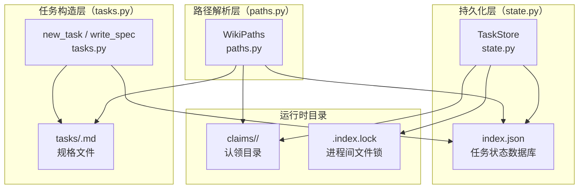
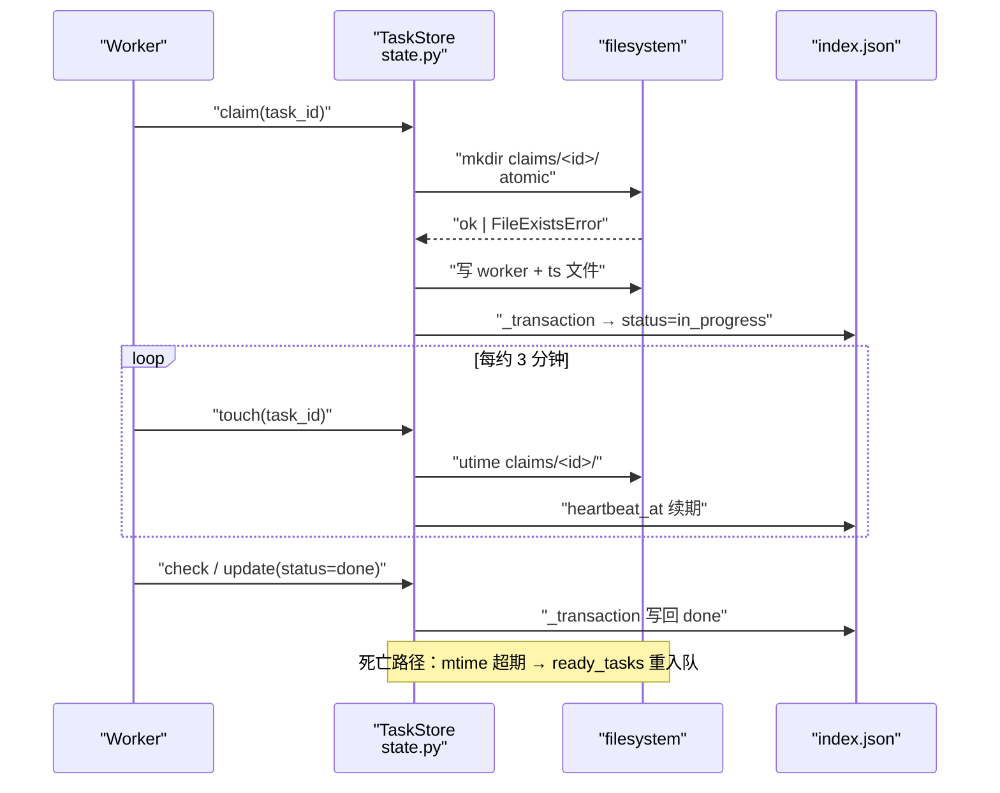
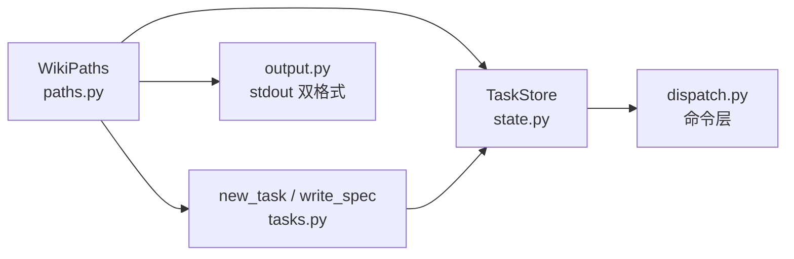

# 任务状态机与目录布局

<cite>
**本文引用的文件**
- [src/repowiki/state.py](file://src/repowiki/state.py)
- [src/repowiki/paths.py](file://src/repowiki/paths.py)
- [src/repowiki/tasks.py](file://src/repowiki/tasks.py)
- [docs/zh/DECISIONS.md](file://docs/zh/DECISIONS.md)
- [docs/zh/CONTEXT.md](file://docs/zh/CONTEXT.md)
</cite>

## 更新摘要

**变更内容**
- 更新 `state.py`（现 437 行）的索引读取并发模型：`load()` 改为与写方共用同一把锁（新增 `_load_unlocked` 供 `_transaction` 内部使用，避免锁自死锁）；新增 `_retry_windows_fs` 对 Windows 文件竞态的 `PermissionError` 做短暂重试——根因是 CPython 在 Windows 打开文件不带 `FILE_SHARE_DELETE`，无锁读会让并发写方的 `os.replace` 失败（[src/repowiki/state.py:35-49](file://src/repowiki/state.py#L35-L49)、[src/repowiki/state.py:100-142](file://src/repowiki/state.py#L100-L142)）。
- 修正文档引用路径：`DECISIONS.md` → `docs/zh/DECISIONS.md`、`CONTEXT.md` → `docs/zh/CONTEXT.md`（文档集中双语化）。
- 同步修正全文 `state.py` 行号引用（各方法边界整体后移）。

## 目录
1. [更新摘要](#更新摘要)
2. [简介](#简介)
3. [项目结构](#项目结构)
4. [核心组件](#核心组件)
5. [架构总览](#架构总览)
6. [详细组件分析](#详细组件分析)
7. [依赖关系分析](#依赖关系分析)
8. [性能与一致性考量](#性能与一致性考量)
9. [故障排查指南](#故障排查指南)
10. [结论](#结论)

## 简介

本页面拆解 `repowiki` 在 `.repowiki/state/` 下的运行时目录树与 `index.json` 中的状态机：每个任务是一条「目录规划 → 页面 → 总览」三阶段门控链上的节点，状态值在 pending / in_progress / done / failed / exhausted 之间迁移，由 `TaskStore` 通过 fcntl/msvcrt 文件锁串行化读写。理解这层抽象，就能在 worker 并发循环、过期认领回收、增量 update 等场景中正确定位代码入口。

## 项目结构

与「任务状态机与目录布局」主题相关的源文件集中在 `src/repowiki/`：

- `src/repowiki/state.py` —— `TaskStore` 类与状态机迁移函数，是 `index.json` 持久化、心跳、认领原子性的唯一来源。
- `src/repowiki/paths.py` —— `WikiPaths` 解析 `.repowiki/`、`state/`、`claims/`、`tasks/`、`content/`、`meta/` 等所有路径常量，避免散落字符串拼接。
- `src/repowiki/tasks.py` —— 任务记录（`new_task`）与规格文件（`write_spec`）的构造器，按阶段展开 catalog、page、knowledge、overview 等任务。
- `.repowiki/state/index.json` —— `TaskStore` 持久化任务记录的 JSON 数据库，含每条任务的 id/kind/phase/status/attempts/heartbeat_at 等字段。
- `.repowiki/state/catalog.json` —— catalog 任务的产物，由阶段 1 写入，是阶段 2 页面任务的展开依据。
- `.repowiki/state/claims/<task_id>/` —— 认领目录，存放 `worker`（认领者名）与 `ts`（时间戳）两个文件，目录 mtime 即存活信号。
- `.repowiki/state/tasks/<task_id>.md` —— 任务规格文件，每个任务的写作指引完整内嵌于此。

图表来源
- [src/repowiki/state.py:76-116](file://src/repowiki/state.py#L76-L116)

章节来源
- [src/repowiki/state.py:1-33](file://src/repowiki/state.py#L1-L21)

## 核心组件

- **TaskStore**（state.py）：任务状态机的唯一入口，承担持久化（`_save_atomic`）、事务化（`_transaction`）、认领（`claim`）、心跳（`heartbeat` / `touch`）、统计（`stats`）与运行时清理（`cleanup_runtime`）等职责。
- **WikiPaths**（paths.py）：所有路径常量的解析层；`root` / `state_dir` / `tasks_dir` / `claims_dir` / `index_file` 等属性都是它的方法，不存在散落的 `.repowiki/` 字符串字面。
- **task record**（tasks.py / state.py）：以 `new_task` 构造的 dict，含 id / kind / phase / title / status / output / spec / attempts / claimed_at / heartbeat_at / worker / created_at 等字段，是 `index.json` 中每条记录的标准 schema。
- **claim directory**（state.py）：`state/claims/<task_id>/`，是认领协议的物理载体——目录是否存在 = 是否在认领；目录 mtime = 心跳时刻。
- **index lock**（state.py）：`state/.index.lock`，通过 fcntl（POSIX）或 msvcrt（Windows）实现跨进程排他锁，序列化 `index.json` 的读改写；本次更新后读（`load`）也走同一把锁，Windows 上文件竞态由 `_retry_windows_fs` 短重试兜底。
- **状态机值**（state.py）：pending / in_progress / done / failed / exhausted，由 `ready_tasks`、`claim`、`release`、`update` 等方法迁移。
- **过期窗口**（state.py）：`stale_seconds`（默认 900 秒 = 15 分钟），由环境变量 `REPOWIKI_STALE_SECONDS` 覆盖，是唯一允许被「认领后未续期」的时间上限。

章节来源
- [src/repowiki/state.py:76-163](file://src/repowiki/state.py#L76-L163)

## 架构总览

状态机运行时交互围绕三条主线展开：一是 `claim` 走 `os.mkdir` 原子抢占；二是 `heartbeat` / `touch` 刷新目录 mtime；三是 `ready_tasks` 扫描时把「in_progress 且 mtime 超期」的任务重新入队。下图描绘的是一条 page 任务从入队到 done 的典型生命周期：worker 通过 `next` 拉到任务时，CLI 先尝试 mkdir 抢占认领目录；成功后写 `worker`/`ts` 并把状态置 in_progress；worker 期间 `touch` 续期；完成后 `check` 触发 `_merge_task` 写回 status=done。若 worker 死亡，`ready_tasks` 在 mtime 超期后把任务重新纳入可领取集合。

图表来源
- [src/repowiki/state.py:269-341](file://src/repowiki/state.py#L269-L341)

章节来源
- [src/repowiki/state.py:269-341](file://src/repowiki/state.py#L269-L341)

## 详细组件分析

### TaskStore 状态值与迁移

- 职责：在 `index.json` 中维护每条任务的 status / attempts / claimed_at / heartbeat_at / worker 五元组状态，并保证并发安全。
- 关键行为：状态值只有五种——pending / in_progress / done / failed / exhausted；迁移入口在 `claim` / `release` / `update` 三个方法里；任意写入都走 `_transaction`，确保「读 → 改 → 写」全程持锁。
- 实现要点：每个事务只 merge 当前任务的 entry（`_merge_task`），而不是替换整个 index，缩小 read-modify-write 窗口以降低并发冲突概率。

章节来源
- [src/repowiki/state.py:165-209](file://src/repowiki/state.py#L165-L209)

### 认领原子性（claim）

- 职责：把 `os.mkdir` 当作原子 CAS 使用，确保同一任务同一时刻至多一个有效认领。
- 关键行为：`_try_mkdir_claim` 走「先 mkdir，FileExistsError 时检测 stale，超期则 rename 为 `.stale-<id>-<hex>` 再重试」的三次循环；非 stale 则返回 False（被他人持有）；stale 则走抢占路径，attempts 计数 +1。
- 实现要点：认领目录的 mtime 是 stale 判定依据（`_claim_age`），ts 文件只在 mkdir 之后写入，新鲜认领在 ts 缺失窗口内若被以 ts 为判定会被误判为无限旧——DECISIONS #3 已用 mtime 单一来源修正。

章节来源
- [src/repowiki/state.py:245-308](file://src/repowiki/state.py#L245-L308)

### 心跳与续期（heartbeat / touch）

- 职责：worker 在执行期间周期性证明自己活着，避免被 stale 回收转给其他人。
- 关键行为：`heartbeat` 写 ts 文件并 `os.utime(cd)` 刷新目录 mtime，同时在 index 中更新 `heartbeat_at`；`touch` 在 `heartbeat` 基础上校验 worker 归属，归属错误抛 ConflictError（防跨 worker 误翻）。
- 实现要点：mtime 与 ts 文件「同时刷」是 DECISIONS #12 中把「stat 单一来源」贯彻到底的关键——既保证 `_claim_age` 读到的是新 mtime，也保证历史审计中 ts 文本同样真实。

章节来源
- [src/repowiki/state.py:343-367](file://src/repowiki/state.py#L343-L367)

### 过期回收与 ready_tasks

- 职责：把「in_progress 且 claim 已 stale」的任务重新纳入可领取集合，实现队列自愈。
- 关键行为：`ready_tasks` 接受 pending / failed（未达上限）任务，同时纳入「in_progress 且 stale」任务；按 `(attempts, phase, 原始顺序)` 三元组排序；attempts 升序意味着新任务优先、失败任务不插队。
- 实现要点：DECISIONS #12 修复了原版「完全排除 in_progress」的死锁——实战复现为 40 页并发、一 worker 退出后冻结队列 50 分钟；现版本走 `next --claim` 自动抢占路径，`attempts+1`、`.stale-<id>` 留痕照常生效。

章节来源
- [src/repowiki/state.py:219-243](file://src/repowiki/state.py#L219-L243)

### 释放、重置与耗尽（release / attempts）

- 职责：处理 worker 主动放弃与毒任务耗尽两类场景。
- 关键行为：`release(force=False)` 只允许释放 in_progress 任务，且校验当前 claim 持有者；若任务已 failed 且 attempts 达 `max_attempts()` 上限（默认 3），进入 exhausted 状态，必须 `release --force` 才能重置 attempts=0。
- 实现要点：`max_attempts()` 读环境变量 `REPOWIKI_MAX_ATTEMPTS`；硬上限来自 `state.py:24-29`，与 `REPOWIKI_STALE_SECONDS` 同为可配置维度。

章节来源
- [src/repowiki/state.py:24-29](file://src/repowiki/state.py#L24-L29)

### 路径契约与目录布局

- 职责：把 `WikiPaths` 抽象成所有命令共享的路径源，避免散落字符串拼接。
- 关键行为：`root` → `.repowiki/`；`state_dir` → `state/`；`tasks_dir` → `state/tasks/`；`claims_dir` → `state/claims/`；`index_file` → `state/index.json`；`catalog_file` → `state/catalog.json`；`content_dir` → `<locale>/content/`；`meta_dir` → `<locale>/meta/`；`site_file` → `<locale>/wiki.html`。
- 实现要点：`locale` 默认从 `state/locale` 文件读取（持久化于 plan 时），未设置时回退到 DEFAULT_LOCALE（zh）；这层 locale 解析是后续所有产出路径的「母参数」。

章节来源
- [src/repowiki/paths.py:77-164](file://src/repowiki/paths.py#L77-L164)

### 任务构造器（new_task / write_spec）

- 职责：在 `tasks.py` 中把 catalog 树展开成阶段化任务记录，并把完整规格写入 `state/tasks/<id>.md`。
- 关键行为：`build_catalog_task` 生成 phase=1 的 catalog 任务；`build_page_tasks` 按 catalog 节点生成 phase=2 的页面任务；`build_overview_task` 生成 phase=3 的 overview 任务；`build_update_task` 在 finalize 之后基于 git diff 追加 `-update` 任务。
- 实现要点：每个任务的 spec 是自包含的——嵌入完整 PAGE_TEMPLATE、STYLE.md、姊妹页面列表，worker 无需任何额外上下文即可执行（这是 parallel-safe 的物理基础）。

章节来源
- [src/repowiki/tasks.py:59-173](file://src/repowiki/tasks.py#L59-L173)

## 依赖关系分析

- `paths.py` 是 `state.py` 的上游：`TaskStore` 在构造时接收 `WikiPaths`，所有 `state_dir / tasks_dir / claims_dir / index_file` 都从 `paths` 派生（`state.py:94-96`、`paths.py:107-164`）。
- `tasks.py` 同时依赖 `state.py` 与 `paths.py`：`new_task` 来自 `state.py`（schema 来源），`write_spec` 用 `paths.task_spec(task_id)` 解析规格文件路径（`tasks.py:16`、`tasks.py:54-56`）。
- `state.py` 的 `TaskStore` 是 `dispatch.py` 等命令层的运行时依赖：每个 `claim / touch / check / release` 都通过 `TaskStore` 的方法落盘。
- `paths.py` 的 `WikiPaths` 是 `output.py` 的路径契约源头：`emit` 写到哪里由 `paths.meta_dir` / `paths.content_dir` 决定，路径不出现字面 `.repowiki/`。
- `docs/zh/DECISIONS.md` 是 `state.py` 关键行为的设计意图来源：mtime 单一来源（#3）、过期回收（#12）、不做 pid 存活检测（#13）都在 docstring 与注释中体现。

图表来源
- [src/repowiki/state.py:76-79](file://src/repowiki/state.py#L94-L96)

章节来源
- [src/repowiki/tasks.py:13-17](file://src/repowiki/tasks.py#L13-L17)

## 性能与一致性考量

- **单一文件锁串行化**：`state/.index.lock` 用 fcntl/msvcrt 阻塞式排他锁包裹 `_transaction`，把 `index.json` 的读改写序列化（读方 `load` 同样持锁，Windows 的 `os.replace` 竞态由 `_retry_windows_fs` 短重试兜底）；DECISIONS #11 指出 mtime 复查存在 TOCTOU 窗口，flock 串行化是确定性保证。
- **mtime 单一心跳来源**：claim 目录的 mtime 既是认领年龄判定（`_claim_age`），也是 stale 判定（`_claim_stale`），杜绝 sweep 与 busy 统计打架（DECISIONS #12）。
- **认领原子化**：`os.mkdir` 是 POSIX/Windows 通用的原子原语，比「检测 → 创建」两步更短，减少了抢占窗口。
- **每事务仅 merge 当前任务**：`_merge_task` 在 `_transaction` 内只更新 `data["tasks"][task["id"]]`，缩短临界区。
- **stale 窗口 15 分钟**：默认 `REPOWIKI_STALE_SECONDS=900`，由 DECISIONS #12 把早期 45 分钟收紧到 15 分钟——冻结上限与误抢风险的平衡点。
- **attempts 升序排序**：`ready_tasks` 按 `(attempts, phase, 原始顺序)` 排序，失败任务不插队、新任务优先（DECISIONS #9）。
- **catalog → pages 阶段门控**：`current_phase` 取「未 done 的最小 phase」，catalog 未完成时 page 不发；page 未完成时 overview 不发。
- **路径单一来源**：所有路径都从 `WikiPaths` 派生，不存在散落的 `.repowiki/` 字符串拼接，便于 locale 切换与多命令协同。

章节来源
- [src/repowiki/state.py:52-74](file://src/repowiki/state.py#L52-L74)

## 故障排查指南

- 现象：worker 在 `next` 返回 `tasks=[]` 但 `busy>0` 时提前退出。
  - 原因：worker 没有遵守「空且 busy>0 → 等待重试」契约。
  - 定位步骤：阅读 `_transaction` 的锁行为（可能持锁阻塞导致 next 超时）；`busy` 计算在 `stats()` 中，过期认领不计入 busy（`state.py:385-419`）；对照 DECISIONS #2。
  - 相关代码位置：[src/repowiki/state.py:385-419](file://src/repowiki/state.py#L385-L419)。

- 现象：worker 死亡后队列冻结数分钟。
  - 原因：worker 死亡时未释放认领，需 stale 窗口到期后才能被 `_try_mkdir_claim` 抢占。
  - 定位步骤：检查 `stale_seconds` 是否被环境变量放大；通过 `repowiki status` 看 `stale_claims` 列表；确认 worker 是否真的未 `touch`。
  - 相关代码位置：[src/repowiki/state.py:250-267](file://src/repowiki/state.py#L250-L267)、[src/repowiki/state.py:385-419](file://src/repowiki/state.py#L385-L419)。

- 现象：check 报 `index.json 损坏`。
  - 原因：极端情况下 `_save_atomic` 的 `os.replace` 中断，导致 JSON 截断。
  - 定位步骤：保留原文件以备恢复；执行 `repowiki plan --replan --force` 重建；或手工修复 JSON。
  - 相关代码位置：[src/repowiki/state.py:127-135](file://src/repowiki/state.py#L127-L135)。

- 现象：exhausted 毒任务无法重新进入 ready。
  - 原因：失败次数达到 `max_attempts()`（默认 3），需要 `release --force` 显式重置。
  - 定位步骤：用 `repowiki status` 查 `exhausted` 列表；执行 `repowiki release <repo> --task <id> --force`。
  - 相关代码位置：[src/repowiki/state.py:310-341](file://src/repowiki/state.py#L310-L341)。

- 现象：touch 抛「任务由 <worker> 认领，不是 <自己>」。
  - 原因：当前认领持有者与传入 worker 名字不一致，可能是上一轮 stale 抢占后新 worker 接手，但旧 worker 还在 touch。
  - 定位步骤：停止旧 worker；让新 worker 重试；通过 `cat state/claims/<id>/worker` 查看当前持有者。
  - 相关代码位置：[src/repowiki/state.py:343-367](file://src/repowiki/state.py#L343-L367)。

- 现象：Windows 下文件锁失败报 `state/.index.lock 被其他进程长期占用`。
  - 原因：msvcrt.LK_LOCK 阻塞约 10 秒未获锁（持有锁的进程可能僵死）。
  - 定位步骤：确认持有锁的 repowiki 进程已退出；Windows 任务管理器查 python.exe；`clean` 命令不释放锁（只删 state）。
  - 相关代码位置：[src/repowiki/state.py:52-74](file://src/repowiki/state.py#L52-L74)。

章节来源
- [src/repowiki/state.py:52-74](file://src/repowiki/state.py#L52-L74)

## 结论

「任务状态机与目录布局」是 `repowiki` 整个 CLI 的运行时骨干：`TaskStore` 用单一文件锁串行化 `index.json`，用 `os.mkdir` 原子化认领，用 claim 目录 mtime 作为心跳与 stale 判定的唯一来源；`WikiPaths` 把所有路径集中解析，避免散落字面拼接；`tasks.py` 把 catalog 树展开成阶段化任务记录并写出自包含的规格文件。这层抽象让任意 worker（subagent / 进程 / 人）可以无差别地领取、执行、续期、释放任务，让并发循环与过期回收成为可证明的确定性行为。**已更新**：索引读取与写方统一持锁，Windows 文件竞态以 `_retry_windows_fs` 短重试兜底——读路径的跨平台一致性补齐。

章节来源
- [src/repowiki/state.py:1-33](file://src/repowiki/state.py#L1-L21)