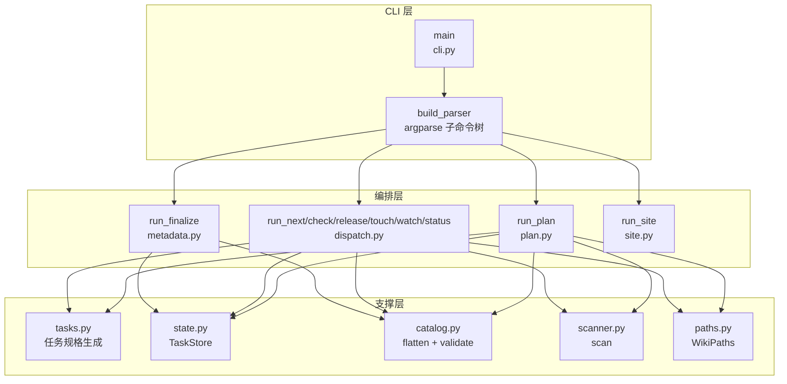
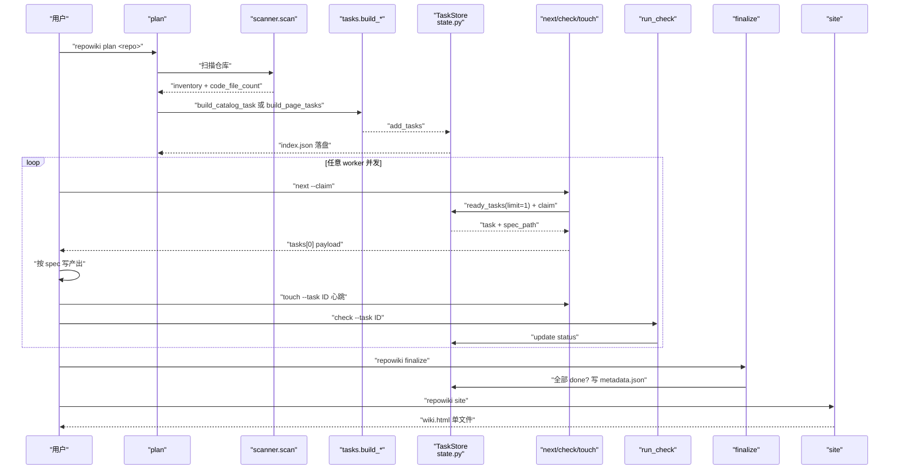
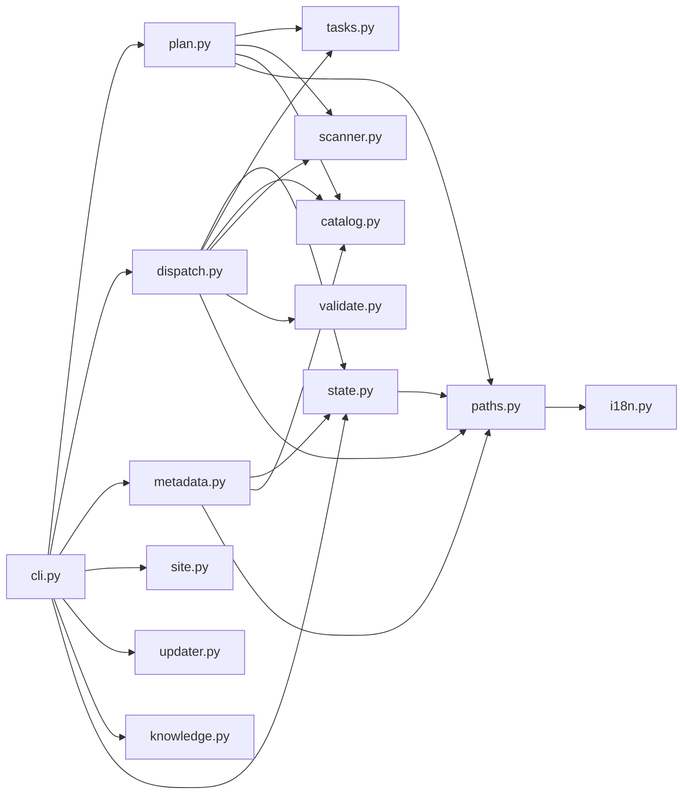

# 架构与数据流

<cite>
**本文引用的文件**
- [src/repowiki/cli.py](file://src/repowiki/cli.py)
- [src/repowiki/plan.py](file://src/repowiki/plan.py)
- [src/repowiki/dispatch.py](file://src/repowiki/dispatch.py)
- [src/repowiki/paths.py](file://src/repowiki/paths.py)
- [src/repowiki/state.py](file://src/repowiki/state.py)
- [src/repowiki/tasks.py](file://src/repowiki/tasks.py)
- [src/repowiki/catalog.py](file://src/repowiki/catalog.py)
</cite>

## 目录
1. [更新摘要](#更新摘要)
2. [简介](#简介)
3. [项目结构](#项目结构)
4. [核心组件](#核心组件)
5. [架构总览](#架构总览)
6. [详细组件分析](#详细组件分析)
7. [依赖关系分析](#依赖关系分析)
8. [性能与一致性考量](#性能与一致性考量)
9. [故障排查指南](#故障排查指南)
10. [结论](#结论)

## 更新摘要

**变更内容**
- `src/repowiki/cli.py` 的顶层 `--help` 描述由 "Deterministic repo-wiki build system driven by coding agents (zero LLM, zero network)." 精简为 "Deterministic repo-wiki build system driven by coding agents."，与 v0.3.3「不再刻意强调不含 LLM」的自我描述调整保持一致（见 [src/repowiki/cli.py:26-29](file://src/repowiki/cli.py#L26-L29)）。
- 本次变更仅涉及一行描述字符串，`cli.py` 行数与子命令注册结构未变，本页全部行号引用与架构结论保持原样。
- 其余模块（cli.py / plan.py / paths.py / state.py 等）未变，相关小节保持原样。

章节来源
- [src/repowiki/dispatch.py:126-199](file://src/repowiki/dispatch.py#L126-L199)

## 简介
本页描绘 repowiki 的整体架构与数据流：CLI 入口如何把子命令分派给 plan/dispatch 等编排模块；`.repowiki/state/`（运行时状态）与 `.repowiki/<locale>/content/`、`meta/`（持久化产物）这两棵目录树如何随 plan → catalog → pages → overview → finalize → site 六阶段生长；以及「阶段门控」如何保证前序未完成时后续任务不被发放，从而把「任务可并行」与「阶段必须有序」两件事各自落到正确位置。

章节来源
- [src/repowiki/cli.py:1-142](file://src/repowiki/cli.py#L1-L142)

## 项目结构
与本页主题相关的目录与文件组织：

- `src/repowiki/cli.py`：argparse 子命令树，唯一入口 `main(argv)`；解析后调用对应 `run_*` 函数。
- `src/repowiki/plan.py`：`run_plan` —— 扫描仓库、生成 catalog 任务或展开页面任务、`--replan --force` 显式恢复路径。
- `src/repowiki/dispatch.py`：`run_next`/`run_check`/`run_release`/`run_touch`/`run_watch`/`run_status` —— 命令层编排。
- `src/repowiki/tasks.py`：根据阶段生成对应任务规格（catalog、knowledge_plan、page、overview、knowledge_card、knowledge_module）。
- `src/repowiki/state.py`：`TaskStore` —— `index.json` 状态机的读写、`ready_tasks`、`claim`、`touch`、`heartbeat`、`release`、`stats` 等原子操作。
- `src/repowiki/catalog.py`：`flatten`（目录节点展开）与 `validate_catalog`（校验）。
- `src/repowiki/paths.py`：`WikiPaths` —— 一切目录与文件路径的单一来源，含 NFC 归一化、文件名清洗、GitHub 风格锚点算法。
- `src/repowiki/scanner.py`：`scan(repo_root)` 返回仓库清单（含 code_file_count 与 known_paths）。
- `.repowiki/state/`：运行时状态目录（index.json、catalog.json、tasks/、claims/、locale）。
- `.repowiki/<locale>/content/`：页面正文（章节树 + 索引页 + 子页）。
- `.repowiki/<locale>/meta/repowiki-metadata.json`：finalize 组装的机器可读索引。
- `.repowiki/<locale>/wiki.html`：site 命令渲染的单文件离线 HTML。

图表来源
- [src/repowiki/cli.py:25-122](file://src/repowiki/cli.py#L25-L122)
- [src/repowiki/plan.py:38-103](file://src/repowiki/plan.py#L38-L103)
- [src/repowiki/dispatch.py:49-75](file://src/repowiki/dispatch.py#L49-L75)

章节来源
- [src/repowiki/cli.py:1-142](file://src/repowiki/cli.py#L1-L142)
- [src/repowiki/plan.py:1-140](file://src/repowiki/plan.py#L1-L140)
- [src/repowiki/dispatch.py:1-50](file://src/repowiki/dispatch.py#L1-L50)
- [src/repowiki/paths.py:77-164](file://src/repowiki/paths.py#L77-L164)

## 核心组件
- CLI 入口（`cli.py:main`）：argparse 解析后调用 `args.func(args, paths)`；统一捕获 `ConflictError`/`StateError`/`UsageError` 并以退出码 2/1/1 退出。
- plan 编排（`plan.py:run_plan`）：扫描仓库 → 校验 catalog（若已有合法则跳过创建）→ 展开页面任务；`--replan` 删除整个 `.repowiki/` 重来，`--replan` 且存在 in_progress 时需 `--force`。
- 任务调度（`dispatch.py:run_next`）：队列是纯 FIFO 拉取，一次只发放一个任务（worker 契约：一次只持有一个认领）；带 `--claim` 时为每个 ready 任务原子 `claim`。
- 心跳续期（`dispatch.py:run_touch`）：执行期刷新认领；`run_check` 顺带续期（防执行期被抢双写）。
- 校验（`dispatch.py:run_check`）：根据 task.kind 路由到 page/overview/knowledge_card/knowledge_module/catalog/knowledge_plan 校验；自动修复确定性缺陷并写回；done 为终态（只读报告，不翻状态）。
- 阻塞监控（`dispatch.py:run_watch`）：轮询 `stats`；所有任务 done → exit 0；停滞（无 in_flight 且无可领取）→ exit 1——但宣布停滞前会用新鲜 stats 复查一次，若任务在快照间隙内全部完成则改报 completed（exit 0），避免假停滞；超时 → exit 1。
- 任务规格生成（`tasks.py`）：按任务类型构造 `state/tasks/<id>.md` 的完整规格（模板内嵌、自包含）。
- 状态机（`state.py:TaskStore`）：`load`、`ready_tasks`、`claim`、`touch`、`heartbeat`、`release`、`stats`、`update`、`add_tasks`；flock 串行化。
- 仓库扫描器（`scanner.py:scan`）：定位代码文件、构造仓库清单；`code_file_count < 10` 时 plan 拒绝生成（仓库太小）。
- 路径解析（`paths.py:WikiPaths`）：一切目录路径的单一来源；locale 在 plan 时确定并持久化到 `state/locale`，中途换语言需 `plan --replan`。
- 目录扁平化（`catalog.py:flatten`）：把 catalog 树展开为有序的 page 节点列表，喂给 `tasks.build_page_tasks`。

章节来源
- [src/repowiki/cli.py:125-142](file://src/repowiki/cli.py#L125-L142)
- [src/repowiki/plan.py:38-103](file://src/repowiki/plan.py#L38-L103)
- [src/repowiki/dispatch.py:49-261](file://src/repowiki/dispatch.py#L49-L261)
- [src/repowiki/paths.py:77-164](file://src/repowiki/paths.py#L77-L164)

## 架构总览
一次完整的 wiki 生成按 plan → catalog → pages → overview → finalize → site 六阶段推进。CLI 是入口；plan 调用 scanner 与 tasks 生成第一批任务（catalog 任务，或在已有合法 catalog 时直接展开页面任务）；dispatch 负责后续每一步的发放/校验/续期；任务状态落盘到 `.repowiki/state/index.json`；页面正文落盘到 `.repowiki/<locale>/content/...`；finalize 把全部 done 任务汇总为 `meta/repowiki-metadata.json` 并自动清理 `claims/` 与 `tasks/` 运行时产物；site 把整个 wiki 打包为单文件 HTML。阶段门控由 `state.py:TaskStore.ready_tasks` 与 `plan.py:_check_plan_task` 实现：catalog 任务未 done 时页面任务不会进入 ready；overview 任务未 done 时 finalize 不会写 metadata.json。

图表来源
- [src/repowiki/plan.py:38-103](file://src/repowiki/plan.py#L38-L103)
- [src/repowiki/dispatch.py:49-261](file://src/repowiki/dispatch.py#L49-L261)
- [src/repowiki/paths.py:107-157](file://src/repowiki/paths.py#L107-L157)

章节来源
- [src/repowiki/cli.py:1-142](file://src/repowiki/cli.py#L1-L142)
- [src/repowiki/plan.py:38-140](file://src/repowiki/plan.py#L38-L140)
- [src/repowiki/dispatch.py:49-392](file://src/repowiki/dispatch.py#L49-L392)
- [src/repowiki/paths.py:77-164](file://src/repowiki/paths.py#L77-L164)

## 详细组件分析
### plan 编排与阶段门控
- 职责：扫描仓库、判断是否已有合法 catalog、决定生成 catalog 任务还是直接展开页面任务；`--replan` 时强删整个 `.repowiki/` 并重规划。
- 关键行为：locale 在 plan 时必须先解析（决定 `<locale>/content` 与 `<locale>/meta` 目录创建）；`code_file_count < 10` 拒绝生成；`--replan` 检测到 in_progress 任务时不加 `--force` 直接拒绝（保护正在被写入的产物）；catalog 存在且合法时不再创建 catalog 任务，直接 `flatten` + `build_page_tasks`；catalog 校验失败时丢弃重来并附 warnings；`--knowledge` 追加 knowledge-plan 任务。
- 实现要点：catalog 任务通过 `store.add_tasks([tasks.build_catalog_task(...)])` 投放；页面任务通过 `store.add_tasks(tasks.build_page_tasks(paths, nodes, inv, max_pages))` 投放；`--max-pages` 用于廉价试跑（注意 finalize 会校验页面存在，避免幽灵条目）。

章节来源
- [src/repowiki/plan.py:38-103](file://src/repowiki/plan.py#L38-L103)
- [src/repowiki/plan.py:116-140](file://src/repowiki/plan.py#L116-L140)

### next / touch / check / release 编排
- 职责：worker 循环的四个原子动作——领取、续期、校验+状态流转、释放。
- 关键行为：`run_next` 默认 `limit=1`（一次只发放一个任务，worker 契约），`--claim` 时对每个 ready 任务尝试原子 `claim`（抢占竞争失败时静默跳过，让下次 `next` 重新挑选）；`run_touch` 调用 `store.touch(task_id, worker=...)` 刷新认领；`run_check` 在 `worker` 与 `claim_dir/worker` 不一致时拒绝（非 `--force`），防止跨 worker 误翻；`done` 任务走 `_check_readonly`，只读报告不翻状态（避免翻失败后 spec 已清理导致无规格可执行）；`_check_plan_task` 通过后用 `flatten` 展开后续页面/知识任务；`run_release` 是崩溃恢复路径。
- 实现要点：`run_check` 在 `_check_one` 之后调用 `store.heartbeat(tid)`（校验顺带续期，防执行期被抢双写）；`run_status` 把 failed/exhausted/stale_claims 一并暴露。

章节来源
- [src/repowiki/dispatch.py:49-261](file://src/repowiki/dispatch.py#L49-L261)
- [src/repowiki/dispatch.py:298-392](file://src/repowiki/dispatch.py#L298-L392)

### 状态机与目录布局
- 职责：把每条任务的当前状态、`claim` 元数据、`heartbeat_at` 落盘；统一对外暴露「ready」与「in_flight」两类任务清单。
- 关键行为：`index.json` 用 flock 串行化读改写（mtime 复查有 TOCTOU 窗口，6×12 压测丢 3 次更新）；`ready_tasks` 排除 in_progress 但纳入「in_progress 且认领过期」的任务（让 `next --claim` 走既有抢占路径自动回收，`.stale-*` 留痕）；stale 判定统一为 claim 目录 mtime 单一来源（避免 sweep 与 busy 统计打架）；目录树方面，运行时状态统一在 `.repowiki/state/`（含 `tasks/`、`claims/`、`catalog.json`、`knowledge.json`、`index.json`、`locale`），持久化产物统一在 `.repowiki/<locale>/content/` 与 `.repowiki/<locale>/meta/`，知识卡片在 `.repowiki/knowledge/<locale>/`，单文件站点在 `.repowiki/<locale>/wiki.html`。
- 实现要点：`finalize` 成功后自动清除运行时产物（`state/claims/`、`state/tasks/`），保留 `index.json`/`catalog.json`/`knowledge.json` 供增量更新与幂等重跑；`update` 的增量映射依赖 `catalog.json` 的 `dependent_files` 与树结构（metadata 无 kind 字段无法重建页面路径）；locale 一旦 plan 时确定就持久化，中途换语言需 `plan --replan`。

章节来源
- [src/repowiki/paths.py:107-164](file://src/repowiki/paths.py#L107-L164)
- [src/repowiki/dispatch.py:126-199](file://src/repowiki/dispatch.py#L126-L199)

### watch 监控与停滞判定
- 职责：`run_watch` 为驱动会话提供阻塞式监控——后台 spawn 多个 worker 后运行 watch，其退出码直接告知下一步动作，无需自行轮询。
- 关键行为：轮询 `store.stats()`；全部 done → exit 0；「无 in_flight 且无可领取」→ 判定停滞前先用新鲜的 `store.stats()` 复查一遍，若任务恰在快照间隙内全部完成则同样报 completed（exit 0），复查后仍有剩余工作才报 stalled（exit 1）；超时 → exit 1。
- 实现要点：`in_flight` 排除 stale 认领（其 worker 已死、任务即将回队列，把它们计入会掩盖真实停滞）；这份「宣布停滞前先复查」的防御来自实战中的停滞假阳性——顶层快照与停滞分支之间任务可能刚好完成，陈旧快照不得伪造停滞结论。

章节来源
- [src/repowiki/dispatch.py:126-199](file://src/repowiki/dispatch.py#L126-L199)

### 页面正文与 metadata 的产出位置
- 职责：明确 page/overview/knowledge_card 等文本类产物与最终 metadata 的落盘位置。
- 关键行为：`page`/`page_update`/`overview`/`knowledge_card` 产出单文件 `output`；`knowledge_module` 产出目录（`is_dir` 检查）；`finalize` 把所有 done 任务汇总为 `meta/repowiki-metadata.json`；`site` 渲染为 `wiki.html`。
- 实现要点：`run_check` 中通过 `paths.root / task["output"]` 解析实际路径（`paths.root` 即 `<repo>/.repowiki`）；overview 校验需要从 `state/catalog.json` 读取 `repo_name`；知识卡片校验需要从 `state/knowledge.json` 读取卡片元数据。

章节来源
- [src/repowiki/dispatch.py:298-341](file://src/repowiki/dispatch.py#L298-L341)
- [src/repowiki/paths.py:135-157](file://src/repowiki/paths.py#L135-L157)

## 依赖关系分析
- CLI → 编排：`cli.py` 的每个子命令都把控制权转交给 `run_*` 函数（plan/dispatch/metadata/site/updater/knowledge/state）。
- plan → 支撑：`plan.py` 调用 `scanner.scan`、`catalog.validate_catalog`、`catalog.flatten`、`tasks.build_catalog_task`、`tasks.build_page_tasks`、`tasks.build_knowledge_plan_task`、`TaskStore` 的 `add_tasks`/`stats`，最终落盘到 `.repowiki/state/`。
- dispatch → 支撑：`dispatch.py` 调用 `TaskStore` 的全套状态机方法、`catalog.flatten`、`tasks.build_*`、`scanner.scan`、`validate` 模块的 `check_page`/`check_overview`/`check_knowledge_card`/`check_knowledge_module`/`check_knowledge_plan`，结果写回 `index.json` 与 `output` 文件。
- state.py → paths：`WikiPaths` 提供一切目录与文件路径；`TaskStore` 围绕 `state/index.json`、`state/claims/<id>/`、`state/tasks/` 操作。
- paths.py → i18n：`WikiPaths.locale` 懒加载 `state/locale`，回退到 `DEFAULT_LOCALE`（zh）；`SUPPORTED` 是合法 locale 白名单。
- 跨模块数据契约：`catalog.json` 既是 plan 校验的输入也是 expand pages 的输入；`knowledge.json` 是知识卡片任务的规划文件；`index.json` 是状态机的唯一真相源；`meta/repowiki-metadata.json` 是 finalize 后的机器可读产物。

图表来源
- [src/repowiki/cli.py:1-50](file://src/repowiki/cli.py#L1-L50)
- [src/repowiki/plan.py:1-16](file://src/repowiki/plan.py#L1-L16)
- [src/repowiki/dispatch.py:1-27](file://src/repowiki/dispatch.py#L1-L27)
- [src/repowiki/paths.py:77-97](file://src/repowiki/paths.py#L77-L97)

章节来源
- [src/repowiki/cli.py:1-142](file://src/repowiki/cli.py#L1-L142)
- [src/repowiki/plan.py:1-140](file://src/repowiki/plan.py#L1-L140)
- [src/repowiki/dispatch.py:1-392](file://src/repowiki/dispatch.py#L1-L392)
- [src/repowiki/paths.py:1-164](file://src/repowiki/paths.py#L1-L164)

## 性能与一致性考量
- 阶段门控：`ready_tasks` 只返回当前阶段的就绪任务，前置阶段未完成时后续任务不发放——避免出现「页面任务先于 catalog」导致的输出路径与树结构不一致。
- 并发安全：`index.json` 用 flock 串行化读改写（mtime 复查有 TOCTOU 窗口，6×12 压测丢 3 次更新）；原子 `mkdir` 认领 + 目录 mtime 过期判定（默认 15 分钟）。
- 队列自愈：`ready_tasks` 纳入「in_progress 且认领过期」的任务，`next --claim` 走既有抢占路径自动回收（`.stale-*` 留痕、attempts+1，毒任务上限照常生效），无需人工 `release --force`。
- 一次性发放：每次 `next --claim` 只发放一个任务（`limit=1`），worker 中途退出时手中不留孤儿认领；即便异常退出，过期认领也会自动回队列。
- 状态收敛：`done` 为终态（只读报告，不翻状态），避免翻失败后 spec 已清理导致无规格可执行；`failed` 超过 `REPOWIKI_MAX_ATTEMPTS` 进 `exhausted` 需 `release --force` 重置（防毒任务空转 worker）。
- 自动瘦身：`finalize` 成功后自动清除运行时产物（`state/claims/`、`state/tasks/`），保留 `index.json`/`catalog.json`/`knowledge.json` 供增量更新与幂等重跑；不需要增量更新可执行 `repowiki clean <repo>`。
- 双语产出：locale 在 plan 时确定并持久化（README 权重最高），中途换语言需 `plan --replan`；`file://` 引用解析、程序化领取依赖 `jq` 属常见但非必需。
- `watch` 不假活：in_flight 排除过期认领（否则 worker 全死后停滞分支永远不可达，只能干等超时）；宣布停滞前用新鲜 stats 复查，陈旧快照不得伪造停滞结论。

章节来源
- [src/repowiki/dispatch.py:126-199](file://src/repowiki/dispatch.py#L126-L199)
- [src/repowiki/plan.py:38-103](file://src/repowiki/plan.py#L38-L103)
- [src/repowiki/paths.py:99-105](file://src/repowiki/paths.py#L99-L105)

## 故障排查指南
- 现象：`尚未规划任务，请先运行 repowiki plan <repo>`。成因：首次使用未 plan 或 `clean` 后未重 plan。解决：先 `repowiki plan <repo>`。
- 现象：`代码文件数 N < 10，仓库太小，不适合生成 RepoWiki`。成因：被扫描仓库代码文件少于 10。解决：换更大的目标仓库，或在评估 CLI 时用真实仓库。
- 现象：`replan` 报「检测到 N 个 in_progress 任务」。成因：保护正在被写入的产物。解决：确认放弃恢复请加 `--force`；或等任务 done/释放后再 replan。
- 现象：`state/index.json 无法解析，无法确认是否有任务在执行；replan 会删除现有状态与规格，确认放弃恢复请加 --force`。成因：index.json 损坏。解决：保留现场排查，或 `replan --force`。
- 现象：`任务不存在: <id>`。成因：拼错 id 或任务已被 `clean` 清掉。解决：用 `repowiki status` 列出现存任务。
- 现象：`请指定 --task <id>（单任务校验）或 --all`。成因：`check` 必须显式目标。解决：单任务加 `--task`，崩溃恢复用 `--all`。
- 现象：`任务 <id> 由 <worker> 认领；如确要代为校验请加 --force`。成因：跨 worker 误翻保护。解决：不要争抢——回到 `next` 拉取新任务；只在崩溃恢复或主 agent 巡查时使用 `--all`。
- 现象：`done 为终态，此结果仅供参考，状态未改变`。成因：`done` 任务被重复 check。解决：done 任务不可执行；如需重建请用 `update` 或 `plan --replan`。
- 现象：`停滞：剩余 N 个任务未完成，但无执行中且无可领取任务`。成因：watch 检测到停滞（宣布前已用新鲜 stats 复查，排除了快照滞后导致的假停滞），通常是 exhausted 毒任务。解决：`repowiki status` 查看详情，`release --force` 可重置。
- 现象：worker 提前退出导致后续任务无人接手。成因：缺少 busy 信号——`next` 返回体新增 `busy` 字段。解决：worker 契约相应改为「空且 busy>0 → 等待重试」。
- 现象：新鲜认领被误判为过期并遭抢占。成因：以 claim 目录内 ts 文件为准（mkdir 之后才写 ts，期间被误判为无限旧）。解决：stale 判定统一为 claim 目录 mtime 单一来源。
- 现象：6×12 压测丢 3 次 index.json 更新。成因：mtime 复查的 TOCTOU 窗口。解决：用 flock 串行化读改写。
- 现象：catalog 已合法但仍重复生成 catalog 任务。成因：缺幂等判断。解决：`plan` 遇到已存在且合法的 catalog.json 时不再创建 catalog 任务，直接展开页面任务。

章节来源
- [src/repowiki/plan.py:38-68](file://src/repowiki/plan.py#L38-L68)
- [src/repowiki/dispatch.py:204-261](file://src/repowiki/dispatch.py#L204-L261)
- [src/repowiki/dispatch.py:126-199](file://src/repowiki/dispatch.py#L126-L199)
- [src/repowiki/dispatch.py:264-280](file://src/repowiki/dispatch.py#L264-L280)

## 结论
repowiki 的架构可以概括为「CLI 入口 → plan/dispatch/metadata/site 编排 → state/tasks/catalog/scanner/validate 支撑」四层；其数据流则是「plan 落 catalog.json 与第一批任务 → 并发 worker 领取/写产出/校验/续期循环 → finalize 汇总为 metadata.json → site 渲染为 wiki.html」。两棵目录树（运行时 `.repowiki/state/` 与持久化 `.repowiki/<locale>/content/` + `meta/`）各司其职、阶段门控保证顺序、原子认领 + 心跳 + 过期回收保证并发安全。**已更新**：watch 的停滞判定现会在宣布停滞前用新鲜 stats 复查，任务在快照间隙内完成时不再误报停滞。正确使用方式是：先 `plan` → 并发 spawn 多个 worker 跑 next/check/touch 循环 → 全部 done 后 `finalize` → `site` 渲染——任何环节出错都有显式的退出码与状态分支指引。

章节来源
- [src/repowiki/cli.py:1-142](file://src/repowiki/cli.py#L1-L142)
- [src/repowiki/plan.py:38-140](file://src/repowiki/plan.py#L38-L140)
- [src/repowiki/dispatch.py:1-392](file://src/repowiki/dispatch.py#L1-L392)
- [src/repowiki/paths.py:77-164](file://src/repowiki/paths.py#L77-L164)
