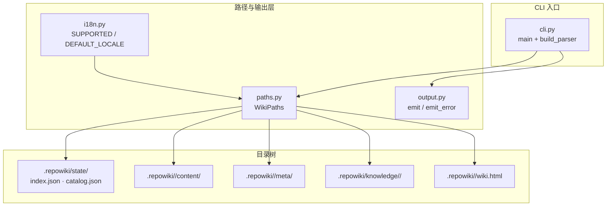
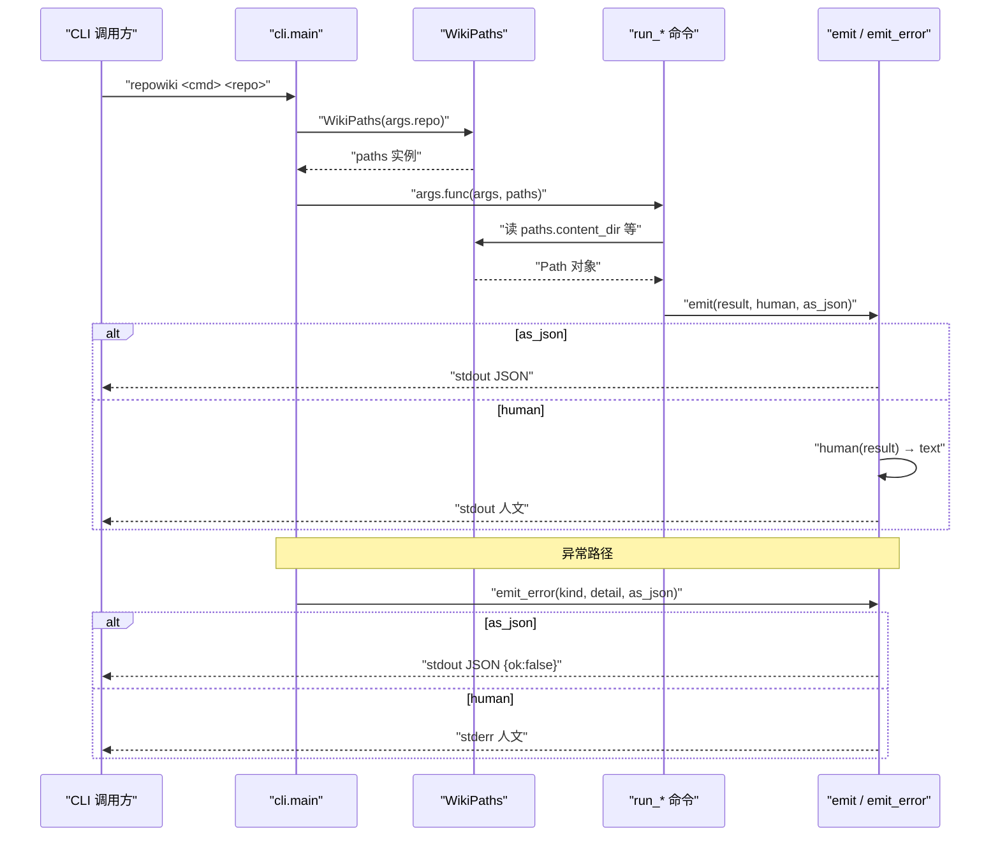
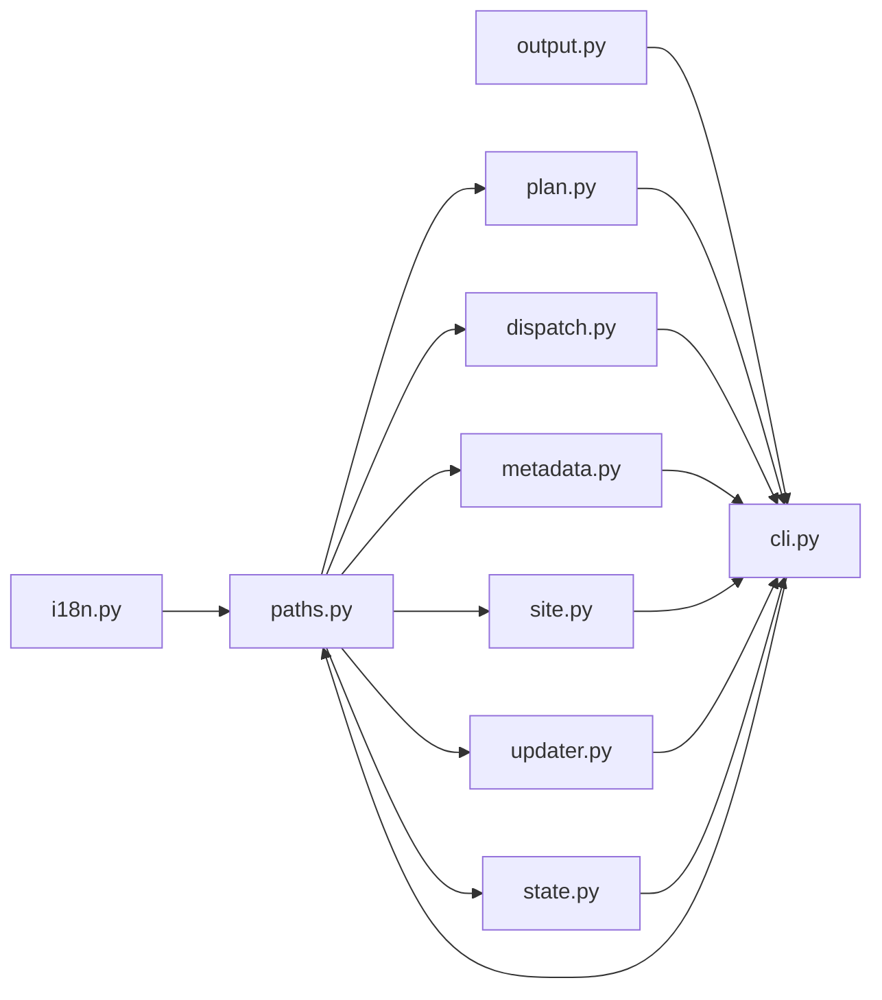

# 路径与输出布局

<cite>
**本文引用的文件**
- [src/repowiki/paths.py](file://src/repowiki/paths.py)
- [src/repowiki/output.py](file://src/repowiki/output.py)
- [src/repowiki/i18n.py](file://src/repowiki/i18n.py)
- [src/repowiki/cli.py](file://src/repowiki/cli.py)
</cite>

## 目录
1. [简介](#简介)
2. [项目结构](#项目结构)
3. [核心组件](#核心组件)
4. [架构总览](#架构总览)
5. [详细组件分析](#详细组件分析)
6. [依赖关系分析](#依赖关系分析)
7. [性能与一致性考量](#性能与一致性考量)
8. [故障排查指南](#故障排查指南)
9. [结论](#结论)

## 简介
本页聚焦 repowiki 中两个看似琐碎、实则承担「一致性契约」的模块：`paths.py` 把 `.repowiki/state/`、`.repowiki/<locale>/content/`、`.repowiki/<locale>/meta/`、`.repowiki/knowledge/<locale>/`、`wiki.html` 等所有路径常量封装在一个 `WikiPaths` 类里，避免散落到各模块的字符串拼接；`output.py` 则把所有命令的 stdout/stderr 输出收束到一个 `emit` 缝隙中，human 与 JSON 两种格式互斥、字段始终同步。这两个模块虽然不参与任务编排，但任何命令的可重现性、locale 跟随、双语产出、单文件站点落盘位置都依赖它们。

## 项目结构
与本页主题相关的目录与文件：

- `src/repowiki/paths.py`：路径解析与归一化。包含 `nfc`、`sanitize_component`、`unique_name`、`github_anchor` 四个纯函数，以及核心类 `WikiPaths`。
- `src/repowiki/output.py`：双格式输出收束。包含 `emit(result, human, as_json, file=None)` 与 `emit_error(kind, detail, as_json)`。
- `src/repowiki/i18n.py`：locale 白名单与字符串表；`SUPPORTED`、`DEFAULT_LOCALE`（zh）由 `paths.py` 引用。
- `src/repowiki/cli.py`：`main` 调用 `args.func(args, paths)`，把 `WikiPaths(args.repo)` 注入到每个子命令；错误路径统一通过 `emit_error` 输出。
- `.repowiki/state/`：`WikiPaths.state_dir` 派生，含 `index.json`、`catalog.json`、`knowledge.json`、`tasks/`、`claims/`、`locale`。
- `.repowiki/<locale>/content/`：页面正文落盘位置（`WikiPaths.content_dir`）。
- `.repowiki/<locale>/meta/`：finalize 产物目录（`WikiPaths.meta_dir`），含 `repowiki-metadata.json` 与 `wiki-overview.md`。
- `.repowiki/knowledge/<locale>/`：可选的知识卡片目录（`WikiPaths.knowledge_dir`）。
- `.repowiki/<locale>/wiki.html`：单文件离线站点（`WikiPaths.site_file`）。

图表来源
- [src/repowiki/paths.py:77-157](file://src/repowiki/paths.py#L77-L157)
- [src/repowiki/output.py:1-34](file://src/repowiki/output.py#L1-L34)
- [src/repowiki/cli.py:125-142](file://src/repowiki/cli.py#L125-L142)

章节来源
- [src/repowiki/paths.py:1-164](file://src/repowiki/paths.py#L1-L164)
- [src/repowiki/output.py:1-34](file://src/repowiki/output.py#L1-L34)

## 核心组件
- `WikiPaths` 类（`paths.py:WikiPaths`）：所有目录与文件路径的单一来源；`__init__(repo_root, locale=None)` 解析仓库根，`locale` 是懒加载属性。
- `nfc(s)`：NFC 归一化字符串（`unicodedata.normalize("NFC", s)`）。
- `sanitize_component(title)`：标题 → 单个路径分量（目录或文件 stem）。NFC 归一化、控制字符剔除、文件系统非法字符映射为全角、收尾的 ` .` 剔除；空串回退 `"untitled"`。
- `unique_name(name, used)`：同名碰撞时追加 `__2`、`__3` 后缀，确保最终名字在集合内唯一。
- `github_anchor(heading)`：GitHub 风格锚点算法。小写 → 删除标点（含 CJK 全角）→ 空白转 `-` → 折叠连续 `-` → 收尾去 `-`；`附录：一键运行清单` → `附录一键运行清单`；`BM25 关键词` → `bm25-关键词`。
- `WikiPaths.locale`：先看显式构造参数，再看 `state/locale`，否则 `DEFAULT_LOCALE`（zh）。
- `WikiPaths.persist_locale(locale)`：把 locale 写入 `state/locale`，并缓存到实例；非法 locale 抛 `ValueError`。
- `WikiPaths.ensure()`：`mkdir(parents=True, exist_ok=True)` 创建 state_dir/tasks_dir/claims_dir/content_dir/meta_dir。
- `emit(result, human, as_json, file=None)`：双格式输出缝隙；`as_json` 时直接 `json.dumps(ensure_ascii=False, indent=2)`，否则调用 `human(result)`，空文本不打印。
- `emit_error(kind, detail, as_json)`：CLI 错误输出；JSON 契约走 stdout，人文副本走 stderr；前缀字典 `{"conflict": "conflict: ", "state_corrupt": "state error: "}`，默认 `error: `。
- `Human` 类型别名：`Callable[[dict], str]`，是 `human` 参数的契约。

章节来源
- [src/repowiki/paths.py:1-164](file://src/repowiki/paths.py#L1-L164)
- [src/repowiki/output.py:1-34](file://src/repowiki/output.py#L1-L34)

## 架构总览
`paths.py` 与 `output.py` 都不是编排层，而是「被所有命令共享的基础设施」。CLI 入口 `cli.py:main` 在解析子命令后构造 `paths = WikiPaths(args.repo)`，并把 `paths` 透传给每个 `run_*(paths, ...)`；每个命令在准备写文件时只调用 `paths.content_dir`、`paths.metadata_file`、`paths.task_spec(task_id)` 等属性，从而避免散落的字符串拼接。`output.py` 的 `emit` 则是所有 `run_*` 函数的唯一 stdout 通道；错误路径统一走 `emit_error`，由 `cli.py` 在 `ConflictError`/`StateError`/`UsageError` 三个异常分支调用。这样设计的好处是：任何新字段要么同时进入 human 与 JSON 两个分支（经由 `emit`），要么都不进；human 文本虽然历史上从未单测，但「经过一个可调用闭包」就拥有了天然的可测试形态。

图表来源
- [src/repowiki/cli.py:125-142](file://src/repowiki/cli.py#L125-L142)
- [src/repowiki/paths.py:84-164](file://src/repowiki/paths.py#L84-L164)
- [src/repowiki/output.py:18-34](file://src/repowiki/output.py#L18-L34)

章节来源
- [src/repowiki/cli.py:125-142](file://src/repowiki/cli.py#L125-L142)
- [src/repowiki/output.py:1-34](file://src/repowiki/output.py#L1-L34)

## 详细组件分析
### WikiPaths：路径常量的单一来源
- 职责：把仓库根、运行时状态、产物内容、产物元数据、知识卡片、单文件站点等所有目录集中到一个类里；locale 决策统一在这一个地方完成；任何命令都通过 `paths.xxx` 取路径，避免散落的字符串拼接。
- 关键行为：构造时只 `Path(repo_root).resolve()`，locale 懒加载（首次访问 `paths.locale` 才读盘）；`persist_locale` 必须在 `ensure()` 之前调用（locale 决定创建 `<locale>/content` 还是 `<locale>/meta`）；`state_dir`/`tasks_dir`/`claims_dir`/`catalog_file`/`knowledge_plan_file`/`index_file` 都在 `state/` 下；`content_dir`/`meta_dir`/`metadata_file`/`overview_file`/`site_file` 都在 `<locale>/` 下；`knowledge_dir`/`metadata_file` 区分了 content 元数据与 knowledge 元数据；`task_spec(task_id)` 返回 `state/tasks/<id>.md`；`ensure()` 一次性 `mkdir(parents=True, exist_ok=True)` 所有需要的目录；章节名变目录名走 `sanitize_component`，同名碰撞走 `unique_name`，GitHub 锚点走 `github_anchor`。
- 实现要点：`locale` 必须是合法 `SUPPORTED` 值才会被接受，否则 `persist_locale` 抛 `ValueError`；`locale` 三段回退（显式参数 → 持久化文件 → 默认值）保证中途切语言需 `plan --replan`；`_ILLEGAL_MAP` 把文件系统非法字符一对一映射到全角等价物（含 `:` → `：`）；`_GITHUB_PUNCT_RE` 把标点全删（而非转 `-`），正是 `附录：一键` 的正确锚点是 `附录一键` 的实现细节。

章节来源
- [src/repowiki/paths.py:1-164](file://src/repowiki/paths.py#L1-L164)

### output：双格式输出的统一缝隙
- 职责：让每个 `run_*` 命令只关心「我的结果是什么、人类如何描述它」，至于 stdout 还是 JSON 由一个 `--json` 开关决定。
- 关键行为：`emit(result, human, as_json, file=None)` 是公共路径——`as_json=True` 时 `json.dumps(result, ensure_ascii=False, indent=2)` 走默认 stdout；否则调用 `human(result)` 生成文本，**空字符串不打印**（避免在「空任务列表」等场景输出空行）；`file=None` 时 `print` 默认走 stdout，因此 `emit` 也支持测试时传入 `io.StringIO`。`emit_error(kind, detail, as_json)` 是错误路径——JSON 契约始终走 stdout（`file=None`），human 副本走 stderr（`file=sys.stderr`），前缀字典 `{"conflict": "conflict: ", "state_corrupt": "state error: "}`，缺省 `error: `。
- 实现要点：`Human = Callable[[dict], str]` 是 `human` 参数的类型契约；`emit` 与 `emit_error` 共用同一套「JSON 走 stdout、human 走 file 参数」语义，因此 CLI 退出码（`ConflictError` → 2、`StateError`/`UsageError` → 1）与输出流严格解耦。

章节来源
- [src/repowiki/output.py:1-34](file://src/repowiki/output.py#L1-L34)

## 依赖关系分析
- `paths.py` 依赖 `i18n.py`：使用 `DEFAULT_LOCALE` 与 `SUPPORTED` 两个常量做 locale 白名单校验。
- `paths.py` 依赖 `pathlib`/`unicodedata`/`re`：文件系统操作与字符串归一化。
- `output.py` 依赖 `json`/`sys`/`typing`：JSON 序列化、stderr 流、`Human` 类型别名。
- `cli.py` 依赖 `paths.py`（构造 `WikiPaths`）与 `output.py`（`emit_error`）；不直接 `print`，所有命令的输出都通过 `run_*` 函数内部调用 `emit` 完成。
- `plan.py` / `dispatch.py` 等编排层依赖 `paths.py`：通过 `paths.task_spec`、`paths.catalog_file`、`paths.knowledge_plan_file`、`paths.index_file`、`paths.content_dir`、`paths.meta_dir` 等属性读写状态与产物。
- 单向依赖链：`i18n.py` ← `paths.py` ← 编排层（plan/dispatch/metadata/site/updater/knowledge/state）← `cli.py`；`output.py` 仅被 `cli.py` 与各 `run_*` 调用，没有反向依赖。

图表来源
- [src/repowiki/paths.py:17](file://src/repowiki/paths.py#L17)
- [src/repowiki/cli.py:12-22](file://src/repowiki/cli.py#L12-L22)
- [src/repowiki/output.py:1-34](file://src/repowiki/output.py#L1-L34)

章节来源
- [src/repowiki/paths.py:1-164](file://src/repowiki/paths.py#L1-L164)
- [src/repowiki/output.py:1-34](file://src/repowiki/output.py#L1-L34)
- [src/repowiki/cli.py:1-50](file://src/repowiki/cli.py#L1-L50)

## 性能与一致性考量
- 路径解析是确定性纯函数：`nfc`/`sanitize_component`/`unique_name`/`github_anchor` 不读取外部状态，便于单元测试覆盖。
- locale 懒加载：`paths.locale` 首次访问才读 `state/locale`，避免每次访问都做磁盘 IO；缓存到实例 `_locale`。
- 一次性 `ensure()`：`paths.ensure()` 一次性创建所有需要的目录（state/tasks/claims/content/meta），比逐个 `mkdir` 减少系统调用次数。
- 双格式输出一致：`--json` 与 human 共用 `emit`，任一字段要么同时进入两路，要么都不进；空 human 文本不打印，避免空行噪声。
- 错误输出解耦：`emit_error` 把 JSON 契约固定到 stdout，human 副本固定到 stderr，agent 通过 stdout 解析不会被人文前缀干扰。
- 标点删除策略：`github_anchor` 删标点（含全角 `：`、`、`，`《》`、`（）` 等），并非替换为 `-`，正是「`附录：一键` 的正确锚点是 `附录一键` 不是 `附录-一键`」这一坑的实现细节。
- NFC 归一化：跨平台/跨编辑器可能产生 NFD 字符串，`nfc` 保证所有路径分量在比较前先归一化，避免「同一个文件被识别成两个」的诡异问题。
- `unique_name` 状态化：依赖 `used: set` 增量更新，调用方负责维护该集合；同名碰撞按 `name__2`、`name__3` 顺序追加，不跳过序号。

章节来源
- [src/repowiki/paths.py:38-74](file://src/repowiki/paths.py#L38-L74)
- [src/repowiki/output.py:18-34](file://src/repowiki/output.py#L18-L34)

## 故障排查指南
- 现象：locale 没生效，命令在 zh/en 之间错乱。成因：locale 决策不统一或 `state/locale` 残留。解决：locale 一旦 plan 时确定就持久化到 `state/locale`，中途换语言需 `plan --replan`；`paths.locale` 三段回退（显式参数 → 持久化文件 → 默认值）。
- 现象：锚点显示为 `附录-一键` 而不是 `附录一键`。成因：使用了「标点也转 -」的错误算法。解决：`paths.github_anchor` 实现的是「删标点、空白转 -」，跟 GitHub 一致。
- 现象：页面文件名包含 `:` 或 `/` 等非法字符被替换成奇怪后缀。成因：文件系统不接受这些字符。解决：`sanitize_component` 把它们一对一映射为全角等价物（`:` → `：`、`/` → `／`）。
- 现象：同名章节被覆盖或冲突。成因：章节名清洗后碰撞。解决：`unique_name(name, used)` 按 `name__2`、`name__3` 后缀追加，调用方维护 `used: set`。
- 现象：控制字符（`\x00` 等）出现在章节名中。成因：输入源未清洗。解决：`_CONTROL_RE` 显式剔除 `[\x00-\x1f\x7f]`。
- 现象：`--json` 输出被混入 human 前缀。成因：错误路径没有走 `emit_error`。解决：`cli.py` 的 `ConflictError`/`StateError`/`UsageError` 三个异常分支统一调用 `emit_error(kind, detail, as_json)`，JSON 走 stdout、human 走 stderr。
- 现象：`emit` 输出了空字符串。成因：human 渲染为空。解决：`emit` 显式判空（`if text: print(text, file=file)`），空文本不打印。
- 现象：`unsupported locale: <x>`。成因：locale 不在 `SUPPORTED` 白名单。解决：使用 `auto`/`zh`/`en` 之一，或扩展 `i18n.py` 的 `SUPPORTED`。
- 现象：`paths.ensure()` 之前 `persist_locale` 抛 `OSError`。成因：未创建 `state_dir` 就写入 `state/locale`。解决：`persist_locale` 内部 `mkdir(parents=True, exist_ok=True)` 兜底，但调用方应保证 `state_dir` 已就绪（plan 阶段在 `_resolve_locale` 之后立即 `paths.ensure()`）。

章节来源
- [src/repowiki/paths.py:38-105](file://src/repowiki/paths.py#L38-L105)
- [src/repowiki/paths.py:159-162](file://src/repowiki/paths.py#L159-L162)
- [src/repowiki/output.py:18-34](file://src/repowiki/output.py#L18-L34)
- [src/repowiki/cli.py:125-142](file://src/repowiki/cli.py#L125-L142)

## 结论
`paths.py` 与 `output.py` 是 repowiki 中两个体积小、依赖少、却承担「一致性契约」的基石模块：前者把所有路径常量封装在 `WikiPaths` 一个类里并提供 NFC 归一化、文件名清洗、唯一命名、GitHub 锚点等确定性纯函数；后者把所有命令的 stdout/stderr 输出收束到一个 `emit` 缝隙，让 `--json` 与 human 双格式始终同步、错误输出解耦到 stderr。正确使用方式是：任何 `run_*` 函数只通过 `paths.xxx` 取路径、只通过 `emit/emit_error` 输出；任何新增路径常量先加到 `WikiPaths` 的属性里，不要散落到模块字符串拼接中；任何新增字段都同时在 `run_*` 的结果 dict 与 human 渲染函数里补全，跨字段漂移会被一个 `emit` 缝隙同时捕获。

章节来源
- [src/repowiki/paths.py:1-164](file://src/repowiki/paths.py#L1-L164)
- [src/repowiki/output.py:1-34](file://src/repowiki/output.py#L1-L34)
- [src/repowiki/cli.py:125-142](file://src/repowiki/cli.py#L125-L142)
