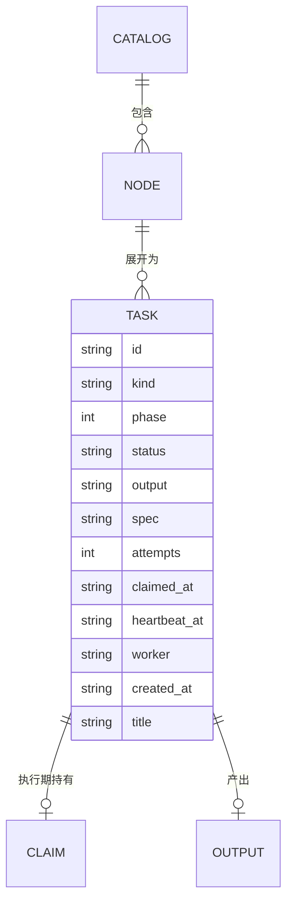
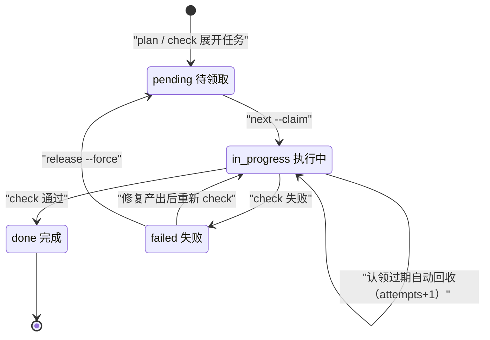
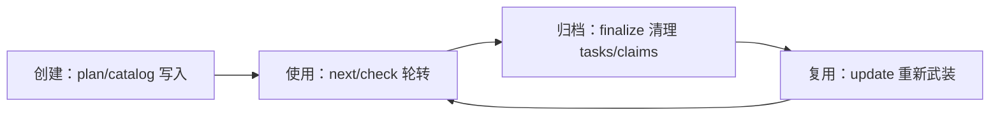

# 任务状态与目录数据模型

<cite>
**本文引用的文件**
- [src/repowiki/state.py](file://src/repowiki/state.py)
- [src/repowiki/catalog.py](file://src/repowiki/catalog.py)
- [src/repowiki/paths.py](file://src/repowiki/paths.py)
- [src/repowiki/validate.py](file://src/repowiki/validate.py)
</cite>

## 目录
1. [简介](#简介)
2. [数据模型总览](#数据模型总览)
3. [核心实体分析](#核心实体分析)
4. [状态机](#状态机)
5. [存储与序列化](#存储与序列化)
6. [数据生命周期](#数据生命周期)
7. [故障排查指南](#故障排查指南)
8. [结论](#结论)

## 简介
repowiki 的运行时数据由三组核心实体构成：任务记录（`state/index.json` 的 value，由 new_task 创建）、章节树节点（catalog.json 的节点与展开后的 FlatNode）、输出路径（WikiPaths 与 flatten 的派生规则）。三者通过任务 id 与输出路径关联：catalog 节点展开成任务，任务持有输出路径，输出路径又反指回章节位置。理解这组模型是排查一切"状态不对"问题的前提，也是「任务领取与并发调度」「增量更新与过期门禁」两页的公共基础。

章节来源
- [src/repowiki/state.py:76-91](file://src/repowiki/state.py#L76-L91)

## 数据模型总览
实体关系的全貌是一棵两级树加两个附属集合：一个 catalog 包含多个节点（章/页），每个页面节点展开为一个任务；任务在执行期最多持有一个认领（claims 目录）；任务完成后产出文件。下图是完整的实体关系，TASK 的字段即 index.json 中记录的真实字段集：

从图中可以看出建模上的一个关键取舍：CLAIM 与 OUTPUT 被建成独立实体而非 TASK 的字段——认领必须是文件系统上的目录（mkdir 原子性即互斥），产出必须是磁盘上的真实文件（校验与站点收集都直接读盘），二者都不能只活在 JSON 里。

图表来源
- [src/repowiki/catalog.py:23-43](file://src/repowiki/catalog.py#L23-L43)

章节来源
- [src/repowiki/catalog.py:138-180](file://src/repowiki/catalog.py#L138-L180)

## 核心实体分析
### 任务记录（index.json 的 value）
字段较多，用表格逐项说明（12 个字段即 new_task 的完整骨架）：

| 字段 | 类型 | 约束/说明 |
|---|---|---|
| id | string | 全局唯一，index.json 的 key；层级化命名（c01/c0101） |
| kind | string | catalog/page/overview/knowledge_card 等 11 种任务类型 |
| phase | int | 1~3，决定发放顺序（catalog→pages→overview） |
| status | string | pending/in_progress/done/failed，见状态机 |
| output | string | 相对 .repowiki/ 的固定产出路径，同 catalog 恒定 |
| spec | string | 规格文件相对路径（state/tasks/<id>.md） |
| attempts | int | 只增不减，达 REPOWIKI_MAX_ATTEMPTS（默认 3）即停发 |
| claimed_at / heartbeat_at | ISO 字符串 | 认领与最后心跳时间，过期判定依据 |
| worker | string | 持有者标识（主机名:进程号） |
| created_at | ISO 字符串 | 任务创建时间 |
| title | string | 任务标题，页面 H1 亦取自它 |

不变量：attempts 只增不减；phase 单调递进门控；同 catalog 重复展开产生的字段值完全确定。

章节来源
- [src/repowiki/state.py:76-91](file://src/repowiki/state.py#L76-L91)

### 章节节点（catalog.json 节点 / FlatNode）
- 字段：id/title/slug/summary/kind（chapter|page）/dependent_files/page_brief/children/archetype
- 约束：validate_catalog 强制 id/title/slug 全局唯一、树深 ≤ MAX_DEPTH=4、page 不得有 children、archetype 必须在 ARCHETYPES 六值白名单内、title 不得含占位符字面量
- 不变量：dependent_files 在校验时与仓库清单求交，不存在的路径被剔除并告警——catalog 里不会留下悬空引用

章节来源
- [src/repowiki/catalog.py:45-135](file://src/repowiki/catalog.py#L45-L135)

### 输出路径（WikiPaths 派生规则）
- 字段：flatten 按「locale/content/章节目录链/页面文件名」派生，文件名取 sanitize 后的 title
- 约束：兄弟重名自动加 __2 后缀（unique_name）；Windows/Unix 路径分隔符差异在 paths 层统一消化，上层永远只见正斜杠的相对路径
- 不变量：路径推导是纯函数——同一 catalog 在任何平台重复 flatten 产出完全一致的相对路径，这是增量更新能按 output 精确找到旧页面的前提

章节来源
- [src/repowiki/paths.py:42-64](file://src/repowiki/paths.py#L42-L64)

## 状态机
任务 status 的完整迁移图如下：pending 经 next --claim 进入 in_progress（同时创建 claims 认领目录）；check 通过置 done、失败置 failed；failed 有两条出路——agent 修复产出后重新 check 直接回 done（无需重置），或人工 release --force 打回 pending 重新排队。in_progress 还有一条自环：认领目录过期（默认 900 秒无心跳）会被下一个 next 自动回收，任务以 attempts+1 回到 in_progress 由新 worker 执行。

这张图值得逐条对照命令记忆：每条迁移边都精确对应一个命令动作，不存在命令触达不到的"幽灵迁移"；done 无出边意味着产出一旦通过校验就永久冻结，后续修正只能走 update 流程生成新任务。

图表来源
- [src/repowiki/state.py:219-280](file://src/repowiki/state.py#L219-L280)

章节来源
- [src/repowiki/state.py:247-280](file://src/repowiki/state.py#L247-L280)

## 存储与序列化
三组实体各有专属的存储介质与一致性手段，选型都围绕"多进程安全"这一个约束：

- index.json：TaskStore 全程文件锁（fcntl 加锁）+ 临时文件原子替换写，读改写包在事务里，多进程状态翻转零丢失（有专门回归测试）
- catalog.json：agent 直接写 JSON 文件，validate_catalog 即时校验并就地剔除非法 dependent_files——校验即清洗
- 认领目录：`state/claims/<id>` 用 mkdir 的原子性实现互斥，目录 mtime 即存活信号（touch 续期），过期回收时改名 `.stale-*` 留审计痕
- 序列化格式：全部 UTF-8 JSON；时间戳（created_at/claimed_at/heartbeat_at）为 ISO 格式字符串，可字典序比较

值得注意的设计是"不引入数据库"：三类数据中更新最频繁的 index.json 每秒不过数次写，文件锁完全够用，换来的是零依赖与肉眼可查（出问题直接 cat）。

章节来源
- [src/repowiki/state.py:35-74](file://src/repowiki/state.py#L35-L74)

## 数据生命周期
数据按"规划/执行"分为两类，生命周期在 finalize 处分叉：规划数据（catalog.json、index.json）在 finalize 后保留，是增量更新的依据；执行数据（tasks/ 规格与 claims/ 认领）在 finalize 成功时清理。update 命令随后基于 git diff 重新武装命中的任务（重置 attempts、重生成规格），开启下一轮循环；clean 则删除整个 state/，只留 wiki 产出，一切从头开始。

图中 B→C→D→B 的环就是 wiki-as-code 模式的日常：代码变更触发 update，update 只重写受影响页，finalize 后 state 恢复到干净的规划态等待下一轮。

图表来源
- [src/repowiki/metadata.py:28-60](file://src/repowiki/metadata.py#L28-L60)

章节来源
- [src/repowiki/updater.py:43-54](file://src/repowiki/updater.py#L43-L54)

## 故障排查指南
数据模型相关的故障排查思路：index.json 是唯一事实来源，所有"感觉不对"先看记录再下结论。常见场景如下：

- 状态与磁盘不一致：以 index.json 为准；claims 目录只是 in_progress 的影子，过期由 mtime 判定，无需人工清理
- 任务不再被发放（pending 却领不到）：attempts 已达上限，用 release --task <id> --force 显式重置
- 页面路径与 catalog 不符：output 是 flatten 派生的，勿手改；重跑 plan 会按当前 catalog 重建规格
- index.json 损坏或 JSON 解析失败：删除 state/ 重跑 plan 即可，wiki 产出在 content/ 下不受影响
- 疑似丢失状态翻转：先确认是否多 worker 无 --worker 身份混用；并发翻转本身有文件锁保护并有测试覆盖

章节来源
- [src/repowiki/state.py:421-436](file://src/repowiki/state.py#L421-L436)

## 结论
三组实体分工明确：catalog 定结构、任务记录定进度、WikiPaths 定位置；任务状态机是全系统唯一的运行时状态迁移，且每条边都能对应到一个命令。设计上的两个"不"——不引入数据库、不让状态有隐藏迁移——换来的是可肉眼审计（cat index.json）与可完整推理（状态图即全部行为）。带着这张数据观去读调度与增量两章，每个机制都是对这份数据的一次受控变换。

章节来源
- [src/repowiki/state.py:93-118](file://src/repowiki/state.py#L93-L118)
