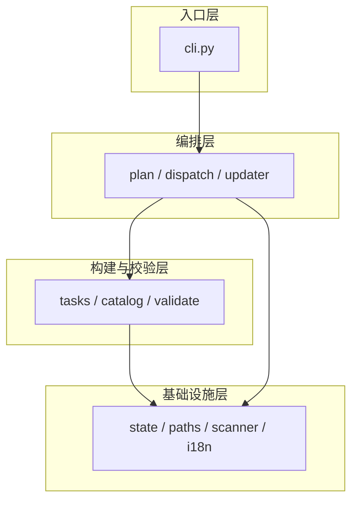
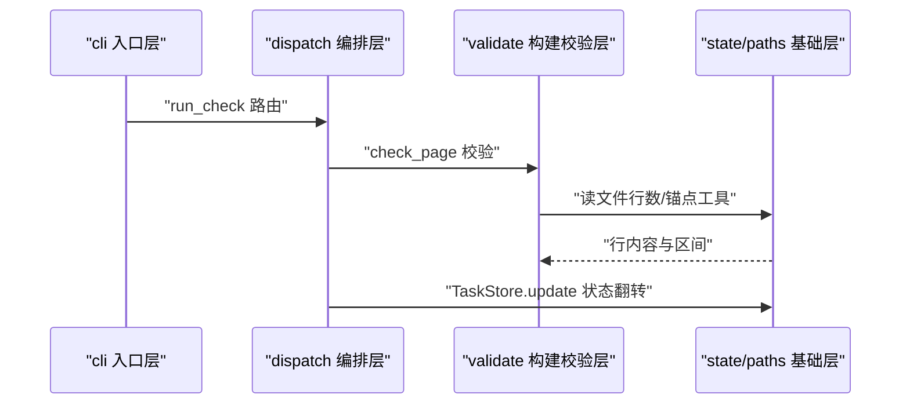
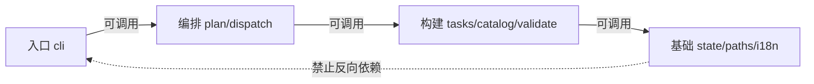

# 架构与源码分层

<cite>
**本文引用的文件**
- [src/repowiki/cli.py](file://src/repowiki/cli.py)
- [src/repowiki/state.py](file://src/repowiki/state.py)
- [src/repowiki/paths.py](file://src/repowiki/paths.py)
</cite>

## 目录
1. [简介](#简介)
2. [项目结构](#项目结构)
3. [核心组件](#核心组件)
4. [架构总览](#架构总览)
5. [详细组件分析](#详细组件分析)
6. [依赖关系分析](#依赖关系分析)
7. [性能与一致性考量](#性能与一致性考量)
8. [故障排查指南](#故障排查指南)
9. [结论](#结论)

## 简介
repowiki 的 src/repowiki 虽然是单包平铺布局（21 个模块都在同一目录），但模块之间的 import 方向呈现清晰的三层结构：入口层、编排层、机制层，再加一层被所有人依赖的基础设施层。层次按「谁调用谁」划分而非按目录划分——这是理解源码的第一把钥匙。分层的证据是可验证的：任取一个模块看它头部的 import，只会上指同层或下层、从不下指上层。本章把这套约定从代码里提炼成明确的规则与图示，让新成员不必读完 21 个模块也能正确归位自己的改动。

章节来源
- [src/repowiki/cli.py:8-25](file://src/repowiki/cli.py#L8-L25)

## 项目结构
四层的物理载体就是 src/repowiki 下的模块文件，先看目录树中与本章直接相关的部分：

```text
src/repowiki/
├── cli.py                        # 入口层
├── plan.py dispatch.py updater.py        # 编排层
├── tasks.py catalog.py validate.py       # 构建与校验层
├── state.py paths.py scanner.py i18n.py  # 基础设施层
└── site.py metadata.py llms.py           # 呈现层（与编排层平级）
```

- 每个模块按其被调用的位置天然归层，没有 layers/ 目录——分层存在于 import 语句的方向里
- 下图把 21 个模块装进四层框架，是本章两篇子页的总索引



图中值得注意的是编排层到基础设施层的"跨层直用"箭头：编排器可以直接使用基础能力（如 dispatch 直接用 state），而不必绕道构建校验层——分层约束的是"谁必须经过谁"，不是"谁只能挨着谁"。

图表来源
- [src/repowiki/cli.py:27-50](file://src/repowiki/cli.py#L27-L50)

章节来源
- [README.md:40-59](file://README.md#L40-L59)

## 核心组件
本章聚焦的两个核心组件分别是静态结构与数据结构的代表：

| 组件 | 关键文件 | 一句话职责 |
|---|---|---|
| 四层结构 | 全部模块的 import 关系 | 模块的归层决定它"可以依赖谁"，是重构决策的坐标系 |
| TaskStore | src/repowiki/state.py | 运行时状态：index.json 原子读写、认领、阶段门控 |
| WikiPaths | src/repowiki/paths.py | 静态位置：`.repowiki/` 全部路径派生与锚点/清洗工具 |
| 扩展点 | cli.py 的 build_parser | 新增子命令在单点注册、新机制放进对应层，归层正确时扩展几乎不触碰既有代码 |

章节来源
- [src/repowiki/state.py:93-100](file://src/repowiki/state.py#L93-L100)

## 架构总览
分层的运行时形态：一条 CLI 命令自上而下穿越四层，各层只向下依赖、向上只返回数据。没有事件、没有回调、没有反射，控制流在任一时刻都能用调用栈完整解释。下图以 check 命令为例展示这种穿越：



从图可以看到信息流的一个特征：基础层的返回值（行内容、区间）在校验层被消费后变成"校验结论"，在编排层被消费后变成"状态变更"——同一份数据在不同层被翻译成该层的语言，层间没有泄漏内部细节。

图表来源
- [src/repowiki/dispatch.py:319-373](file://src/repowiki/dispatch.py#L319-L373)

章节来源
- [src/repowiki/validate.py:114-140](file://src/repowiki/validate.py#L114-L140)

## 详细组件分析
本章两篇子页的导航如下，先看表再按需阅读：

| 子页 | 核心实体/机制 | 一句话职责 |
|---|---|---|
| 源码分层与依赖方向 | 四层模型 + 纵向切片 | 给出各层职责边界、"不该做的事"与调用规则 |
| 任务状态与目录数据模型 | 任务记录 / FlatNode / WikiPaths + 状态机 | 字段级数据说明与全系统唯一的状态迁移图 |

### 源码分层与依赖方向（子页）
- 职责：layer 原型实例——分层总览、各层职责、层间调用规则、一次 check 调用的纵向切片
- 阅读时机：准备修改任何模块之前，确认归层与 import 方向

章节来源
- [src/repowiki/catalog.py:138-180](file://src/repowiki/catalog.py#L138-L180)

### 任务状态与目录数据模型（子页）
- 职责：data 原型实例——任务记录字段级说明、任务状态机完整迁移图、存储与生命周期
- 阅读时机：排查任何"状态不对"的问题之前

章节来源
- [src/repowiki/paths.py:42-64](file://src/repowiki/paths.py#L42-L64)

## 依赖关系分析
分层约定的依赖规则只有两条，却解释了代码库里全部 import 语句的方向：

- 允许：入口层→编排层→构建与校验层→基础设施层；编排层可跨层直用基础设施层（必选主链路）
- 禁止：任何下层 import 上层（如 state.py 不得 import dispatch.py）；基础设施层不得 import 业务模块



虚线的"禁止"边不是靠工具强制的，而是靠测试与评审维持的约定——它的回报是基础设施层永远可以独立单测，不会被业务变更波及。

图表来源
- [src/repowiki/dispatch.py:8-28](file://src/repowiki/dispatch.py#L8-L28)

章节来源
- [src/repowiki/dispatch.py:14-28](file://src/repowiki/dispatch.py#L14-L28)

## 性能与一致性考量
- 分层让"确定性"约束集中在构建与校验层：该层全部可单测，是 231 条测试的主战场，也是六原型扩展能在一次提交内完成的原因
- 基础层保持无状态，多进程并发读写 index.json 的复杂度被限制在 state.py 一处，出问题时的排查面极小
- 分层对性能的贡献是间接的：机制集中的热点代码（校验、路径推导）是纯函数，可被缓存、可被并行调用、可被彻底单测——「可测」本身就是 repowiki 迭代速度的来源

章节来源
- [src/repowiki/state.py:35-74](file://src/repowiki/state.py#L35-L74)

## 故障排查指南
本章范围的疑问通常是"改动该放哪/为什么行为跨层失效"，排查思路是先归层再定位。建议先画出自己的改动在四层图中的位置与上下游，再顺着调用方向检查预期——多数跨层疑难都源于对「谁调用谁」的误解而非代码缺陷：

- 新增功能不知道放哪层：按「参数解析 → 阶段推进 → 业务规则 → 基础能力」归类，规则进构建校验层、机制进基础层
- 怀疑层次被打破：检查新 import 是否让下层依赖上层（如 scanner 出现对 validate 的依赖即为坏味道）
- 跨层行为不符合预期：用「任务状态与目录数据模型」页的字段说明核对中间状态，多数"诡异行为"是状态字段被误解

章节来源
- [src/repowiki/cli.py:8-25](file://src/repowiki/cli.py#L8-L25)

## 结论
四层结构与单向依赖是 repowiki 可维护性的来源：入口薄、编排清晰、规则集中、基础稳定。建议按「源码分层与依赖方向 → 任务状态与目录数据模型」的顺序读完本章，前者给坐标系、后者给数据观，之后阅读任何机制页都能对号入座。

章节来源
- [src/repowiki/cli.py:27-50](file://src/repowiki/cli.py#L27-L50)
