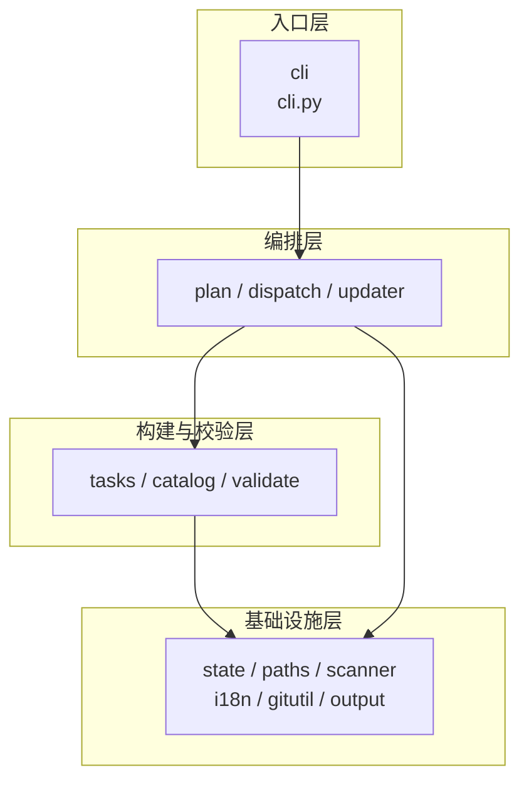
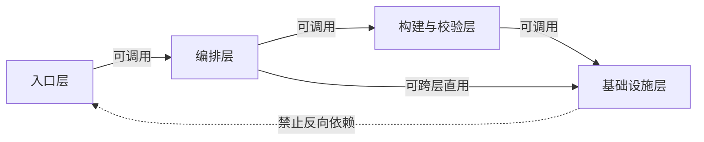
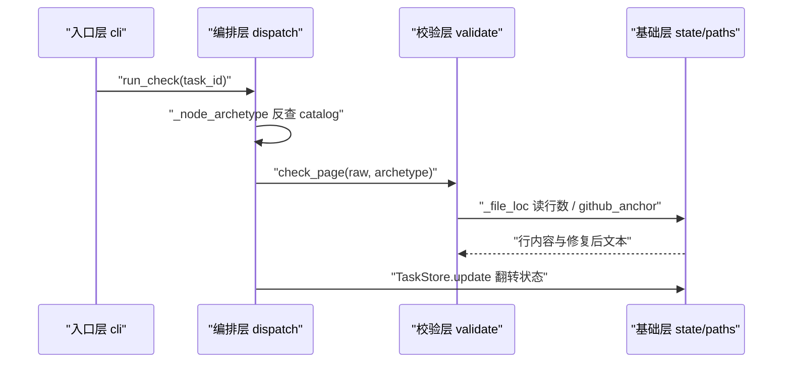

# 源码分层与依赖方向

<cite>
**本文引用的文件**
- [src/repowiki/cli.py](file://src/repowiki/cli.py)
- [src/repowiki/plan.py](file://src/repowiki/plan.py)
- [src/repowiki/dispatch.py](file://src/repowiki/dispatch.py)
- [src/repowiki/updater.py](file://src/repowiki/updater.py)
- [src/repowiki/tasks.py](file://src/repowiki/tasks.py)
- [src/repowiki/validate.py](file://src/repowiki/validate.py)
- [src/repowiki/state.py](file://src/repowiki/state.py)
- [src/repowiki/paths.py](file://src/repowiki/paths.py)
</cite>

## 目录
1. [简介](#简介)
2. [分层总览](#分层总览)
3. [各层职责](#各层职责)
4. [层间依赖与调用规则](#层间依赖与调用规则)
5. [纵向切片：一次调用的穿越](#纵向切片一次调用的穿越)
6. [横切关注点](#横切关注点)
7. [故障排查指南](#故障排查指南)
8. [结论](#结论)

## 简介
repowiki 的 src/repowiki 是单包平铺布局，21 个模块同住一个目录，但它们之间存在清晰的层次划分与单向调用约定：入口层（cli）→ 编排层（plan/dispatch/updater）→ 构建与校验层（tasks/catalog/validate）→ 基础设施层（state/paths/scanner/i18n/gitutil/templates/output/errors）。层次按「谁调用谁」划分而非按目录划分——没有 layers/ 目录，分层存在于 import 语句的方向里。这份约定没有工具强制，靠测试与评审维持，因此把它写清楚本身就是维护手段。

章节来源
- [src/repowiki/cli.py:8-25](file://src/repowiki/cli.py#L8-L25)

## 分层总览
四层自上而下职责递减、复用度递增。下图是全模块的归层视图，呈现层模块（site/metadata/llms/knowledge/skill_install）与编排层平级，同属"被 cli 直接调用"的一层：

从图中可以得出归层判据：越靠上越"贵"（直接面向用户、变更频繁），越靠下越"稳"（复用面广、接口不变）。判断一个新模块归哪层，就看它上面有几层——只被 cli 调用的是编排层，被编排层复用的是机制层，被所有人复用的是基础层。

图表来源
- [src/repowiki/cli.py:35-165](file://src/repowiki/cli.py#L35-L165)

章节来源
- [src/repowiki/cli.py:8-25](file://src/repowiki/cli.py#L8-L25)

## 各层职责
### 入口层（cli.py）
- 职责：定义 15 个子命令、解析参数、把异常翻译为退出码 0/1/2/3
- 代表模块：cli.py 的 build_parser（L27 起）与 main（L170 起）
- 不该做的事：不实现任何校验规则或文件机制——入口层出现业务状态判断即为越层

章节来源
- [src/repowiki/cli.py:27-50](file://src/repowiki/cli.py#L27-L50)

### 编排层（plan / dispatch / updater）
- 职责：推进阶段（规划→页面→总览）、调度任务领取与校验、按 git diff 增量重写
- 代表模块：plan.py 的 run_plan、dispatch.py 的 run_next/run_check、updater.py 的 run_update/run_stale
- 不该做的事：绕过 TaskStore 直接改 index.json；在编排层内复制校验逻辑而非调用 validate

章节来源
- [src/repowiki/dispatch.py:50-127](file://src/repowiki/dispatch.py#L50-L127)

### 构建与校验层（tasks / catalog / validate）
- 职责：任务规格渲染、章节树校验与输出路径推导、产出校验与自动修复——repowiki 的"业务规则"全部住在这一层
- 代表模块：build_page_tasks、validate_catalog、check_page、_SECTION_TABLE_BY_ARCHETYPE 映射
- 不该做的事：不做用户交互与退出码决策——这一层只返回结构化的 CheckResult

章节来源
- [src/repowiki/validate.py:114-140](file://src/repowiki/validate.py#L114-L140)

### 基础设施层（state / paths / scanner / i18n 等）
- 职责：原子任务存储、路径派生、文件清单扫描、双语字符串、git 封装等公共能力
- 代表模块：TaskStore、WikiPaths、scan、detect_locale、run_git
- 不该做的事：import 任何上层业务模块——这层若反向依赖，"机制可独立单测"的性质立即失效

章节来源
- [src/repowiki/scanner.py:116-148](file://src/repowiki/scanner.py#L116-L148)

## 层间依赖与调用规则
允许方向有两条：主链路「上层→相邻下层」与编排层的跨层直用「编排层→基础设施层」。禁止方向一条：任何下层 import 上层。规则存在的原因可以直接从反例推出——若 state.py 反向 import dispatch.py，则 state 的单元测试必须连带加载编排逻辑，"机制层可独立验证"的整个测试策略崩塌。下图把允许与禁止画在同一张图里：

图中实线是 import 语句的真实方向（可在各模块头部验证），唯一一条虚线是禁令。实践中判断违规只需一秒：新 import 的模块"层次比我高吗？"——是即违规。

图表来源
- [src/repowiki/dispatch.py:14-28](file://src/repowiki/dispatch.py#L14-L28)

章节来源
- [src/repowiki/state.py:10-19](file://src/repowiki/state.py#L10-L19)

## 纵向切片：一次调用的穿越
以 `repowiki check . --task c0101` 为例穿越四层：入口层解析 --task 参数并路由；编排层 run_check 读任务记录、按任务 id 反查 catalog 得到 archetype；构建校验层 check_page 按原型小节表做规则校验与自动修复；基础设施层提供文件行数读取、锚点重建与状态落盘。下图标注了每一步发生在哪个层：

这张切片图同时解释了错误传播路径：校验层只产生 CheckResult（数据），编排层把它翻译成 exit 0/1，入口层把异常翻译成退出码——每一层只懂自己那层的"语言"，这是分层的真正收益。

图表来源
- [src/repowiki/dispatch.py:319-373](file://src/repowiki/dispatch.py#L319-L373)

章节来源
- [src/repowiki/validate.py:114-160](file://src/repowiki/validate.py#L114-L160)

## 横切关注点
repowiki 没有使用装饰器或中间件式的横切机制，横切能力以"基础层工具函数被各层直接调用"的方式落地，共有四组：

- 输出与错误：output.py 的 emit/emit_error 被所有编排层命令共用（--json 与人类模式互斥）
- 本地化：i18n.py 的 strings(locale) 被校验器（小节表）与站点渲染（UI 文案）跨层调用，locale 从 state 读取后层层传递
- 路径卫生：paths.py 的 sanitize_component/github_anchor 被 catalog（路径生成）与 validate（锚点重建）同时使用
- git 访问：gitutil.run_git 被 scanner（ls-files）与 updater（diff）共用，缺 git 或超时时安全返回 None 而非抛异常

这些机制的共同点是：实现全在基础层，使用方各自显式调用——没有隐藏的全局状态，跨层数据（如 locale）始终作为参数传递。
- 设计取向：没有用装饰器/中间件让横切「自动」生效，而是让调用方显式引用——代价是每个调用点多一行，收益是数据流向永远可见。

章节来源
- [src/repowiki/output.py:18-33](file://src/repowiki/output.py#L18-L33)

## 故障排查指南
分层相关的排查围绕"归层"与"方向"两个关键词展开，思路是先确认改动属于哪层，再检查 import 是否守规：

- 新增功能不知道放哪层：按「参数解析 → 阶段推进 → 业务规则 → 基础能力」归类；规则进构建校验层、机制进基础层、仍拿不准就放在被复用最少的那层
- 怀疑层次被打破：审查新增 import——下层模块出现上层依赖（如 scanner import validate）即为坏味道，应把共享部分下沉
- 呈现层改动影响编排：site/metadata 只消费完成的产出，若发现编排层依赖呈现层（如 updater import site）即是分层破坏信号
- 行为跨层失效：用纵向切片的思路沿调用栈逐层打断点/加日志，定位"翻译"出错的那一层

章节来源
- [src/repowiki/cli.py:145-165](file://src/repowiki/cli.py#L145-L165)

## 结论
分层依据是调用方向而非目录结构：四层单向依赖、基础设施无状态、业务规则集中在构建与校验层。这套约定的维护成本是一句纪律（新 import 不许向上），回报是机制可独立单测、编排可整体替换、新原型的接入不需要理解全部代码——正确使用方式就是把新机制放进对应层，并让 import 方向永远向下。

章节来源
- [src/repowiki/cli.py:8-25](file://src/repowiki/cli.py#L8-L25)
