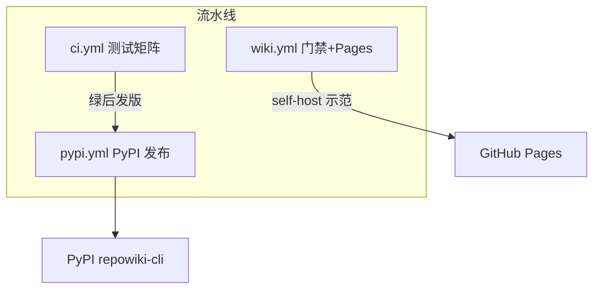
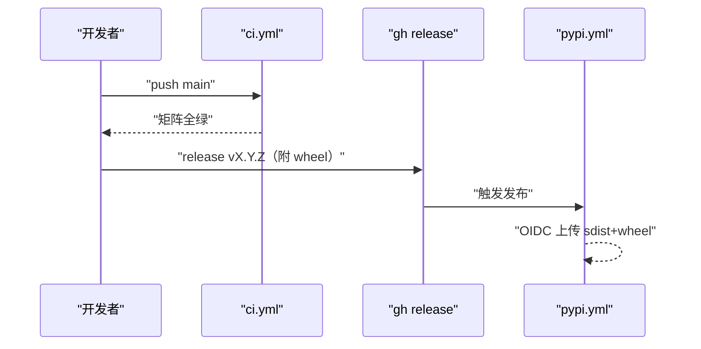
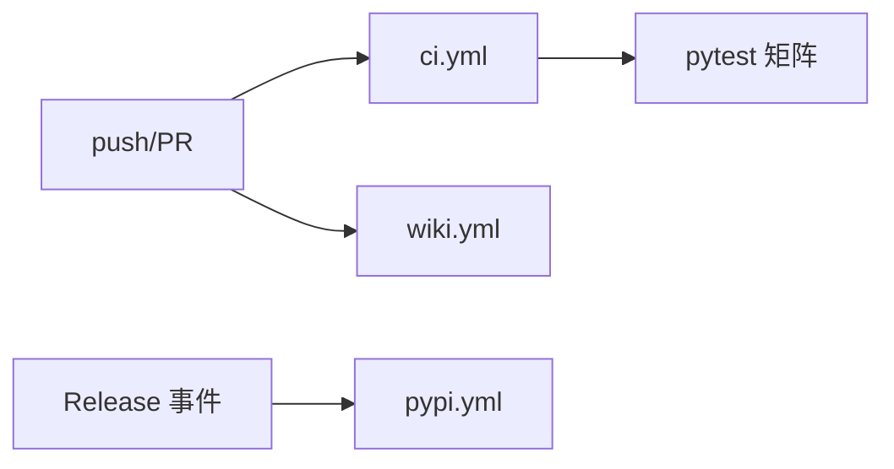

# CI 与发布流水线

<cite>
**本文引用的文件**
- [.github/workflows/ci.yml](file://.github/workflows/ci.yml)
- [.github/workflows/pypi.yml](file://.github/workflows/pypi.yml)
- [.github/workflows/wiki.yml](file://.github/workflows/wiki.yml)
- [pyproject.toml](file://pyproject.toml)
</cite>

## 目录
1. [简介](#简介)
2. [项目结构](#项目结构)
3. [核心组件](#核心组件)
4. [架构总览](#架构总览)
5. [详细组件分析](#详细组件分析)
6. [依赖关系分析](#依赖关系分析)
7. [性能与一致性考量](#性能与一致性考量)
8. [故障排查指南](#故障排查指南)
9. [结论](#结论)

## 简介
repowiki 有三条 GitHub Actions 流水线，各司其职：ci.yml 跑三平台（macOS/Linux/Windows）× 四 Python 版本（3.10-3.13）的测试矩阵，是所有变更的合入门槛；pypi.yml 在 Release 发布后经 Trusted Publisher 的 OIDC 免 token 链路自动上传 PyPI，全程无密钥维护；wiki.yml 是"自食其力"的示范——对本仓库自身做 wiki 过期门禁与 Pages 发布，产品能力（stale/site）在自家仓库的实时应用。三条流水线全部只跑确定性命令，CI 内不出现任何 agent——这不仅省钱省时，更重要的是结果可复现：同一段代码在任何时间触发，得到的结论相同。

章节来源
- [.github/workflows/ci.yml:1-8](file://.github/workflows/ci.yml#L1-L8)

## 项目结构
三条流水线的配置都刻意保持薄：没有自建 runner、没有缓存策略调优、没有自研 Action——普通 runner 加几行 shell，简单到可以在五分钟内读懂全部三个文件：

```text
.github/workflows/
├── ci.yml      # 测试矩阵：3 平台 × 4 Python 版本（push/PR 触发）
├── pypi.yml    # PyPI 发布：Trusted Publisher OIDC（Release 触发）
└── wiki.yml    # wiki 门禁（PR）+ Pages 发布（push main）
```

下图是它们的触发关系与产物去向：



图中 ci → pypi 的"绿后发版"是人工判断而非自动触发：矩阵全绿是发版前置条件，但发版动作（升版本、双语 CHANGELOG、打 wheel、gh release 附 wheel）按 AGENTS.md 清单由维护者执行——发版本就是人工决定，机器只保证发出去的包是绿的。

图表来源
- [.github/workflows/wiki.yml:1-30](file://.github/workflows/wiki.yml#L1-L30)

章节来源
- [.github/workflows/pypi.yml:1-20](file://.github/workflows/pypi.yml#L1-L20)

## 核心组件
流水线的四个核心机制，每个都对应一个"零手工"的承诺：

- 矩阵策略（matrix）：os × python-version 双维展开共 12 格，任何一格失败即整体失败——Windows 格的长期存在逼着代码保持跨平台卫生（文件锁、路径分隔符都有抽象）
- Trusted Publisher：PyPI 侧预登记 Pending Publisher（Owner luomsis / Repo repowiki / Workflow pypi.yml / Environment pypi）后，OIDC 身份直接换取上传权限，本地与 CI 都不持有 PyPI token
- wiki 门禁：stale --fail-if-stale 的退出码直接决定 PR 检查结论；Pages job 在 push main 后自动 repowiki site 重建并发布
- 扩展点：AGENTS.md 的发版六步清单（同步升版本、双语 CHANGELOG、打 wheel、Release 附 whl、测试门禁、创建 Release）约束人工发布流程

章节来源
- [.github/workflows/ci.yml:8-24](file://.github/workflows/ci.yml#L8-L24)

## 架构总览
发布路径从代码合入到用户安装共五步：代码合入 main → CI 矩阵全绿 → 维护者按清单发版（升版本/双语 CHANGELOG/打 wheel）→ gh release 附 wheel → pypi.yml 自动上传。下图是这条主链的时序，用户侧的 pip install 是终点：



从图中可以看出离线安装的保障来自哪里：wheel 同时存在于 PyPI 与 GitHub Release 两处——后者的存在让完全断网的环境（只放行 GitHub）也能拿到安装包，配合仅 pyyaml 的运行时依赖，两个 wheel 拷过去就能装。

图表来源
- [.github/workflows/pypi.yml:20-41](file://.github/workflows/pypi.yml#L20-L41)

章节来源
- [.github/workflows/ci.yml:12-24](file://.github/workflows/ci.yml#L12-L24)

## 详细组件分析
### 测试矩阵（ci.yml）
- 职责：三平台 × Py3.10-3.13 的全量 pytest 回归，是所有 PR 的合入门槛
- 实现要点：与本地开发完全一致的命令（pip install -e . && pytest），无需 WSL 与外部服务；矩阵并行把回归压在数分钟内
- 为什么坚持 Windows 格：文件锁（fcntl）、路径分隔符、git 行为都有平台差异，只有真实 Windows runner 能暴露这些问题——锁平台的 bug 留到用户手里就是 issue

章节来源
- [.github/workflows/ci.yml:8-24](file://.github/workflows/ci.yml#L8-L24)

### 自身 wiki 门禁与 Pages（wiki.yml）
- 职责：PR 阶段拦截「代码改了、wiki 没跟」；push main 后自动 repowiki site 重建并发布 Pages
- 关键行为：两个独立 job——门禁只影响 PR 检查结论、Pages 只随 main 更新，互不阻塞；门禁输出会列出受影响页面清单，评审者据此判断该让谁更新 wiki
- 示范意义：目标仓库拷贝这一个 workflow 文件即可获得同款能力，这也是文档里推荐的集成方式——本仓库是它的第一个用户

章节来源
- [.github/workflows/wiki.yml:1-45](file://.github/workflows/wiki.yml#L1-L45)

### PyPI 发布（pypi.yml）
- 职责：Release 发布事件触发后，构建并上传 sdist + wheel 到 PyPI
- 关键行为：用 OIDC 而非 token 认证；首次需在 PyPI 预登记 Pending Publisher，之后新版本零 PyPI 侧操作；包名 repowiki-cli（repowiki 名被占用，命令名与 import 名保持 repowiki 不变）

章节来源
- [.github/workflows/pypi.yml:20-41](file://.github/workflows/pypi.yml#L20-L41)

## 依赖关系分析
三条流水线的触发事件互斥、依赖几乎为零：ci 与 wiki 同样由 push/PR 触发但职责正交（一个测代码、一个查文档新鲜度）；pypi 只认 Release 事件。图中没有 pypi 对 ci 的依赖边——"绿后才发版"是流程纪律而非机器强制，这是有意的取舍。



图表来源
- [.github/workflows/wiki.yml:30-70](file://.github/workflows/wiki.yml#L30-L70)

章节来源
- [.github/workflows/pypi.yml:20-41](file://.github/workflows/pypi.yml#L20-L41)

## 性能与一致性考量
- 可复现性：wiki.yml 的门禁视图是 committed-only，两个评审者对同一 PR 得到同一结论——这是 stale 被设计成只读命令的原因；--dirty 只在本地用
- 成本：矩阵并行 + 测试本身 5 秒级，全平台回归数分钟完成；wiki 门禁只是两个确定性 CLI 调用，几乎零开销
- 一致性：Pages 产物与仓库内 .repowiki 同源同批生成，在线样例不会与文档脱节；发版清单的六步里有两步专门防「人为不一致」：双语 CHANGELOG 同步改（防文档漂移）、whl 附到 Release（防离线安装路径断裂）——清单的本质是把踩过的坑固化成步骤

章节来源
- [.github/workflows/wiki.yml:70-106](file://.github/workflows/wiki.yml#L70-L106)

## 故障排查指南
流水线问题的排查按"先本地复现、再查触发链"进行——多数 CI 问题在本地用同样命令即可重放。常见场景如下：

- 矩阵某格失败：优先怀疑平台差异（路径分隔符/文件锁/fcntl），本地切对应平台复现；新代码引入平台相关调用是最常见原因，修法是下沉到机制层抽象
- PyPI 发布未出现：三查——Release 是否带 tag、pypi.yml 是否在默认分支、PyPI 侧 Pending Publisher 是否预登记（仅首次需要）；日志里看 OIDC 交换是否成功
- Pages 未更新：确认仓库设置里 Pages 来源为 GitHub Actions，且 wiki.yml 的 site job 成功；Pages 有几分钟缓存延迟属正常
- 门禁误拦：stale 判定基于 workflow 里的 --since 基线（通常 origin/main），确认取值符合预期；wiki 确实过期就走 update 流程补页面，这正是门禁的目的

章节来源
- [.github/workflows/wiki.yml:45-70](file://.github/workflows/wiki.yml#L45-L70)

## 结论
工程化闭环是「测试矩阵守质量、Trusted Publisher 简发布、自 wiki 门禁做示范」：repowiki 用自身吃自己的狗粮，README 的在线样例就是这条流水线的实时产物。对想集成 repowiki 的团队，拷贝 wiki.yml 一个文件就能得到同款门禁与自动发布——一个确定性工具最好的自我介绍，就是它在 CI 里跑自己。这套流水线的可复制性比它的存在本身更有价值：没有魔法，只有纪律。

章节来源
- [.github/workflows/ci.yml:1-8](file://.github/workflows/ci.yml#L1-L8)
