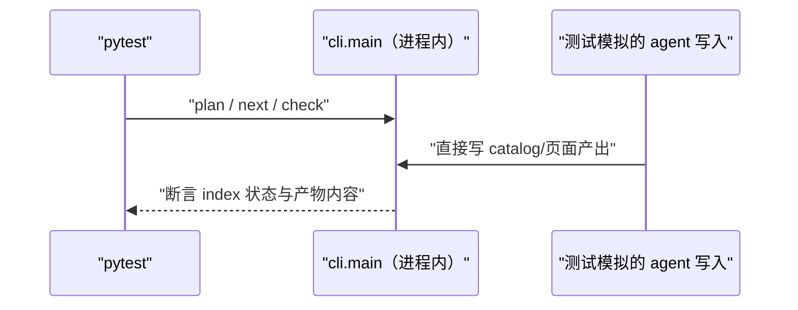
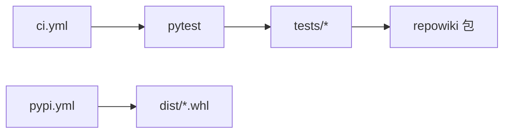

# 测试与工程化

<cite>
**本文引用的文件**
- [tests/conftest.py](file://tests/conftest.py)
- [tests/test_validate.py](file://tests/test_validate.py)
- [pyproject.toml](file://pyproject.toml)
</cite>

## 目录
1. [简介](#简介)
2. [项目结构](#项目结构)
3. [核心组件](#核心组件)
4. [架构总览](#架构总览)
5. [详细组件分析](#详细组件分析)
6. [依赖关系分析](#依赖关系分析)
7. [性能与一致性考量](#性能与一致性考量)
8. [故障排查指南](#故障排查指南)
9. [结论](#结论)

## 简介
repowiki 的工程化围绕"无 LLM 也能全链路回归"展开：测试通过模拟 agent 写入产出，把 plan→check→finalize→site 全流程跑进 pytest，230+ 条用例数秒跑完；CI 以三平台 × 四 Python 版本矩阵守护，Windows 格的长期存在逼着代码保持跨平台卫生；发布走 wheel + GitHub Release + PyPI Trusted Publisher 的全自动链路，本地与 CI 均不持有 PyPI token。工程化三件套（测试、CI、发布）与产品本身的"确定性"承诺互为因果——正因为系统是确定性的，它才能被这样彻底、廉价、频繁地回归；反过来说，任何破坏确定性的改动都会立刻被这套测试暴露。

章节来源
- [tests/conftest.py:1-40](file://tests/conftest.py#L1-L40)

## 项目结构
测试资产与工程流水线分居两处，先看测试目录的组织（按机制一对一命名，失败时能从模块名直接定位被测机制）：

```text
tests/
├── conftest.py            # 合成仓库 + 合法 catalog/页面样本（全部测试的地基）
├── test_flow.py           # plan→check→finalize→update→site 全链路 + 并发回归
├── test_validate.py       # 校验规则正反例 + 自动修复断言
├── test_state.py          # 认领互斥、过期回收、毒任务
├── test_archetypes.py     # 六原型 wiring 守卫 + 正反例
└── test_site / test_stale / test_coverage / ...
```

三条流水线共享同一条测试底座但触发条件互斥：ci 随 push/PR、pypi 随 Release、wiki 随 push/PR 但只做 wiki 门禁与 Pages——一个提交最多同时触发两条线，互不阻塞。

图表来源
- [pyproject.toml:40-50](file://pyproject.toml#L40-L50)

章节来源
- [pyproject.toml:1-30](file://pyproject.toml#L1-L30)

## 核心组件
工程化的四个核心构件，两个属于测试、两个属于流水线：

- make_repo / valid_catalog / valid_page：端到端测试的最小合成世界——13 个文件的微型仓库 + 合法章节树 + 合规格页面样本，全部测试的地基
- 进程内执行器：测试直接调用 cli.main 而非子进程，全量套件因此 4~5 秒跑完，支持提交前高频自跑
- ci.yml 矩阵：os（macOS/Linux/Windows）× python-version（3.10-3.13）双维展开，任何一格失败即整体失败
- AGENTS.md 发版清单：同步升版本、双语 CHANGELOG、打 wheel、Release 附 whl、测试门禁、创建 Release 六步，把人工发版变成照单执行
- 扩展点：新增机制按"夹具 + 正反例 + 端到端"三段式补测试；新增流水线步骤按"确定性命令 + 退出码契约"原则编写

章节来源
- [tests/conftest.py:38-70](file://tests/conftest.py#L38-L70)

## 架构总览
测试策略与源码分层同构：构建与校验层的纯函数用单元正反例覆盖，编排层的并发与状态用进程池/线程回归，呈现层用产物断言。全部测试绕过 LLM——agent 的写入由测试直接模拟，因此回归结果只取决于代码本身。下图是一次典型端到端测试的形态：



图中"模拟 agent"只做文件写入这一件事——它不试图模拟语义质量，语义层由校验器正反例单独覆盖。测试因此分成两个互不渗透的域：确定性域（本章全部内容）与语义域（规格与 STYLE 的责任），两者的测试手段完全不同。

图表来源
- [tests/test_flow.py:20-53](file://tests/test_flow.py#L20-L53)

章节来源
- [tests/conftest.py:100-140](file://tests/conftest.py#L100-L140)

## 详细组件分析
本章两篇子页的导航如下：

| 子页 | 核心机制 | 一句话职责 |
|---|---|---|
| 测试体系 | conftest 夹具 + 三层测试 | 无 LLM 回归整个构建系统 |
| CI 与发布流水线 | 三条 workflow + 发版清单 | 测试矩阵、PyPI 自动发布、wiki 门禁 |

### 测试体系（子页）
本子页展开夹具层的构成（合成仓库、合法 catalog/页面/流程页样本，双语可切换）与三层测试的分工：校验层正反例、编排层并发回归（multiprocessing 池验证状态翻转零丢失、孤儿认领自愈）、全链路端到端。读它的正确时机是准备新增机制或修改校验规则之前。

### CI 与发布流水线（子页）
本子页展开三条流水线的触发条件与内部机制：ci.yml 的平台 × 版本矩阵为何坚持 Windows 格、pypi.yml 的 Trusted Publisher OIDC 链路如何做到零密钥、wiki.yml 如何用产品自身能力（stale 门禁 + site 发布）伺候本仓库。发版六步清单也在这一页。

章节来源
- [tests/test_flow.py:692-703](file://tests/test_flow.py#L692-L703)

## 依赖关系分析
工程化的依赖极其收敛，按"测试/发布"两档分组：

- 必选（测试链）：pytest → tests/* → repowiki 包本体（src 布局需 PYTHONPATH=src 或 pip install -e .）
- 必选（发布链）：pypi.yml → dist/*.whl（构建产物）；Trusted Publisher OIDC（零密钥）



图中没有任何外部服务依赖——连发布都不需要本地持有 PyPI token，这是"零网络"哲学在工程化侧的延续：构建、测试、发布三条链路都能在隔离环境重放。

图表来源
- [pyproject.toml:30-50](file://pyproject.toml#L30-L50)

章节来源
- [.github/workflows/pypi.yml:1-20](file://.github/workflows/pypi.yml#L1-L20)

## 性能与一致性考量
- 全量测试秒级完成（无 LLM、无子进程泛滥），支持提交前高频自跑；CI 矩阵并行把平台回归压在数分钟内
- 测试与文档同仓库演进：双语 CHANGELOG、AGENTS.md 发版清单随代码更新，文档过期还有 wiki.yml 门禁盯着——工程化资产本身也被工程化保护
- 产物可追溯：每次发版的 wheel 同时在 PyPI 与 Release 页，任何环境都能拿到与版本号精确对应的安装包
- 流水线的成本结构也值得一提：三条流水线全部跑在 GitHub 免费额度内——矩阵数分钟、发布秒级、wiki 门禁近乎零成本，工程化的运营成本被刻意压到可以忽略

章节来源
- [pyproject.toml:40-50](file://pyproject.toml#L40-L50)

## 故障排查指南
工程化问题分"本地测试"与"流水线"两类，定位思路是先在最小环境复现。还有一类高频疑问是"为什么我的场景没有测试覆盖"：repowiki 的测试策略是覆盖机制不覆盖样例——合成仓库只是一种输入，机制在任意输入下的行为由正反例保证：

- 本地测试导入到旧安装包：src 布局需 PYTHONPATH=src 或 pip install -e .，否则 pytest 会导入 site-packages 里的旧版本——症状是"刚改的代码测试不生效"
- 测试残留状态：夹具全部基于 tmp_path 理论无残留；偶发异常先清 pytest cache 再排查
- CI 矩阵某格失败：优先怀疑平台差异（路径分隔符/文件锁/fcntl），本地用对应平台复现；新代码引入平台相关调用是最常见原因
- PyPI 发布未出现：确认 Release 已带 tag、workflow 文件在默认分支、PyPI 侧 Pending Publisher 预登记过（仅首次）

章节来源
- [tests/conftest.py:38-70](file://tests/conftest.py#L38-L70)

## 结论
无 LLM 的全链路测试是 repowiki 敢做确定性承诺的底气：编排、校验、站点全部可回归，agent 只在语义层被模拟。三条流水线把"测试绿 → 发版 → wiki 门禁"串成闭环，其中 wiki.yml 还是产品能力的实时示范——工程化与产品在此重合，这正是确定性工具的理想形态。

章节来源
- [pyproject.toml:1-30](file://pyproject.toml#L1-L30)
