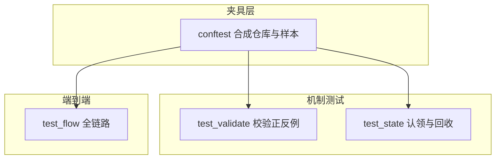
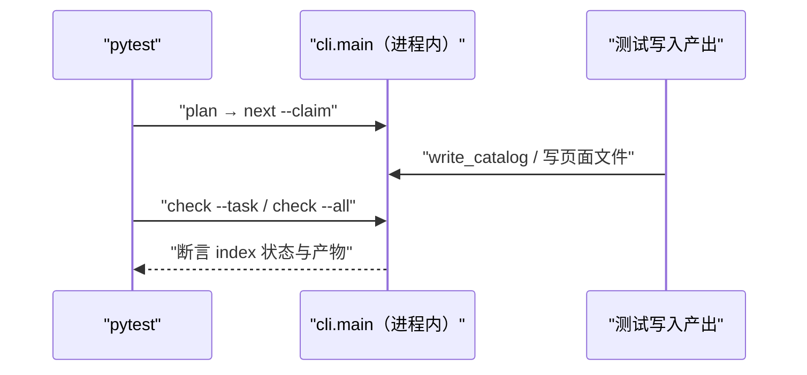
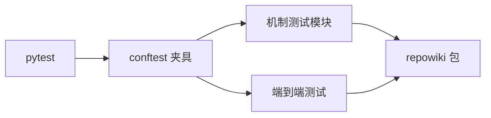

# 测试体系

<cite>
**本文引用的文件**
- [tests/conftest.py](file://tests/conftest.py)
- [tests/test_validate.py](file://tests/test_validate.py)
- [tests/test_flow.py](file://tests/test_flow.py)
- [tests/test_state.py](file://tests/test_state.py)
</cite>

## 目录
1. [简介](#简介)
2. [项目结构](#项目结构)
3. [核心组件](#核心组件)
4. [架构总览](#架构总览)
5. [详细组件分析](#详细组件分析)
6. [依赖关系分析](#依赖关系分析)
7. [性能与一致性考量](#性能与一致性考量)
8. [故障排查指南](#故障排查指南)
9. [结论](#结论)

## 简介
测试体系的目标是"不依赖任何 LLM 就能回归整个构建系统"：conftest 提供合成仓库与合法产出样本，测试模块直接调用 cli.main 模拟 agent 的领取-写入-校验循环。当前套件 230+ 条用例、4~5 秒跑完，覆盖校验正反例、并发竞态、孤儿认领自愈、增量映射、站点聚合与原型 wiring 守卫。这套测试的存在方式本身就是产品理念的证明：系统是确定性的，所以它可以被确定性地质疑。测试与产品的关系在这套体系里格外直接：repowiki 承诺的每个确定性性质（原子认领、状态零丢失、锚点可重建、增量可复现）都有至少一条对应的回归测试——承诺与测试一一对应，是这套体系的组织原则。

章节来源
- [tests/conftest.py:1-36](file://tests/conftest.py#L1-L36)

## 项目结构
十余个测试模块按机制拆分，每个模块对应源码的一个编排放层面。下图是夹具层与测试层的组成关系，箭头即"谁使用谁的夹具"：

图中端到端层（test_flow）体量最大（约 760 行），它把 plan→check→finalize→update→knowledge→site 串成完整场景；机制层则各自聚焦，失败时能直接指向被测模块。除图中三个主要模块外，还有 test_archetypes（六原型的 wiring 守卫与正反例）、test_scanner、test_paths_catalog、test_site、test_stale 等按机制一对一的专项模块——模块名即被测机制名。

图表来源
- [tests/conftest.py:38-70](file://tests/conftest.py#L38-L70)

章节来源
- [tests/test_flow.py:1-22](file://tests/test_flow.py#L1-L22)

## 核心组件
夹具层的四个核心样本是全部测试的地基，理解它们就能读懂任何测试用例：

- make_repo(tmp_path, git)：生成 13 个文件的微型 Python 仓库（README/pyproject/src/tests/scripts），可选 git 初始化（增量更新测试需要提交历史）
- valid_catalog()：含一章一页 + 顶级页的合法章节树，id 为 c01/c0101/c02——几乎所有测试的任务名都来自它
- valid_page(title)：九小节、双 mermaid、合规引用行号区间的模块型页面样本，直接写盘即可通过 check
- flow_page(title, locale)：流程型页面样本，zh/en 双语可切换——原型相关测试的第二个样本
- 原型专项模块：六原型 × 双语言的 check_page 正反例与 wiring 守卫，新增原型漏配资产在 CI 即被打回
- 扩展点：新增原型时按「wiring 守卫 + check 正反例 + 端到端」三段式扩展，conftest 里加对应的 *_page 样本

章节来源
- [tests/conftest.py:100-205](file://tests/conftest.py#L100-L205)

## 架构总览
测试与源码分层同构：校验层（validate）用纯函数正反例；编排层（state/dispatch）用进程池验证并发；全链路（flow）在进程内跑 cli.main。下图是端到端测试的标准形态，几乎所有测试类都遵循这个骨架：

图中"测试写入产出"这一步就是模拟 agent 的全部——不生成内容、只写文件。语义质量不在测试范围（它属于校验器正反例与人工评审），测试只回答"机制在给定输入下是否产生给定输出"。

图表来源
- [tests/test_flow.py:63-108](file://tests/test_flow.py#L63-L108)

章节来源
- [tests/test_flow.py:741-761](file://tests/test_flow.py#L741-L761)

## 详细组件分析
### 校验正反例（test_validate.py）
- 职责：每个校验规则都有 pass 与 fail 两组用例，自动修复行为有独立断言
- 关键行为：行号起点越界/区间倒置必须 error、终点越界必须钳制；空引用区间、小节来源缺失、占位符残留各有专项——新增校验规则时先在本模块补正反例再改实现是既定流程

章节来源
- [tests/test_validate.py:1-60](file://tests/test_validate.py#L1-L60)

### 并发回归（test_flow.py / test_state.py）
- 职责：多进程状态翻转零丢失、孤儿认领自动回收、watch 停滞报告、毒任务上限
- 关键行为：multiprocessing 池并发 flip done 断言 12/12 成功（无丢失更新）；认领过期靠 utime 伪造 mtime 触发，不真等 15 分钟——测试与生产共享同一套过期判定代码

章节来源
- [tests/test_flow.py:600-655](file://tests/test_flow.py#L600-L655)

### 原型 wiring 守卫
- 职责：验证「模板文件的标题 ↔ i18n 小节表 ↔ 模板名映射」三方对齐，六原型 × 双语言全组合
- 关键行为：模板缺文件、i18n 缺表、映射缺项任何一处漏配都在 CI 被拦下；断言对象是资产（模板标题、表条目、映射键）而非运行行为——这是表驱动设计的元测试

章节来源
- [tests/test_flow.py:741-761](file://tests/test_flow.py#L741-L761)

## 依赖关系分析
测试的依赖面收敛到两点：pytest 与被测包本体；合成仓库的文件集同时是校验器行号测试的"真实底账"——valid_page 里的行号区间正是按 conftest 的文件行数写死的。

图中 B → E 没有直接边：夹具只生产数据，执行统一走 cli.main 或被测函数——测试因此天然覆盖真实的命令入口而非内部捷径。

图表来源
- [tests/conftest.py:13-53](file://tests/conftest.py#L13-L53)

章节来源
- [tests/test_state.py:1-40](file://tests/test_state.py#L1-L40)

## 性能与一致性考量
- 进程内调用 cli.main 避免子进程开销，全量 230+ 用例 4~5 秒——快到可以在每次提交前自跑
- 夹具全部落在 tmp_path，用例之间零共享状态，可任意并行、任意子集重跑
- 测试断言的对象是状态（index.json 字段）与产物（文件内容），而非 stdout 文本——命令输出的措辞可以自由演进而不破坏测试
- 原型 wiring 守卫（模板/小节表/映射三方对齐）防止新增原型漏配资产

章节来源
- [tests/test_flow.py:741-761](file://tests/test_flow.py#L741-L761)

## 故障排查指南
测试相关的排查思路：先分清"测试本身的问题"与"被测代码的问题"，前者多与导入路径和夹具环境有关：

- ImportError 指向 site-packages：本地源码未生效，用 PYTHONPATH=src 或 pip install -e . 后重跑
- 新增校验规则后大面积红：先在 test_validate 补正反例确认规则预期，再看 conftest 样本是否需要同步（如改了必备小节表）
- 并发测试偶发失败：确认机器没有极端负载；竞态测试有重试窗口（_retry_windows_fs），持续失败才是真问题
- 不知道该往哪个模块加测试：按被测机制对号入座（校验→test_validate、调度→test_state、全链路→test_flow），新原型进 test_archetypes

章节来源
- [tests/conftest.py:38-70](file://tests/conftest.py#L38-L70)

## 结论
测试体系把"确定性"从口号变成可回归的资产：机制层正反例、编排层并发回归、全链路端到端三层递进，230+ 用例秒级完成。它的存在让激进重构（如一次提交内完成六原型扩展）成为常规操作——对确定性系统而言，测试速度就是开发速度。对贡献者的建议是：改动机制前先跑相关测试模块建立基线，改动后全量 pytest——4~5 秒的成本换回归信心，是这套体系给每个人的日常红利。

章节来源
- [tests/test_flow.py:1-22](file://tests/test_flow.py#L1-L22)
