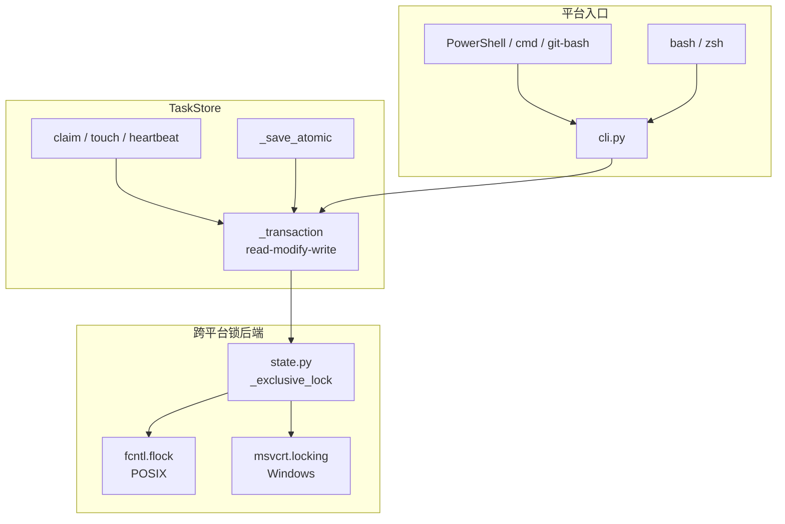
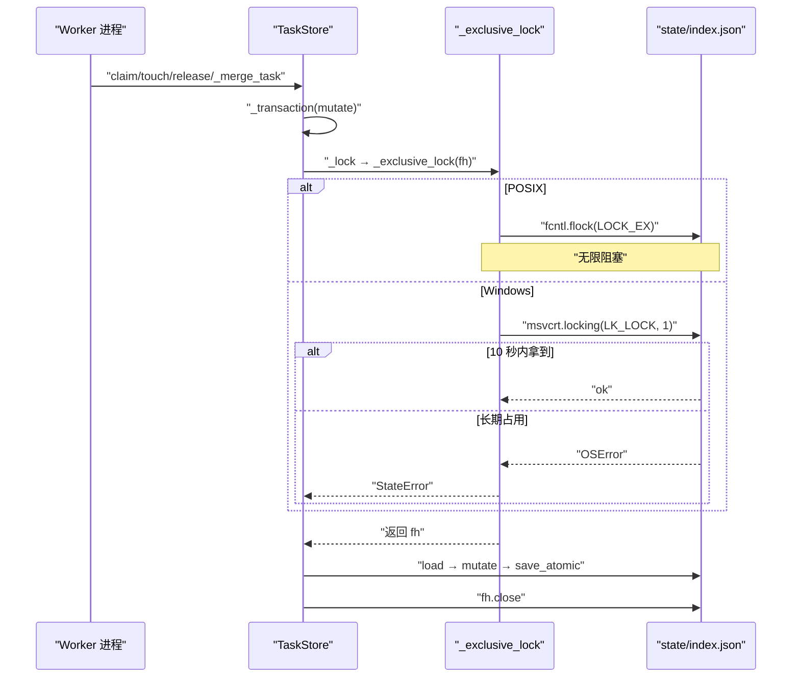
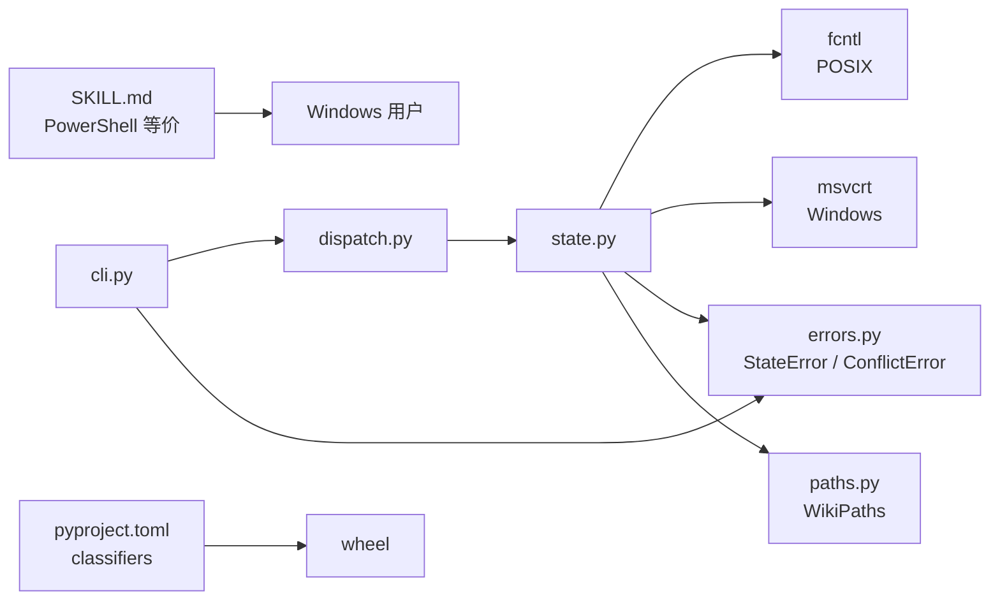

# Windows 原生支持

<cite>
**本文引用的文件**
- [docs/zh/adr/0001-windows-native-support.md](file://docs/zh/adr/0001-windows-native-support.md)
- [src/repowiki/state.py](file://src/repowiki/state.py)
- [src/repowiki/cli.py](file://src/repowiki/cli.py)
- [README.md](file://README.md)
- [pyproject.toml](file://pyproject.toml)
</cite>

## 更新摘要

**变更内容**
- 本轮触发源是 `src/repowiki/cli.py` 的顶层 `--help` 描述精简（删去 "(zero LLM, zero network)"，见 [src/repowiki/cli.py:26-29](file://src/repowiki/cli.py#L26-L29)），属自我描述调整：`cli.py` 行数与子命令结构未变，本页全部行号引用保持有效。
- Windows 相关结论不变：`msvcrt`/`fcntl` 双锁后端（`state.py` 437 行）、README 中 Windows 原生支持的承诺区间（[README.md:69-71](file://README.md#L69-L71)）与 ADR 路径（`docs/zh/adr/0001-windows-native-support.md`）均维持原样。

## 目录
1. [更新摘要](#更新摘要)
2. [简介](#简介)
3. [项目结构](#项目结构)
4. [核心组件](#核心组件)
5. [架构总览](#架构总览)
6. [详细组件分析](#详细组件分析)
7. [依赖关系分析](#依赖关系分析)
8. [性能与一致性考量](#性能与一致性考量)
9. [故障排查指南](#故障排查指南)
10. [结论](#结论)

## 简介
本页聚焦 repowiki 在 Windows 上的原生支持决策（ADR 0001）：把并发状态控制所需的「进程级互斥文件锁」按平台分派——POSIX 走 `fcntl.flock`，Windows 走 `msvcrt.locking`，两者都是 stdlib、零新增依赖、约 20 行跨平台分支。理解这条决策要抓住三个要点：为什么不是第三方库 portalocker（破坏「唯一依赖 pyyaml」的极简定位）、为什么不是用 `mkdir` 重造锁（要重写并发核心）、Windows 与 POSIX 的语义差异（`msvcrt` 抢锁约 10 秒后抛错，`fcntl` 是无限阻塞）以及对应的 `StateError` 映射。`cli.py` 与 `pyproject.toml` 的 platform classifier 共同保证 Windows 用户在 PowerShell / cmd / git-bash 下也能跑 worker 循环。

## 项目结构
与本页主题相关的目录与文件：

- `docs/zh/adr/0001-windows-native-support.md`：ADR 主文，背景、considered options、consequences。
- `src/repowiki/state.py`：`_exclusive_lock(fh)` —— 跨平台锁后端；`_retry_windows_fs` —— Windows 文件竞态短重试；`load` 与写方共用锁；`TaskStore._lock`/`_transaction`/`_save_atomic`/`claim`/`heartbeat`/`touch`/`release` 等核心方法都通过它做进程级互斥。
- `src/repowiki/cli.py`：CLI 入口；不感知平台，但错误消息需透传 `StateError`/`UsageError`/`ConflictError` 三种退出码。
- `README.md`：第 74~77 行明文声明「Windows 原生支持（无需 WSL）：并发状态控制自动使用 `msvcrt` 文件锁（POSIX 用 `fcntl`），全部功能在 PowerShell / cmd / git-bash 下可用」。
- `pyproject.toml`：`classifiers` 显式标注 `Operating System :: Microsoft :: Windows`。
- `skills/repowiki/SKILL.md`：补充 bash 惯例的 PowerShell 等价写法（`nohup … &` → `Start-Process` 等）。
- `.repowiki/state/.index.lock`：进程级互斥锁文件（state.py 的 `_lock` 创建）。

图表来源
- [src/repowiki/state.py:52-74](file://src/repowiki/state.py#L52-L74)
- [src/repowiki/state.py:100-163](file://src/repowiki/state.py#L100-L163)
- [docs/zh/adr/0001-windows-native-support.md:1-18](file://docs/zh/adr/0001-windows-native-support.md#L1-L18)

章节来源
- [docs/zh/adr/0001-windows-native-support.md:1-18](file://docs/zh/adr/0001-windows-native-support.md#L1-L18)
- [src/repowiki/state.py:1-163](file://src/repowiki/state.py#L1-L163)
- [README.md:74-77](file://README.md#L30-L32)
- [pyproject.toml:14-20](file://pyproject.toml#L14-L20)

## 核心组件
- `_exclusive_lock(fh)`（`state.py`）：进程级独占阻塞文件锁；按平台选择 stdlib 后端（`fcntl.flock` 在 POSIX，`msvcrt.locking` 在 Windows）；约 20 行实现，零新增依赖。
- `_lock(self)`（`state.py:TaskStore._lock`）：开 `state/.index.lock` 拿文件描述符并调 `_exclusive_lock`；异常时关闭 fd。
- `_transaction(mutate)`（`state.py:TaskStore._transaction`）：read-modify-write 事务模板；`_lock` 拿锁 → `load` → mutate → `_save_atomic` → `fh.close`。
- `_save_atomic(data)`（`state.py:TaskStore._save_atomic`）：写临时文件 + `os.replace` 原子替换 `index.json`；同 flock 配合避免半截 JSON。
- `claim(task_id, worker)`（`state.py:TaskStore.claim`）：原子认领；`_try_mkdir_claim` 抢占；更新 `status="in_progress"`/`worker`/`attempts+1`/`heartbeat_at`；用 `_merge_task` 走事务。
- `touch(task_id, worker)`（`state.py:TaskStore.touch`）：worker 心跳；校验 `claim_dir/worker` 与调用方一致才续期（防跨 worker 误翻）。
- `heartbeat(task_id)`（`state.py:TaskStore.heartbeat`）：底层心跳——写 `ts` 文件 + `os.utime(claim_dir)` 刷新目录 mtime（staleness 信号）+ 更新 `index.json.heartbeat_at`。
- `release(task_id, force)`（`state.py:TaskStore.release`）：原子释放；exhausted 任务需 `--force`；非本人持有的认领需 `--force`。
- `cli.py` 的 argparse（`src/repowiki/cli.py:125-142`）：统一捕获 `ConflictError`/`StateError`/`UsageError` 并以退出码 2/1/1 退出；锁失败由 `_exclusive_lock` 抛 `StateError` → CLI 转退出码 1。
- `pyproject.toml` classifiers（`pyproject.toml:14-20`）：标注 macOS / POSIX Linux / Microsoft Windows 三大平台。
- `README.md:30-32`（Windows 原生支持声明）：README 中明文承诺 PowerShell / cmd / git-bash 下可用全部功能。

章节来源
- [src/repowiki/state.py:52-74](file://src/repowiki/state.py#L52-L74)
- [src/repowiki/state.py:100-163](file://src/repowiki/state.py#L100-L163)
- [src/repowiki/state.py:269-341](file://src/repowiki/state.py#L269-L341)
- [src/repowiki/cli.py:125-142](file://src/repowiki/cli.py#L125-L142)
- [pyproject.toml:14-20](file://pyproject.toml#L14-L20)
- [README.md:74-77](file://README.md#L30-L32)

## 架构总览
repowiki 的并发安全核心是 `TaskStore._transaction`：每次写 `index.json` 都先 `_lock` 拿进程级独占锁，再读改写 + 原子落盘；读（`load`）也走同一把锁（`_transaction` 内部用 `_load_unlocked` 避免自死锁），Windows 上文件操作的 `PermissionError` 竞态由 `_retry_windows_fs` 短重试兜底。`_exclusive_lock` 是锁后端的薄壳——`try: import fcntl` 成功走 POSIX 分支（`fcntl.flock(fh, fcntl.LOCK_EX)` 无限阻塞），`except ImportError` 后 `try: import msvcrt` 走 Windows 分支（`fh.seek(0)` + `msvcrt.locking(fh.fileno(), msvcrt.LK_LOCK, 1)` 约 10 秒抢不到抛 `OSError`），两者再 `except ImportError` 才报 `UsageError`「当前解释器两者均不可用」。`claim` 路径除锁外还依赖 `_try_mkdir_claim` 的 `mkdir` 抢占与 `release`/`touch` 的认领归属校验；`watch`/`status` 端的 `stats()` 通过 `_claim_stale` + `stale_seconds`（默认 15 分钟，`REPOWIKI_STALE_SECONDS` 可调）判定过期。

图表来源
- [src/repowiki/state.py:52-74](file://src/repowiki/state.py#L52-L74)
- [src/repowiki/state.py:100-163](file://src/repowiki/state.py#L100-L163)
- [docs/zh/adr/0001-windows-native-support.md:15-18](file://docs/zh/adr/0001-windows-native-support.md#L15-L18)

章节来源
- [docs/zh/adr/0001-windows-native-support.md:1-18](file://docs/zh/adr/0001-windows-native-support.md#L1-L18)
- [src/repowiki/state.py:1-163](file://src/repowiki/state.py#L1-L163)
- [src/repowiki/state.py:245-341](file://src/repowiki/state.py#L245-L341)
- [src/repowiki/cli.py:125-142](file://src/repowiki/cli.py#L125-L142)

## 详细组件分析
### 跨平台 stdlib 锁后端的选择
- 职责：让 `index.json` 的 read-modify-write 在 Windows 上也能串行化，不依赖任何第三方库。
- 关键行为：`_exclusive_lock` 用 `try: import fcntl` 探测 POSIX；`except ImportError: try: import msvcrt` 探测 Windows；二者都 `ImportError` 时抛 `UsageError("repowiki 需要 fcntl（POSIX）或 msvcrt（Windows）支持的文件锁；当前解释器两者均不可用")`。
- 实现要点：POSIX 分支 `fcntl.flock(fh, fcntl.LOCK_EX)` 是无限阻塞；Windows 分支先 `fh.seek(0)`（msvcrt 要求文件指针在锁区域内），再 `msvcrt.locking(fh.fileno(), msvcrt.LK_LOCK, 1)` 锁 1 字节约 10 秒抢不到抛 `OSError`——映射为 `StateError("state/.index.lock 被其他进程长期占用（约 10 秒未获得锁）；请稍后重试，或确认持有锁的 repowiki 进程已退出")`；这是 Windows 与 POSIX 唯一的语义差异。
- 本次更新：Windows 防护从「写锁」扩展到「读锁 + 文件竞态重试」——`load()` 现在与写方拿同一把锁（CPython 在 Windows 打开文件不带 `FILE_SHARE_DELETE`，无锁读会让并发写方的 `os.replace` 失败），`_retry_windows_fs` 对亚毫秒级 `PermissionError` 竞态做 20 次 × 50ms 重试；跨平台差异进一步收窄。

章节来源
- [src/repowiki/state.py:52-74](file://src/repowiki/state.py#L52-L74)
- [docs/zh/adr/0001-windows-native-support.md:1-18](file://docs/zh/adr/0001-windows-native-support.md#L1-L18)

### Considered options 的取舍
- 职责：记录「为什么不用 portalocker 第三方库」「为什么不用 `mkdir` 重造锁」「为什么不再 WSL-only」三条考虑。
- 关键行为：ADR 0001 明文——portalocker API 统一但破坏「唯一依赖 pyyaml」的极简定位且离线安装文档要加物料；用 `mkdir` 重造锁要改动并发核心（事务互斥与 stale 回收推导全部重来）风险与测试成本最高；维持 WSL-only 不满足需求。结论是按平台选择 stdlib 后端，POSIX 保持 `fcntl`，Windows 用 `msvcrt.locking`（约 20 行，零新增依赖）。
- 实现要点：ADR 选择「最小可行改动」——只在 `_exclusive_lock` 一处加跨平台分支，其他 `_lock`/`_transaction`/`_save_atomic`/`claim`/`heartbeat` 全部不动；`cli.py` 也不需要 Windows-specific 子命令。

章节来源
- [docs/zh/adr/0001-windows-native-support.md:1-18](file://docs/zh/adr/0001-windows-native-support.md#L1-L18)

### 并发核心与文件锁的协同
- 职责：保证 `index.json` 的并发写不会产生半截文件或丢失更新。
- 关键行为：`TaskStore._lock` 开 `state/.index.lock`（追加模式 `a+`）拿 fd 后调 `_exclusive_lock`；`fh` 句柄在 `_transaction` 的 `finally` 中关闭；`_save_atomic` 用 `f.with_name(f".{f.name}.{uuid.uuid4().hex[:8]}.tmp")` 写临时文件 + `os.replace` 原子替换。
- 实现要点：进程级锁保证同时只有一个 worker 进程能进入 `_transaction`；`_merge_task` 只改单条任务记录，最小化 read-modify-write 窗口；这是 6×12 压测无丢更新的根本原因（DECISIONS #11）。

章节来源
- [src/repowiki/state.py:100-163](file://src/repowiki/state.py#L100-L163)
- [src/repowiki/state.py:137-163](file://src/repowiki/state.py#L137-L163)

### 认领归属校验（防跨 worker 误翻）
- 职责：在 Windows 与 POSIX 上同样防止一个 worker 误释放或续期他人持有的认领。
- 关键行为：`touch(task_id, worker)` 中 `if worker: try: held = (self._claim_dir(task_id) / "worker").read_text(...)` 然后 `if held and held != worker: raise ConflictError(...)`；`release` 类似——`held_by` 与 `task.get("worker")` 不一致且无 `--force` 抛 `ConflictError`。
- 实现要点：`claim` 时把 worker 字符串写到 `claims/<id>/worker`；release/touch 读回比对；跨平台都用 `pathlib.Path.read_text`（POSIX 用 fcntl，Windows 用 msvcrt，文件读写是 stdlib 通用能力）；OSError 容错（fs 异常返回空串）。

章节来源
- [src/repowiki/state.py:310-367](file://src/repowiki/state.py#L310-L367)

### 心跳与 staleness 信号
- 职责：让 worker 在 Windows 与 POSIX 上同样可以维持活认领、防被误抢。
- 关键行为：`heartbeat` 同时写 `claim_dir/ts` 文件 + `os.utime(claim_dir)` 刷新目录 mtime + 更新 `index.json.heartbeat_at`；`_claim_stale` 单一来源是 claim 目录 mtime（不依赖 ts 文件）。
- 实现要点：`os.utime` 在 Windows 与 POSIX 都是 stdlib；`time.time() - claim_dir.stat().st_mtime` 跨平台；默认 stale 窗口 15 分钟（`REPOWIKI_STALE_SECONDS` 可调）。

章节来源
- [src/repowiki/state.py:250-267](file://src/repowiki/state.py#L250-L267)
- [src/repowiki/state.py:343-367](file://src/repowiki/state.py#L343-L367)

### CI 矩阵与 PowerShell 等价
- 职责：让 Windows 用户在 PowerShell / cmd / git-bash 下能跑 worker 循环，且 CI 自动兜底回归。
- 关键行为：CI 矩阵覆盖 `windows-latest`（ADR 0001 明确）；`pyproject.toml` classifiers 显式标注 `Operating System :: Microsoft :: Windows`；README 第 74~77 行明文承诺「全部功能在 PowerShell / cmd / git-bash 下可用」；`skills/repowiki/SKILL.md` 补充 bash 惯例（`nohup … &`、`command -v` 等）的 PowerShell 等价写法。
- 实现要点：`run_in_background` / `Start-Process` 替代 `nohup &`；`Get-Command` 替代 `command -v`；路径用双引号包裹避免空格；CI 不需要本地开发者配 Windows，本机仍只需 macOS/Linux。

章节来源
- [docs/zh/adr/0001-windows-native-support.md:15-18](file://docs/zh/adr/0001-windows-native-support.md#L15-L18)
- [README.md:74-77](file://README.md#L30-L32)
- [pyproject.toml:14-20](file://pyproject.toml#L14-L20)

## 依赖关系分析
- `state.py` → stdlib（跨平台）：`os`/`time`/`json`/`uuid`/`datetime`/`pathlib`；其中 `fcntl` 与 `msvcrt` 在 `_exclusive_lock` 内按需懒导入——POSIX 优先。
- `state.py` → 错误层：`StateError`/`ConflictError`/`UsageError` 由 `errors.py` 暴露，被 `cli.py` 捕获并映射到退出码 1/2/1。
- `state.py` → 路径：`WikiPaths.state_dir` 与 `paths.claims_dir` 是锁与认领目录的单一来源。
- `cli.py` → `state.py`：`run_clean` 直接调 `state.run_clean`；其他命令经 `dispatch.py` 调用 `TaskStore`。
- 第三方库：无——ADR 0001 明确拒绝 portalocker，只用 stdlib。
- 平台 classifier：`pyproject.toml` 标注 macOS / Linux / Windows；README 与 SKILL.md 提供 PowerShell 等价。
- 数据契约：`state/.index.lock` 文件存在即锁文件存在；锁粒度是「进程」（同一时刻只有一个 repowiki 进程能进入 `_transaction`）；锁语义是「单机阻塞独占」（与 repowiki 单机部署模型一致）。

图表来源
- [src/repowiki/state.py:52-74](file://src/repowiki/state.py#L52-L74)
- [src/repowiki/cli.py:13-22](file://src/repowiki/cli.py#L13-L22)
- [pyproject.toml:14-20](file://pyproject.toml#L14-L20)

章节来源
- [docs/zh/adr/0001-windows-native-support.md:1-18](file://docs/zh/adr/0001-windows-native-support.md#L1-L18)
- [src/repowiki/state.py:1-163](file://src/repowiki/state.py#L1-L163)
- [src/repowiki/cli.py:1-142](file://src/repowiki/cli.py#L1-L142)
- [pyproject.toml:1-36](file://pyproject.toml#L1-L36)
- [README.md:74-77](file://README.md#L30-L32)

## 性能与一致性考量
- 零新增依赖：跨平台锁后端只用 stdlib（`fcntl`/`msvcrt`/`os`/`time`），不引入 portalocker；保留「唯一依赖 pyyaml」的极简定位。
- 单一代码路径：`claim`/`touch`/`heartbeat`/`release`/`_save_atomic`/`_merge_task` 不感知平台；只有 `_exclusive_lock` 一处分叉；其他并发语义在 Windows / POSIX 完全一致。
- 语义差异显式化：`msvcrt` 抢锁 10 秒抛错映射为 `StateError` 给出明确提示；`fcntl` 无限阻塞不抛错——两个后端的唯一差异在错误路径，不影响正常路径。
- 锁粒度：进程级（同一进程同一时刻只能有一个 `_transaction`）；不锁单条任务——lock + read-modify-write 整体原子化足以保证一致性。
- 原子落盘：`_save_atomic` 用 `tmp + os.replace` 避免半截 JSON；与文件锁共同保证 read-modify-write 一致。
- mtime 单一来源：`os.utime(claim_dir)` 刷新目录 mtime 作 staleness 信号；`ts` 文件与 `heartbeat_at` 都是冗余备份——任何单点失效不影响判定。
- CI 回归兜底：`windows-latest` 纳入 CI 矩阵；本机开发仍只需 macOS/Linux。
- 离线安装：`pip install` 在 Windows 上从 PyPI 拉 `pyyaml` wheel（按平台/Python 版本互不通用）；`repowiki` 本体零依赖跨平台一致。
- 错误捕获：`UsageError`/`StateError`/`ConflictError` 三类异常在 `cli.py:main` 中集中捕获并以退出码 1/1/2 退出，便于 Windows 脚本（PowerShell/cmd/batch）判断结果。
- 文件锁文件固定位置：`state/.index.lock` 与 `index.json` 同目录，便于定位与排查；锁失败时提示「请确认持有锁的 repowiki 进程已退出」。

章节来源
- [src/repowiki/state.py:35-163](file://src/repowiki/state.py#L35-L163)
- [docs/zh/adr/0001-windows-native-support.md:1-18](file://docs/zh/adr/0001-windows-native-support.md#L1-L18)
- [README.md:74-77](file://README.md#L30-L32)

## 故障排查指南
- 现象：`state/.index.lock 被其他进程长期占用（约 10 秒未获得锁）；请稍后重试，或确认持有锁的 repowiki 进程已退出`。成因：Windows 上 `msvcrt.locking(LK_LOCK, 1)` 抢锁约 10 秒仍失败（POSIX 上 `fcntl.flock` 无限阻塞不会抛错）。解决：先确认没有其他 repowiki 进程在跑（任务管理器 / `Get-Process repowiki`）；确认无误后可手动删除 `state/.index.lock`（通常不需要）。
- 现象：`repowiki 需要 fcntl（POSIX）或 msvcrt（Windows）支持的文件锁；当前解释器两者均不可用`。成因：罕见——某些精简 Python 解释器（如 musl 静态构建版）同时缺 `fcntl` 与 `msvcrt`。解决：换标准 CPython 3.10+ 安装。
- 现象：Windows 上读写 `index.json` 偶发 `PermissionError`。成因：CPython 打开文件不带 `FILE_SHARE_DELETE`，`os.replace` 换入新索引与另一进程的读句柄竞态。解决：新版已双重防护——`load()` 与写方共用锁、文件操作带 `_retry_windows_fs` 短重试；若仍复现，排查是否有编辑器/杀毒软件长期锁住该文件。
- 现象：Windows 上 worker 进程死亡后遗留认领冻结队列。成因：与 POSIX 共有的问题——`_try_mkdir_claim` 的抢占路径与 stale 判定统一（`ready_tasks` 纳入过期 in_progress 任务，`next --claim` 走既有抢占路径自动回收）。解决：等 15 分钟（默认 stale 窗口）后其他 worker 重新领取；或手动 `repowiki release --task ID --force`。
- 现象：PowerShell 后台运行 `claude -p ... &` 报「命令找不到」。成因：`&` 在 PowerShell 是调用操作符而非后台。解决：使用 `Start-Process -NoNewWindow claude -ArgumentList '-p', '<spec>'`；SKILL.md 给出完整等价写法。
- 现象：Windows 路径含空格被截断。成因：CLI 参数解析对带空格的路径处理需双引号包裹。解决：始终用双引号包裹路径，例如 `repowiki plan "C:\My Code\repo"`。
- 现象：CI 在 `windows-latest` 上偶发锁失败。成因：`msvcrt` 在高并发下偶发抢锁超时。解决：ADR 0001 已说明这是预期行为——重试即可；若是常规 CI 失败需要排查是否有僵尸 repowiki 进程。
- 现象：`pyyaml` 在 Windows 上安装失败。成因：wheel 与平台/Python 版本不匹配。解决：用 `pip download PyYAML==6.* -d wheels/` 在同平台准备；或 `pip install --no-index wheels/PyYAML-*.whl` 离线安装（README 离线安装章节）。
- 现象：`file://` 链接在 Windows 浏览器中无法点击。成因：与本主题无直接关系，但 Windows + `file://` 协议需浏览器允许。解决：用 `repowiki site` 生成单文件 HTML 后右键「在浏览器中打开」。
- 现象：`git diff` 在 Windows 上路径分隔符混乱。成因：`run_git` 拿到的是 git 输出的 POSIX 风格路径。解决：不要在 Windows 上把 git 输出与 Python `pathlib.Path` 混用——`run_git` 已经做过隐式处理（统一为 `/`）。

章节来源
- [src/repowiki/state.py:52-74](file://src/repowiki/state.py#L52-L74)
- [docs/zh/adr/0001-windows-native-support.md:1-18](file://docs/zh/adr/0001-windows-native-support.md#L1-L18)
- [README.md:55-100](file://README.md#L30-L70)
- [src/repowiki/cli.py:125-142](file://src/repowiki/cli.py#L125-L142)
- [src/repowiki/gitutil.py:1-19](file://src/repowiki/gitutil.py#L1-L19)

## 结论
Windows 原生支持通过 ADR 0001 落地为 `_exclusive_lock` 一个函数的 stdlib 分支：POSIX 用 `fcntl.flock`（无限阻塞），Windows 用 `msvcrt.locking`（10 秒超时映射为 `StateError`），整个跨平台改动约 20 行、零新增依赖。理解这条决策要把握三个要点——选择 stdlib 而非 portalocker（保留极简定位与离线安装简单性）、选择 stdlib 而非 `mkdir` 重造锁（避免重写并发核心）、Windows 与 POSIX 语义差异仅在错误路径（`msvcrt` 抢锁失败抛 `StateError`）。正确使用方式是：Windows 用户在 PowerShell / cmd / git-bash 下用 `pip install` 装 repowiki 与 pyyaml；多 worker 循环时把 bash 习惯的 `nohup … &` 换成 `Start-Process`；遇到锁失败先确认无僵尸进程再重试。CI 在 `windows-latest` 上自动兜底回归。**已更新**：Windows 防护新增读锁统一与 `_retry_windows_fs` 文件竞态重试，跨平台差异进一步收窄。

章节来源
- [docs/zh/adr/0001-windows-native-support.md:1-18](file://docs/zh/adr/0001-windows-native-support.md#L1-L18)
- [src/repowiki/state.py:1-163](file://src/repowiki/state.py#L1-L163)
- [src/repowiki/cli.py:1-142](file://src/repowiki/cli.py#L1-L142)
- [README.md:55-100](file://README.md#L30-L70)
- [pyproject.toml:1-36](file://pyproject.toml#L1-L36)
