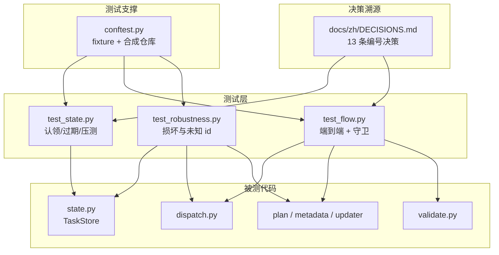
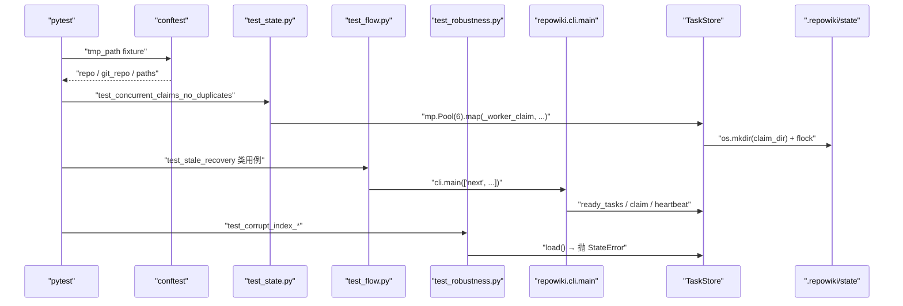
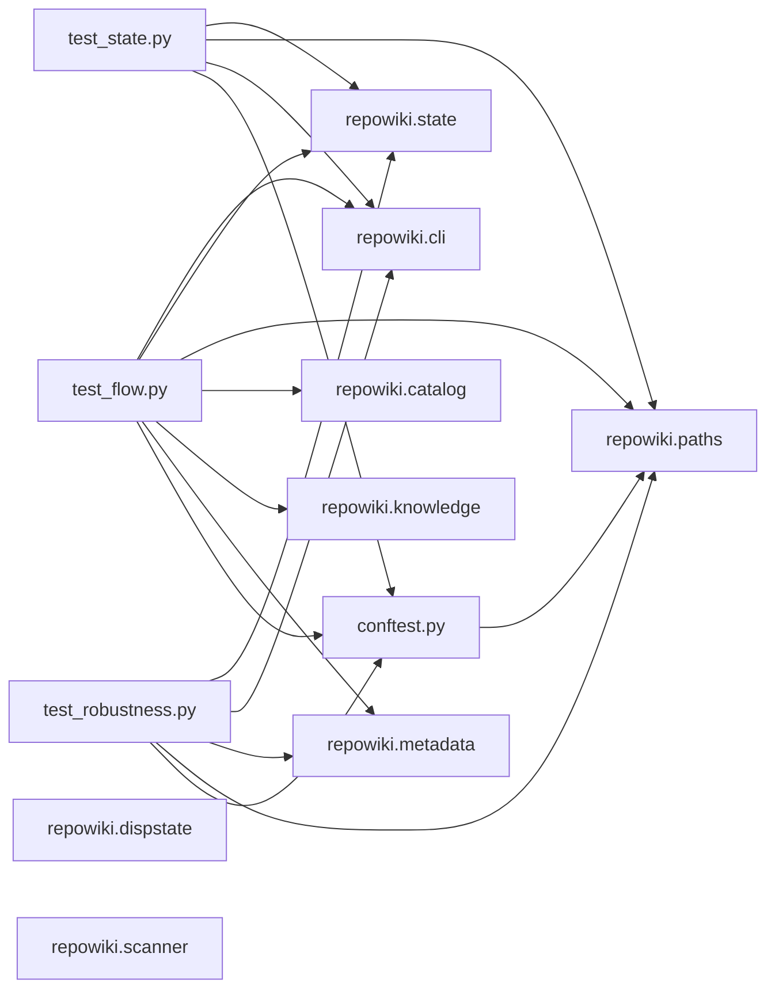

# 并发安全与生命周期测试

<cite>
**本文引用的文件**
- [tests/test_flow.py](file://tests/test_flow.py)
- [tests/test_state.py](file://tests/test_state.py)
- [tests/test_robustness.py](file://tests/test_robustness.py)
- [tests/conftest.py](file://tests/conftest.py)
- [docs/zh/DECISIONS.md](file://docs/zh/DECISIONS.md)
</cite>

## 更新摘要

**变更内容**
- `test_flow.py` 现 530 行、`test_robustness.py` 现 148 行：测试内文件读写统一显式 `encoding="utf-8"`（消除 Windows 默认编码伪失败）；`test_robustness.py` 加固「双锁后端均不可用」测试（POSIX 与 Windows 都须友好 `UsageError` 而非 traceback）。
- `state.py` 本次变更（`load` 读锁统一 + Windows `_retry_windows_fs` 重试）不改变并发测试的语义，但相关行号引用整体后移（`load` 由 83-98 移至 100-116，stats 由 370-377 移至 385-419）；`dispatch.py` 的 watch 停滞新鲜复查同步纳入（文件现 392 行）。
- 修正 `DECISIONS.md` 引用路径：文档集中化后迁至 `docs/zh/DECISIONS.md`（现 54 行）。

## 目录
1. [更新摘要](#更新摘要)
2. [简介](#简介)
3. [项目结构](#项目结构)
4. [核心组件](#核心组件)
5. [架构总览](#架构总览)
6. [详细组件分析](#详细组件分析)
7. [依赖关系分析](#依赖关系分析)
8. [性能与一致性考量](#性能与一致性考量)
9. [故障排查指南](#故障排查指南)
10. [结论](#结论)

## 简介
「并发安全与生命周期测试」聚焦 `tests/` 下三套端到端测试与 `DECISIONS.md` 中编号决策的对应关系：`test_state.py` 用单测+多进程压测验证 `TaskStore` 的原子认领与过期回收；`test_flow.py` 用 CLI 完整闭环跑 plan→next→check→finalize→update→clean 并暴露真实回归场景；`test_robustness.py` 验证损坏状态文件与未知 task id 的友好报错；`conftest.py` 提供合成仓库与 `valid_page` 模板；`docs/zh/DECISIONS.md` 把 13 条决策的发现过程与对应测试用例锚定。本节把这些场景与「T5 busy 信号、T9 模板替换、stale 抢占、6×12 压测下的 flock TOCTOU、40 页并发实战回收」等关键事件一一对应，呈现 repowiki 在并发与生命周期层面「先出问题、再写测试、最后落到决策」的设计演化。

## 项目结构
围绕测试这条主线，仓库内相关的产物集中在以下几个位置（路径相对仓库根）：

- `tests/test_state.py`：149 行；测试 `TaskStore.claim / release / ready_tasks / stats`，含多进程压测。
- `tests/test_flow.py`：530 行；按 `TestPlan / TestNext / TestCheckLoop / TestFinalize / TestUpdate / TestKnowledge / TestCleanup / TestLifecycleGuards / TestStaleRecovery / TestP1Guards / TestWatch` 分组。
- `tests/test_robustness.py`：148 行；覆盖 `state/index.json`、`state/catalog.json` 损坏、未注册 fcntl / msvcrt 等健壮性场景。
- `tests/conftest.py`：200 行；`FILES` 字典合成仓库、`repo / git_repo / paths` fixture、`valid_catalog / valid_page / write_catalog` 工具。
- `docs/zh/DECISIONS.md`：54 行；13 条编号决策，每条对应一个或多个测试用例。
- `pyproject.toml:34-36`：`pytest` 配置，`testpaths = ["tests"]`、`addopts = "-q"`。

图表来源
- [tests/test_state.py:1-22](file://tests/test_state.py#L1-L22)
- [tests/test_flow.py:25-60](file://tests/test_flow.py#L25-L60)
- [docs/zh/DECISIONS.md:1-47](file://docs/zh/DECISIONS.md#L1-L47)

章节来源
- [tests/test_state.py:1-50](file://tests/test_state.py#L1-L50)
- [tests/test_flow.py:1-50](file://tests/test_flow.py#L1-L50)
- [tests/test_robustness.py:1-50](file://tests/test_robustness.py#L1-L50)
- [tests/conftest.py:1-50](file://tests/conftest.py#L1-L50)
- [docs/zh/DECISIONS.md:1-47](file://docs/zh/DECISIONS.md#L1-L47)

## 核心组件
- `test_state.py`：`claim_and_conflict / release / stale_claim_reclaimed / ready_includes_stale_in_progress / fresh_claim_not_ready / missing_claim_dir_is_stale / phase_gating / failed_task_is_reclaimable` + `_worker_claim` + `test_concurrent_claims_no_duplicates` 多进程压测。
- `test_flow.py`：以 `cli.main(argv)` 调用跑完整 CLI 命令，覆盖 plan / next / check / finalize / update / knowledge / clean；`TestLifecycleGuards` 集中放守卫回归；`TestStaleRecovery` 与 `TestP1Guards` 针对实战回归。
- `test_robustness.py`：`_corrupt_index(paths, raw)` 工具函数 + 一组「损坏状态文件 / 未知 id / 缺文件锁后端」场景，断言必须抛 `StateError / UsageError` 而非 traceback。
- `conftest.py`：`FILES`（13 个文件的合成模板）、`make_repo(git=False/True)`、`repo / git_repo / paths` fixture、`valid_catalog`（含两个章节）、`valid_page(title)`（按 STYLE 规范的整页模板）、`write_catalog(paths, catalog)`。
- `docs/zh/DECISIONS.md`：13 条编号决策；T5 / T9 / 6×12 / 40 页并发等关键事件在每条决策的描述里点名。

章节来源
- [tests/test_state.py:1-100](file://tests/test_state.py#L1-L100)
- [tests/test_flow.py:1-100](file://tests/test_flow.py#L1-L100)
- [tests/test_robustness.py:1-50](file://tests/test_robustness.py#L1-L50)
- [tests/conftest.py:1-100](file://tests/conftest.py#L1-L100)
- [docs/zh/DECISIONS.md:1-47](file://docs/zh/DECISIONS.md#L1-L47)

## 架构总览
从测试视角看，repowiki 的并发安全测试分三层：单测层（`test_state.py`）直接调用 `TaskStore` 方法，验证认领 / 过期 / 阶段门控；端到端层（`test_flow.py`）通过 `cli.main()` 跑真实 CLI，覆盖 plan→check→finalize→update 全链路；健壮性层（`test_robustness.py`）注入损坏状态文件，验证错误信息而非 traceback。每条测试都用 `conftest.py` 提供的合成仓库与 fixture 隔离环境，`decisions.md` 把测试发现的 bug 与最终决策串成「事件 → 修复 → 守卫生效」的闭环。下图给出一个典型测试运行时的调用链。

图表来源
- [tests/test_state.py:141-149](file://tests/test_state.py#L141-L149)
- [tests/test_flow.py:398-447](file://tests/test_flow.py#L398-L447)
- [tests/test_robustness.py:31-50](file://tests/test_robustness.py#L31-L50)

章节来源
- [tests/test_state.py:1-149](file://tests/test_state.py#L1-L149)
- [tests/test_flow.py:1-100](file://tests/test_flow.py#L1-L100)
- [tests/test_robustness.py:1-50](file://tests/test_robustness.py#L1-L50)

## 详细组件分析

### T5 busy 信号：worker 在他人执行中不提前退出
- 职责：让 `next` 返回 `busy` 字段，驱动 worker 在「空但 busy>0」时等待重试而非退出。
- 关键行为：DECISIONS #2 描述「规格只说『无任务退出』，会造成 worker 在他人执行中时提前退出、后续任务无人接手（T5 竞态单测暴露）」。`test_flow.py` 中 `run("next", str(repo), "--json")` 验证返回 dict 有 `busy` 键；`test_busy_excludes_stale` 在过期认领下断言 `out["busy"] == 0`，防止过期认领污染 busy 统计。
- 实现要点：`dispatch.run_next` 在 `emit` 时把 `stats["busy"]` 透传给调用方（`dispatch.py:67-72`）；`TaskStore.stats` 用 `stale_ids = {s["id"] for s in stats["stale_claims"]}` 把过期认领从 in_flight 计数中剔除（`state.py:385-419`）。

章节来源
- [docs/zh/DECISIONS.md:7-9](file://docs/zh/DECISIONS.md#L7-L9)
- [tests/test_flow.py:418-427](file://tests/test_flow.py#L418-L427)

### T9 模板替换：占位符预渲染
- 职责：避免驱动 agent 忘记把 `TITLE` 占位符替换为真实标题。
- 关键行为：DECISIONS #4 描述「page 任务规格内嵌的页面模板中 TITLE 先渲染为真实标题，避免 agent 忘记替换（T9 冒烟暴露）」。`templates.render_file` 在 `tasks.build_*` 阶段一次性把 TITLE 等占位符填好。
- 实现要点：模板内的 TITLE 占位符是大写字母开头、符合 `_PLACEHOLDER_RE = re.compile(r"\{\{[A-Z][A-Z0-9_]*\}\}")` 的占位符——`render` 在替换时保留未知占位符供 validator 检测；validator 在 `check_page` 里同样用 `_PLACEHOLDER_RE.search` 检测产物是否漏替换。

章节来源
- [docs/zh/DECISIONS.md:12-13](file://docs/zh/DECISIONS.md#L12-L13)
- [src/repowiki/templates.py:29-38](file://src/repowiki/templates.py#L29-L38)
- [src/repowiki/validate.py:82-84](file://src/repowiki/validate.py#L82-L84)

### Stale 抢占：死 worker 自动复活
- 职责：worker 死亡后遗留在认领目录的任务能在下一轮 `next --claim` 中被新 worker 抢走。
- 关键行为：`test_stale_claim_reclaimed`（`test_state.py:47-58`）模拟死 worker：用 `os.utime(cd, (old, old))` 把认领目录 mtime 倒推到 999 秒前，让 `_claim_stale` 返回 True，再让另一个 `TaskStore` 实例 `claim("t00", "w2")`；断言 `task["worker"] == "w2"` 且 `task["attempts"] == 2`（首次失败 + 二次抢占）。`test_next_reclaims_orphaned_claim`（`test_flow.py:402-415`）走 CLI 完整路径，断言 `WikiPaths(repo).claims_dir.glob(".stale-*")` 留有 `.stale-*` 痕迹。
- 实现要点：`_try_mkdir_claim` 在目录存在且 `claim_stale` 为真时把目录 rename 为 `.stale-<tid>-<uuid6>` 留痕后重试 `mkdir`（`state.py:269-292`）；`ready_tasks` 把 `in_progress and claim_stale` 也纳入候选集（`state.py:219-243`）。

**章节来源**
- [tests/test_state.py:47-76](file://tests/test_state.py#L47-L76)
- [tests/test_flow.py:403-416](file://tests/test_flow.py#L403-L416)
- [src/repowiki/state.py:247-308](file://src/repowiki/state.py#L247-L308)

### 6×12 压测：flock TOCTOU 修复
- 职责：用 6 进程并发跑 12 个状态翻转，验证 `flock` 串行化下不丢更新。
- 关键行为：`test_index_transaction_no_lost_updates`（`test_flow.py:484-496`）用 `mp.Pool(processes=6)` 对 12 个独立任务并发调 `_flip_done`（`update(tid, status="done")`）；断言 `sum(1 for t in data.values() if t["status"] == "done") == 12`。DECISIONS #11 提到「mtime 复查有 TOCTOU 窗口，6×12 压测丢 3 次更新」——修复是 `index.json` 用 flock 串行化读改写。
- 实现要点：`TaskStore._transaction(mutate)` 用 `_exclusive_lock`（POSIX `fcntl.flock`、Windows `msvcrt.locking`）拿 `state/.index.lock`，单次 `_load → mutate → _save_atomic` 全程持锁；`_merge_task` 只写单个任务，缩小读改写窗口。

**章节来源**
- [tests/test_flow.py:393-396](file://tests/test_flow.py#L393-L396)
- [tests/test_flow.py:484-496](file://tests/test_flow.py#L484-L496)
- [docs/zh/DECISIONS.md:29-35](file://docs/zh/DECISIONS.md#L29-L35)
- [src/repowiki/state.py:100-163](file://src/repowiki/state.py#L100-L163)

### 40 页并发实战：孤儿认领自动回收
- 职责：实战中 40 页并发生成、一个 worker 退出后遗留 15 个认领冻结队列——修复后无需人工 `release --force`。
- 关键行为：DECISIONS #12 详述事件原委与修复：`_try_mkdir_claim` 的抢占路径「经 CLI 不可达——`ready_tasks` 完全排除 in_progress」，修复后 `ready_tasks` 纳入「in_progress 且认领过期」的任务、`next --claim` 走既有抢占路径自动回收（`.stale-*` 留痕、`attempts+1`、毒任务上限照常生效）。`test_next_reclaims_orphaned_claim` 与 `test_concurrent_claims_no_duplicates`（`test_state.py:141-149`）共同守护该回归。
- 实现要点：stale 判定统一为 claim 目录 mtime 单一来源（`state.py:250-267`），原 `stats()` 基于 `index.heartbeat_at` 的第二套判定废弃；watch 的 in_flight 同步排除过期认领（`dispatch.py:148-154`）；默认 stale 窗口从 45 → 15 分钟（在 DECISIONS #12 末尾提到）。

**章节来源**
- [docs/zh/DECISIONS.md:36-43](file://docs/zh/DECISIONS.md#L36-L43)
- [tests/test_state.py:141-149](file://tests/test_state.py#L141-L149)
- [tests/test_flow.py:398-447](file://tests/test_flow.py#L398-L447)
- [src/repowiki/state.py:213-230](file://src/repowiki/state.py#L213-L230)

### 生命周期守卫（P0/P1 评审修复）
- 职责：把实战 / 评审中发现的 7 类生命周期风险显式落到守卫测试。
- 关键行为：`TestLifecycleGuards`（`test_flow.py:324-388`）覆盖：
  - `test_check_requires_selector`：缺 `--task`/`--all` 必须 exit 1。
  - `test_check_done_is_readonly`：done 状态 source file 被删，`check` 不改 status。
  - `test_touch_refreshes_claim`：touch 刷新认领目录 mtime；用 `--worker other` touch 别人任务必须 exit 2。
  - `test_poison_task_exhausts_and_reset`：attempt 达上限 → exhausted；非 `--force` 的 release 必须 exit 2；`--force` 重置 attempts=0。
  - `test_check_refuses_foreign_claim`：他人 `--worker` 调 check 必须 exit 2；`--force` 才能代为校验。
  - `test_check_all_still_works`：`--all` 模式下没有 in_progress/failed 时正常 exit 0。
- 实现要点：每条守卫都是「必败路径 + 必胜路径」成对出现，确保修复不被无意中破坏。DECISIONS #11 与 #12 是这些守卫的设计依据。

**章节来源**
- [tests/test_flow.py:325-396](file://tests/test_flow.py#L325-L396)
- [docs/zh/DECISIONS.md:29-35](file://docs/zh/DECISIONS.md#L29-L35)

### 健壮性：损坏状态文件不静默清空
- 职责：损坏的 `state/index.json` 与 `state/catalog.json` 必须抛 `StateError / UsageError`，且不修改原文件。
- 关键行为：`test_corrupt_index_raises_state_error` 把 `state/index.json` 写成 `{ not json`；`TaskStore.load()` 抛 `StateError` 且文件保持原样（`test_robustness.py:31-39`）。`test_corrupt_index_next_fails_cleanly` 走 CLI 验证返回 JSON `{"error": "state_corrupt"}` 且 exit 1。`test_replan_force_recovers_from_corrupt_index` 验证 `plan --replan --force` 能从损坏恢复。
- 实现要点：`TaskStore.load` 在 `json.JSONDecodeError` 时抛 `StateError`，绝不静默重置（`state.py:127-135`）；`cli.main` 把 `StateError / UsageError` 映射为 exit 1，错误信息通过 `output.emit_error` 同时支持 JSON 与人类可读文本。

**章节来源**
- [tests/test_robustness.py:31-65](file://tests/test_robustness.py#L31-L65)
- [src/repowiki/state.py:100-116](file://src/repowiki/state.py#L100-L116)

### Watch 不假活：过期认领从 in_flight 中剔除
- 职责：`watch` 阻塞监控时不能让过期认领污染 in_flight 计数，否则全员死亡时永远走不到 stalled 分支。
- 关键行为：`test_watch_stale_claim_does_not_hide_stall`（`test_flow.py:428-445`）：构造一个 exhausted 阶段 1 任务 + 一个过期阶段 2 认领；`watch --interval 0.05 --timeout 1 --json` 必须 exit 1 且 `reason == "stalled"`。`test_watch_exits_zero_when_all_done` / `test_watch_stall_exits_one` / `test_watch_timeout_exits_one` / `test_watch_empty_manifest`（`test_flow.py:505-528`）覆盖 watch 的四类退出。
- 实现要点：`run_watch` 用 `stale_ids = {s["id"] for s in stats["stale_claims"]}` 显式剔除（`dispatch.py:148`）；stalled 判断为「无 in_flight 且无 ready」并返回 `reason="stalled"`——宣布停滞前先用新鲜 `store.stats()` 复查一次，任务恰好在快照间隙全部完成时按 completed 退出（exit 0），避免假停滞误报（`dispatch.py:174-191`）。

**章节来源**
- [tests/test_flow.py:429-447](file://tests/test_flow.py#L429-L447)
- [tests/test_flow.py:506-530](file://tests/test_flow.py#L506-L530)
- [src/repowiki/dispatch.py:126-199](file://src/repowiki/dispatch.py#L126-L199)

## 依赖关系分析
- 测试模块 import：`repowiki.cli`（main / ConflictError / StateError / UsageError）、`repowiki.paths.WikiPaths`、`repowiki.state.TaskStore / new_task`、`repowiki.catalog.flatten`、`repowiki.metadata._require_catalog`、`repowiki.dispatch._check_one`、`repowiki.scanner.scan`、`repowiki.knowledge.aggregate_knowledge`。
- 测试 fixture 互相依赖：`repo` → `paths`（`WikiPaths(repo)`）；`git_repo` 走 `make_repo(git=True)` 跑 `git init / add / commit`；`TestStaleRecovery / TestP1Guards / TestWatch` 直接构造 `TaskStore`。
- `conftest.valid_catalog` 是 `TestPlan / TestCheckLoop / TestFinalize / TestUpdate / TestCleanup` 的共用 fixture；`valid_page(title)` 是产出页的工厂函数，所有 `*write_text(valid_page(n.title))` 都走它。
- 唯一测试第三方依赖：`pytest>=8`（来自 `pyproject.toml:23` 的 `[test] extra`）。

图表来源
- [tests/test_state.py:12-14](file://tests/test_state.py#L12-L14)
- [tests/test_flow.py:14-17](file://tests/test_flow.py#L14-L17)
- [tests/test_robustness.py:13-17](file://tests/test_robustness.py#L13-L17)

章节来源
- [tests/test_state.py:1-149](file://tests/test_state.py#L1-L149)
- [tests/test_flow.py:1-530](file://tests/test_flow.py#L1-L530)
- [tests/test_robustness.py:1-148](file://tests/test_robustness.py#L1-L148)
- [tests/conftest.py:1-200](file://tests/conftest.py#L1-L200)

## 性能与一致性考量
- 多进程压测规模：`test_concurrent_claims_no_duplicates` 用 6 worker 抢 30 任务；`test_index_transaction_no_lost_updates` 用 6 worker 翻转 12 任务。规模不大但足以在常规 CI 上跑出真实竞态。
- CI 矩阵：`README.md:197` 提到 CI 矩阵覆盖 ubuntu/macos/windows × Python 3.10-3.13——这意味着 `fcntl` 与 `msvcrt` 两条锁路径都被实际测试覆盖；`test_missing_lock_backends_reports_usage_error`（`test_robustness.py:88-93`）额外验证「两个都不可用时必须抛 UsageError」而非 traceback。
- Watch 阻塞：`test_watch_*` 用 `--interval 0.05`（50ms）让 watch 轮询跑得快，CI 上不至于超时；`--timeout 1` 让 stalled / timeout 分支在 1 秒内跑完。
- 合成仓库成本：`FILES` 字典约 1 KB 文本，`make_repo` 写 13 个文件耗时 < 100ms，可被 `pytest` 频繁触发而不影响整体 CI 时长。
- 决策溯源：`docs/zh/DECISIONS.md` 每条决策都显式关联到具体测试与事件（如「T5 竞态单测暴露」「T9 冒烟暴露」「6×12 压测丢 3 次更新」「40 页并发实战」），让任何新增回归测试都能挂到一条既有决策上——这本身就是测试套件的可追溯性设计。
- 测试并行：`mp.Pool` 触发的是 OS 级并行，pytest 自身默认串行；规模选择 6 是 macOS 常见核心数与 CI 默认并行的折中。
- 显式 UTF-8：`test_flow.py` / `test_robustness.py` 的文件读写统一补齐 `encoding="utf-8"`（本次更新），Windows 默认 ANSI 代码页下读中文 fixture 不再伪失败。

章节来源
- [tests/test_state.py:141-149](file://tests/test_state.py#L141-L149)
- [tests/test_flow.py:484-530](file://tests/test_flow.py#L484-L530)
- [tests/test_robustness.py:89-96](file://tests/test_robustness.py#L89-L96)
- [README.md:195-197](file://README.md#L195-L197)
- [docs/zh/DECISIONS.md:1-47](file://docs/zh/DECISIONS.md#L1-L47)

## 故障排查指南
- CI 偶发失败但本地通过：很可能是「认领目录 mtime 受文件系统挂载选项影响」；在 CI 上跑 `pytest -k test_stale -v` 单独验证；若失败说明 stale 窗口需要调大或文件系统时区不一致。
- 多进程压测丢更新：99% 是 `_transaction` 之外的代码直接写 `index.json`；全仓 `grep -n "index_file.write_text" src/repowiki/` 应只有 `_save_atomic` 一处。
- `test_missing_lock_backends_reports_usage_error` 在 CI 上失败：检查解释器是否带 `fcntl`（Linux/macOS）/`msvcrt`（Windows）支持；自定义 Python 构建可能缺标准库模块。
- watch 在测试中超时而非 stalled：`test_watch_stall_exits_one` 默认 10 秒超时，`test_watch_stale_claim_does_not_hide_stall` 用 1 秒；CI 慢盘可能让 `--timeout` 调小一些。
- check 报 `force required`：跨 worker 误触发的认领守卫（`run_check` 的 `_claim_dir / worker` 读取）；定位方式——先 `repowiki status` 看持有者，再决定等过期回收或 `--force` 代为校验。
- `test_unknown_task_id_touch_and_release_fail_cleanly` 失败：可能是 `TaskStore._require_task` 的 `UsageError("任务不存在: ...")` 文案改了；同步 `tests/test_robustness.py:82` 的断言字符串。
- `test_corrupt_index_*` 失败：可能是 `StateError` 的文案改了导致 `capsys.readouterr().err` 不再含「state/index.json 损坏」字样；同步 `test_robustness.py:54` 的断言字符串。
- CI 上 `test_index_transaction_no_lost_updates` 偶发失败：CI 虚拟化层时间片极小时 flock 释放窗口不稳定；可调大任务数让失败更稳定，或加 `time.sleep(0.001)` 让 flock 锁有显式等待。

章节来源
- [tests/test_state.py:1-149](file://tests/test_state.py#L1-L149)
- [tests/test_flow.py:1-530](file://tests/test_flow.py#L1-L530)
- [tests/test_robustness.py:1-148](file://tests/test_robustness.py#L1-L148)
- [docs/zh/DECISIONS.md:29-35](file://docs/zh/DECISIONS.md#L29-L35)

## 结论
「并发安全与生命周期测试」是 repowiki 可靠性设计的实物档案——每条测试都对应一条决策、每个决策都对应一个曾经发生过的真实事件。`test_state.py` 与 `test_flow.py` 共同守护 T5 busy、T9 模板、stale 抢占、6×12 flock TOCTOU、40 页并发实战五大回归；`test_robustness.py` 确保损坏状态文件不静默清空；`TestLifecycleGuards` 把 7 类生命周期风险固化为「必败 + 必胜」对子测试；`DECISIONS.md` 把这一切串成可追溯的决策链。对于想要扩展并发能力或新增生命周期的开发者，最自然的接入点是先写一个能复现 bug 的测试，再把它挂到 `docs/zh/DECISIONS.md` 的某条决策末尾——这是 repowiki 把「先出问题、再写测试、最后落到决策」固化为流程的方式。

章节来源
- [tests/test_state.py:1-149](file://tests/test_state.py#L1-L149)
- [tests/test_flow.py:1-530](file://tests/test_flow.py#L1-L530)
- [tests/test_robustness.py:1-148](file://tests/test_robustness.py#L1-L148)
- [tests/conftest.py:1-200](file://tests/conftest.py#L1-L200)
- [docs/zh/DECISIONS.md:1-47](file://docs/zh/DECISIONS.md#L1-L47)