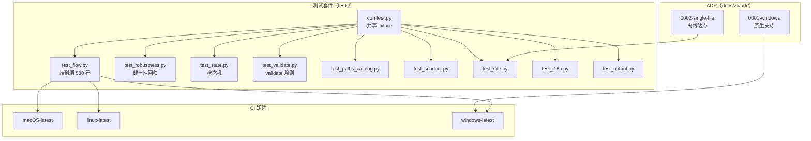
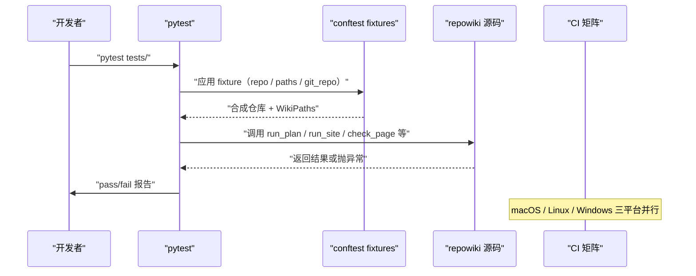
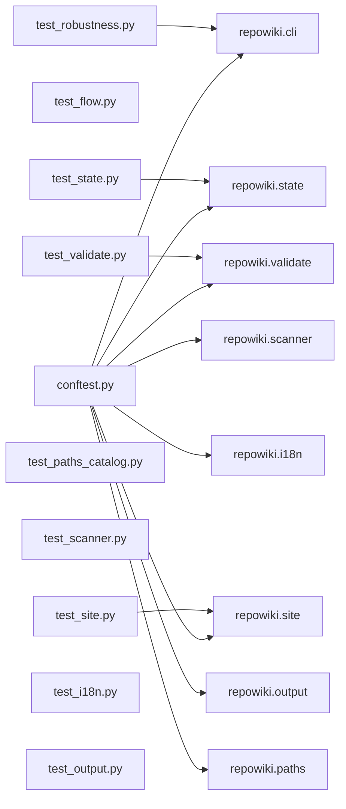

# 测试与跨平台支持

<cite>
**本文引用的文件**
- [tests/conftest.py](file://tests/conftest.py)
- [tests/test_flow.py](file://tests/test_flow.py)
- [tests/test_robustness.py](file://tests/test_robustness.py)
- [tests/test_state.py](file://tests/test_state.py)
- [tests/test_validate.py](file://tests/test_validate.py)
- [tests/test_scanner.py](file://tests/test_scanner.py)
- [tests/test_site.py](file://tests/test_site.py)
- [tests/test_i18n.py](file://tests/test_i18n.py)
- [docs/zh/adr/0001-windows-native-support.md](file://docs/zh/adr/0001-windows-native-support.md)
- [docs/zh/adr/0002-single-file-offline-site.md](file://docs/zh/adr/0002-single-file-offline-site.md)
- [src/repowiki/state.py](file://src/repowiki/state.py)
</cite>

## 更新摘要

**变更内容**
- 新增回归测试与既有测试的健壮性加固：
  - `test_i18n.py`（现 328 行）新增 `test_translated_readme_does_not_outvote_primary`：回归 `detect_locale` 优先主文件 `README.md` 的修复——翻译兄弟文件 `README.en.md` 不得因字典序靠前翻转语言判定。
  - `test_validate.py`（现 241 行）新增 `test_placeholder_inside_code_passes`：回归占位符扫描只查正文的修复——代码块中合法展示 `{{...}}` 不再判失败。
  - `test_paths_catalog.py`（现 131 行）新增 `test_title_placeholder_rejected`：catalog 节点标题含 `{{TITLE}}` 模板占位符时 `validate_catalog` 报错。
  - `test_robustness.py`（现 148 行）加固锁后端缺失测试：POSIX 与 Windows 上「双后端均不可用」都必须以友好 `UsageError` 退出而非 traceback。
  - `test_flow.py`（现 530 行）与 `test_scanner.py` 的文件读写统一显式 `encoding="utf-8"`，消除 Windows 默认编码（GBK/CP1252）下的伪失败。
- 修正 ADR 引用路径：文档集中化后 ADR 迁至 `docs/zh/adr/`。

## 目录
1. [更新摘要](#更新摘要)
2. [简介](#简介)
3. [项目结构](#项目结构)
4. [核心组件](#核心组件)
5. [架构总览](#架构总览)
6. [详细组件分析](#详细组件分析)
7. [依赖关系分析](#依赖关系分析)
8. [性能与一致性考量](#性能与一致性考量)
9. [故障排查指南](#故障排查指南)
10. [结论](#结论)

## 简介

「测试与跨平台支持」是 `repowiki` 的可靠性背书：pytest 套件覆盖了 catalog 展开、状态机迁移、validate 自动修复、scanner 剪枝、site 渲染、i18n 语言探测等核心路径，并由 `tests/test_robustness.py` 专门回归新手第一天就会踩到的故障（index 损坏、id 非法、replan 中断）；Windows 原生支持由 ADR 0001 明确选型「stdlib 双文件锁后端」（POSIX `fcntl` + Windows `msvcrt`），单文件离线站点由 ADR 0002 明确选型「renderer 内嵌」。理解这层结构就掌握了 `repowiki` 在三大平台（macOS / Linux / Windows）上的一致行为保障，以及 CI 矩阵的覆盖策略。

## 项目结构

与「测试与跨平台支持」相关的源文件集中在 `tests/` 与 `docs/zh/adr/`：

- `tests/conftest.py` —— 共享 fixture：小型合成仓库 `FILES` 字典、`make_repo` / `repo` / `git_repo` / `paths` 四个 fixture、`valid_catalog` / `valid_page` / `write_catalog` 三个工具。
- `tests/test_flow.py` —— 端到端流程测试：plan → next → check → finalize → site 全链路；530 行；文件读写显式 `encoding="utf-8"`。
- `tests/test_robustness.py` —— 健壮性回归：index 损坏、id 非法、replan 中断等新手故障路径。
- `tests/test_state.py` —— 状态机测试：claim / release / 过期回收；含多进程 race 测试。
- `tests/test_validate.py` —— validate 规则测试：占位符残留、H1 修复、TOC 重建、行区间钳制、knowledge card front matter。
- `tests/test_paths_catalog.py` —— 路径与 catalog 展开：sanitize_component / unique_name / github_anchor / flatten。
- `tests/test_scanner.py` —— 扫描器测试：IGNORE_DIRS / CODE_EXTS / KEY_FILE_GLOBS。
- `tests/test_site.py` —— site 渲染测试：snippet 收集、HTML 闭合、vendor 内嵌。
- `tests/test_i18n.py` —— 语言探测与 STRINGS 表测试。
- `tests/test_output.py` —— stdout 双格式（human/JSON）测试。
- `docs/zh/adr/0001-windows-native-support.md` —— Windows 原生支持的 ADR：stdlib 双文件锁后端选型。
- `docs/zh/adr/0002-single-file-offline-site.md` —— 单文件离线站点的 ADR：renderer 内嵌选型。

图表来源
- [tests/conftest.py:1-35](file://tests/conftest.py#L1-L35)

章节来源
- [tests/conftest.py:1-9](file://tests/conftest.py#L1-L9)

## 核心组件

- **conftest.py**（tests）：pytest 共享 fixture 与工具函数；包含 `FILES / make_repo / repo / git_repo / paths / valid_catalog / valid_page / write_catalog`。
- **make_repo(tmp_path, git=False)**（conftest.py）：根据 `FILES` 字典在 tmp_path 下构造一个含 12 个文件的微型仓库；`git=True` 时额外跑 `git init / add / commit`。
- **repo / git_repo fixture**（conftest.py）：分别为非 git 与 git 仓库版本，被大多数 test 文件依赖。
- **paths fixture**（conftest.py）：基于 `repo` 构造 `WikiPaths`，是测试 `state / catalog / site` 的统一入口。
- **valid_catalog / valid_page / write_catalog**（conftest.py）：构造合法 catalog 与 page 文本的工具，被大量 validate 与 finalize 测试复用。
- **test_robustness.py**：专注回归「新手第一天」的故障（corrupt index、unknown id、replan 中断等），覆盖 CLI 主入口 `main` 的错误处理；锁后端缺失（POSIX 无 msvcrt / Windows 无 fcntl）双平台都须友好报错。
- **test_state.py**：单测 `TaskStore` 的 claim / release / stale 回收；含 `multiprocessing` 真并发 race 测试，验证 `_try_mkdir_claim` 的原子性。
- **test_validate.py**：单测 `check_page` / `check_knowledge_*` 的规则；覆盖 H1 修复、TOC 重建、行区间钳制、front matter 校验、代码块内占位符豁免。
- **test_paths_catalog.py**：单测 `sanitize_component / unique_name / github_anchor / flatten`；是锚点算法的真理之源（DECISIONS #5）；并回归 catalog 标题不得含 `{{TITLE}}` 模板占位符。
- **test_site.py**：单测 `_collect_pages / _build_nav / _collect_snippets / _render_html`；验证 vendor JS 内嵌与 XSS 防御。
- **ADR 0001**（`docs/zh/adr/0001-windows-native-support.md`，Windows 原生支持）：选型「stdlib 双文件锁后端」——POSIX 用 `fcntl.flock`、Windows 用 `msvcrt.locking`；放弃 portalocker 第三方库以保持「唯一依赖 pyyaml」的极简定位。
- **ADR 0002**（`docs/zh/adr/0002-single-file-offline-site.md`，单文件离线站点）：选型「renderer 内嵌」——marked + mermaid 全部内嵌进 wiki.html；放弃本地服务器、Python 端渲染、CDN 引用，确保离线双击即看。

章节来源
- [docs/zh/adr/0001-windows-native-support.md:1-18](file://docs/zh/adr/0001-windows-native-support.md#L1-L18)

## 架构总览

测试套件按「端到端 / 单模块 / 健壮性」三层组织，端到端测试 `test_flow.py` 模拟 `plan → next → check → finalize → site` 全链路；单模块测试覆盖 `state / validate / scanner / site / i18n / output / paths_catalog`；健壮性测试 `test_robustness.py` 回归故障路径。跨平台由 CI 矩阵（macOS-latest / linux-latest / windows-latest）兜底，Windows 原生支持依赖 `_exclusive_lock` 的双文件锁后端抽象（fcntl/msvcrt）。

图表来源
- [tests/conftest.py:56-70](file://tests/conftest.py#L56-L70)

章节来源
- [tests/conftest.py:56-70](file://tests/conftest.py#L56-L70)

## 详细组件分析

### 共享 fixture（conftest.py）

- 职责：构造合成仓库与基础对象，让每个 test 文件都用同一套 fixture，避免重复 `tmp_path` 样板代码。
- 关键行为：`FILES` 字典列出 12 个文件（含 README、pyproject、若干 Python 源、shell 脚本、测试）；`make_repo` 把它们写入 `tmp_path/demo-repo/`；`repo` fixture 默认非 git；`git_repo` fixture 跑完整 git init。
- 实现要点：`paths` fixture 基于 `repo` 构造 `WikiPaths(repo)`，是 state / catalog / site 测试的统一根；测试结束后由 pytest 自动清理 `tmp_path`。

章节来源
- [tests/conftest.py:13-70](file://tests/conftest.py#L13-L70)

### valid_catalog / valid_page / write_catalog

- 职责：让 validate 与 finalize 测试有一致的「合法输入」可用。
- 关键行为：`valid_catalog` 返回含两个 chapter 的最小 catalog；`valid_page` 生成完整 9 节模板（含 mermaid / cite / 章节来源）；`write_catalog` 把合法 catalog 写到 `paths.catalog_file`。
- 实现要点：`valid_page` 完整覆盖了 validate 的所有必备小节名，是 `check_page` 单测的黄金输入。

章节来源
- [tests/conftest.py:72-200](file://tests/conftest.py#L72-L200)

### test_flow.py（端到端）

- 职责：覆盖 `plan → next → check → finalize → site` 全链路，确保模块组合后行为正确。
- 关键行为：通过 fixture 合成仓库 → 跑 plan → 检查 index.json 已添加任务 → 模拟 worker 写页面 → check → finalize → site，每一步验证 stdout / index / metadata。
- 实现要点：530 行的最大单文件，包含 plan + next + check + finalize + site 的 happy path 与失败路径；文件读写显式 `encoding="utf-8"`。

章节来源
- [tests/test_flow.py:1-50](file://tests/test_flow.py#L1-L50)

### test_robustness.py（健壮性回归）

- 职责：回归「新手第一天」会踩到的故障，确保失败有友好错误、不留半截数据、不静默破坏。
- 关键行为：`test_corrupt_index_raises_state_error` 验证损坏 index 抛 `StateError` 且原文件原样保留（不静默覆盖为空）；`test_corrupt_index_next_fails_cleanly` 验证 `next` 返回 `state_corrupt` 而不是 raw traceback；`test_replan_with_corrupt_index_requires_force` 验证 replan 在 index 损坏时要求 `--force`；锁后端缺失测试（`monkeypatch` 同时屏蔽 `fcntl` 与 `msvcrt`）在 POSIX 与 Windows 上都必须以友好 `UsageError` 退出而非 traceback。
- 实现要点：每个测试都「制造故障 + 验证失败路径 + 验证副作用（数据是否被破坏）」——这是 `repowiki` 不让 CLI 静默吃错数据的核心保障。

章节来源
- [tests/test_robustness.py:1-60](file://tests/test_robustness.py#L1-L60)

### test_state.py（状态机）

- 职责：单测 `TaskStore` 的所有迁移函数，含真多进程 race 测试。
- 关键行为：`test_claim_and_conflict` 验证 claim 原子性；`test_stale_claim_reclaimed` 把 claim 目录 mtime 倒退 999 秒，验证 `TaskStore(stale_seconds=2)` 能在 2 秒后被另一个 store 抢占；多进程 race 测试用 `multiprocessing` 起两个子进程同时 claim，验证只有一个成功。
- 实现要点：多进程 race 是 DECISIONS #12「过期认领自动回收」的物理回归——确保 `os.mkdir` 原子性在 POSIX / Windows 都生效。

章节来源
- [tests/test_state.py:1-60](file://tests/test_state.py#L1-L60)

### test_validate.py（规则引擎）

- 职责：单测 `check_page / check_knowledge_*` 的所有规则与自动修复。
- 关键行为：覆盖占位符残留检测（`test_leftover_placeholder_fails`）与代码块内占位符豁免（`test_placeholder_inside_code_passes`——回归 `_strip_code` 正文扫描修复）、H1 不匹配时的 auto-fix、TOC 锚点重建、行区间钳制、`<cite>` 必须含 `file://` 链接、mermaid 数量下限、knowledge card front matter 校验。
- 实现要点：每个规则一个 test 函数，让「某规则改坏了」能立刻看到哪个 test 失败。

章节来源
- [tests/test_validate.py:1-50](file://tests/test_validate.py#L1-L50)

### test_site.py（站点渲染）

- 职责：单测 `site.py` 的页面收集、导航构建、snippet 抓取、HTML 渲染。
- 关键行为：覆盖 `_collect_pages` 的 overview 优先级、`_build_nav` 的章节树降级、`_collect_snippets` 的 `MAX_SNIPPET_LINES` 上限、`_render_html` 的 `</script` 转义。
- 实现要点：测试构造合成 catalog + 真实页面 markdown，跑 `run_site` 验证生成的 HTML 含有 marked/mermaid/vendor/页面内容。

章节来源
- [tests/test_site.py:1-50](file://tests/test_site.py#L1-L50)

### ADR 0001 Windows 原生支持

- 职责：记录 Windows 原生支持的决策由来，让 CI 矩阵的 windows-latest job 有 ADR 可追溯。
- 关键行为：明确 v0.2.0 之前 Windows 是 Non-Goal（README/SKILL.md 声明「请在 WSL 中使用」），用户要求后选型按平台双文件锁后端；POSIX 用 `fcntl.flock`，Windows 用 `msvcrt.locking`，零新增依赖。
- 实现要点：ADR 明确说明「msvcrt.locking(LK_LOCK) 约 10 秒抢不到锁会抛错（fcntl 无限阻塞）」是双后端唯一语义差异，已映射为带重试提示的 `StateError`。

章节来源
- [docs/zh/adr/0001-windows-native-support.md:1-18](file://docs/zh/adr/0001-windows-native-support.md#L1-L18)

### ADR 0002 单文件离线站点

- 职责：记录「单文件离线 HTML」决策的回撤由来，让 vendor/ 内嵌的 marked/mermaid 与体积权衡有据可查。
- 关键行为：v0.2.0 的 Non-Goals 排除 HTML 预览，用户要求后选择「一个自包含 HTML 文件」（`<locale>/wiki.html`），全部页面、被引用的源码行、marked、mermaid 全部内嵌。
- 实现要点：ADR 明确说明这是对原 Non-Goal 的回撤——排除本意是「不做常驻服务」，静态单文件产物不违背该初衷，故 Non-Goals 改述为「不做常驻预览服务器」。

章节来源
- [docs/zh/adr/0002-single-file-offline-site.md:1-22](file://docs/zh/adr/0002-single-file-offline-site.md#L1-L22)

## 依赖关系分析

- `tests/conftest.py` 是所有 test 文件的共享底座：提供 `repo / git_repo / paths / valid_catalog / valid_page` 等 fixture 与工具。
- `tests/test_robustness.py` 依赖 `repowiki.cli.main` 与 `repowiki.metadata`：通过 CLI 主入口跑完整命令链，验证错误处理。
- `tests/test_state.py` 依赖 `multiprocessing`：用真多进程 race 测试 `os.mkdir` 的原子性。
- `tests/test_validate.py` 依赖 `repowiki.validate`：把 `valid_page` 作为输入，跑 `check_page` 并断言 errors / fixed。
- `tests/test_site.py` 依赖 `repowiki.site`：跑 `run_site` 生成 HTML 后断言关键子串存在（marked/mermaid/页面 md）。
- `pyproject.toml` 的 `[tool.pytest.ini_options]` 指定 `testpaths = ["tests"]` 与 `addopts = "-q"`，是 pytest 的默认配置。
- CI 矩阵（macOS / Linux / Windows）由 ADR 0001 引入 windows-latest；ADR 0002 进一步把 vendor JS 的体积与离线约束纳入回归点。

图表来源
- [tests/conftest.py:11-17](file://tests/conftest.py#L11-L17)

章节来源
- [tests/conftest.py:11-17](file://tests/conftest.py#L11-L17)

## 性能与一致性考量

- **fixture 复用**：所有测试用同一份 `conftest.py` 的合成仓库，避免每次重新 `mkdir + write_text`；pytest 的 `tmp_path` 自动清理，无手动 GC。
- **真并发测试**：`test_state.py` 用 `multiprocessing` 起真子进程跑 race，验证 `os.mkdir` 在 POSIX 与 Windows 上的原子性是物理保证而非 Python 层假设。
- **错误有据**：test_robustness.py 验证「失败时不静默覆盖数据」——corrupt index 必须原样保留，必须抛 StateError，绝不能因为「读不到」就重写为空。
- **CI 矩阵**：windows-latest 由 ADR 0001 引入后，状态机 / validate / site 在三大平台并行回归；任何 Windows 独占 bug 都在 CI 暴露。
- **ADR 可追溯**：每个非显然决策（Windows 锁选型、单文件站点选型）都有 ADR，让维护者知道「为什么是这个样子」，避免后人误改回旧方案。
- **vendor 内嵌体积**：ADR 0002 接受 wiki.html ~4-5 MB（mermaid ~3.5 MB），换取「离线双击即看」的产品体验；这是显式的体积权衡。
- **pytest 简洁配置**：`addopts = "-q"` 与 `testpaths = ["tests"]` 让 `pytest` 一行命令即可跑全套；CI 端无额外 flag。
- **显式 UTF-8**：测试内的文件读写统一带 `encoding="utf-8"`（本次更新补齐），消除 Windows 默认 ANSI 代码页读写中文 fixture 的伪失败——与产品代码的编码约定一致。

章节来源
- [tests/test_robustness.py:1-17](file://tests/test_robustness.py#L1-L17)

## 故障排查指南

- 现象：pytest 在 Windows 上 `multiprocessing` race 测试 hang。
  - 原因：Windows 的 spawn 模式默认需要 if `__name__ == "__main__":` 守卫，子进程可能重新加载模块。
  - 定位步骤：检查 test_state.py 中的多进程函数是否有 `if __name__ == "__main__":`；pytest 默认用 spawn，可临时切 `mp.set_start_method("fork")`。
  - 相关代码位置：[tests/test_state.py:1-30](file://tests/test_state.py#L1-L30)。

- 现象：CI 在 windows-latest 报 `state/.index.lock 被其他进程长期占用`。
  - 原因：`msvcrt.locking(LK_LOCK)` 阻塞约 10 秒未获锁，可能 lock 文件残留。
  - 定位步骤：用 Windows 任务管理器查 repowiki 残留进程；或 `clean` 命令删除 state/。
  - 相关代码位置：[src/repowiki/state.py:35-56](file://src/repowiki/state.py#L35-L56)、[docs/zh/adr/0001-windows-native-support.md:15-17](file://docs/zh/adr/0001-windows-native-support.md#L15-L17)。

- 现象：`test_corrupt_index_raises_state_error` 失败，文件被覆盖为空。
  - 原因：`_save_atomic` 在 load 失败时被错误调用，覆盖了损坏文件；这是「不允许」的回归。
  - 定位步骤：检查 `TaskStore.load()` 的 JSON 异常路径是否走 `raise StateError`；禁止在 except 后兜底写空文件。
  - 相关代码位置：[src/repowiki/state.py:88-96](file://src/repowiki/state.py#L88-L96)。

- 现象：site 测试断言失败，找不到 vendor JS。
  - 原因：`vendor/*.js` 未被打包进 wheel；pyproject.toml 的 package-data 配置丢失。
  - 定位步骤：核对 `[tool.setuptools.package-data]` 含 `vendor/*.js`；或 `pip install -e .` 重新链接。
  - 相关代码位置：[pyproject.toml:21-27](file://pyproject.toml#L21-L27)、[docs/zh/adr/0002-single-file-offline-site.md:18-19](file://docs/zh/adr/0002-single-file-offline-site.md#L18-L19)。

- 现象：test_validate 的 TOC 重建断言失败。
  - 原因：`github_anchor` 算法被改（标点也转 `-`），与 DECISIONS #5 不符。
  - 定位步骤：核对 `paths.py:65-74` 的正则；「附录：一键」必须锚点为 `附录一键` 而非 `附录-一键`。
  - 相关代码位置：[src/repowiki/paths.py:65-74](file://src/repowiki/paths.py#L65-L74)。

- 现象：i18n 测试期望 detect_locale 返回 zh 但实际返回 en。
  - 原因：README 内容改动后 CJK 比例跌破 0.15 阈值；或代码样本 CJK 不足 `_MIN_CODE_CJK=30`。
  - 定位步骤：用 `detect_locale` 单独跑合成 repo；调整 README 或代码注释；或在测试 fixture 里强制 README 包含足够中文。
  - 相关代码位置：[src/repowiki/i18n.py:111-133](file://src/repowiki/i18n.py#L111-L133)。

章节来源
- [tests/test_robustness.py:1-60](file://tests/test_robustness.py#L1-L60)

## 结论

「测试与跨平台支持」是 `repowiki` 在三大平台（macOS / Linux / Windows）上保持行为一致性的物理保障：pytest 套件用 fixture 复用合成仓库，按「端到端 / 单模块 / 健壮性」三层组织，并用真多进程 race 测试验证 `os.mkdir` 的原子性；ADR 0001 用「双文件锁后端」方案让 Windows 原生支持零新增依赖；ADR 0002 用「renderer 内嵌」方案让 wiki.html 离线双击即看。这套组合让任何「在 WSL 才能跑」「只能本地服务器预览」「同步锁卡死」之类的失败都变得可回归、可 ADR 追溯、可 CI 兜底。

章节来源
- [tests/conftest.py:1-9](file://tests/conftest.py#L1-L9)