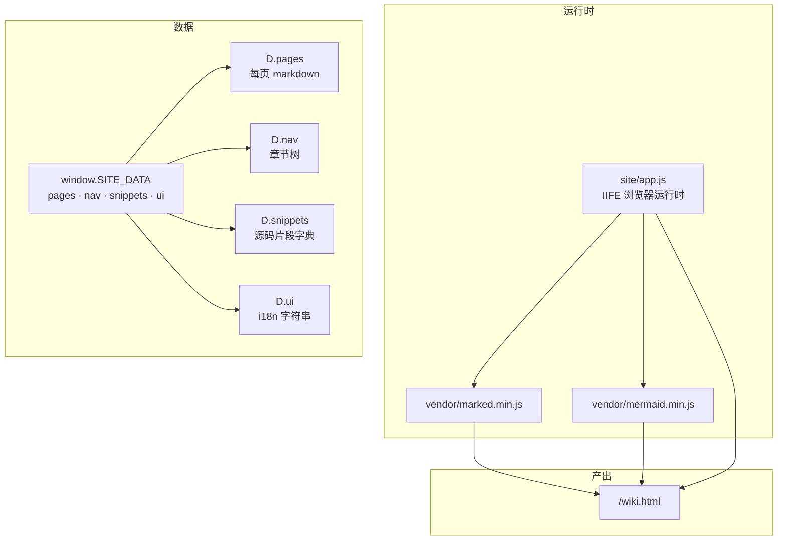
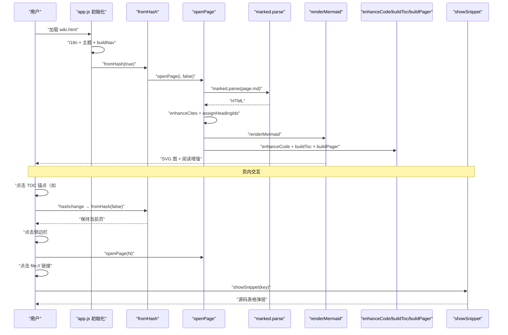
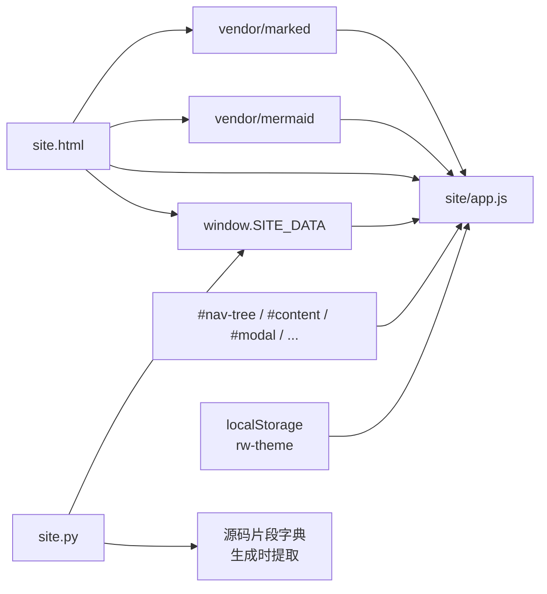

# 前端渲染与交互

<cite>
**本文引用的文件**
- [src/repowiki/templates/site/app.js](file://src/repowiki/templates/site/app.js)
- [src/repowiki/site.py](file://src/repowiki/site.py)
- [src/repowiki/templates/site.html](file://src/repowiki/templates/site.html)
</cite>

## 更新摘要

**变更内容**
- `app.js` 从 197 行扩展到 352 行，本次更新覆盖全部新增交互：
  - 侧边栏章节可折叠（`nav-chapter` 按钮 + `aria-expanded` + chevron 图标），折叠状态持久化到 `localStorage('rw-nav')`，切页时 `expandChapter` 自动展开当前章节（[src/repowiki/templates/site/app.js:48-83](file://src/repowiki/templates/site/app.js#L48-L83)）。
  - 新增 `enhanceCode`/`copyText`：代码块包上语言标签 + 复制按钮的卡片，`navigator.clipboard` 失败回退 `execCommand`（[src/repowiki/templates/site/app.js:122-173](file://src/repowiki/templates/site/app.js#L122-L173)）。
  - 新增 `buildToc`/`onScroll`：「本页内容」页内目录（H2/H3）+ 滚动 spy 高亮 + 顶部阅读进度条，`requestAnimationFrame` 节流（[src/repowiki/templates/site/app.js:175-206](file://src/repowiki/templates/site/app.js#L175-L206)）。
  - 新增 `buildPager`（上一页/下一页）、`buildFooter`（仓库名 · repowiki · 日期）与面包屑填充（[src/repowiki/templates/site/app.js:208-228](file://src/repowiki/templates/site/app.js#L208-L228)）。
  - 搜索命中片段以 `<mark>` 高亮；`openPage` 渲染管线扩展（enhanceCode → buildToc → buildPager → onScroll）；内建 zh/en 文案按 `D.locale` 切换。
- 同步修正全文 `app.js` 行号引用（函数边界整体后移）。

## 目录
1. [更新摘要](#更新摘要)
2. [简介](#简介)
3. [项目结构](#项目结构)
4. [核心组件](#核心组件)
5. [架构总览](#架构总览)
6. [详细组件分析](#详细组件分析)
7. [依赖关系分析](#依赖关系分析)
8. [性能与一致性考量](#性能与一致性考量)
9. [故障排查指南](#故障排查指南)
10. [结论](#结论)

## 简介
本页聚焦 repowiki 单文件站点的浏览器端运行时 `src/repowiki/templates/site/app.js`——它在 `repowiki site` 生成 HTML 时被嵌入 `` 注入。
- `app.js` → DOM 节点：`#site-title`/`#search`/`#menu-btn`/`#theme-btn`/`#modal-close`/`#nav-tree`/`#content`/`#modal`/`#modal-title`/`#modal-body`/`#backdrop`/`#search-results`；全部由 `site.html` 提供。
- `app.js` → 浏览器 API：`localStorage`（带 try/catch）/ `matchMedia('(prefers-color-scheme: dark)')` / `window.scrollTo` / `document.querySelector(All)` / `addEventListener('hashchange'/'click'/'keydown'/'input')`。
- `site.html` → `app.js`：`<script>` 标签嵌入 `app.js` 内容（在 `marked`/`mermaid` 之后、`</body>` 之前）。
- `site.py` → `app.js` 与 `site.html`：渲染时把全部页面 markdown、章节树、源码片段、locale 字符串打包成 JSON 字符串嵌入 `window.SITE_DATA`；`vendor/*.js` 与 `templates/site.html` 通过 `pyproject.toml` 的 `package-data` 打入 wheel。
- 数据契约：`SITE_DATA.pages` 是 `[{title, md}]` 数组；`SITE_DATA.nav` 是 `[{title, page, children?}]` 树；`SITE_DATA.snippets` 是 `{"path#Lstart-Lend": {start, end, lines, missing?}}`；`SITE_DATA.ui` 是 i18n 字符串表。

图表来源
- [src/repowiki/templates/site/app.js:1-46](file://src/repowiki/templates/site/app.js#L1-L46)
- [src/repowiki/templates/site.html](file://src/repowiki/templates/site.html)
- [src/repowiki/site.py](file://src/repowiki/site.py)

章节来源
- [src/repowiki/templates/site/app.js:1-352](file://src/repowiki/templates/site/app.js#L1-L352)
- [src/repowiki/templates/site.html](file://src/repowiki/templates/site.html)
- [src/repowiki/site.py](file://src/repowiki/site.py)

## 性能与一致性考量
- 零网络：`wiki.html` 自包含 marked/mermaid 与所有页面 markdown、源码片段；双击即开，不依赖 CDN、API、字体服务（除浏览器默认字体）。
- 主题切换同步：主题按钮 click 后立即 `applyTheme` + `renderMermaid`，无需重载整页；mermaid 用 `securityLevel: 'strict'` 关 click 防 XSS。
- 一次性下标：搜索 `idx = D.pages.map(p => p.md.toLowerCase())` 在 IIFE 启动时构造一次，后续 input 事件只做 `indexOf`——O(N) 字符串扫描，无须额外索引结构。
- 源码预提取：`D.snippets` 在 `repowiki site` 时就读取仓库文件并按行存为 `lines` 数组；浏览器端不需要 file:// 实际读盘（很多浏览器不允许），也不需要 fetch。
- mermaid 失败兜底：`renderMermaid` catch 时把 holder 改为 `rw-mermaid-error` + `<pre>` 显示源码——mermaid 语法错或渲染失败不会让页面空白，至少能看到原文。
- 安全过滤：`esc()` 在所有用户内容嵌入 innerHTML 之前转义 `&`/`<`/`>`/`"`——防 XSS 通过页面 markdown 中的恶意 HTML 影响弹层。
- 标题锚点懒计算：`assignHeadingIds` 仅在 `openPage` 后跑一次，给当前页的所有标题补 `id`；切到新页时直接覆盖 `#content` 重新渲染，不累积 DOM。
- 文件协议兼容：`localStorage` 在 `file://` 下会被某些浏览器（Firefox）禁用，`applyTheme` 用 try/catch 吞掉，主题仅本次会话有效；`matchMedia` 同样可能被某些环境拒绝，所以有 `window.matchMedia &&` 短路。
- 路径同步避免循环 push：`openPage` 在 `push !== false && location.hash !== '#/p/' + i` 时才改 hash——手动 `openPage` 调用 `push` 参数默认 `undefined`，实际走 push；从 hash 来的 `fromHash(false)` 显式传 `false` 不 push。
- 30+60 上下文窗口：搜索命中展示 30 字符前 + 60 字符后 + 折叠空白为单空格——够看到关键词所在句子又不过长。
- mermaid 计数器：`mermaidCounter` 单调递增确保每次 `render` 的 ID 唯一；多次渲染同一 mermaid 不会冲突。

章节来源
- [src/repowiki/templates/site/app.js:1-352](file://src/repowiki/templates/site/app.js#L1-L352)

## 故障排查指南
- 现象：打开 `wiki.html` 页面空白。成因：可能是 marked/mermaid 加载顺序错，或 `SITE_DATA` 注入失败。解决：检查 `site.html` 中 `<script>` 标签顺序（marked → mermaid → SITE_DATA → app.js）；用浏览器开发者工具看 Network 是否加载了 vendor/*.js。
- 现象：mermaid 图显示为源码（`<pre>` 形式）且 holder 类为 `rw-mermaid-error`。成因：mermaid 渲染失败（语法错或 vendor 库缺失）。解决：检查 mermaid 块语法是否合规；确认 `vendor/mermaid.min.js` 已嵌入 HTML。
- 现象：搜索无结果但关键词明明存在。成因：搜索是大小写不敏感但不分词；只匹配连续字符串。解决：用更短的关键词；或检查关键词是否跨段落被 HTML 标签拆开。
- 现象：点击页内 TOC 锚点（如 `#简介`）会跳到顶部但不滚动到目标。成因：heading 没有 `id` 属性。解决：`assignHeadingIds` 在每次 `openPage` 后跑一次，应该会补齐；若不生效，可能是 marked 把标题里的标点剥掉了，需要修 heading 文本。
- 现象：点击 `file://` 链接直接在新窗口打开文件而不是弹源码。成因：`file://` 协议被浏览器拦了 click 委托。解决：检查 `a[href^="file://"]` 选择器是否生效；查看 Console 是否有 `a.closest` 抛错。
- 现象：弹层显示「源文件不存在或已删除，无法展示片段」。成因：`D.snippets[key].missing = true`（生成时该文件已不存在）；或 repo 文件路径与 snippets key 不匹配。解决：重跑 `repowiki site`（先生成最新 metadata），确认仓库文件存在。
- 现象：切换主题后 mermaid 图颜色没变。成因：mermaid 主题同步需重新渲染。解决：检查 `#theme-btn` click 是否调 `renderMermaid`；或在开发者工具 Console 手动调一次。
- 现象：首次加载没有按 URL hash 打开指定页。成因：`SITE_DATA.pages` 索引超出范围，或 hash 格式不是 `#\/p\/(\d+)`。解决：用 `#/p/0`、`#/p/1` 形式；查看 hash 是否被浏览器自动转义。
- 现象：侧边栏菜单打不开或关不掉。成因：`sidebar-open` 类被 CSS 屏蔽，或 backdrop 节点不存在。解决：检查 `site.html` 中 `#menu-btn`/`#backdrop`/`#nav-tree` 节点是否存在；查看 CSS 是否定义 `body.sidebar-open` 状态。
- 现象：localStorage 写入抛错（`QuotaExceededError`）。成因：`file://` 协议 + Firefox 默认禁用本地存储。解决：`applyTheme` 已 try/catch；UI 应降级到跟随系统主题，不写入存储。
- 现象：页内跳转后 nav 高亮不正确。成因：nav 高亮基于 `+a.getAttribute('data-page') === i`（数值比较）；`i` 不一致会高亮消失。解决：检查 `openPage` 是否正确更新 `current` 变量；查看 DOM 中 `<a data-page>` 是否有重复。
- 现象：搜索框输入慢（卡顿）。成因：input 事件无防抖，对超大 wiki 每次按键扫所有页面。解决：可在 IIFE 内对 `$('#search')` 加 debounce；目前 30+60 上下文窗口保证单次扫描开销可控。

章节来源
- [src/repowiki/templates/site/app.js:1-352](file://src/repowiki/templates/site/app.js#L1-L352)
- [src/repowiki/templates/site.html](file://src/repowiki/templates/site.html)

## 结论
`site/app.js` 是 repowiki 单文件站点的全部交互入口——零网络、零外部依赖、双击 `wiki.html` 即开。它把 marked（markdown 解析）、mermaid（图渲染）、hash 路由、TOC 锚点（不重置页面）、nav 高亮、`<cite>` 二次解析、源码弹层、全文搜索、主题切换串成一个 IIFE，并通过 `window.SITE_DATA` 拿到 `repowiki site` 生成时打包的全部页面、章节树、源码片段与 i18n 字符串。理解这条链路要抓住三个对外不显眼但关键的契约——hash 路由只识别 `#/p/N`（TOC 锚点保持当前页，commit d54d086 修复）、`file://` 引用全局拦截（不打开外部文件，全部走 `D.snippets` 弹层）、`<cite>` 块手动重解析（CommonMark 不解析原生标签内部 markdown）。正确使用方式是：先生成 metadata 与页面 → `repowiki site` 打包 → 浏览器双击 `wiki.html` 浏览；任何主题/搜索/源码弹层异常都可在浏览器开发者工具 Console + Network 中定位，必要时手动 `renderMermaid()` 触发重渲染。

章节来源
- [src/repowiki/templates/site/app.js:1-352](file://src/repowiki/templates/site/app.js#L1-L352)
- [src/repowiki/site.py](file://src/repowiki/site.py)
- [src/repowiki/templates/site.html](file://src/repowiki/templates/site.html)
