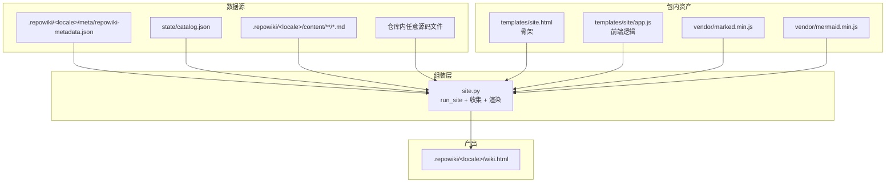
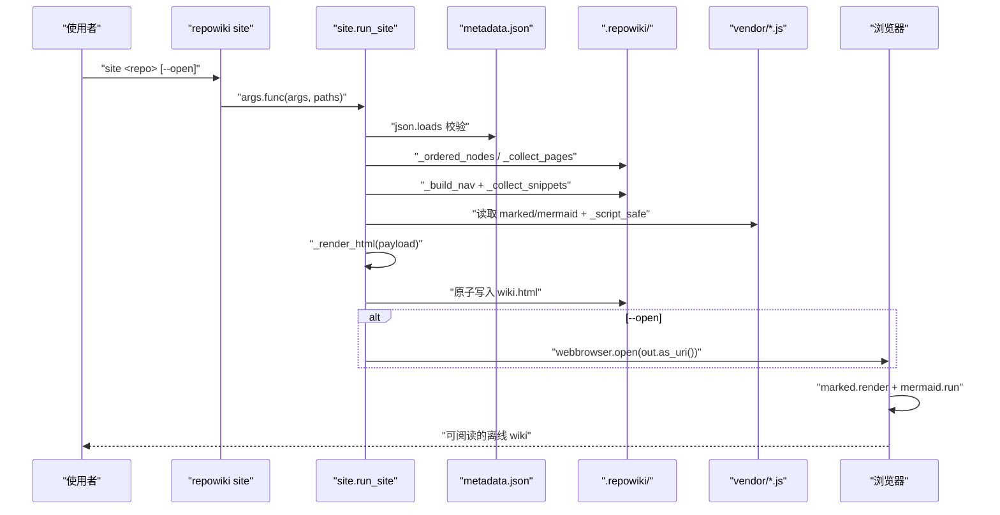
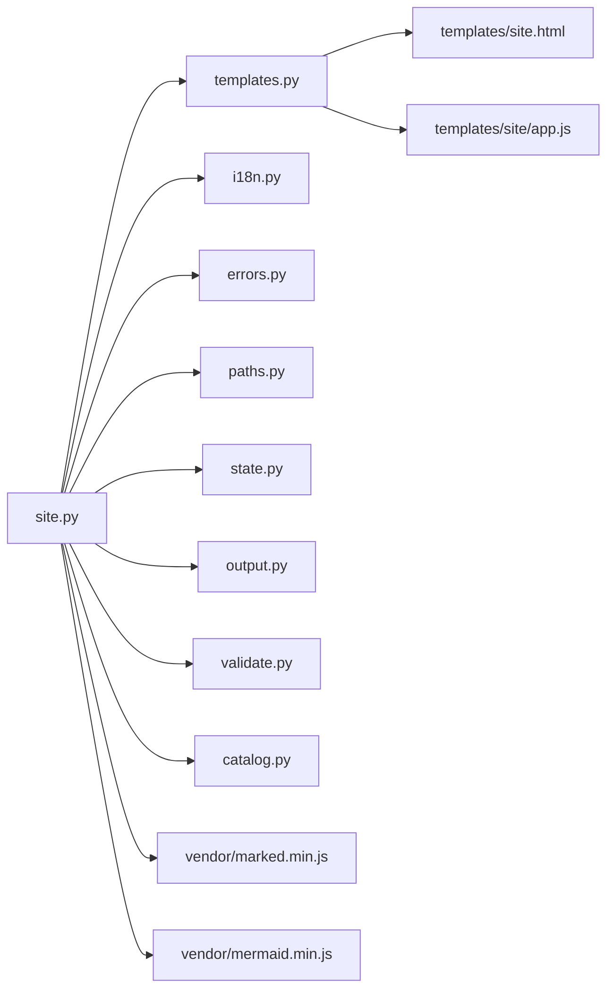

# 单文件站点的组装流程

<cite>
**本文引用的文件**
- [src/repowiki/site.py](file://src/repowiki/site.py)
- [src/repowiki/templates/site.html](file://src/repowiki/templates/site.html)
</cite>

## 更新摘要

**变更内容**
- 修复抽屉菜单按钮的桌面端死控件问题：`#menu-btn` 只服务窄屏（≤900px）的抽屉式侧栏，桌面端侧栏常驻时是死控件；现在默认 `display: none`，仅在窄屏媒体查询内恢复（`src/repowiki/templates/site.html:74-76` 的规则与 `site.html:299` 的媒体查询恢复）。`templates/site.html` 由 349 行增至 353 行，topbar 区域（`#menu-btn`/`#theme-btn` 等）位移至 [src/repowiki/templates/site.html:317-349](file://src/repowiki/templates/site.html#L317-L349) 区间内，本页相关行号引用已同步核对。
- 主题 design tokens 部分（[src/repowiki/templates/site.html:13-49](file://src/repowiki/templates/site.html#L13-L49)）未受本次改动影响，组装流程与四个 `PLACEHOLDER` 注入点保持原结论。

## 目录
1. [更新摘要](#更新摘要)
2. [简介](#简介)
3. [项目结构](#项目结构)
4. [核心组件](#核心组件)
5. [架构总览](#架构总览)
6. [详细组件分析](#详细组件分析)
7. [依赖关系分析](#依赖关系分析)
8. [性能与一致性考量](#性能与一致性考量)
9. [故障排查指南](#故障排查指南)
10. [结论](#结论)

## 简介
「单文件站点的组装流程」聚焦 `repowiki site` 如何把全部 wiki 页面、源码片段与前端运行时打成一个完全离线、可双击打开的 HTML 文件。`site.py` 的 `run_site` 是入口：校验 `repowiki-metadata.json` 存在、按 catalog 顺序收集页面正文、用 `extract_refs` 抽出所有 `file://` 引用的源码行区间、用 `templates/site.html` 拼装 shell、把 marked 与 mermaid 的 vendored JS 内联进 `` 提前关闭 `<script>` 块；`_vendor(name)` 读 `vendor/<name>` 并跑 `_script_safe`；`templates.render(shell, SITE_PAYLOAD=..., MARKED_JS=..., MERMAID_JS=..., APP_JS=...)` 一次性填四个占位符（`site.py:232-242`）。
- 实现要点：`_script_safe` 全局把 `</script` 替换为 `<\/script`，对 mermaid/marked/app.js 都生效——这是最稳的 JS 内联安全做法。

**章节来源**
- [src/repowiki/site.py:232-253](file://src/repowiki/site.py#L232-L253)

### 主题切换与 mermaid 主题变量
- 职责：在 shell 中用 CSS 变量定义暗/亮主题，前端通过 `[data-theme]` 切换；mermaid 主题与 CSS 主题联动。
- 关键行为：`templates/site.html:13-49` 用 `:root`（亮色）与 `[data-theme="dark"]`（暗色）两组 design tokens CSS 变量定义主题，`<meta name="color-scheme" content="light dark">`（`site.html:7`）让表单控件与滚动条跟随系统；`#theme-btn`（`site.html:327`）触发切换；mermaid 主题变量由 `app.js` 注入 `mermaid.initialize({ theme: ... })`，与 body 的 `data-theme` 一致。
- 实现要点：所有颜色都通过 `var(--xxx)` 引用，切换 `[data-theme]` 即可全站换肤；mermaid 主题切换通常需要 `mermaid.run()` 重新执行图表渲染，app.js 负责该流程。

**章节来源**
- [src/repowiki/templates/site.html:13-49](file://src/repowiki/templates/site.html#L13-L49)
- [src/repowiki/templates/site.html:318-328](file://src/repowiki/templates/site.html#L318-L328)

## 依赖关系分析
- `site.py` 依赖：`templates`（加载 `site.html` / `app.js`）、`catalog.flatten / FlatNode`（节点扁平化）、`errors.UsageError`、`i18n.strings`（UI 字符串表）、`output.emit`、`paths.WikiPaths`、`state.now_iso`、`validate.extract_refs`（引用解析）。
- 资产依赖：`vendor/marked.min.js`、`vendor/mermaid.min.js`、`templates/site/app.js`、`templates/site.html`——全部以纯文本打包进 wheel。
- 上游约束：`site` 必须在 `finalize` 之后才能运行，因为 `paths.metadata_file` 是唯一可信的页面清单来源；`finalize` 还没跑就抛 `UsageError`。
- 唯一第三方依赖：构建期打包 `marked / mermaid`（MIT 协议），运行期无任何第三方 import（仅 stdlib + repowiki 内部模块）。

图表来源
- [src/repowiki/site.py:16-23](file://src/repowiki/site.py#L16-L23)
- [src/repowiki/site.py:245-247](file://src/repowiki/site.py#L245-L247)

章节来源
- [src/repowiki/site.py:1-100](file://src/repowiki/site.py#L1-L100)
- [src/repowiki/templates/site.html:317-349](file://src/repowiki/templates/site.html#L317-L349)

## 性能与一致性考量
- 站点大小：单文件约 4-5 MB；主要由 marked（~50 KB）+ mermaid（~500 KB）+ 全部 markdown + 全部源码片段构成；打开方式为本地 file://，无网络请求。
- 源码片段大小保护：`MAX_SNIPPET_LINES = 20_000`（`site.py:25`）——超过此区间的引用直接标 `missing` 跳过，避免一份 wiki 把整个 monorepo 内联进 HTML。
- 二进制文件防护：`_read_lines` 检查文件前 8192 字节是否含 `\0`，命中即视为二进制并标 missing——避免把图片/PDF 内联成超长乱码。
- 顺序一致性：`_ordered_nodes` 优先用 `catalog.json` 的 plan 顺序，保证 wiki 页面顺序与 `plan` 阶段一致；`repowiki clean` 后 catalog 缺失则用目录序回退，此时内容不受影响。
- 写入原子性：tmp 文件带 PID 后缀避免并发 `site` 调用冲突；最终 `os.replace` 在同一文件系统下保证读者要么看到旧版要么看到新版，不会读到半截。
- 主题切换性能：CSS 变量切换不重排版；mermaid 主题切换通常需要重新渲染图表，由前端 JS 异步完成。
- 模板占位符：四个大写键（`SITE_PAYLOAD` / `MARKED_JS` / `MERMAID_JS` / `APP_JS`）一次性替换进 shell；任一失败会让整页降级，但 site 命令本身不会因此失败——失败的 HTML 仍可写入但缺少对应能力。

章节来源
- [src/repowiki/site.py:25-72](file://src/repowiki/site.py#L25-L72)
- [src/repowiki/site.py:195-253](file://src/repowiki/site.py#L195-L253)

## 故障排查指南
- 退出码 `1`（`UsageError: 未找到 repowiki-metadata.json`）：未运行 `finalize` 就跑 `site`；先完成全部页面任务并跑 `finalize`。
- 退出码 `1`（`repowiki-metadata.json 损坏`）：metadata JSON 解析失败；先重跑 `finalize`，确认所有 page task 状态为 `done`。
- 退出码 `1`（`未找到任何已生成的 wiki 页面`）：`.repowiki/<locale>/content/` 为空；通常发生在 `clean` 之后忘记重新 `plan + check`；重跑 `plan` 与各 page task 的 `check` 即可。
- 站点打开后源码弹层显示 `missing`：源码片段抽取失败；常见原因——(a) `MAX_SNIPPET_LINES = 20_000` 超限，(b) 文件被识别为二进制（前 8192 字节含 `\0`），(c) 文件路径错误；定位方式——`grep -n "missing" wiki.html` 或前端 console。
- 主题切换后 mermaid 图未刷新：mermaid 主题通常需要 `mermaid.run()` 重新渲染；前端 `app.js` 应负责该流程，若未生效检查 `app.js` 是否被正确替换（搜索 `mermaid.initialize`）。
- JS 报错：被内嵌 JS 里有 `</script` 字面量（例如有人在 markdown 里写代码块含 `</script`）；`_script_safe` 会处理大部分情况，但若直接 inline 用户内容到 JS 字符串仍可能有问题；前端 console 看具体报错栈。
- 站点体积过大：snippet 区间太大或 vendor JS 未压缩；检查 `MAX_SNIPPET_LINES` 与 markdown 引用是否合理。
- 离线 wheel 缺 vendor：检查 `pyproject.toml:32` 的 `package-data` 是否包含 `vendor/*.js`；`pip show -f repowiki | grep vendor` 应能看到 `vendor/marked.min.js`。

章节来源
- [src/repowiki/site.py:28-72](file://src/repowiki/site.py#L28-L72)
- [src/repowiki/site.py:195-253](file://src/repowiki/site.py#L195-L253)
- [pyproject.toml:31-32](file://pyproject.toml#L31-L32)

## 结论
`repowiki site` 是一个纯组装的渲染器——它把 metadata、catalog 顺序、page markdown、源码片段、内嵌 marked/mermaid 与 shell 模板拼成一个 HTML 文件。关键设计是「单文件离线可用」：所有运行时都打包进文件本身；源码片段有大小与二进制防护；nav 顺序在 catalog 缺失时优雅降级到目录序；主题切换通过 CSS 变量与前端 JS 协同实现。对于想要扩展站点能力的开发者，最自然的接入点是修改 `templates/site.html` 与 `templates/site/app.js`（前端样式与交互）；若需要新增「被内嵌的资产」，修改 `package-data` 与 `_vendor` 即可。**已更新**：shell 重构为 design tokens 双主题并新增进度条/页内目录/pager/页脚等骨架元素，四个占位注入点与组装流程保持不变。

章节来源
- [src/repowiki/site.py:1-253](file://src/repowiki/site.py#L1-L253)
- [src/repowiki/templates/site.html:1-349](file://src/repowiki/templates/site.html#L1-L349)