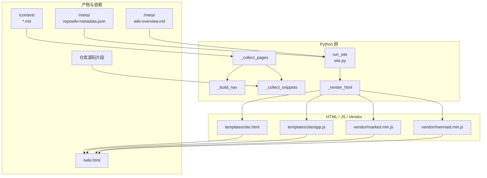
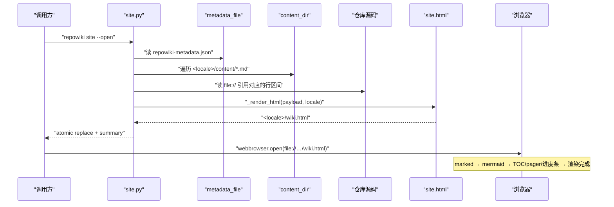
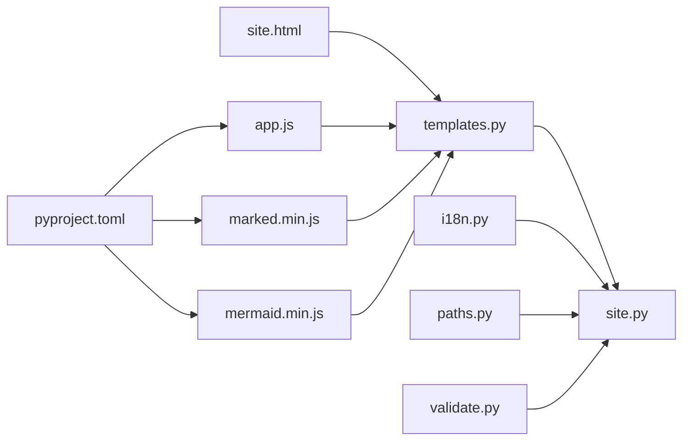

# 离线查看站点

<cite>
**本文引用的文件**
- [src/repowiki/site.py](file://src/repowiki/site.py)
- [src/repowiki/templates/site.html](file://src/repowiki/templates/site.html)
- [src/repowiki/templates/site/app.js](file://src/repowiki/templates/site/app.js)
- [src/repowiki/vendor/marked.min.js](file://src/repowiki/vendor/marked.min.js)
- [src/repowiki/vendor/mermaid.min.js](file://src/repowiki/vendor/mermaid.min.js)
- [src/repowiki/paths.py](file://src/repowiki/paths.py)
- [src/repowiki/i18n.py](file://src/repowiki/i18n.py)
- [src/repowiki/validate.py](file://src/repowiki/validate.py)
</cite>

## 更新摘要

**变更内容**
- 修复抽屉菜单按钮的桌面端死控件问题：`#menu-btn` 只负责窄屏（≤900px）下抽屉式侧栏的开合，桌面端侧栏常驻时它点击无效果；现在默认 `display: none`，仅在窄屏媒体查询内恢复显示（见 [src/repowiki/templates/site.html:74-76](file://src/repowiki/templates/site.html#L74-L76) 与 [src/repowiki/templates/site.html:298-300](file://src/repowiki/templates/site.html#L298-L300)）。`templates/site.html` 现为 353 行，本页涉及 site.html 的行号引用已同步更新；`app.js` 与 `site.py` 未变。
  - 侧边栏章节可折叠（带 chevron 图标与 `aria-expanded`），展开状态持久化到 `localStorage`（`rw-nav`），切换页面时自动展开当前章节（[src/repowiki/templates/site/app.js:48-88](file://src/repowiki/templates/site/app.js#L48-L88)）。
  - 代码块升级为带语言标签与「复制/Copy」按钮的卡片样式，复制成功/失败有图标反馈，`file://` 下自动回退 `execCommand`（[src/repowiki/templates/site/app.js:122-160](file://src/repowiki/templates/site/app.js#L122-L160)）。
  - 新增「本页内容」页内目录（H2/H3）+ 滚动 spy 高亮 + 顶部阅读进度条（[src/repowiki/templates/site/app.js:162-206](file://src/repowiki/templates/site/app.js#L162-L206)）。
  - 新增上一页/下一页 pager、面包屑与页脚（仓库名 · repowiki · 生成日期）（[src/repowiki/templates/site/app.js:208-227](file://src/repowiki/templates/site/app.js#L208-L227)）。
  - 搜索结果支持命中高亮；样式层重构为 design tokens（CSS 变量）双主题，`color-scheme` 跟随系统，滚动条/选区/focus 可见性统一，尊重 `prefers-reduced-motion`。
- 同步修正 app.js 行号引用（文件现为 352 行）。

## 目录
1. [更新摘要](#更新摘要)
2. [简介](#简介)
3. [项目结构](#项目结构)
4. [核心组件](#核心组件)
5. [架构总览](#架构总览)
6. [详细组件分析](#详细组件分析)
7. [依赖关系分析](#依赖关系分析)
8. [性能与一致性考量](#性能与一致性考量)
9. [故障排查指南](#故障排查指南)
10. [结论](#结论)

## 简介

`repowiki site` 是整条流水线的最后一步：把 finalize 已写出的所有页面（含 overview）与每条 `file://` 引用指向的源码片段打包成一个单文件离线 HTML（`<locale>/wiki.html`），同时把 `marked.min.js` 与 `mermaid.min.js` 内嵌到 `<script>` 块中，让浏览器双击即看、零网络依赖、可邮件分发。理解这层抽象就掌握了 `repowiki` 为什么坚持「单文件离线 HTML」而非「静态站点目录」的产品决策，以及 vendor/ 目录里被嵌入的两个第三方库各承担什么职责。

## 项目结构

与「离线查看站点」相关的源文件集中在 `src/repowiki/site.py` 与 `src/repowiki/templates/site/`、`src/repowiki/vendor/`：

- `src/repowiki/site.py` —— `run_site` 命令入口；包含 `_collect_pages / _build_nav / _collect_snippets / _render_html` 等辅助函数。
- `src/repowiki/templates/site.html` —— 离线站点的 HTML 骨架；含 design tokens（CSS 变量）双主题（深/浅，`color-scheme` 跟随系统）、topbar（含阅读进度条与仅在窄屏显示的 `#menu-btn` 抽屉开关）、sidebar（可折叠章节，桌面端常驻、窄屏抽屉化）、内容区、页内目录栏、pager 与页脚。
- `src/repowiki/templates/site/app.js` —— 浏览器侧 JS：marked 渲染 markdown、mermaid 渲染图表、搜索命中高亮、主题切换、可折叠导航（状态持久化）、代码块复制按钮、页内 TOC + 滚动 spy + 阅读进度、上一页/下一页 pager、面包屑与页脚。
- `src/repowiki/vendor/marked.min.js` —— 第三方 markdown 渲染器（69 行压缩版）；把页面 markdown 转 HTML。
- `src/repowiki/vendor/mermaid.min.js` —— 第三方 mermaid 渲染器（3636 行）；运行时把 ```mermaid 块渲染成 SVG。
- `src/repowiki/paths.py` —— `WikiPaths.site_file` / `metadata_file` / `overview_file` 是 site 命令读取产物的统一路径契约。
- `src/repowiki/i18n.py` —— `STRINGS.site` 提供 overview_label / search_placeholder / theme_label 等 UI 文案的多语表。
- `src/repowiki/validate.py` —— `extract_refs` 被 site 复用，从页面 markdown 里提取所有 `file://` 引用。



图表来源
- [src/repowiki/site.py:38-72](file://src/repowiki/site.py#L38-L72)

章节来源
- [src/repowiki/site.py:1-7](file://src/repowiki/site.py#L1-L7)

## 核心组件

- **run_site(paths, open_browser, as_json)**（site.py）：site 命令入口；先校验 `metadata_file` 存在（要求已 finalize），再依次收集页面、构建导航、抓取源码片段、渲染 HTML、写临时文件并 `os.replace` 原子替换；可选 `webbrowser.open`。
- **_collect_pages(paths, metadata, nodes)**（site.py）：把 overview 与所有页面合并为 `pages[]`，每条记录含 `id / title / path / md`；overview 优先从 `metadata["wiki_overview"]` 读，回退到 `overview_file`。
- **_ordered_nodes(paths)**（site.py）：优先从 `state/catalog.json` flatten 得到有序节点；缺失或损坏时降级到 `_nodes_from_disk`，确保 `repowiki clean` 后 site 仍可构建。
- **_build_nav(paths, pages, nodes)**（site.py）：把 catalog 树转成左侧 sidebar 的两级导航（章节 → 页面），含 overview 入口。
- **_collect_snippets(repo_root, pages)**（site.py）：扫描每个页面的 `file://` 引用，读取对应仓库文件对应行区间；以 `<path>#L<s>-L<e>` 为键去重，超过 `MAX_SNIPPET_LINES=20000` 行则跳过避免膨胀。
- **_render_html(payload, locale)**（site.py）：把 payload 序列化为 JSON（`<` 转 `\u003c` 防 XSS），渲染 `templates/site.html`，内嵌 `app.js / marked.min.js / mermaid.min.js`。
- **_vendor(name)**（site.py）：从 `src/repowiki/vendor/<name>` 读取 JS 并 `_script_safe` 转义。
- **_script_safe(js)**（site.py）：把 `</script` 替换为 `<\/script`，防止内嵌 JS 中意外闭合 `<script>` 标签。
- **templates/site.html**：单文件离线 HTML 骨架；design tokens 主题变量、`#topbar`（含 `#progress` 阅读进度条）/ `#sidebar`（可折叠章节）/ `#content` / `#toc-wrap`（页内目录）/ `#pager` / `#site-footer` 布局，`\{\{SITE_PAYLOAD\}\}` / `\{\{MARKED_JS\}\}` / `\{\{MERMAID_JS\}\}` / `\{\{APP_JS\}\}` 四个占位。
- **templates/site/app.js**：浏览器侧 JS，初始化 marked / mermaid、绑定搜索框（搜索页面 H1/H2/正文并高亮命中）、渲染源码片段、切换深/浅主题、可折叠导航（`localStorage` 持久化）、代码块复制按钮、页内 TOC + 滚动 spy + 阅读进度、pager、面包屑与页脚。
- **vendor/marked.min.js**：69 行压缩版 markdown 渲染器；接受 `pages[].md` 转成 HTML 注入 `#content`。
- **vendor/mermaid.min.js**：3636 行 mermaid 渲染器；扫描 HTML 中的 `.language-mermaid` 块并渲染为 SVG。

章节来源
- [src/repowiki/site.py:28-72](file://src/repowiki/site.py#L28-L72)
- [src/repowiki/templates/site/app.js:1-352](file://src/repowiki/templates/site/app.js#L1-L352)

## 架构总览

`site` 命令是一次性原子流水线：先从 metadata 拿到 overview，再 flatten catalog 拿到页面顺序，按页面 md 抓源码片段，最后把 payload 与 vendor JS 一起塞进 site.html。下图描绘的是一次 `repowiki site --open` 的完整链路：`run_site` 校验前置 → 收集数据 → 渲染 HTML → `webbrowser.open(out.as_uri())` 用 `file://` 协议打开本地文件，浏览器无须服务器、无须外网。



图表来源
- [src/repowiki/site.py:28-72](file://src/repowiki/site.py#L28-L72)

章节来源
- [src/repowiki/site.py:28-72](file://src/repowiki/site.py#L28-L72)

## 详细组件分析

### run_site 与前置校验

- 职责：site 命令入口；要求 finalize 已完成、metadata 已写入。
- 关键行为：先校验 `paths.metadata_file.is_file()`，否则抛 `UsageError`；metadata 损坏抛 `UsageError`；无页面时抛 `UsageError`。
- 实现要点：HTML 写入走 `tmp.with_name(f".{out.name}.{os.getpid()}.tmp") + os.replace`，是 `TaskStore._save_atomic` 同一套原子替换套路，确保中途崩溃不会留下半截 HTML。

章节来源
- [src/repowiki/site.py:28-72](file://src/repowiki/site.py#L28-L72)

### 页面收集与 overview 优先级

- 职责：把 overview 与所有页面合并为 `pages[]`，保证 site 至少包含目录导航的根节点。
- 关键行为：`overview` 优先从 `metadata["wiki_overview"]` 读取，回退到 `overview_file`；过滤 `overview == "No overview yet."` 占位文本，避免空 overview 出现在 site。
- 实现要点：`pages[]` 每条记录含 `id / title / path / md`；md 是 raw markdown 字符串，由浏览器侧 app.js 用 marked 渲染。

章节来源
- [src/repowiki/site.py:89-114](file://src/repowiki/site.py#L89-L114)

### 导航树 _build_nav

- 职责：把 FlatNode 树转成 sidebar 用的嵌套列表（章节 → 子页面）。
- 关键行为：`children_of[parent_id]` 用 dict 分组节点；递归 `descendants(node_id)` 把整棵子树拍平；overview 总是作为第一条 entry 出现。
- 实现要点：每个 entry 含 `title` 与 `page`（pages[] 索引）或 `children`（嵌套 entry）；用 `by_output` 字典保证页面引用闭合，缺失的页面会被自然跳过。

章节来源
- [src/repowiki/site.py:159-190](file://src/repowiki/site.py#L159-L190)

### 源码片段抓取 _collect_snippets

- 职责：抓取每个页面 `file://` 引用对应的真实源码片段，内嵌到 HTML，让离线阅读时仍可点开看代码。
- 关键行为：`extract_refs` 解析所有 `file://path#Lx-Ly` 引用；以 `<path>#L<s>-L<e>` 为键去重；`_read_lines` 读取文件并 splitlines；二进制文件返回 None；超过 `MAX_SNIPPET_LINES=20000` 行的跨度直接标 missing 不内嵌。
- 实现要点：snippet 同时含 `start / end / lines`，浏览器侧 app.js 按 `<details>` 折叠展开；缺失的文件路径标 `missing: true` 而非抛错，保证 site 仍可生成。

章节来源
- [src/repowiki/site.py:195-227](file://src/repowiki/site.py#L195-L227)

### HTML 渲染 _render_html 与 _script_safe

- 职责：把 payload 与 vendor JS 一起塞进 site.html，输出最终 HTML。
- 关键行为：payload 用 `json.dumps` 序列化并把 `<` 转 `\u003c` 防止 XSS；`_script_safe` 把 JS 中 `</script` 替换为 `<\/script`，防止内嵌 JS 提前闭合 `<script>` 标签。
- 实现要点：`templates.render` 同时塞四个占位 `SITE_PAYLOAD / MARKED_JS / MERMAID_JS / APP_JS`；site.html 是 zh/en 复用的同一份骨架，UI 文案由 `STRINGS.site` 在 payload 中携带。

章节来源
- [src/repowiki/site.py:232-253](file://src/repowiki/site.py#L232-L253)

### 浏览器侧 app.js

- 职责：在浏览器中执行 marked 渲染 markdown、mermaid 渲染图表、搜索高亮、主题切换，以及本次更新加入的整套阅读增强。
- 关键行为：页面切换时调用 marked.parse → 注入 #content → `enhanceCode()`（代码块包卡片、加语言标签与复制按钮）→ mermaid 渲染（兼容新的 `.codeblock` 外层容器）→ `buildToc()`（按当前页 H2/H3 生成「本页内容」页内目录，少于 2 个标题时隐藏）→ `buildPager(i)`（上一页/下一页）→ 更新面包屑、高亮导航并自动展开当前章节；`onScroll` 用 `requestAnimationFrame` 节流，驱动顶部阅读进度条（`scaleX`）与页内目录的滚动 spy 高亮。
- 实现要点：章节折叠状态存 `localStorage('rw-nav')`、主题存 `localStorage('rw-theme')`，读写都 try/catch——`file://` 协议下部分浏览器禁用存储时不影响渲染；复制按钮优先 `navigator.clipboard`，不可用时回退隐藏 `textarea + execCommand('copy')`，成功/失败在按钮上以图标 + 文案反馈 1.4 秒后还原；页脚由 payload 的 `generatedAt` 生成「仓库名 · repowiki · 日期」；搜索对页面 H1/H2/正文做匹配并高亮命中片段。

章节来源
- [src/repowiki/templates/site/app.js:1-352](file://src/repowiki/templates/site/app.js#L1-L352)
- [src/repowiki/templates/site/app.js:122-206](file://src/repowiki/templates/site/app.js#L122-L206)

### vendor/ 内嵌的 marked 与 mermaid

- 职责：把第三方渲染器塞进 vendor/，由 pyproject.toml 的 package-data 打包，site 命令时内嵌到 HTML。
- 关键行为：`pyproject.toml` 的 `package-data = {repowiki = ["templates/*/*", "templates/site.html", "templates/site/*", "vendor/*.js"]}` 让 pip 安装时一并带出 vendor JS；site 命令时 `_vendor(name)` 直接读取。
- 实现要点：这是「离线双击即看」的关键——不依赖任何 CDN 或本地服务器；JS 体积直接决定 wiki.html 体积（marked ~5KB + mermaid ~1MB）。

章节来源
- [pyproject.toml:21-27](file://pyproject.toml#L21-L27)

## 依赖关系分析

- `site.py` 同时依赖 `templates.py`（渲染 site.html）/ `catalog.py`（flatten）/ `i18n.py`（UI 文案）/ `paths.py`（路径契约）/ `state.py`（now_iso 时间戳）/ `validate.py`（extract_refs）。
- `templates/site.html` 依赖 `templates/site/app.js`：HTML 把 `<script>` 标签指向 APP_JS 占位；模板引擎把渲染后的 app.js 注入该位置。
- `templates/site/app.js` 依赖 `vendor/marked.min.js` 与 `vendor/mermaid.min.js`：marked 把 md 转 HTML，mermaid 把 ```mermaid 转 SVG。
- `pyproject.toml` 的 `package-data` 把 `vendor/*.js` 与 `templates/site/*` 一并打包，确保 `pip install` 后这两类资源可用。
- `i18n.STRINGS.site` 是 site.html UI 文案的多语源；payload["ui"] 把它带进浏览器侧，app.js 从 `__SITE_PAYLOAD__.ui` 读取；app.js 另按 `D.locale` 区分 zh/en 的内建文案（本页内容/On this page、复制/Copy、上一页/下一页等）。



图表来源
- [src/repowiki/site.py:16-23](file://src/repowiki/site.py#L16-L23)

章节来源
- [src/repowiki/site.py:16-23](file://src/repowiki/site.py#L16-L23)

## 性能与一致性考量

- **原子写**：`tmp + os.replace` 模式与 `TaskStore._save_atomic` 同源，崩溃后不留半截 HTML。
- **XSS 防御**：payload JSON 把 `<` 转 `\u003c`；JS 字符串 `</script` 转义；二者合在一起让内嵌 JS 与 JSON 都无法闭合外层 script。
- **snippet 上限**：`MAX_SNIPPET_LINES=20000` 防止单文件过大；超限则标 `missing: true` 跳过，避免体积爆炸。
- **去重**：snippets 用 `<path>#L<s>-L<e>` 作键去重，避免同一片段在多个页面被重复嵌入。
- **vendor/ 一并打包**：`pyproject.toml` 的 package-data 把 vendor JS 列为 pip 安装物料；site 命令不需要网络。
- **marked 与 mermaid 版本固定**：vendor 目录保存固定版本快照，site 渲染结果在用户本地与 CI 完全一致；不依赖 CDN 的版本漂移。
- **catalog → fallback**：catalog 损坏时降级到目录树扫描，确保 `repowiki clean` 后 site 仍可生成；plan 顺序仅影响 sidebar 渲染，不影响页面完整性。
- **overview 占位文本过滤**：`"No overview yet."` 不写入 site，避免空 overview 出现在导航根。
- **零网络**：site 输出 `<locale>/wiki.html` 是真正的单文件——浏览器无须服务器、无须 CDN，可邮件分发。
- **UI 状态持久化的容错**：主题与章节折叠状态读写 `localStorage` 都包 try/catch，`file://` 下存储被禁用时优雅降级；`navigator.clipboard` 不可用时回退 `execCommand`——两种浏览器安全策略差异都不阻断阅读。
- **渲染性能**：滚动回调用 `requestAnimationFrame` 合帧（`{passive: true}` 监听），进度条走 `transform: scaleX` 不触发重排；样式层尊重 `prefers-reduced-motion`，减弱动效偏好下不播放过渡动画。

章节来源
- [src/repowiki/site.py:25-26](file://src/repowiki/site.py#L25-L26)
- [src/repowiki/templates/site/app.js:24-52](file://src/repowiki/templates/site/app.js#L24-L52)
- [src/repowiki/templates/site/app.js:148-206](file://src/repowiki/templates/site/app.js#L148-L206)

## 故障排查指南

- 现象：`UsageError: 未找到 <locale>/meta/repowiki-metadata.json`。
  - 原因：未运行 `repowiki finalize`，metadata 未生成。
  - 定位步骤：先完成所有 page/overview 任务（`next` 返回空且 busy=0），再 `repowiki finalize <repo>`，最后 `repowiki site <repo>`。
  - 相关代码位置：[src/repowiki/site.py:29-32](file://src/repowiki/site.py#L29-L32)。

- 现象：`UsageError: repowiki-metadata.json 损坏`。
  - 原因：metadata 文件 JSON 解析失败。
  - 定位步骤：重新运行 `repowiki finalize <repo>` 重建 metadata；或保留原文件手工修复。
  - 相关代码位置：[src/repowiki/site.py:34-36](file://src/repowiki/site.py#L34-L36)。

- 现象：`UsageError: 未找到任何已生成的 wiki 页面`。
  - 原因：`content_dir` 为空；通常是 plan/finalize 中断或误删页面。
  - 定位步骤：用 `ls .repowiki/<locale>/content/` 检查；必要时 `repowiki plan` 重建。
  - 相关代码位置：[src/repowiki/site.py:40-41](file://src/repowiki/site.py#L40-L41)。

- 现象：浏览器打开 wiki.html 报「404 file not found」或样式错乱。
  - 原因：HTML 文件被移动；或浏览器在容器/远程机器打开本地文件。
  - 定位步骤：用绝对路径确认文件存在；本地浏览器直接打开（`file://`）；远程机器先用 `scp` 拷贝。
  - 相关代码位置：[src/repowiki/site.py:62](file://src/repowiki/site.py#L62)。

- 现象：snippet 区域显示「源文件不存在或已删除」。
  - 原因：`_read_lines` 判定为二进制或文件已被删除；超出 `MAX_SNIPPET_LINES` 也会触发。
  - 定位步骤：这是预期行为；UI 文案 `STRINGS.site.snippet_missing` 控制显示；可在 site 命令前重新生成引用对应文件。
  - 相关代码位置：[src/repowiki/site.py:211-213](file://src/repowiki/site.py#L211-L213)、[src/repowiki/i18n.py:42-45](file://src/repowiki/i18n.py#L42-L45)。

- 现象：mermaid 图渲染失败。
  - 原因：mermaid 语法错误或 vendor 文件版本与页面不兼容。
  - 定位步骤：浏览器 console 看 mermaid 报错；按提示修复；vendor JS 版本固定无需升级。
  - 相关代码位置：[src/repowiki/templates/site/app.js:80-118](file://src/repowiki/templates/site/app.js#L80-L118)。

- 现象：代码块「复制」按钮点了没反应。
  - 原因：部分浏览器在 `file://` 非安全上下文禁用 `navigator.clipboard`。
  - 定位步骤：app.js 已自动回退隐藏 `textarea + execCommand('copy')`；若仍失败（按钮短暂显示「复制失败」），手动选中复制即可；用本地 HTTP 服务托管可彻底解决。
  - 相关代码位置：[src/repowiki/templates/site/app.js:148-175](file://src/repowiki/templates/site/app.js#L148-L175)。

- 现象：侧边栏章节折叠状态「记不住」或重置。
  - 原因：浏览器禁用了 `localStorage`（某些 `file://` 策略或隐私模式），读写被 try/catch 静默跳过，折叠状态回落到默认全展开。
  - 定位步骤：这是预期降级行为，不影响阅读；换常规浏览器或 HTTP 托管即可恢复持久化。
  - 相关代码位置：[src/repowiki/templates/site/app.js:48-52](file://src/repowiki/templates/site/app.js#L48-L52)。

- 现象：sidebar 顺序混乱。
  - 原因：`state/catalog.json` 损坏，site 降级到 `_nodes_from_disk`（按字典序）。
  - 定位步骤：恢复 catalog.json；或重新 plan 后再 site。
  - 相关代码位置：[src/repowiki/site.py:117-156](file://src/repowiki/site.py#L117-L156)。

- 现象：`pip install` 后 vendor JS 不存在。
  - 原因：使用了非标准构建后端；或 package-data 配置丢失。
  - 定位步骤：核对 `pyproject.toml` 的 `package-data` 含 `vendor/*.js`；或 `pip install -e .` 重新链接。
  - 相关代码位置：[pyproject.toml:21-27](file://pyproject.toml#L21-L27)。

章节来源
- [src/repowiki/site.py:28-72](file://src/repowiki/site.py#L28-L72)
- [src/repowiki/templates/site/app.js:1-352](file://src/repowiki/templates/site/app.js#L1-L352)

## 结论

「离线查看站点」是 `repowiki` 整条流水线的交付层：`run_site` 把 metadata、overview、所有页面与 `file://` 引用对应的源码片段打包成一个内嵌 marked + mermaid 的单文件 HTML；浏览器双击即看，零网络、零服务器，可邮件分发。vendor 目录固定第三方版本、payload JSON 转义防 XSS、snippet 去重 + 上限防体积爆炸——这些细节合在一起保证 wiki.html 既能在本地离线阅读，又能在 CI 产物中作为可分发的工件。**已更新**：站点阅读体验全面增强——可折叠章节导航（状态持久化）、代码块复制按钮、页内目录 + 滚动高亮 + 阅读进度条、上下页 pager、搜索命中高亮与 design tokens 双主题；全部增强都内嵌在同一个 HTML 文件里，零网络契约不变。

章节来源
- [src/repowiki/site.py:1-7](file://src/repowiki/site.py#L1-L7)
- [src/repowiki/templates/site/app.js:1-352](file://src/repowiki/templates/site/app.js#L1-L352)
