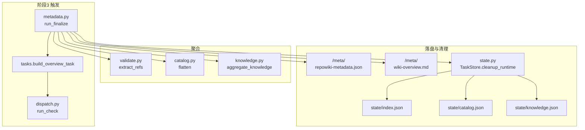
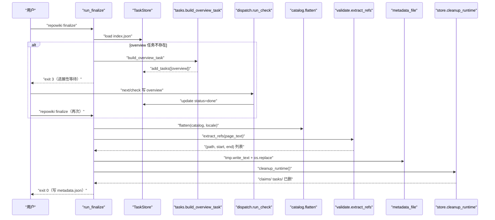
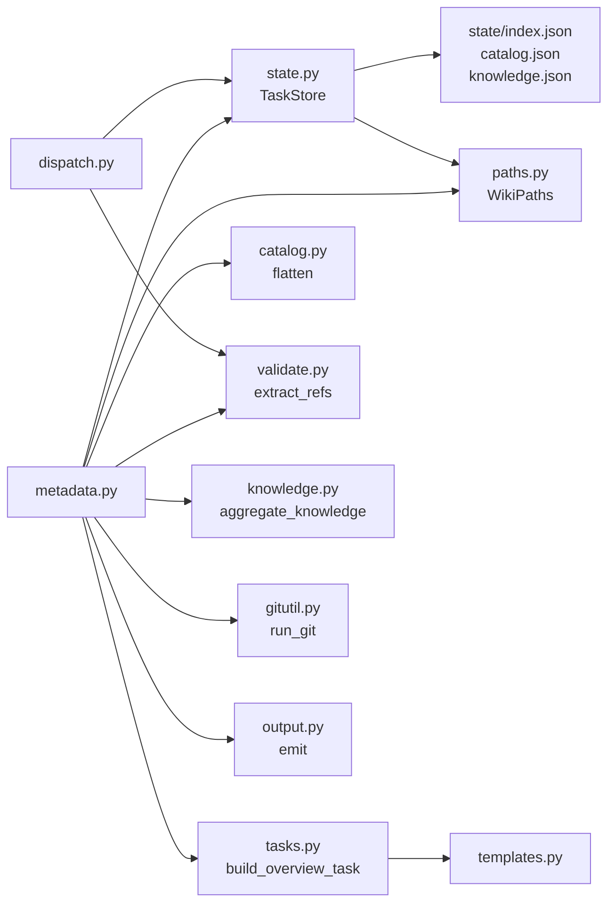

# finalize：阶段收尾与元数据

<cite>
**本文引用的文件**
- [src/repowiki/dispatch.py](file://src/repowiki/dispatch.py)
- [src/repowiki/metadata.py](file://src/repowiki/metadata.py)
- [src/repowiki/tasks.py](file://src/repowiki/tasks.py)
- [src/repowiki/validate.py](file://src/repowiki/validate.py)
- [src/repowiki/knowledge.py](file://src/repowiki/knowledge.py)
- [src/repowiki/state.py](file://src/repowiki/state.py)
- [src/repowiki/catalog.py](file://src/repowiki/catalog.py)
</cite>

## 更新摘要

**变更内容**
- `dispatch.py` 的本次变更（`run_watch` 停滞判定前新鲜复查）不影响本页语义——overview 校验路径 `run_check`/`_check_one` 未变动；仅同步修正行号引用区间（`_check_one` 由 289-336 移至 298-346，文件现为 392 行）。

## 目录
1. [更新摘要](#更新摘要)
2. [简介](#简介)
3. [项目结构](#项目结构)
4. [核心组件](#核心组件)
5. [架构总览](#架构总览)
6. [详细组件分析](#详细组件分析)
7. [依赖关系分析](#依赖关系分析)
8. [性能与一致性考量](#性能与一致性考量)
9. [故障排查指南](#故障排查指南)
10. [结论](#结论)

## 简介
本页聚焦 repowiki 的阶段收尾：`finalize` 命令把全部 done 的页面汇总为 `meta/repowiki-metadata.json` 这一机器可读索引，并把运行时状态目录做最小化瘦身。理解 `finalize` 必须掌握两个对外不显眼但对协作者很关键的契约——overview 两步 finalize（首次创建 overview 任务并退出码 3，再次才写 metadata.json）和 state 清理策略（保留 catalog/index/knowledge，删 claims/tasks，DECISIONS #10）。这两个设计一起保证了「overview 一定存在且与 catalog 同步」、「metadata 写成后仍可做 update 增量更新」这两个看似平常的需求。

## 项目结构
与本页主题相关的目录与文件：

- `src/repowiki/metadata.py`：`run_finalize` —— 首次创建 overview 任务、再次汇总 `repowiki-metadata.json`、原子写入 + 清理运行时产物。
- `src/repowiki/tasks.py`：`build_overview_task` —— 阶段3 overview 任务规格生成；输出 `zh/meta/wiki-overview.md`；spec 写入 `state/tasks/overview.md`。
- `src/repowiki/validate.py`：`extract_refs` —— 从页面正文中抽取 `file://path#Lx-Ly` 形式的源码引用，供 finalize 解析到 `source_files`/`code_snippets`。
- `src/repowiki/knowledge.py`：`aggregate_knowledge` —— 若有 `knowledge.json`，聚合模块与卡片摘要进 metadata。
- `src/repowiki/dispatch.py`：overview 任务由 `_check_one` 中 `check_overview` 校验；状态由 `TaskStore.update` 流转。
- `src/repowiki/state.py`：`TaskStore.cleanup_runtime` —— finalize 成功后清掉 `state/claims/` 与 `state/tasks/`；`load()`/`update()`/`add_tasks()` 等维持 index.json。
- `src/repowiki/catalog.py`：`flatten` —— 把 catalog 树展开为有序 FlatNode 列表，供 finalize 遍历每个节点构建 `wiki_catalogs`/`wiki_items`。
- `src/repowiki/paths.py`：`metadata_file`/`overview_file`/`meta_dir` 等路径常量；locale 决定 `<locale>/meta/` 落盘位置。
- `.repowiki/state/`：运行时状态目录；finalize 成功后会清理 `claims/` 与 `tasks/`，保留 `index.json`/`catalog.json`/`knowledge.json`/`locale`。
- `.repowiki/<locale>/content/`：页面正文；finalize 校验每篇页面文件存在。
- `.repowiki/<locale>/meta/repowiki-metadata.json`：finalize 写出的机器可读索引。
- `.repowiki/<locale>/meta/wiki-overview.md`：overview 任务产出；finalize 把它读进 `wiki_overview` 字段。
- `.repowiki/<locale>/wiki.html`：site 命令渲染的单文件离线 HTML（要求先 finalize）。

图表来源
- [src/repowiki/metadata.py:28-135](file://src/repowiki/metadata.py#L28-L135)
- [src/repowiki/tasks.py:116-130](file://src/repowiki/tasks.py#L116-L130)
- [src/repowiki/dispatch.py:298-346](file://src/repowiki/dispatch.py#L298-L346)
- [src/repowiki/knowledge.py](file://src/repowiki/knowledge.py)

章节来源
- [src/repowiki/metadata.py:1-176](file://src/repowiki/metadata.py#L1-L176)
- [src/repowiki/tasks.py:116-130](file://src/repowiki/tasks.py#L116-L130)
- [src/repowiki/dispatch.py:298-346](file://src/repowiki/dispatch.py#L298-L346)

## 核心组件
- `run_finalize(paths, as_json)`（`metadata.py`）：阶段收尾入口；首次调用创建 overview 任务并返回退出码 3，再次调用写入 `repowiki-metadata.json` 并清理运行时产物。
- `_require_catalog(paths)`（`metadata.py`）：保证 `state/catalog.json` 存在且可解析；损坏时报明确错误（保留现场，绝不静默清空）。
- `extract_refs(text)`（`validate.py`）：从页面正文中解析 `[path:Lx-Ly](file://path#Lx-Ly)` 形式引用为 `(path, start, end)` 三元组，供 finalize 构造 `source_files`/`code_snippets`/`knowledge_relations`。
- `flatten(catalog, locale)`（`catalog.py`）：把 catalog 树展开为有序 FlatNode 列表；用于遍历每个节点构建 `wiki_catalogs`/`wiki_items` 与检查 `path.output` 是否落盘。
- `aggregate_knowledge(paths, plan, tasks)`（`knowledge.py`）：若存在 `state/knowledge.json`，聚合模块与卡片摘要进 metadata；解析失败时显式提示「knowledge.json 解析失败，已跳过聚合」。
- `build_overview_task(paths, repo_name, nodes)`（`tasks.py`）：阶段3 overview 任务规格生成；`OUTPUT=zh/meta/wiki-overview.md`；spec 写入 `state/tasks/overview.md`。
- `check_overview(raw, repo_name, locale)`（`validate.py`）：overview 校验；调用方为 `dispatch._check_one`。
- `TaskStore.cleanup_runtime()`（`state.py`）：原子清理 `state/claims/` 与 `state/tasks/`；保留 `state/index.json`/`catalog.json`/`knowledge.json`/`locale`。
- `paths.metadata_file`/`paths.overview_file`（`paths.py`）：`<locale>/meta/repowiki-metadata.json` 与 `<locale>/meta/wiki-overview.md` 的单一来源。
- `last_commit_id`（`metadata.py`）：调用 `git rev-parse HEAD` 写入 `wiki_repo.last_commit_id`，供 `update` 命令做增量起点。

章节来源
- [src/repowiki/metadata.py:28-176](file://src/repowiki/metadata.py#L28-L176)
- [src/repowiki/tasks.py:116-130](file://src/repowiki/tasks.py#L116-L130)
- [src/repowiki/dispatch.py:298-346](file://src/repowiki/dispatch.py#L298-L346)
- [src/repowiki/state.py](file://src/repowiki/state.py)

## 架构总览
`finalize` 是一条「无页面 → overview 等待 → 全部 done → 聚合元数据 → 写盘 + 清理」的状态机。`run_finalize` 先 `TaskStore.load()` 检查 index.json；若不存在 `overview` 任务则构造一个并 `add_tasks` 进索引，返回退出码 3（进展性等待，非错误）。agent 领取 overview、写入 `wiki-overview.md`、`check --task overview` 通过后，再次 `finalize`：`flatten(catalog, locale)` 拿到有序节点列表，逐节点 `extract_refs` 抽取源码引用，构造 `source_files`/`code_snippets`/`knowledge_relations`；若 `overview_file` 存在则读其正文进 `wiki_overview`；若有 `knowledge.json` 则 `aggregate_knowledge` 聚合摘要；最后 `tmp.write_text` + `os.replace` 原子写 `repowiki-metadata.json`，并 `store.cleanup_runtime()` 清掉 `state/claims/` 与 `state/tasks/`。

图表来源
- [src/repowiki/metadata.py:28-135](file://src/repowiki/metadata.py#L28-L135)
- [src/repowiki/tasks.py:116-130](file://src/repowiki/tasks.py#L116-L130)
- [src/repowiki/dispatch.py:298-346](file://src/repowiki/dispatch.py#L298-L346)

章节来源
- [src/repowiki/metadata.py:1-176](file://src/repowiki/metadata.py#L1-L176)
- [src/repowiki/tasks.py:1-238](file://src/repowiki/tasks.py#L1-L238)
- [src/repowiki/dispatch.py:1-392](file://src/repowiki/dispatch.py#L1-L392)

## 详细组件分析
### overview 两步 finalize
- 职责：保证 overview 一定存在且与 catalog 同步，避免「章节顺序与 overview 不一致」的诡异情况。
- 关键行为：`run_finalize` 在 index.json 加载后判断 `overview` 是否已存在；不存在则 `_require_catalog` 读 `state/catalog.json`，`flatten(catalog, paths.locale)` 拿到节点列表，`build_overview_task` 构造阶段3 overview 任务，`store.add_tasks` 投放，调用 `_emit_progress` 输出 `next_action`，返回退出码 3（DECISIONS #7——首次退出码 3 表达进展，非错误）；agent 写完 overview 并 `check --task overview` 通过后，再次 `finalize` 才进入主路径。
- 实现要点：首次调用产出 `state/tasks/overview.md` 与 `index.json` 中 `overview` 记录，但不写 `metadata.json`；agent 必须把 overview 写到 `zh/meta/wiki-overview.md`（`paths.overview_file`）才会被 finalize 主路径读到。

章节来源
- [src/repowiki/metadata.py:28-41](file://src/repowiki/metadata.py#L28-L41)
- [src/repowiki/tasks.py:116-130](file://src/repowiki/tasks.py#L116-L130)

### metadata.json 字段契约
- 职责：把全部 done 的页面汇总为机器可读索引，供外部工具（站点渲染、增量更新、知识聚合）消费。
- 关键行为：`wiki_repo` 含 `id`（仓库根的 md5）、`name`、`progress_status="completed"`、`wiki_present_status="COMPLETED"`、`locale`、`last_commit_id`（`git rev-parse HEAD`）、`generated_at`（`now_iso`）；`wiki_catalogs` 为每个 FlatNode 一条记录（`id`/`repo_id`/`name`/`description=slug`/`prompt=page_brief`/`parent_id`/`dependent_files`/`progress_status`）；`wiki_items` 简化为 `[{catalog_id, title}]`；`source_files` 由 `extract_refs` 抽出的所有文件路径去重构成（`id` = md5(path)），按 `path` 排序；`code_snippets` 由所有 `(path, start, end)` 引用构成（`id` = md5(path + rng)，`line_range` 形如 `"10-20"`），按 `(path, line_range)` 排序；`knowledge_relations` 是有向关系列表，包含 `CONTAINS`（页面 → 源文件）与 `REFERENCED_BY`（代码片段 → 页面）。
- 实现要点：`source_files`/`code_snippets`/`relations` 由三层 `for` 循环构造——遍历 `nodes`，对每篇页面 `extract_refs`，对每个 `(path, start, end)` 三元组生成 `source_files` 与 `relations`，`start is not None` 时再生成 `code_snippets` 与反向 `REFERENCED_BY`；`rng` 形如 `"10-20"`（end 与 start 不同时）或 `"10-10"`（仅锚点时）；`overview_file` 存在时整段正文读进 `wiki_overview`，否则占位 `"No overview yet."`。

章节来源
- [src/repowiki/metadata.py:60-114](file://src/repowiki/metadata.py#L60-L114)

### 原子写盘与 state 清理
- 职责：保证 metadata.json 写入不被中断产生半截文件，并最小化运行时状态目录体积。
- 关键行为：`paths.meta_dir.mkdir(parents=True, exist_ok=True)` 后用 `tmp = paths.metadata_file.with_name(".metadata.tmp")` 写临时文件，再 `os.replace(tmp, paths.metadata_file)` 原子替换；写盘后 `store.cleanup_runtime()` 清掉 `state/claims/` 与 `state/tasks/`，返回被清理的目录列表；`summary["cleaned_runtime"]` 在 human 格式中以「state/claims/、state/tasks/」呈现并附「保留 index/catalog/knowledge 供增量更新」。
- 实现要点：原子写盘用 `os.replace`（POSIX 下原子；Windows 下同样原子）而非先删再写，避免中途崩溃产生半截 `repowiki-metadata.json`；`cleanup_runtime` 不删 `state/index.json`/`catalog.json`/`knowledge.json`/`locale`，这些是 `update` 与幂等 plan 的依据（DECISIONS #10）；不需要增量更新可执行 `repowiki clean <repo>` 删除整个 state/。

章节来源
- [src/repowiki/metadata.py:118-135](file://src/repowiki/metadata.py#L118-L135)
- [src/repowiki/metadata.py:138-147](file://src/repowiki/metadata.py#L138-L147)

### 知识库聚合
- 职责：若存在 `state/knowledge.json`，把模块与卡片摘要聚合进 metadata。
- 关键行为：`_aggregate_knowledge_if_present` 在 finalize 主路径末尾调用；`paths.knowledge_plan_file` 不存在则返回空串（不报错）；`json.loads` 失败时返回 `"knowledge.json 解析失败，已跳过聚合"`（保留现场）；成功时调用 `knowledge.aggregate_knowledge(paths, plan, store.load()["tasks"])` 返回聚合摘要。
- 实现要点：知识聚合独立于页面聚合——`finalize` 容忍 `knowledge.json` 损坏或缺失，页面 wiki 仍可正常生成；聚合摘要写到 `summary["knowledge"]`，再在 human 输出 `✓ metadata 已生成... 知识库: <摘要>`。

章节来源
- [src/repowiki/metadata.py:167-176](file://src/repowiki/metadata.py#L167-L176)

### 终态校验与失败分支
- 职责：在写盘之前把可能产生「幽灵条目」或「未完成」的失败路径全部堵住。
- 关键行为：`_require_catalog` 缺失或损坏抛 `UsageError`；`missing_pages` 检查 catalog 中每个 FlatNode 对应 `paths.root / n.output` 是否存在（`--max-pages` 试跑不再产生幽灵条目，DECISIONS #11）；`unfinished` 检查 index.json 中所有任务状态均为 `done`，否则抛 `UsageError("仍有 N 个任务未完成")`；`no_tasks` 检查 index.json 是否为空（未 plan）抛 `UsageError("没有任务，请先运行 plan")`。
- 实现要点：所有错误都通过 `UsageError` 抛给 `cli.main`，最终以退出码 1 退出并在 stderr 输出 human 副本；这些校验是有顺序的（catalog 存在 → 页面存在 → 任务全部 done），任一环节失败都不会写出半截 metadata。

章节来源
- [src/repowiki/metadata.py:28-58](file://src/repowiki/metadata.py#L28-L58)
- [src/repowiki/metadata.py:156-164](file://src/repowiki/metadata.py#L156-L164)

## 依赖关系分析
- `metadata.py` → 支撑：调用 `TaskStore` 的 `load`/`add_tasks`/`update`/`cleanup_runtime`；调用 `tasks.build_overview_task` 构造 overview 任务；调用 `catalog.flatten` 拿到有序节点；调用 `validate.extract_refs` 解析源码引用；调用 `knowledge.aggregate_knowledge`（按需）聚合知识库；调用 `gitutil.run_git` 拿 `last_commit_id`；调用 `output.emit` 输出结果。
- `metadata.py` → 路径：依赖 `paths.WikiPaths` 的 `catalog_file`/`overview_file`/`metadata_file`/`meta_dir`/`locale`/`repo_root` 等属性。
- `tasks.py` → 模板：`build_overview_task` 使用 `templates.render_file("overview_task.md", ...)` 与 `templates.load("STYLE.md", paths.locale)` 拼装规格。
- `dispatch.py` → 校验：`run_check` 中 `_check_one` 调用 `check_overview(raw, repo_name, locale=paths.locale)` 校验 overview；状态由 `TaskStore.update(tid, status="done")` 流转。
- `state.py` → 路径：`TaskStore` 围绕 `state/index.json`/`state/tasks/`/`state/claims/` 操作；`cleanup_runtime` 仅清理 `claims/` 与 `tasks/`，保留 `index.json`/`catalog.json`/`knowledge.json`。
- 数据契约：`state/catalog.json` 是 finalize 必备输入；`state/knowledge.json` 是可选输入；`state/index.json` 是状态机唯一真相源；`<locale>/meta/repowiki-metadata.json` 是 finalize 写出的机器可读产物（其 `wiki_repo.last_commit_id` 是 update 的默认起点）；`<locale>/meta/wiki-overview.md` 是 overview 任务的产出，finalize 主路径读其正文进 `wiki_overview`。

图表来源
- [src/repowiki/metadata.py:1-22](file://src/repowiki/metadata.py#L1-L22)
- [src/repowiki/tasks.py:116-130](file://src/repowiki/tasks.py#L116-L130)
- [src/repowiki/dispatch.py:298-346](file://src/repowiki/dispatch.py#L298-L346)

章节来源
- [src/repowiki/metadata.py:1-176](file://src/repowiki/metadata.py#L1-L176)
- [src/repowiki/tasks.py:1-238](file://src/repowiki/tasks.py#L1-L238)
- [src/repowiki/dispatch.py:1-392](file://src/repowiki/dispatch.py#L1-L392)
- [src/repowiki/state.py](file://src/repowiki/state.py)
- [src/repowiki/validate.py](file://src/repowiki/validate.py)
- [src/repowiki/knowledge.py](file://src/repowiki/knowledge.py)

## 性能与一致性考量
- 阶段门控：`finalize` 仅在所有页面任务 done 后才写 metadata.json；首次调用若 overview 缺失则创建阶段3 overview 任务并退出码 3——保证 metadata 一定含有 overview。
- 原子写盘：`tmp.write_text + os.replace` 替换 metadata_file，避免中途崩溃产生半截 JSON；与状态机的 flock 串行化共同保证一致性。
- state 清理策略：finalize 成功后只清 `state/claims/` 与 `state/tasks/`，保留 `state/index.json`/`catalog.json`/`knowledge.json`/`locale`——既最小化运行时状态体积，又不破坏 `update` 的增量映射（依赖 `catalog.json` 的 `dependent_files` 与树结构）；不需要增量更新可 `repowiki clean <repo>` 删除整个 state/。
- 字段去重：`source_files`/`code_snippets` 都以 md5(path) / md5(path + rng) 作 id 去重；`relations` 是有序追加，单页面多次引用同一文件/片段只贡献一条 `CONTAINS`/`REFERENCED_BY` 记录（snippet 重复则 id 命中跳过）。
- 幽灵条目防御：`missing_pages` 检查 catalog 中每个 FlatNode 对应 `paths.root / n.output` 是否存在（`--max-pages` 试跑不再产生幽灵条目，DECISIONS #11）。
- last_commit_id：`git rev-parse HEAD` 在 finalize 时记录到 `wiki_repo.last_commit_id`，供 `update --since` 不带显式起点时使用；`HEAD` 不存在则记为 `null`。
- 知识聚合容错：`knowledge.json` 缺失返回空串、损坏返回 `"knowledge.json 解析失败，已跳过聚合"`——页面 finalize 不被知识库错误阻塞。
- overview 内容回写：`overview_file` 存在则整段正文读进 `metadata["wiki_overview"]`，否则占位 `"No overview yet."`——保证字段始终是字符串而非缺失。
- 进度性等待退出码：首次 `finalize` 返回退出码 3（不是 1），agent 看到 3 应该继续执行 overview 任务并再次 finalize，而非中断；这是 P0/P1 评审修复的明确语义（DECISIONS #11）。

章节来源
- [src/repowiki/metadata.py:28-135](file://src/repowiki/metadata.py#L28-L135)
- [src/repowiki/metadata.py:138-176](file://src/repowiki/metadata.py#L138-L176)

## 故障排查指南
- 现象：`没有任务，请先运行 repowiki plan <repo>`。成因：未 plan 或 `clean` 后未重 plan。解决：先 `repowiki plan <repo>`。
- 现象：`state/catalog.json 不存在：请先完成 catalog 任务`。成因：catalog 任务未 done 或被 `clean`。解决：先完成 catalog 任务再 finalize。
- 现象：`state/catalog.json 损坏（JSON parse error）`。成因：catalog.json 解析失败。解决：保留现场排查，或 `repowiki plan --replan` 重新规划。
- 现象：`catalog 中有 N 个页面尚未生成`。成因：catalog 中某些 FlatNode 对应的 `paths.root / n.output` 不存在（`--max-pages` 试跑或任务未完成）。解决：补齐页面再 finalize，或 `plan --replan` 重来。
- 现象：`仍有 N 个任务未完成`。成因：存在非 done 状态的任务（pending/in_progress/failed/exhausted）。解决：领取并完成所有任务，或 `release --force` 重置 exhausted。
- 现象：`finalize` 首次退出码 3。成因：进展性等待——首次运行创建 overview 任务并退出码 3（不是错误）。解决：领取 overview 任务，写 `zh/meta/wiki-overview.md` 并 `check --task overview`，再次 `finalize`。
- 现象：`metadata.json` 写盘后立刻再次写仍可能读到旧内容（极少见）。成因：原子替换应保证可见性；若出现，多半是缓存或外部工具问题。解决：直接读盘验证；`update` 失败时也应优先怀疑缓存。
- 现象：`knowledge.json 解析失败，已跳过聚合`。成因：knowledge.json 损坏。解决：保留现场排查；页面 wiki 仍可正常 finalize，只是 `knowledge_relations` 不含知识库模块/卡片摘要。
- 现象：`update` 报「无法确定增量起点：metadata 中无 last_commit_id」。成因：metadata 中 `wiki_repo.last_commit_id` 缺失（finalize 时 `git rev-parse HEAD` 失败或仓库非 git）。解决：用 `update --since <commit>` 显式指定；非 git 仓库不支持增量更新。
- 现象：`finalize` 成功后 `state/claims/` 与 `state/tasks/` 被清空。成因：DECISIONS #10 的 state 清理策略——finalize 自动清除运行时产物。解决：这是预期行为；若不需要增量更新可 `repowiki clean` 删除整个 state/。
- 现象：metadata.json 含 `"No overview yet."`。成因：finalize 时 `paths.overview_file` 不存在（overview 任务未完成或写错路径）。解决：完成 overview 任务并再次 `finalize`。

章节来源
- [src/repowiki/metadata.py:28-135](file://src/repowiki/metadata.py#L28-L135)
- [src/repowiki/metadata.py:156-176](file://src/repowiki/metadata.py#L156-L176)
- [src/repowiki/tasks.py:116-130](file://src/repowiki/tasks.py#L116-L130)

## 结论
`finalize` 是 repowiki 的阶段收尾命令：首次调用在所有页面 done 且无 overview 时创建阶段3 overview 任务并退出码 3（进展性等待），agent 写完 overview 并 check done 后再次调用才真正汇总 `repowiki-metadata.json` 并清理 `state/claims/` 与 `state/tasks/`。理解这条流水线要抓住三个核心：原子写盘（`tmp + os.replace`）、状态清理策略（保留 catalog/index/knowledge，删 claims/tasks，DECISIONS #10）、幽灵条目防御（`missing_pages` 校验每篇页面落盘）。正确使用方式是：先确保所有页面任务 done → `finalize`（可能得到退出码 3）→ 写 overview 并 check done → 再次 `finalize`（得到退出码 0 与 metadata.json）→ `site` 渲染单文件 HTML → 后续用 `update --since` 做增量更新；任何环节出错都有显式 `UsageError` 或退出码分支指引。

章节来源
- [src/repowiki/metadata.py:1-176](file://src/repowiki/metadata.py#L1-L176)
- [src/repowiki/tasks.py:1-238](file://src/repowiki/tasks.py#L1-L238)
- [src/repowiki/dispatch.py:1-392](file://src/repowiki/dispatch.py#L1-L392)
