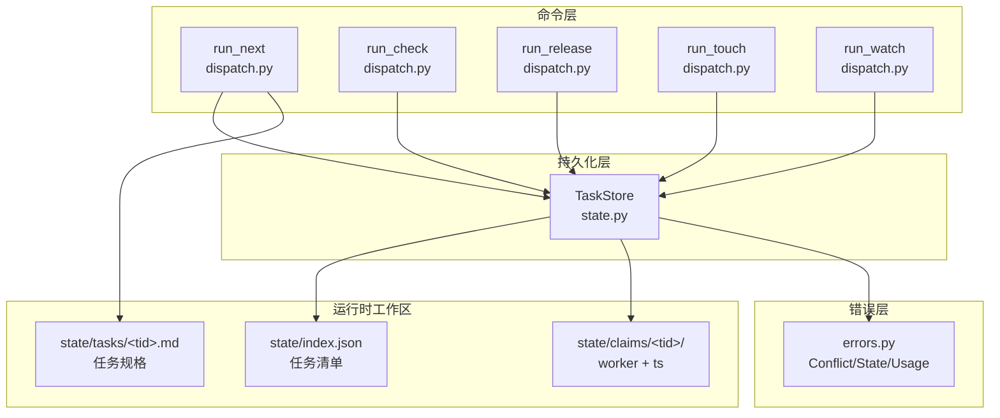
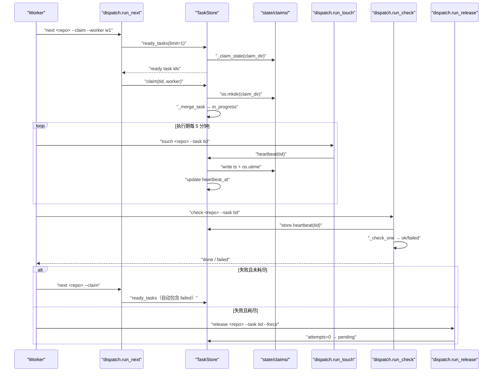
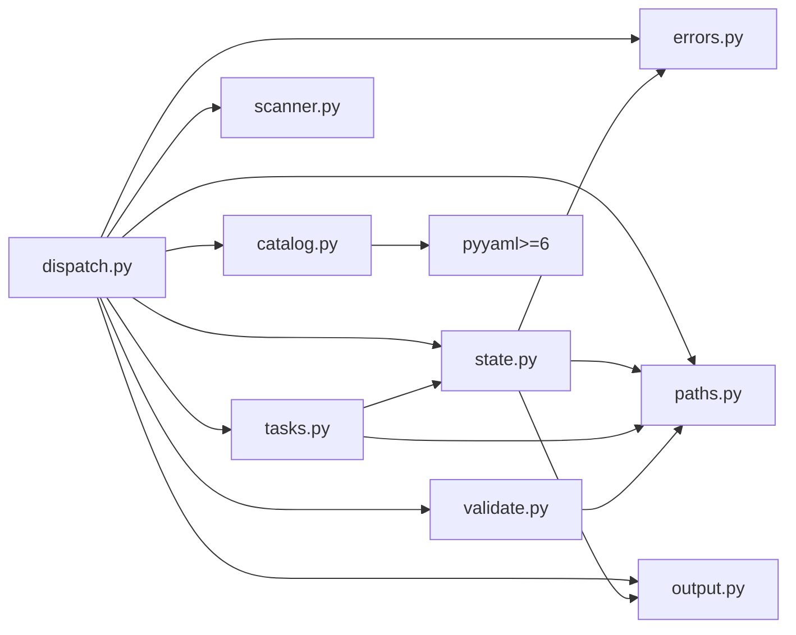

# next/check/release/touch：认领与回收

<cite>
**本文引用的文件**
- [src/repowiki/dispatch.py](file://src/repowiki/dispatch.py)
- [src/repowiki/state.py](file://src/repowiki/state.py)
- [src/repowiki/errors.py](file://src/repowiki/errors.py)
</cite>

## 更新摘要

**变更内容**
- 更新 `state.py` 的索引读取并发模型：`load()` 现在与写方共用同一把锁（新增 `_load_unlocked` 供 `_transaction` 内部使用，避免锁自死锁）——根因是 CPython 在 Windows 上打开文件不带 `FILE_SHARE_DELETE`，无锁读会让并发写方的 `os.replace` 失败；同时新增 `_retry_windows_fs`，对 Windows 文件竞态的 `PermissionError` 做短暂重试（[src/repowiki/state.py:35-49](file://src/repowiki/state.py#L35-L49)、[src/repowiki/state.py:100-142](file://src/repowiki/state.py#L100-L142)）。
- 同步纳入 `dispatch.py` 的 watch 停滞判定新鲜复查变更，并修正两文件的行号引用（`dispatch.py` 现 392 行、`state.py` 现 437 行）。

## 目录
1. [更新摘要](#更新摘要)
2. [简介](#简介)
3. [项目结构](#项目结构)
4. [核心组件](#核心组件)
5. [架构总览](#架构总览)
6. [详细组件分析](#详细组件分析)
7. [依赖关系分析](#依赖关系分析)
8. [性能与一致性考量](#性能与一致性考量)
9. [故障排查指南](#故障排查指南)
10. [结论](#结论)

## 简介
「next / check / release / touch：认领与回收」描述 repowiki 并发安全的核心机制：worker 如何用 `os.mkdir` 的原子性抢占任务、过期认领如何在下一轮 `next` 中自动复活、`touch` 与 `check` 如何双保险保住心跳、以及 `REPOWIKI_STALE_SECONDS / REPOWIKI_MAX_ATTEMPTS` 两个环境变量如何调节这套节拍。这一组命令是 Worker 循环契约的真正底层——它们共同保证「崩溃/被杀的 worker 不会留下孤儿认领」「心跳是唯一的存活信号」「尝试超限的失败任务进入 exhausted 状态需要 `--force` 显式重置」等不变量。

## 项目结构
围绕认领与回收这条主线，仓库内相关的产物集中在以下几个位置（路径相对仓库根）：

- `src/repowiki/state.py`：TaskStore 类集中承载「原子认领 / 过期判定 / 心跳 / 释放 / 统计 / 状态翻转」全部持久化逻辑；`DEFAULT_STALE_SECONDS = 15 * 60`、`max_attempts()` 都从这里导出；索引读取与写方共用锁，Windows 文件竞态由 `_retry_windows_fs` 短暂重试。
- `src/repowiki/dispatch.py`：把 TaskStore 包装为 `next / check / release / touch / status / watch` 六个 `run_*` 命令；`_worker_id()` 生成默认 worker 名（hostname:pid）。
- `src/repowiki/errors.py`：定义 `ConflictError / StateError / UsageError` 三个异常，是 `claim / release / touch` 抛错的统一出口；模块刻意保持零依赖（叶子模块），方便各命令模块导入而不造成循环 import。
- `.repowiki/state/claims/<task_id>/`：运行时认领目录，目录下放 `worker`（持有者名）与 `ts`（心跳时间戳）两个小文件；目录本身的 mtime 被当作「过期判定」的真实信号。
- `.repowiki/state/index.json`：任务清单的持久化文件，`TaskStore.load/_save_atomic/_transaction` 是读写边界。

图表来源
- [src/repowiki/state.py:76-142](file://src/repowiki/state.py#L76-L142)
- [src/repowiki/dispatch.py:49-128](file://src/repowiki/dispatch.py#L49-L128)

章节来源
- [src/repowiki/state.py:1-100](file://src/repowiki/state.py#L1-L100)
- [src/repowiki/dispatch.py:1-50](file://src/repowiki/dispatch.py#L1-L50)
- [src/repowiki/errors.py:1-21](file://src/repowiki/errors.py#L1-L21)

## 核心组件
- `os.mkdir` 抢占原语：唯一的并发安全基础——`mkdir` 在目录已存在时抛 `FileExistsError`，与「单一原子操作」语义天然契合。
- `TaskStore`：状态持久化与认领生命周期管理的统一门面；提供 `load / _load_unlocked / _save_atomic / _transaction / _merge_task / claim / release / heartbeat / touch / ready_tasks / stats` 等核心方法；`load` 与写方共用锁，`_load_unlocked` 仅限事务内部调用。
- `_claim_dir / _claim_age / _claim_stale`：认领目录路径、年龄读取、过期判定三件套；`_claim_age` 读的是**目录自身 mtime** 而非 `ts` 文件，因为 `ts` 文件在 `mkdir` 后才创建，读它会让新认领看起来「无穷老」被立即抢走。
- `run_next / run_touch / run_release / run_check / run_watch`：dispatch 层的运行时交互入口；其中 `run_watch` 把过期认领从 `in_flight` 中剔除避免假活，并在宣布停滞前用新鲜 `stats()` 复查避免假停滞。
- `errors.ConflictError`：所有「认领冲突 / 释放冲突 / touch 错持有者」场景的统一异常出口，由 `cli.main()` 映射为 exit code 2。

章节来源
- [src/repowiki/state.py:21-32](file://src/repowiki/state.py#L21-L32)
- [src/repowiki/state.py:245-308](file://src/repowiki/state.py#L245-L308)
- [src/repowiki/state.py:310-367](file://src/repowiki/state.py#L310-L367)
- [src/repowiki/errors.py:12-21](file://src/repowiki/errors.py#L12-L21)

## 架构总览
从「一次完整的认领 - 心跳 - 校验 - 释放」循环看，时序如下：`next` 阶段先调用 `ready_tasks(limit=1)` 计算候选集（pending/failed 且未到 attempts 上限，或 in_progress 但 `claim_stale` 为真），按 `(attempts, phase, order)` 排序后取第一条；`claim` 用 `_try_mkdir_claim` 原子建目录，竞争失败或认领未过期时抛 `ConflictError`。执行期间 worker 每隔几分钟调 `touch`，`heartbeat` 同时刷新认领目录 mtime 与 `ts` 文件，并把 `task.heartbeat_at` 写回 `index.json`。`check` 进入后会对非 done 任务调 `store.heartbeat(tid)`（`dispatch.py:256`），对其他 worker 持有的活认领抛 `ConflictError`。`release` 把 `in_progress` 任务回 `pending`，对 exhausted 任务（`attempts >= cap`）要求 `--force` 显式重置。下图给出一个典型认领-心跳-校验-失败-重试循环。

图表来源
- [src/repowiki/state.py:219-292](file://src/repowiki/state.py#L219-L292)
- [src/repowiki/dispatch.py:49-128](file://src/repowiki/dispatch.py#L49-L128)
- [src/repowiki/dispatch.py:174-263](file://src/repowiki/dispatch.py#L174-L263)

章节来源
- [src/repowiki/state.py:219-341](file://src/repowiki/state.py#L219-L341)
- [src/repowiki/dispatch.py:1-50](file://src/repowiki/dispatch.py#L1-L50)

## 详细组件分析

### `_try_mkdir_claim`：原子认领与过期抢占
- 职责：用 `os.mkdir` 的原子性完成「单一认领者」保证；遇到目录已存在时根据 `claim_stale` 决定让位或放弃。
- 关键行为：循环最多三次，每次尝试 `os.mkdir(cd)`：若抛 `FileExistsError` 则检查 `claim_stale(cd)`——若未过期直接返回 `False`（他人活认领），若过期则把目录改名为 `.stale-<tid>-<uuid6>` 留痕后重试；`mkdir` 成功后立即写入 `worker` 与 `ts` 两个文件。
- 实现要点：文件名带 `uuid` 是为了让多名 racer 即使同时抢同一过期认领也只有一个能赢——失败的 racer 在 `os.rename` 阶段抛 `OSError`，被外层 `continue` 跳过后重新尝试 `mkdir`，这时新目录已被赢家建好，于是返回 `False`。失败兜底是三次后 `return False`，由上层 `claim()` 转抛 `ConflictError`。

章节来源
- [src/repowiki/state.py:247-292](file://src/repowiki/state.py#L247-L292)
- [src/repowiki/state.py:294-308](file://src/repowiki/state.py#L294-L308)

### `ready_tasks`：过期复活与优先级排序
- 职责：把当前 phase 内「真正可领取」的任务按优先级返回——pending/failed（未达 attempts 上限）或 in_progress 但 `claim_stale` 为真。
- 关键行为：先调 `current_phase(data)` 拿到「还有未完成任务的最早 phase」；再筛 `(phase == current_phase) and ((pending/failed 且未耗尽) or (in_progress 且 _claim_stale))`；最后按 `(attempts, phase, order)` 排序取前 `limit` 个。
- 实现要点：order 来自 `enumerate(data["tasks"])`，等于任务在 `index.json` 中的出现顺序——保证幂等 plan 下任务领取顺序稳定；`attempts` 升序优先让「少试过的任务」先被领到，避免「总是尝试最新的一批」造成的饥饿；`phase` 升序保证阶段门控。

**章节来源**
- [src/repowiki/state.py:219-243](file://src/repowiki/state.py#L219-L243)

### `touch` / `check` 心跳：保活双保险
- 职责：保证正在执行中的任务在 `stale_seconds` 窗口内不会被其他 worker 当作过期抢占。
- 关键行为：`TaskStore.touch(task_id, worker)` 先做持有者校验（worker 与 claim 目录 `worker` 文件不一致时抛 `ConflictError`），再调 `heartbeat`：写新 `ts` 文件 + `os.utime(cd)` 刷新目录 mtime + 更新 `index.json` 的 `heartbeat_at` 字段。`run_check` 在校验非 done 任务时也会顺手调 `store.heartbeat(tid)`（`dispatch.py:256`），确保 worker 仅在 check 阶段就足够长的纯同步任务也能保活。
- 实现要点：`os.utime(cd)` 是关键——只更新 `heartbeat_at` 而不刷新目录 mtime 的话，`_claim_stale` 仍会按旧 mtime 判定为过期。worker 在执行期每 ~5 分钟显式 `touch`，check 阶段 `heartbeat` 是兜底；两层保险下即便 worker 偶尔忘了 touch，校验代码也会刷新认领。

**章节来源**
- [src/repowiki/state.py:343-367](file://src/repowiki/state.py#L343-L367)
- [src/repowiki/dispatch.py:118-125](file://src/repowiki/dispatch.py#L118-L125)
- [src/repowiki/dispatch.py:254-258](file://src/repowiki/dispatch.py#L254-L258)

### `load` 的读锁与 Windows 文件竞态重试
- 职责：保证 `index.json` 的读不破坏并发写——尤其在 Windows 上，无锁读会让 `os.replace` 换入新索引失败。
- 关键行为：`load()` 在读取前先拿与写方相同的排他锁（文件不存在时直接返回空结构，不碰锁）；`_load_unlocked` 供 `_transaction` 内部使用——事务已持锁，再走 `load` 会自死锁；JSON 解析与 `os.replace` 都包在 `_retry_windows_fs` 里，遇 `PermissionError` 以 50ms 间隔最多重试 20 次。
- 实现要点：根因是 CPython 在 Windows 打开文件时不带 `FILE_SHARE_DELETE`——一个进程持有文件句柄期间，另一进程对同一路径的 `open()`/`replace()` 会得到 `PermissionError`；窗口在亚毫秒级，重试即可越过。损坏保护不变：`JSONDecodeError` 仍抛 `StateError`，绝不静默当作空清单。

章节来源
- [src/repowiki/state.py:35-49](file://src/repowiki/state.py#L35-L49)
- [src/repowiki/state.py:100-142](file://src/repowiki/state.py#L100-L142)

### `release` 与 attempts 上限：exhausted 状态
- 职责：把 `in_progress` 任务回 `pending`，或把 exhausted 毒任务显式重置。
- 关键行为：若 `status == failed and attempts >= cap`，先抛 `ConflictError`（要求 `--force` 显式重置）——这是 exhausted 状态保护，避免无限重试同一坏任务；通过后清零 attempts 并把状态改回 `pending`。非 exhausted 分支：先校验持有者（`claim_dir/worker` 文件与 `task.worker` 不一致时要求 `--force`），再把 `claim_dir` 改名为 `.released-<tid>-<uuid6>` 留痕，最后清空 worker 字段。
- 实现要点：`cap = max_attempts()` 来自 `REPOWIKI_MAX_ATTEMPTS` 环境变量（默认 3）；rename 用 `uuid` 防止并发 release 把同一目录覆盖到同一个 `.released-*` 名上引发 `OSError`。

**章节来源**
- [src/repowiki/state.py:310-341](file://src/repowiki/state.py#L310-L341)
- [src/repowiki/state.py:24-29](file://src/repowiki/state.py#L24-L29)

### `watch` 的「不假活、不假停」语义
- 职责：阻塞监控直到全部任务完成或停滞/超时，期间把过期认领从 `in_flight` 中剔除。
- 关键行为：每 `interval` 拉一次 `store.stats()`，构造 `stale_ids = {s["id"] for s in stats["stale_claims"]}`；`in_flight` 只统计 `status == in_progress and id not in stale_ids` 的活认领；停滞判断为「无 in_flight 且无可领取」即认为全部 worker 死亡，返回 exit code 1 与 `reason="stalled"`——但宣布停滞前先用新鲜的 `store.stats()` 复查一次，若任务恰好在快照间隙全部完成则按 completed 正常退出（exit 0）。
- 实现要点：若不剔除过期认领，watch 永远看不到「全员死亡」信号——这是 early version 的常见 bug；而不做新鲜复查，任务在快照与判定之间完成时会误报假停滞。两端协同把「死认领」与「快照过期」两种竞态都消除了。

**章节来源**
- [src/repowiki/dispatch.py:126-199](file://src/repowiki/dispatch.py#L126-L199)
- [src/repowiki/state.py:385-419](file://src/repowiki/state.py#L385-L419)

## 依赖关系分析
- `TaskStore` 依赖：`errors`（三个异常）、`output.emit`（用于 `run_clean`，[src/repowiki/state.py:421-437](file://src/repowiki/state.py#L421-L437)）、`paths.WikiPaths`（路径解析）——是「持久化+状态机」的叶子；不依赖 dispatch。
- `dispatch` 依赖 `state.TaskStore`、`catalog.flatten / validate_catalog`、`errors.ConflictError / UsageError`、`output.emit`、`paths.WikiPaths`、`tasks`（任务构造器）、`scanner.scan`、`validate`（各 check_* 函数）——是编排核心。
- `errors` 是纯叶子：定义三个异常类，**没有任何仓内依赖**（`errors.py:1-21`）——这是刻意设计，让任何模块都可以无循环地抛错。
- 第三方依赖极少：`pyyaml>=6` 由 `catalog.py` 等 frontmatter 解析处使用；`state.py` 自身仅依赖标准库（`os/json/uuid/fcntl/msvcrt` 等）与仓内模块。

图表来源
- [src/repowiki/dispatch.py:14-27](file://src/repowiki/dispatch.py#L14-L27)
- [src/repowiki/state.py:17-19](file://src/repowiki/state.py#L17-L19)

章节来源
- [src/repowiki/dispatch.py:1-50](file://src/repowiki/dispatch.py#L1-L50)
- [src/repowiki/state.py:1-100](file://src/repowiki/state.py#L1-L100)
- [src/repowiki/errors.py:1-21](file://src/repowiki/errors.py#L1-L21)

## 性能与一致性考量
- 原子认领成本：单次 `_try_mkdir_claim` 最多三次 `mkdir` 尝试；正常情况下第一次即成功，竞争时多一两次 `stat` + 可能的 `mkdir`——单进程无锁、无 syscall 抖动。
- 索引读写：所有 `index.json` 变更走 `_transaction`，内部拿 `_exclusive_lock`（POSIX 用 `fcntl.flock`、Windows 用 `msvcrt.locking`），保证多进程下的读写原子性；读方（`load`）现在也拿同一把锁——读锁持有时间亚毫秒级，热读路径是轮询而非紧旋转，开销可忽略；事务内部用 `_load_unlocked` 避免重复加锁。Windows 上 `os.replace` 与读句柄的竞态由 `_retry_windows_fs` 以 20 次 × 50ms 重试兜底。每次只 `_merge_task` 单个任务，缩小读改写窗口。
- 损坏保护：`TaskStore.load` 在 `json.JSONDecodeError` 时抛 `StateError`（`state.py:127-135`），**绝不静默重置**——否则下次 `_transaction` 会用只含一个 touched task 的 data 把整个清单覆盖。
- 过期判定成本：`_claim_stale` 一次 `stat` 检查 mtime + 阈值比较；在 N 个认领时仍是 O(N) 扫描（`stats()` 与 `ready_tasks()` 都会跑），但 N 通常很小（最多数十个并发认领）。
- attempt 上限：`max_attempts()` 从环境变量读，默认 3——这是「可重试性」与「毒任务容忍」之间的折中；调小会更快陷入 exhausted，调大则让失败任务重试更久。
- stale 窗口：`stale_seconds` 默认 15 分钟（`DEFAULT_STALE_SECONDS = 15 * 60`）——比典型 5 分钟 touch 间隔大 3 倍，给长任务足够缓冲；用户可在 CI 上调小（`REPOWIKI_STALE_SECONDS=300`）让僵尸更早被回收。
- 心跳的双保险：`touch` 主动续期 + `check` 顺手 `heartbeat`，两层互不依赖；即便 worker 忘了 touch、check 也跑得很频繁（例如知识卡片任务），认领仍不会过期。

章节来源
- [src/repowiki/state.py:21-142](file://src/repowiki/state.py#L21-L142)
- [src/repowiki/state.py:219-341](file://src/repowiki/state.py#L219-L341)
- [src/repowiki/dispatch.py:126-263](file://src/repowiki/dispatch.py#L126-L263)

## 故障排查指南
- 退出码 `2`（`ConflictError`）：最常见是「任务正被其他 worker 执行中」（`state.py:297-299`）；先看 `repowiki status` 的 `stale_claims` 段：若 worker 已死，等过期回收；若 worker 仍活，等待或联系对方；exhausted 任务需要 `--force`（`state.py:314-318`）。
- 退出码 `1`（`StateError`）：`index.json` 损坏时 `TaskStore.load` 抛出并附带「文件已原样保留 / 可修复 / `plan --replan --force` 重来」的指引（`state.py:127-135`）；不要直接删 `index.json`，否则任务清单全部丢失、只能 `plan --replan --force` 重建。
- 退出码 `1`（`UsageError`）：如「任务不存在」「任务已 done 无需认领」「fcntl/msvcrt 不可用」（`state.py:52-74`、`errors.py:20-21`）等；定位信息在 `args.func` 抛错处的 `raise UsageError("...")` 调用上。
- Windows 下读写 `index.json` 报 `PermissionError`：成因是 CPython 打开文件不带 `FILE_SHARE_DELETE`，`os.replace` 换入新索引与另一进程的读句柄竞态。解决：新版 `load()` 已与写方共用锁、文件操作带 `_retry_windows_fs` 短暂重试（`state.py:35-49`）；若仍复现，检查是否有第三方进程（编辑器/杀毒扫描）长期锁住该文件。
- 死认领不被回收：检查 `REPOWIKI_STALE_SECONDS` 是否被设得过大；观察 `state/claims/<tid>/ts` 文件与目录 mtime 之间的差异——`heartbeat` 应同时刷新两者；若只刷新 `ts` 不刷 mtime，说明可能用旧版本 `TaskStore.heartbeat` 调用路径。
- next 静默丢任务：`--claim` 模式下 `_try_mkdir_claim` 返回 `False` 时 `claim()` 直接抛 `ConflictError`，被 `dispatch.run_next` 的 `try/except` 吞掉（`dispatch.py:58-62`）；这是「输掉竞争」的预期行为，下一轮 `next` 会重新拉取。
- 任务被错误标 `exhausted`：检查 `REPOWIKI_MAX_ATTEMPTS` 是否被设得过小；可在 CI 上调大（如 `REPOWIKI_MAX_ATTEMPTS=5`）给容错留更多余地。
- watch 假活：旧版会把过期认领算入 `in_flight` 导致 watch 永远不退出；新版用 `stale_ids = {s["id"] for s in stats["stale_claims"]}` 显式剔除（`dispatch.py:148`），若仍假活则怀疑 `TaskStore.stats()` 没正确填 `stale_claims`。
- watch 假停滞：任务刚全部完成时仍报「停滞」。成因：停滞分支曾直接使用循环顶部的旧快照。解决：watch 现已在停滞分支先用新鲜 `store.stats()` 复查，`done == total` 时按 completed 退出（`dispatch.py:174-191`）。
- 锁未释放：`state/.index.lock` 被某进程长期持有时 `_exclusive_lock` 在 Windows 路径下约 10 秒后抛 `StateError`（`state.py:52-74`），提示「请确认持有锁的 repowiki 进程已退出」；POSIX 路径下 `fcntl.flock` 是阻塞的，若同进程异常退出，进程级锁自动释放。

章节来源
- [src/repowiki/state.py:24-74](file://src/repowiki/state.py#L24-L74)
- [src/repowiki/state.py:294-341](file://src/repowiki/state.py#L294-L341)
- [src/repowiki/dispatch.py:49-128](file://src/repowiki/dispatch.py#L49-L128)
- [src/repowiki/dispatch.py:126-199](file://src/repowiki/dispatch.py#L126-L199)

## 结论
认领与回收是 repowiki 并发模型的灵魂，全部围绕「`os.mkdir` 原子性 + 目录 mtime 过期判定 + 心跳续期」三个底层原语展开。`next` 用 `ready_tasks` 自动把过期 in_progress 当作可领取任务，让崩溃的 worker 自动复活；`touch` 与 `check` 的双保险保证长任务不会被误抢；`release` 用 `--force` 显式重置 exhausted 毒任务，避免无限重试；`watch` 在剔除过期认领后判定停滞（并在宣布停滞前复查新鲜快照），让真正的「全员死亡」可被及时报告、任务恰好完成时不被误判。索引的读写一致性如今在 POSIX 与 Windows 上都有明确答案：读方与写方共用锁、Windows 文件竞态用短重试兜底。对于想要扩展新工作流的开发者，最自然的复用点是用 `TaskStore.claim / heartbeat / release` 直接编排自定义命令，或在 `run_check` 内对自定义 task kind 走 `_check_one` 分支。**已更新**：`load` 读锁统一与 Windows `PermissionError` 重试、watch 停滞判定的新鲜复查。

章节来源
- [src/repowiki/state.py:1-437](file://src/repowiki/state.py#L1-L437)
- [src/repowiki/dispatch.py:1-392](file://src/repowiki/dispatch.py#L1-L392)
- [src/repowiki/errors.py:1-21](file://src/repowiki/errors.py#L1-L21)
