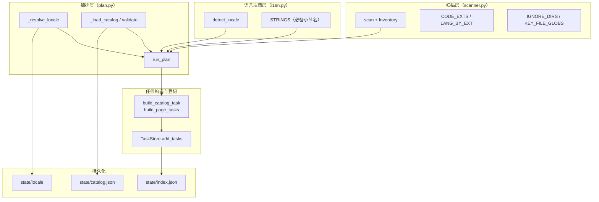
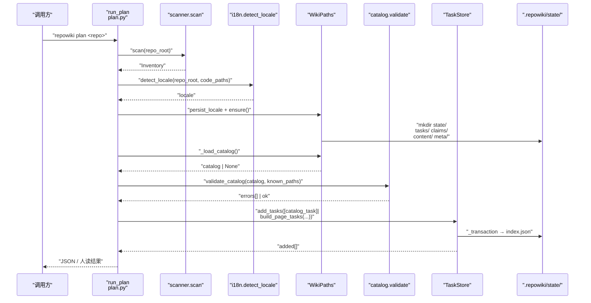
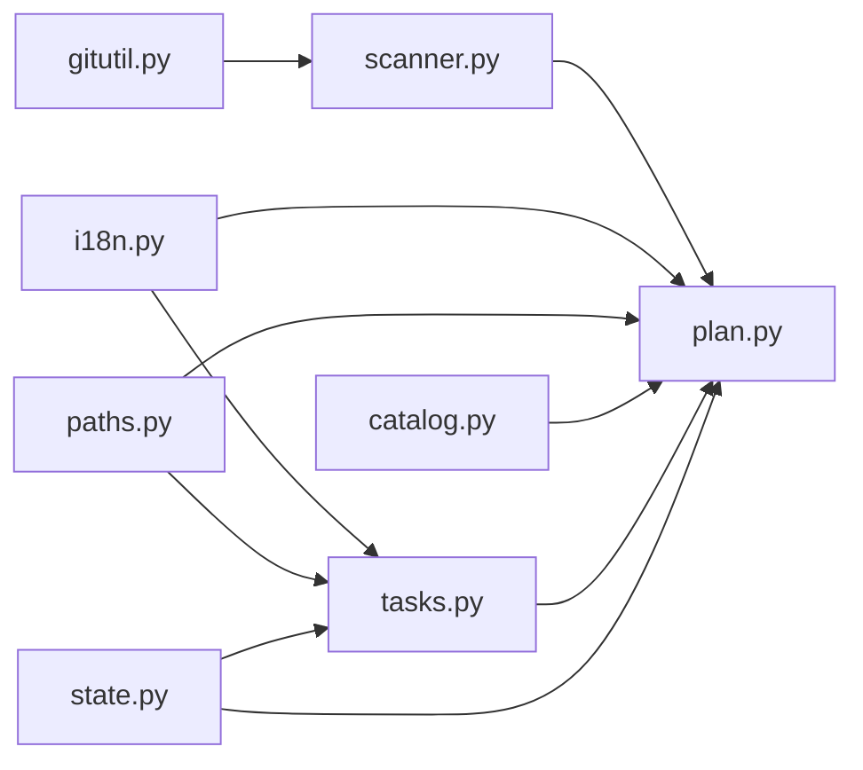

# plan：扫描仓库并生成任务清单

<cite>
**本文引用的文件**
- [src/repowiki/plan.py](file://src/repowiki/plan.py)
- [src/repowiki/scanner.py](file://src/repowiki/scanner.py)
- [src/repowiki/i18n.py](file://src/repowiki/i18n.py)
- [src/repowiki/paths.py](file://src/repowiki/paths.py)
- [src/repowiki/tasks.py](file://src/repowiki/tasks.py)
- [src/repowiki/state.py](file://src/repowiki/state.py)
- [docs/zh/DECISIONS.md](file://docs/zh/DECISIONS.md)
</cite>

## 更新摘要

**变更内容**
- 更新 `detect_locale` 的 README 选择逻辑：存在 `README.md` 时直接采用主文件，不再按 `sorted(root.glob("README*"))` 取第一个——避免 `README.en.md`/`README.zh.md` 等翻译兄弟文件因排序靠前而覆盖主 README 的语言信号（[src/repowiki/i18n.py:111-137](file://src/repowiki/i18n.py#L111-L137)，本次唯一变更文件）。
- 同步修正全文中 `i18n.py` 的行号引用区间（该文件现为 137 行，`detect_locale` 延伸至文件末尾）。
- 修正 `DECISIONS.md` 引用路径：该文件已随文档集中化迁移至 `docs/zh/DECISIONS.md`。

## 目录
1. [更新摘要](#更新摘要)
2. [简介](#简介)
3. [项目结构](#项目结构)
4. [核心组件](#核心组件)
5. [架构总览](#架构总览)
6. [详细组件分析](#详细组件分析)
7. [依赖关系分析](#依赖关系分析)
8. [性能与一致性考量](#性能与一致性考量)
9. [故障排查指南](#故障排查指南)
10. [结论](#结论)

## 简介

`repowiki plan` 是整条流水线的入口子命令：先用 `scanner.scan` 把目标仓库的物理文件清单转成 `Inventory`（含代码/语言/行数），再用 `i18n.detect_locale` 决定产出语言（zh/en），最后根据已有 `state/catalog.json` 决定「重建 catalog」还是「展开 page 任务」，并通过 `TaskStore.add_tasks` 把它们登记到 `state/index.json`。理解本页就掌握了整个流水线的物理起点与所有后续路径契约的母参数（locale）。

## 项目结构

与 `plan` 相关的源文件集中在 `src/repowiki/`：

- `src/repowiki/plan.py` —— `run_plan` 入口；包含 `MIN_CODE_FILES` 下限、locale 解析、catalog 复用与 `knowledge` 标志位等顶层编排逻辑。
- `src/repowiki/scanner.py` —— `scan` / `Inventory` / `FileEntry`；提供 `CODE_EXTS` / `LANG_BY_EXT` / `IGNORE_DIRS` / `KEY_FILE_GLOBS` 等常量表。
- `src/repowiki/i18n.py` —— `detect_locale` / `STRINGS` / `SUPPORTED`；包含 zh/en 必备小节名、模板字符串、CJK vs Latin 权重算法。
- `src/repowiki/paths.py` —— `WikiPaths` 提供 `state/locale` 持久化与 `<locale>/content` 目录契约。
- `src/repowiki/tasks.py` —— `build_catalog_task` / `build_page_tasks` / `build_knowledge_plan_task` 是 plan 阶段的三类任务构造器。
- `src/repowiki/state.py` —— `TaskStore.add_tasks` 是 plan 阶段所有任务登记的唯一入口。
- `.repowiki/state/catalog.json` —— 已有目录树；plan 若校验通过则跳过 catalog 任务直接展开页面。
- `.repowiki/state/locale` —— 持久化的 locale；后续命令优先于自动检测读取。

图表来源
- [src/repowiki/plan.py:29-103](file://src/repowiki/plan.py#L29-L103)

章节来源
- [src/repowiki/plan.py:1-17](file://src/repowiki/plan.py#L1-L17)

## 核心组件

- **Inventory**（scanner.py）：仓库扫描结果的可序列化数据类，含 `repo_root / files / key_files / tree_summary / code_file_count`；`known_paths()` 是 catalog 校验的桥。
- **FileEntry**（scanner.py）：单文件信息（path / loc / lang / is_code），由 `LANG_BY_EXT` 与 `CODE_EXTS` 共同决定 `lang` 与 `is_code`。
- **scan(repo_root)**（scanner.py）：优先用 `git ls-files -z` 拿 git-aware 清单，缺失时回退到 `os.walk + IGNORE_DIRS` 剪枝；输出 `Inventory`。
- **detect_locale(repo_root, code_files)**（i18n.py）：零网络、确定性的语言探测；`README.md` 存在时优先于翻译兄弟文件，看 README 的 CJK/Latin 比例，达 `_MIN_README_SIGNAL` 则按 0.15 阈值决定；不足时遍历代码样本任一文件含 `_MIN_CODE_CJK` 个 CJK 字符即 zh。
- **STRINGS**（i18n.py）：zh/en 双语的 UI/校验字符串；含 `required_sections / update_extra / overview_sections / site` 等子键，是 validate 与模板渲染的母参数。
- **run_plan**（plan.py）：plan 命令编排入口；做 `--replan` 守卫、`MIN_CODE_FILES` 校验、locale 解析、`_load_catalog` 复用与任务登记。
- **_resolve_locale**（plan.py）：locale 优先级三段——显式 `--locale` flag > 持久化 `state/locale` > `detect_locale`。
- **_load_catalog / validate_catalog**（plan.py + catalog.py）：若 `state/catalog.json` 存在且通过 `validate_catalog` 校验，则跳过 catalog 任务直接展开 page 任务。
- **WikiPaths.persist_locale**（paths.py）：把解析出的 locale 写到 `state/locale`，确保后续命令读取的 locale 一致。

章节来源
- [src/repowiki/i18n.py:111-137](file://src/repowiki/i18n.py#L111-L137)

## 架构总览

`plan` 是单次 CLI 调用的纯函数（`run_plan → 0`）：先扫文件、定 locale、校验代码量下限，再决定是否复用已有 catalog，最后向 `TaskStore` 登记任务。下图描绘的是 `next --claim` 之前的一次 `plan` 完整生命周期：locale 解析是「下游路径契约」的母参数——`paths.ensure()` 之后创建的所有目录都依赖它；catalog 是否复用则决定本次 `add_tasks` 登记的是 catalog 任务还是 page 任务集合。

图表来源
- [src/repowiki/plan.py:38-103](file://src/repowiki/plan.py#L38-L103)

章节来源
- [src/repowiki/plan.py:38-103](file://src/repowiki/plan.py#L38-L103)

## 详细组件分析

### Inventory 与 IGNORE_DIRS

- 职责：用 `git ls-files` 或 `os.walk` 拿到仓库文件清单，并按扩展名/LOC 装配可序列化的 `Inventory`。
- 关键行为：扫描阶段就剔除 `IGNORE_DIRS`（`.git / node_modules / .repowiki / dist / build / target / __pycache__ / .venv / site-packages / .idea / .vscode` 等），不让它们污染下游计数；`MAX_TEXT_BYTES=2MiB` 以上的文件不计入 LOC，但仍出现在清单中。
- 实现要点：git 模式与 walk 模式的剪枝方式不同——git 模式按 path 段包含 `IGNORE_DIRS` 过滤；walk 模式用 `dirnames[:] = [d for d in dirnames if d not in IGNORE_DIRS and not d.startswith(".git")]` 就地剪枝。

章节来源
- [src/repowiki/scanner.py:74-147](file://src/repowiki/scanner.py#L74-L147)

### 语言探测 detect_locale

- 职责：在零网络前提下决定 `zh` 还是 `en`，避免每次都显式传 `--locale`。
- 关键行为：README 候选先取主文件 `README.md`（存在即用，`README.en.md`/`README.zh.md` 等翻译兄弟文件不得因 `sorted` 排序靠前而覆盖主文件），无主文件才回退到排序后的 `README*` 通配；读前 8 KiB 文本统计 CJK 与 Latin 字符数，总和达 `_MIN_README_SIGNAL=20` 时按 0.15 阈值分；不足时遍历至多 `_CODE_SAMPLES=24` 个代码样本，任一文件含 `_MIN_CODE_CJK=30` 个 CJK 字符即 zh。
- 实现要点：`code_files` 中的 latin 标识符不能稀释「文档语言」信号，所以 CJK 阈值判断只在 README 与少数自然文本中触发；这是「代码语言 ≠ 文档语言」的最小决策。

章节来源
- [src/repowiki/i18n.py:111-137](file://src/repowiki/i18n.py#L111-L137)

### run_plan 与 _resolve_locale

- 职责：把扫描、语言探测、catalog 复用、任务登记串成一个原子流水线。
- 关键行为：`--replan` 时若有 in_progress 任务则报错或要求 `--force`，并 `shutil.rmtree(paths.root)` 重建；locale 在 `ensure()` 前确定，因为 locale 决定哪些目录被创建；`persist_locale` 只在「未持久化 或 locale flag != auto」时写入。
- 实现要点：`MIN_CODE_FILES=10` 是仓库太小直接报 `UsageError` 的下限；超过则进入 catalog 校验——这是 DECISIONS #8 中「宁精勿滥」决策的物理实现。

章节来源
- [src/repowiki/plan.py:38-103](file://src/repowiki/plan.py#L38-L103)

### catalog 复用与展开

- 职责：避免每次 plan 都重做目录规划，但允许人/agent 在 review 时编辑 `catalog.json` 后重新展开。
- 关键行为：`_load_catalog` 读 `state/catalog.json`，解析失败返回 None；`validate_catalog(catalog, inv.known_paths())` 返回 `(errors, warns)`；errors 为空时走 `flatten → build_page_tasks` 路径，跳过 catalog 任务。
- 实现要点：DECISIONS #6 明确规定——`plan` 遇已存在且合法的 catalog.json 时不再创建 catalog 任务（直接展开页面任务）；`--replan` 清空重来；这是评审阶段补充的「目录评审回路」入口。

章节来源
- [src/repowiki/plan.py:20-86](file://src/repowiki/plan.py#L20-L86)

### 任务构造与登记

- 职责：把 catalog 树或单点 catalog 任务转成 `new_task` 记录并持久化到 `index.json`。
- 关键行为：`build_catalog_task(paths, inv)` 渲染 `catalog_task.md` 模板并写 `state/tasks/catalog.md`，返回 phase=1 的任务；`build_page_tasks(paths, nodes, inv)` 按 catalog 节点展开成 phase=2 页面任务；`build_knowledge_plan_task` 是 `--knowledge` 标志位下的知识库规划任务。
- 实现要点：`TaskStore.add_tasks` 走 `_transaction`，只 insert 新 id（`if rec["id"] not in data["tasks"]: ...`），保证 plan 幂等。

章节来源
- [src/repowiki/tasks.py:59-86](file://src/repowiki/tasks.py#L59-L86)

## 依赖关系分析

- `scanner.scan` 依赖 `gitutil.run_git`：git 模式下用 `git ls-files -z` 拿精确的 `.gitignore` 列表；git 不可用时回退到 `os.walk + IGNORE_DIRS`。
- `plan.run_plan` 同时依赖 `scanner / i18n / paths / tasks / state / catalog`：locale 来自 `i18n.detect_locale`，路径契约来自 `WikiPaths`，catalog 校验来自 `catalog.validate_catalog`，任务 schema 来自 `state.new_task`。
- `i18n.STRINGS` 是 `validate` 与 `templates` 的母参数：模板渲染会按 locale 选 zh/en 模板；验证器按 locale 检查 `required_sections` 列表。
- `paths.WikiPaths.persist_locale` 是 locale 持久化的唯一写入点：`plan` 与显式调用都走它；后续命令通过 `WikiPaths.locale`（lazy property）读取 `state/locale`。
- `state.TaskStore.add_tasks` 是 plan 阶段所有任务登记的唯一入口；`run_plan` 不直接写 `index.json`，确保锁与 schema 都集中在 `TaskStore`。

图表来源
- [src/repowiki/plan.py:1-15](file://src/repowiki/plan.py#L1-L15)

章节来源
- [src/repowiki/plan.py:1-15](file://src/repowiki/plan.py#L1-L15)

## 性能与一致性考量

- **git-aware 剪枝**：仓库有 `.git` 时优先走 `git ls-files -z`，由 git 自身处理 `.gitignore`；缺失 git 或调用失败时回退到 `os.walk`，剪枝 `IGNORE_DIRS`——这是确定性（无 git 依赖）与精确性（有 git 时尊重 ignore）之间的均衡。
- **大小写不敏感的扩展名匹配**：`ext = p.suffix.lstrip(".").lower()` 保证 `.PY` 与 `.py` 同等计入 `python`。
- **LOC 上限**：单文件 > 2 MiB 时 `_count_loc` 返回 0（不在 `loc` 中计入），但文件仍出现在 `files` 中；避免极大二进制文件污染 LOC 计数。
- **目录树渲染上限**：`_PER_DIR_CAP=20`、`_MAX_SUMMARY_LINES=400` 限制 catalog 任务规格里的 `TREE_SUMMARY` 长度，避免 prompt 过大。
- **locale 阈值固定**：README 文本 CJK/Latin 比 0.15、单个代码文件 30 个 CJK 字符触发 zh；README 候选固定优先主文件 `README.md`（存在即用），阈值与候选规则都固定，保证同一仓库多次 plan 的 locale 一致。
- **catalog 复用**：`plan` 不每次重建 catalog，缩短冷启动；只在 `--replan` 或校验失败时重建。
- **持久化优先级**：`_resolve_locale` 让显式 flag 永远胜出 persisted locale，避免「计划改 locale 但被旧值覆盖」。

章节来源
- [src/repowiki/scanner.py:49-52](file://src/repowiki/scanner.py#L49-L52)

## 故障排查指南

- 现象：`UsageError: 代码文件数 N < 10，仓库太小，不适合生成 RepoWiki`。
  - 原因：`MIN_CODE_FILES=10` 下限触发；常见于文档仓库 / 单文件脚本。
  - 定位步骤：确认 `scanner.scan` 的 `code_file_count`；检查 `CODE_EXTS` 是否包含该仓库主要扩展名（如 `.proto` / `.ex` 等）。
  - 相关代码位置：[src/repowiki/plan.py:17](file://src/repowiki/plan.py#L17)、[src/repowiki/plan.py:57-60](file://src/repowiki/plan.py#L57-L60)。

- 现象：`UsageError: state/index.json 无法解析，无法确认是否有任务在执行`。
  - 原因：`--replan` 时 index 损坏；plan 不敢冒险删除现有状态与规格。
  - 定位步骤：保留原文件；用 `--force` 明确放弃恢复；或手工修复 JSON 后再 replan。
  - 相关代码位置：[src/repowiki/plan.py:41-47](file://src/repowiki/plan.py#L41-L47)。

- 现象：`--replan` 报「检测到 N 个 in_progress 任务」。
  - 原因：检测到当前正在执行的任务；replan 会删除正在被写入的产物。
  - 定位步骤：先 `repowiki status` 确认 in_progress 任务是否真的还在跑；若 worker 已死，等 stale 窗口到期让其回收；确认请加 `--force`。
  - 相关代码位置：[src/repowiki/plan.py:48-52](file://src/repowiki/plan.py#L48-L52)。

- 现象：locale 选了 en 但仓库是中文。
  - 原因：`detect_locale` 阈值固定——README 文本不足 `_MIN_README_SIGNAL=20` 且代码样本 CJK 不足 `_MIN_CODE_CJK=30`；另一历史成因是双语仓库中 `README.en.md` 等翻译兄弟文件按 `sorted` 排序覆盖了中文主 README（现已修复：主文件 `README.md` 存在即优先）。
  - 定位步骤：检查 README 是否存在、内容是否主要是 ASCII；确认主 README 语言信号未被翻译兄弟文件稀释；用 `repowiki plan <repo> --locale zh` 强制；或调整 README 前几行的中英比例。
  - 相关代码位置：[src/repowiki/i18n.py:111-137](file://src/repowiki/i18n.py#L111-L137)。

- 现象：catalog 校验失败后重新规划，但已经写好的 page 任务被丢弃。
  - 原因：`validate_catalog` 返回非空 errors 时，`plan` 清空 catalog 进入「重建」路径。
  - 定位步骤：用 `repowiki status` 看既有页面是否还在；可手动编辑 `state/catalog.json` 修正后再 plan；保留旧 `index.json` 便于排查。
  - 相关代码位置：[src/repowiki/plan.py:73-78](file://src/repowiki/plan.py#L73-L78)。

- 现象：扫描时 `.repowiki/` 目录被错误包含。
  - 原因：仓库把 `.repowiki/` 提交到了 git（罕见，但可能）。
  - 定位步骤：检查 `.gitignore`；`IGNORE_DIRS` 已包含 `.repowiki`，scan 阶段就剔除，无需额外处理。
  - 相关代码位置：[src/repowiki/scanner.py:36-41](file://src/repowiki/scanner.py#L36-L41)。

章节来源
- [src/repowiki/plan.py:38-86](file://src/repowiki/plan.py#L38-L86)

## 结论

`plan` 把「物理仓库 → Inventory → 任务清单」做成一次可重复调用的入口；`detect_locale` 在零网络前提下确定 zh/en，并把结果持久化到 `state/locale`，确保后续命令的路径契约与模板选择都收敛到同一语言；`IGNORE_DIRS` + `git-aware` 剪枝保证扫描结果既准确又剔除噪音。理解这层契约就掌握了整条流水线的「母参数」——locale 与 catalog 是后续命令的物理依赖，是 update 增量更新与 idempotent plan 的基础。**已更新**：`detect_locale` 现优先采用主文件 `README.md`，翻译兄弟文件（`README.en.md` 等）不再因字典序靠前而干扰语言判定。

章节来源
- [src/repowiki/plan.py:1-17](file://src/repowiki/plan.py#L1-L17)
