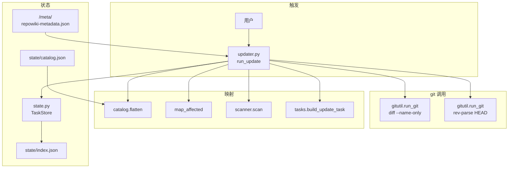
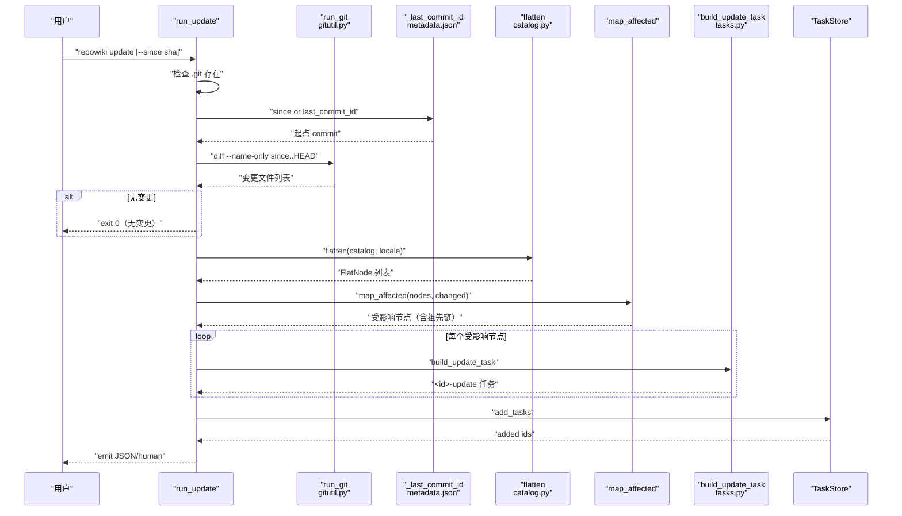
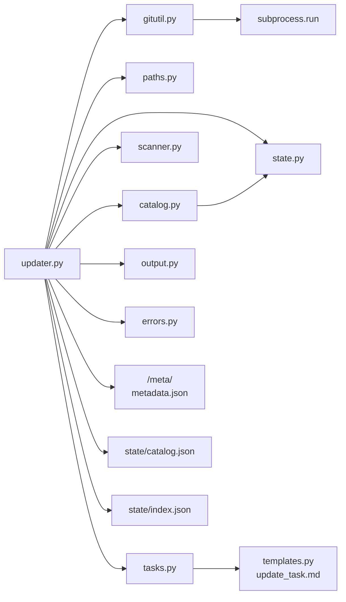

# update：基于 git diff 的增量更新

<cite>
**本文引用的文件**
- [src/repowiki/updater.py](file://src/repowiki/updater.py)
- [src/repowiki/gitutil.py](file://src/repowiki/gitutil.py)
- [src/repowiki/tasks.py](file://src/repowiki/tasks.py)
- [src/repowiki/metadata.py](file://src/repowiki/metadata.py)
- [src/repowiki/catalog.py](file://src/repowiki/catalog.py)
- [src/repowiki/state.py](file://src/repowiki/state.py)
</cite>

## 目录
1. [简介](#简介)
2. [项目结构](#项目结构)
3. [核心组件](#核心组件)
4. [架构总览](#架构总览)
5. [详细组件分析](#详细组件分析)
6. [依赖关系分析](#依赖关系分析)
7. [性能与一致性考量](#性能与一致性考量)
8. [故障排查指南](#故障排查指南)
9. [结论](#结论)

## 简介
本页聚焦 repowiki 的 `update` 子命令：在已有 wiki 的目标仓库上，把自上次生成以来的 git 提交反推为需要重写的页面（含祖先链），并以 `page_update` 任务形式入队，附「Update Summary」小节供 agent 改写。它解决的核心问题是「仓库代码改了、wiki 不能每次全量重生成」，关键设计是把变更映射建立在 `state/catalog.json` 的 `dependent_files` 与树结构上，而不是 `repowiki-metadata.json`——因为 metadata 没有 `kind` 字段，无法重建页面路径（DECISIONS #10）。

## 项目结构
与本页主题相关的目录与文件：

- `src/repowiki/updater.py`：`run_update` —— git diff → 受影响页面（含祖先链）→ 增量任务；`map_affected` 命中节点函数；warnings 收集（stale_pending、未覆盖顶级目录）。
- `src/repowiki/gitutil.py`：`run_git` —— 共享的 git 子进程封装；成功返回 stdout 字符串，任何异常返回 `None`。
- `src/repowiki/tasks.py`：`build_update_task` —— 增量任务规格生成；原页面不存在时降级为 page 任务；模板中含「Update Summary」小节。
- `src/repowiki/metadata.py`：`run_finalize` —— 写 `wiki_repo.last_commit_id`（`git rev-parse HEAD`），供 `update` 不带 `--since` 时使用。
- `src/repowiki/catalog.py`：`flatten` —— 把 catalog 树展开为有序 FlatNode 列表（含 `dependent_files`/`parent_id`/`id`），供 `map_affected` 反查。
- `src/repowiki/state.py`：`TaskStore.load`/`add_tasks` —— 读取 index.json 检查已有 `-update` 任务、追加新任务。
- `src/repowiki/scanner.py`：`scan` —— 重新扫描仓库构造 Inventory，供 hint_files 列表与代码元数据查询。
- `.repowiki/state/catalog.json`：update 必读的目录文件；提供 `dependent_files` 反查。
- `.repowiki/<locale>/meta/repowiki-metadata.json`：update 默认 `last_commit_id` 起点来源。
- `.repowiki/state/index.json`：任务清单；update 在此追加 `<id>-update` 记录。
- `.repowiki/<locale>/content/...`：原页面正文；`build_update_task` 据此构造 OLD_PAGE。

图表来源
- [src/repowiki/updater.py:47-111](file://src/repowiki/updater.py#L47-L111)
- [src/repowiki/gitutil.py:13-19](file://src/repowiki/gitutil.py#L13-L19)
- [src/repowiki/tasks.py:134-173](file://src/repowiki/tasks.py#L134-L173)

章节来源
- [src/repowiki/updater.py:1-123](file://src/repowiki/updater.py#L1-L123)
- [src/repowiki/gitutil.py:1-19](file://src/repowiki/gitutil.py#L1-L19)
- [src/repowiki/tasks.py:134-173](file://src/repowiki/tasks.py#L134-L173)
- [src/repowiki/metadata.py:81-90](file://src/repowiki/metadata.py#L81-L90)

## 核心组件
- `run_update(paths, since, as_json)`（`updater.py`）：增量更新入口；`since` 为空时尝试从 metadata 的 `last_commit_id` 推断；构造变更集合 → 反查受影响页面 → 追加 `<id>-update` 任务。
- `_git_diff(repo, since)`（`updater.py`）：调用 `run_git(repo, "diff", "--name-only", f"{since}..HEAD", timeout=60)`；`None` 表示 git 调用失败（区分于「无变更」）。
- `_last_commit_id(paths)`（`updater.py`）：从 `<locale>/meta/repowiki-metadata.json` 读 `wiki_repo.last_commit_id`；缺失或损坏返回 `None`。
- `map_affected(nodes, changed)`（`updater.py`）：命中 `dependent_files ∩ changed` 的节点，沿 `parent_id` 向上叠加祖先链直到根；返回去重保序的节点列表。
- `build_update_task(paths, node, changed_files, inv)`（`tasks.py`）：增量任务规格生成；`task_id = f"{node.id}-update"`；原页面不存在时降级为 page 任务（强制 page 不带「更新摘要」小节）。
- `run_git(repo, *args, timeout=30)`（`gitutil.py`）：`subprocess.run(["git", *args], cwd=str(repo), capture_output=True, check=True, timeout=timeout)`；任何异常返回 `None`（成功 raw stdout，失败 `None`）。
- `flatten(catalog, locale)`（`catalog.py`）：把 catalog 树展开为有序 FlatNode 列表；每个节点含 `dependent_files` 与 `parent_id`。
- `TaskStore.load/add_tasks`（`state.py`）：读 index.json 检查已有 `-update` 任务，追加新 `-update` 记录。
- `warnings` 集合（`updater.py`）：`stale_pending`（已有未完成 `-update` 任务基于旧变更快照，可能过期）+ `new_top_dirs`（catalog 未覆盖的新顶级目录 > 2 时建议 `plan --replan`）。

章节来源
- [src/repowiki/updater.py:18-123](file://src/repowiki/updater.py#L18-L123)
- [src/repowiki/gitutil.py:1-19](file://src/repowiki/gitutil.py#L1-L19)
- [src/repowiki/tasks.py:134-173](file://src/repowiki/tasks.py#L134-L173)
- [src/repowiki/metadata.py:81-90](file://src/repowiki/metadata.py#L81-L90)

## 架构总览
`update` 是「读 git → 反查 catalog → 构造增量任务 → 入队 → worker 领取改写」的链。`run_update` 入口先检查 `.git` 存在（必须 git 仓库）；`since` 缺省时尝试从 `<locale>/meta/repowiki-metadata.json` 的 `wiki_repo.last_commit_id` 推断；`run_git diff --name-only since..HEAD` 拿到变更文件列表（任何异常返回 `None`，区分于「空输出」）；`_git_diff` 返回 `None` 时抛 `UsageError`，空列表则直接 emit「自上次生成以来无变更」返回。`_git_diff` 拿到变更后 `flatten` 构造节点 → `map_affected` 反查命中节点叠加祖先链 → 对每个 affected 节点调 `build_update_task` 构造 `<id>-update` 任务并 `add_tasks`。已有 `<id>-update` 任务直接跳过（避免覆盖进行中的改写）。`store.cleanup_runtime` 在 finalize 后清掉 `claims/` 与 `tasks/`，但 `catalog.json`/`index.json`/`knowledge.json` 保留——update 依赖前两者，绝不能被清掉（DECISIONS #10）。

图表来源
- [src/repowiki/updater.py:47-111](file://src/repowiki/updater.py#L47-L111)
- [src/repowiki/gitutil.py:13-19](file://src/repowiki/gitutil.py#L13-L19)
- [src/repowiki/tasks.py:134-173](file://src/repowiki/tasks.py#L134-L173)

章节来源
- [src/repowiki/updater.py:1-123](file://src/repowiki/updater.py#L1-L123)
- [src/repowiki/gitutil.py:1-19](file://src/repowiki/gitutil.py#L1-L19)
- [src/repowiki/tasks.py:134-173](file://src/repowiki/tasks.py#L134-L173)

## 详细组件分析
### git 变更采集与起点推断
- 职责：从 git 拿到「自上次生成以来改了哪些文件」，并把空输出与 git 调用失败区分开。
- 关键行为：`run_git(repo, "diff", "--name-only", f"{since}..HEAD", timeout=60)`（updater 用 60s timeout，比 `gitutil.run_git` 默认 30s 长）调用 `subprocess.run(["git", "diff", "--name-only", ...])`，输出按行 strip + 过滤空行；返回 `None` 表示 git 调用失败（异常捕获），返回 `[]` 表示无变更；`since` 缺省时 `_last_commit_id` 从 `<locale>/meta/repowiki-metadata.json` 读 `wiki_repo.last_commit_id`，缺失或损坏返回 `None`；二者都缺失时抛 `UsageError("无法确定增量起点")`。
- 实现要点：`run_git` 用 `capture_output=True, check=True, timeout=timeout`，任何 `subprocess.SubprocessError`/`OSError` 都返回 `None`（不抛异常）；`--name-only` 让输出简洁便于解析；只识别已提交变更（since..HEAD），工作区未提交改动不可见。

章节来源
- [src/repowiki/updater.py:18-71](file://src/repowiki/updater.py#L18-L71)
- [src/repowiki/gitutil.py:13-19](file://src/repowiki/gitutil.py#L13-L19)

### dependent_files 反查与祖先链展开
- 职责：把变更文件列表反推为需要重写的页面（含祖先节点）。
- 关键行为：`map_affected(nodes, changed)` 用 `by_id = {n.id: n for n in nodes}` 索引，对每个节点判断 `set(n.dependent_files) & changed` 是否非空，命中则沿 `parent_id` 用 `by_id.get(cur.parent_id)` 向上叠加（`while cur and cur.id not in affected`）；`affected: dict[str, None]` 是有序集合（去重保序）；返回 `[by_id[tid] for tid in affected]`。
- 实现要点：祖先链展开是为了「子页面改了，父章节的索引页也可能要改」；没有祖先链的话，索引页会引用过时的子页内容；catalog 没显式声明父子层级时不展开（`cur.parent_id` 为空就停）。

章节来源
- [src/repowiki/updater.py:34-44](file://src/repowiki/updater.py#L34-L44)

### 增量任务规格生成（含 Update Summary）
- 职责：为每个受影响页面构造 `<id>-update` 任务，注入「Update Summary」小节让 agent 知道改动上下文。
- 关键行为：`build_update_task(paths, node, changed_files, inv)` 用 `templates.render_file("update_task.md", locale=paths.locale, ..., OLD_PAGE=old.read_text(encoding="utf-8"), CHANGED_FILES=_hint_list(changed_files, inv), ...)` 渲染规格；模板中含「Update Summary」小节（由变更文件列表 + 原页面正文拼出）；`task_id = f"{node.id}-update"`；`record = new_task(task_id, "page_update", 2, f"{node.title}（增量更新）", node.output)`。
- 实现要点：原页面不存在时（`paths.root / node.output` 不存在）降级为 page 任务（使用 `page_task.md` 模板，不强制带「更新摘要」小节）——避免「brand-new page 强行带更新摘要」的尴尬；`title.replace("（增量更新）", "")` 在 `check` 时还原原标题做校验，保证 page_update 任务与原 page 任务的校验逻辑统一。

章节来源
- [src/repowiki/tasks.py:134-173](file://src/repowiki/tasks.py#L134-L173)
- [src/repowiki/dispatch.py:319](file://src/repowiki/dispatch.py#L319)

### 跳过已有与告警
- 职责：避免重复创建正在进行的增量任务，并对结构性变化给出明确建议。
- 关键行为：`store.load()["tasks"]` 拿到现有索引，`existing` 是 `dict`；`if tid in existing: continue`（`tid = f"{n.id}-update"`）跳过已存在任务——避免覆盖进行中的改写；`stale_pending` 检查 `tid.endswith("-update") and t["status"] in ("pending", "failed", "in_progress")`，命中则在 warnings 中提示「其规格基于旧变更快照，可能过期；建议先完成或 release 后重跑 update」；`covered_top_dirs` 是 catalog 中所有 `dependent_files` 的顶级目录集合；`new_top = changed_set 的顶级目录 - covered_top_dirs`；`len(new_top) > 2` 时警告「出现 N 个 catalog 未覆盖的新顶级目录，建议 repowiki plan --replan 全量重规划」。
- 实现要点：跳过策略只针对 `<id>-update`，不针对 page 任务（page 任务可重跑）；结构性告警阈值是 2（少量新目录可能是新代码放进现有位置，不一定需要重规划）。

章节来源
- [src/repowiki/updater.py:75-101](file://src/repowiki/updater.py#L75-L101)

### 依赖 catalog 而非 metadata 的原因
- 职责：解释 update 命令的输入契约为何是 `state/catalog.json` 而非 `<locale>/meta/repowiki-metadata.json`。
- 关键行为：`flatten(catalog, paths.locale)` 在 update 主路径被调用，依赖 catalog 节点的 `dependent_files`/`parent_id`/`id`/`title`/`output` 等字段；metadata 中没有 `kind` 字段（只通过 `wiki_catalogs` 数组间接表达），无法从 `wiki_repo.last_commit_id` + metadata 重建 `nodes`。
- 实现要点：DECISIONS #10 明确——`update` 的增量映射依赖 `catalog.json` 的 `dependent_files` 与树结构；metadata 无 kind 字段无法重建页面路径，故 `finalize` 成功也只清运行时产物（`claims/`、`tasks/`），保留 `index.json`/`catalog.json`/`knowledge.json` 供 update；`update` 不写 metadata，但 update 时 `last_commit_id` 仍是 metadata 的字段（写 `git rev-parse HEAD` 到 `wiki_repo.last_commit_id`）。

章节来源
- [src/repowiki/updater.py:65-73](file://src/repowiki/updater.py#L65-L73)
- [src/repowiki/metadata.py:81-90](file://src/repowiki/metadata.py#L81-L90)

## 依赖关系分析
- `updater.py` → git 调用：依赖 `gitutil.run_git` 调用 `git diff --name-only` 与（间接）`git rev-parse HEAD`（后者在 metadata 写盘时调用）。
- `updater.py` → 目录读取：依赖 `paths.WikiPaths` 的 `repo_root`/`catalog_file`/`metadata_file`/`locale` 等属性；读 `state/catalog.json` + `<locale>/meta/repowiki-metadata.json`。
- `updater.py` → 映射：依赖 `catalog.flatten` 构造 FlatNode 列表；依赖 `scanner.scan` 重新构造 Inventory（用于 hint_files 元数据）。
- `updater.py` → 任务规格：依赖 `tasks.build_update_task` 构造 `<id>-update` 任务；模板经 `templates.render_file("update_task.md", ...)` 渲染。
- `updater.py` → 状态机：依赖 `TaskStore.load` 读现有 index.json，`add_tasks` 追加新任务。
- 数据契约：`state/catalog.json` 必读（缺失抛 `UsageError`），损坏抛 `UsageError` 含 JSON 错误详情；`<locale>/meta/repowiki-metadata.json` 可选读（缺失时若 `--since` 也缺则报错）；`.git` 必读（缺失抛 `UsageError`）；`git` CLI 必装（不存在或超时返回 `None`，抛 `UsageError`）；变更文件输出路径按 POSIX 风格（git 默认）。

图表来源
- [src/repowiki/updater.py:1-15](file://src/repowiki/updater.py#L1-L15)
- [src/repowiki/gitutil.py:1-19](file://src/repowiki/gitutil.py#L1-L19)
- [src/repowiki/tasks.py:134-173](file://src/repowiki/tasks.py#L134-L173)

章节来源
- [src/repowiki/updater.py:1-123](file://src/repowiki/updater.py#L1-L123)
- [src/repowiki/gitutil.py:1-19](file://src/repowiki/gitutil.py#L1-L19)
- [src/repowiki/tasks.py:134-173](file://src/repowiki/tasks.py#L134-L173)
- [src/repowiki/metadata.py:81-90](file://src/repowiki/metadata.py#L81-L90)
- [src/repowiki/catalog.py](file://src/repowiki/catalog.py)
- [src/repowiki/state.py](file://src/repowiki/state.py)

## 性能与一致性考量
- 仅识别已提交变更：`since..HEAD` 区间，不识别工作区未提交改动——避免半截代码变更触发半截页面重写。
- 60 秒 timeout：`_git_diff` 用 `timeout=60`，比 `gitutil.run_git` 默认 30s 长——大仓库 diff 可能耗时；`run_git` 其他调用沿用默认 30s。
- 原子跳过：`if tid in existing: continue` 避免重复创建正在进行的 `<id>-update` 任务；agent 并发跑 update 时不会撕扯同一任务。
- 祖先链展开：`map_affected` 用 `while cur and cur.id not in affected` 沿 `parent_id` 叠加祖先节点——子页面改了，父章节索引页也自动入列。
- 告警而非阻断：`stale_pending` 与 `new_top_dirs` 都只写 warnings，不阻断 update——让 update 在轻微不一致时仍可工作，把决策权交给 agent。
- 去重保序：`affected: dict[str, None]` 是有序集合，`[by_id[tid] for tid in affected]` 按首次命中顺序返回节点——避免一次 update 中同一节点出现两次。
- 失败空 vs 失败 None：`run_git` 返回 `None` 表示 git 调用失败（异常），返回 `""` 表示成功但无输出——`update` 用 `if changed is None: UsageError` 精确区分；空列表直接 emit「无变更」返回。
- 起点优先级：`since` CLI 参数 > `metadata.wiki_repo.last_commit_id`——CLI 显式优于持久化值，符合「显式优先于默认」的原则。
- catalog 依赖：update 依赖 `catalog.json` 而非 metadata——DECISIONS #10 明示，因为 metadata 没有 kind 字段无法重建页面路径；finalize 的 state 清理策略保留 `catalog.json`/`index.json`/`knowledge.json` 是为了让 update 可继续工作。
- overview 不参与增量：README 中明文约束——结构性重构后建议 `plan --replan` 全量重生成。
- 子进程封装：`run_git` 把 `subprocess.SubprocessError`/`OSError` 都吞掉返回 `None`——任何失败都是 git CLI 问题（不存在/超时/权限），调用方不需要 import subprocess 异常类。

章节来源
- [src/repowiki/updater.py:18-123](file://src/repowiki/updater.py#L18-L123)
- [src/repowiki/gitutil.py:1-19](file://src/repowiki/gitutil.py#L1-L19)
- [src/repowiki/tasks.py:134-173](file://src/repowiki/tasks.py#L134-L173)

## 故障排查指南
- 现象：`增量更新需要 git 仓库（未发现 .git）`。成因：目标仓库非 git 仓库。解决：在 git 仓库中运行；或放弃 update，改用 `plan --replan` 全量重生成。
- 现象：`无法确定增量起点：metadata 中无 last_commit_id，请用 --since <commit> 指定`。成因：未 `finalize` 过或 metadata 中 `wiki_repo.last_commit_id` 缺失（`git rev-parse HEAD` 失败）。解决：用 `--since <commit>` 显式指定起点。
- 现象：`state/catalog.json 不存在，请先完成首次生成`。成因：未首次生成过 wiki。解决：先完成首次生成（`plan` → 完成所有页面 → `finalize`）。
- 现象：`git diff <sha>..HEAD 失败（起点 commit 是否存在？）`。成因：起点 commit 不存在或 git 不可达。解决：检查仓库状态、确认 commit SHA 存在；用 `git log --oneline | head` 查 commit 历史。
- 现象：`state/catalog.json 损坏（JSON parse error）：可手工修复该文件，或 repowiki plan --replan 重新规划`。成因：catalog.json 解析失败。解决：保留现场排查；手工修复或 `plan --replan` 重来。
- 现象：自上次生成以来无变更。成因：`git diff --name-only since..HEAD` 输出空。解决：这是预期行为——update 主动 emit「无变更」并返回。
- 现象：增量任务命中页面但页面标题显示为「X（增量更新）」。成因：`build_update_task` 总是带「（增量更新）」后缀。解决：`check` 时 `title.replace("（增量更新）", "")` 还原原标题做校验——这是预期行为，不影响最终产出。
- 现象：warnings 含「已存在 N 个未完成的增量任务，其规格基于旧变更快照，可能过期」。成因：之前 update 追加的任务未完成。解决：先完成或 `release --force` 后重跑 update。
- 现象：warnings 含「出现 N 个 catalog 未覆盖的新顶级目录」。成因：仓库新增了顶层目录，catalog 未声明其文件。解决：建议 `repowiki plan --replan` 全量重规划。
- 现象：update 改动后 `wiki_repo.last_commit_id` 没变。成因：`update` 不写 metadata——`last_commit_id` 只在 `finalize` 时通过 `git rev-parse HEAD` 写入。解决：update 后应再 `finalize` 一次刷新 `last_commit_id`，否则下次 update 仍用旧起点。
- 现象：update 后某些页面没被加入任务列表。成因：变更文件不在任何页面的 `dependent_files` 中。解决：检查 catalog 节点的 `dependent_files` 是否覆盖了改动的文件；如未覆盖，考虑 `plan --replan` 全量重生成。
- 现象：`update` 后 `git diff` 调用长时间无响应。成因：大仓库 diff 慢或 git 卡住。解决：`_git_diff` 设了 60s timeout，超时会抛 `UsageError`；检查仓库状态或减少 `--since` 跨度。

章节来源
- [src/repowiki/updater.py:18-123](file://src/repowiki/updater.py#L18-L123)
- [src/repowiki/gitutil.py:1-19](file://src/repowiki/gitutil.py#L1-L19)
- [src/repowiki/tasks.py:134-173](file://src/repowiki/tasks.py#L134-L173)
- [src/repowiki/metadata.py:81-90](file://src/repowiki/metadata.py#L81-L90)

## 结论
`update` 子命令把「仓库代码改了、wiki 不重生成」这件事落到了 git diff + catalog 反查的链上：起点推断（CLI 显式或 metadata 持久化）→ `_git_diff` 拿到变更文件列表 → `flatten` 构造节点 → `map_affected` 反查命中 + 祖先链展开 → `build_update_task` 构造 `<id>-update` 任务注入「Update Summary」小节 → `add_tasks` 入队由 worker 领取改写。理解这条链要抓住三点：依赖 catalog 而非 metadata（DECISIONS #10，因为 metadata 无 kind 字段）、仅识别已提交变更（since..HEAD）、警告而非阻断（stale_pending + new_top_dirs）。正确使用方式是：先 `plan` + 完整生成并 `finalize`（落 metadata 含 `last_commit_id`）→ 仓库有 commit 后 `update`（自动用 `last_commit_id`，或 `--since` 显式指定）→ worker 领取 `<id>-update` 任务并 check done → 再次 `finalize` 刷新 `last_commit_id`；结构性重构后跳过 update、直接 `plan --replan` 全量重生成。

章节来源
- [src/repowiki/updater.py:1-123](file://src/repowiki/updater.py#L1-L123)
- [src/repowiki/gitutil.py:1-19](file://src/repowiki/gitutil.py#L1-L19)
- [src/repowiki/tasks.py:134-173](file://src/repowiki/tasks.py#L134-L173)
- [src/repowiki/metadata.py:1-176](file://src/repowiki/metadata.py#L1-L176)
