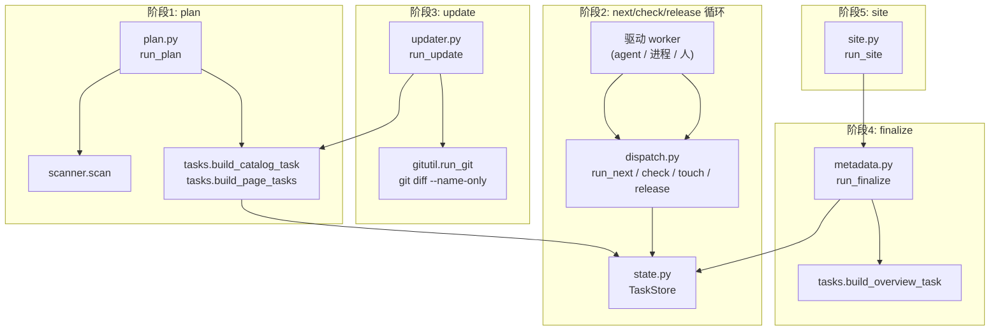
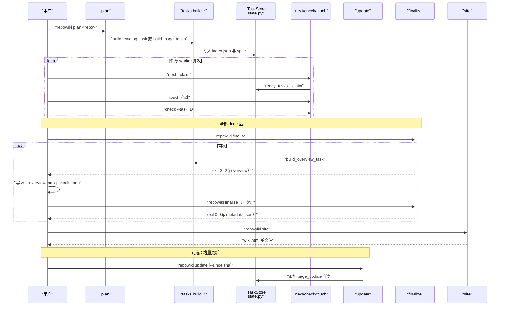
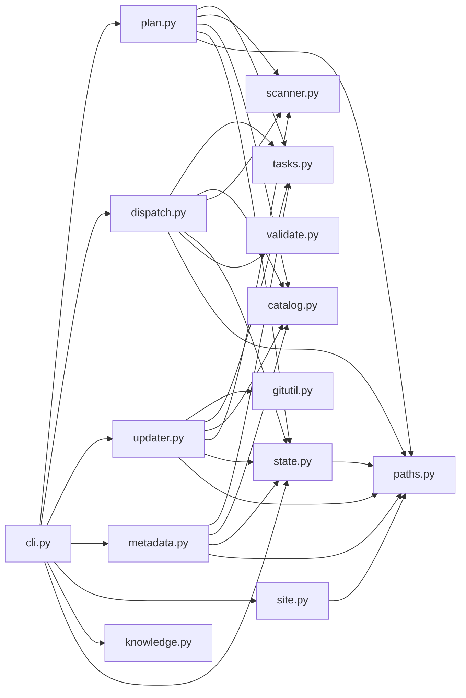

# 编排流水线

<cite>
**本文引用的文件**
- [src/repowiki/plan.py](file://src/repowiki/plan.py)
- [src/repowiki/dispatch.py](file://src/repowiki/dispatch.py)
- [src/repowiki/tasks.py](file://src/repowiki/tasks.py)
- [src/repowiki/updater.py](file://src/repowiki/updater.py)
- [src/repowiki/metadata.py](file://src/repowiki/metadata.py)
- [src/repowiki/catalog.py](file://src/repowiki/catalog.py)
- [src/repowiki/state.py](file://src/repowiki/state.py)
</cite>

## 更新摘要

**变更内容**
- 更新 `run_watch` 的停滞判定：宣布「停滞」之前先用新鲜的 `store.stats()` 复查一次，若剩余任务恰好在循环顶部快照与停滞分支之间全部完成，则按 completed 正常退出（exit 0），不再误报假停滞（[src/repowiki/dispatch.py:174-191](file://src/repowiki/dispatch.py#L174-L191)，本次唯一变更文件）。
- 同步修正全文中 `dispatch.py` 的行号引用区间（该文件现为 392 行）。

## 目录
1. [更新摘要](#更新摘要)
2. [简介](#简介)
3. [项目结构](#项目结构)
4. [核心组件](#核心组件)
5. [架构总览](#架构总览)
6. [详细组件分析](#详细组件分析)
7. [依赖关系分析](#依赖关系分析)
8. [性能与一致性考量](#性能与一致性考量)
9. [故障排查指南](#故障排查指南)
10. [结论](#结论)

## 简介
本页聚焦 repowiki 的编排流水线：把整份 wiki 生成过程拆成 plan → next/check/release → finalize → site 五个核心阶段，分别由 `plan.py`/`dispatch.py`/`tasks.py`/`metadata.py` 等模块实现；并把每个阶段的关键算法（catalog 幂等、overview 两步 finalize、attempt 计数、原子认领、心跳续期、过期回收、git diff 增量映射）逐一剖析。这些契约对外不显眼，但对多 agent 协作者能否顺利并行至关重要——比如 catalog 任务不幂等会导致重复创建、overview 一次性创建会导致「写完不知道写哪里」、attempt 升序排序才能避免坏任务拖死 worker。

## 项目结构
与本页主题相关的目录与文件：

- `src/repowiki/plan.py`：`run_plan` —— 扫描 + 生成任务清单；catalog 任务或直接展开页面任务；replan 与 force 守卫。
- `src/repowiki/dispatch.py`：next/check/release/touch/watch/status 编排；含 `ready_tasks`、`claim`、`touch`、`heartbeat` 等状态机入口。
- `src/repowiki/tasks.py`：任务规格生成器——`build_catalog_task`/`build_page_tasks`/`build_overview_task`/`build_update_task`/`build_knowledge_plan_task`/`build_knowledge_tasks`；spec 写入 `state/tasks/<id>.md`。
- `src/repowiki/updater.py`：`run_update` —— git diff → 受影响页面（含祖先链）→ 增量重写任务。
- `src/repowiki/metadata.py`：`run_finalize` —— 组装 `repowiki-metadata.json`，首次创建 overview 任务并退出码 3。
- `src/repowiki/state.py`：`TaskStore` —— `index.json` 状态机的所有原子操作（flock 串行化）。
- `src/repowiki/catalog.py`：`validate_catalog`、`flatten`、`catalog_tree_text` —— 目录校验、节点扁平化、章节树文本生成。
- `src/repowiki/site.py`：`run_site` —— 单文件离线 HTML 渲染，要求先 finalize。
- `.repowiki/state/`：运行时状态目录（index.json、catalog.json、knowledge.json、tasks/、claims/、locale）。
- `.repowiki/<locale>/content/`：页面正文落盘位置。
- `.repowiki/<locale>/meta/`：finalize 产物目录（`repowiki-metadata.json` + `wiki-overview.md`）。
- `.repowiki/<locale>/wiki.html`：site 渲染的单文件离线 HTML。

图表来源
- [src/repowiki/plan.py:38-103](file://src/repowiki/plan.py#L38-L103)
- [src/repowiki/dispatch.py:49-263](file://src/repowiki/dispatch.py#L49-L263)
- [src/repowiki/updater.py:47-111](file://src/repowiki/updater.py#L47-L111)
- [src/repowiki/tasks.py:61-130](file://src/repowiki/tasks.py#L61-L130)

章节来源
- [src/repowiki/plan.py:1-140](file://src/repowiki/plan.py#L1-L140)
- [src/repowiki/dispatch.py:1-392](file://src/repowiki/dispatch.py#L1-L392)
- [src/repowiki/tasks.py:1-238](file://src/repowiki/tasks.py#L1-L238)
- [src/repowiki/updater.py:1-123](file://src/repowiki/updater.py#L1-L123)

## 核心组件
- `run_plan(paths, replan, max_pages, knowledge, force, as_json, locale)`（`plan.py`）：扫描 + 生成任务清单；catalog 任务或直接展开页面任务；replan 强删整个 `.repowiki/`；`--max-pages` 廉价试跑；`--knowledge` 追加知识卡片任务集；`--force` 用于 in_progress 时强制 replan。
- `run_next/check/release/touch/watch/status`（`dispatch.py`）：worker 循环的四个原子动作（next/check/release/touch）+ 阻塞监控（watch，停滞判定前用新鲜快照复查）+ 进度查询（status）。
- `TaskStore`（`state.py`）：`index.json` 状态机的全部读写（`load`/`ready_tasks`/`claim`/`touch`/`heartbeat`/`release`/`stats`/`update`/`add_tasks`）；flock 串行化。
- `tasks.build_catalog_task`（`tasks.py`）：阶段1 catalog 任务规格生成；代码文件列表 `FILE_LIST_CAP=800` 截断；spec 写入 `state/tasks/catalog.md`。
- `tasks.build_page_tasks`（`tasks.py`）：阶段2 页面任务规格生成；遍历 catalog 扁平节点、注入 hint_files、姊妹页面、模板与文风；spec 写入 `state/tasks/<node.id>.md`。
- `tasks.build_overview_task`（`tasks.py`）：阶段3 overview 任务规格生成；`OUTPUT=zh/meta/wiki-overview.md`；spec 写入 `state/tasks/overview.md`。
- `tasks.build_update_task`（`tasks.py`）：增量更新任务规格生成；原页面不存在时降级为 page 任务（强制 page 不带更新摘要小节）。
- `run_update(paths, since, as_json)`（`updater.py`）：git diff 起点计算（`--since` 或 metadata 中 `last_commit_id`）→ 受影响页面（含祖先链）→ 增量任务；不识别未提交变更。
- `map_affected(nodes, changed)`（`updater.py`）：变更文件 ∩ `dependent_files` 命中节点，叠加祖先链直到根。
- `run_finalize`（`metadata.py`）：组装 `repowiki-metadata.json`；要求全部页面任务 done；首次运行创建 overview 任务并退出码 3。
- `run_site`（`site.py`）：把完成的 wiki 渲染成单文件离线 HTML（`<locale>/wiki.html`）；要求先 finalize。

章节来源
- [src/repowiki/plan.py:38-103](file://src/repowiki/plan.py#L38-L103)
- [src/repowiki/dispatch.py:49-263](file://src/repowiki/dispatch.py#L49-L263)
- [src/repowiki/tasks.py:61-238](file://src/repowiki/tasks.py#L61-L238)
- [src/repowiki/updater.py:47-123](file://src/repowiki/updater.py#L47-L123)

## 架构总览
一次完整的 wiki 生成按 plan → next/check/release → finalize → site 五阶段推进，外加可选的 update 增量更新。`plan.py` 是入口，扫描后写入 `state/index.json` 与第一批任务；`dispatch.py` 是循环的中枢——`next` 拉取 ready、`claim` 原子认领、`touch` 续期、`check` 校验+自动修复+状态流转、`release` 释放、`watch` 阻塞监控；任务通过 `tasks.py` 的 `build_*_task` 生成，每份规格内嵌完整模板与文风，自包含且并行安全；`updater.py` 在已有 wiki 上把 git diff 映射为增量任务；`metadata.py` 在全部页面 done 后汇总元数据（首次创建 overview 任务并退出码 3）；`site.py` 在 finalize 完成后渲染单文件 HTML。

图表来源
- [src/repowiki/plan.py:38-103](file://src/repowiki/plan.py#L38-L103)
- [src/repowiki/dispatch.py:49-199](file://src/repowiki/dispatch.py#L49-L199)
- [src/repowiki/updater.py:47-111](file://src/repowiki/updater.py#L47-L111)
- [src/repowiki/tasks.py:116-130](file://src/repowiki/tasks.py#L116-L130)

章节来源
- [src/repowiki/plan.py:1-140](file://src/repowiki/plan.py#L1-L140)
- [src/repowiki/dispatch.py:1-392](file://src/repowiki/dispatch.py#L1-L392)
- [src/repowiki/tasks.py:1-238](file://src/repowiki/tasks.py#L1-L238)
- [src/repowiki/updater.py:1-123](file://src/repowiki/updater.py#L1-L123)

## 详细组件分析
### 阶段1 plan 与 catalog 幂等
- 职责：扫描仓库、判断是否已有合法 catalog、决定生成 catalog 任务还是直接展开页面任务；replan 时强删整个 `.repowiki/` 并重规划。
- 关键行为：`code_file_count < 10` 拒绝生成（仓库太小）；locale 必须先解析再 `ensure()`（locale 决定创建 `<locale>/content` 与 `<locale>/meta` 目录）；replan 时检测 in_progress 任务（`_busy_tasks`），无 `--force` 拒绝；catalog 已存在且合法时不再创建 catalog 任务，直接 `flatten` + `build_page_tasks`（catalog 幂等——DECISIONS #6）；catalog 校验失败时丢弃并附 warnings（让人/agent 可直接编辑 `state/catalog.json` 后重新 plan，作为「目录评审回路」入口）；`--max-pages` 用于廉价试跑（注意 finalize 会校验页面存在，避免幽灵条目）；`_warn_dangling_outputs` 提示 catalog 之外但已存在的页面（旧残留）。
- 实现要点：catalog 任务由 `store.add_tasks([tasks.build_catalog_task(...)])` 投放；页面任务由 `store.add_tasks(tasks.build_page_tasks(paths, nodes, inv, max_pages))` 投放；`_resolve_locale` 三段回退（`--locale` 显式 → `state/locale` 持久化 → `detect_locale` 启发式）。

章节来源
- [src/repowiki/plan.py:38-103](file://src/repowiki/plan.py#L38-L103)
- [src/repowiki/plan.py:116-140](file://src/repowiki/plan.py#L116-L140)

### 阶段2 next/check/release 与并发认领
- 职责：worker 循环的四个原子动作——领取、续期、校验+状态流转、释放；以及 watch 阻塞监控、status 进度查询。
- 关键行为：`run_next` 默认 `limit=1`（一次只发放一个任务，worker 契约），`--claim` 时对每个 ready 任务尝试原子 `claim`（抢占竞争失败时静默跳过）；`run_touch` 调用 `store.touch(task_id, worker=...)` 刷新认领；`run_check` 在 `worker` 与 `claim_dir/worker` 不一致时拒绝（非 `--force`），防止跨 worker 误翻（生命周期守卫 P0/P1）；`done` 任务走 `_check_readonly` 只读报告，不翻状态（避免翻失败后 spec 已清理导致无规格可执行——DECISIONS #11）；`_check_one` 之后调用 `store.heartbeat(tid)`（校验顺带续期，防执行期被抢双写）；`run_status` 把 failed/exhausted/stale_claims 一并暴露；`run_watch` 的 in_flight 排除过期认领（否则 worker 全死后停滞分支永远不可达），且停滞分支在宣布失败前先用新鲜的 `store.stats()` 复查——任务在循环顶部快照与停滞判定之间全部完成时按 completed 退出，消除假停滞误报。
- 实现要点：`_check_plan_task` 通过后用 `flatten`/`build_*_tasks` 展开后续任务（catalog → page，knowledge_plan → knowledge_card/module）；attempt 计数每次 claim attempts+1（含首次），ready 排序 attempts 升序——失败任务不插队，新任务优先（DECISIONS #9）；`ready_tasks` 纳入「in_progress 且认领过期」的任务让 `next --claim` 走既有抢占路径自动回收（DECISIONS #12）；stale 判定统一为 claim 目录 mtime 单一来源（避免 sweep 与 busy 统计打架）。

章节来源
- [src/repowiki/dispatch.py:49-199](file://src/repowiki/dispatch.py#L49-L199)
- [src/repowiki/dispatch.py:204-392](file://src/repowiki/dispatch.py#L204-L392)

### 阶段3 overview 两步 finalize
- 职责：在所有页面任务 done 之后生成 overview 页面并汇总 metadata.json。
- 关键行为：首次 `finalize` 创建阶段3 overview 任务并退出码 3（进展性等待，非错误）；agent 写完 overview 并 check done 后再次 `finalize` 才写 `repowiki-metadata.json`（DECISIONS #7）；overview 任务由 `tasks.build_overview_task` 生成，输出 `zh/meta/wiki-overview.md`；catalog 树文本由 `catalog.catalog_tree_text` 生成。
- 实现要点：`finalize` 校验页面存在（`--max-pages` 试跑不再产生幽灵条目，DECISIONS #11）；自动清除运行时产物（`state/claims/`、`state/tasks/`），保留 `index.json`/`catalog.json`/`knowledge.json` 供增量更新与幂等重跑。

章节来源
- [src/repowiki/tasks.py:116-130](file://src/repowiki/tasks.py#L116-L130)
- [src/repowiki/dispatch.py:289-336](file://src/repowiki/dispatch.py#L289-L336)

### 阶段4 update 与 git diff 增量映射
- 职责：在已有 wiki 上把 git diff 映射为增量 page_update 任务。
- 关键行为：增量起点为 `--since <sha>` 或 metadata 中 `wiki_repo.last_commit_id`；仅识别已提交变更（`since..HEAD`），工作区未提交改动不可见（README 中明文约束）；`run_git` 调用 `git diff --name-only`；`map_affected(nodes, changed)` 命中 `dependent_files` 后叠加祖先链直到根；已存在的 `<id>-update` 任务跳过；catalog 之外的新顶级目录 > 2 时警告建议 `plan --replan`；overview 不参与增量更新（结构性重构后建议 `plan --replan` 全量重生成）。
- 实现要点：原页面不存在时 `build_update_task` 降级为 page 任务（不强制带更新摘要小节）；warn stale_pending：已存在未完成的 `-update` 任务基于旧变更快照，可能过期，建议先完成或 release 后重跑。

章节来源
- [src/repowiki/updater.py:18-111](file://src/repowiki/updater.py#L18-L111)
- [src/repowiki/tasks.py:134-173](file://src/repowiki/tasks.py#L134-L173)

### 阶段5 site 单文件离线渲染
- 职责：在 finalize 完成后把整份 wiki 打包为单文件离线 HTML。
- 关键行为：渲染 `wiki.html`（`paths.site_file`）；内嵌 marked/mermaid 渲染库；点击 `file://` 引用在页内弹层查看带行号高亮的源码；侧边栏导航、全文搜索、暗色/浅色主题；幂等可重跑；`--open` 自动用默认浏览器打开。
- 实现要点：`templates/site.html` 与 `vendor/*.js` 通过 `package-data` 打入 wheel；要求先 finalize（保证 metadata.json 与所有页面都已落盘）。

章节来源
- [pyproject.toml:30-32](file://pyproject.toml#L30-L32)

## 依赖关系分析
- CLI → 编排：`cli.py` 的每个子命令都把控制权转交给 `run_*` 函数（plan/dispatch/metadata/site/updater/knowledge/state）。
- plan → 支撑：调用 `scanner.scan`、`catalog.validate_catalog`、`catalog.flatten`、`tasks.build_catalog_task`/`build_page_tasks`、`TaskStore.add_tasks`/`stats`。
- dispatch → 支撑：调用 `TaskStore` 全套状态机方法、`catalog.flatten`、`tasks.build_*`、`scanner.scan`、`validate` 模块的 `check_page`/`check_overview`/`check_knowledge_card`/`check_knowledge_module`/`check_knowledge_plan`。
- updater → 支撑：调用 `gitutil.run_git` 做 `git diff --name-only`，调用 `catalog.flatten` 与 `scanner.scan` 重新构造节点与清单，调用 `tasks.build_update_task` 投放增量任务。
- metadata → 支撑：调用 `TaskStore` 与 `catalog` 收集页面、模块与卡片，写 `meta/repowiki-metadata.json`；首次调用 `tasks.build_overview_task`。
- site → 支撑：读取 `<locale>/content/`、`meta/`、`vendor/*.js`，渲染 `<locale>/wiki.html`。
- 跨模块数据契约：`catalog.json` 既是 plan 校验的输入也是 expand pages 与 update 的输入；`knowledge.json` 是知识卡片任务的规划文件；`index.json` 是状态机的唯一真相源；`meta/repowiki-metadata.json` 是 finalize 后的机器可读产物（其 `wiki_repo.last_commit_id` 是 update 的默认起点）；`tasks.py` 内嵌的模板 + 文风使每个 spec 自包含、可并行。

图表来源
- [src/repowiki/cli.py:12-22](file://src/repowiki/cli.py#L12-L22)
- [src/repowiki/updater.py:8-15](file://src/repowiki/updater.py#L8-L15)
- [src/repowiki/plan.py:1-16](file://src/repowiki/plan.py#L1-L16)

章节来源
- [src/repowiki/cli.py:1-142](file://src/repowiki/cli.py#L1-L142)
- [src/repowiki/plan.py:1-140](file://src/repowiki/plan.py#L1-L140)
- [src/repowiki/dispatch.py:1-392](file://src/repowiki/dispatch.py#L1-L392)
- [src/repowiki/updater.py:1-123](file://src/repowiki/updater.py#L1-L123)
- [src/repowiki/tasks.py:1-238](file://src/repowiki/tasks.py#L1-L238)

## 性能与一致性考量
- 阶段门控：`ready_tasks` 只返回当前阶段的就绪任务，前置阶段未完成时后续任务不发放——避免「页面任务先于 catalog」导致的输出路径与树结构不一致。
- 并发安全：`index.json` 用 flock 串行化读改写（mtime 复查有 TOCTOU 窗口，6×12 压测丢 3 次更新）；原子 `mkdir` 认领 + 目录 mtime 过期判定（默认 15 分钟）。
- 队列自愈：`ready_tasks` 纳入「in_progress 且认领过期」的任务，`next --claim` 走既有抢占路径自动回收（`.stale-*` 留痕、attempts+1，毒任务上限照常生效），无需人工 `release --force`。
- 一次性发放：每次 `next --claim` 只发放一个任务（`limit=1`），worker 中途退出时手中不留孤儿认领；即便异常退出，过期认领也会自动回队列。
- 快照新鲜度：watch 的停滞判定基于循环顶部快照，宣布停滞前先用新鲜 `store.stats()` 复查一次——任务恰好在快照间隙完成时不误报假停滞，直接按 completed 退出（exit 0）。
- 状态收敛：`done` 为终态（只读报告，不翻状态），避免翻失败后 spec 已清理导致无规格可执行；`failed` 超过 `REPOWIKI_MAX_ATTEMPTS` 进 `exhausted` 需 `release --force` 重置（防毒任务空转 worker）。
- 自动瘦身：`finalize` 成功后自动清除运行时产物（`state/claims/`、`state/tasks/`），保留 `index.json`/`catalog.json`/`knowledge.json` 供增量更新与幂等重跑。
- catalog 幂等：`plan` 遇到已存在且合法的 catalog.json 时不再创建 catalog 任务，直接展开页面任务——这是评审阶段补充的「目录评审回路」入口（人/agent 可直接编辑 `state/catalog.json` 后重新 plan）。
- overview 两步：首次 `finalize` 创建 overview 任务并退出码 3（进展性等待），再次 `finalize` 才写 `metadata.json`——避免 overview 未写就被 finalize 完成、产生「章节顺序与 overview 不一致」的诡异情况。
- attempt 升序：每次 claim attempts+1（含首次），ready 排序 attempts 升序——失败任务不插队，新任务优先，避免坏任务拖死 worker。
- busy 信号：`next` 返回体新增 `busy` 字段（进行中任务数）。worker 契约相应改为「空且 busy>0 → 等待重试」——避免 worker 在他人执行中时提前退出、后续任务无人接手（T5 竞态单测暴露）。
- 增量更新：基于 git diff 的 `since..HEAD`（仅识别已提交变更）；`update` 的增量映射依赖 `catalog.json` 的 `dependent_files` 与树结构——`metadata.json` 无 kind 字段无法重建页面路径，故 `finalize` 成功也只清运行时产物，保留 `catalog.json` 供 update。
- 文件列表截断：`tasks.build_catalog_task` 中 `FILE_LIST_CAP=800` 防止极大仓库爆规格——超出部分以 `… (+N more)` 收尾。

章节来源
- [src/repowiki/plan.py:38-103](file://src/repowiki/plan.py#L38-L103)
- [src/repowiki/dispatch.py:126-263](file://src/repowiki/dispatch.py#L126-L263)
- [src/repowiki/updater.py:47-111](file://src/repowiki/updater.py#L47-L111)
- [src/repowiki/tasks.py:19](file://src/repowiki/tasks.py#L19)

## 故障排查指南
- 现象：`代码文件数 N < 10，仓库太小，不适合生成 RepoWiki`。成因：被扫描仓库代码文件少于 10。解决：换更大的目标仓库。
- 现象：`replan` 报「检测到 N 个 in_progress 任务」。成因：保护正在被写入的产物。解决：确认放弃恢复请加 `--force`；或等任务 done/释放后再 replan。
- 现象：`state/index.json 无法解析，无法确认是否有任务在执行`。成因：index.json 损坏。解决：保留现场排查，或 `replan --force`。
- 现象：`任务 <id> 由 <worker> 认领`。成因：跨 worker 误翻保护。解决：不要争抢——回到 `next` 拉取新任务；只在崩溃恢复或主 agent 巡查时使用 `--all`。
- 现象：`done 为终态，此结果仅供参考，状态未改变`。成因：`done` 任务被重复 check。解决：done 任务不可执行；如需重建请用 `update` 或 `plan --replan`。
- 现象：`停滞：剩余 N 个任务未完成，但无执行中且无可领取任务`。成因：watch 检测到停滞，通常是 exhausted 毒任务。解决：`repowiki status` 查看详情，`release --force` 可重置。
- 现象：任务刚全部完成时 watch 仍误报「停滞」。成因：停滞分支曾直接使用循环顶部的旧快照，任务在快照与判定之间完成时被误判。解决：watch 现已在停滞分支先用新鲜 `store.stats()` 复查，`done == total` 时按 completed 退出（exit 0）。
- 现象：fresh claim 被误判为过期并遭抢占。成因：stale 判定曾以 ts 文件为准（mkdir 之后才写 ts，期间被误判为无限旧）。解决：stale 判定统一为 claim 目录 mtime 单一来源。
- 现象：worker 全死后停滞分支永远不可达，只能干等超时。成因：watch 的 in_flight 把过期认领也算作执行中。解决：watch 的 in_flight 同步排除过期认领。
- 现象：`finalize` 报「存在幽灵条目」。成因：`--max-pages` 试跑后未清理状态。解决：finalize 现在校验页面存在；如需重置可 `clean` 后 `plan`。
- 现象：`update` 报「无法确定增量起点：metadata 中无 last_commit_id」。成因：未 `finalize` 过或 metadata 中该字段缺失。解决：用 `--since <commit>` 显式指定。
- 现象：`update` 报「state/catalog.json 不存在」。成因：未首次生成过 wiki。解决：先完成首次生成。
- 现象：`update` 报「git diff <sha>..HEAD 失败（起点 commit 是否存在？）」。成因：起点 commit 不存在或 git 不可达。解决：检查仓库状态、确认 commit SHA 存在。
- 现象：`update` 报「state/catalog.json 损坏」。成因：catalog.json 解析失败。解决：手工修复该文件，或 `repowiki plan --replan` 重新规划。
- 现象：增量任务命中页面但页面标题显示为「`X`（增量更新）」。成因：`build_update_task` 总是带「（增量更新）」后缀，`check` 时 `title.replace("（增量更新）", "")` 还原原标题做校验。
- 现象：`finalize` 首次退出码 3。成因：进展性等待——首次运行创建 overview 任务并退出码 3（不是错误）。解决：写完 overview 并 check done 后再次 `finalize`。
- 现象：worker 提前退出导致后续任务无人接手。成因：缺少 busy 信号。解决：worker 契约改为「空且 busy>0 → 等待重试」。

章节来源
- [src/repowiki/plan.py:38-103](file://src/repowiki/plan.py#L38-L103)
- [src/repowiki/dispatch.py:126-199](file://src/repowiki/dispatch.py#L126-L199)
- [src/repowiki/updater.py:47-111](file://src/repowiki/updater.py#L47-L111)
- [src/repowiki/tasks.py:116-130](file://src/repowiki/tasks.py#L116-L130)

## 结论
repowiki 的编排流水线是一条「确定性优先 + 并发安全 + 阶段门控」的链：plan 负责把仓库变成任务清单（catalog 幂等 + locale 跟随），dispatch 负责把任务变成产出（原子认领 + 心跳续期 + 自动修复 + 状态流转），metadata 负责把产出变成可读索引（overview 两步 + 自动瘦身），site 负责把索引变成单文件离线 HTML（vendor 内嵌 + 幂等可重跑），update 在已有 wiki 上做 git diff 增量映射。理解这条流水线的关键不在单行代码，而在三个对外不显眼的契约——catalog 幂等、overview 两步、attempt 升序——它们决定了多 agent 并发时任务能不能稳定推进、不互相撕扯。正确使用方式是：先 `plan` → 并发 worker 跑 next/check/touch 循环 → 全部 done 后 `finalize` → `site` 渲染；中途需要更新用 `update --since` 做增量；任何环节出错都有显式退出码与状态分支指引。**已更新**：watch 的停滞判定现改为宣布失败前用新鲜快照复查，任务恰好全部完成时按 completed 正常退出，消除竞态窗口内的假停滞误报。

章节来源
- [src/repowiki/plan.py:1-140](file://src/repowiki/plan.py#L1-L140)
- [src/repowiki/dispatch.py:1-392](file://src/repowiki/dispatch.py#L1-L392)
- [src/repowiki/tasks.py:1-238](file://src/repowiki/tasks.py#L1-L238)
- [src/repowiki/updater.py:1-123](file://src/repowiki/updater.py#L1-L123)
