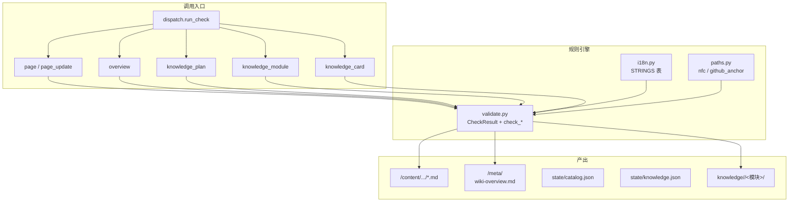
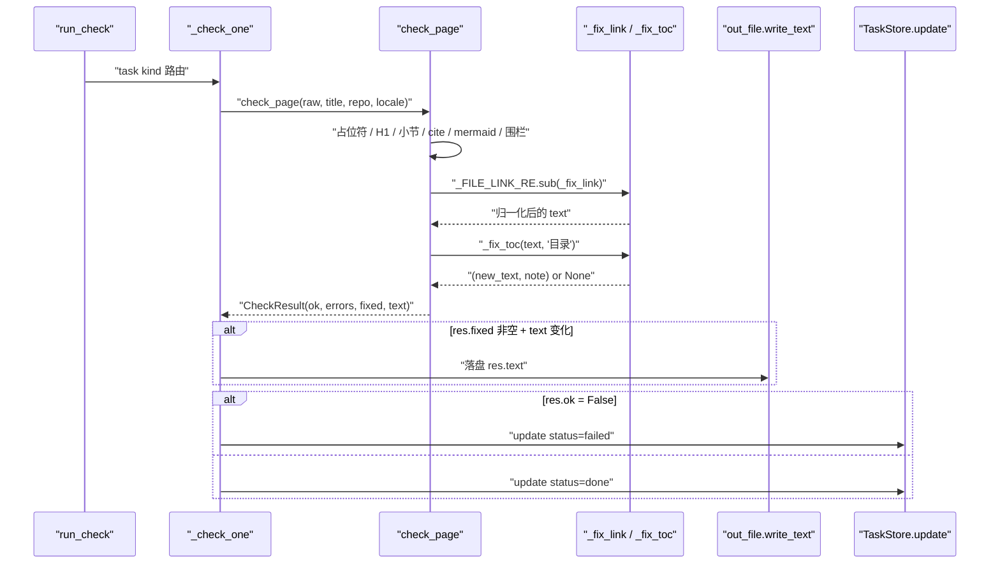
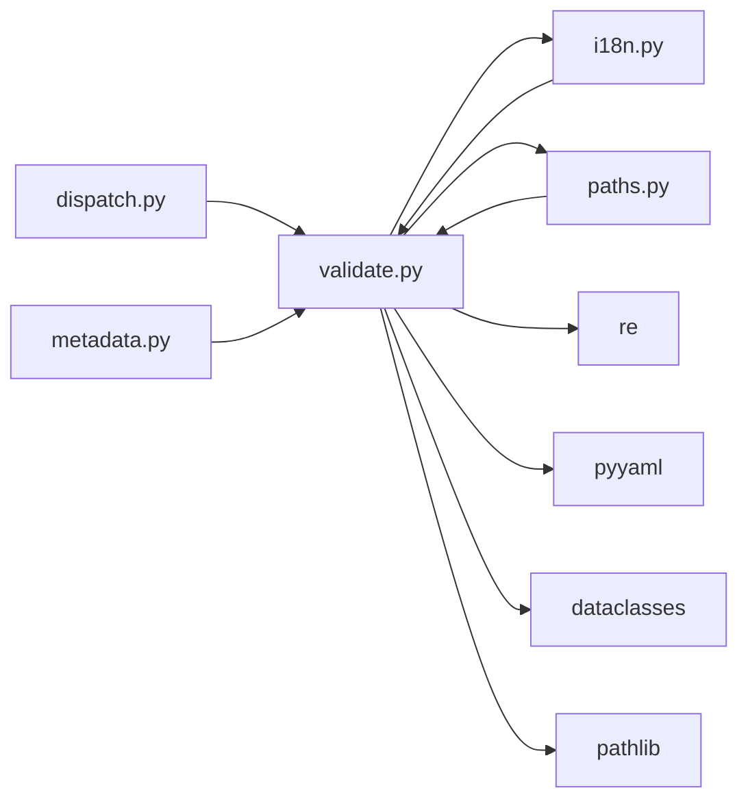

# validate：必检项与自动修复

<cite>
**本文引用的文件**
- [src/repowiki/validate.py](file://src/repowiki/validate.py)
- [src/repowiki/i18n.py](file://src/repowiki/i18n.py)
- [src/repowiki/paths.py](file://src/repowiki/paths.py)
- [src/repowiki/dispatch.py](file://src/repowiki/dispatch.py)
</cite>

## 更新摘要

**变更内容**
- 更新占位符扫描语义：新增 `_strip_code` 预处理，占位符残留检查（`check_page`/`check_knowledge_card`/`check_overview` 三处）现只作用于剥离代码围栏与行内代码后的正文——在代码块中合法展示 `{{...}}` 语法本身不再误判为「未替换占位符」（[src/repowiki/validate.py:63-76](file://src/repowiki/validate.py#L63-L76)、[src/repowiki/validate.py:99-100](file://src/repowiki/validate.py#L99-L100)）。
- `_PLACEHOLDER_RE` 更名为公开的 `PLACEHOLDER_RE`（[src/repowiki/validate.py:23](file://src/repowiki/validate.py#L23)）。
- 更新 `detect_locale` 描述：README 候选优先主文件 `README.md`，翻译兄弟文件不再因字典序干扰判定（[src/repowiki/i18n.py:111-137](file://src/repowiki/i18n.py#L111-L137)）。
- 同步修正行号引用：`validate.py` 现 347 行（`check_page` 由 76-176 移至 91-193），`i18n.py` 现 137 行，`dispatch.py` 现 392 行（`_check_one` 由 289-336 移至 298-346）。

## 目录
1. [更新摘要](#更新摘要)
2. [简介](#简介)
3. [项目结构](#项目结构)
4. [核心组件](#核心组件)
5. [架构总览](#架构总览)
6. [详细组件分析](#详细组件分析)
7. [依赖关系分析](#依赖关系分析)
8. [性能与一致性考量](#性能与一致性考量)
9. [故障排查指南](#故障排查指南)
10. [结论](#结论)

## 简介
本页聚焦 repowiki 的「必检项 + 自动修复」双轨校验逻辑：所有可计算的问题（锚点、行号区间、H1、路径分隔符、占位符遗留在内、TOC 锚点列表）都通过 `validate.py` 静默修复或判失败，并写入 `CheckResult.fixed` 或 `CheckResult.errors`；只有语义缺陷（缺章节、引用不存在文件、围栏不闭合、占位符遗留、YAML 解析失败）才让任务 failed。这种「确定性优先」的设计让大多数 agent 写得不太完美的产出能自动修过，同时对真正的语义错误给出明确错误信息。

## 项目结构
与本页主题相关的目录与文件：

- `src/repowiki/validate.py`：校验规则引擎与自动修复；包含 `CheckResult`、`extract_refs`、`check_page`、`check_overview`、`check_knowledge_plan`/`check_knowledge_module`/`check_knowledge_card`、`_fix_toc`、正则常量 `PLACEHOLDER_RE`/`_H1_RE`/`_H2_RE`/`_FILE_LINK_RE`/`_CITE_RE`/`_TOC_LINE_RE`/`_WIKI_LINK_RE`、占位符扫描预处理 `_strip_code`、`MIN_SECTIONS=6`、`MIN_MERMAID=2`、`MAX_CITED_FILES=15`、`KNOWLEDGE_CATEGORIES`。
- `src/repowiki/i18n.py`：locale 字符串表 `STRINGS`（zh/en），含 `required_sections`（exact/prefix 两种匹配模式）、`update_extra`、`overview_h1_suffix`、`overview_sections`、`module_required_files`、`card_sections`、`site`；locale 检测 `detect_locale`（README 权重 + CJK 阈值，零网络）。
- `src/repowiki/paths.py`：`nfc`、`github_anchor` —— 校验器自动修复时引用的路径与锚点工具。
- `src/repowiki/dispatch.py`：调用 `check_page`/`check_overview`/`check_knowledge_*` 的入口；`run_check` 把 `CheckResult` 翻成 task 状态（done/failed）。
- `.repowiki/<locale>/content/...`：被校验的页面正文；`fix_link` 在原地改写 `file://` 引用并落盘。
- `.repowiki/<locale>/meta/wiki-overview.md`：overview 任务的产出；`check_overview` 校验其 H1 与必备小节。
- `.repowiki/state/catalog.json`：catalog 任务产出；`check_knowledge_plan` 通过 `known_paths` 校验模块 scope 与卡片 source_files。
- `.repowiki/state/knowledge.json`：knowledge-plan 任务产出；含 `modules` 与 `cards`，由 `check_knowledge_plan` 校验。



图表来源
- [src/repowiki/validate.py:1-176](file://src/repowiki/validate.py#L1-L176)
- [src/repowiki/i18n.py:19-83](file://src/repowiki/i18n.py#L19-L83)
- [src/repowiki/dispatch.py:298-346](file://src/repowiki/dispatch.py#L298-L346)

章节来源
- [src/repowiki/validate.py:1-347](file://src/repowiki/validate.py#L1-L347)
- [src/repowiki/i18n.py:1-137](file://src/repowiki/i18n.py#L1-L137)
- [src/repowiki/paths.py:38-74](file://src/repowiki/paths.py#L38-L74)
- [src/repowiki/dispatch.py:204-346](file://src/repowiki/dispatch.py#L204-L346)

## 核心组件
- `CheckResult`（`validate.py`）：`@dataclass`，含 `ok`/`errors`/`warnings`/`fixed`/`text`；`fail(msg)` 方法把 `ok=False` 并 append `errors`。
- `extract_refs(text)`（`validate.py`）：用 `_FILE_LINK_RE` 解析所有 `file://path` 引用为 `(path, start, end)` 三元组（无范围 → `(None, None)`）；`metadata.run_finalize` 用此构造 `source_files`/`code_snippets`/`knowledge_relations`。
- `check_page(raw, title, repo_root, is_update, locale)`（`validate.py`）：页面主校验；返回 `CheckResult`；调用链：`dispatch._check_one` → `check_page` → 必要时 `out_file.write_text(res.text)` 落盘。
- `check_overview(raw, repo_name, locale)`（`validate.py`）：overview 校验；强制 H1 形如 `<repo_name> Wiki 总览`，自动修复。
- `check_knowledge_plan(data, known_paths)`（`validate.py`）：catalog/knowledge_plan 任务产出 JSON 校验；返回 `(errors, warnings)`；`dispatch._check_plan_task` 调用。
- `check_knowledge_module(out_dir, locale)`（`validate.py`）：模块目录存在性 + 必需文件存在性 + 非空校验；zh 必备 `概述.md`/`技术栈.md`/`架构设计.md`，en 必备 `overview.md`/`tech-stack.md`/`architecture.md`。
- `check_knowledge_card(raw, title, category, repo_root, locale)`（`validate.py`）：卡片 YAML front matter 校验（kind/name/category/source_files）+ 必备小节（zh 四段：体系概览/关键文件与包/架构与设计约定/开发者应遵循的规则；en 四段对应翻译）+ H1 与标题一致。
- `_fix_toc(text, toc_name)`（`validate.py`）：从实际 ## 标题按 `github_anchor` 重建 TOC 锚点列表；变化时返回 `(new_text, note)`。
- `_fix_link(m)`（`validate.py` 内嵌）：`file://` 引用的 sub 回调；归一化路径分隔符（`\\` → `/`）、钳制行号区间到 `[1, loc]`、归一化 label。
- 正则常量（`validate.py`）：`PLACEHOLDER_RE = \{\{[A-Z][A-Z0-9_]*\}\}`、`_H1_RE`、`_H2_RE`、`_FILE_LINK_RE`、`_CITE_RE`、`_TOC_LINE_RE`、`_WIKI_LINK_RE`。
- `_strip_code(text)`（`validate.py`）：剥离代码围栏与行内代码的预处理；占位符扫描只作用于其返回的正文——描述模板机制自身的页面可在代码块中安全展示字面 `{{...}}`。
- 阈值常量：`MIN_SECTIONS=6`、`MIN_MERMAID=2`、`MAX_CITED_FILES=15`、`KNOWLEDGE_CATEGORIES = {configuration_system, logging_system, error_handling, build_system, dependency_management, frontend_style}`。
- `strings(locale)`（`i18n.py`）：返回 `STRINGS.get(locale) or STRINGS[DEFAULT_LOCALE]`；保证非法 locale 回退到 zh。
- `STRINGS[locale]`（`i18n.py`）：每语言一张字符串表；新增语言 = 一张字符串表 + 一套模板。

章节来源
- [src/repowiki/validate.py:1-347](file://src/repowiki/validate.py#L1-L347)
- [src/repowiki/i18n.py:19-133](file://src/repowiki/i18n.py#L19-L133)
- [src/repowiki/dispatch.py:298-346](file://src/repowiki/dispatch.py#L298-L346)

## 架构总览
校验入口在 `dispatch.run_check`：单任务走 `_check_one`，按 `task.kind` 路由到 `check_page`/`check_overview`/`check_knowledge_card`/`check_knowledge_module`/`check_knowledge_plan`；`check_page` 内部顺序执行——占位符检查（语义失败）、H1 检查（自动修复）、必备小节检查（语义失败）、`<cite>` 引用块检查、mermaid 数量与围栏闭合检查、`file://` 引用归一化（自动修复）、TOC 锚点列表重建（自动修复）。自动修复的部分写入 `res.fixed` 列表并在末尾 `out_file.write_text(res.text)` 落盘；语义错误写入 `res.errors` 并把 `ok` 翻为 `False`，由 `dispatch._check_one` 调用 `store.update(tid, status="failed")` 流转状态。



图表来源
- [src/repowiki/validate.py:91-193](file://src/repowiki/validate.py#L91-L193)
- [src/repowiki/dispatch.py:298-346](file://src/repowiki/dispatch.py#L298-L346)

章节来源
- [src/repowiki/validate.py:1-347](file://src/repowiki/validate.py#L1-L347)
- [src/repowiki/dispatch.py:204-346](file://src/repowiki/dispatch.py#L204-L346)

## 详细组件分析
### 必检项（语义错误，不自动修复）
- 职责：把「语义缺陷」一律判 failed，不掩盖问题。
- 关键行为：
  - 占位符遗留：`PLACEHOLDER_RE.search(_strip_code(text))` 在剥离代码块后的正文里命中 `\{\{[A-Z][A-Z0-9_]*\}\}` 即 `fail("页面仍含未替换的模板占位符 ...")`——这是页面模板未渲染完整的硬性证据；代码围栏与行内代码已被 `_strip_code` 豁免，合法展示占位符语法不触发。
  - H1 缺失：`if not h1s: fail("缺少一级标题（H1）")`。
  - 必备小节缺失：遍历 `lang["required_sections"]`，`mode == "exact"` 时要求 `h == name` 严格匹配；`mode == "prefix"` 时 `h.startswith(name)`（用于「性能」「故障」容许 `性能与一致性考量`、`故障排查指南`）；`is_update=True` 时在开头插入 `lang["update_extra"]`（zh 为「更新摘要」）。
  - 小节数不足：`len(headings) < MIN_SECTIONS` 即 `MIN_SECTIONS=6` 触发「疑似内容截断」——`fail(f"## 小节数 {len(headings)} < {MIN_SECTIONS}，疑似内容截断")`。
  - `<cite>` 缺失或为空：`if not cite: fail("缺少 <cite>…</cite> 引用块")`；存在但 `cite_links` 为空则 `fail("<cite> 块内没有任何 file:// 文件引用")`。
  - mermaid 不足：`len(mermaid_blocks) < MIN_MERMAID`（MIN_MERMAID=2）`fail("mermaid 图数量 ... < 2（至少需要结构图与时序/依赖图各一）")`。
  - 围栏不闭合：`len(fences) % 2 == 1` 即 `fail("代码围栏（```）不配对，mermaid 图可能未闭合")`。
  - 文件不存在：`_file_loc` 返回 `None`（文件不在/含 NUL/读错误）→ 加入 `missing` → 最终 `fail("引用了仓库中不存在的文件: ...")`。
- 实现要点：所有 `fail` 都 append 到 `errors` 列表，`res.ok` 翻 `False`；`dispatch._check_one` 看到 `ok=False` 就 `store.update(tid, status="failed")`。

章节来源
- [src/repowiki/validate.py:19-21](file://src/repowiki/validate.py#L19-L21)
- [src/repowiki/validate.py:91-193](file://src/repowiki/validate.py#L91-L193)
- [src/repowiki/i18n.py:19-83](file://src/repowiki/i18n.py#L19-L83)

### 自动修复（确定性缺陷）
- 职责：把「可计算的问题」自动修过，不浪费 agent 的修复回合。
- 关键行为：
  - H1 不等于任务标题：`text = _H1_RE.sub(f"# {expected}\n", text, count=1)`，`expected = nfc(title).strip()`，`fixed.append(f"H1 由「{h1s[0]}」改为「{expected}」")`。
  - `file://` 路径分隔符：`_fix_link` 内 `path = orig_path.replace("\\", "/")`；label 同步归一化；变化时 `fixed.append("链接路径分隔符归一：...")`。
  - 行号钳制：`_fix_link` 内 `s = max(1, min(int(start), loc))`、`e = max(1, min(int(end or start), loc))`；`loc = _file_loc(repo_root, path)`（实际文件行数，含 NUL 视为二进制返回 None）；变化时 `fixed.append("行区间钳制：...→...（文件共 N 行）")`；归一化后链接统一为 `[path:s-e](file://path#Ls-Le)` 格式（与硬性检查项要求一致）。
  - TOC 锚点列表：`_fix_toc` 重新解析 `## {toc_name}` 之后到下一个 `## ` 之前为 TOC body；用 `_H2_RE.finditer(text)` 拿到全部 ## 标题（排除 `toc_name` 自身）；按 `github_anchor(h)` 计算锚点；与现状对比，不同则重建为 `1. [h](#anchor)\n...`；`fixed.append("「目录」锚点列表已按实际章节标题重建")`。
- 实现要点：所有自动修复都不抛错、不需要用户介入；`dispatch._check_one` 在 `res.fixed and res.text != raw` 时落盘 `out_file.write_text(res.text, encoding="utf-8")`。

章节来源
- [src/repowiki/validate.py:78-89](file://src/repowiki/validate.py#L78-L89)
- [src/repowiki/validate.py:147-176](file://src/repowiki/validate.py#L147-L176)
- [src/repowiki/validate.py:195-219](file://src/repowiki/validate.py#L195-L219)
- [src/repowiki/paths.py:65-74](file://src/repowiki/paths.py#L65-L74)

### 警告（不阻断任务）
- 职责：把「不阻断但值得提示」的问题写进 `warnings`，由 agent 自行决定是否处理。
- 关键行为：
  - 单页引用文件过多：`len(set(cited_paths)) > MAX_CITED_FILES`（MAX_CITED_FILES=15）`warnings.append(f"单页引用文件 {len(set(cited_paths))} 个 > {MAX_CITED_FILES}")`。
  - 页间 wiki 链接：`_WIKI_LINK_RE = \]\((?!file://|#)([^)]+\.md)\)` 匹配「非 `file://`、非 `#` 锚点、指向 `.md`」的链接；命中即 `warnings.append("存在指向 .md 的页间链接（应为页间零链接）: ...")`。
  - 知识卡片 category 不一致：`check_knowledge_card` 中 `if category and meta.get("category") != category` 警告「front matter category=X 与规划的 Y 不一致」。
  - 知识模块 scope 未命中：`check_knowledge_plan` 中 `for p in m.get("scope") or []: if p != "**" and p not in known_paths and not any(k.startswith(p) for k in known_paths): warnings.append("模块 X: scope 路径 Y 未命中任何仓库文件")`（仅警告，不阻断）。
- 实现要点：warnings 不影响 `res.ok`；`dispatch._check_one` 把 warnings 写回 `_check_human` 输出但不翻状态。

章节来源
- [src/repowiki/validate.py:177-183](file://src/repowiki/validate.py#L177-L183)
- [src/repowiki/validate.py:324-325](file://src/repowiki/validate.py#L324-L325)
- [src/repowiki/validate.py:251-253](file://src/repowiki/validate.py#L251-L253)

### 锚点算法的 GitHub 规则
- 职责：保证 TOC 锚点链接与 GitHub 渲染的 heading anchor 一致；让 `<a id="...">` 与 `[h](#anchor)` 字符串完全匹配。
- 关键行为：`github_anchor(heading)` 实现为「NFC 归一化 → strip → lowercase → `_GITHUB_PUNCT_RE` 删标点 → `_GITHUB_SPACE_RE` 空白转 `-` → 折叠连续 `-` → 收尾去 `-`」；`附录：一键运行清单` → `附录一键运行清单`；`BM25 关键词` → `bm25-关键词`。
- 实现要点：`_GITHUB_PUNCT_RE` 把 CJK 全角标点（含 `：`, `、`, `《》`, `（）`, `！￥` 等）也作为标点删除（不是替换为 `-`）——这是「`附录：一键` 的正确锚点是 `附录一键` 不是 `附录-一键`」这一坑的实现细节（DECISIONS #5）；TOC 重建用 `github_anchor` 计算每个 ## 的锚点，确保与 GitHub 渲染 100% 一致。

章节来源
- [src/repowiki/paths.py:32-35](file://src/repowiki/paths.py#L32-L35)
- [src/repowiki/paths.py:65-74](file://src/repowiki/paths.py#L65-L74)
- [src/repowiki/validate.py:204](file://src/repowiki/validate.py#L204)

### knowledge 卡片与模块的差异化校验
- 职责：knowledge 任务的产出（YAML front matter + 固定四段）走与 page 完全不同的校验路径。
- 关键行为：
  - `check_knowledge_module(out_dir, locale)`：仅校验目录存在 + 必需文件存在 + 非空；`module_required_files` 由 locale 决定（zh: `概述.md`/`技术栈.md`/`架构设计.md`；en: `overview.md`/`tech-stack.md`/`architecture.md`）。
  - `check_knowledge_card(raw, title, category, repo_root, locale)`：解析 YAML front matter（`re.match(r"^---\s*\n(.*?)\n---\s*\n", raw, re.S)`）→ `yaml.safe_load` → 校验 `kind`/`name`/`category`/`source_files`；`category` 必须在 `KNOWLEDGE_CATEGORIES` 六类之一；正文按 `card_sections`（zh: 体系概览/关键文件与包/架构与设计约定/开发者应遵循的规则）逐段检查 `## {i}. {sec}` 是否存在；H1 与卡片标题一致（否则 fail）。
  - `check_knowledge_plan(data, known_paths)`：校验 `modules`/`cards` 数组、id 不重复、title 不重复、`children`/`depends_on`/`related_to` 引用的 id 存在；模块 `scope` 中路径未命中仓库文件只警告不失败；卡片 `source_files` 引用不存在则失败。
- 实现要点：知识卡片用 `yaml.safe_load` 解析 front matter，错误时 `fail(f"front matter YAML 解析失败: {e}")` 并提前 `return res`（不再校验正文）。

章节来源
- [src/repowiki/validate.py:215-347](file://src/repowiki/validate.py#L215-L347)
- [src/repowiki/i18n.py:36-82](file://src/repowiki/i18n.py#L36-L82)

### locale 字符串表与双语支撑
- 职责：把校验规则国际化，让 zh/en 各自跑自己的必备小节集合、TOC 名称、模块文件、卡片小节、overview 后缀。
- 关键行为：`STRINGS[locale]` 是平铺的 dict；`required_sections` 是 `[(name, mode)]` 列表，mode `exact` 严格匹配、`prefix` 前缀匹配；`toc` 是目录小节名（zh `目录`，en `Contents`）；`update_extra` 是 `page_update` 任务额外必带的 `更新摘要`/`Update Summary`；`overview_h1_suffix` 是 overview 强制 H1 后缀（zh `Wiki 总览`，en `Wiki Overview`）；`overview_sections` 是 overview 必备小节；`module_required_files` 是模块目录必备文件名；`card_sections` 是卡片正文必备小节。
- 实现要点：`strings(locale)` 用 `STRINGS.get(locale) or STRINGS[DEFAULT_LOCALE]`（DEFAULT_LOCALE=`zh`）保证非法 locale 回退；新增语言 = `STRINGS` 加一张表 + `templates/` 加一套模板；`detect_locale` 用 README 的 CJK 比例（`_MIN_README_SIGNAL=20` 字符阈值 + 0.15 比例）或源码 `_MIN_CODE_CJK=30` 字符决定 zh/en，零网络；README 候选存在主文件 `README.md` 时直接采用，`README.en.md`/`README.zh.md` 等翻译兄弟文件不再因 `sorted` 字典序靠前而覆盖主文件的语言信号。

章节来源
- [src/repowiki/i18n.py:14-15](file://src/repowiki/i18n.py#L14-L15)
- [src/repowiki/i18n.py:19-83](file://src/repowiki/i18n.py#L19-L83)
- [src/repowiki/i18n.py:97-98](file://src/repowiki/i18n.py#L97-L98)
- [src/repowiki/i18n.py:111-137](file://src/repowiki/i18n.py#L111-L137)

## 依赖关系分析
- `validate.py` → i18n：`strings(locale)` 拿 `required_sections`/`update_extra`/`toc`/`module_required_files`/`card_sections`/`overview_h1_suffix`/`overview_sections`；`STRINGS` 是平铺 dict，未依赖外部资源。
- `validate.py` → paths：`nfc`、`github_anchor` 用于 H1 比较与 TOC 锚点重建。
- `validate.py` → yaml：解析知识卡片 front matter。
- `validate.py` → re：所有正则（占位符/H1/H2/file_link/cite/toc_line/wiki_link）。
- `validate.py` → pathlib/dataclasses：`Path` 用于 `_file_loc`，`@dataclass` 用于 `CheckResult`。
- `dispatch.py` → validate：`run_check` 中按 `task.kind` 路由到 `check_page`/`check_overview`/`check_knowledge_*`。
- `metadata.py` → validate：`run_finalize` 中 `extract_refs` 用于构造 `source_files`/`code_snippets`/`knowledge_relations`。
- 数据契约：`CheckResult` 是 validate 与 dispatch 的数据契约（`ok`/`errors`/`warnings`/`fixed`/`text`）；`res.text` 是「修复后文本」，`dispatch._check_one` 仅在 `res.fixed and res.text != raw` 时落盘。
- 正则契约：`file://` 链接格式 `[text](file://path#Lstart-Lend?)`；占位符格式 `\{\{[A-Z][A-Z0-9_]*\}\}`；H1/H2 必须是 `# `/`## ` 起头的小节标题；TOC 行格式 `^\s*\d+\.\s+\[h\]\(#anchor\)\s*$`。



图表来源
- [src/repowiki/validate.py:1-17](file://src/repowiki/validate.py#L1-L17)
- [src/repowiki/dispatch.py:21-27](file://src/repowiki/dispatch.py#L21-L27)
- [src/repowiki/metadata.py:21](file://src/repowiki/metadata.py#L21)

章节来源
- [src/repowiki/validate.py:1-347](file://src/repowiki/validate.py#L1-L347)
- [src/repowiki/i18n.py:1-137](file://src/repowiki/i18n.py#L1-L137)
- [src/repowiki/paths.py:1-74](file://src/repowiki/paths.py#L1-L74)
- [src/repowiki/dispatch.py:1-392](file://src/repowiki/dispatch.py#L1-L392)
- [src/repowiki/metadata.py:1-176](file://src/repowiki/metadata.py#L1-L176)

## 性能与一致性考量
- 确定性优先：锚点、行号区间、H1、路径分隔符、TOC 列表、大写占位符遗留在内（占位符实际是失败，但同样属于「可被确定性规则识别」的问题）一律由程序自动修复或判失败；只有「语义缺陷」需要人/agent 介入。
- 行号钳制：`_fix_link` 用 `max(1, min(int(start), loc))` 把行号钳到 `[1, loc]`；即便 agent 写出 `[README.md:1-215](file://README.md#L1-L215)` 也会被钳到 `1-{实际行数}`。
- 路径分隔符归一：`path.replace("\\", "/")` 让 Windows 风格 `path\to\file.py` 也能正确解析为仓库相对路径。
- 二进制安全：`_file_loc` 检查文件前 8192 字节含 `\0` 即视为二进制返回 `None`，避免把图片当成可引用源码段。
- TOC 一致性：`_fix_toc` 把 TOC 锚点列表与 `## ` 标题严格对齐——即便 agent 改了标题或锚点拼错，校验器都按 `github_anchor` 重建为正确值。
- 双语支撑：`STRINGS` 表驱动让 zh/en 各自跑自己的必备小节、模块文件、卡片小节、overview 后缀；新增语言 = 一张表 + 一套模板。
- locale 回退：`strings(locale)` 用 `STRINGS.get(locale) or STRINGS[DEFAULT_LOCALE]` 保证非法 locale 回退到 zh，不抛错。
- warning vs fail：单页引用文件过多、wiki 链接、scope 未命中、category 不一致都只写 warnings 不影响 `ok`；`dispatch._check_one` 仍翻为 done。
- 自动修复路径：所有 `fixed.append` 都同时记录「修了什么、修了前后值」，由 `_check_human` 输出便于 agent 复核；落盘只发生在 `res.fixed and res.text != raw`，避免无谓 IO。
- 占位符 regex 收紧：`PLACEHOLDER_RE` 只匹配大写字母开头、且符合「双花括号 + 大写标识符」形式的占位符；小写的 `{{title}}` 不会被误判，让模板里的小写 shell/jinja 表达式自由通过。
- 占位符扫描只针对正文：`_strip_code` 剥离代码围栏与行内代码后再匹配，代码块中合法展示 `{{...}}` 语法不误报；这是对「描述模板机制的自举页面」这一场景的显式支持。
- wiki 链接排除：`_WIKI_LINK_RE = \]\((?!file://|#)([^)]+\.md)\)` 用负向先行断言排除 `file://` 链接和 `#` 锚点；只匹配真正指向 `.md` 的页间链接（页间零链接是硬约束）。

章节来源
- [src/repowiki/validate.py:23-32](file://src/repowiki/validate.py#L23-L32)
- [src/repowiki/validate.py:63-193](file://src/repowiki/validate.py#L63-L193)
- [src/repowiki/i18n.py:19-133](file://src/repowiki/i18n.py#L19-L133)
- [src/repowiki/paths.py:38-74](file://src/repowiki/paths.py#L38-L74)

## 故障排查指南
- 现象：`页面仍含未替换的模板占位符`。成因：模板未完整渲染——占位符出现在**正文散文**中（代码块内的展示已被 `_strip_code` 豁免）。解决：核对任务规格中的模板是否完整替换；正文中的大写占位符须用真实标题/值替换。
- 现象：`缺少一级标题（H1）`。成因：H1 完全缺失。解决：按任务标题补一个 H1。
- 现象：`H1 由「X」改为「Y」`（fixed）。成因：H1 与任务标题不一致。解决：这是自动修复——下次直接写对即可；agent 写错不会被判 failed。
- 现象：`缺少必备小节「## X」`。成因：必备小节缺失或名字写错。解决：按 `lang["required_sections"]`（zh: 简介/项目结构/核心组件/架构总览/详细组件分析/依赖关系分析/性能前缀/故障前缀/结论；is_update 时再加「更新摘要」）补全。
- 现象：`## 小节数 N < 6，疑似内容截断`。成因：小节不足。解决：补足必备小节与其他实质性小节。
- 现象：`缺少 <cite>…</cite> 引用块`。成因：H1 之后缺失引用块。解决：在 H1 之后、「目录」之前补 `<cite>` 块，块内至少一条形如 `[README.md](file://README.md)` 的文件引用。
- 现象：`<cite> 块内没有任何 file:// 文件引用`。成因：cite 块写了但未列文件。解决：cite 块必须列出 3~15 个真实仓库文件。
- 现象：`mermaid 图数量 N < 2`。成因：mermaid 图不足 2 个。解决：补一个结构图（graph TB）与一个时序/依赖图（sequenceDiagram 或 graph LR）。
- 现象：`代码围栏（```）不配对，mermaid 图可能未闭合`。成因：mermaid 块缺闭合 ```。解决：检查每个 mermaid 块起止围栏配对。
- 现象：`引用了仓库中不存在的文件: ...`。成因：file:// 引用的文件不在仓库内。解决：核对路径，移除不存在的引用。
- 现象：`行区间钳制：X:1-99999 → 1-N（文件共 N 行）`（fixed）。成因：行号越界。解决：下次按文件实际行数写；这是自动修复。
- 现象：`链接路径分隔符归一：X\Y → X/Y`（fixed）。成因：Windows 风格路径。解决：使用 POSIX `/` 分隔符。
- 现象：`「目录」锚点列表已按实际章节标题重建`（fixed）。成因：TOC 锚点与 ## 标题不一致。解决：下次直接用 `github_anchor` 计算；这是自动修复。
- 现象：`存在指向 .md 的页间链接（应为页间零链接）`。成因：页间互相链接。解决：移除指向其他 wiki 页面的 `.md` 链接（页间零链接是硬约束）。
- 现象：`单页引用文件 N 个 > 15`。成因：cite 块或正文引用文件过多。解决：精简引用列表到 15 个以内（warning）。
- 现象：`卡片仍含未替换的模板占位符`。成因：知识卡片 front matter 后正文（非代码块）未渲染。解决：检查 `card_sections` 是否完整替换为实际内容。
- 现象：`缺少 YAML front matter` / `front matter YAML 解析失败`。成因：front matter 不完整或语法错。解决：检查 `kind`/`name`/`category`/`source_files` 字段齐备且合法 YAML。
- 现象：`category 非法 X（六选一）`。成因：category 不在六类机制卡片内。解决：用 `configuration_system`/`logging_system`/`error_handling`/`build_system`/`dependency_management`/`frontend_style` 之一。
- 现象：`卡片 id 重复`。成因：knowledge-plan 中同 id 出现两次。解决：保证 id 全局唯一。
- 现象：`模块 X: scope 路径 Y 未命中任何仓库文件`。成因：scope 路径与仓库实际文件不匹配。解决：核对路径或扩展为 glob（warning）。
- 现象：`overview 不应包含 YAML front matter`。成因：overview 误加 front matter。解决：overview 不需要 front matter；只写 H1 + 必备小节。

章节来源
- [src/repowiki/validate.py:91-193](file://src/repowiki/validate.py#L91-L193)
- [src/repowiki/validate.py:215-347](file://src/repowiki/validate.py#L215-L347)
- [src/repowiki/i18n.py:19-83](file://src/repowiki/i18n.py#L19-L83)
- [src/repowiki/dispatch.py:298-346](file://src/repowiki/dispatch.py#L298-L346)

## 结论
`validate.py` 是 repowiki 整套确定性优先校验的核心：所有可计算的问题（H1、行号、路径分隔符、锚点列表、TOC）都自动修过并写 `fixed`，让 agent 的小失误不浪费修复回合；只有语义缺陷（缺章节、引用不存在文件、围栏不闭合、占位符遗留、YAML 解析失败、category 非法、卡片 id 重复）才判 failed 让人/agent 介入。locale 字符串表 + i18n 模块让 zh/en 各自跑自己的必备小节、TOC 名、模块文件、卡片小节、overview 后缀，新增语言 = 一张表 + 一套模板。理解这条链路要抓住三点：自动修复不是「看不见的修复」而是「写进 fixed 列表 + 落盘的修复」、warning 与 fail 的边界（`ok` 只由 fail 决定）、`CheckResult.text` 是「修复后文本」（dispatch 仅在 `fixed and text != raw` 时落盘）。正确使用方式是：先按 locale 字符串表补必备小节、按页面模板补 cite/章节来源/mermaid → 提交后 `check --task ID` 让自动修复跑一遍 → 若失败，按 `errors` 列表修复后再 check；warning 可选择性处理。**已更新**：占位符残留检查现只作用于剥离代码块后的正文（`_strip_code`），自举文档中展示 `{{...}}` 不再误报。

章节来源
- [src/repowiki/validate.py:1-347](file://src/repowiki/validate.py#L1-L347)
- [src/repowiki/i18n.py:1-137](file://src/repowiki/i18n.py#L1-L137)
- [src/repowiki/dispatch.py:204-346](file://src/repowiki/dispatch.py#L204-L346)
- [src/repowiki/paths.py:1-74](file://src/repowiki/paths.py#L1-L74)
