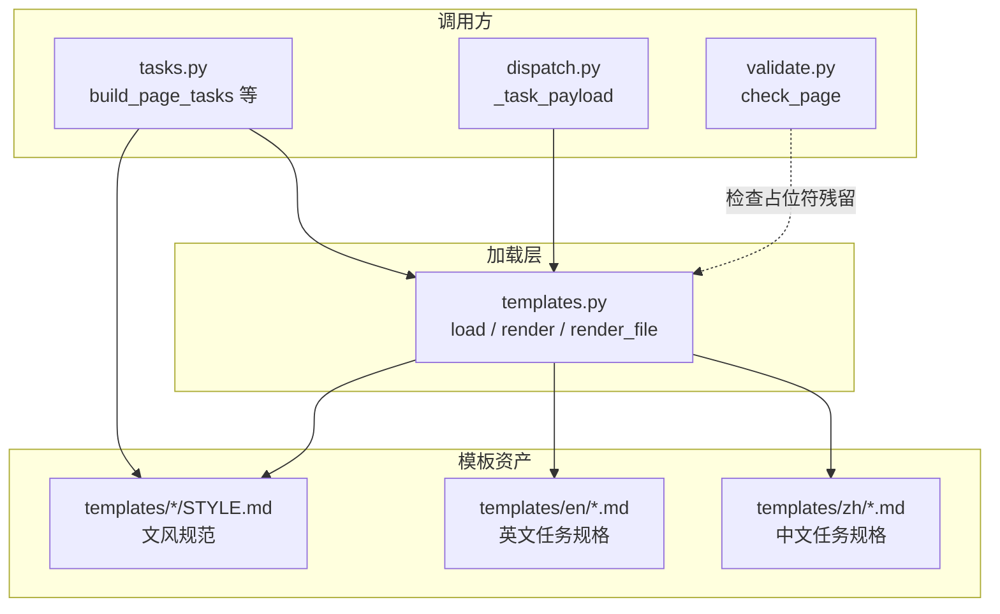
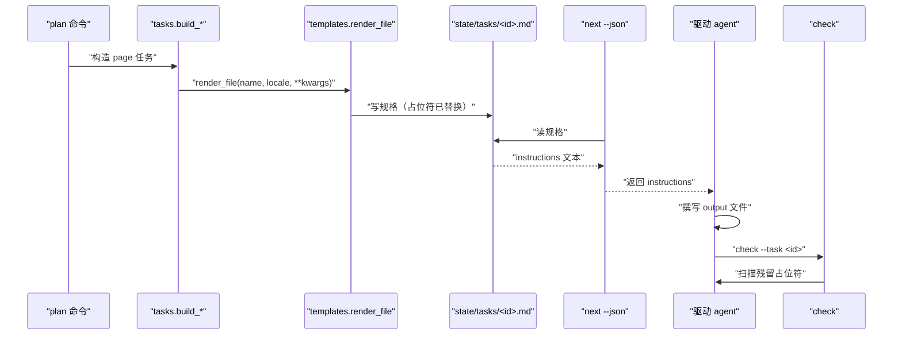
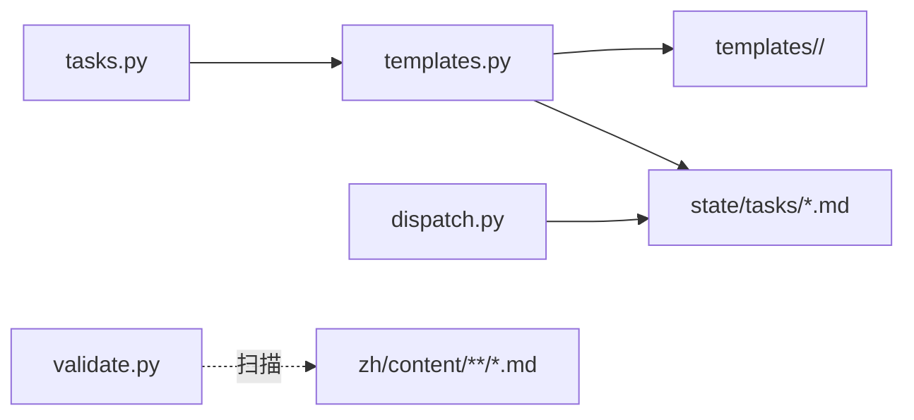

# 模板加载与占位符预渲染

<cite>
**本文引用的文件**
- [src/repowiki/templates.py](file://src/repowiki/templates.py)
- [src/repowiki/templates/zh/STYLE.md](file://src/repowiki/templates/zh/STYLE.md)
- [src/repowiki/templates/zh/page_task.md](file://src/repowiki/templates/zh/page_task.md)
- [src/repowiki/tasks.py](file://src/repowiki/tasks.py)
- [src/repowiki/validate.py](file://src/repowiki/validate.py)
- [DECISIONS.md](file://DECISIONS.md)
</cite>

## 目录
1. [简介](#简介)
2. [项目结构](#项目结构)
3. [核心组件](#核心组件)
4. [架构总览](#架构总览)
5. [详细组件分析](#详细组件分析)
6. [依赖关系分析](#依赖关系分析)
7. [性能与一致性考量](#性能与一致性考量)
8. [故障排查指南](#故障排查指南)
9. [结论](#结论)

## 简介

模板加载是 repowiki 整个编排链路的「资产层」：`templates.py` 是一个刻意做小的文件加载器，按 locale 取仓库内嵌的 markdown 模板，并用正则替换其中的占位符。它只做三件事——按 locale 读模板、按名字替换占位符、对未提供的占位符原样保留——但这三件事正是「agent 不需要关心规格里有占位符」与「agent 漏替换能被验证器抓到」这两条设计契约的物理基础。

页面主题之所以重要，是因为它在编排系统的三个角色之间架桥：驱动 agent 看到的「任务规格」、CLI 在磁盘上写出的「任务文件」、以及最终落到 wiki 站点里的「页面正文」——三者的形态差异都源自 `templates.py` 的占位符渲染时机与保留语义。

## 项目结构

- `src/repowiki/templates.py`：资产加载器，仅一个模块。
- `src/repowiki/templates/zh/` 与 `src/repowiki/templates/en/`：分别存放简体中文与英文任务规格模板与文风规范。
- `src/repowiki/templates/site.html` 与 `src/repowiki/templates/site/app.js`：单文件离线站点的模板与前端脚本，独立于任务模板。
- `src/repowiki/vendor/`：站点内嵌的 marked 与 mermaid 渲染库。

图表来源
- [src/repowiki/templates.py:1-38](file://src/repowiki/templates.py#L1-L38)
- [src/repowiki/tasks.py:1-40](file://src/repowiki/tasks.py#L1-L40)

章节来源
- [src/repowiki/templates.py:1-38](file://src/repowiki/templates.py#L1-L38)

## 核心组件

- 加载器 `templates.py`：定位包内 `templates/<locale>/`，提供 `load`、`render`、`render_file` 三个函数。
- 占位符正则：`_PLACEHOLDER_RE`，匹配大写字母开头、后接大写字母数字下划线的命名形式，例如 `\{\{NAME\}\}` 这种字面量。
- 未知占位符保留：未在 `kwargs` 中提供的占位符保留原文，作为「漏替换可被检测」的探针。
- 模板目录布局：`templates/zh/`、`templates/en/` 各自含完整的 STYLE 规范、catalog/knowledge/page/overview/update 任务模板。

章节来源
- [src/repowiki/templates.py:1-38](file://src/repowiki/templates.py#L1-L38)

## 架构总览

加载链路由 `tasks.build_*` 触发：当构造一个新页面任务时，调用 `render_file("page_task.md", locale=locale, TITLE=node["title"], OUTPUT=node["output"], ...)`；模板里的占位符被一次性填好，写出的规格落盘到 `state/tasks/<id>.md`。`dispatch._task_payload` 在 `next --json` 时把规格文本读进 `instructions` 字段返回给驱动 agent；agent 按规格只写 `output` 文件。验证器在 `check_page` / `check_overview` 时重新扫描产物文件：若发现残留的占位符（即形如 `\{\{KEY\}\}` 的字面量），按 STYLE 规范判定为「未完成替换」的失败原因。

图表来源
- [src/repowiki/templates.py:1-38](file://src/repowiki/templates.py#L1-L38)
- [src/repowiki/tasks.py:1-40](file://src/repowiki/tasks.py#L1-L40)
- [src/repowiki/dispatch.py:1-60](file://src/repowiki/dispatch.py#L1-L60)
- [src/repowiki/validate.py:1-90](file://src/repowiki/validate.py#L1-L90)

章节来源
- [src/repowiki/templates.py:1-38](file://src/repowiki/templates.py#L1-L38)
- [src/repowiki/dispatch.py:1-60](file://src/repowiki/dispatch.py#L1-L60)

## 详细组件分析

### 加载函数 `load` 与 locale 回退

- 职责：按 `<TEMPLATE_DIR>/<locale>/<name>` 取模板；若 locale 子目录缺文件，回退到默认 locale 的同名模板。
- 关键行为：`TEMPLATE_DIR = Path(__file__).parent / "templates"` 把模板目录绑定到包内，pip 安装或开发模式都能找到。
- 实现要点：用 `pathlib` 而非 `importlib.resources` 是为了简化路径拼接；缺文件时的 `is_file()` 检查决定了多语言环境的容错行为——中文 spec 缺某模板时自动用英文版本。

### 渲染函数 `render` 与正则替换

- 职责：用正则把 `\{\{KEY\}\}` 替换为 `kwargs[KEY]`；未在 `kwargs` 中提供的占位符原样保留。
- 实现要点：「未知占位符原样保留」是故意的——模板里写错（例把 `\{\{TITLE\}\}` 写成 `\{\{Title\}\}`）会让渲染结果里直接露出这个错误形态，agent 看到后可一眼发现；agent 在产出文件中漏替换的占位符也会被验证器用同一正则扫出，等价于「自带单元测试的脚手架」。
- 关键行为：替换只发生一次（`re.sub` 默认不递归），因此 `\{\{A\{\{B\}\}C\}\}` 这种嵌套形式不会被识别——这是有意为之，避免递归替换带来的不可预期行为。

### 占位符预渲染：任务构造阶段即替换

- 职责：在任务规格被写入 `state/tasks/<id>.md` 之前，就把标题与输出路径等占位符替换为具体值；agent 看不到占位符。
- 关键行为：`tasks.build_page_tasks` 等构造器在创建每条记录时调用 `render_file`，所有标题类占位符一次性填好；落到磁盘的规格只剩两类占位符——验证器关心的「agent 漏替换」探针，以及故意保留的「agent 必须替换」探针。
- 实现要点：把「agent 上下文里不必要的不变量」在构造阶段消解，动机来自 DECISIONS 第 4 条：一是减少 agent 上下文噪音（agent 不用关心标题占位符该填什么，因为已经是 `快速开始` 了），二是让验证器的正则扫描只聚焦「agent 真正需要替换的字段」，避免误报。

### STYLE 规范作为模板的一部分

- 职责：每个 locale 的 `STYLE.md` 描述该语言下的写作约束（语言、引用格式、mermaid 风格、章节结构）。
- 关键行为：`tasks.build_page_tasks` 在生成 page 任务时把 `STYLE.md` 的全文嵌入到任务规格的「文风与图表规范」小节中；agent 不需要查任何外部资料就能按规则写产出。
- 实现要点：STYLE 与模板一并落盘到 `state/tasks/<id>.md`，是「规格自包含」原则的具体表现；这一原则也意味着 STYLE 不能引用外部链接，否则会破坏自包含。

章节来源
- [src/repowiki/templates.py:1-38](file://src/repowiki/templates.py#L1-L38)
- [src/repowiki/templates/zh/STYLE.md:1-50](file://src/repowiki/templates/zh/STYLE.md#L1-L50)
- [src/repowiki/templates/zh/page_task.md:1-40](file://src/repowiki/templates/zh/page_task.md#L1-L40)

## 依赖关系分析

- 上游：`pyyaml` 在 `pyproject.toml` 中声明，但不直接被 `templates.py` 使用；模板系统是纯文本字符串处理，零运行时依赖。
- 同级：`tasks.py` 是最大消费方（构造任务规格），`dispatch.py` 在运行时读取规格，`validate.py` 在校验阶段反向扫描占位符。
- 下游：站点构建阶段（`site.py`）不依赖 `templates.py`——它直接读 `zh/content/` 下的产物文件，不关心模板是否存在。

图表来源
- [src/repowiki/templates.py:1-38](file://src/repowiki/templates.py#L1-L38)
- [src/repowiki/tasks.py:1-40](file://src/repowiki/tasks.py#L1-L40)
- [src/repowiki/dispatch.py:1-60](file://src/repowiki/dispatch.py#L1-L60)
- [src/repowiki/validate.py:1-90](file://src/repowiki/validate.py#L1-L90)

章节来源
- [src/repowiki/templates.py:1-38](file://src/repowiki/templates.py#L1-L38)

## 性能与一致性考量

- 模板按需读取：`render_file` 每次都从磁盘 `read_text`，不缓存；任务构造阶段对每个 page 都调用一次，几十个任务量级下磁盘 IO 不是瓶颈。
- 正则开销：`_PLACEHOLDER_RE` 是模块级单例，`re.sub` 在短模板（< 1KB）上耗时可忽略。
- locale 一致性：`load` 缺文件时回退到 `DEFAULT_LOCALE`，但 `render_file` 不会做这种回退——调用方必须保证 `tasks.py` 构造时传入的 locale 与模板存在性一致；这点在 plan 阶段由 `i18n.SUPPORTED` 白名单保证。
- 渲染幂等：相同输入（模板 + kwargs）产出相同文本——这是「规格自包含」的前提；agent 可以多次重读规格而不产生歧义。

章节来源
- [src/repowiki/templates.py:1-38](file://src/repowiki/templates.py#L1-L38)

## 故障排查指南

- 模板中占位符被保留未替换：通常是模板与 `tasks.build_*` 的 kwargs 名不匹配——例如模板里写 `\{\{ TITLE \}\}`（含空格），正则 `[A-Z][A-Z0-9_]*` 不会匹配，渲染时原样保留；用同一正则去搜索模板，确认所有占位符符合命名规范。
- 验证器报「占位符未替换」：agent 在产出文件里漏写了应该替换的占位符；定位方式——用 `_PLACEHOLDER_RE` 在 agent 产出里搜一遍，定位残留的占位符名，回溯模板确认其语义。
- locale 路径不存在：locale 不在 `i18n.SUPPORTED` 白名单里，或 `templates/<locale>/` 目录缺失；前者需要新增 locale 支持，后者回退到 `DEFAULT_LOCALE`（仅 `load` 会回退，`render_file` 不会）。
- 模板编码问题：`read_text(encoding="utf-8")` 与写入侧的 `utf-8` 一致；但 Windows 默认编码是 GBK，外部编辑模板时需注意保存为 UTF-8。

章节来源
- [src/repowiki/templates.py:1-38](file://src/repowiki/templates.py#L1-L38)
- [src/repowiki/validate.py:1-90](file://src/repowiki/validate.py#L1-L90)
- [src/repowiki/i18n.py:1-133](file://src/repowiki/i18n.py#L1-L133)

## 结论

`templates.py` 是一个刻意做小的资产加载器——只负责「按 locale 取模板 + 用正则替换占位符 + 未知占位符保留原文」三件事。标题类占位符在任务构造阶段即被替换，让驱动 agent 看不到不必要的不变量；未知占位符保留则是「漏替换可被验证器检测」的关键设计。STYLE 规范作为模板的一部分内联进每条规格，是「规格自包含」原则的具体表现：agent 不需要查任何外部资料就能按规则写产出。对于想要新增语言或新增模板类型的开发者，最自然的接入点是新建 `templates/<locale>/<name>` 并在 `tasks.py` 里增加对应的 `render_file` 调用——无需改动加载器本身。

章节来源
- [src/repowiki/templates.py:1-38](file://src/repowiki/templates.py#L1-L38)
- [src/repowiki/templates/zh/STYLE.md:1-50](file://src/repowiki/templates/zh/STYLE.md#L1-L50)
- [DECISIONS.md:1-40](file://DECISIONS.md#L1-L40)
