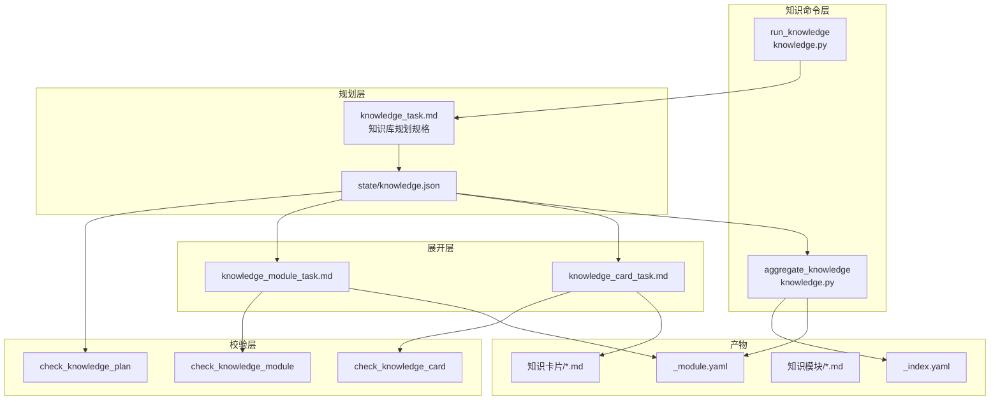
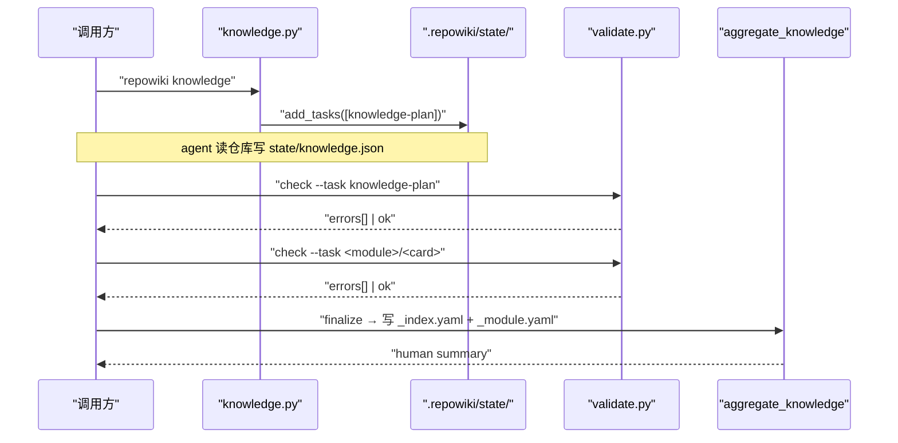
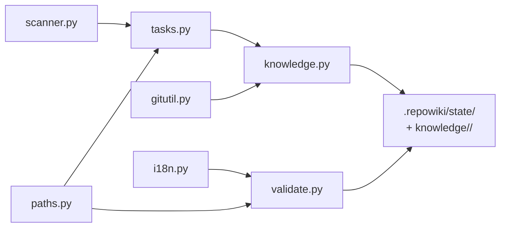

# 知识卡片任务族

<cite>
**本文引用的文件**
- [src/repowiki/knowledge.py](file://src/repowiki/knowledge.py)
- [src/repowiki/templates/zh/knowledge_task.md](file://src/repowiki/templates/zh/knowledge_task.md)
- [src/repowiki/templates/zh/knowledge_card_task.md](file://src/repowiki/templates/zh/knowledge_card_task.md)
- [src/repowiki/templates/zh/knowledge_module_task.md](file://src/repowiki/templates/zh/knowledge_module_task.md)
- [src/repowiki/validate.py](file://src/repowiki/validate.py)
- [src/repowiki/tasks.py](file://src/repowiki/tasks.py)
- [src/repowiki/paths.py](file://src/repowiki/paths.py)
- [src/repowiki/i18n.py](file://src/repowiki/i18n.py)
- [DECISIONS.md](file://DECISIONS.md)
</cite>

## 目录
1. [简介](#简介)
2. [项目结构](#项目结构)
3. [核心组件](#核心组件)
4. [架构总览](#架构总览)
5. [详细组件分析](#详细组件分析)
6. [依赖关系分析](#依赖关系分析)
7. [性能与一致性考量](#性能与一致性考量)
8. [故障排查指南](#故障排查指南)
9. [结论](#结论)

## 简介

「知识卡片任务族」是 `repowiki` 在 Wiki 页面之外的第二条产物线：通过 `repowiki knowledge` 命令在已有 plan 之上追加一个 `knowledge-plan` 任务，agent 写出 `state/knowledge.json`（模块树 + 机制卡片清单）后由 validate + dispatch 把它展开成 N 个 `knowledge_module` 与 M 个 `knowledge_card` 任务；最终由 `aggregate_knowledge` 在 finalize 时把模块元数据聚合到 `_index.yaml` 与每个模块目录下的 `_module.yaml`。理解这层抽象就掌握了与页面体系完全解耦、横切机制可单独检索的第二条知识流。

## 项目结构

与「知识卡片任务族」相关的源文件集中在 `src/repowiki/knowledge.py` 与 `templates/zh/`：

- `src/repowiki/knowledge.py` —— `run_knowledge` 命令入口；`aggregate_knowledge` 在 finalize 时合并 `_index.yaml` / `_module.yaml`。
- `src/repowiki/templates/zh/knowledge_task.md` —— `knowledge-plan` 任务的规格：JSON schema + 模块/卡片规划规则 + 质量自检。
- `src/repowiki/templates/zh/knowledge_card_task.md` —— 单张机制卡片任务的规格：YAML front matter + 四个固定编号小节（体系概览 / 关键文件与包 / 架构与设计约定 / 开发者应遵循的规则）。
- `src/repowiki/templates/zh/knowledge_module_task.md` —— 模块文档任务的规格：必写的 `概述.md` / `技术栈.md` / `架构设计.md`，可选 `特殊配置与命令.md` 与 `编码规范.md`。
- `src/repowiki/validate.py` —— `check_knowledge_plan / check_knowledge_module / check_knowledge_card` 是这三类任务的校验入口。
- `src/repowiki/tasks.py` —— `build_knowledge_plan_task / build_knowledge_tasks` 把 plan JSON 展开为模块/卡片任务记录。
- `src/repowiki/paths.py` —— `WikiPaths.knowledge_dir` 提供 `knowledge/<locale>/` 的统一路径。
- `src/repowiki/i18n.py` —— `STRINGS.card_sections` 是卡片正文四个小节标题的多语表（zh/en）；`KNOWLEDGE_CATEGORIES` 是 6 类合法 category 的集合。
- `.repowiki/state/knowledge.json` —— knowledge-plan 任务的产物；既是知识库规划的源头，也是 finalize 时聚合 `_index.yaml` 的输入。
- `.repowiki/knowledge/<locale>/` —— 模块目录与卡片 markdown 的产出根；finalize 时会额外写 `_index.yaml` 与每个模块的 `_module.yaml`。

图表来源
- [src/repowiki/knowledge.py:19-119](file://src/repowiki/knowledge.py#L19-L119)

章节来源
- [src/repowiki/knowledge.py:1-9](file://src/repowiki/knowledge.py#L1-L9)

## 核心组件

- **run_knowledge(paths, as_json)**（knowledge.py）：知识命令入口；先校验 `index.json` 已存在（要求先 plan），再追加 `knowledge-plan` 任务记录。
- **knowledge-plan 任务**（tasks.py + knowledge_task.md）：唯一产物是 `state/knowledge.json`；schema 含 `modules[]` 与 `cards[]`，每条记录有 id/title/scope 等字段。
- **build_knowledge_tasks(paths, plan)**（tasks.py）：把 knowledge.json 中的 modules 与 cards 展开成 N+M 个 `new_task` 记录（kind 分别为 `knowledge_module` 与 `knowledge_card`）。
- **knowledge_module 任务**：产物是目录（含 `概述.md / 技术栈.md / 架构设计.md` 等）；`_module.yaml` 由 `aggregate_knowledge` 自动生成，禁止手写。
- **knowledge_card 任务**：产物是单个 markdown 文件（含 YAML front matter + 四个编号小节）；front matter 含 kind/name/category/scope/source_files。
- **KNOWLEDGE_CATEGORIES**（validate.py）：六类合法 category（configuration_system / logging_system / error_handling / build_system / dependency_management / frontend_style）；非法值直接 fail。
- **check_knowledge_plan(data, known_paths)**（validate.py）：校验 modules / cards 的结构、id 唯一、scope 命中已知路径、引用闭合；返回 (errors, warnings)。
- **check_knowledge_module(out_dir, locale)**（validate.py）：检查模块目录存在且三个必需文件非空。
- **check_knowledge_card(raw, title, category, repo_root, locale)**（validate.py）：要求 front matter 合法、category 在枚举内、source_files 路径存在、正文四节齐全、H1 与 title 一致。
- **aggregate_knowledge(paths, plan, task_records)**（knowledge.py）：在 finalize 时把模块元数据写入 `_index.yaml` 与每个模块的 `_module.yaml`；branch 取自 `git rev-parse --abbrev-ref HEAD`（默认 main）。

章节来源
- [src/repowiki/knowledge.py:40-119](file://src/repowiki/knowledge.py#L40-L119)

## 架构总览

知识卡片任务族以「规划 → 展开 → 校验 → 聚合」四步流水线运行：用户先 `repowiki plan` 把 wiki 页面排程到位；再 `repowiki knowledge` 追加一个 `knowledge-plan` 任务，agent 读仓库后产出 `state/knowledge.json`；dispatch 校验通过后自动展开为 N+M 个子任务；worker 各自写模块目录与卡片 markdown；finalize 触发 `aggregate_knowledge` 把模块元数据落盘到 `_index.yaml` 与 `_module.yaml`。这条流水线与页面体系完全独立——同一仓库可以多次运行、互不干扰，且模块/卡片是横切机制视角，弥补了页面体系按主题划分的盲区。

图表来源
- [src/repowiki/knowledge.py:40-119](file://src/repowiki/knowledge.py#L40-L119)

章节来源
- [src/repowiki/knowledge.py:19-37](file://src/repowiki/knowledge.py#L19-L37)

## 详细组件分析

### run_knowledge 与前置校验

- 职责：在已有 plan 之上追加 knowledge 任务集，并把展开动作交回 dispatch。
- 关键行为：先校验 `TaskStore.load()["tasks"]` 非空（要求先 plan），否则抛 `UsageError`；调用 `task_builders.build_knowledge_plan_task(paths, scan(...))` 生成 phase=2 的 knowledge-plan 任务并 `add_tasks`。
- 实现要点：这一步只产生 1 条任务记录，模块/卡片任务是后续由 dispatch 在 knowledge-plan check 通过时再展开的；这让 plan/knowledge 两条命令各自的代价固定，与仓库大小解耦。

章节来源
- [src/repowiki/knowledge.py:19-31](file://src/repowiki/knowledge.py#L19-L31)

### knowledge-plan 任务规格（knowledge_task.md）

- 职责：定义 `state/knowledge.json` 的 schema 与规划规则，让任何 agent 写出的规划都通过 `check_knowledge_plan`。
- 关键行为：JSON schema 含 `modules[].{id, title, scope, children, depends_on, related_to}` 与 `cards[].{id, title, category, scope, source_files}`；规划规则限制根模块 2~8 个，机制卡片 0~2 张/类（宁缺毋滥）。
- 实现要点：category 必须落在 `configuration_system / logging_system / error_handling / build_system / dependency_management / frontend_style` 六选一，是 validate 校验的硬约束。

章节来源
- [src/repowiki/templates/zh/knowledge_task.md:1-60](file://src/repowiki/templates/zh/knowledge_task.md#L1-L60)

### 知识卡片任务规格（knowledge_card_task.md）

- 职责：定义单张机制卡片的写作模板，使所有卡片遵循一致的「体系概览 / 关键文件与包 / 架构与设计约定 / 开发者应遵循的规则」四节结构。
- 关键行为：front matter 必含 kind/name/category/scope/source_files；正文严格四个编号小节；篇幅 30~80 行；「开发者应遵循的规则」必须是可执行约定。
- 实现要点：模板通过 `templates.render_file` 在 `tasks.build_knowledge_tasks` 里渲染；agent 写完后 `check_knowledge_card` 校验 front matter、category、H1 与四节齐全性。

章节来源
- [src/repowiki/templates/zh/knowledge_card_task.md:1-65](file://src/repowiki/templates/zh/knowledge_card_task.md#L1-L65)

### 知识模块任务规格（knowledge_module_task.md）

- 职责：定义每个模块目录下必写的文件清单与每份文件的篇幅约束。
- 关键行为：必写 `概述.md`（1~2 句）/ `技术栈.md`（1~3 句）/ `架构设计.md`（3~6 条 bullet）；可选 `特殊配置与命令.md`（无则写「见根目录 README」）/ `编码规范.md`（仅当模块有明确约定时写）。
- 实现要点：`check_knowledge_module` 只校验「三个必需文件存在且非空」，不校验可选文件——允许极简模块的快速覆盖。

章节来源
- [src/repowiki/templates/zh/knowledge_module_task.md:1-33](file://src/repowiki/templates/zh/knowledge_module_task.md#L1-L33)

### aggregate_knowledge 与 _index.yaml / _module.yaml

- 职责：在 finalize 时把模块元数据从 `state/knowledge.json` 与 `task_records` 合并成结构化 yaml，供第三方消费（搜索 / 索引 / 跳转）。
- 关键行为：`mod_dirs` 由 `task_records` 中 `kind=knowledge_module` 的 output 路径提取（去掉尾部 `/` 后取最后一段）；每个模块写一个 `_module.yaml`，根目录写一个 `_index.yaml`，二者都含 `schema_version=1` 与 `locale`（zh→zh-CN，en→en）。
- 实现要点：branch 由 `git rev-parse --abbrev-ref HEAD` 读取，失败时回退到 "main"；这是把知识库绑定到当前分支的轻量约定——支持后续跨分支对比。

章节来源
- [src/repowiki/knowledge.py:40-119](file://src/repowiki/knowledge.py#L40-L119)

## 依赖关系分析

- `knowledge.py` 同时依赖 `tasks.py`（构造器）与 `scanner.py`（构造 knowledge-plan 时需要 inventory 的 key_files/tree_summary）。
- `validate.py` 的 `check_knowledge_*` 依赖 `i18n.STRINGS.card_sections / module_required_files` 与 `paths.WikiPaths.knowledge_dir`，是知识体系的校验入口。
- `tasks.py` 的 `build_knowledge_tasks` 把 `state/knowledge.json` 转成 N+M 条任务记录；构造过程中使用 `paths.sanitize_component + unique_name` 保证目录名无非法字符且全局唯一。
- `knowledge.py` 的 `aggregate_knowledge` 依赖 `gitutil.run_git` 拿当前分支名；这是「知识卡与分支绑定」的物理依赖。
- `DECISIONS.md` 中无单独条目讨论知识卡片族；该族来自「知识库作为页面体系之外的第二条产物」的隐含设计——与 catalog.json / index.json 一起构成 repowiki 三种结构化产物（页面 JSON + 任务 JSON + 知识库 JSON）。

图表来源
- [src/repowiki/knowledge.py:1-17](file://src/repowiki/knowledge.py#L1-L17)

章节来源
- [src/repowiki/knowledge.py:1-17](file://src/repowiki/knowledge.py#L1-L17)

## 性能与一致性考量

- **plan/knowledge 解耦**：`run_knowledge` 只追加一条 knowledge-plan 任务，不在调用时立即展开 N+M 条子任务——展开由 dispatch 在 check 通过后触发，保证 knowledge 命令的 O(1) 开销。
- **目录命名唯一化**：`tasks.build_knowledge_tasks` 用 `unique_name(sanitize_component(title), used_dirs)` 保证目录名无冲突；多卡片共用一个根时自动加 `__2/__3` 后缀。
- **category 硬枚举**：六类机制（配置/日志/错误处理/构建/依赖/前端风格）是 `KNOWLEDGE_CATEGORIES` 的硬集合；非法值直接 fail，避免分类蔓延。
- **front matter 即 schema**：卡片 front matter 字段就是 `check_knowledge_card` 的最小校验面；agent 只要按模板填即可通过校验。
- **模块三个文件即可**：模块只校验 `概述.md / 技术栈.md / 架构设计.md` 三个必需文件，可选文件不强制——让极简模块快速覆盖成为可能。
- **分支快照**：`aggregate_knowledge` 把当前 `git rev-parse --abbrev-ref HEAD` 写入 `_index.yaml.branch`，支持跨分支对比知识库。
- **与页面体系解耦**：知识库独立目录（`knowledge/<locale>/`）、独立文件格式（YAML front matter + 4 节）、独立校验函数（`check_knowledge_*`）——保证页面体系演进不影响知识卡片族。

章节来源
- [src/repowiki/knowledge.py:40-66](file://src/repowiki/knowledge.py#L40-L66)

## 故障排查指南

- 现象：`UsageError: 请先运行 repowiki plan <repo>`。
  - 原因：在没有 plan 的仓库上直接运行 `repowiki knowledge`，`TaskStore.load()["tasks"]` 为空。
  - 定位步骤：先跑 `repowiki plan <repo>`，再跑 `repowiki knowledge`。
  - 相关代码位置：[src/repowiki/knowledge.py:22-23](file://src/repowiki/knowledge.py#L22-L23)。

- 现象：knowledge-plan check 报 `category 非法 xxx`。
  - 原因：卡片 category 不在 6 类合法集合内。
  - 定位步骤：把 category 改为 configuration_system / logging_system / error_handling / build_system / dependency_management / frontend_style 之一。
  - 相关代码位置：[src/repowiki/validate.py:199-202](file://src/repowiki/validate.py#L199-L202)、[src/repowiki/validate.py:249-253](file://src/repowiki/validate.py#L249-L253)。

- 现象：knowledge-plan check 报 `scope 路径 path 未命中任何仓库文件`。
  - 原因：模块或卡片的 scope 引用了仓库不存在的路径。
  - 定位步骤：用 `ls` 确认路径存在；scope 可以是目录前缀（`src/repowiki/`）；`**` 表示整个仓库。
  - 相关代码位置：[src/repowiki/validate.py:235-237](file://src/repowiki/validate.py#L235-L237)。

- 现象：知识卡片 check 报 `front matter 缺少 source_files 列表`。
  - 原因：YAML front matter 中 source_files 字段缺失或为空。
  - 定位步骤：按模板填写 source_files，必须是真实存在的仓库相对路径列表（2~8 个）。
  - 相关代码位置：[src/repowiki/validate.py:294-298](file://src/repowiki/validate.py#L294-L298)。

- 现象：知识模块 check 报 `缺少必需文件 概述.md`。
  - 原因：模块目录下没有 `概述.md` / `技术栈.md` / `架构设计.md` 三个必需文件之一，或内容为空。
  - 定位步骤：检查任务产物的目录结构；按模板写三个简短文档（标题、内容各 1~3 句）。
  - 相关代码位置：[src/repowiki/validate.py:259-271](file://src/repowiki/validate.py#L259-L271)。

- 现象：知识卡片 check 报 `缺少小节 ## 4. 开发者应遵循的规则`。
  - 原因：正文四个编号小节不全；最常见于 agent 合并相邻小节时把标题改写。
  - 定位步骤：按模板四个小节标题写：`## 1. 体系概览` / `## 2. 关键文件与包` / `## 3. 架构与设计约定` / `## 4. 开发者应遵循的规则`；编号与中文标题必须严格一致。
  - 相关代码位置：[src/repowiki/validate.py:300-303](file://src/repowiki/validate.py#L300-L303)。

- 现象：finalize 后没有 `_index.yaml`。
  - 原因：`aggregate_knowledge` 在 `mod_dirs` 为空时直接返回空字符串，跳过聚合。
  - 定位步骤：检查 knowledge.json 的 modules 是否非空；检查 knowledge_module 任务的 output 路径是否被 dispatcher 正确登记。
  - 相关代码位置：[src/repowiki/knowledge.py:46-55](file://src/repowiki/knowledge.py#L46-L55)。

- 现象：_index.yaml.branch 显示 "main" 但当前在其他分支。
  - 原因：`git rev-parse --abbrev-ref HEAD` 失败或非 git 仓库时回退到 "main"。
  - 定位步骤：确认目录是 git 工作树；用 `git branch --show-current` 验证分支。
  - 相关代码位置：[src/repowiki/knowledge.py:61](file://src/repowiki/knowledge.py#L61)。

章节来源
- [src/repowiki/knowledge.py:19-37](file://src/repowiki/knowledge.py#L19-L37)

## 结论

「知识卡片任务族」是 `repowiki` 在页面体系之外的第二条产物线：通过一个 `knowledge-plan` 任务规划 N+M 条模块/卡片任务，模块按 scope 切分系统结构，卡片按 6 类 category 抽取横切机制，产出独立于 Wiki 页面的 `knowledge/<locale>/` 目录树与 `_index.yaml` / `_module.yaml` 索引。这层抽象让 `repowiki` 既能产出面向章节的页面，又能产出面向机制的卡片视图，两者通过相同的 worker 循环、相同的 stale 回收、相同的 touch 心跳共享并发基础设施。

章节来源
- [src/repowiki/knowledge.py:1-9](file://src/repowiki/knowledge.py#L1-L9)