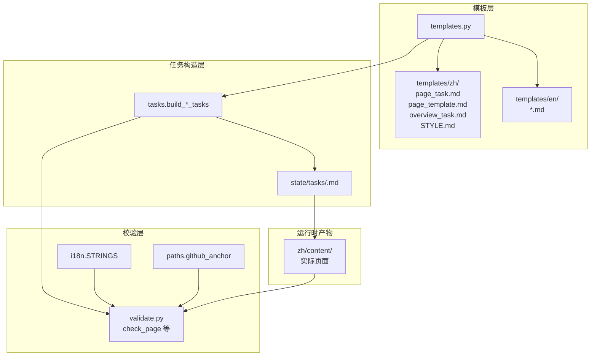
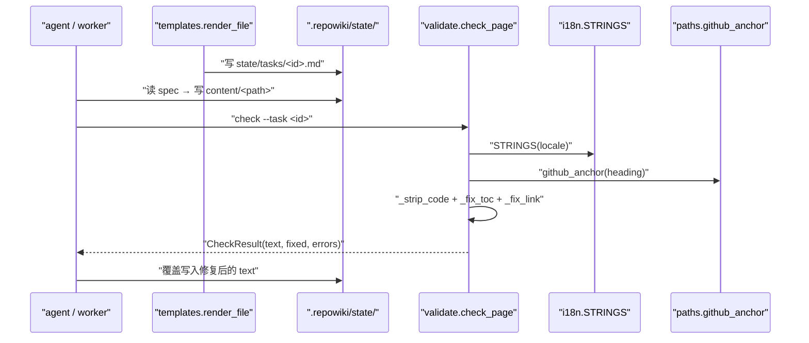
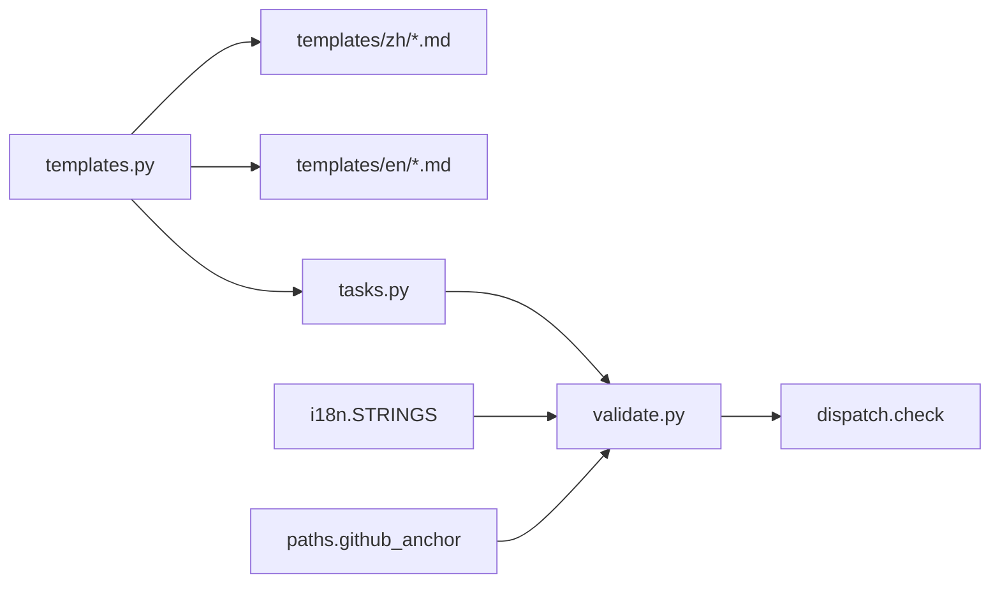

# 页面模板与校验

<cite>
**本文引用的文件**
- [src/repowiki/templates.py](file://src/repowiki/templates.py)
- [src/repowiki/validate.py](file://src/repowiki/validate.py)
- [src/repowiki/templates/zh/page_task.md](file://src/repowiki/templates/zh/page_task.md)
- [src/repowiki/templates/zh/page_template.md](file://src/repowiki/templates/zh/page_template.md)
- [src/repowiki/templates/zh/overview_task.md](file://src/repowiki/templates/zh/overview_task.md)
- [src/repowiki/i18n.py](file://src/repowiki/i18n.py)
- [src/repowiki/paths.py](file://src/repowiki/paths.py)
- [src/repowiki/tasks.py](file://src/repowiki/tasks.py)
- [docs/zh/DECISIONS.md](file://docs/zh/DECISIONS.md)
</cite>

## 更新摘要

**变更内容**
- 更新占位符扫描语义：`validate.py` 新增 `_strip_code`——占位符残留检查现在只作用于剥离代码围栏与行内代码后的正文，在代码块中合法展示 `\{\{...\}\}` 语法本身的页面（如描述模板机制的自举文档）不再被误判为「未替换占位符」（[src/repowiki/validate.py:63-76](file://src/repowiki/validate.py#L63-L76)、[src/repowiki/validate.py:99-100](file://src/repowiki/validate.py#L99-L100)）；`check_page`/`check_knowledge_card`/`check_overview` 三处扫描同步切换。
- `_PLACEHOLDER_RE` 更名为公开的 `PLACEHOLDER_RE`（行号不变，[src/repowiki/validate.py:23](file://src/repowiki/validate.py#L23)）。
- 同步修正全文 `validate.py` 行号引用（文件现为 347 行）与 `DECISIONS.md` 迁移后的路径（`docs/zh/DECISIONS.md`）。

## 目录
1. [更新摘要](#更新摘要)
2. [简介](#简介)
3. [项目结构](#项目结构)
4. [核心组件](#核心组件)
5. [架构总览](#架构总览)
6. [详细组件分析](#详细组件分析)
7. [依赖关系分析](#依赖关系分析)
8. [性能与一致性考量](#性能与一致性考量)
9. [故障排查指南](#故障排查指南)
10. [结论](#结论)

## 简介

「页面模板与校验」是 `repowiki` 流水线的一致性背书：模板引擎（`templates.py` + `templates/<locale>/*.md`）用大写花括号占位符替换语法（形如 `\{\{PLACEHOLDER\}\}`）把 catalog 节点、章节路径、hint_files 等组装成完整任务规格；`validate.py` 的 `check_page` 规则引擎以"自动修复可计算项 + 仅对语义错误失败"的策略，把所有可机械修正的缺陷（锚点、行号、路径分隔符、H1）就地修好并写入 `fixed` 列表，只让缺失小节、dangling 文件引用、未配对的代码围栏进入 `errors`。理解这层抽象就掌握了 worker 写出的页面如何被自动塑形为统一风格。

## 项目结构

与「页面模板与校验」相关的源文件集中在 `src/repowiki/templates/` 与 `src/repowiki/validate.py`：

- `src/repowiki/templates.py` —— 模板加载与花括号占位符替换（形如 `\{\{PLACEHOLDER\}\}`）；含 `load / render / render_file` 三个函数。
- `src/repowiki/templates/zh/` —— zh locale 的完整模板集，含 `page_task.md / page_template.md / overview_task.md / STYLE.md` 等。
- `src/repowiki/templates/en/` —— 与 zh 同构的英文模板集；`load` 在 locale 缺失时回退到默认 locale 的同名模板。
- `src/repowiki/validate.py` —— 规则引擎与确定性修复；含 `check_page / check_knowledge_plan / check_knowledge_module / check_knowledge_card / check_overview` 与占位符扫描预处理 `_strip_code`。
- `src/repowiki/i18n.py` —— `STRINGS.required_sections / toc / overview_h1_suffix / card_sections` 是 validate 的母参数。
- `src/repowiki/paths.py` —— `github_anchor` 为 TOC 自动重建提供锚点算法；`nfc` 用于 H1 比较前的 Unicode 归一化。
- `src/repowiki/tasks.py` —— `build_page_tasks` / `build_overview_task` 调用 `templates.render_file` 与 `templates.render` 组装规格。



图表来源
- [src/repowiki/templates.py:22-38](file://src/repowiki/templates.py#L22-L38)

章节来源
- [src/repowiki/templates.py:1-9](file://src/repowiki/templates.py#L1-L9)

## 核心组件

- **load(name, locale)**（templates.py）：从 `templates/<locale>/<name>` 读取模板；locale 缺失时回退到 `DEFAULT_LOCALE`（zh）。
- **render(text, **kwargs)**（templates.py）：用花括号 `\{\{KEY\}\}` 形式做命名替换；未知占位符**保留原样**——这是 validate 抓"agent 忘了替换"的故意设计。
- **render_file(name, locale, **kwargs)**（templates.py）：`render(load(name, locale), **kwargs)` 的便捷封装。
- **page_task.md**（zh/en 模板）：catalog 节点展开成 page 任务时的"规格外壳"——YAML front matter、章节路径、姊妹页面、嵌入的 page_template 与 STYLE。
- **page_template.md**（zh/en 模板）：页面骨架本身——H1、cite、目录、必备小节、mermaid 示例、章节来源/图表来源占位。
- **overview_task.md**（zh/en 模板）：overview 任务的规格外壳——内容要求、文风、目录树输入。
- **STYLE.md**（zh/en 模板）：文风与图表规范的全部正文，被嵌入到 page_task/overview_task 中。
- **check_page**（validate.py）：页面校验主入口；自动修 H1、TOC 锚点、链接路径分隔符、行区间钳制；只对缺失小节、缺失 `<cite>`、mermaid 不足、dangling 引用、围栏不配对、占位符残留失败。
- **_strip_code**（validate.py）：占位符扫描的预处理——剥离代码围栏与行内代码，让扫描只针对正文散文。
- **CheckResult**（validate.py）：带 `ok / errors / warnings / fixed / text` 的 dataclass；`text` 持有"已自动修复"的最终文本，命令层把它覆盖回磁盘。
- **placeholder regex**（validate.py）：`\{\{[A-Z][A-Z0-9_]*\}\}`；在正文（非代码块）中命中即视为 agent 忘了替换，是首道硬错误。
- **required_sections**（i18n.STRINGS）：zh/en 各自的必备小节表，前缀匹配支持「性能与一致性考量 / 性能考量」等变体。

章节来源
- [src/repowiki/validate.py:91-193](file://src/repowiki/validate.py#L91-L193)

## 架构总览

模板与校验形成"上游成型 / 下游塑形"的双层流水线：上游 `templates.render_file` 把 catalog 节点、inventory、locale 灌进 page_task / overview_task 模板，落盘到 `state/tasks/<id>.md`；worker 按规格写出页面后交给 `check` 触发 `check_page`，规则引擎先把可计算的缺陷就地修复（H1、TOC、链接、范围），只把语义错误冒泡到 `errors`。`text` 字段始终持有"修复后"的最终文本，命令层据此覆盖原文件——这让 check 在不改语义的同时把页面塑形成确定性格式。



图表来源
- [src/repowiki/validate.py:91-193](file://src/repowiki/validate.py#L91-L193)

章节来源
- [src/repowiki/validate.py:91-193](file://src/repowiki/validate.py#L91-L193)

## 详细组件分析

### 模板引擎（templates.py）

- 职责：用最小依赖（标准库 `re`）提供花括号占位符替换能力（形如 `\{\{KEY\}\}`），不引入 jinja2 等大型模板库。
- 关键行为：占位符正则仅匹配「`\{\{` + 大写字母开头的标识符 + `\}\}`」；render 阶段未知占位符**保留原样**，让 validator 抓"agent 忘记替换"。
- 实现要点：locale 模板不存在自动回退到 `DEFAULT_LOCALE`；模板内容由纯文本与占位符组成，零模板语言——这是降低 agent 工具门槛的关键设计。

章节来源
- [src/repowiki/templates.py:22-38](file://src/repowiki/templates.py#L22-L38)

### 页面骨架（page_template.md）

- 职责：定义每个 page 任务必须产出的"统一形状"——H1 + cite + 目录 + 9 个必备小节 + 每节图表来源/章节来源。
- 关键行为：必备小节是固定顺序的（简介 / 项目结构 / 核心组件 / 架构总览 / 详细组件分析 / 依赖关系分析 / 性能与一致性考量 / 故障排查指南 / 结论），agent 不得增删顺序。
- 实现要点：内置两个 mermaid 示例（graph TB 与 sequenceDiagram），给 agent 提供风格锚点；agent 必须按相同语法产出额外图。

章节来源
- [src/repowiki/templates/zh/page_template.md:1-113](file://src/repowiki/templates/zh/page_template.md#L1-L113)

### 任务规格（page_task.md）

- 职责：把 catalog 节点展开成完整的 page 任务规格，让 worker 读一份 markdown 即可执行。
- 关键行为：YAML front matter 含 `id / kind / phase / title / output / hint_files`；正文含页面定位、参考文件清单、姊妹页面（仅供定位不链接）、嵌入的 page_template 与硬性检查项。
- 实现要点：嵌入 page_template 与 STYLE 是 "任务规格 = 模板 + 写作约束 + hint_files" 三件套的物理实现；这是 DECISIONS #4「模板内嵌标题预渲染」的延展——把整个写作环境内嵌进任务。

章节来源
- [src/repowiki/templates/zh/page_task.md:1-45](file://src/repowiki/templates/zh/page_task.md#L1-L45)

### 校验主函数 check_page

- 职责：用确定性修复 + 语义判定的方式把 agent 写出的页面塑形到统一标准。
- 关键行为：先在剥离代码围栏与行内代码后的正文里抓 `\{\{PLACEHOLDER\}\}` 残留（`_strip_code`，代码块中合法展示占位符语法不报错）；再校验 H1（不等则 auto-fix 改成任务标题）；按 `required_sections` 检查小节；强制 `<cite>` 块必须含 `file://` 链接；mermaid 围栏数 ≥ 2；逐条替换 `file://` 链接时同时做路径归一、存在性校验、行区间钳制；最后按当前 H2 自动重建「目录」列表。
- 实现要点：所有 `fix` 都返回新文本而非抛异常，语义缺陷（缺失小节、缺失 cite、mermaid 不足、dangling 引用、围栏不配对）才走 `res.fail`；让 `text` 字段始终是"修复后"的可写文本是双层契约——agent 看 errors 修改，check 把 fixed 写回。

章节来源
- [src/repowiki/validate.py:91-193](file://src/repowiki/validate.py#L91-L193)

### 占位符扫描的正文预处理（_strip_code）

- 职责：把代码围栏与行内代码从占位符扫描中剥离，让「页面仍含未替换的模板占位符」只针对散文正文。
- 关键行为：逐行扫描切换进出 ``` 围栏状态，围栏内内容整体替换为空行；围栏外再用 `` `...` `` 行内代码正则替换为空格；得到的纯正文交给 `PLACEHOLDER_RE` 判定。
- 实现要点：动机是自举场景——描述 repowiki 模板机制本身的页面（含本 wiki）必须在代码块里展示字面 `\{\{...\}\}`；旧扫描会把这类合法展示误判为未替换占位符。`check_page`/`check_knowledge_card`/`check_overview` 三处占位符检查都走同一预处理。

章节来源
- [src/repowiki/validate.py:63-76](file://src/repowiki/validate.py#L63-L76)
- [src/repowiki/validate.py:99-100](file://src/repowiki/validate.py#L99-L100)

### 确定性自动修复（_fix_link / _fix_toc）

- 职责：把可机械修正的缺陷（路径分隔符、行区间、H1、TOC 锚点）就地修好并归入 `fixed`，不让 agent 反复打回。
- 关键行为：`_fix_link` 把 Windows 反斜杠统一为正斜杠、范围钳制到 `1..loc`、保留挂起但缺失的文件为 `errors`；`_fix_toc` 用 `github_anchor` 按当前实际 H2 重建「目录」列表，agent 写错的锚点不报错。
- 实现要点：行号钳制算的是 `max(data.count(b"\n"), 1)`（至少 1 行），把 0 字节空文件也算作合法；这是对"小空文件行号 0"的容错。

章节来源
- [src/repowiki/validate.py:147-219](file://src/repowiki/validate.py#L147-L219)

### 总览 / 知识卡片 / 知识模块校验

- 职责：除 page 外的三类产物（overview、knowledge module、knowledge card）也走规则引擎，但门槛不同。
- 关键行为：`check_overview` 不允许 YAML front matter，H1 必须是 `<repo> Wiki 总览`，且必须含 `章节导航 / 如何使用本 Wiki` 两节，占位符扫描同样只查正文；`check_knowledge_card` 要求 YAML front matter 含 `kind / name / category / source_files`，正文按 `STRINGS.card_sections` 列出 4 个编号小节，占位符扫描也走 `_strip_code`；`check_knowledge_module` 只检查目录是否存在且三个必需文件（概述.md / 技术栈.md / 架构设计.md）非空。
- 实现要点：`KNOWLEDGE_CATEGORIES` 是 6 类合法 category 的集合（configuration_system / logging_system / error_handling / build_system / dependency_management / frontend_style），非法 category 直接 fail。

章节来源
- [src/repowiki/validate.py:215-347](file://src/repowiki/validate.py#L215-L347)

## 依赖关系分析

- `templates.py` 是 `tasks.py` 的上游：`build_page_tasks` / `build_overview_task` 调 `templates.render_file` 组装规格；模板本身用 `load` 读取。
- `validate.py` 同时依赖 `i18n.STRINGS` 与 `paths.github_anchor`：必备小节表是 zh/en 各自的；TOC 重建用同一份锚点算法。
- `tasks.py` 的 `build_page_tasks` 把 page_template 与 STYLE 嵌入到 page_task 规格，使规格文件自包含——这是 "任务规格 = 模板 + 写作约束 + hint_files" 三件套的物理保证。
- `dispatch.py` 的 check 命令把 `CheckResult.text` 覆盖写回磁盘，让 fixed 修复实际生效；这是"确定性修复"机制的最后一公里。
- `docs/zh/DECISIONS.md` #4「模板内嵌标题预渲染」解释了 page_task.md 中标题占位符 `\{\{TITLE\}\}` 为什么要先渲染为真实标题——避免 agent 忘记替换（T9 冒烟暴露）。



图表来源
- [src/repowiki/validate.py:1-17](file://src/repowiki/validate.py#L1-L17)

章节来源
- [src/repowiki/templates.py:1-17](file://src/repowiki/templates.py#L1-L17)

## 性能与一致性考量

- **零重型依赖**：模板引擎仅用标准库 `re`，不依赖 jinja2/mako；validate 仅额外依赖 `pyyaml`，与 pyproject.toml 的 `dependencies = ["pyyaml>=6"]` 一致。
- **未知占位符保留**：这是 validator 的故意设计——比 raise 更有用，因为可以一次列出所有未替换占位符。
- **占位符扫描只针对正文**：`_strip_code` 剥离代码围栏与行内代码后再匹配，代码块中合法展示 `\{\{...\}\}` 语法不误报；一次线性扫描 + 一次行内正则替换，开销可忽略。
- **自动修复代替报错**：H1、TOC、行区间、链接分隔符全部走 silent fix；只有语义错误进 errors。这是"agent 协作友好 + 一致性保证"的均衡。
- **mermaid 围栏配对校验**：用 `fences = re.findall(r"^```.*$", text, re.M)` 数奇偶，避免单引号漏闭合的 agent 失误。
- **dangling 引用集去重输出**：missing 路径用 `set` 去重后排序输出，避免同路径重复报错。
- **locale 必备小节前缀匹配**：性能类小节允许「性能与一致性考量」与「性能考量」两种写法并存；这是对 agent 表述差异的容忍。
- **TOC 自动重建**：用 `github_anchor` 按实际 H2 重建整个目录列表——agent 写错的锚点（标点也转 `-`）会被一次性修好（DECISIONS #5）。

章节来源
- [src/repowiki/validate.py:136-193](file://src/repowiki/validate.py#L136-L193)

## 故障排查指南

- 现象：check 报 `页面仍含未替换的模板占位符`。
  - 原因：agent 把 `\{\{OUTPUT\}\}` 等占位符直接写进了**正文散文**（代码块中的展示已被 `_strip_code` 豁免，不触发）；占位符大写开头才会触发。
  - 定位步骤：在非代码区域搜索 `\{\{[A-Z]`；确认 `templates.render_file` 已对所有占位符替换；区分硬错误（占位符残留）与其他错误。
  - 相关代码位置：[src/repowiki/validate.py:23](file://src/repowiki/validate.py#L23)、[src/repowiki/validate.py:63-76](file://src/repowiki/validate.py#L63-L76)、[src/repowiki/validate.py:99-100](file://src/repowiki/validate.py#L99-L100)。

- 现象：check 报 `缺少必备小节「## 性能与一致性考量」`。
  - 原因：agent 漏写必备小节或写错标题。
  - 定位步骤：对照 `i18n.STRINGS[locale]["required_sections"]` 列表；zh 接受前缀匹配（「性能」开头即可）。
  - 相关代码位置：[src/repowiki/validate.py:111-134](file://src/repowiki/validate.py#L111-L134)、[src/repowiki/i18n.py:19-37](file://src/repowiki/i18n.py#L19-L37)。

- 现象：check 报 `mermaid 图数量 1 < 2（至少需要结构图与时序/依赖图各一）`。
  - 原因：只输出一个 mermaid；模板要求至少结构图 + 时序/依赖图。
  - 定位步骤：在「项目结构」或「依赖关系分析」节补一个 graph 类图；在「架构总览」节补 sequenceDiagram。
  - 相关代码位置：[src/repowiki/validate.py:19-20](file://src/repowiki/validate.py#L19-L20)、[src/repowiki/validate.py:136-142](file://src/repowiki/validate.py#L136-L142)。

- 现象：check 报 `引用了仓库中不存在的文件: path/to/file.md`。
  - 原因：`file://` 链接指向仓库里没有的文件（dangling reference）。
  - 定位步骤：用 `ls` 确认文件路径；区分大小写与子目录；若是 hint_files 中也找不到则需要修正 catalog 的 dependent_files。
  - 相关代码位置：[src/repowiki/validate.py:143-176](file://src/repowiki/validate.py#L143-L176)。

- 现象：check 报 `行区间钳制：path:50-150 → 50-80（文件共 80 行）`。
  - 原因：agent 引用的行号超出文件实际行数，validator 自动钳制到合法范围，并写入 `fixed`（不阻断 check）。
  - 定位步骤：查看 `fixed` 列表；这是预期行为，不是错误；agent 仍可据此修正。
  - 相关代码位置：[src/repowiki/validate.py:147-171](file://src/repowiki/validate.py#L147-L171)。

- 现象：check 报 `代码围栏（```）不配对，mermaid 图可能未闭合`。
  - 原因：markdown 中 ``` 数量为奇数，最常见于 mermaid 块没闭合。
  - 定位步骤：搜索 `^```$` 计数；确认每个 mermaid 块都有开闭；agent 复制示例时漏写闭围栏。
  - 相关代码位置：[src/repowiki/validate.py:136-142](file://src/repowiki/validate.py#L136-L142)。

- 现象：TOC 锚点全部被自动重写。
  - 原因：agent 用了错误的锚点算法（标点也转 `-`），`_fix_toc` 用 `github_anchor` 统一重建。
  - 定位步骤：查看 `fixed` 中的「目录」锚点列表已按实际章节标题重建；这是预期行为，无需手动改。
  - 相关代码位置：[src/repowiki/validate.py:195-219](file://src/repowiki/validate.py#L195-L219)、[src/repowiki/paths.py:65-74](file://src/repowiki/paths.py#L65-L74)。

- 现象：overview 检查报 `总览不应包含 YAML front matter`。
  - 原因：总览是纯 markdown；知识卡片才有 YAML。
  - 定位步骤：删除 overview 文件开头的 `---` 块；保留正文 H1 与必备小节。
  - 相关代码位置：[src/repowiki/validate.py:329-347](file://src/repowiki/validate.py#L329-L347)。

- 现象：知识卡片 category 非法 `xxx`。
  - 原因：category 不在 6 类合法集合内（`KNOWLEDGE_CATEGORIES`）。
  - 定位步骤：把 category 改为 configuration_system / logging_system / error_handling / build_system / dependency_management / frontend_style 之一。
  - 相关代码位置：[src/repowiki/validate.py:215-218](file://src/repowiki/validate.py#L215-L218)、[src/repowiki/validate.py:265-269](file://src/repowiki/validate.py#L265-L269)。

章节来源
- [src/repowiki/validate.py:91-193](file://src/repowiki/validate.py#L91-L193)

## 结论

「页面模板与校验」是 `repowiki` 的"风格化"层：模板用最朴素的花括号占位符替换（形如 `\{\{KEY\}\}`）把 catalog 节点与 hint_files 装配成任务，让 worker 无需猜测产出形状；validate 用"自动修复可计算项 + 语义错误才阻断"的策略，让 agent 写出的页面被一致地塑形到统一标准。这层抽象让 `repowiki` 既不依赖 LLM 也不依赖重型模板库，仍然能保证任意 worker 写出的页面在 H1、TOC、cite、mermaid、链接格式上完全一致。**已更新**：占位符残留检查现只作用于剥离代码块后的正文（`_strip_code`），描述模板机制自身的自举页面不再被误报。

章节来源
- [src/repowiki/templates.py:1-9](file://src/repowiki/templates.py#L1-L9)
