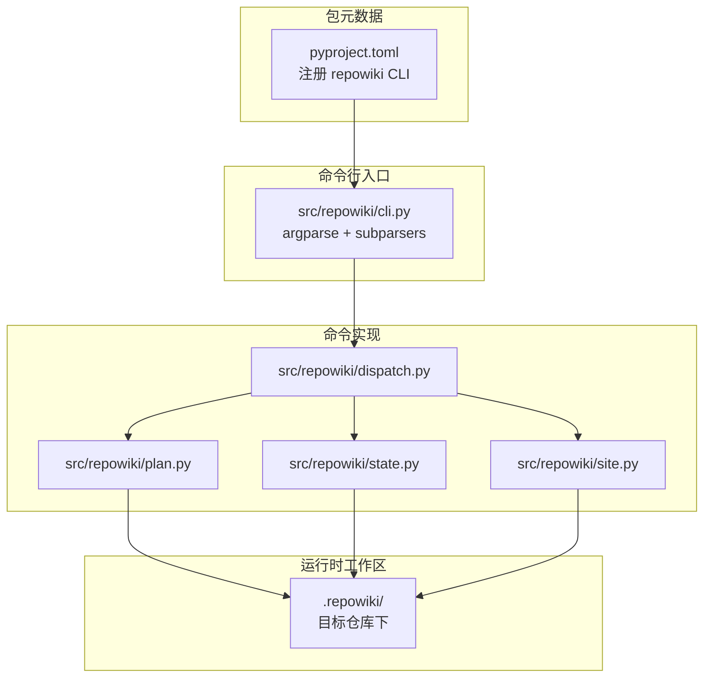
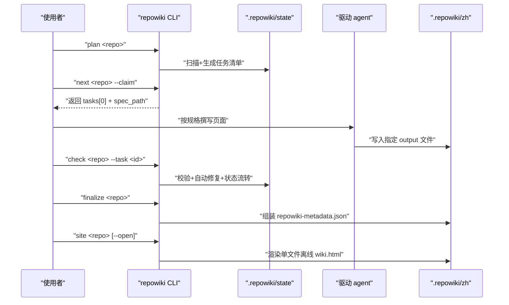
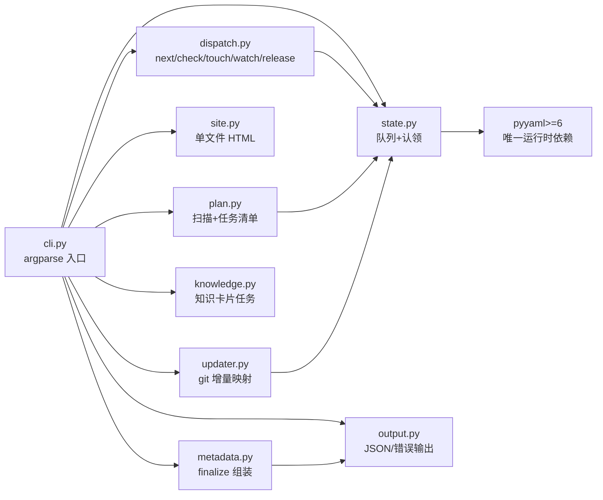

# 快速开始

<cite>
**本文引用的文件**
- [README.md](file://README.md)
- [src/repowiki/cli.py](file://src/repowiki/cli.py)
- [pyproject.toml](file://pyproject.toml)
</cite>

## 更新摘要

**变更内容**
- README 首页不再刻意强调「不含任何 LLM」：首句改为「为任意仓库生成结构化 Wiki 的构建系统。」，特性项「零 LLM 依赖」改为「确定性构建」；首页 ASCII 架构图替换为架构图图片 + 交互版链接（见 [README.md:17-19](file://README.md#L17-L19)）。图块收敛后行号整体位移，本页全部 README 引用重新对齐：安装（67-116 → 60-108）、快速开始（117-141 → 110-133）、单文件站点（142-164 → 135-156）、Worker 循环契约（167-184 → 160-176）、并发配方（185-211 → 178-203）。
- 包元数据与 CLI 自我描述同步精简：`pyproject.toml` description 删去 "Zero LLM, zero network."、版本升至 0.3.3（见 [pyproject.toml:7-8](file://pyproject.toml#L7-L8)）；`cli.py` 的 `--help` 描述同步精简（见 [src/repowiki/cli.py:26-29](file://src/repowiki/cli.py#L26-L29)）。命令注册与行为无任何变化，本页安装与五步命令流程保持原结论。

## 目录
1. [更新摘要](#更新摘要)
2. [简介](#简介)
3. [项目结构](#项目结构)
4. [核心组件](#核心组件)
5. [架构总览](#架构总览)
6. [详细组件分析](#详细组件分析)
7. [依赖关系分析](#依赖关系分析)
8. [性能与一致性考量](#性能与一致性考量)
9. [故障排查指南](#故障排查指南)
10. [结论](#结论)

## 简介
「快速开始」面向第一次接触 repowiki 的使用者，给出从环境准备到产出离线查看站点的最短闭环路径。repowiki 本身是一个**确定性的 Wiki 构建系统**——它负责任务规划、原子认领、产出校验、自动修复与元数据组装；阅读代码、撰写页面这类「理解」工作交给驱动它的 agent CLI（包括 Claude Code、Codex、OpenCode，甚至是人），整个过程**零 API Key、零网络调用、零 agent CLI 依赖**。本节聚焦「5 分钟内对一个示例仓库跑通 plan → next → check → finalize → site」的完整流程，并解释各阶段命令的语义与产物位置。

## 项目结构
围绕快速开始这条主线，仓库内与 CLI 直接相关的产物集中在以下几个位置（路径相对仓库根）：

- `pyproject.toml`：包元数据与脚本入口声明。`[project.scripts]` 节把 `repowiki` 注册为指向 `repowiki.cli:main` 的可执行命令。
- `src/repowiki/`：Python 包本体。`cli.py` 是 argparse 入口；`dispatch.py`、`plan.py`、`state.py`、`output.py` 等模块分别承担命令分发、计划生成、状态读写与错误输出；`site.py` 负责离线 HTML 站点的渲染，`vendor/` 目录携带内嵌的 marked/mermaid 库。
- `skills/repowiki/`：可选的 Agent Skill 目录（符合 SKILL.md 开放约定），告诉 agent 如何按流程调用 CLI，干活本身仍由 `repowiki` 命令完成。
- `README.md`：面向使用者的总说明，包含安装、命令一览、Worker 循环契约等。
- `<目标仓库>/.repowiki/`：每次 `plan` 在被扫描仓库下生成的运行时工作区，承载任务清单、产出页面与最终的离线站点文件。

图表来源
- [pyproject.toml:25-32](file://pyproject.toml#L25-L32)
- [src/repowiki/cli.py:13-22](file://src/repowiki/cli.py#L13-L22)

章节来源
- [pyproject.toml:1-36](file://pyproject.toml#L1-L36)
- [src/repowiki/cli.py:1-142](file://src/repowiki/cli.py#L1-L142)
- [README.md:60-108](file://README.md#L60-L108)

## 核心组件
- `repowiki` CLI 入口：通过 `[project.scripts]` 注册的脚本，由 `cli.py` 的 `main()` 解析 argv 后委派给 `args.func`。
- argparse 子命令集：`plan / next / touch / watch / check / release / finalize / site / update / knowledge / status / clean` 共十二个，每个子命令绑定一个处理函数（`p.set_defaults(func=...)`），由 `cli.py:25-122` 的 `build_parser()` 集中声明。
- 错误类型映射：`ConflictError → exit 2`、`StateError / UsageError → exit 1`，由 `main()` 的 `try/except` 块统一处理并通过 `output.emit_error` 输出 JSON。
- `WikiPaths`：把 `args.repo` 解析为所有子模块共用的路径对象，确保跨命令路径语义一致。

章节来源
- [src/repowiki/cli.py:25-122](file://src/repowiki/cli.py#L25-L122)
- [src/repowiki/cli.py:125-139](file://src/repowiki/cli.py#L125-L139)
- [pyproject.toml:25-26](file://pyproject.toml#L25-L26)

## 架构总览
从使用者视角，完整闭环按下列时序推进：`plan` 把目标仓库扫描成任务清单并落盘到 `.repowiki/state/`；`next --claim` 从全局 FIFO 队列领取一个就绪任务，把任务 ID、规格路径与输出位置返回给驱动 agent；agent 按 `state/tasks/<id>.md` 的规格只写一个 `output` 文件；`check` 校验产出、自动修复确定性缺陷并把状态推进到 `done`；`finalize` 在全部页面任务完成后组装 `metadata.json`（含 catalogs/items/source_files/snippets/relations）；最后 `site` 把所有产物打包成单文件离线 HTML。整个过程是「程序规划、agent 执行、程序校验」的循环，下图给出调用视角。

图表来源
- [README.md:110-133](file://README.md#L110-L133)
- [src/repowiki/cli.py:33-100](file://src/repowiki/cli.py#L33-L100)

章节来源
- [README.md:60-108](file://README.md#L60-L108)
- [src/repowiki/cli.py:1-142](file://src/repowiki/cli.py#L1-L142)

## 详细组件分析

### 安装与 CLI 注册
- 职责：把 `repowiki` 命令装到 Python 环境，并保证三大主流平台（macOS / Linux / Windows）可用。
- 关键行为：`pip install git+https://github.com/luomsis/repowiki.git` 或 `pipx install` 同源地址；已克隆仓库时执行 `pip install -e .`。Windows 走原生路径，并发状态控制自动用 `msvcrt` 文件锁（POSIX 用 `fcntl`）。
- 实现要点：`pyproject.toml:25-26` 的 `[project.scripts]` 把 `repowiki` 映射到 `repowiki.cli:main`，无第三方依赖；离线场景只需 `pyyaml>=6` 一个 wheel。

章节来源
- [README.md:60-108](file://README.md#L60-L108)
- [pyproject.toml:1-26](file://pyproject.toml#L1-L26)

### 命令序列：plan → next → check → finalize → site
- 职责：构成最小闭环，覆盖「规划、领取、撰写、校验、组装、查看」全部阶段。
- 关键行为：
  - `plan ~/code/myrepo` 扫描仓库；代码文件数 <10 时直接拒绝，避免无意义任务爆炸；已有合法 `catalog.json` 时直接展开页面任务，否则先生成 catalog 任务。
  - `next ~/code/myrepo --claim --json` 原子认领就绪任务，并把完整 `instructions` 以 JSON 返回，方便 agent 程序化领取。
  - `check ~/code/myrepo --task c01` 校验产出、自动修复确定性缺陷、把状态推进为 `done`；catalog/knowledge-plan 通过后会自动展开后续任务。
  - `finalize ~/code/myrepo` 在全部任务 done 后组装 `zh/meta/repowiki-metadata.json`；首次运行会先创建 overview 任务，再次运行才会真正产出 metadata。
  - `site ~/code/myrepo [--open]` 把整个 wiki 渲染为单文件离线 HTML（`wiki.html`，约 4-5 MB），带可折叠侧边栏导航、全文搜索（命中高亮）、暗/亮主题、代码块复制按钮、页内目录与阅读进度条；`--open` 在生成后用默认浏览器打开。
- 实现要点：所有命令在 `cli.py:33-100` 注册，每个命令都有自己的 argparse 参数集（如 `--max-pages`、`--since`、`--interval` 等），最终都通过 `p.set_defaults(func=...)` 绑定到具体实现函数。

**章节来源**
- [README.md:110-133](file://README.md#L110-L133)
- [src/repowiki/cli.py:33-100](file://src/repowiki/cli.py#L33-L100)

### 单文件离线站点的打开方式
- 职责：把最终 wiki 交付成一个可双击的文件，无需任何服务。
- 关键行为：`site` 产物为 `<repo>/.repowiki/<locale>/wiki.html`；markdown + mermaid 全部渲染（marked/mermaid 已内嵌进文件本身），引用的源码行区间直接内嵌，点击 `file://` 引用在页内弹层查看带行号高亮的源码；本次更新后站点还带代码块复制按钮、「本页内容」页内目录 + 阅读进度条、上一页/下一页翻页、可折叠章节导航与搜索命中高亮，全部零网络内嵌。
- 实现要点：`pyproject.toml:31-32` 的 `package-data` 声明把 `templates/site.html`、`templates/site/*` 与 `vendor/*.js` 一并打进 wheel，保证离线渲染所需的 HTML/JS 不依赖网络。

章节来源
- [README.md:135-156](file://README.md#L135-L156)
- [pyproject.toml:31-32](file://pyproject.toml#L31-L32)

## 依赖关系分析
- 运行时依赖只有 `pyyaml>=6`（见 `pyproject.toml:13`），离线安装只需 pyyaml 的 wheel 加 repowiki 源码 wheel。
- 可选 `[test] extra` 引入 `pytest>=8` 用于跑测试套；CI 在 ubuntu/macos/windows × Python 3.10-3.13 矩阵回归。
- 内部模块依赖：`cli.py` 同时导入 `dispatch`、`knowledge`、`metadata`、`output`、`paths`、`plan`、`site`、`state`、`updater`，构成「入口 → 各命令实现 → 共享状态/输出」的扇出关系。
- 平台依赖：Windows 使用 `msvcrt` 文件锁，POSIX 使用 `fcntl`，通过平台差异实现并发安全，不引入额外跨平台库。

图表来源
- [src/repowiki/cli.py:13-22](file://src/repowiki/cli.py#L13-L22)
- [pyproject.toml:13](file://pyproject.toml#L13-L13)

章节来源
- [src/repowiki/cli.py:1-142](file://src/repowiki/cli.py#L1-L142)
- [pyproject.toml:13-32](file://pyproject.toml#L13-L32)

## 性能与一致性考量
- 并发安全：原子 `mkdir` 认领 + 目录 mtime 过期判定（默认 15 分钟，`REPOWIKI_STALE_SECONDS` 可调）；多个 worker 可同时跑 `next --claim` 而不会撞车。
- 心跳续期：执行期由 `repowiki touch --task ID` 刷新认领 mtime；短命 CLI 进程记录的 pid 无存活意义，**心跳是唯一存活信号**，建议长任务每 5 分钟 touch 一次。
- 队列自愈：崩溃 / 被杀 worker 的过期认领会在下次 `next` 时被自动回收（改名 `.stale-*` 留痕、`attempts+1`），无需手动 `release --force`；`watch` 不把过期认领计入「执行中」，确保全部死亡可被及时识别而非干等超时。
- 确定性优先：锚点、行号区间、H1、路径分隔符由程序自动修复；只有语义缺陷（缺章节、引用不存在文件、mermaid 不闭合）才判失败。
- 幂等性：`finalize` 与 `site` 都可重跑；`update` 基于 `git diff` 增量重写任务（仅识别已提交变更，工作区未提交改动不可见）。

章节来源
- [README.md:160-176](file://README.md#L160-L176)
- [src/repowiki/cli.py:46-87](file://src/repowiki/cli.py#L46-L87)

## 故障排查指南
- 退出码 `1`：通常是校验失败或用法错误。重新跑 `check --task <id> --json`，按字段修复同一 `output` 文件（不要改仓库源码）。
- 退出码 `2`：状态冲突，最常见是任务被他人认领。先用 `repowiki status` 看当前认领情况；自己仍持有认领时不要 `--force`，等过期回收或显式 `release --force`。
- 退出码 `3`：进展性等待（如 `finalize` 已创建 overview 任务但尚未完成）。再次运行 `finalize` 即可。
- `plan` 拒绝扫描：`代码文件 <10` 的仓库会被直接拒绝；先确认目标仓库不是空仓库或仅含少量脚本。
- `check --task` 报 `ok=false`：阅读 `errors` 字段并修复同一文件后重查；连续 3 次仍失败可 `release --task <id> --force` 放弃。
- 离线机器装不上：先在有网机器上 `pip download PyYAML==6.* -d wheels/` 与 `pip wheel --no-deps -w wheels/ .`，再到目标机 `pip install --no-index wheels/*.whl`；跑测试再额外离线装 `pytest`。
- Windows 锁错误：并发状态控制自动走 `msvcrt`，但若在 WSL / git-bash 下混用 POSIX 工具可能复现，使用 PowerShell 或原生 cmd 即可。

章节来源
- [README.md:60-108](file://README.md#L60-L108)
- [README.md:178-203](file://README.md#L178-L203)
- [src/repowiki/cli.py:130-138](file://src/repowiki/cli.py#L130-L138)

## 结论
repowiki 的快速开始可以浓缩为一条命令链：`plan` 扫描 → `next --claim` 领任务 → 按规格写页面 → `check` 校验 → `finalize` 组装 metadata → `site` 出离线 HTML。CLI 是唯一的「入口面」，所有并发、原子认领、自动修复、确定性保障都藏在 `repowiki` 命令背后，使用者只需要关注「读规格、写一个文件、跑一次 check」。对于第一次使用者，建议先在一个含 10+ 代码文件的小型仓库上完整跑一遍五步流程以熟悉产物结构（`zh/content/`、`zh/meta/`、`wiki.html`），再把同样的流程套到目标仓库上。

章节来源
- [README.md:67-116](file://README.md#L67-L116)
- [src/repowiki/cli.py:1-142](file://src/repowiki/cli.py#L1-L142)
- [pyproject.toml:1-36](file://pyproject.toml#L1-L36)