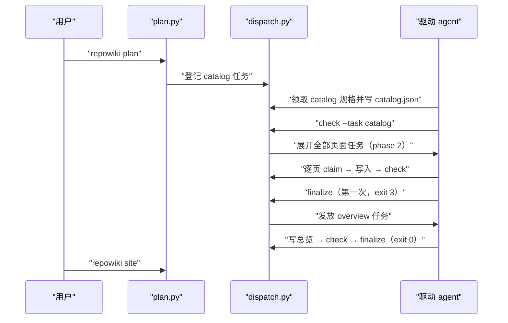
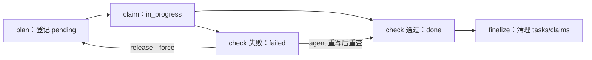

# 端到端构建流程

<cite>
**本文引用的文件**
- [src/repowiki/plan.py](file://src/repowiki/plan.py)
- [src/repowiki/dispatch.py](file://src/repowiki/dispatch.py)
- [src/repowiki/metadata.py](file://src/repowiki/metadata.py)
- [src/repowiki/site.py](file://src/repowiki/site.py)
</cite>

## 目录
1. [简介](#简介)
2. [流程总览](#流程总览)
3. [关键步骤](#关键步骤)
4. [参与组件](#参与组件)
5. [数据与状态变化](#数据与状态变化)
6. [故障排查指南](#故障排查指南)
7. [结论](#结论)

## 简介
本页描述一次完整 wiki 构建的端到端流程：从 `repowiki plan` 扫描仓库开始，到 `repowiki site` 打包出可双击浏览的 `wiki.html` 与 llms 索引结束。流程由用户命令触发，由驱动 agent 与 CLI 交替推进，产出落在目标仓库的 `.repowiki/` 下。流程的核心节奏是「CLI 发规格 → agent 交产出 → check 校验放行」的三拍循环，理解这个节奏后，故障时就知道该看哪个环节的输出。

章节来源
- [src/repowiki/plan.py:38-60](file://src/repowiki/plan.py#L38-L60)

## 流程总览
端到端路径共五步：plan（扫描 + 规划任务）→ catalog（agent 规划章节树，check 展开页面任务）→ pages（agent 逐页撰写，check 逐页校验）→ finalize（两步制汇总元数据）→ site（打包单文件站点 + llms 索引）。三阶段由 phase 门控——catalog 未完成不发放页面任务、页面未完成不发放总览任务，这保证了 agent 拿到的任务永远具备执行前提。下图是完整的消息时序，exit 3 是 finalize 的正常中间态而非错误；下一节的关键步骤编号与图中参与者一一对应：

从图中可以看出两条主线：左侧是任务的"出生"（plan 登记、catalog 展开），右侧是任务的"流转"（claim → check → done）；site 不在前四步的循环里，因为它只是对完成产物的确定性重打包，随时可重跑。

图表来源
- [src/repowiki/dispatch.py:384-418](file://src/repowiki/dispatch.py#L384-L418)

章节来源
- [src/repowiki/plan.py:38-104](file://src/repowiki/plan.py#L38-L104)

## 关键步骤
以下步骤编号与上方时序图的参与者一一对应（步骤 1~2 对应 plan.py，步骤 2~3 对应 dispatch.py 的展开与调度，步骤 4 对应 metadata/site）。

### 步骤 1：plan 扫描与规划（参与者 plan.py）
- 输入：目标仓库路径；可选 --locale（指定产出语言）、--max-pages N（试跑限量）、--replan（重规划）
- 处理：scan() 生成文件清单（git ls-files 优先，.gitignore 感知）→ detect_locale 以 README 的中英字符比定语言 → build_catalog_task 把仓库信息、JSON Schema 与 8 条规划规则渲染成规格落盘（[plan.py:38-75](file://src/repowiki/plan.py#L38-L75)）
- 并发与重试：plan 本身不并发；--replan 遇到在途任务会拒绝（exit 1），加 --force 才重置——防止误伤正在进行的生成
- 失败路径：仓库代码文件少于 MIN_CODE_FILES=10 时有意拒绝，不生成低质量 wiki

章节来源
- [src/repowiki/plan.py:38-104](file://src/repowiki/plan.py#L38-L104)

### 步骤 2：catalog 规划与页面展开（参与者 dispatch.py 的展开环节）
- 输入：catalog 任务规格，内含文件树、38~800 条代码清单、JSON Schema 与规划规则
- 处理：agent 通读清单后规划章节树（含每页 archetype 原型与 page_brief 要点）写入 `state/catalog.json`；check 逐条校验唯一性/深度/文件存在性，通过后 _expand_pages 为每个节点生成页面任务（[dispatch.py:384-418](file://src/repowiki/dispatch.py#L384-L418)）
- 并发与重试：catalog 校验失败置 failed，attempts 达上限 3 后停止发放，需人工 release --force
- 失败路径：id/title/slug 重复、树深超 4、dependent_files 不在仓库清单等逐条报错并打回重写

章节来源
- [src/repowiki/dispatch.py:384-418](file://src/repowiki/dispatch.py#L384-L418)

### 步骤 3：页面并行撰写与校验（参与者 dispatch.py 的调度环节）
- 输入：页面任务规格，内嵌该页 archetype 对应的骨架模板、STYLE 文风规范、参考文件清单与 page_brief
- 处理：agent 读参考文件写页面 → check_page 按 archetype 小节表校验必备小节、引用行号、mermaid 数量，并自动修复锚点/H1/行号终点越界等确定性缺陷（[dispatch.py:319-373](file://src/repowiki/dispatch.py#L319-L373)）
- 并发与重试：原子 mkdir 认领互斥；多 agent/多进程可同时推进不同页面，页间零链接保证无写冲突
- 失败路径：语义缺陷（缺小节、幻觉行号、空引用区间）置 failed 等待重写；done 为终态，check 只读复核不翻转状态

章节来源
- [src/repowiki/dispatch.py:319-373](file://src/repowiki/dispatch.py#L319-L373)

### 步骤 4：finalize 两步制与 site 打包（参与者 metadata.py / site.py）
- 输入：全部任务 done 的状态
- 处理：第一次 finalize 校验完整性后创建 overview 任务并返回 exit 3（进展性等待）；总览完成并 check 后第二次 finalize 聚合 source_files/code_snippets/knowledge_relations 写入 metadata，返回 exit 0（[metadata.py:28-136](file://src/repowiki/metadata.py#L28-L136)）
- 失败路径：缺页则拒绝（缺页门禁，保护 --max-pages 试跑不误产 metadata）；总览未完成则停在 exit 3
- 收尾：`repowiki site` 把页面、源码片段、导航打成 wiki.html 并导出 llms.txt / llms-full.txt，幂等可重跑

章节来源
- [src/repowiki/metadata.py:28-136](file://src/repowiki/metadata.py#L28-L136)

## 参与组件
流程共五个组件参与，两两之间的职责边界清晰：plan/state 负责"让任务存在"，dispatch/validate 负责"让任务正确完成"，metadata/site 负责"让成果可用"。

- plan.py：阶段 1 的扫描与任务登记，含语言检测与幂等展开
- state.py：任务清单存储、认领目录与阶段门控，是所有状态翻转的物理载体
- dispatch.py：next/check/release/touch/watch 的调度核心，含 catalog/知识计划的任务展开
- validate.py：产出校验与自动修复，按 archetype 反查 catalog 决定小节表
- metadata.py / site.py：元数据汇总与离线站点打包，只消费 done 的产出

章节来源
- [src/repowiki/dispatch.py:50-77](file://src/repowiki/dispatch.py#L50-L77)

## 数据与状态变化
流程推进的物理痕迹全部在 `state/` 下：每个任务在 index.json 有一条记录，status 在 pending → in_progress → done/failed 之间迁移；认领目录 `state/claims/<id>` 的创建与删除与 in_progress 对应，过期回收时改名为 `.stale-*` 留审计痕。流程结束后 finalize 清理 tasks/ 与 claims/（运行时数据），保留 catalog/index（规划数据）供增量更新使用。下图是单个任务的状态轨迹：

解读这张图的关键是两条回边：failed → done（重写后重新 check，无需重置状态）与 failed → pending（人工 release 后重新排队）。前者的存在意味着 agent 可以"原地修复"，后者的存在意味着毒任务有逃生门。

图表来源
- [src/repowiki/state.py:199-245](file://src/repowiki/state.py#L199-L245)

章节来源
- [src/repowiki/state.py:219-245](file://src/repowiki/state.py#L219-L245)

## 故障排查指南
本流程的故障定位思路：先看命令退出码定阶段（1=校验/用法、2=冲突、3=等待 finalize），再看该阶段组件的输出明细。常见场景如下：

- watch 退出 1（停滞）：用 status 查是否有 exhausted（attempts 用尽）任务；确认后 release --task <id> --force 重置，或修好产出让重查通过
- finalize 一直 exit 3：总览任务未完成或未 check——看 status 里 overview 任务的 status，写完产出后必须再跑一次 check
- 页面 check 反复失败：先确认失败原因类别——「缺少必备小节」对照该 archetype 小节表补齐；行号类错误打开被引文件核对区间；fixed 列表的项（锚点/H1）已自动修复无需处理
- site 产出缺页面：site 只收集磁盘上真实存在的页面，先确认该页任务确实 done 且文件路径存在

章节来源
- [src/repowiki/dispatch.py:127-203](file://src/repowiki/dispatch.py#L127-L203)

## 结论
这条五步流程适用于任何规模的目标仓库：小仓库跑完五步只需十余个任务、十几分钟；大仓库靠页面并行与断点续跑水平扩展，不需要改任何流程。正确使用方式是让 agent 严格按规格产出、用 check 驱动迭代循环，人工只在目录评审（catalog 评审回路）与语义复核处介入——介入点少，恰恰是确定性编排带来的最大红利。

章节来源
- [src/repowiki/metadata.py:28-60](file://src/repowiki/metadata.py#L28-L60)
