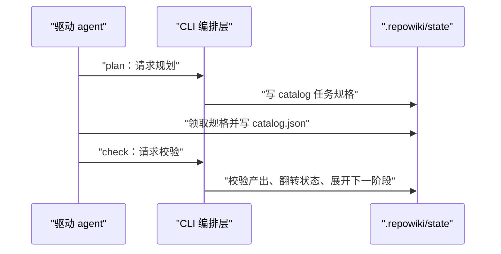
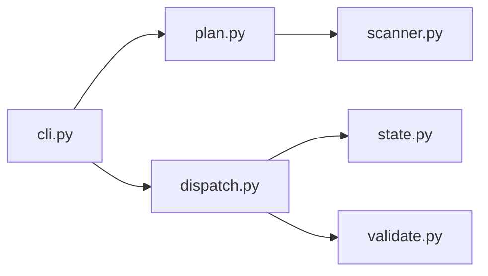

# 项目定位与核心概念

<cite>
**本文引用的文件**
- [README.md](file://README.md)
- [src/repowiki/cli.py](file://src/repowiki/cli.py)
- [src/repowiki/plan.py](file://src/repowiki/plan.py)
- [src/repowiki/errors.py](file://src/repowiki/errors.py)
</cite>

## 目录
1. [简介](#简介)
2. [项目结构](#项目结构)
3. [核心组件](#核心组件)
4. [架构总览](#架构总览)
5. [详细组件分析](#详细组件分析)
6. [依赖关系分析](#依赖关系分析)
7. [性能与一致性考量](#性能与一致性考量)
8. [故障排查指南](#故障排查指南)
9. [结论](#结论)

## 简介
本页界定 repowiki 的定位与贯穿全文档的核心概念。repowiki 不是"调 LLM 生成文档的服务"——它没有模型调用、没有 API Key、没有常驻进程；它是一个确定性的构建系统，与 Make/Nix 同族：把 wiki 生成过程拆成可校验的任务，把语义工作外包给驱动它的 agent，自身只保证过程可复现、可并行、可门禁。

引用官方定位：*"「仓库 → wiki」赛道里，repowiki 的「确定性编排 + 智能外包给任意 agent + 代码不出本机」定位在开源界仍无人重合"*（竞品调研原文）。

关键特征：
- 确定性优先：plan / claim / check / 自动修复全是确定性代码
- 智能外包：绑定任意 coding agent，而非锁死自家模型
- 过程可信：程序化校验 + file:// 引用内嵌真实源码行

章节来源
- [README.md:11-24](file://README.md#L11-L24)

## 项目结构
定位落在代码上的第一个证据是入口的极简，先看与"定位"直接相关的三个文件：

```text
src/repowiki/
├── cli.py      # 15 个子命令的 argparse 定义 + main 路由
├── plan.py     # 构建起点：扫描 + 语言检测 + catalog 任务
└── errors.py   # 三类异常 → 退出码 0/1/2/3 的语义映射
```

- cli.py：用户可见的全部接口骨架，15 个子命令一眼可查
- plan.py：MIN_CODE_FILES=10 的生成门槛也定义在这里
- errors.py：ConflictError（exit 2）/ StateError / UsageError（exit 1）的语义划分

章节来源
- [src/repowiki/cli.py:27-50](file://src/repowiki/cli.py#L27-L50)

## 核心组件
本页的"组件"是贯穿全文档的六个核心概念，先给出定义，后文直接使用：

| 概念 | 承载物 | 一句话定义 |
|---|---|---|
| catalog | state/catalog.json | agent 规划的章节树，wiki 结构的唯一事实来源 |
| 任务规格（spec） | state/tasks/\<id\>.md | 内嵌完整模板与文风规范的不可变 markdown，自包含可并行 |
| claim | state/claims/\<id\>/ | 原子 mkdir 认领，多 worker 互斥的占用凭证 |
| check | validate.py + dispatch | 产出校验器：可计算缺陷自动修复、语义缺陷打回 |
| finalize | metadata.py | 两步制收尾：先总览任务（exit 3）后元数据（exit 0） |
| 扩展点 | 模板资产/原型/知识类别 | 以"资产 + 映射表"形式扩展，不改管线代码 |

章节来源
- [src/repowiki/plan.py:38-75](file://src/repowiki/plan.py#L38-L75)

## 架构总览
「确定性编排 + agent 执行」的双层结构可以从一次 catalog 规划的交互中完整看到：CLI 层负责扫描、规格生成、校验与状态翻转；agent 层消费规格、产出内容。下图是这一循环的时序：



注意图中 agent 对 FS 的两次写入方向相反：第一次写"要做什么"（catalog），第二次写"做出来的东西"（页面产出）；CLI 对 FS 只写规格与状态。三种写入各占其位，任何一方崩溃都不会损坏另两方的数据。

图表来源
- [src/repowiki/dispatch.py:50-77](file://src/repowiki/dispatch.py#L50-L77)

章节来源
- [README.md:53-57](file://README.md#L53-L57)

## 详细组件分析
### 入口与命令分发（cli.py）
- 职责：定义 15 个子命令、公共参数与退出码语义
- 关键行为：main(argv) 把子命令路由到对应 run_* 函数，并把 ConflictError/UsageError 翻译为退出码 2/1——错误语义在入口统一收口

章节来源
- [src/repowiki/cli.py:27-50](file://src/repowiki/cli.py#L27-L50)

### 规划入口（plan.py）
- 职责：扫描仓库、检测产出语言、生成 phase-1 的 catalog 任务
- 实现要点：代码文件数 < MIN_CODE_FILES(10) 直接拒绝生成，避免对不适用仓库产生垃圾产出；已有合法 catalog 则跳过规划直接展开页面任务，plan 因此幂等

章节来源
- [src/repowiki/plan.py:38-104](file://src/repowiki/plan.py#L38-L104)

### 异常与退出码（errors.py）
- 职责：ConflictError（exit 2）/ StateError / UsageError（exit 1）的语义划分
- 配置面：REPOWIKI_STALE_SECONDS（认领过期窗口，默认 900 秒）与 REPOWIKI_MAX_ATTEMPTS（毒任务上限，默认 3）两个环境变量，是全部可调参数

章节来源
- [src/repowiki/errors.py:12-21](file://src/repowiki/errors.py#L12-L21)

## 依赖关系分析
本页涉及的依赖分为两档，全在基础设施层与入口层之间，方向单一：

- 必选：cli → plan/dispatch（编排层）、plan → scanner/i18n/tasks（构建与基础层）——缺任何一个模块 CLI 都无法工作
- 禁止：基础层 import 上层业务模块——state.py 出现对 dispatch.py 的依赖即为分层违例



这张依赖图的走向与「源码分层与依赖方向」一页的四层模型完全一致——入口层只连接编排层，编排层往下直达机制层与基础层，没有任何反向箭头。

图表来源
- [src/repowiki/cli.py:8-25](file://src/repowiki/cli.py#L8-L25)

章节来源
- [src/repowiki/cli.py:8-25](file://src/repowiki/cli.py#L8-L25)

## 性能与一致性考量
- 目录评审回路：`state/catalog.json` 可人工编辑后重新 plan，是改变生成内容/深度的事实配置面——这是有意设计的"人工在环"入口，也是不引入配置文件的原因
- plan 幂等：重复执行 plan 基于现有 catalog 重生成规格而不重复规划；只有 --replan --force 才会推倒重来
- 语义外包的收益：CLI 不理解任何仓库语义，因此对语言、框架、领域完全中性——同一套流程适用于 Python / Go / 前端仓库，变的只有规格里的引导语

章节来源
- [src/repowiki/plan.py:116-139](file://src/repowiki/plan.py#L116-L139)

## 故障排查指南
本章范围的故障集中在 plan 阶段，定位思路是先看退出码语义、再看 errors 明细：

- plan 报「代码文件太少」：MIN_CODE_FILES=10 的有意拒绝，合成仓库/纯文档仓库不适用本工具
- catalog 任务校验失败：按 errors 逐条修（id/title/slug 全局唯一、dependent_files 必须在仓库清单内、page_brief 非空）
- 产出语言不对：`--locale zh|en` 显式覆盖自动检测；检测结果持久化在 state/locale，plan 后再改 CLI 参数不会影响已生成规格的语言
- --replan 被拒绝（exit 1）：存在在途任务，先等 watch 归零或 --force 强制重置

章节来源
- [src/repowiki/plan.py:17-27](file://src/repowiki/plan.py#L17-L27)

## 结论
repowiki 的定位是"wiki 的确定性构建系统"：catalog、任务规格、claim、check、finalize 五个概念构成骨架，双层架构是骨架的组织方式。带着这五个概念读后续章节——端到端流程是它们的时序，分层架构是它们的静态结构，编排机制是它们的并发语义。

章节来源
- [README.md:11-24](file://README.md#L11-L24)
