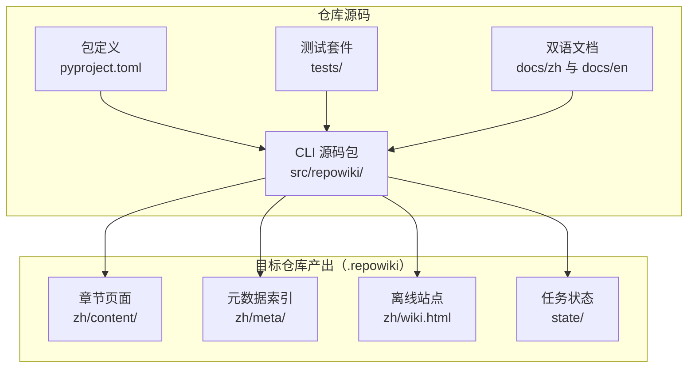
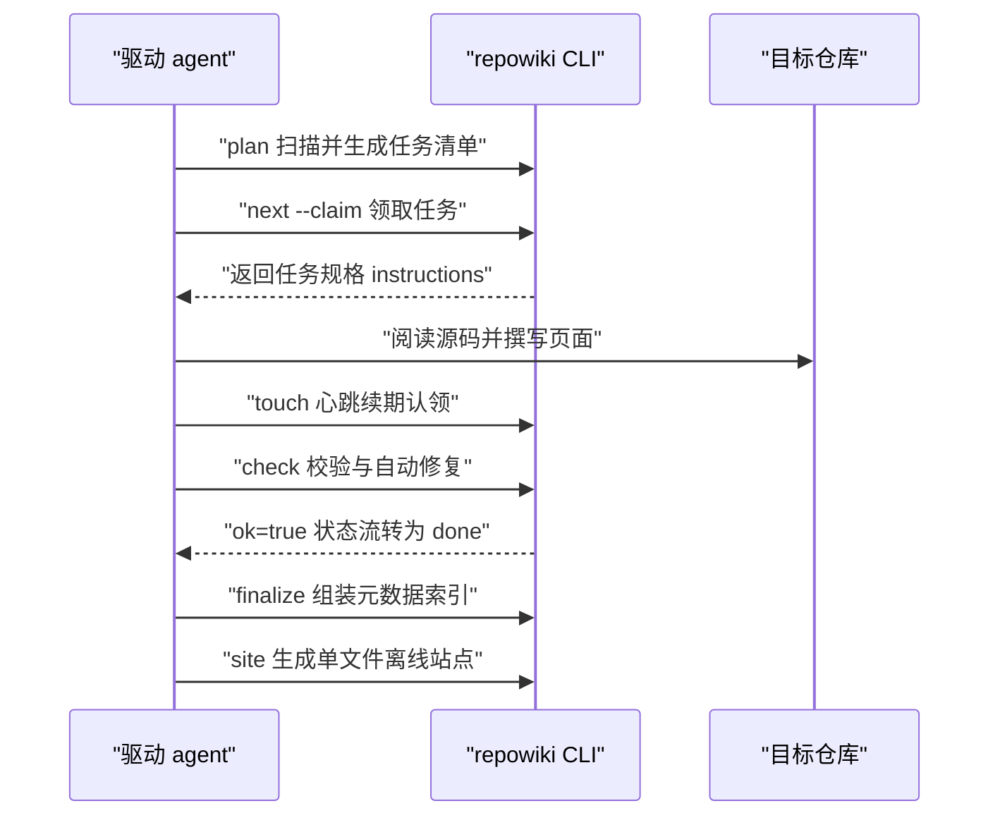
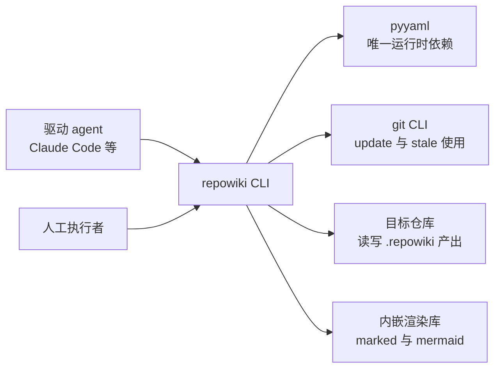

# 项目概述

## 目录
1. [简介](#简介)
2. [项目结构](#项目结构)
3. [核心组件](#核心组件)
4. [架构总览](#架构总览)
5. [详细组件分析](#详细组件分析)
6. [依赖关系分析](#依赖关系分析)
7. [性能与一致性考量](#性能与一致性考量)
8. [故障排查指南](#故障排查指南)
9. [结论](#结论)

## 简介

repowiki 是一个为任意代码仓库生成结构化 Wiki 的确定性构建系统：它本身不包含任何 LLM，只负责任务规划、原子认领、产出校验、自动修复与元数据组装；读代码、写 wiki 的智能工作则交给驱动它的 agent（Claude Code / Codex / OpenCode 等 agent CLI，或人）完成 [README.md:10-15](file://README.md#L10-L15)。这一「确定性编排 + 智能写作」的职责分离，使 repowiki 做到零 API Key、零网络调用、零 agent CLI 依赖，任何「能跑 shell + 读写文件」的执行者都能参与，包括多执行者并发 [README.md:12-14](file://README.md#L12-L14)。Wiki 产出语言自动跟随目标仓库（中文仓库产出 `zh/`，英文仓库产出 `en/`）[README.md:15](file://README.md#L15)。本页是整份 Wiki 的开篇，介绍项目的定位、设计理念、仓库整体结构与核心机制，为后续各章节提供全局背景。

## 项目结构

- `src/repowiki/`：CLI 的 Python 源码包，按职责拆分为 20 余个模块——入口 `cli.py`、扫描 `scanner.py`、规划 `plan.py` 与 `catalog.py`、任务与状态 `tasks.py` 与 `state.py`、校验 `validate.py`、站点与索引 `site.py` 与 `llms.py`、增量更新 `updater.py`、覆盖率统计 `coverage.py` 等；
- `tests/`：pytest 单元测试，共 187 个，覆盖竞态、孤儿认领自动回收、校验规则正反例、增量映射、过期门禁、覆盖率统计、双语产出等场景 [README.md:275](file://README.md#L275)；
- `docs/`：项目文档，`zh/` 与 `en/` 为镜像目录，同名文件一一对应，含领域词汇表 `CONTEXT.md`、决策记录 `DECISIONS.md` 与架构决策记录（ADR）[README.md:311-320](file://README.md#L311-L320)；
- `.repowiki/`（位于目标仓库下的运行时产出目录）：`zh/content/` 章节页面、`zh/meta/repowiki-metadata.json` 元数据索引、`zh/wiki.html` 单文件离线站点、`knowledge/zh/` 知识卡片、`state/` 任务状态 [README.md:135-148](file://README.md#L135-L148)；
- `pyproject.toml`：包定义，声明包名 `repowiki-cli`、入口脚本、模板与渲染库等打包数据 [pyproject.toml:5-15](file://pyproject.toml#L5-L15)。

**图表来源**
- [README.md:135-148](file://README.md#L135-L148)
- [pyproject.toml:42-46](file://pyproject.toml#L42-L46)

**章节来源**
- [README.md:135-148](file://README.md#L135-L148)
- [pyproject.toml:42-46](file://pyproject.toml#L42-L46)
- [README.md:311-320](file://README.md#L311-L320)

## 核心组件

- 确定性编排器（repowiki CLI）：以 `plan` / `next` / `touch` / `check` / `release` / `finalize` / `site` / `update` / `stale` / `coverage` / `status` / `clean` 等子命令承担规划、领取、心跳、校验、增量更新与发布的全流程 [README.md:225-243](file://README.md#L225-L243)；入口脚本定义为 `repowiki = "repowiki.cli:main"` [pyproject.toml:39-40](file://pyproject.toml#L39-L40)。
- 任务与任务规格：编排器发放的最小工作单元，含唯一 id、类型、产出路径与规格；任务规格内嵌完整写作指引（模板、文风、hint 文件清单），使任何 worker 无需额外上下文即可执行 [docs/zh/CONTEXT.md:49-55](file://docs/zh/CONTEXT.md#L49-L55)。
- Worker 循环契约：`next` 领取、按规格撰写、`touch` 心跳续期、`check` 校验的标准化参与方式，任何执行者（subagent / 进程 / 人）均可按此参与，多个循环可同时运行 [README.md:180-196](file://README.md#L180-L196)。
- Wiki 页面：wiki 的基本写作单元，一个 markdown 文件，固定模板结构（引用块、目录、必备小节、mermaid 图）；按原型分 module（结构型，默认）与 flow（流程型）两种 [docs/zh/CONTEXT.md:15-17](file://docs/zh/CONTEXT.md#L15-L17) [README.md:170-174](file://README.md#L170-L174)。
- 源码引用：页面中指向仓库源文件（可带行区间）的 `file://` 链接，保证每段结论可回溯到代码 [docs/zh/CONTEXT.md:27-29](file://docs/zh/CONTEXT.md#L27-L29)。
- 元数据索引：finalize 产出的机器可读索引，含章节树、源文件、代码片段及其与页面的关系 [docs/zh/CONTEXT.md:31-33](file://docs/zh/CONTEXT.md#L31-L33)。
- 知识卡片：可选生成的六类机制卡片（配置、日志、错误处理等）与模块文档，独立于页面体系 [docs/zh/CONTEXT.md:35-37](file://docs/zh/CONTEXT.md#L35-L37)。
- Wiki 站点：finalize 后由 `site` 命令生成的单文件离线 HTML 查看产物，内嵌全部页面、渲染库与被引用的源码行，浏览器双击即看 [docs/zh/CONTEXT.md:39-41](file://docs/zh/CONTEXT.md#L39-L41)。

**章节来源**
- [README.md:225-243](file://README.md#L225-L243)
- [pyproject.toml:39-40](file://pyproject.toml#L39-L40)
- [docs/zh/CONTEXT.md:9-41](file://docs/zh/CONTEXT.md#L9-L41)
- [README.md:170-176](file://README.md#L170-L176)

## 架构总览

一次完整的 wiki 构建是驱动 agent 与 repowiki CLI 的多轮交互：CLI 负责规划、发放与校验等确定性环节，agent 在每个任务内完成读码与写作，队列清空后由 finalize 与 site 收尾 [README.md:124-133](file://README.md#L124-L133)。单个任务的执行遵循 worker 循环契约：领取后只写规格指定的 output 文件，执行期定期心跳，校验通过后状态流转为 done [README.md:184-196](file://README.md#L184-L196)。

**图表来源**
- [README.md:124-133](file://README.md#L124-L133)
- [README.md:184-196](file://README.md#L184-L196)

**章节来源**
- [README.md:124-133](file://README.md#L124-L133)
- [README.md:180-196](file://README.md#L180-L196)

## 详细组件分析

### 确定性与智能工作的职责分离

- 职责：把「读代码、写 wiki」的智能留给任意可替换的 agent，把其余一切——任务规划、原子认领、产出校验、自动修复、断点续跑——做成确定性构建系统 [README.md:25-26](file://README.md#L25-L26)。
- 关键行为：相较于云端 AI wiki 服务（代码出域、智能不可换、产出黑盒）与「让一个 agent 直接通读仓库」（大仓库上下文装不下、中断即前功尽弃、难以并行）两条现成路线，repowiki 的差异化在于代码不出域、智能来源任选、任务切分支持大仓库、状态落盘支持续跑、多 worker 原子认领支持并行、模板强制加程序化校验保证质量 [README.md:21-38](file://README.md#L21-L38)。
- 实现要点：plan / claim / check 全部是确定性代码，不绑定任何 agent CLI，无需 API Key、零网络调用 [README.md:42](file://README.md#L42)。

**章节来源**
- [README.md:21-38](file://README.md#L21-L38)
- [README.md:40-51](file://README.md#L40-L51)

### 任务模型与阶段门控

- 职责：以「任务」为最小工作单元驱动整个流程；任务状态只有 pending / in_progress / done / failed / exhausted 五种 [docs/zh/CONTEXT.md:49-51](file://docs/zh/CONTEXT.md#L49-L51)。
- 关键行为：阶段门控规定「目录规划 → 页面 → 总览」的顺序，前置阶段未完成时后续任务不发放 [docs/zh/CONTEXT.md:57-59](file://docs/zh/CONTEXT.md#L57-L59)；流程的第一个任务是目录规划，由 agent 阅读仓库后产出章节树与各页面纲要，是后续所有页面任务的依据 [docs/zh/CONTEXT.md:45-47](file://docs/zh/CONTEXT.md#L45-L47)。
- 实现要点：任务规格随任务内嵌完整的模板、文风与 hint 文件清单，换取任务自包含与并行安全——每个页面任务可被任意 worker 独立完成 [docs/zh/CONTEXT.md:53-55](file://docs/zh/CONTEXT.md#L53-L55) [README.md:284-287](file://README.md#L284-L287)。

**章节来源**
- [docs/zh/CONTEXT.md:45-59](file://docs/zh/CONTEXT.md#L45-L59)
- [README.md:284-288](file://README.md#L284-L288)

### 并发安全与队列自愈

- 职责：让多个 agent、进程或人同时安全参与同一个仓库的 wiki 构建 [README.md:43](file://README.md#L43)。
- 关键行为：认领是 worker 对某个任务的一次原子独占，同一任务同一时刻至多一个有效认领 [docs/zh/CONTEXT.md:67-69](file://docs/zh/CONTEXT.md#L67-L69)；worker 执行期间靠 `touch` 心跳定期续期，心跳是唯一的存活信号 [docs/zh/CONTEXT.md:75-77](file://docs/zh/CONTEXT.md#L75-L77)；超过心跳窗口未续期的认领成为过期认领，会被自动回收并重新入队，这就是队列自愈 [docs/zh/CONTEXT.md:71-73](file://docs/zh/CONTEXT.md#L71-L73)。
- 实现要点：认领通过原子 `mkdir` 完成，过期判定基于目录 mtime（默认 15 分钟，`REPOWIKI_STALE_SECONDS` 可调）；过期认领由 `next` 自动回收重新入队（改名 `.stale-*` 留痕、attempts+1，毒任务上限照常生效），无需人工释放；repowiki 是短命 CLI 进程，记录的 pid 无存活意义，因此心跳是唯一存活信号 [README.md:260-267](file://README.md#L260-L267)。

**章节来源**
- [README.md:260-267](file://README.md#L260-L267)
- [docs/zh/CONTEXT.md:63-77](file://docs/zh/CONTEXT.md#L63-L77)

### 校验与自动修复

- 职责：程序化保证每页产出符合模板与引用规范，只有语义缺陷才判任务失败。
- 关键行为：锚点、行号区间、H1、路径分隔符由程序自动修复；语义缺陷（缺章节、引用不存在文件、mermaid 不闭合）才判失败 [README.md:268-269](file://README.md#L268-L269)。
- 实现要点：每个正文章节末尾强制「章节来源」、每个 mermaid 图后强制「图表来源」，源码引用使用统一格式——方括号内为「文件路径:起行-止行」，链接目标为同一仓库相对路径加行号锚点的 `file://` 链接；页面之间零链接，正因如此所有页面任务可完全并行 [README.md:170-176](file://README.md#L170-L176)。

**章节来源**
- [README.md:170-176](file://README.md#L170-L176)
- [README.md:268-269](file://README.md#L268-L269)

### 产出物与消费接口

- 职责：把完成的 wiki 变成人类可浏览、机器（agent / IDE）可按索引消费的产物。
- 关键行为：`site` 命令把整个 wiki 打包成一个自包含 HTML 文件（约 4-5 MB），markdown 与 mermaid 全部渲染，被引用的源码行区间直接内嵌，点击 `file://` 引用可在页内弹层查看带行号高亮的源码，完全离线可用 [README.md:159-166](file://README.md#L159-L166)；`site` 同时导出 `llms.txt` / `llms-full.txt`（llmstxt.org 约定），任何 agent / IDE 按索引直接读 wiki，无需 MCP [README.md:48](file://README.md#L48)。
- 实现要点：finalize 产出的元数据索引只含可读字段（catalogs/items/source_files/snippets/relations），不输出内部运行时状态 [README.md:279](file://README.md#L279)；CI 侧另有 wiki 过期门禁与 GitHub Pages 发布的现成 workflow [README.md:246-258](file://README.md#L246-L258)。

**章节来源**
- [README.md:159-168](file://README.md#L159-L168)
- [README.md:279-282](file://README.md#L279-L282)
- [README.md:246-258](file://README.md#L246-L258)

## 依赖关系分析

- 运行时依赖：唯一的第三方依赖是 `pyyaml>=6` [pyproject.toml:15](file://pyproject.toml#L15)；这也使离线安装只需仓库源码（或 wheel）、pyyaml 的 wheel 与目标机上的 Python ≥ 3.10 三样东西 [README.md:98-100](file://README.md#L98-L100)。
- 外部工具：`update` 依赖目标仓库本地的 git CLI（`git diff` / `git rev-parse`），git 预装的机器无需额外配置；repowiki 自身零网络 [README.md:121-122](file://README.md#L121-L122)。
- 上游驱动方：任何「能跑 shell + 读写文件」的执行者——agent CLI 或人——都可以驱动 repowiki [README.md:14](file://README.md#L14)。
- 内嵌资产：`site` 产物把 marked / mermaid 渲染库（MIT）内嵌进 HTML 文件本身，渲染发生在浏览器端，CLI 运行时不依赖它们 [README.md:166](file://README.md#L166)；模板、站点样式与 skill 文件均随包打包分发 [pyproject.toml:45-46](file://pyproject.toml#L45-L46)。

**图表来源**
- [pyproject.toml:5-15](file://pyproject.toml#L5-L15)
- [README.md:98-122](file://README.md#L98-L122)
- [README.md:166](file://README.md#L166)

**章节来源**
- [pyproject.toml:5-15](file://pyproject.toml#L5-L15)
- [README.md:98-122](file://README.md#L98-L122)
- [README.md:45-46](file://README.md#L45-L46)

## 性能与一致性考量

- 大仓库适配：任务切分、逐页生成，避免单一 agent 上下文装不下整个仓库的问题 [README.md:33](file://README.md#L33)。
- 并行加速：多 worker 原子认领天然并行；页面间零链接使所有页面任务相互独立、可完全并行，N=3~6 个 subagent 即可显著提速 [README.md:35](file://README.md#L35) [README.md:176](file://README.md#L176) [README.md:200-202](file://README.md#L200-L202)。
- 一致性与续跑：每任务状态落盘（`state/index.json`），随时中断随时继续，崩溃不留孤儿认领；产出语言持久化于 `state/locale` [README.md:44](file://README.md#L44) [README.md:270](file://README.md#L270)。
- 存活判定：认领默认 15 分钟过期（`REPOWIKI_STALE_SECONDS` 可调），过期即自动回收；watch 不把过期认领计入「执行中」，worker 全部死亡时停滞可被及时报告而非干等超时 [README.md:262-267](file://README.md#L262-L267)。
- 产物体积：单文件站点约 4-5 MB，渲染库内嵌，双击即看；finalize 成功后自动瘦身，清除 `state/claims/` 与 `state/tasks/` 等运行时产物 [README.md:46](file://README.md#L46) [README.md:272-274](file://README.md#L272-L274)。

**章节来源**
- [README.md:40-51](file://README.md#L40-L51)
- [README.md:260-275](file://README.md#L260-L275)

## 故障排查指南

- `check` 返回 ok=false：按 errors 列出的语义问题修复同一产出文件后重新 check；多次失败可 `release --task <id> --force` 放弃认领 [README.md:190-192](file://README.md#L190-L192)。
- `check` 报「由他人认领」冲突（退出码 2）：该认领已被其他 worker 接手，不争抢、不加 `--force`，回到 `next` 领取新任务即可 [README.md:244](file://README.md#L244)。
- 疑似 worker 死亡、任务长时间无进展：过期认领由 `next` 自动回收重新入队，无需人工释放；可用 `status` 查看进度、失败列表与过期认领 [README.md:230](file://README.md#L230) [README.md:264-266](file://README.md#L264-L266)。
- `watch` 以退出码 1 结束：表示停滞或超时，用 `status` 查看详情并干预 [README.md:232](file://README.md#L232)。
- `finalize` 退出码 3：属正常进展——首次运行创建了总览任务，完成该任务后再次运行 finalize 即可 [README.md:131](file://README.md#L131) [README.md:244](file://README.md#L244)。
- `state/index.json` 或 `catalog.json` 损坏：repowiki 保留现场并明确报错，绝不静默清空任务清单；显式恢复路径是 `plan --replan --force` [README.md:271](file://README.md#L271)。
- 目标仓库过小：代码文件少于 10 个时 `plan` 直接拒绝生成任务清单 [README.md:127](file://README.md#L127)。

**章节来源**
- [README.md:180-196](file://README.md#L180-L196)
- [README.md:244](file://README.md#L244)
- [README.md:260-275](file://README.md#L260-L275)
- [README.md:124-133](file://README.md#L124-L133)

## 结论

repowiki 的一句话定位是「agent 负责聪明，repowiki 负责靠谱」：它把 wiki 构建中一切可确定化的环节做成零依赖的确定性 CLI，而把智能写作开放给任意执行者 [README.md:38](file://README.md#L38)。正确的使用方式是先用 `plan` 生成任务清单，再按 worker 循环「领取-撰写-心跳-校验」直至队列清空，最后以 `finalize` 与 `site` 得到元数据索引与单文件离线站点 [README.md:124-133](file://README.md#L124-L133)。使用时的关键注意事项：一次只持有一个认领、执行期定期 `touch` 心跳、严格遵守任务规格内嵌的模板与源码引用规范，即可在多 worker 并发下获得确定、可回溯、可离线浏览的仓库 Wiki [README.md:180-196](file://README.md#L180-L196)。

**章节来源**
- [README.md:10-15](file://README.md#L10-L15)
- [README.md:38](file://README.md#L38)
- [README.md:124-133](file://README.md#L124-L133)
- [README.md:180-196](file://README.md#L180-L196)

<cite>
**本文引用的文件**
- [README.md](file://README.md)
- [docs/zh/CONTEXT.md](file://docs/zh/CONTEXT.md)
- [pyproject.toml](file://pyproject.toml)
</cite>
