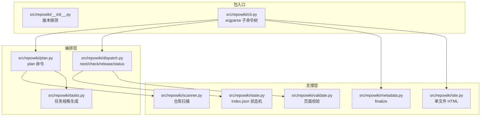
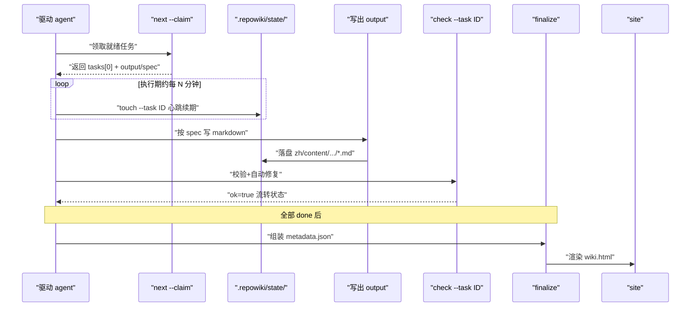
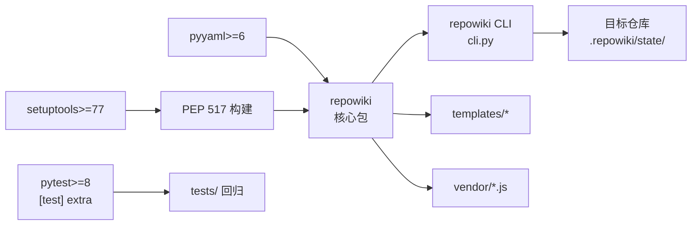

# 项目概述

<cite>
**本文引用的文件**
- [README.md](file://README.md)
- [docs/zh/CONTEXT.md](file://docs/zh/CONTEXT.md)
- [docs/zh/DECISIONS.md](file://docs/zh/DECISIONS.md)
- [pyproject.toml](file://pyproject.toml)
- [src/repowiki/__init__.py](file://src/repowiki/__init__.py)
- [src/repowiki/cli.py](file://src/repowiki/cli.py)
</cite>

## 目录
1. [更新摘要](#更新摘要)
2. [简介](#简介)
3. [项目结构](#项目结构)
4. [核心组件](#核心组件)
5. [架构总览](#架构总览)
6. [详细组件分析](#详细组件分析)
7. [依赖关系分析](#依赖关系分析)
8. [性能与一致性考量](#性能与一致性考量)
9. [故障排查指南](#故障排查指南)
10. [结论](#结论)

## 更新摘要

**变更内容**
- README 首页不再刻意强调「不含任何 LLM」：首句改为「为任意仓库生成结构化 Wiki 的构建系统。」（见 [README.md:10](file://README.md#L10)），特性列表中「零 LLM 依赖」同步改为「确定性构建」，零 API Key、零网络调用的能力表述保持不变（见 [README.md:42-49](file://README.md#L42-L49)）。
- README 首页的 ASCII 架构图替换为绘制的架构图图片，并附交互版架构图链接（见 [README.md:17-19](file://README.md#L17-L19)）；图块收敛为两行后，后续章节行号整体位移，本页所有 README 引用区间已重新对齐。
- 包元数据与 CLI 自我描述同步精简：`pyproject.toml` 的 description 删去 "Zero LLM, zero network."、版本号升至 0.3.3（见 [pyproject.toml:7-8](file://pyproject.toml#L7-L8)）；`__init__.py` 模块 docstring（见 [src/repowiki/__init__.py:1-4](file://src/repowiki/__init__.py#L1-L4)）与 CLI `--help` 描述（见 [src/repowiki/cli.py:26-29](file://src/repowiki/cli.py#L26-L29)）同步更新。
- 以上均为文档与元数据层面的变更，编排与校验逻辑未受影响，本页对架构与组件行为的描述保持原结论。

## 简介
repowiki 是一个面向任意代码仓库的「确定性 Wiki 构建系统」。CLI 本身是一套确定性代码：只负责扫描仓库、规划任务、原子认领、产出校验、自动修复与元数据组装，零 API Key、零网络调用；真正读代码、写 markdown 的「智能工作」交给驱动它的 agent（Claude Code / Codex / OpenCode 等 agent CLI，或人）。任何「能跑 shell + 读写文件」的执行者都可作为 worker 参与，N 个 worker 可以同时跑且互不干扰。Wiki 产出语言自动跟随目标仓库——中文仓库产出在 `zh/`、英文仓库产出在 `en/`——也可由 `plan --locale` 显式指定。这种「确定性构建系统 + agent 智能写作」的双层架构，是它与一般「LLM 直接生成文档」工具的关键区别。

README 的「为什么是 repowiki」一节把它的定位讲得更直白：给仓库生成 wiki 的现成方案主要有两条路——云端 AI wiki 服务（代码要上传、按量付费、产出是黑盒）与让一个 agent 直接通读仓库现写（大仓库上下文装不下、中断即前功尽弃、难以并行）。repowiki 走第三条路：读代码、写 wiki 的智能留给任意 agent，其余一切——任务规划、原子认领、产出校验、自动修复、断点续跑——做成确定性构建系统，一句话概括是「agent 负责聪明，repowiki 负责靠谱」。

章节来源
- [README.md:10-15](file://README.md#L10-L15)
- [README.md:21-38](file://README.md#L21-L38)
- [docs/zh/CONTEXT.md:1-5](file://docs/zh/CONTEXT.md#L1-L5)

## 项目结构
与本页主题相关的仓库目录与文件组织如下：

- `src/repowiki/`：repowiki 的 Python 包源码，CLI 与所有编排逻辑都集中在这里。
  - `__init__.py`：包入口与版本探测。
  - `cli.py`：argparse 子命令树与退出码语义。
  - `plan.py` / `dispatch.py`：plan 与 next/check/release/status 编排。
  - `tasks.py`：任务规格生成（与 plan 命令解耦）。
  - `catalog.py` / `scanner.py`：仓库扫描与目录（catalog）数据结构。
  - `state.py`：index.json 状态机的读写。
  - `validate.py`：页面与 mermaid 校验、自动修复。
  - `metadata.py`：finalize 时组装 `repowiki-metadata.json`。
  - `site.py`：单文件离线 HTML 站点渲染。
  - `updater.py`：基于 git diff 的增量更新映射。
  - `knowledge.py`：可选的知识卡片任务集。
  - `paths.py` / `i18n.py` / `output.py` / `errors.py` / `gitutil.py` / `templates.py`：路径解析、字符串表、错误输出、错误类、git 调用与模板渲染。
  - `templates/`：内置的页面模板与单文件站点骨架。
  - `vendor/`：内嵌到 `wiki.html` 的 marked / mermaid 渲染库。
- `tests/`：覆盖并发、孤儿认领、校验正反例、增量映射、知识聚合、双语产出、单文件站点、损坏状态文件等的回归测试。
- `skills/repowiki/`：开放约定的 agent skill（`SKILL.md` 中文与 `SKILL.en.md` 英文两份），告诉 agent 如何按流程调用 CLI。
- `docs/`：集中存放的双语文档目录，`zh/` 与 `en/` 镜像、同名文件一一对应——领域词汇表 `CONTEXT.md`、决策记录 `DECISIONS.md` 与 `adr/` 架构决策记录；版本日志 `CHANGELOG.md`（含 `CHANGELOG.en.md`）位于仓库根部。
- `pyproject.toml`：项目元数据、入口脚本声明（`repowiki = "repowiki.cli:main"`）、唯一运行期依赖 `pyyaml>=6`。
- `README.md` / `README.en.md`：定位（含「为什么是 repowiki」三方对比与特性清单）、安装、快速开始、用法、命令一览、可靠性设计、已知边界、Non-Goals 与 Roadmap。

图表来源
- [README.md:10-15](file://README.md#L10-L15)
- [src/repowiki/cli.py:25-44](file://src/repowiki/cli.py#L25-L44)

章节来源
- [README.md:17-19](file://README.md#L17-L19)
- [README.md:284-293](file://README.md#L284-L293)
- [src/repowiki/cli.py:1-50](file://src/repowiki/cli.py#L1-L50)

## 核心组件
- CLI 入口（`repowiki.cli:main`）：argparse 子命令树与退出码语义；0=成功、1=校验失败/损坏/用法错误、2=状态冲突（被他人认领）、3=进展性等待。
- plan 编排（`src/repowiki/plan.py`）：扫描仓库 → 生成任务清单；目录阶段通过后自动展开页面任务；`--replan --force` 显式恢复路径；产出语言自动检测（README 权重最高）或 `--locale` 显式指定。
- 任务调度（`src/repowiki/dispatch.py`）：next（领取）、touch（心跳）、check（校验+自动修复）、release（释放）、watch（阻塞监控）编排。
- 状态机（`src/repowiki/state.py`）：每任务状态落盘 `state/index.json`，支持断点续跑；flock 串行化读改写以避免 TOCTOU。
- 仓库扫描器（`src/repowiki/scanner.py`）：定位代码文件，构造目录（catalog）数据。
- 校验器（`src/repowiki/validate.py`）：自动修复确定性缺陷（锚点、行号区间、H1、路径分隔符），仅在语义缺陷（缺章节、引用不存在文件、mermaid 不闭合）时判失败。
- finalize 组装（`src/repowiki/metadata.py`）：把全部 done 任务汇总为 `zh/meta/repowiki-metadata.json`；首次运行创建 overview 任务并退出码 3。
- 单文件站点（`src/repowiki/site.py`）：将 wiki 渲染为内嵌 marked/mermaid 的 `wiki.html`，浏览器双击即开。
- 增量更新器（`src/repowiki/updater.py`）：基于 `git diff` 把代码改动映射到需要重写的页面（含祖先链）。
- 路径与锚点（`src/repowiki/paths.py`）：NFC 归一化、文件名清洗、GitHub 风格锚点；这就是「`附录：一键` 的正确锚点是 `附录一键`」等坑的来源。
- 字符串表（`src/repowiki/i18n.py`）：模板多语言驱动；新增语言只需一张字符串表 + 一套模板。
- 知识卡片（`src/repowiki/knowledge.py`）：可选追加六类机制卡片与模块文档。

章节来源
- [README.md:205-222](file://README.md#L205-L222)
- [src/repowiki/cli.py:25-122](file://src/repowiki/cli.py#L25-L122)
- [src/repowiki/__init__.py:1-18](file://src/repowiki/__init__.py#L1-L18)

## 架构总览
运行时交互遵循「驱动 agent ↔ repowiki CLI ↔ 仓库状态目录」三层关系。一次完整的 wiki 生成按阶段门控：阶段1 目录（catalog）→ 阶段2 页面（pages）→ 阶段3 总览（overview）。任意时刻 N 个 worker 可同时跑：每个 worker 通过 `next --claim` 原子领取一个任务（同一任务同一时刻至多一个有效认领），在执行期间用 `touch` 续期（默认 15 分钟过期窗口，`REPOWIKI_STALE_SECONDS` 可调），写完产出后 `check` 校验+自动修复+状态流转；过期认领由 `next` 自动回收并重新入队，无需人工 `release --force`。一份产出落盘在仓库的 `.repowiki/<locale>/content/...` 下，元数据落盘在 `.repowiki/<locale>/meta/repowiki-metadata.json`，最终由 `site` 命令渲染为单文件离线 HTML。

图表来源
- [README.md:164-173](file://README.md#L164-L173)
- [README.md:186-203](file://README.md#L186-L203)

章节来源
- [README.md:158-222](file://README.md#L158-L222)
- [src/repowiki/__init__.py:1-18](file://src/repowiki/__init__.py#L1-L18)

## 详细组件分析
### 任务状态机与并发认领
- 职责：保证同一任务同一时刻至多一个有效认领；崩溃/被杀 worker 的过期认领可自愈；活认领靠 `touch` 心跳续期防误抢。
- 关键行为：原子 `mkdir` 认领 + 目录 mtime 过期判定（默认 15 分钟）；`ready_tasks` 纳入「in_progress 且认领过期」的任务让 `next --claim` 走既有抢占路径自动回收（改名 `.stale-*` 留痕、attempts+1，毒任务上限照常生效）；`watch` 的 in_flight 同步排除过期认领，否则 worker 全死后停滞分支永远不可达，只能干等超时。
- 实现要点：stale 判定统一为 claim 目录 mtime 单一来源（避免 sweep 与 busy 统计打架）；`next` 不接受 `--task`，队列保持纯 FIFO 拉取，按 ID 操作由 `check --task`/`release --task` 承担——按 ID 认领会诱导主会话给 worker 指定任务清单，是实战中认领混战的根源。

章节来源
- [docs/zh/DECISIONS.md:9-13](file://docs/zh/DECISIONS.md#L9-L13)
- [docs/zh/DECISIONS.md:38-49](file://docs/zh/DECISIONS.md#L38-L49)
- [README.md:224-239](file://README.md#L224-L239)

### 页面模板与校验自修复
- 职责：让任何 worker 拿到任务规格即可独立完成；锚点/行号/H1/路径分隔符等确定性问题由程序修复。
- 关键行为：H1 必须且只能是页面标题；`<cite>` 块列出实际引用的文件（3~15 个）；「目录」锚点遵循 GitHub 中文锚点规则（小写、去标点、空格转 `-`）；必备小节末尾附「章节来源」；每个 mermaid 图后附「图表来源」；页间零链接（这是页面任务可以完全并行的根本原因）。
- 实现要点：锚点算法是「删标点、空白转 -」，而非「标点也转 -」——`附录：一键` 的正确锚点是 `附录一键` 不是 `附录-一键`；模板内嵌的标题占位符在规格生成时先渲染为真实标题，避免 agent 忘记替换。

章节来源
- [README.md:152-156](file://README.md#L152-L156)
- [docs/zh/DECISIONS.md:14-17](file://docs/zh/DECISIONS.md#L14-L17)
- [src/repowiki/paths.py:65-74](file://src/repowiki/paths.py#L65-L74)

### 离线产物与单文件站点
- 职责：把整个 wiki 打包成一个自包含的 HTML 文件（`<repo>/.repowiki/<locale>/wiki.html`，约 4-5 MB）。
- 关键行为：markdown + mermaid 全部渲染，引用的源码行区间直接内嵌，点击 `file://` 引用在页内弹层查看带行号高亮的源码；内置侧边栏导航、全文搜索、暗色/浅色主题；完全离线（marked/mermaid 已内嵌进文件本身）；幂等可重跑；`clean` 后也能重建（章节顺序退化为目录序，内容不受影响）。
- 实现要点：渲染库随 vendor/ 一起打包；CLI 包数据声明包含 `templates/site.html` 与 `templates/site/*`、`vendor/*.js`。

章节来源
- [README.md:135-156](file://README.md#L135-L156)
- [pyproject.toml:31-32](file://pyproject.toml#L31-L32)

### 增量更新与目录幂等
- 职责：在仓库已生成过 wiki 后，把新代码改动映射到需要重写的页面。
- 关键行为：`update [--since <sha>]` 把 git diff → 受影响页面（含祖先链）→ 增量重写任务（附「更新摘要」）；仅识别已提交变更（since..HEAD），工作区未提交改动不可见。
- 实现要点：`update` 的增量映射依赖 `catalog.json` 的 `dependent_files` 与树结构——`metadata.json` 无 kind 字段无法重建页面路径，故 `finalize` 成功也只清运行时产物（`state/claims/`、`state/tasks/`），保留 `index.json`/`catalog.json`/`knowledge.json` 供增量更新与幂等重跑。

章节来源
- [README.md:217](file://README.md#L217)
- [docs/zh/DECISIONS.md:27-30](file://docs/zh/DECISIONS.md#L27-L30)

## 依赖关系分析
- 唯一运行期依赖：`pyyaml>=6`，见 `pyproject.toml` 的 `dependencies`。
- 构建依赖：`setuptools>=77`，作为 PEP 517 构建后端。
- 测试可选依赖：`pytest>=8`（`[test]` extra）。
- CLI 入口脚本：`repowiki = "repowiki.cli:main"`，被包安装后生成同名可执行命令。
- 包数据：`templates/*/*`、`templates/site.html`、`templates/site/*`、`vendor/*.js` 都被打入 wheel，保证离线安装即可渲染。
- 平台 classifier：明确标注支持 macOS、POSIX Linux、Microsoft Windows；并发状态控制自动使用 `msvcrt` 文件锁（POSIX 用 `fcntl`），全部功能在 PowerShell / cmd / git-bash 下可用。
- 离线生态：运行时零网络；离线安装只需仓库源码（或 wheel）、pyyaml 的 wheel 与目标机 Python ≥ 3.10 三样东西；`update` 依赖目标仓库本地的 git CLI（`git diff` / `git rev-parse`），git 预装的机器无需额外配置；`file://` 引用解析、程序化领取依赖 `jq` 属常见但非必需。

图表来源
- [pyproject.toml:1-36](file://pyproject.toml#L1-L36)

章节来源
- [pyproject.toml:1-36](file://pyproject.toml#L1-L36)
- [README.md:60-108](file://README.md#L60-L108)

## 性能与一致性考量
- 并发安全：原子 `mkdir` 认领 + 目录 mtime 过期判定（默认 15 分钟，`REPOWIKI_STALE_SECONDS` 可调）；`index.json` 用 flock 串行化读改写（mtime 复查有 TOCTOU 窗口，6×12 压测丢 3 次更新）。
- 队列自愈：崩溃/被杀 worker 的过期认领由 `next` 自动回收重新入队（改名 `.stale-*` 留痕、attempts+1，毒任务上限照常生效），无需人工 `release --force`；活认领靠 `touch` 心跳续期防误抢（repowiki 是短命 CLI 进程，记录的 pid 无存活意义，心跳是唯一存活信号）。
- 确定性优先：锚点、行号区间、H1、路径分隔符由程序自动修复；只有语义缺陷（缺章节、引用不存在文件、mermaid 不闭合）才判失败。
- 断点续跑：每任务状态落盘（`state/index.json`），随时中断随时继续；产出语言持久化于 `state/locale`。
- 损坏防护：`state/index.json` 或 `catalog.json` 损坏时保留现场并明确报错（绝不静默清空任务清单），`plan --replan --force` 为显式恢复路径。
- 阶段门控：catalog → pages → overview 三阶段；attempt 计数每次 claim attempts+1（含首次），ready 排序 attempts 升序——失败任务不插队，新任务优先，避免坏任务拖死 worker。
- 任务自包含：每个任务规格内嵌完整模板与文风规范（约 4-6k tokens），换取任务自包含与并行安全；小上下文 agent 可将规格中的模板段落替换为 `templates/` 目录的引用。
- 测试覆盖：回归测试覆盖竞态、孤儿认领自动回收、校验规则正反例、增量映射、知识聚合、双语产出（zh/en）、单文件站点生成、损坏状态文件与非法输入的友好报错（`pytest`；CI 矩阵覆盖 ubuntu/macos/windows × Python 3.10-3.13）。

章节来源
- [README.md:224-239](file://README.md#L224-L239)
- [docs/zh/DECISIONS.md:31-37](file://docs/zh/DECISIONS.md#L31-L37)
- [docs/zh/DECISIONS.md:25-26](file://docs/zh/DECISIONS.md#L25-L26)

## 故障排查指南
- 现象：worker 在他人执行中时提前退出。成因：缺少 `busy` 信号；worker 契约必须改为「空且 busy>0 → 等待重试」。
- 现象：新鲜认领被误判为过期并遭抢占。成因：以 claim 目录内 ts 文件为准（mkdir 之后才写 ts，期间被误判为无限旧）。解决：stale 判定统一为 claim 目录 mtime 单一来源。
- 现象：agent 忘记替换模板里的标题占位符。成因：占位符遗留在产出里。解决：page 任务规格内嵌的页面模板中标题占位符在规格生成时先渲染为真实标题。
- 现象：锚点计算结果错位（`附录：一键` → `附录-一键`）。成因：用「标点也转 -」的错误算法。解决：GitHub 规则是「删标点、空白转 -」；正确锚点为 `附录一键`。
- 现象：40 页并发生成，一 worker 退出后遗留 15 个认领冻结队列 50 分钟。成因：`ready_tasks` 完全排除 in_progress，死 worker 的认领只能人工 `release --force`。解决：`ready_tasks` 纳入「in_progress 且认领过期」的任务，`next --claim` 走既有抢占路径自动回收。
- 现象：worker 全死后停滞分支永远不可达，只能干等超时。成因：`watch` 的 in_flight 把过期认领也算作执行中。解决：watch 的 in_flight 同步排除过期认领。
- 现象：6×12 压测丢 3 次更新。成因：`index.json` 用 mtime 复查有 TOCTOU 窗口。解决：用 flock 串行化读改写。
- 现象：catalog 任务重复生成（已存在合法 catalog.json 仍创建 catalog 任务）。成因：缺少幂等判断。解决：`plan` 遇到已存在且合法的 catalog.json 时不再创建 catalog 任务，直接展开页面任务；`--replan` 清空重来。
- 现象：overview 总览在结构性重构后漏掉新章节。成因：overview 不参与增量更新。解决：结构性重构后建议 `plan --replan` 全量重生成。
- 现象：损坏的 `state/index.json` 被静默清空。成因：缺防护。解决：损坏时保留现场并明确报错，`plan --replan --force` 为显式恢复路径。
- 现象：task_id 在命令间出现「由他人认领」冲突（退出码 2）。成因：认领归属校验失败。解决：在 spec 阶段下不要 `--force` 争抢，回到 `next` 拉取新任务。

章节来源
- [docs/zh/DECISIONS.md:7-13](file://docs/zh/DECISIONS.md#L7-L13)
- [docs/zh/DECISIONS.md:31-49](file://docs/zh/DECISIONS.md#L31-L49)
- [README.md:205-222](file://README.md#L205-L222)
- [README.md:228-230](file://README.md#L228-L230)

## 结论
repowiki 是一个把「Wiki 生成」拆成「确定性构建系统 + agent 智能写作」的仓库级工具：CLI 不调用任何 LLM、不发起任何网络请求，只负责扫描、规划、原子认领、校验、自修复与元数据组装；写作交给任何「能跑 shell + 读写文件」的 worker，可单进程串行、subagent 并发、headless agent CLI 无人值守多种姿势使用。它的正确使用方式是先 `plan` 拿到任务清单，再让 worker 进入「`next` → 写产出 → `touch` → `check` → `next`」的循环；遇到并行瓶颈时 spawn N 个 worker 并跑即可，认领过期会自动回收、确定性问题会自动修复。使用时需注意任务规格是自包含的（模板+文风内嵌），中途换语言需 `plan --replan`，overview 不参与增量更新。**已更新** 本次增量更新对齐了 v0.3.3 的自我描述调整（README 与包元数据不再刻意强调「不含 LLM」，改为「确定性构建」表述）与首页架构图替换（ASCII 图 → 架构图图片 + 交互版链接）；编排与校验逻辑未变，架构结论不受影响。

章节来源
- [README.md:1-15](file://README.md#L1-L15)
- [README.md:259-264](file://README.md#L259-L264)
- [docs/zh/DECISIONS.md:7-8](file://docs/zh/DECISIONS.md#L7-L8)
