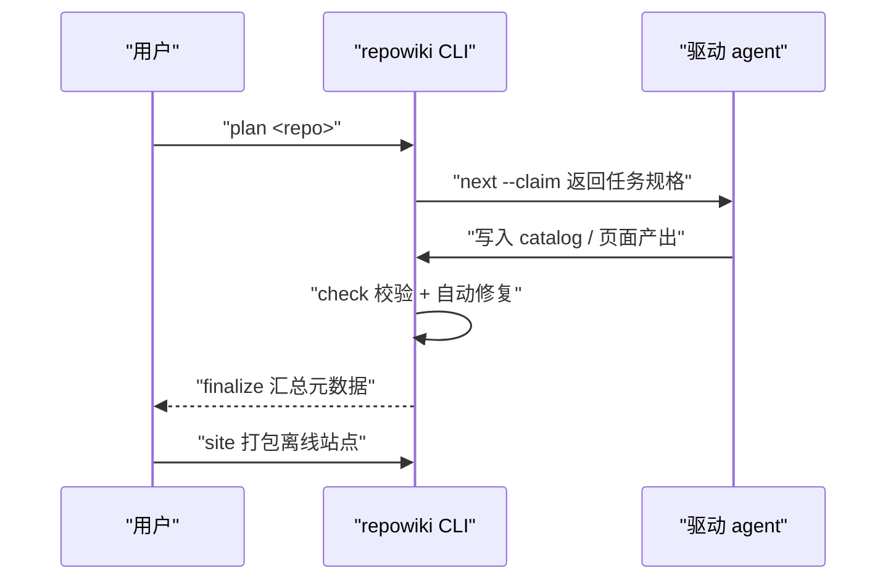
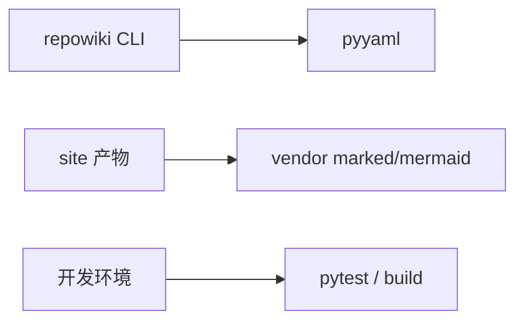

# 项目概述

<cite>
**本文引用的文件**
- [README.md](file://README.md)
- [pyproject.toml](file://pyproject.toml)
- [src/repowiki/cli.py](file://src/repowiki/cli.py)
</cite>

## 目录
1. [简介](#简介)
2. [项目结构](#项目结构)
3. [核心组件](#核心组件)
4. [架构总览](#架构总览)
5. [详细组件分析](#详细组件分析)
6. [依赖关系分析](#依赖关系分析)
7. [性能与一致性考量](#性能与一致性考量)
8. [故障排查指南](#故障排查指南)
9. [结论](#结论)

## 简介
repowiki 为代码仓库生成结构化 Wiki（mermaid 图 + file:// 源码引用），全部产出位于目标仓库的 `.repowiki/` 目录。它的核心设计是把"确定性"与"智能"分离：CLI 自身零 API Key、零网络调用、不绑定任何 agent CLI，只负责任务规划、原子认领、产出校验与自动修复这些可计算的工作；读代码、写 wiki 的语义工作全部交给驱动它的 agent（Claude Code / Codex / 人）。

引用官方 README 对它的定位：*"repowiki 是一个确定性的构建系统：负责任务规划、原子认领、产出校验、自动修复、元数据组装；智能工作（读代码、写 wiki）由驱动它的 agent 完成"*。

关键特征：
- 纯本地工具：Python ≥ 3.10，运行时依赖仅 pyyaml
- 双语产出：zh/en 跟随目标仓库自动检测
- 多 agent 并行：原子认领 + 断点续跑，页间零链接天然无写冲突

章节来源
- [README.md:11-24](file://README.md#L11-L24)

## 项目结构
仓库是标准的 src 布局 Python 项目，先看目录树再谈分工：

```text
src/repowiki/
├── cli.py                  # 入口层：15 个子命令
├── plan.py / dispatch.py / updater.py    # 编排层：规划/调度/增量
├── state.py / tasks.py / catalog.py / validate.py  # 机制层
├── site.py / metadata.py / llms.py       # 呈现层
└── templates/{zh,en}/      # 双语模板资产（随包分发）
tests/                       # 无 LLM 端到端测试（模拟 agent 写入）
.github/workflows/           # ci / pypi / wiki 三条流水线
```

- src/repowiki：单一 Python 包，约 21 个模块按职责自然分层
- src/repowiki/templates：页面骨架 + 任务规格 + 站点壳 + vendor 渲染库，全部作为数据文件分发
- tests：合成仓库夹具 + 按机制拆分的测试模块
- docs/zh、docs/en：双语使用文档、决策记录与竞品调研

章节来源
- [src/repowiki/cli.py:27-50](file://src/repowiki/cli.py#L27-L50)

## 核心组件
repowiki 的功能面由三组组件构成——编排组件驱动流程、机制组件承载规则、呈现组件负责产物，理解分工就掌握了心智模型：

| 组件 | 关键文件 | 一句话职责 |
|---|---|---|
| CLI 入口 | src/repowiki/cli.py | 定义 15 个子命令与 0/1/2/3 退出码约定 |
| 任务存储 | src/repowiki/state.py | index.json 原子读写、认领互斥、阶段门控 |
| 产出校验 | src/repowiki/validate.py | 规则引擎：可计算缺陷自动修复、结构性缺陷打回 |
| 规格渲染 | src/repowiki/tasks.py | 把 catalog 章节树渲染成自包含任务规格 |
| 扩展点 | src/repowiki/templates.py | 页面原型/模板资产/知识类别均可配置，扩展以资产+映射表形式加入 |

章节来源
- [src/repowiki/cli.py:35-165](file://src/repowiki/cli.py#L35-L165)

## 架构总览
一次 wiki 构建是「CLI 编排 + agent 执行」的交替循环：CLI 把要做的事写成自包含的任务规格落盘，agent 领取规格、读写仓库后交回产出，CLI 校验并放行下一阶段。两层之间只通过文件系统与退出码交互，这是任何 agent CLI 都能驱动它的根本原因。下图是一次典型构建中的消息流：



从图可以看出关键点：agent 从不直接改任务状态，状态翻转只发生在 check 里；CLI 从不生成内容，只生成规格与校验结论。这个单向约定让多 agent 并发时无需任何额外协调协议。

图表来源
- [src/repowiki/cli.py:170-187](file://src/repowiki/cli.py#L170-L187)

章节来源
- [README.md:53-57](file://README.md#L53-L57)

## 详细组件分析
本章是全文档的地图，三个子页按"定位 → 流程"展开。先看导航表，判断阅读顺序：

| 子页 | 核心机制 | 一句话职责 |
|---|---|---|
| 项目定位与核心概念 | catalog / 任务规格 / claim / check / finalize 五概念 | 建立全文档的心智模型 |
| 端到端构建流程 | plan → catalog → pages → finalize → site 五步 | 给出流程的时序与阶段门控 |

### 编排器（plan / dispatch / updater）
- 职责：三个用户可见阶段的驱动者——规划任务清单、调度领取与校验、增量重写
- 关键行为：阶段门控（catalog → pages → overview）保证依赖顺序，前一阶段未完成不发放后一阶段任务
- 实现要点：编排器不实现具体机制，机制全部委托下层，因此编排逻辑薄且容易替换

章节来源
- [src/repowiki/plan.py:38-104](file://src/repowiki/plan.py#L38-L104)

### 机制层（state / tasks / catalog / validate）
- 职责：被编排器复用的确定性机制——任务存储、规格渲染、章节树校验、产出校验
- 实现要点：全部是纯函数或小类，除 state 的文件锁外无隐藏状态，是 230+ 条测试的主覆盖区

章节来源
- [src/repowiki/catalog.py:45-135](file://src/repowiki/catalog.py#L45-L135)

### 呈现层（site / metadata / llms）
- 职责：把完成的内容组装成单文件离线站点、元数据 JSON 与 llms 索引
- 关键行为：全部幂等可重跑——finalize、update 或手动改页面后随时重建站点

章节来源
- [src/repowiki/site.py:36-89](file://src/repowiki/site.py#L36-L89)

## 依赖关系分析
运行时依赖被刻意压到最低，三条依赖线互不相交、任一变化不波及其他：

| 依赖 | 最低版本 | 作用 |
|---|---|---|
| pyyaml | 任意可用版本 | 唯一运行时第三方依赖（YAML front matter 解析） |
| marked + mermaid（vendor） | mermaid 11.17.2 | 站点内嵌渲染库（MIT），用户浏览器零 CDN 依赖 |
| pytest / build（开发） | — | 仅测试与打包需要，不进运行时 |



图中三条依赖边互不相交：运行时、产物内嵌、开发期三条线彼此独立——这也是"拷两个 wheel 即可离线安装"承诺的结构保证。

图表来源
- [pyproject.toml:8-20](file://pyproject.toml#L8-L20)

章节来源
- [pyproject.toml:8-20](file://pyproject.toml#L8-L20)

## 性能与一致性考量
- 并发安全：原子 mkdir 认领 + 心跳续期支持多 agent / 多进程同时推进；index.json 全程文件锁 + 原子替换写，状态翻转零丢失（有专门的多进程回归测试）
- 断点续跑：每任务状态落盘，任何时刻中断都可随时继续；worker 崩溃由过期回收自动自愈，无需人工干预
- 并行度：页间零链接设计使所有页面任务完全并行，N 个 agent 线性加速
- 语义边界：CLI 的确定性承诺只覆盖过程（任务/校验/状态），内容质量由 STYLE 规范与校验器底线共同约束——两层防线各管一段

章节来源
- [src/repowiki/state.py:35-74](file://src/repowiki/state.py#L35-L74)

## 故障排查指南
本章及全文档排错时优先看命令退出码，它是稳定的机器可读契约；其次看 check 输出的 errors 列表，锚点/行号/H1 类缺陷已被自动修复，剩下需要人工处理的是语义问题：

- 命令 exit 1 且提示校验失败：查看 errors 列表逐条修复；多数是产出缺小节或引用行号问题
- exit 2 状态冲突：任务被其他 worker 认领，用 touch 续期自己的认领，或 release --force 重置他人的
- exit 3 不是错误：finalize 两步制的正常信号，总览任务完成后再次执行即可
- 页面一直校验失败：确认页面 archetype 与 catalog 声明一致，再对照该原型的小节表补齐

章节来源
- [src/repowiki/cli.py:2-25](file://src/repowiki/cli.py#L2-L25)

## 结论
repowiki 把「生成 wiki」拆成确定性编排与智能执行两层：CLI 保证过程可复现、可并行、可门禁，agent 专注语义质量。本章建立了全文档的心智模型；后续章节按「端到端流程 → 分层架构 → 编排机制 → 内容产出 → 工程化」的顺序展开，每一层都是本章某个概念的细化。

章节来源
- [README.md:11-24](file://README.md#L11-L24)
