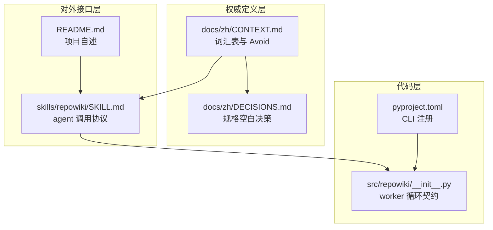
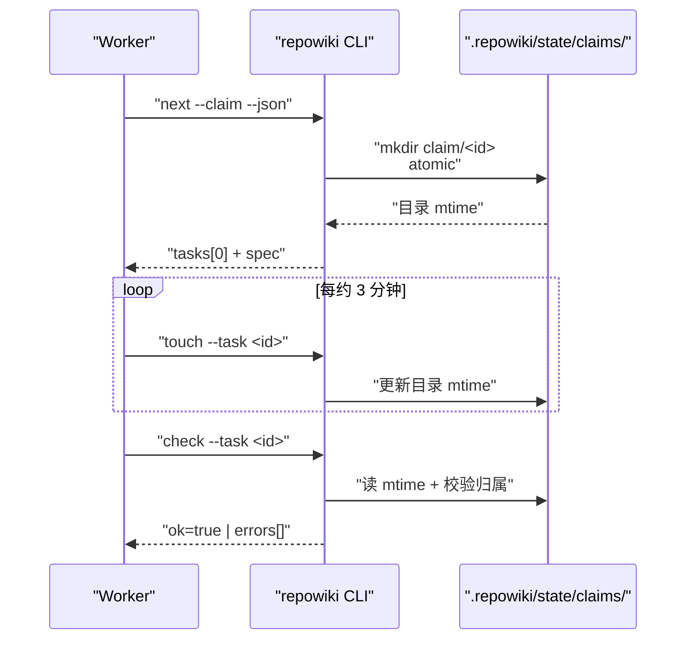
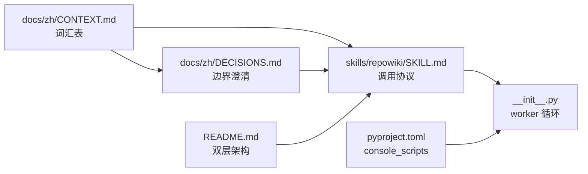

# 领域词汇与设计哲学

<cite>
**本文引用的文件**
- [docs/zh/CONTEXT.md](file://docs/zh/CONTEXT.md)
- [docs/zh/DECISIONS.md](file://docs/zh/DECISIONS.md)
- [skills/repowiki/SKILL.md](file://skills/repowiki/SKILL.md)
- [README.md](file://README.md)
- [pyproject.toml](file://pyproject.toml)
- [src/repowiki/__init__.py](file://src/repowiki/__init__.py)
</cite>

## 目录
1. [更新摘要](#更新摘要)
2. [简介](#简介)
3. [项目结构](#项目结构)
4. [核心组件](#核心组件)
5. [架构总览](#架构总览)
6. [详细组件分析](#详细组件分析)
7. [依赖关系分析](#依赖关系分析)
8. [性能与一致性考量](#性能与一致性考量)
9. [故障排查指南](#故障排查指南)
10. [结论](#结论)

## 更新摘要

**变更内容**
- 文档结构迁移：`CONTEXT.md` 与 `DECISIONS.md` 已从仓库根目录迁移至 `docs/zh/`，并在 `docs/en/` 新增英文对照版，各文档头部新增「中文 | English」切换行；本页全部源码引用路径与行号区间随之更新（如 `file://CONTEXT.md` → `file://docs/zh/CONTEXT.md`）。
- `skills/repowiki/SKILL.md` 头部新增中英文切换行，并新增英文版 `skills/repowiki/SKILL.en.md`；SKILL.md 自身行号整体下移 2 行，本页引用的 worker 循环与并发协议行号区间已同步修正。
- 词汇表内容本身未变：产物四类与扩展四类、编排三概念、执行四概念（含「过期认领」官方词条）在 `docs/zh/CONTEXT.md` 中的定义与 Avoid 反义词保持原样，本页相关小节仅更新引用位置。

章节来源
- [docs/zh/CONTEXT.md:1-5](file://docs/zh/CONTEXT.md#L1-L5)
- [skills/repowiki/SKILL.md:1-8](file://skills/repowiki/SKILL.md#L1-L8)

## 简介

本页面整理 `repowiki` 项目的官方词汇表与底层设计哲学，集中解释为什么一些常见词被刻意回避、为什么另外一些词被刻意固定下来。`repowiki` 是一个确定性构建系统：CLI 只做编排与校验，所有读写代码、撰写文字的环节由 agent 承担；这套分工决定了它的术语边界——任何能驱动 worker 循环的执行者（subagent / 进程 / 人）都属于同一抽象。理解本页的词汇后，读者可以正确判读 SKILL.md 中的并发协议、DECISIONS.md 中的规格空白决策，以及 catalog.json 中每条任务的产物路径为何这样命名。

章节来源
- [docs/zh/CONTEXT.md:1-5](file://docs/zh/CONTEXT.md#L1-L5)

## 项目结构

与「领域词汇与设计哲学」相关的源文件位于 `docs/zh/`、仓库根与 skills 目录：

- `docs/zh/CONTEXT.md` —— 官方词汇表与「Avoid」反义词的权威定义所在，编排三概念（任务/规格/阶段）、执行四概念（Worker/认领/过期认领/心跳）皆出于此；英文对照版位于 `docs/en/CONTEXT.md`。
- `docs/zh/DECISIONS.md` —— 实现过程中对规格空白的最小合理决策记录，包含「刻意回避某些常见词」的设计取舍（如 DECISIONS #11/#12/#13 对生命周期与并发信号的设计）；英文对照版位于 `docs/en/DECISIONS.md`。
- `skills/repowiki/SKILL.md` —— 对外暴露给 agent 客户端的入口文档，描述 plan/next/check/finalize/site 等子命令的标准与并发流程，承接 CONTEXT.md 中的概念；头部带中英文切换行，英文版为 `skills/repowiki/SKILL.en.md`。
- `README.md` —— 项目自述，描述「确定性构建系统 + agent 智能写作」的双层架构，作为概念的总入口。
- `src/repowiki/__init__.py` —— 包级 docstring 浓缩了 worker 循环契约，是词汇表中「执行三概念」在代码层面的最小注脚。
- `pyproject.toml` —— 包元数据与脚本注册（`repowiki = "repowiki.cli:main"`），确认「CLI 入口」与 Python 模块名的绑定。

图表来源
- [docs/zh/CONTEXT.md:1-77](file://docs/zh/CONTEXT.md#L1-L77)

章节来源
- [docs/zh/CONTEXT.md:1-77](file://docs/zh/CONTEXT.md#L1-L77)
- [README.md:1-40](file://README.md#L1-L40)

## 核心组件

Wiki 产物四类：

- **仓库 Wiki**：针对一个目标仓库生成的完整结构化文档集，落在其 `.repowiki/` 目录下；与「文档站点 / docs」严格区分。
- **Wiki 页面**：Wiki 的基本写作单元，一个 markdown 文件，固定模板结构（引用块、目录、必备小节、mermaid 图）；避免称「文章 / entry」。
- **章节**：组织 Wiki 页面的一级主题分组；一个章节可含多个页面；与「目录（与 Catalog 混淆）/ 模块」刻意错开。
- **总览**：面向整份 Wiki 的导读页：仓库简介、章节导航与使用建议，是 finalize 前的最后一个任务；不是 README、不是首页。

编排三概念：

- **任务**：编排器发放的最小工作单元，含唯一 id、类型、产出路径与规格；状态只有 pending / in_progress / done / failed / exhausted；避免称「job / 工单」。
- **任务规格**：随任务内嵌的完整写作指引（模板、文风、hint 文件清单），使任何 worker 无需额外上下文即可执行；避免称「prompt」。
- **阶段**：任务间的顺序门控：目录规划 → 页面 → 总览；前置阶段未完成时后续任务不发放；避免称「step / phase gate」。

执行四概念：

- **Worker**：执行任务循环的任意执行者（subagent / 进程 / 人），通过领取获取任务、用心跳维持持有；避免称「agent（易与驱动 CLI 的 agent 混淆）/ 进程」。
- **认领**：worker 对某个任务的一次原子独占；同一任务同一时刻至多一个有效认领；避免称「锁 / checkout」。
- **过期认领**：超过心跳窗口未续期的认领，会被自动回收并重新入队，即「队列自愈」；避免称「死锁 / 僵尸任务」。
- **心跳**：worker 执行期间对认领的定期续期，是唯一的存活信号；避免称「ping / 健康检查」。

章节来源
- [docs/zh/CONTEXT.md:9-77](file://docs/zh/CONTEXT.md#L9-L77)

## 架构总览

「领域词汇与设计哲学」主题无独立运行时模块，但其在系统中的交互可以从两个层面刻画：一是词汇在文档流中的传播路径（docs/zh/CONTEXT.md → docs/zh/DECISIONS.md → skills/repowiki/SKILL.md → README.md），二是词汇在 worker 循环中的行为载体（claim 目录 → touch 命令 → check 命令）。下图为后者的时序：worker 在 `next --claim` 时获得一个原子认领，期间以 `touch` 维持心跳，完成后通过 `check` 触发校验，CLI 不再依赖任何「agent 存活」的外部信号——认领目录的 mtime 本身就是心跳。

图表来源
- [docs/zh/CONTEXT.md:63-77](file://docs/zh/CONTEXT.md#L63-L77)

章节来源
- [docs/zh/DECISIONS.md:38-49](file://docs/zh/DECISIONS.md#L38-L49)

## 详细组件分析

### Wiki 产物四类与扩展四类

- 职责：定义「一个目标仓库运行完 `repowiki finalize` 之后会留下什么」。CONTEXT.md 将产物分为两小节共八个名词，每条都附了「Avoid」反义词以消除歧义。
- 关键行为：前四类（仓库 Wiki / Wiki 页面 / 章节 / 总览）是页面的体系骨架；扩展四类（源码引用 / 元数据索引 / 知识卡片 / Wiki 站点）是页面可链接 / 可导航 / 可交付的支撑设施。
- 实现要点：`仓库 Wiki` 是 `.repowiki/` 目录这一物理实体；`Wiki 站点` 是 `site` 命令生成的离线 HTML 文件，二者一一对应但语义不同。`总览` 由 finalize 阶段发出，独立于 catalog 规划的页面任务，是 finalize 两步走中的第二步（DECISIONS #7）。

章节来源
- [docs/zh/CONTEXT.md:9-41](file://docs/zh/CONTEXT.md#L9-L41)
- [docs/zh/DECISIONS.md:21-22](file://docs/zh/DECISIONS.md#L21-L22)

### 编排三概念

- 职责：定义 CLI 在「无 LLM」前提下如何把工作切成可校验的最小单元。
- 关键行为：`目录规划` 是整个流程的第一个任务（catalog 任务），由 agent 阅读仓库后产出章节树与各页面纲要；`任务` 是最小发放单元，含 id/type/output/spec；`阶段` 是任务间的顺序门控：目录规划 → 页面 → 总览。
- 实现要点：目录规划在 DECISIONS.md 的规划表述中并不直接称「目录页 / TOC」，因为它产出的不是页面而是 catalog.json；这种用词边界决定了 catalog.json 中 `kind: "chapter"` 与 `kind: "page"` 的两层次划分。

章节来源
- [docs/zh/CONTEXT.md:45-59](file://docs/zh/CONTEXT.md#L45-L59)

### 执行三概念与过期认领

- 职责：定义 worker 循环的协作语义，使任意执行者（subagent / 进程 / 人）可以互换。
- 关键行为：`Worker` 是执行循环的任意主体；`认领` 是 worker 对一个任务的原子独占；`心跳` 是持有期间的存活信号；`过期认领` 补足回收语义——超过心跳窗口未续期的认领被自动回收并重新入队，四者构成「FIFO 拉取 + 原子认领 + 过期回收」的协议基础。
- 实现要点：`Worker` 的「Avoid: agent」极为关键：CLI 已被 agent 驱动，若把 worker 也称为 agent 会让「驱动 CLI 的 agent」与「领任务的 worker」在术语上撞车。`心跳` 的「Avoid: ping / 健康检查」则强调它不是「探测性」的，而是 worker 自愿提交的续期信号；`过期认领` 的「Avoid: 死锁 / 僵尸任务」强调它是可自愈的临时状态，而非需要人工干预的故障终态。

章节来源
- [docs/zh/CONTEXT.md:63-77](file://docs/zh/CONTEXT.md#L63-L77)
- [docs/zh/DECISIONS.md:38-45](file://docs/zh/DECISIONS.md#L38-L45)

### 队列自愈机制

- 职责：定义「过期认领」背后的自愈实现——当 worker 崩溃而未释放认领时，CLI 如何把任务回收回队列。
- 关键行为：超过心跳窗口未续期的认领会被自动回收并重新入队，这就是 DECISIONS #12 中描述的「过期认领自动回收」；stale 判定统一为 claim 目录 mtime 单一来源，避免 sweep 与 busy 统计打架。
- 实现要点：此机制对应 CONTEXT.md 中的「过期认领」官方词条（Avoid: 死锁 / 僵尸任务）；没有它，并发 worker 在崩溃时会冻结队列（DECISIONS #12 记录了 40 页并发下「冻结队列 50 分钟」的实战复现）。CLI 亦不引入 pid 存活检测（DECISIONS #13）：短命 CLI 进程的 pid 不能作为存活信号，自愿的 `touch` 心跳是唯一存活证据。

章节来源
- [docs/zh/DECISIONS.md:38-49](file://docs/zh/DECISIONS.md#L38-L49)
- [docs/zh/CONTEXT.md:71-73](file://docs/zh/CONTEXT.md#L71-L73)

## 依赖关系分析

- `docs/zh/CONTEXT.md` 是 `skills/repowiki/SKILL.md` 的术语上游：SKILL.md 中出现的所有名词都能在 CONTEXT.md 找到权威定义或 Avoid 反义词。
- `docs/zh/DECISIONS.md` 是 `docs/zh/CONTEXT.md` 的边界澄清：当规格空白时（如「认领过期怎么算」），DECISIONS.md 给出 mtime 单一来源的最小决策（#3、#12），并明确不引入 pid 存活检测（#13）。
- `src/repowiki/__init__.py` 的 docstring 是 `docs/zh/CONTEXT.md` 在代码层的最短镜像：`loop: task = repowiki next --claim --json / if empty and busy > 0: wait / execute / check` 把「编排三概念 + 执行概念」压缩成六行 Python 注释。
- `pyproject.toml` 是「CLI 入口」与 Python 模块的绑定点（`repowiki = "repowiki.cli:main"`），它把「repowiki 是 CLI」这一概念从 README.md 落到 setuptools 注册的 `console_scripts` 入口。
- `README.md` 是「双层架构」（确定性构建系统 / agent 智能写作）的对外门面，是 SKILL.md 之前的高层摘要。

图表来源
- [docs/zh/CONTEXT.md:1-77](file://docs/zh/CONTEXT.md#L1-L77)

章节来源
- [skills/repowiki/SKILL.md:25-75](file://skills/repowiki/SKILL.md#L25-L75)

## 性能与一致性考量

- 词汇边界本身是「一致性」的最大来源——CONTEXT.md 在每个术语后附「Avoid」反义词，是为了在 agent 与人协作时把语义对齐的损耗降到最低。
- 「执行概念」的设计使得认领是原子的、心跳是 mtime 单源的：避免了双重判定导致的 stale 误判与 busy 计数打架（DECISIONS #12）。
- 「编排三概念」让阶段门控天然串行：catalog 未完成时 page 任务不发，page 未完成时 overview 不发——这是性能与正确性之间的均衡，避免 worker 在前置未完成时做无用功。
- 「心跳窗口默认 15 分钟」是把「冻结队列上限」与「误抢风险」做的均衡（DECISIONS #12 末尾），worker 遵守 touch 纪律时无误抢。
- 词汇层面不引入 `manifest / 数据库 / agent / TOC / step / phase gate / ping / 健康检查` 等词，是为了减少跨文档阅读时的概念重载——这是「少一个词、少一种歧义」的性能取舍。

章节来源
- [docs/zh/DECISIONS.md:12-13](file://docs/zh/DECISIONS.md#L12-L13)
- [docs/zh/DECISIONS.md:38-45](file://docs/zh/DECISIONS.md#L38-L45)

## 故障排查指南

- 现象：worker 在 `next` 返回 `tasks=[]` 但 `busy>0` 时提前退出。
  - 原因：worker 没有按 SKILL.md 中的并发协议「空且 busy>0 → 等待 30 秒重试」执行。
  - 定位步骤：阅读 SKILL.md 的并发循环段；检查 worker 自己的等待逻辑；对照 DECISIONS #2（busy 信号）。
  - 相关代码位置：[docs/zh/DECISIONS.md:9-11](file://docs/zh/DECISIONS.md#L9-L11)、[skills/repowiki/SKILL.md:57-72](file://skills/repowiki/SKILL.md#L57-L72)。

- 现象：worker 死亡后队列冻结数十分钟。
  - 原因：早期版本没有「过期认领自动回收」机制，死 worker 的认领只能人工 `release --force`。
  - 定位步骤：查看 DECISIONS #12 描述的实战复现；确认当前代码版本是否走 `ready_tasks` 自动回收路径。
  - 相关代码位置：[docs/zh/DECISIONS.md:38-45](file://docs/zh/DECISIONS.md#L38-L45)。

- 现象：check 报「锚点错误」，把 `附录：一键` 生成成 `附录-一键`。
  - 原因：锚点算法用了「标点也转 -」的错误规则。
  - 定位步骤：阅读 DECISIONS #5（锚点算法）；确认目录锚点为 GitHub 风格中文锚点（去 `：` 等标点、空格转 `-`）。
  - 相关代码位置：[docs/zh/DECISIONS.md:16-17](file://docs/zh/DECISIONS.md#L16-L17)。

- 现象：agent 把 worker 也称「agent」，导致文档中两个 agent 角色混在一起。
  - 原因：违反了 CONTEXT.md 中 Worker 的 Avoid 反义词。
  - 定位步骤：在 wiki 页面与对话中统一用「驱动 agent / worker」两个角色；把 worker 视为执行者、把驱动 agent 视为系统调用者。
  - 相关代码位置：[docs/zh/CONTEXT.md:63-65](file://docs/zh/CONTEXT.md#L63-L65)。

- 现象：产物目录被叫成「manifest / 数据库」。
  - 原因：把 `.repowiki/` 当成 manifest 或数据库的代名词。
  - 定位步骤：在文档中固定使用「仓库 Wiki」「元数据索引」（metadata.json）等词汇；不引入 manifest / 数据库。
  - 相关代码位置：[docs/zh/CONTEXT.md:31-33](file://docs/zh/CONTEXT.md#L31-L33)。

- 现象：正文散文里残留 `{{TITLE}}` 之类占位符被校验器判失败，而代码示例中的占位符字面量却可以通过。
  - 原因：占位符扫描只针对非代码文本（DECISIONS #14）——fenced 代码块与行内代码会被剔除后再扫描，「在代码里展示占位符字面量」是合法内容，「在散文里残留占位符」才是缺陷。
  - 定位步骤：检查失败页面正文（代码块之外）是否残留未替换的占位符形态文本。
  - 相关代码位置：[docs/zh/DECISIONS.md:50-54](file://docs/zh/DECISIONS.md#L50-L54)。

章节来源
- [docs/zh/DECISIONS.md:3-17](file://docs/zh/DECISIONS.md#L3-L17)

## 结论

「领域词汇与设计哲学」是整个 repowiki 文档体系的语义基底：docs/zh/CONTEXT.md 把每个核心术语钉死并配以 Avoid 反义词，docs/zh/DECISIONS.md 在规格空白处记录最小决策，skills/repowiki/SKILL.md 把这些决策翻译成 worker 的可执行协议，README.md 与 `__init__.py` 的 docstring 给出最浓缩的双层架构总结与 worker 循环契约。随着文档中心化到 `docs/zh/` 并补齐英文对照版，这套词汇边界现在同时服务中英文读者，但术语本身与 Avoid 约定保持不变。正确理解这层词汇边界，就能在阅读 SKILL.md 的并发循环、阅读 catalog.json 的章节树、以及阅读 DECISIONS.md 的决策记录时不踩进术语陷阱——这是把 repowiki 用对的最低门槛。

章节来源
- [docs/zh/CONTEXT.md:1-77](file://docs/zh/CONTEXT.md#L1-L77)
