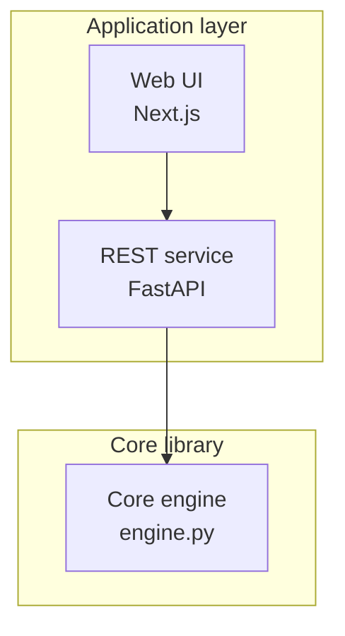
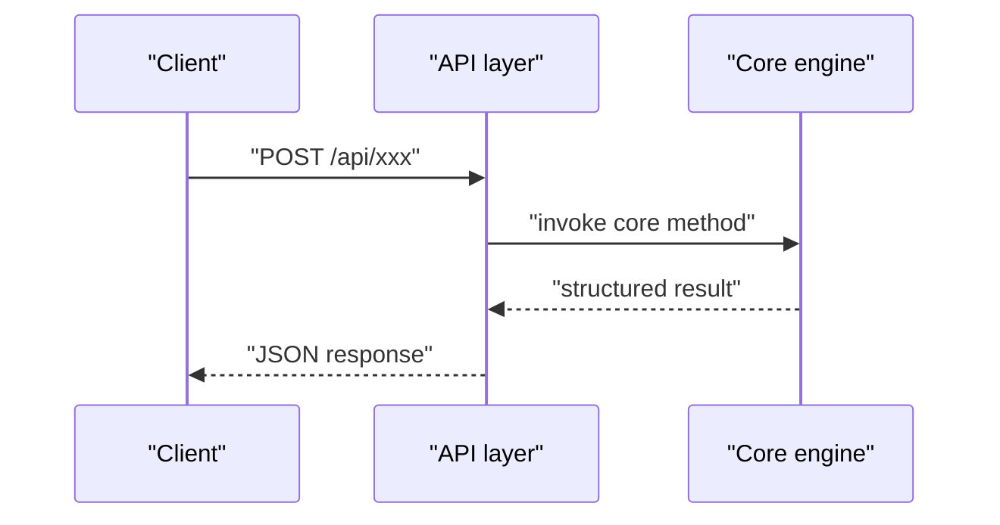

# Style & Diagram Rules (every page must follow)

## Language
- Write plain English; keep code identifiers, class names, file paths, and config keys verbatim.
- Objective, factual tone — no marketing language. No emoji. Narrative prose uses no tables; enumerated lists with multiple attributes per item (e.g. entity|type|constraint, component|key files|responsibility, dependency|min version|role, error code|meaning|trigger) should be rendered as tables, with one sentence before each table explaining how to read it.

## Body density (content quality, mandatory)
- Every body section first explains in 2~4 sentences of prose (what it is, how it works, where the boundaries are), then uses bullets only for enumerable facts; a section that is a single sentence or a single bullet fails the bar.
- Before each mermaid diagram, one sentence states what it shows and why it is worth reading; after the diagram, one sentence interprets the takeaway — diagrams never replace prose.
- Rewrite one-item lists as prose. Each section carries at least ~3 lines of body text (excluding diagrams and source lists).
- Grounding discipline: when evidence runs thin, write the section honestly short with the conceptual-statement disclaimer; never invent files, line numbers, or behavior — fewer sections beats fabricated content.

## Section Sources & Diagram Sources (citation format, mandatory)
- Every body section ends with a "Section sources" list; every mermaid diagram is followed by a "Diagram sources" list.
- Link format (paths relative to the repo root, forward slashes, line ranges must not exceed the file's real length; only an overhanging end is auto-clamped, while a start past EOF or an inverted range is rejected by `check`):
  - `[README.md:1-120](file://README.md#L1-L120)`
  - `src/graphiti/graphiti.py:146-283` → `[graphiti/graphiti.py:146-283](file://graphiti/graphiti.py#L146-L283)`
- Whole-file references may use the shorter form `[nodes.py](file://graphiti_core/nodes.py)` (inside the `<cite>` block).
- Referenced files must really exist in the repository; never link other wiki pages (zero page-to-page links).
- If a section has no corresponding code, write: `[This section is conceptual; no specific files are analyzed, hence no "Section sources"]`

## Mermaid diagram style
- Structure diagrams use `graph TB`, dependency/relationship diagrams `graph LR`, interaction flows `sequenceDiagram`, type relationships `classDiagram`, entity relations `erDiagram`, state transitions `stateDiagram-v2`. Diagram types should match the page archetype (data pages favor `erDiagram`/`stateDiagram-v2`, layer pages favor a layered `graph TB`).
- Syntax notes: node labels in `graph`/`flowchart` must be double-quoted; `stateDiagram-v2` transition labels are written `stateA --> stateB : "trigger"`, with display names via `state "Label" as id` aliases; `erDiagram` entity names use ASCII identifiers, relation labels go inside quotes.
- Node labels must be wrapped in double quotes; wrap long labels with ` ` and keep the key identifier visible:

- sequenceDiagram participants and messages are quoted too:

## Other page conventions
- Exactly one H1 heading, equal to the page title; body levels start at `##`, sub-components use `###`.
- The "Contents" section is a numbered list whose anchors follow GitHub-style anchors (lowercase, punctuation dropped, spaces → `-`, e.g. `Quick Start Guide` → `#quick-start-guide`).
- The Conclusion section states the topic's one-sentence positioning and usage advice.
