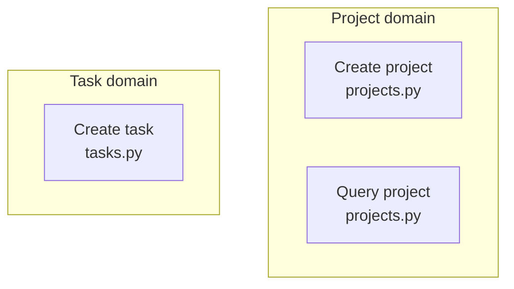

# {{TITLE}}

## Contents
1. [Introduction](#introduction)
2. [Endpoint Inventory and Grouping](#endpoint-inventory-and-grouping)
3. [Request Handling Sequence](#request-handling-sequence)
4. [API Contracts and Error Codes](#api-contracts-and-error-codes)
5. [Authentication and Access Control](#authentication-and-access-control)
6. [Quotas, Idempotency and Rate Limits](#quotas-idempotency-and-rate-limits)
7. [Troubleshooting Guide](#troubleshooting-guide)
8. [Conclusion](#conclusion)

## Introduction
<One paragraph: who these interfaces serve (external callers / CLI users / other processes), what problem they solve, and where they live in the repository.>

## Endpoint Inventory and Grouping
<The interface inventory grouped by functional domain (bullets: interface name → one-line purpose), with a grouping diagram.>

Diagram sources
- [<path>:<from>-<to>](file://<path>#L<from>-L<to>)

Section sources
- [<path>:<from>-<to>](file://<path>#L<from>-L<to>)

## Request Handling Sequence

```mermaid
sequenceDiagram
participant C as "Caller"
participant MW as "Middleware"
participant H as "Handler"
participant S as "Service layer"
C->>MW : "send request"
MW->>H : "validate and route"
H->>S : "invoke business logic"
S-->>H : "result"
H-->>C : "response"
```

<Pick one representative call: the full handling path from client request to response.>

Diagram sources
- [<path>:<from>-<to>](file://<path>#L<from>-L<to>)

Section sources
- [<path>:<from>-<to>](file://<path>#L<from>-L<to>)

## API Contracts and Error Codes
First a short prose paragraph on the contract style; with ≥3 error codes use a table (| Code | Meaning | Trigger |), and attach a file:// citation to each interface in the inventory section.

Section sources
- [<path>:<from>-<to>](file://<path>#L<from>-L<to>)

## Authentication and Access Control
<Authentication method, where permission checks land in the code, and how anonymous vs authorized behavior differs (bullets); without auth, state the current situation and its boundary.>

Section sources
- [<path>:<from>-<to>](file://<path>#L<from>-L<to>)

## Quotas, Idempotency and Rate Limits
<Rate limits, idempotency keys, retry semantics (bullets); without them, state the current situation and what callers must guard themselves against.>

Section sources
- [<path>:<from>-<to>](file://<path>#L<from>-L<to>)

## Troubleshooting Guide
- <common error codes/symptoms → cause → how to locate → relevant code location.>

Section sources
- [<path>:<from>-<to>](file://<path>#L<from>-L<to>)

## Conclusion
<One paragraph: the interface surface's positioning, correct usage, and caveats.>

Section sources
- [<path>:<from>-<to>](file://<path>#L<from>-L<to>)

<cite>
**Files referenced**
- [<file name>](file://<repo-relative path>)
- [<file name>](file://<repo-relative path>)
</cite>
