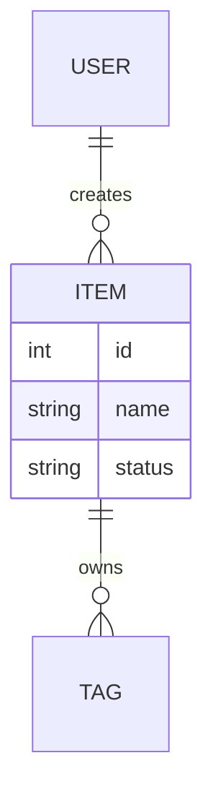
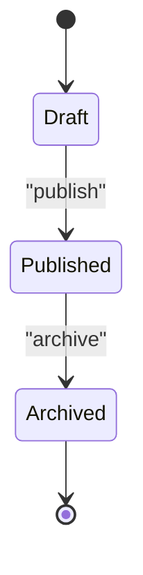
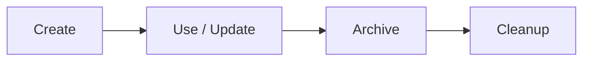

# {{TITLE}}

## Contents
1. [Introduction](#introduction)
2. [Data Model Overview](#data-model-overview)
3. [Core Entity Analysis](#core-entity-analysis)
4. [State Machine](#state-machine)
5. [Storage and Serialization](#storage-and-serialization)
6. [Data Lifecycle](#data-lifecycle)
7. [Troubleshooting Guide](#troubleshooting-guide)
8. [Conclusion](#conclusion)

## Introduction
<One paragraph: which data/entities/states this page covers, why they matter, and where they live in the repository.>

## Data Model Overview
<One paragraph sketching the core entities and their relations, with an ER diagram (entity names in English).>

Diagram sources
- [<path>:<from>-<to>](file://<path>#L<from>-L<to>)

Section sources
- [<path>:<from>-<to>](file://<path>#L<from>-L<to>)

## Core Entity Analysis
### <Entity 1>
- Fields: <key fields and types; with many fields prefer a table: | Field | Type | Constraint/Notes |>
- Constraints: <uniqueness / nullability / referential integrity>
- Invariants: <conditions that must always hold>

Section sources
- [<path>:<from>-<to>](file://<path>#L<from>-L<to>)

### <Entity 2>
- ...

Section sources
- [<path>:<from>-<to>](file://<path>#L<from>-L<to>)

## State Machine
<If there is a status field: list every state and its transition triggers in a stateDiagram-v2 (use `state "Label" as id` aliases for display names); without an explicit state machine, describe the implicit data-state progression.>

Diagram sources
- [<path>:<from>-<to>](file://<path>#L<from>-L<to>)

Section sources
- [<path>:<from>-<to>](file://<path>#L<from>-L<to>)

## Storage and Serialization
First a short prose paragraph on the storage landscape, then bullets: where data lives (memory / files / database), formats, and serialization/deserialization code points.

Section sources
- [<path>:<from>-<to>](file://<path>#L<from>-L<to>)

## Data Lifecycle
<The full path from creation through usage/update to archival/cleanup, with a lifecycle diagram.>

Diagram sources
- [<path>:<from>-<to>](file://<path>#L<from>-L<to>)

Section sources
- [<path>:<from>-<to>](file://<path>#L<from>-L<to>)

## Troubleshooting Guide
- <common data problems (inconsistency / dirty data / concurrency conflicts) → cause → how to locate → relevant code location.>

Section sources
- [<path>:<from>-<to>](file://<path>#L<from>-L<to>)

## Conclusion
<One paragraph: the data model's positioning, correct usage, and caveats.>

Section sources
- [<path>:<from>-<to>](file://<path>#L<from>-L<to>)

<cite>
**Files referenced**
- [<file name>](file://<repo-relative path>)
- [<file name>](file://<repo-relative path>)
</cite>
