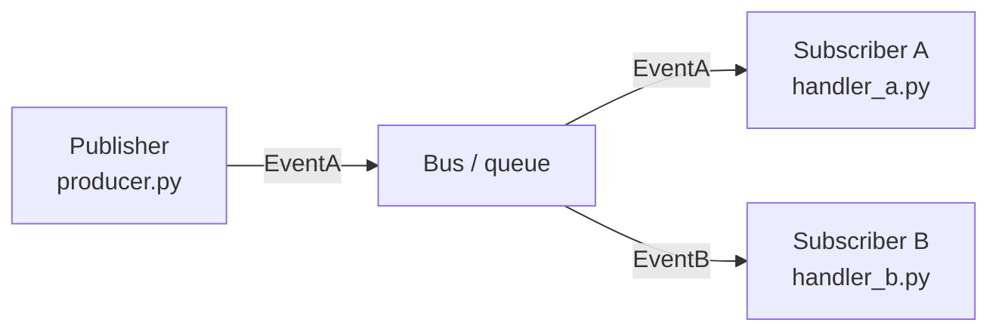
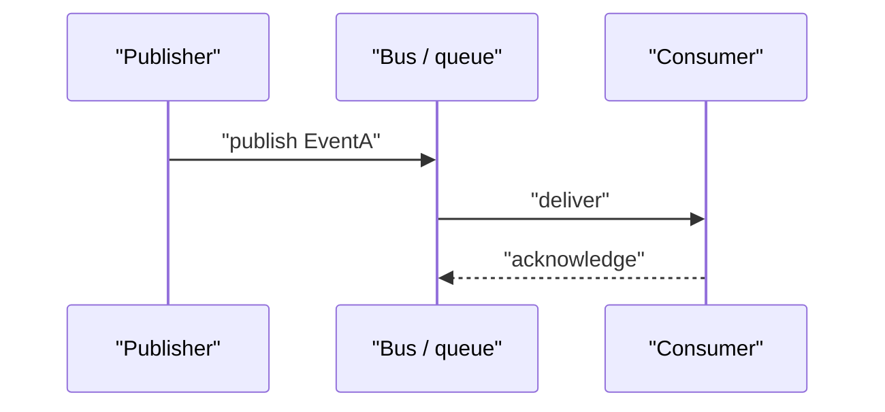

# {{TITLE}}

## Contents
1. [Introduction](#introduction)
2. [Event Inventory](#event-inventory)
3. [Event Flow Topology](#event-flow-topology)
4. [Event Contracts](#event-contracts)
5. [Consumer Handling](#consumer-handling)
6. [Reliability Guarantees](#reliability-guarantees)
7. [Troubleshooting Guide](#troubleshooting-guide)
8. [Conclusion](#conclusion)

## Introduction
<One paragraph: what this event mechanism is, which problem it solves (decoupling / asynchrony / broadcast), and where it lives in the repository.>

## Event Inventory
<The event inventory: with ≥4 events use a table (| Event | Published at | Payload highlights |); few events, bullets.>

Section sources
- [<path>:<from>-<to>](file://<path>#L<from>-L<to>)

## Event Flow Topology
<One paragraph sketching the overall path from publish to consumption, with a topology diagram.>

Diagram sources
- [<path>:<from>-<to>](file://<path>#L<from>-L<to>)

Section sources
- [<path>:<from>-<to>](file://<path>#L<from>-L<to>)

## Event Contracts
<Payload fields, where the schema is defined, versioning/compatibility policy (bullets).>

Section sources
- [<path>:<from>-<to>](file://<path>#L<from>-L<to>)

## Consumer Handling
<Pick one representative event: the sequence from publish to consumption completing and acknowledgement.>

Diagram sources
- [<path>:<from>-<to>](file://<path>#L<from>-L<to>)

Section sources
- [<path>:<from>-<to>](file://<path>#L<from>-L<to>)

## Reliability Guarantees
<Retry policy, idempotency, dead-letter/failure handling, ordering guarantees (bullets); without them, state the current situation and its risks.>

Section sources
- [<path>:<from>-<to>](file://<path>#L<from>-L<to>)

## Troubleshooting Guide
- <common problems (lost events / duplicate consumption / ordering violations) → cause → how to locate → relevant code location.>

Section sources
- [<path>:<from>-<to>](file://<path>#L<from>-L<to>)

## Conclusion
<One paragraph: the event mechanism's positioning, correct usage, and caveats.>

Section sources
- [<path>:<from>-<to>](file://<path>#L<from>-L<to>)

<cite>
**Files referenced**
- [<file name>](file://<repo-relative path>)
- [<file name>](file://<repo-relative path>)
</cite>
